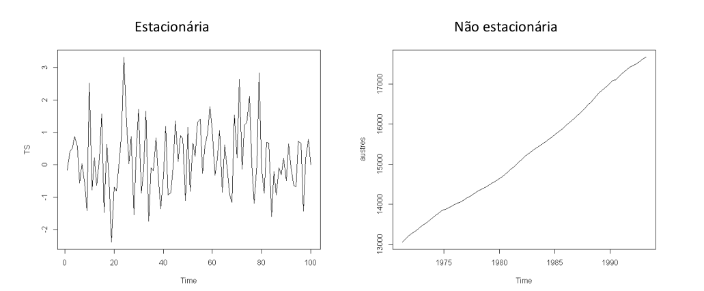
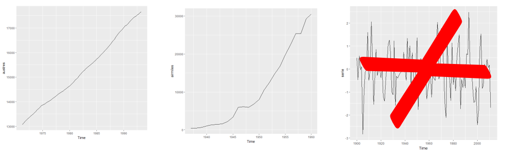
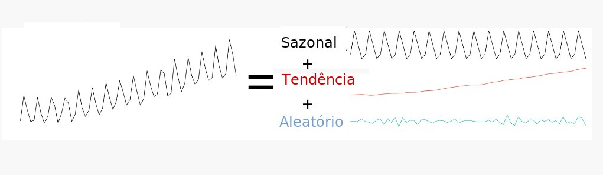

```{r, echo=FALSE}
# Pacotes necessarios
library(zoo)
library(quantmod)
library(DT)
# library(dplyr)
# library(magrittr)
# library(highcharter)
library(PerformanceAnalytics)
library(htmltools)
options(width = 800)
```

# Introdução às Séries Temporais


## O que são Séries Temporais ?

- **Definição**: Entende-se por Séries Temporais (ST) todo e qualquer conjunto de dados (absolutos ou relativos, discretos ou contínuos), ordenados cronologicamente.

- **Condição**: Esses dados seguem uma ordenação em função do tempo (dependência temporal).

- De modo geral, as séries temporais apresentam sequências de observações relativas a determinada variável ao longo de um intervalo específico de tempo (dia, mês, trimestre, ano, etc.), isto é, referem-se a fluxos de valores periódicos, os quais dão uma visão geral sobre o andamento ou comportamento da variável em análise.

- A maneira mais comum de visualizar séries temporais é usar um gráfico de linhas simples, em que o eixo horizontal representa os incrementos de tempo e o eixo vertical representa a variável que está sendo medida.

- Seguem abaixo alguns exemplo de séries temporais:

```{r echo=FALSE, tidy=TRUE, results='asis', warning = FALSE, fig.align='center', fig.height=7}
## devtools::install_github("FinYang/tsdl")
## https://github.com/FinYang/tsdl/tree/master/data-raw
## sarampo <- scan('https://raw.githubusercontent.com/FinYang/tsdl/master/data-raw/epi/mumps.dat',skip = 1) 
## catapora <- scan('https://raw.githubusercontent.com/FinYang/tsdl/master/data-raw/epi/chicknyc.dat',skip=1)
par(mfrow=c(2,2))
 plot(nottem,main='Temperatura Nottingham \n UK, 1920–1939')
 plot(UKDriverDeaths, main='Acidentes fatais em estradas \n Great Britain 1969–84')
 plot(mdeaths,main='Mortes por doenças pulmonares \n homens  UK 1974–1979')
 plot(co2,main='Concentração de CO2 \n 1959 - 1997')
 title(sub = ' fonte: Scripps Institution of Oceanography (SIO), University of California' )
```


<!-- {width=770px} -->

- As séries temporais podem ser de natureza **regular** ou **irregular**. 

    - As **séries temporais regulares ou uniformes** são aquelas que podem ser expressas sempre o mesmo intervalo de tempo (frequência).
    
    - As **séries temporais irregulares ou não uniformes** são aquelas em que as frequencias de tempo são diferentes ou apresentam dados ausentes (*missing data*). Algumas vezes pode-se transformar series em irregulares  agregando ou  interpolando os dados mensurados.


##  Hipóteses básicas do estudo das séries temporais

- Há um sistema causal relacionando as variáveis no tempo;

- Ao longo do tempo, o sistema influencia todos os dados sob análise, de modo regular  e permanente;

- Os dados históricos refletem a influência média de um conjunto de fatores.


Tais hipóteses se baseiam no pressuposto de que as relações apontadas pela experiência pregressa permitem prever o possível comportamento das variáveis sob análises, determinando se seu comportamento apresenta propriedades **determinísticas** e/ou **aleatórias**.


## Classificação dos tipos de séries temporais

- **Contínuas:** A informação é obtida em qualquer intervalo de tempo (podendo ser discretizando em intervalos iguais) ou é acumulada por período.
**Ex:** Temperatura, pluviosidade, partículas em suspensão.


- **Discretas:** Observações obtidas em intervalos de tempo discreto e equidistantes (ano, mês, dias, semanas epidemiológicas).
**Ex:** Mortalidade infantil, notificações por DIC.

- **Multivariada:**  São várias coleções de observações para a mesma sequência de períodos de tempo, ou seja,envolvem mais de uma série histórica.
**Ex:** Número de homicídios e acidentes no Sudeste.

- **Multidimensional:**  São várias coleções de observações para a mesma sequência de períodos de tempo, descrevendo o mesmo fenômeno em diferentes contextos.
**Ex:** Número de AVCs em diversas UFs.

## Processo Estocástico

- Um processo estocástico pode ser pensado de duas formas:

    - um conjunto de possíveis trajetórias de um fenômeno físico que poderiam ser observadas;
    
    - um conjunto de variáveis aleatórias uma para cada tempo $t$.
    
- Cada valor observado de uma trajetória é um dos possíveis valores que poderiam ter sido observado, de acordo com a distribuição de probabilidades da respectiva variável aleatória.

- Definir uma séries temporais consiste em determinar as funções matemáticas que apontam suas componentes básicas e permitem prever a evolução dos fenômenos estudados (como um eventual crescimento ou decrescimento futuro).

- As séries temporais podem ser matemática mente representadas por funções do tipo:

 $$Z_t = f(tempo, a)$$

Sendo $Z_t$, o valor da variável $Z$ no tempo $t$ e $a$ a componente aleatória associada à função matemática do tempo.


- Série com a mesma estrutura: cada série é uma possível realização do mesmo processo estocástico.

{width=670px}


## Notação e Nomenclatura

- Matematicamente, uma série temporal discreta é representada por: $Z_t = (Z_1 , Z_2 , Z_3 , ... , Z_n)$, sendo: $Z$, a variável observável e $t = 1,2,...,n$, o parâmetro do tempo.

- Utilizando o exemplo óbitos por causa por local:

{width=770px}


## Objetivos: análise de séries temporais

| Objetivo                                                     | Exemplo                                                      |
| ------------------------------------------------------------ | ------------------------------------------------------------ |
| **Descrição:** verificar existência de tendência, sazonalidade, ciclos. Histogramas, boxplots, são ferramentas da análise exploratória descritiva | Identificar tendência da AIDS; sazonalidade da dengue visando estabelecer melhor período de intervenção. |
| **Estabelecimento de causalidade:** estudo da relação de causa-efeito | Vacina X sarampo; Mortalidade por DIC X melhor assistência   |
| **Classificação:** identificação de padrões                  | A série de leishmaniose tegumentar é “igual” à visceral?     |
| **Controle:** sistemas dinâmicos, caracterizados por uma entrada $X_t$, uma série de saída $Z_t$ e uma função de transferência $V_t$ | Modelar a resposta a medidas de controle de epidemia         |
| **Monitoramento (nowcast):** Detectar variações no comportamento da séries temporais conforme elas ocorram | Dosagem de Hormônios ou de sinais vitais em CTI              |
| **Predição (forecast) : ** prever o comportamento futuro de uma serie | Predição de epidemias, corrigir atraso de notificações       |
|                                                              |                                                              |


## Estacionariedade

- Uma série temporal é dita estacionária quando ela se desenvolve no tempo aleatoriamente ao redor de uma média constante e com uma variância constante, refletindo alguma forma de equilíbrio estável. 

{width=1270px}

- Na prática, a maioria das séries que encontramos apresentam algum tipo de não estacionariedade, por exemplo, tendência.

- O modelo mais simples de uma séries temporal estacionária pode ser representado por:

$$Z_t = \mu + a_t$$

Sendo $\mu$ a média do processo temporal e $a_t$ a componente aleatória, chama de **Ruído Branco** em análises de séries temporais. 


- A estacionariedade da séries temporais pode ser:

    - 1$^a$ ordem - média constante ao longo de todo o período
    
    - 2$^a$ ordem - variância constante ao longo de todo o período


### Função de Autocovariância de um processo estacionário

$$\gamma_h = E{\{[Z_t - E(Z_t)][Z_{t-h} - E(Z_{t-h})]\}}$$

- A covariância não depende do tempo, mas da distância entre as observações.

- Um processo é considerado **fracamente estacionário** se:

    i) $E(Z_t)=\mu$, $\forall t$ (constante)
    
    ii) $var(Z_t) = \sigma^2$, $\forall t$ (constante)
    
    iii) $Cov(Z_t, Z_{t-h}) = \gamma_h$, $\forall t$ (não depende do instante no tempo, apenas da distância h)

- Sendo o **ruído branco (White Noise)**, também chamado de Processo Puramente Randômico, uma variável aleatória $a_t$, com média zero e variância $\sigma²_a$:

    i) $a_t \sim N(0, \sigma^2_a)$
    
    ii) $Cov(a_t, a_{t-h}) = 0$, $\forall h \neq 0$ (Não correlacionados)
    

### Porque a Estacionariedade é Importante ?

- A maioria das técnicas estatísticas utilizadas em séries temporais supõe que estas sejam estacionárias, caso não a séries temporais não seja estacionária, será necessário transformar os dados originais se estes não formam uma série estacionária. 

- A transformação mais comum consiste em tomar diferenças sucessivas da série original, até se obter uma série estacionária. 

    - A primeira diferença de $Z_t$:

       $$\bigtriangledown Z_t = Z_t - Z_{t-1}$$
       
       
    - A segunda diferença de $Z_t$:

       $$\bigtriangledown^{2} Z_t = \bigtriangledown[\Delta Z_t] = \bigtriangledown[Z_t - Z_{t-1}]$$
       
     
     - A *n-ésima* diferença de $Z_t$:

       $$\bigtriangledown^{n} Z_t = \bigtriangledown[\bigtriangledown^{n-1} Z_t]$$
       
       
    - Logaritmo dos dados - Estabilizar a variância 
    
       $$\bigtriangledown log Z_t = log Z_t - log Z_{t-1}$$
       
  
    - Transformações Box-Cox
    

- Pode-se diferenciar tantas vezes quanto necessário até estabilizar (não + que duas diferenças);

**Como saber se um processo é estacionário ?**

- Visualmente, através da **decomposição**
    
- Testes Estatísticos, ex: **Dickey-Fuller**


## Componentes de uma Série Temporal 

- Tendência

- Sazonalidade

- Ciclo

- Aleatório (Erro)


{width=670px}

<font size="4"> **Fonte:** Minerva's Data Lab,
Cambridge, Reino Unido</font>


---

## Independência

- Os métodos usuais de análise estatística de dados têm como pressuposto básico a **independência** dos eventos (casos). Ou seja, a ocorrência de um caso de doença em uma dada pessoa é independente da ocorrência em outra pessoa.

- Pressupostos básicos para uma análise de regressão:
  
    - $E(e_i) = 0$
    
    - Variância $\sigma^2$ constante (homocedasticidade);

    - $e_i \sim N(0, \sigma^2)$
    
    - $e_i \neq e_j$, são independentes
    

- Na análise da incidência de doenças (ou qualquer outro indicador ecológico) ao longo do tempo isso não é verdade: a incidência em um determinado dia/mês ou ano em geral é **correlacionada** com a ocorrência no dia/mês/ano anterior.

- Esta correlação é expressa em uma função denominada **função de autocorrelação**.

---

## Dependência

- Quanto a dependência uma séries temporais pode possuir: 

    - **Independência** (sem dependência serial): série puramente aleatória ou ruído branco;
    
    -  **Memória longa**: a dependência desaparece lentamente (os valores de pontos no passado influenciam momentos muito
    adiante no tempo - exemplo: doenças com grande latência);
    
    - **Memória curta**: dependência desaparece rapidamente (doenças de alta infecciosidade e "explosivas"" - exemplo: gripe).


## Função de Autocorrelação - FAC (em Inglês Autocorrelation function ACF ) 


O coeficiente de correlação entre $Z_{t}$ e $Z_{t-h}$ é chamado de autocorrelação de *h-ésima* ordem e é denotadado por:

$$
{\rho}_{k}=\frac {Cov\left({Z}_{t},{Z}_{t-h} \right)}{\sqrt{Var\left({Z}_{t},{Z}_{t-h} \right)}} =\frac{Cov\left({Z}_{t},{Z}_{t-h} \right)}{Var\left({Z}_{t} \right)} =\frac{{\gamma}_{k}}{{\gamma}_{0}}
$$

Temos então:

- ${\rho}_{0}=1$

- $-1\leq {\rho}_{l} \leq 1$

Um conjunto de autocorrelações, $\left\{\rho_{h}\right\}$, é chamado de **função de autocorrelação de $Z_{t}$**. Para uma dada amostra, $\left\{Z_{t}\right\}_{t=1}^{T}$, suponha que $\overline{Z}$ é a média amostral. Então, a autocorrelação amostral de primeira ordem de $Z_{t}$ pode ser definida como:

$$
{\hat{\rho}}_{1}=\frac{\sum _{t=2}^{T}{\left({Z}_{t}-\overline{Z}\right) \left({Z}_{t-1}-\overline{Z}\right)}}{\sum_{t=1}^{T}{{\left({Z}_{t}-\overline{Z}\right)}^{2}}}
$$

que é um estimador consistente de ${\rho}_{1}$. Em geral, a autocorrelação amostral de *h-ésima* ordem de $Z_{t}$ pode ser definida como:

$$
{\hat{\rho}}_{h}=\frac{\sum_{t=h+1}^{T}{\left({Z}_{t}-\overline{Z}\right) \left({Z}_{t-h}-\overline{Z} \right)}}{\sum_{t=1}^{T}{{\left({Z}_{t}-\overline{Z}\right)}^{2}}} 
$$
para $0\leq h \leq T-1$. 

Por exemplo, suponha que você está avaliando uma série temporal qualquer e quer visualizar como as defasagens da série podem impactar seu valor atual (ou seja, se $Z_{t}$ é relacionado com $Z_{t-h}$ para $k\ge1$). A função de autocorrelação pode ser usada para obter tal informação.

Num primeiro momento, visualize os dados da série para 10 lags (defasagens). Observe que os lags se tornam novas colunas e na medida que elas aumentam, incrementa-se as linhas sem observações.

```{r, echo=FALSE, tidy=TRUE, results='asis', warning = FALSE}
from <-  as.Date("1974-01-01")
to <-  as.Date("1989-12-31")
days <-  seq.Date(from=from,to=to,by="days")
funca <- function(x) {round(rnorm(x,10,1.5))}
set.seed(3343545)
timeseries <- round(zoo::as.zoo((arima.sim(list(order = c(2,0,0), ar = c(0.5,0.15)), n = 1000,rand.gen = funca))),2)
lags <- Lag(timeseries, k=1:10)
final <-  round(zoo::cbind.zoo(timeseries,lags), 4)
colnames(final) <-  c("atual", "lag1", "lag2", "lag3", "lag4", "lag5",
                    "lag6", "lag7", "lag8", "lag9", "lag10")
DT::datatable(final[1:10,], rownames = FALSE, options = list(columnDefs = list(list(className = 'dt-center', targets="_all")), dom = 't'))
       
```


Apesar da simples correlação entre os dados nos ajudar a identificar defasagens que poderíam contribuir para o comportamento da série em $t$, precisamos fazer uso de testes estatísticos que verifiquem a significância da relação entre o valor atual e suas lags. Neste sentido, a função de autocorrelação tem grande importância. 

Abaixo, um exemplo de **função de autocorrelação**. Observe que há duas linhas horizontais que representam os limites do teste de significância sendo que valores acima ou abaixo da linha são estatisticamente significantes. Neste documento, apresentaremos o teste que é realizado.


```{r, echo=FALSE, tidy=TRUE, results='asis', warning = FALSE, fig.align='center', fig.height=7}
# Calcular a autocorrelação 
acf = stats::acf(timeseries, na.action = na.pass, plot = FALSE, lag.max = 15)

# Gráfico da função de autocorrelação. 
plot(acf, main = "", ylab = "", xlab = "Lags")
title("Função de Autocorrelação (FAC)", adj = 0.5, line = 1)

```

- O correlograma é uma das principais ferramentas de análise exploratória em séries temporais, pois indica como cada valor em um dado instante de tempo $t$ se relaciona com os valores em $t+1, t+2,...,t+j$


Para um dado $h$, os resultados da **Função de Autocorrelação** podem ser testados usando um teste que podem ser representados pelas seguintes hipóteses:

$$
\begin{aligned}
&& H_{0}: \rho_{h}=0 \\
&& H_{1}: \rho_{h}\neq 0
\end{aligned}
$$


## Componentes de uma Série Temporal 

- A séries temporais pode ser desmembrável em componentes *sistemáticas* (apontam movimentos regulares) e *não sistemáticas* (apontam movimentos irregulares). 

São elas: 

- Componentes Sistemáticas (podem ou não estar presentes)

    - Tendência

    - Sazonalidade

    - Ciclo 

- Componentes Não Sistemáticas

    - Aleatória ou Ruído Branco

- As análises exploratórias de séries temporais buscam isolar e interpretar as componentes. Tais componentes podem atuar de maneira isolada ou inter-relacionadas.


## Tendência

- É a indicadora da direção global dos dados (ou movimento geral da variável), do percurso traçado e de sua linha contínua;

- É o efeito de longo prazo na média. Pode ser o aumento ou redução a longo prazo...

```{r echo=FALSE, tidy=TRUE, results='asis', warning = FALSE, fig.align='center', fig.height=7}
par(mfrow=c(3,1))
 set.seed(456789)
 plot(arima.sim(n = 100, list(order=c(2,1,0),ar = c(0.8897, -0.4858))),ylab='')
 title('Não estacionaria - apresenta Tendência')
set.seed(8765543)
 plot(arima.sim(n = 100, list(order=c(2,1,0),ar = c(-0.697, 0.258))),ylab='')
  title('Não estacionaria - apresenta Tendência')
 set.seed(123456)
 plot(rnorm(100,5,.5),ylab='',type="l")
  title('Estacionaria - Não apresenta Tendência')
```


<!-- {width=1270px} -->


## Sazonalidade

- São ciclos de curto prazo (não maiores que um ano), em torno da tendência;

- Costumam se referir a eventos ligados a estação do ano, vinculados ao calendário e geralmente repetidos a cada doze meses.

- Efeitos ligados à variações periódicas (semanal, mensal, anual, etc.);

- Padrões que ocorrem em intervalos fixos.

Ex: Medidas de Temperatura (aumenta no verão e diminui no inverno).

```{r, echo=F, warning=FALSE, results='asis', message = FALSE, out.width = "100%", fig.align = "center"}

library(ggfortify)
library(tseries)
library(forecast)
plot(ldeaths,main='Mortes por doenças pulmonares   UK 1974–1979')
#ts.plot(AirPassengers, ylab = "Passenger numbers (1000's)",main="Air Passenger numbers from 1949 to 1961")

```


## Ciclo

- Os ciclos são oscilações (aproximadamente regulares) em torno da tendência. Podem dever-se a fenômenos naturais, socioculturais ou econômicos, como variações climáticas (ex: excesso ou falta de chuva pode produzir ciclos agrícolas)

- Variações que apesar de periódicas não são associadas automaticamente a nenhuma medida do calendário;

- Aumento ou redução de frequência sem intervalos fixos.

Ex: Ciclos Econômicos e Ciclos de epidemias.

```{r, echo=F, warning=FALSE, results='asis', message = FALSE, out.width = "100%", fig.align = "center"}

library(ggfortify)
library(tseries)
library(forecast)
library(fpp2)

ts.plot(lynx, ylab = "Number of lynx trapped",main="Number of lynx trapped in the McKenzie river in Canada (1821-1934)")

```


- A diferença entre os ciclos, propriamente ditos, e a sazonalidade, é o período de avaliação (curto e longo);

- A semelhança entre ambos, é que definem oscilações relativamente regulares em torno da tendência.

- Na área de saúde é pouco comum encontrarmos ciclos, ainda que possam exitir.


### Como detectar a sazonalidade ?

- Visualmente

  - Boxplots
  - seasonplot
  - monthplot 
  - decomposição
    


```{r, echo=F, warning=FALSE, results='asis', message = FALSE, out.width = "100%", fig.align = "center",comment=NA}
par(mfrow=c(2,2))
plot(ldeaths)
monthplot(ldeaths)
boxplot(ldeaths ~cycle(ldeaths),names=month.abb)
boxplot(ldeaths ~ round(time(ldeaths),0))
```


## Termo Aleatório ou Ruído Branco

- Conceitualmente, a componente aleatória é uma mistura de pertubações bruscas, irregulares e esporádicas nos movimentos das séries que tipificam os fenômenos. Na realidade é resultante dos efeitos de múltiplas causas.

- Exemplos típicos de eventos aleatórios:

  - Secas
  - Enchentes 
  - Terremotos
  - Epidemias
  - Crise política
  - Conflitos Socioeconomicos
      
      
## Composição dos Modelos de uma séries temporais

- A série pode ser descrita como sendo a soma dos componentes (tendência, sazonalidade, ciclicidade e termo aleatório).

### Modelo Aditivo

$$Z_t = T_t + S_t + C_t + a_t$$ 

sendo $t = 1,2, ..., N$

- Essa composição de modelo sugere que a variação sazonal parece constante, não muda quando da série temporal aumenta.

### Modelo Multiplicativo 

$$Z_t = T_t . S_t . a_t$$

- Essa composição de modelo sugere que a sazonalidade varia em conjunto com a tendência (aumenta de amplitude quando aumenta a tendência).
- Pode ser transformado em aditivo usando $log$.


$$log(Z_t) = log(T_t . S_t . a_t) = log(T_t) + log(S_t) + log(a_t)$$


## Decomposição de um séries temporais 

 


## Prática no R

### A biblioteca *ts* é a mais utilizada no R 

na biblioteca **ts** a função mais utilizada tem o mesmo nome _ts_ , não é necessário chamar _library(ts)_ pois a mesma já se encontra _carregada_ por default.

a função _ts_ tem como argumentos principais: 

- **data**: um vetor, data.frame ou matriz com dados para a série

- **start**: tempo da primeira observação e/ou  **end**: tempo da última observação

- **frequency**: quantidade de observações por unidade de tempo, podendo representar: Anual = 1, Trimestral = 4, Mensal = 12 e Semanal = 52

---


### Simulando uma Série Temporal

vamos simular uma série usando a função _rnorm_ para gerar 60 pontos aleatórios , com media 0 e desvio 1 em seguida vamos usar a função _ts_ para transformar o vetor em uma objeto *ts* e finalmente fazer um gráfico. 

```{r, echo=T, warning=FALSE, results='asis', message = FALSE, out.width = "70%", fig.align = "center",comment=NA}

# Uma serie temporal normalmente distribuida
serie <-  rnorm(60)

# usando a função ts para criar um objeto da classe ts
# pode-se usar tambem  end=c(2016,12) mas basta um! 
serie.ts  <- ts(serie,start = c(2012,1), frequency=12) 
```

vamos observar agora como é um objeto do tipo _ts_ 

```{r, comment=NA}
serie.ts
```

para se obter o gráfico basta usar a função _plot_ 

```{r}
# gráfico da série
plot(serie.ts)

```


### Importando uma vetor e transformando em Série Temporal

vamos usar agora um exemplo  de casos caxumba em Nova York de 1928-1972 proveniente  do livro


>Yorke, J.A. and London, W.P. (1973) 
>"Recurrent Outbreaks of Measles, Chickenpox and Mumps",
>American Journal of Epidemiology, Vol. 98, pp.469


observe que a partir de um dado puramente vetorial já podemos obter um objeto *ts* 

[clique aqui para ver como são os dados brutos](https://gitlab.procc.fiocruz.br/oswaldo/eco2019/raw/master/exemplos/caxumba.dat)

para ler os dados utilizaremos a função _scan_ que importa dados vetoriais. Nesse exemplo estaremos usando os dados diretos de uma [URL](https://pt.wikipedia.org/wiki/URL) mas o dado poderia estar no seu disco, assim você importaria localmente!


**OBSERVAÇÃO:**  

    No Windows existe algum problema ao acessar sites seguros (HTTPS) 
    assim vamos definir uma função que permita o acesso a esse tipo de site. 
    podemos tentar duas coisas 
    
    

```R    
options(url.method="libcurl")

ou criar uma função

scan.win <- function(x) {scan(url(x,method = 'libcurl'))}

```

Exemplo com dados de Caxumba, não se esqueça de definir a função acima!

```{r}
# caso esteja usando o windows    
# scan.win <- function(x) {scan(url(x,method = 'libcurl'))}

dados <- scan('https://gitlab.procc.fiocruz.br/oswaldo/eco2019/raw/master/exemplos/caxumba.dat')
caxumba <- ts(dados,start = c(1928,1),frequency = 12)
plot(caxumba)
```


### Utilizando dados da Incidência de dengue nas Filipinas, 2008 - 2016

```{r, echo=F, warning=FALSE, results='asis', message = FALSE, out.width = "70%", fig.align = "center"}

dengue_original <- read.csv("https://gitlab.procc.fiocruz.br/oswaldo/eco2019/raw/master/dados/denguecases2.csv")
# library(DT)
# datatable(dengue_original)

```

Colocando em formato de Série temporal utilizando a biblioteca *ts* do R.


```{r, echo=T, warning=FALSE, results='asis', message = FALSE, out.width = "70%", fig.align = "center"}
# Convertendo os dados para o formato de Séries Temporais
# A frequency=12 foi especificado pois queremos mostrar dos dados mensais
# dengue_original=read.csv("denguecases2.csv")
denguecasests <- ts(dengue_original$Dengue_Cases,start=c(2008,1),frequency=12)
plot(denguecasests, ylab="Casos de Dengue", xlab="Tempo")

```


Verificando e testando a autocorrelação dos casos de dengue.

$$
\begin{aligned}
&& H_{0}: \rho_{h}=0 \\
&& H_{1}: \rho_{h}\neq 0
\end{aligned}
$$

```{r, echo=T, warning=FALSE, results='asis', message = FALSE, out.width = "70%", fig.align = "center"}
acf(denguecasests, lag.max=20, main="Dados Original")
Box.test(denguecasests, lag=20, type="Ljung-Box")
```

Através do gráfico e do teste do ACF, é possível verificar que os a incidência de dengue é altamente correlacionada ao longo do tempo.


- Fazendo uma análise descritiva da série temporal.


```{r echo=TRUE,out.width=1200,results='markdown',comment=NA}

denguecasests
```

vamos verificar a propriedades da serie:


| Estatística          | Comando R            | Valor |
| -------------------- | :--------------------: | :-----: |
| Comprimento da Serie | *length()*           |   `r length(denguecasests)`    |
| media      | *mean()*  |  `r mean(denguecasests)`    |
| mediana      |  *median()* |  `r median(denguecasests)`    |
| máximo  | *max()*  |   `r max(denguecasests)`    |
| minimo | *min()* |   `r min(denguecasests)`    |
| frequência | *frequency()* |  `r frequency(denguecasests)`   |
| período de inicio | *start()* |  `r start(denguecasests)`     |
| período de fim | *end()* |  `r end(denguecasests)`     |


  |

pode-se pedir também o sumario da serie!


```{r echo=TRUE,out.width=1200,results='markdown',comment=NA}

summary(denguecasests)


```

```{r, echo=T, warning=FALSE, results='asis', message = FALSE, out.width = "70%", fig.align = "center"}
hist(denguecasests,breaks = 10)

```


```{r, echo=T, warning=FALSE, results='asis', message = FALSE, out.width = "70%", fig.align = "center"}
boxplot(denguecasests,col='green')

```


Mudando a janela de tempo da série temporal. Observando apenas os dados de Jan 2010 até Dez de 2012.


```{r, echo=T, warning=FALSE, results='asis', message = FALSE, out.width = "70%", fig.align = "center"}

denguecasests2 <- window(denguecasests, start=c(2010,1),end=c(2012,12),frequency=12)
plot(denguecasests2, ylab="Casos de Dengue", xlab="Tempo")

```

Decompondo a séries temporais dos casos de dengue via o método clássico **decompose** (Decomposição via Médias Móveis)

```{r, echo=T, warning=FALSE, results='asis', message = FALSE, fig.align = "center"}

plot(decompose(denguecasests))

```

Decompondo a séries temporais dos casos de dengue via **STL (Seasonal and Trend decomposition using Loess)**

- É mais robusta, é mais sensível a vários tipos de sazonalidade e lida melhor com os *outliers*.

```{r, echo=T, warning=FALSE, results='asis', message = FALSE, fig.align = "center"}

plot(stl(denguecasests, s.window="periodic"))

```


```{r, echo=T, warning=FALSE, message = FALSE, fig.align = "center",comment=NA}

decom_dengue <- stl(denguecasests,12)
head(decom_dengue$time.series)
plot(decom_dengue)
Trend <- decom_dengue$time.series[,2]
Seasonal <-  decom_dengue$time.series[,1]
Random <- decom_dengue$time.series[,3]

```

Refazendo o sinal original da séries temporais através das componentes.

```{r, echo=T, warning=FALSE, results='asis', message = FALSE, fig.align = "center"}

recomposed_dengue <- Trend+Seasonal+Random

par(mfrow=c(1,2))
plot(denguecasests, ylab="Incidência Dengue", main="Original")
plot(as.ts(recomposed_dengue), ylab="Incidência Dengue", main="Recomposta")

```

Em algumas séries temporais não é fácil avaliar suas componentes de maneira visual, ou seja, de maneira gráfica. Para podemos avaliar melhor precisamos utilizar alguns testes estatísticos que possibilitem tal avaliação. 

Outra forma através do ggplot

```{r, echo=T, warning=FALSE, results='asis', message = FALSE, fig.align = "center"}

library(ggfortify)
autoplot(denguecasests)
autoplot(decompose(denguecasests))

```

### Avaliando a Estacionariedade da séries temporais

Segundo o teste de ***Dickey-Fuller***:

$H_{0}$: A séries temporais não é Estacionária

$H_{1}$: A séries temporais é Estacionária

Alguns exemplos:


Testando a estacionariedade da série dos casos de dengue: 

```{r, echo=T, warning=FALSE, results='asis', message = FALSE, fig.align = "center"}
library(tseries)
adf.test(denguecasests)

```

Como *p-valor = 0,5442*, não rejeitamos a hipótese nula, ou seja, não há indícios da séries temporais ser estacionária.

### Avaliando a tendência em uma séries temporais

Construindo uma reta baseado no modelo de regressão linear simples para verificar tendência da incidência da dengue.

```{r, echo=T, warning=FALSE, results='asis', message = FALSE, out.width = "100%", fig.align = "center"}
plot(denguecasests, main = "Incidência de Dengue 20080 and 2016")
abline(reg=lm(denguecasests ~ time(denguecasests)), col = "red")## plotting the trend line of linear regression

```

---

Construindo uma curva suavizada baseada na função *lowess* para verificar tendência da incidência da dengue.

```{r, echo=T, warning=FALSE, results='asis', message = FALSE, out.width = "100%", fig.align = "center"}
plot(denguecasests, ylab="Casos de Dengue", xlab="Tempo") 
library(Kendall)
lines(lowess(time(denguecasests),denguecasests),lwd=3, col=2)

```


Uma outra forma de mostrar a tendência da séries temporais, fazendo a média anual. Observe que a curva se parece um pouco com a curva do *loess* porém menos suave.

```{r, echo=T, warning=FALSE, results='asis', message = FALSE, out.width = "100%", fig.align = "center"}
plot(aggregate(denguecasests, FUN=mean))

```


### Avaliando a Sazonalidade da séries temporais

De maneira visual podemos utilizar algumas técnicas gráficas, tais como:


**Boxplot**

```{r, echo=T, warning=FALSE, results='asis', message = FALSE, out.width = "100%", fig.align = "center"}
boxplot(denguecasests ~ cycle(denguecasests))  

```


**Monthplot**

```{r, echo=T, warning=FALSE, results='asis', message = FALSE, out.width = "100%", fig.align = "center"}

monthplot(denguecasests) 

```

---

**Seasonplot** (funçao disponibilizada pela library forecast)

```{r, echo=T, warning=FALSE, results='asis', message = FALSE, out.width = "100%", fig.align = "center"}

seasonplot(denguecasests,col=rainbow(6),lwd=2)  

```


<!-- Outras possibilidades de fazer utilizando a biblioteca ggplot -->

<!-- ```{r, echo=T, warning=FALSE, results='asis', message = FALSE, out.width = "100%", fig.align = "center"} -->

<!-- ggsubseriesplot(denguecasests)  # monthplot -->
<!-- ggseasonplot(denguecasests)  # seasonplot -->
<!-- ggseasonplot(denguecasests, polar = T) -->

<!-- ``` -->

<!-- Segundo o teste de ***Kruskall-Wallis***: -->

<!-- $H_{0}$: Não existe diferença entre os períodos, ou seja, a série não apresenta sazonalidade -->

<!-- $H_{1}$: Existe diferença em pelo menos um período em relação aos demais, ou seja, há indícios da séries temporais apresentar sazonalidade -->

<!-- ```{r, echo=T, warning=FALSE, results='asis', message = FALSE, out.width = "70%", fig.align = "center"} -->
<!-- kruskal.test(denguecasests ~ cycle(denguecasests))   -->

<!-- ``` -->

<!-- Neste caso, podemos dizer que existe indícios da da série apresentar períodos que são maiores ou menores que outros. -->


<!-- ## Transformação -->

<!-- ```{r, echo=T, warning=FALSE, results='asis', message = FALSE, out.width = "100%", fig.align = "center"} -->
<!-- par(mfrow=c(2,2)) -->

<!-- #serie original -->
<!-- plot(denguecasests, ylab="Casos", main="Original") -->

<!-- #lambda = 0, logaritmica -->
<!-- t1 <-  BoxCox(denguecasests,lambda =0 ) -->
<!-- plot(t1, ylab="Casos", main="Lambda = 0, Logarítmica") -->

<!-- #gera labda automático -->
<!-- lbd <-  BoxCox.lambda(denguecasests) -->
<!-- # print(lbd) -->
<!-- t3 <-  BoxCox(denguecasests,lambda =lbd ) -->
<!-- plot(t3, ylab="Casos", main="Labda Automático") -->

<!-- #diferenciacao -->
<!-- t4 <-  diff(denguecasests) -->
<!-- plot(t4, ylab="Casos", main="Diferenciação") -->

<!-- ``` -->

## Exercícios Propostos

Utilizando os bancos: 

1. Série mensal de óbitos por doenças respiratória na região  Sul do Brasil de 1996 a 2017  
pode ser acessado na URL (https://bit.ly/2P4CJj4)
fonte: DataSUS/MS

2. Série semanal do numero de casos Malaria nos EUA de 1974 a 1984  
pode ser acessado na URL (https://bit.ly/2KMXsCC) 
fonte:CDC/US

Importe a série para um formato **_ts_** e faça: 

i) Uma análise exploratórias dos dados em formato séries temporais;

ii) Decomponha a séries temporais;

iii) Através de análises gráficas e/ou testes estatísticos, avalie e verifique a existência de cada componente.


## Material on line sobre Séries Temporais

**Time Series Task View:**

https://cran.r-project.org/web/views/TimeSeries.html

**Blog, Ebook and Forecast Documentation by Rob Hyndman:**

https://otexts.org/fpp2/intro.html

**Extracting Seasonality and Trend from Data: Decomposition Using R**

https://anomaly.io/seasonal-trend-decomposition-in-r/index.html

**STL: A seasonal-trend decomposition procedure based on loess**

https://www.scb.se/contentassets/ca21efb41fee47d293bbee5bf7be7fb3/stl-a-seasonal-trend-decomposition-procedure-based-on-loess.pdf)


**Stackoverflow Community:**

https://stackoverflow.com/questions


## Bibliografia sugerida

DIGGLE, Peter. Time Series: A Biostatistical Introduction (Oxford Statistical Science Series, No. 5) 1st Edition, 1996

FERREIRA, Pedro Guilherme Costa. Análise de Séries Temporais em R: curso introdutório. 2018.

METCALFE, Andrew V.; COWPERTWAIT, Paul SP. Introductory time series with R. Springer-Verlag New York, 2009.

MORETTIN, Pedro A.; TOLOI, Clélia M.C. Análise de Séries Temporais: Modelos Lineares Univariados. Bluscher - ABE - Projeto Fisher. Edição 3, 2018.

WOODWARD, Wayne A.; GRAY, Henry L.; ELLIOTT, Alan C. Applied time series analysis with R. CRC press, 2017.

