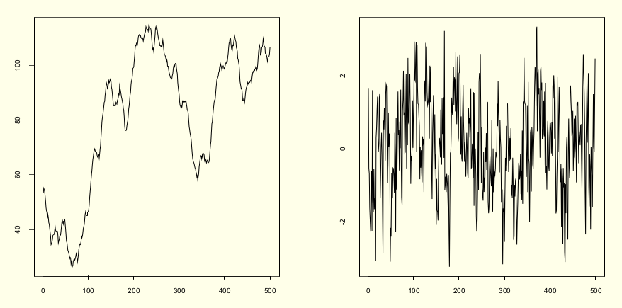
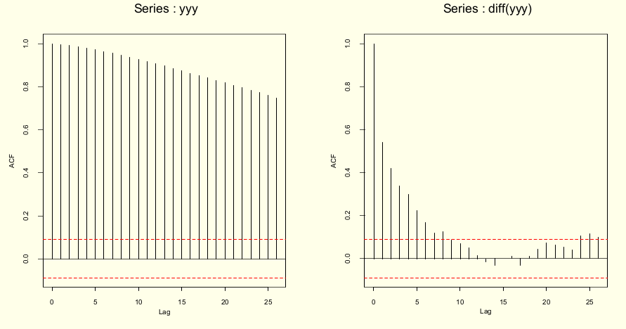

```{r, echo=F, warning=FALSE, results='asis', message = FALSE}

library(knitr)
library(pander)
library(forecast)
library(zoo)
library(quantmod)
library(DT)
# library(dplyr)
# library(magrittr)
# library(highcharter)
library(PerformanceAnalytics)
library(htmltools)
options(width = 800)

```


# Modelagem em Séries Temporais


## O que são os Modelos Box & Jenkins 

A abordagem de Box-Jenkins à modelagem dos processos ARIMA foi descrita num livro publicado por George Box e Gwilym Jenkins em 1970. 

```
BOX, G.E.P. and G.M. JENKINS (1970) 
Time series analysis: Forecasting and control, San Francisco: Holden-Day.
```

A abordagem  Box-Jenkins envolve a identificação de um processo ARIMA (Modelos autorregressivos, integrados e de médias móveis) adequado, ajustando-o aos dados e, uma vez ajustados permite  também utilizar esses modelos para a  descição e/ou previsão (*forecast*).


Uma das características atraentes da abordagem Box-Jenkins é que os processos ARIMA são uma classe muito rica de modelos  e geralmente é possível encontrar um modelo que forneça uma descrição adequada dos dados. Ajustam simultaneamente tendência, sazonalidade, ciclicidade e estrutura de dependência serial. 


- A dependência serial é a influência que um dado evento no tempo recebe de pontos anteriores.

- O processo de modelagem **B&J** é feito em um ciclo iterativo de 3 estágios (repetido até o ajuste do modelo mais adequado):

    i) **Identificação** - análise exploratória, baseada em gráficos dos dados brutos, autocorrelação, autocorrelação parcial, buscando identificar o tipo de modelo + adequado;
    
    ii) **Estimação** - estimativa de termos e parâmetros e seleção do "*melhor modelo*";

    iii) **Diagnóstico** - critérios de ajuste, parcimônia.
    
## Alguns processos estocásticos

- **Processo aleatório (ruido branco)**: seqüência de variáveis aleatórias ($a_t$) que são mutuamente independentes e identicamente distribuídas. Possui média e variância constantes e os coeficientes de autocorrelação são iguais a:

$$ \rho_{h} = \left\{ \begin{array}{rc} 1, &\mbox{se} \quad h = 0, \\  0 , &\mbox{se} \quad h = \pm 1, \pm 2, ... \end{array}\right.$$

- **Passeio aleatório (random walk)**: Denomina-se passeio aleatório quando a variável aleatória $Z_t$ é igual à $Z_{t-1}$ mais um erro aleatório $\rightarrow$ $Z_t = Z_{t-1} + a_t$.

    - Quando $t = 0 \rightarrow Z_1 = a_1$, logo $$Z_t = \sum_{t}^{i=1} a_i$$


## Modelo ARIMA 

Na análise de séries temporais, um Modelo Autoregressivo Integrado de Médias Móveis (Autoregressive Integrated Moving Average ou **ARIMA**, na sigla em inglês) é uma generalização de um modelo Autoregressivo de Médias Móveis (**ARMA**). Ambos os modelos são ajustados aos dados da série temporal para entender melhor os dados ou para prever pontos futuros na série. Modelos ARIMA são aplicados em alguns casos em que os dados mostram evidências de não estacionariedade, em que um passo inicial de diferenciação (correspondente à parte "integrada" do modelo) pode ser aplicado uma ou mais vezes para eliminar a não estacionariedade.


Temos então:

- **AR (Autoregressivo)**: avalia a relação entre os períodos (lags) através da autocorrelação, ou seja, indica que a variável de interesse é "regressada" em seus próprios valores defasados, isto é, anteriores. O objetivo de desse modelo e extrair essa influência.

- **I (Integrated)**: Aplica a diferenciação, se necessária, ou seja, indica que os valores de dados foram substituídos com a diferença entre seus valores. E os valores anteriores e este processo diferenciador pode ter sido realizado mais de uma vez.

- **MA – Moving Average**: Indica que o erro de regressão é na verdade uma combinação linear dos termos de erro, cujos valores ocorreram contemporaneamente e em vários momentos no passado, ou seja, avalia os erros entre períodos e extrai estes erros (não tem relação com MA usados para suavização da ST). 

{width=400px}


- **p** é a ordem (número de defasagens) do modelo autorregressivo;

- **d** é o grau de diferenciação (o número de vezes em que os dados tiveram valores passados subtraídos);

- **q** é a ordem do modelo de média móvel.

Exemplos:

| Parâmetro | Descrição                                                                                         |
|-----------|---------------------------------------------------------------------------------------------------|
| $p = 1$   | Significa que uma determinada observação pode ser explicada pela observação prévia + erro         |
| $p = 2$   | Significa que uma determinada observação pode ser explicada por duas observações prévias + erro   |
| $d = 0$   | Significa que não é aplicada a diferenciação                                                          |
| $d = 1$   | Significa que será aplicada diferenciação de primeira ordem                                       |
| $d = 2$   | Significa que será aplicada diferenciação de segunda ordem                                        |
| $q = 1$   | Significa que uma determinada observação pode ser explicada pelo erro da observação prévia        |
| $q = 2$   | Significa que uma determinada observação pode ser explicada pelo erro de duas observações prévias |


|         ARIMA         |                     Descrição                     |
|:---------------------:|:-------------------------------------------------:|
| AR(1) ou ARIMA(1,0,0) | Apenas elemento autoregressivo , de $1^{a}$ ordem |
| AR(2) ou ARIMA(2,0,0) | Apenas elemento autoregressivo , de $2^{a}$ ordem |
| MA(1) ou ARIMA(0,0,1) | Apenas Média Móvel                                |
| ARMA(1,1)             | Autorregressão e média móvel de $1^{a}$ ordem     |


### Modelo Autoregressivo de ordem *p* - AR(p) ou ARIMA(p,0,0)

Supondo que a variável aleatória $z_t$ é linearmente correlacionada com seus próprios valores defasados, este é um modelo autoregressivo geral de ordem *p*.

$$Z_t = c + \phi_1 Z_{t-1} + \phi_2 Z_{t-2} + ... + \phi_p Z_{t-p} + a_t$$ , sendo $t=1,2,...,p$

- O objetivo é estimar:

    - a constante *c* - média do processo ou intercepto
    
    - a ordem *p* do modelo - até onde vai a dependência
    
    - os parâmetros $\phi$ de cada termo - peso de cada ponto passado na determinação do ponto *t*

- Para estimar os parâmetros $\phi$ de um AR, a estacionariedade de $1^a$ e $2^a$ ordens são fundamentais !!!


| Processo |                            Modelo                            |
| :------: | :----------------------------------------------------------: |
|  AR(1)   |                $$Z_t = c + \phi_1 Z_{t-1} + a_t$$                |
|  AR(2)   |       $$Z_t = c + \phi_1 Z_{t-1} + \phi_2 Z_{t-2} + a_t$$        |
| $\dots$  |                           $\dots$                            |
|  AR(p)   | $$Z_t = c + \phi_1 Z_{t-1} + \phi_2 Z_{t-2} + ... + \phi_p Z_{t-p} + a_t$$ |


### Condições de estacionariedade

Uma série é estacionária quando suas propriedades não variam ao longo do tempo. Em um processo AR, a estacionariedade se reflete na estimação dos parâmetros:

  - No caso AR(1) basta que $|\phi_1| < 1$ para que o processo seja estacionário.
    
  - No caso AR(2):
    
      - $|\phi_2|< 1$ 
        
      - $\phi_2 + \phi_1 < 1$ 
        
      - $\phi_2 - \phi_1 < 1$ 


### Modelo de Médias Móveis de ordem *q* - MA(q) ou ARIMA(0,0,q)

Independente do processo autoregressivo, cada elemento da série pode também ser afetado pelo erro passado - processo "Médias Móveis". Neste caso, o valor de $Z$ depende de valores do componente aleatório em pontos anteriores (usa-se a denominação choque aleatório).

 $$Z_t = C + a_t - \theta_1 a_{t-1} - \theta_2 a_{t-2} - ... - \theta_p a_{t-q}$$

- Por convenção os termos em a são escritos com sinais negativos

- Cada observação é a soma de um componente aleatório $a_t$ e uma combinação dos componentes aleatórios anteriores.

- O modelo pode ser escrito baseado nas defasagens (informações passadas) do ruído branco

| Processo |                            Modelo                            |
| :------: | :----------------------------------------------------------: |
|  MA(1)   |                $$Z_t = c + a_t - \theta_1 a_{t-1}$$                |
|  MA(2)   |       $$Z_t = c + a_t - \theta_1 a_{t-1} - \theta_2 a_{t-2}$$        |
| $\dots$  |                           $\dots$                            |
|  MA(q)   | $$Z_t = c + a_t - \theta_1 a_{t-1} - \theta_2 a_{t-2} - ... - \theta_p a_{t-q} + a_t$$ |


### Condições de invertibilidade

- No modelo MA não há restrição sobre os $\theta$'s para que o processo seja estacionário, mas é necessário garantir a invertibilidade.

- Existe uma dualidade entre processos médias móveis e autoregressivo, onde a equação de MA pode ser reescrita na forma AR (de ordem infinita). Se isso for possível, podemos dizer que o processo é invertível, ou seja, se puder utilizar um AR(p) para explicar um MA(q).

- Mas, para isso algumas condições devem ser satisfeitas:

    - No caso MA(1) basta que $|\theta| < 1$ para que o processo é invertível.
    
    - No caso MA(2):
    
         - $|\theta_2|< 1$ 
         
         - $\theta_2 + \theta_1 < 1$ 
         
         - $\theta_2 - \theta_1 < 1$ 


### Modelo Autorregressivo de Médias Móveis de ordem *p* e *q* - ARMA(p,q) ou ARIMA(p,0,q)

A importância de um modelo ARMA está no fato de poder descrever uma série estacionária por um modelo que envolve menos parâmetros que um MA puro ou um AR puro.

$$Z_t = c + \phi_1 Z_{t-1} + \phi_2 Z_{t-2} + ... + \phi_p Z_{t-p} + a_t - \theta_1 a_{t-1} - \theta_2 a_{t-2} - ... - \theta_p a_{t-q}$$

- Cada observação é definida por combinação linear de observações anteriores e combinação de componentes aleatórios anteriores.

- Neste modelo misto, as duas condições - **estacionariedade** e **invertibilidade** - são necessárias


| Processo |                            Modelo                            |
| :------: | :----------------------------------------------------------: |
|  ARMA(1,1)   |                $$Z_t = c + \phi_1 Z_{t-1} + a_t - \theta_1 a_{t-1}$$                |
|  ARMA(2,2)   |       $$Z_t = c + \phi_1 Z_{t-1} + \phi_2 Z_{t-2} + a_t - \theta_1 a_{t-1} - \theta_2 a_{t-2}$$        |
| $\dots$  |                           $\dots$                            |
|  ARMA(p,q)   | $$Z_t = c + \phi_1 Z_{t-1} + \phi_2 Z_{t-2} + ... + \phi_p Z_{t-p} + a_t - \theta_1 a_{t-1} - \theta_2 a_{t-2} - ... - \theta_p a_{t-q}$$ |


- No caso ARMA(1,1), o processo será estacionário se $|\phi_1| < 1$ e $|\theta_1| < 1$, respectivamente. 


### Modelo Autorregressivo Integrado de Médias Móveis de ordem *p*, *d* e *q* - ARIMA(p,d,q) 

Neste modelo se utiliza o método de diferenças para obter a estacionariedade da série. Também chamado de **operador de deslocamento (backshift)**

 $$W_t = \bigtriangledown Z_t = (1-B)Z_t = Z_t - Z_{t-1}$$

O modelo então passa a ser:

$$W_t = \phi_1 W_{t-1} + ... + \phi_p W_{t-p} + a_t - \theta_1 a_{t-1} - ... - \theta_q a_{t-q}$$

$$\phi(B)W_t = \theta(B)a_t$$

$$\phi(B)(1-B)^d Z_t = \theta(B)a_t$$

Assim, se a série for estacionária, podemos representá-la por um modelo ARMA(p,q). 

A figura abaixo mostra a série não estacionária antes e após diferenciação - $d(1)$

  {width=80%} 

A figura abaixo mostra ACF antes e após diferenciação

 {width=80%} 

### **Modelos ARIMA não sazonais** 

Resumindo, os modelos ARIMA não sazonais são geralmente denotados como ARIMA(p,d,q), em que os parâmetros **p,d,q** são números inteiros não negativos.

- Robusto: Pode ser usado em praticamente qualquer tipo de ST

- Dados estáveis, com poucos outliers

- Requer dados estacionários: pode ser transformada usando diferenciação: remove tendências

- Subtrai a observação do período atual do período anterior

- A diferenciação pode ser feita 1x: diferenciação de primeira ordem

- Ou pode ser necessário uma segunda vez: diferenciação de segunda ordem (mais raro)


## Modelos ARIMA sazonais (SARIMA) - ARIMA(p,d,q)(P,D,Q)_{m}

- Em epidemiologia é comum haver sazonalidade. Ou seja, considerando medidas mensais, pode-se esperar que a série dependa também dos termos $Z_{t-12}$ e talvez $Z_{t-24}$.

$$\phi(B) \Phi(B^s)\bigtriangledown_{s}^{D} \bigtriangledown^{d}Z_t = C + \theta(B) \Theta(B^s) a_t$$

\\

| $\phi(B) \Phi(B^s)\bigtriangledown_{s}^{D} \bigtriangledown^{d}Z_t$ | $C + \theta(B) \Theta(B^s) a_t$                              |
| ------------------------------------------------------------ | ------------------------------------------------------------ |
| AR(p) backshift x AR(P) sazonal *backshift* sazonal x diferenciação sazonal x diferenciação x tendência $Z_t$ | Média do processo + MA(q) *backshift* x MA(Q) sazonal backshift sazonal x erro aleatório |


São geralmente denotados como $ARIMA(p,d,q)(P,D,Q)_{m}$, em que:

- **m** se refere ao número de períodos em cada temporada;

- **P, D e Q** se referem aos termos de auto-regressão, diferenciação e média móvel para a parte sazonal do modelo ARIMA.


## Função de Autocorrelação Parcial (FACP) - (*Partial Autocorrelation Function - PACF*)

- A correlação medida diretamente em $t-1$, $t-2$ até $t-p$ é a função de autocorrelação.

Uma outra ferramenta utilizada no processo de identificação do modelo é a **Função de Autocorrelação Parcial(FACP)**.  Esta medida corresponde a correlação de $Z_t $ e $ Z_{t-h} $ removendo o efeito dos pontos intermediários $Z_{t-1}, Z_{t-2}, \dots , Z_{t-h+1}$  e é denotada por $\rho_{h}$, ou seja, é a correlação da série temporal com um atraso de si mesmo, com a dependência linear de todos os desfasamentos entre eles removidos.

$$\rho_{kk} = Corr(X_t, X_{t-l}|X_{t-1}, X_{t-2},\dots,X_{t-h+1})$$	

Segue abaixo um exemplo um exemplo de ACF, com já vimos anteriormente, e do PACF. Observe que há duas linhas horizontais que representam os limites do teste de significância sendo que valores acima ou abaixo da linha são estatisticamente significantes. 

```{r, echo=FALSE, tidy=TRUE, results='asis', warning = FALSE}
from <-  as.Date("1974-01-01")
to <-  as.Date("1989-12-31")
days <-  seq.Date(from=from,to=to,by="days")
funca <- function(x) {round(rnorm(x,10,1.5))}
set.seed(3343545)
timeseries <- round(zoo::as.zoo((arima.sim(list(order = c(2,0,0), ar = c(0.5,0.15)), n = 1000,rand.gen = funca))),2)
lags <- Lag(timeseries, k=1:10)
final <-  round(zoo::cbind.zoo(timeseries,lags), 4)
colnames(final) <-  c("atual", "lag1", "lag2", "lag3", "lag4", "lag5",
                    "lag6", "lag7", "lag8", "lag9", "lag10")
DT::datatable(final[1:10,], rownames = FALSE, options = list(columnDefs = list(list(className = 'dt-center', targets="_all")), dom = 't'))
       
```


```{r, echo=FALSE, tidy=TRUE, results='asis', warning = FALSE, fig.align='center', fig.height=7}
# Calcular a autocorrelação 
acf = stats::acf(timeseries, na.action = na.pass, plot = FALSE, lag.max = 15)
pacf = stats::pacf(timeseries, na.action = na.pass, plot = FALSE, lag.max = 15)
  
par(mfrow=c(1,2))

# Gráfico da função de autocorrelação. 
plot(acf, main = "", ylab = "", xlab = "Lags")
title("Função de Autocorrelação (ACF)", adj = 0.5, line = 1)

plot(pacf, main = "", ylab = "", xlab = "Lags")
title("Função de Autocorrelação Parcial (PACF)", adj = 0.5, line = 1)


```

- No $lag = 1$, a ACF e a PACF são iguais.

- Na PACF somente existe correlação até o lag igual a ordem do modelo AR - ex: modelo de ordem 3 somente
apresenta valores de PACF até o $3^a$ lag.

- A forma gráfica do ACF e PACF servem para definir valores de p e q. Olhando para os correlogramas, podemos determinar que tipo de modelo selecionar e quais serão os valores de p, d e q.

| Modelo    | Padrão do ACF                                                | Padrão do PACF                                        |
| --------- | ------------------------------------------------------------ | ----------------------------------------------------- |
| AR(p)     | Decaimento exponencial ou padrão de onda senoidal amortecida ou ambos | Picos significantes através de primeiros lags         |
| MA(q)     | Picos significantes através de primeiros lags                | Decaimento exponencial ou padrão em forma de senoides |
| ARMA(1,1) | Decaimento exponencial a partir do lag 1                     | Decaimento exponencial a partir do lag 1              |
| ARMA(p,q) | Decaimento exponencial                                       | Decaimento exonencial                                 |

## Processo de Modelagem

Para a construção do modelo podemos seguir o seguinte roteiro no qual a escolha da estrutura do modelo é baseado nos próprios dados:

1) Identifica-se um modelo com base na análise de autocorrelações, autocorrelações parciais e outros critérios;

2) Estima-se os parâmetros do modelo identificado;

3) Verificar se o modelo ajustado é adequado aos dados através de uma análise de resíduos.

4) Caso o modelo não seja adequado o roteiro é repetido, voltando à fase de identificação do modelo.


- Como definir valores de p,d e q ?

 - **p**: ordem da parte autoregressiva - PACF

 - **d**: grau de diferenciação – Teste de Estacionariedade

 - **q**: ordem da média móvel - ACF


{width=1270px}

## Processo de Identificação

{width=1270px} 
  
- Esse processo pode ser extremamente difícil, mesmo para experientes. E Nem sempre o modelo mais sugestivo é o melhor.

- Existem vários critérios para identificação de um modelo, por isso, é possível identificar modelos diferentes dependendo do critério que foi escolhido para identificação.

- Testar todas as combinações possíveis dos parâmetros $p,d,q$ do modelo ARIMA, seria uma boa ideia, mas isso pode ser um pouco demorado se for feito de forma manual.


### Simulando os dados das ST com estruturas ARIMA


Simulando um processo AR(1)

```{r, echo=T, warning=FALSE, results='asis', out.width = "100%", message = FALSE, fig.align = "center"}
# Simulando 100 observações através de um processo AR(1) com média 30
ar.sim<-arima.sim(model=list(ar=.9),n=200, mean = 30)

# Construindo o gráfico de ST
ts.plot(ar.sim) 

# ACF e PACF
par(mfrow=c(1,2))
ar.acf <- acf(ar.sim,type="correlation",plot=T)
ar.pacf <- acf(ar.sim,type="partial",plot=T)

plot(ar.acf)
plot(ar.pacf)

```

Simulando um processo AR(2)

```{r, echo=T, warning=FALSE, results='asis', out.width = "100%", message = FALSE, fig.align = "center"}
# Simulando 100 observações através de um processo AR(2) com média 30
ar.sim <- arima.sim(model=list(ar=c(.9,-.2)),n=200, mean = 30)

# Construindo o gráfico de ST
ts.plot(ar.sim) 

# ACF e PACF
par(mfrow=c(1,2))
ar.acf <- acf(ar.sim,type="correlation",plot=T)
ar.pacf <- acf(ar.sim,type="partial",plot=T)

plot(ar.acf)
plot(ar.pacf)

```

Simulando um processo MA(2)

```{r, echo=T, warning=FALSE, results='asis', out.width = "100%", message = FALSE, fig.align = "center"}
# Simulando 200 observações através de um processo MA(2) com média 30
ma.sim <- arima.sim(model=list(ma=c(-.7,.1)),n=200, mean = 30)

# Construindo o gráfico de ST
ts.plot(ma.sim) 

# ACF e PACF
par(mfrow=c(1,2))
ma.acf <- acf(ma.sim,type="correlation",plot=T)
ma.pacf <- acf(ma.sim,type="partial",plot=T)

plot(ma.acf)
plot(ma.pacf)

```

Simulando um processo ARMA(2,2)

```{r, echo=T, warning=FALSE, results='asis', out.width = "100%", message = FALSE, fig.align = "center"}
# Simulando 200 observações através de um processo ARMA(2,2) com média 30
arma.sim <-arima.sim(model=list(ar=c(.9,-.2),ma=c(-.7,.1)),n=200, mean = 30)

# Construindo o gráfico de ST
ts.plot(arma.sim) 

# ACF e PACF
par(mfrow=c(1,2))
arma.acf <- acf(arma.sim,type="correlation",plot=T)
arma.pacf <- acf(arma.sim,type="partial",plot=T)

plot(arma.acf)
plot(arma.pacf)

```

## Métricas para avaliar a qualidade do ajuste 

- Para determinar a ordem de um modelo ARIMA não sazonal, um critério útil é o **critério de informação de Akaike (AIC)**.

$$AIC = - 2log(L) + 2(p+q+k+1)$$

em que *L* é verossimilhança dos dados, *p* é a ordem da parte autoregressiva e *q* é a ordem da parte de média móvel. O parâmetro *k* neste critério é definido como o número de parâmetros no modelo sendo ajustado aos dados. 

- O **AIC corrigido para modelos ARIMA (AICc)** pode ser escrito como:

$$AICc = AIC + \dfrac{2(p+q+k+1)(p+q+k+2)}{T-p-q-k-2}$$
 
- O **critério de informação bayesiano (BIC)** pode ser escrito como:
  
   $$BIC = AIC + (log(n) - 2) (p+q+k+1)$$
   

- O objetivo é o minimizar os valores de AIC, AICc e BIC para um bom modelo. Quanto menor o valor de um destes critérios para uma gama de modelos investigados, melhor o modelo se adequará aos dados. 

- O AICc pode ser usado apenas para comparar modelos ARIMA com as mesmas ordens de diferenciação. Para modelos ARIMA como ordens distintas de diferenciação, a raiz do erro quadrático médio pode ser usada para comparação de modelos.

- A abordagem do BIC penaliza mais intensamente os modelos por levar em consideração o $n$.


## Análise de Resíduos

Se o modelo está correto, as nossas suposições iniciais feitas para os resíduos devem ser satisfeitas, isto é, $a_t \sim N(0, \sigma^{2}_{a})$ e independentes.

Assim, a análise de resíduos é feita da seguinte forma:

1) Faz-se um gráfico da série $a_t$ e observa-se a sua estacionariedade e se sua média é igual a zero (aproximadamente).

2) Se a série $a_t$ for estacionária, calcula-se suas funções de autocorrelação e autocorrelação parcial amostral;

3) Se as funções em (2) indicarem que o processo gerador de $a_t$ é um ruído branco, o modelo escolhido para $Y_t$ poderá ser ser considerado adequado. Senão, podemos utilizar a análise dos resíduos para identificar outro modelo para a série. 

Lembrando que o processo $a_t$ é um ruído branco se:

 i) $E(a_t) = 0$,
 
 ii) $a_t \sim N(0, \sigma^2_a)$,
    
 iii) $Cov(a_t, a_{t-h}) = 0$, $\forall h \neq 0$ (Não correlacionados)
 
## Ajuste manual de modelo ARIMA

```{r, echo=T, warning=FALSE, results='asis', message = FALSE, out.width = "100%", fig.align = "center"}
library(forecast)
ggtsdisplay(ldeaths)
modelo0 <- Arima(ldeaths,order = c(1,0,0),seasonal = c(1,1,1))
checkresiduals(modelo0)
tsdiag(modelo0)

```

```{r, echo=T, warning=FALSE, results='asis', message = FALSE, out.width = "100%", fig.align = "center"}
plot(ldeaths)
lines(fitted(modelo0),col="red")
```


## Ajuste automático de modelos ARIMA

O pacote [*forecast*](http://pkg.robjhyndman.com/forecast) de autoria Rob Hyndman e colaboradores possui diversas funções para 
visualização, analise e predições de Series temporais, entre elas existe uma função que faz ajustes automáticos para modelos ARIMA.
Essa função se chama **auto.arima()** 


- Testa diferentes combinações de $p$, $d$ e  $q$ buscando o melhor ajuste 

- Extremamente flexível

- Mesmo intuindo um modelo, você pode usa-la para confirmar sua parametrização


Alguns parâmetros importantes da função *auto.arima()*

- stationary - Se TRUE, restringe sua busca por modelos estacionários.

- seasonal - Se FALSE, restringe sua busca por modelos não sazonais.

- stepwise - Se TRUE, utilizará o métodos de *stepwise* de seleção (mais rápido). Caso contrário, irá buscar todas as combinações. O método de seleção *non-stepwise* pode ser muito lento, especialmente para os modelos sazonais.

- trace - Se TRUE, a lista de modelos ARIMA considerados será reportada.

- approximation - Se TRUE, o processo de estimação é feito através das somas dos quadrados condicionais e os critérios de informação utilizados para a seleção de modelos são aproximados. O modelo final ainda é calculado usando estimativa de máxima verossimilhança. A aproximação deve ser usada para séries temporais longas ou um período sazonal elevado para evitar tempos de computação excessivos.

```{r, echo=T, warning=FALSE, results='asis', message = FALSE, out.width = "100%", fig.align = "center"}

# tilizando trace = T, será possível verificar todo o processo de criação e teste dos modelos
modelo1 <-  auto.arima(ldeaths, trace = F, allowdrift=F)


# Neste modelo, será feito uma busca maior para uma solução "mais ótimizada"
modelo2 <-  auto.arima(ldeaths, trace = F, stepwise = F, approximation = F)

```

Vamos verificar cada um dos modelos obtidos

```{r, echo=T, warning=FALSE, results='hide', message = FALSE, out.width = "100%", fig.align = "center"}
modelo1

```

```{r, echo=F, warning=FALSE, results='asis', message = FALSE, out.width = "100%", fig.align = "center"}
library(texreg)
texreg::htmlreg(modelo1, star.symbol = "\\*", center = TRUE, doctype = FALSE,  html.tag = TRUE, head.tag = FALSE, body.tag = FALSE)

```

```{r, echo=T, warning=FALSE, results='asis', message = FALSE, out.width = "100%", fig.align = "center"}
tsdiag(modelo1)
```

```{r, echo=T, warning=FALSE, results='hide', message = FALSE, out.width = "100%", fig.align = "center"}
modelo2

```

```{r, echo=F, warning=FALSE, results='asis', message = FALSE, out.width = "100%", fig.align = "center"}
texreg::htmlreg(modelo2, star.symbol = "\\*", center = TRUE, doctype = FALSE,  html.tag = TRUE, head.tag = FALSE, body.tag = FALSE)

```

```{r, echo=T, warning=FALSE, results='asis', message = FALSE, out.width = "100%", fig.align = "center"}

tsdiag(modelo2)
```


Comparando os ajustes dos modelos  

```{r, echo=T, warning=FALSE, results='asis', message = FALSE, out.width = "100%", fig.align = "center"}
plot(ldeaths)
lines(fitted(modelo0),col="red")
lines(fitted(modelo1),col="blue")
lines(fitted(modelo2),col="darkgreen")
```


## Modelos de Previsão

Uma vez ajustado um modelo ARIMA a uma série de tempo é possível fazer uma predição de $K$ passos a frente o que nos permite  
obter a previsão da série no instante $t + k$ será denotada por $\widehat {Z}_{t+k} $  assim podemos obter alem das previsões futuras os limites de confiança.

Os  Modelos de Previsão são uma área importante e um campo muito ativo de desenvolvimento de métodos estatísticos e computacionais,
aqui vamos somente apresentar um exemplo utilizando um dos modelos já ajustados para a serie **ldeaths**.

Uma maneira simples de obter o valor predito é usando a função *predict()* 

```{r, echo=T, warning=FALSE, results='hide', message = FALSE, out.width = "100%", fig.align = "center"}
predict(modelo1,n.ahead = 12)

```

```{r, echo=F, warning=FALSE, results='asis', message = FALSE, out.width = "100%", fig.align = "center"}
predito1 <- predict(modelo1,n.ahead = 12)
# knitr::kable(list(predito1$pred, predito1$se))

DT::datatable(as.data.frame(predito1))
```
o pacote *forecast* possui funções para facilitar a predição e visualização. Veja na função abaixo que o modelo já retorna não só o valor predito mas os limites superior e inferior para os níveis de confiança 80 e 95.

```{r, echo=T, warning=FALSE, results='hide', message = FALSE, out.width = "100%", fig.align = "center"}
pred <- forecast(modelo1,h=12)
pred
```

```{r, echo=F, warning=FALSE, results='asis', message = FALSE, out.width = "100%", fig.align = "center"}
pred <- forecast(modelo1,h=12)
DT::datatable(as.data.frame(pred))
```

Ele também facilita a confecção de gráficos 

```{r, echo=T, warning=FALSE, results='asis', message = FALSE, out.width = "100%", fig.align = "center"}
plot(pred)  # a função autoplot produz no formato ggplot
```


Para saber mais sobre séries temporais e previsões recomendamos o exelente livro online 
[Forecasting: Principles and Practice Rob J Hyndman and George Athanasopoulos](https://otexts.com/fpp2/)


## Correlação Cruzada (*Cross-Corralation*)

- Vamos considerar a situação em que temos duas ou mais séries temporais e queremos explorar as relações entre elas. A ideia seria modelar a série $Z_{t}^{1}$ usando os pontos anteriores de $Z_{t}^{2}$.

- A correlação cruzada descreve o grau de correlação entre duas séries.

- A correlação cruzada, mais especificamente, é usado para determinar quando uma mudança em um série pode potencializar a *causa* da mudança na outra série.

$$Z_{t} =  v(B) X_t + N_t$$
onde:


* $v(B)$  é a função de transferência (filtro) 
* $Z_t,X_t$ são séries estacionarias 
* $N_t$  é um ruído  independente de $X_t$ 


- Vamos analisar:

    - O atraso de uma série em relação a outra
    
    - O feedback
    
    - Correlação dos resíduos, removida a estrutura temporal
    
 
A titulo de demostração da função de correlação cruzada (Cross-correlation Function), vamos usar como exemplo dados de temperatura da área central Reino Unido  obtidos do [UK Met Office](http://hadobs.metoffice.gov.uk/hadcet/data/download.html)  e vamos correlacionar com a serie **ldeaths** .

```{r, echo=T, warning=FALSE, results='asis', message = FALSE, out.width = "100%", fig.align = "center"}
uktemp <- read.table('https://gitlab.procc.fiocruz.br/oswaldo/eco2019/raw/master/dados/UKtemp.tsv')
uktemp <- ts(as.vector(t(uktemp[,2:13])),start = c(1970,1),frequency = 12)
uktemp.ts <- window(uktemp,start=c(1974,1),end=c(1979,12))
fcc <- ccf(uktemp.ts,ldeaths)
#plot(fcc)

```

```{r, echo=T, warning=FALSE, results='hide', message = FALSE, out.width = "100%", fig.align = "center"}

cbind(fcc$lag,fcc$acf)

```

```{r, echo=F, warning=FALSE, results='asis', message = FALSE, out.width = "100%", fig.align = "center"}

dt <- cbind(fcc$lag,fcc$acf)
dt %>%
  knitr::kable() %>%
  kableExtra::kable_styling()
```


```{r, echo=T, warning=FALSE, results='asis', message = FALSE, out.width = "100%", fig.align = "center"}

max(abs(fcc$acf))
```
  


## GAM (generalized Additive Models)

- Um modelo aditivo generalizado (Hastie and Tibishirani, 1990) é um modelo linear generalizado com um preditor linear envolvendo a soma de funções suavizadas das covariáveis + os efeitos fixos das mesmas. 


$$\eta = \sum X \beta + f_1(x_{1i}) + f_2(x_{2i}) + \ldots$$

- Pode ser considerado uma extensão do GLM, onde o preditor linear $\eta = E(Y_i)$ não é limitado para a regressão linear, sendo $Y_i \sim$ alguma distribuição da família exponencial.

- $Y_i$ é a variável resposta (desfecho)

- $X$ é o vetor das variáveis explicativas (exposição)

- $\beta$ representa o vetor de parâmetros a serem estimados pelo modelo.

- O modelo inclui qualquer função das covariáveis independentes ($x_i$)

- $f(x) \rightarrow$ pode ser uma função não-paramétrica, cuja forma não é especificada *a priori*. Mas pode ser estimada através de curvas de alisamento (ex: *kernel*, *loess*, *splines*, etc.)

- A curva alisada permite descrever a forma e revelar possíveis não linearidades nas 
   relações estudadas, uma vez que não apresenta a estrutura rígida de uma função
   paramétrica, como nos GLM's.
   
- Quando usar ? Quando o efeito da covariável muda dependendo do seu valor


## Por que não usar ?

- Os modelos estatísticos visam explicar os dados observados, não simplesmente reproduzi-lo $\rightarrow$ **overfitting**

- Modelos paramétricos em geral são melhores para estimar erros padrão ou intervalos de confiança

- Modelos paramétricos são mais eficientes, se corretamente especificados (menor número de observações)


## GAM em Séries Temporais

- A idéia principal é modelar o efeito de covariáveis em alguns
eventos de saúde ao longo do tempo

- Razões:

    - Permitir a inclusão da dependência do tempo

    - Relação não-linear
    
    - Tendência e sazonalidade podem ser facilmente incorporadas

- Considerando a variável resposta uma contagem, as escolhas para as distribuições são:

    - Poisson: $\lambda$ $=$ valores esperados e $=$ variância $\rightarrow$ superdispersão
    
    - Quasipoisson: não é uma distribuição, mas uma maneira de relaxar suposição do modelo anterior e levar em consideração a superdispersão. (Não estima o AIC automaticamente).
    
    - Negative Binomial: tem uma média $\mu$, um parâmetro de escala $\theta$ e a variância como a função $V(\mu)=\mu+\mu^2/\theta$
  
    - Modelos com inflação zero: modelos de mistura que combinam uma massa pontual a zero com uma distribuição de contagem como Poisson, geométrica ou binomial negativa

### Exemplo de um modelo GAM

- Vamos utilizar uma a série temporal dos casos de leptospirose com as variáveis de esposição total de chuva e temperatura.


$$\text{Lepto}(t) = \text{rain}(t-?) + \text{humidity}(t-?) + AR(t,t-1) + trend + seasonality + \varepsilon$$

- Tendência e Sazonalidade $\to$ função suavizadora

- Covariáveis $\to$ lag no tempo

- É possível incluir a variabilidade populacional em risco (*offset*)

### Exemplo: Série Temporal: Casos de Leptospirose *vs* Clima

```{r, echo=T, warning=FALSE, results='asis', message = FALSE, out.width = "100%", fig.align = "center"}

lepto <- read.csv2("https://gitlab.procc.fiocruz.br/oswaldo/eco2019/raw/master/dados/leptoruido.csv", header=T)
dia <- read.table("https://gitlab.procc.fiocruz.br/oswaldo/eco2019/raw/master/dados/climadia.dat", header=T)

library(lattice)
library(car)
library(sm)
library(survival)
library(mgcv)

#XY condicionado
xyplot(cases + totrain + tempmed ~ week,
 outer=TRUE, layout=c(1, 3), pch=1, type="l",ylab="",
  scales=list(x=list(relation='same'), y=list(relation='free')),
 data=lepto)

```

- Modelando a Chuva como resposta e colocando o a função suavizadoras para capturar o efeito nas semanas epidemológicas

```{r, echo=T, warning=FALSE, results='asis', message = FALSE, out.width = "100%", fig.align = "center"}

xyplot(totrain ~ week,
 outer=TRUE, layout=c(1, 1), pch=1, type="l",ylab="Chuva",
  scales=list(x=list(relation='same'), y=list(relation='free')),
 data=lepto)

# Ajustando a chuva como resposta
rain.tp <- gam(totrain ~ s(week,bs="tp"), data=lepto )
rain.ps <- gam(totrain ~ s(week,bs="ps"), data=lepto ) #
rain.cc <- gam(totrain ~ s(week,bs="cc"), data=lepto ) #
rain.cr <- gam(totrain ~ s(week,bs="cr"), data=lepto ) #
rain.ad <- gam(totrain ~ s(week,bs="ad"), data=lepto ) 

ThinPlate  <- predict(rain.tp)  
P.spline <- predict(rain.ps)  
CubicRegression <- predict(rain.cr)  
CyclicCR <- predict(rain.cc)  
Adaptative <- predict(rain.ad) 


xyplot(Adaptative +CyclicCR  + CubicRegression+P.spline + ThinPlate~ week,
       outer=TRUE, layout=c(1, 5), pch=19, cex=.2, ylab="",
       scales=list(x=list(at=seq(0,416,52),relation='same'), y=list(relation="same")), data=lepto)

```


- Uma outra forma de representar o efeito da chuva

```{r, echo=T, warning=FALSE, results='asis', message = FALSE, out.width = "100%", fig.align = "center"}

par(mfrow=c(3,2),mai=c(0.2,0.5412 ,0.5412,0.05),mgp=c(2,.5,0))
plot(rain.tp,shade=TRUE,ylab="TP",xlab="",residuals=F,xaxp=c(0,416,8),main="Chuva", pch=19, cex=.2, xaxt="n")
plot(rain.ps,shade=TRUE,main="",ylab="PS",xlab="",residuals=F,xaxp=c(0,416,8),  pch=19, cex=.2,  xaxt="n")
plot(rain.cr,shade=TRUE,main="",ylab="CC",xlab="",residuals=F,xaxp=c(0,416,8),  pch=19, cex=.2,  xaxt="n")
plot(rain.cc,shade=TRUE,main="",ylab="CC",xlab="",residuals=F,xaxp=c(0,416,8),  pch=19, cex=.2,  xaxt="n")
plot(rain.ad,shade=TRUE,main="",ylab="Adaptative",xlab="",residuals=F,xaxp=c(0,416,8),  pch=19, cex=.2)


```

- Série da temperatura (ThinPlate - tp, P.spline - ps, CubicRegression - cc)

```{r, echo=T, warning=FALSE, results='asis', message = FALSE, out.width = "100%", fig.align = "center"}

temp.tp <- gam(tempmed ~ s(week,bs="tp",k=52), data=lepto) 
temp.ps <- gam(tempmed ~ s(week,bs="ps",k=52), data=lepto ) 
temp.cc <- gam(tempmed ~ s(week,bs="cc",k=52), data=lepto )

par(mfrow=c(3,1),mai=c(0.05,0.5412 ,0.5412,0.05),mgp=c(2,1,0))
plot(temp.tp,shade=TRUE,ylab="TP",xlab="",xaxp=c(0,416,8) , main="Temperatura", cex=2)
plot(temp.ps,shade=TRUE,main="",ylab="PS",xlab="",xaxp=c(0,416,8), cex=2)
plot(temp.cc,shade=TRUE,main="",ylab="CC",xlab="",xaxp=c(0,416,8), cex=2)

```

- Série dos casos de leptospirose (ThinPlate - tp, P.spline - ps, CubicRegression - cc)

```{r, echo=T, warning=FALSE, results='asis', message = FALSE, out.width = "100%", fig.align = "center"}

cases.tp <- gam(cases ~ s(week,bs="tp",k=52), data=lepto ) #ciclica
cases.ps <- gam(cases ~ s(week,bs="ps",k=52), data=lepto ) #
cases.cc <- gam(cases ~ s(week,bs="cc",k=52), data=lepto)

par(mfrow=c(3,1),mai=c(0.05,0.5412 ,0.5412,0.05),mgp=c(2,1,0))
plot(cases.tp,shade=TRUE,ylab="TP",xlab="",xaxp=c(0,416,8), main="Casos", cex=2)
plot(cases.ps,shade=TRUE,main="",ylab="PS",xlab="",xaxp=c(0,416,8), cex=2)
plot(cases.cc,shade=TRUE,main="",ylab="CC",xlab="",xaxp=c(0,416,8), cex=2)

```

- Ajustando a série dos casos de leptospirose via distribuição Poisson

```{r, echo=T, warning=FALSE, results='asis', message = FALSE, out.width = "100%", fig.align = "center"}

library(quantmod) # para utilizar a funcao Lag 

chuvl0 <- gam(cases ~ s(totrain)        ,family=poisson,data=subset(lepto, week>5))
chuvl1 <- gam(cases ~ s(Lag(totrain,1)),family=poisson,data=subset(lepto, week>5))
chuvl2 <- gam(cases ~ s(Lag(totrain,2)),family=poisson,data=subset(lepto, week>5))
chuvl3 <- gam(cases ~ s(Lag(totrain,3)),family=poisson,data=subset(lepto, week>5))
chuvl4 <- gam(cases ~ s(Lag(totrain,4)),family=poisson,data=subset(lepto, week>5))
chuvl5 <- gam(cases ~ s(Lag(totrain,5)),family=poisson,data=subset(lepto, week>5))


```

```{r, echo=T, warning=FALSE, results='hide', message = FALSE, out.width = "100%", fig.align = "center"}
AIC(chuvl0,chuvl1,chuvl2,chuvl3,chuvl4,chuvl5)

```

```{r, echo=F, warning=FALSE, results='asis', message = FALSE, out.width = "100%", fig.align = "center"}
chuva <- data.frame(round(AIC(chuvl0,chuvl1,chuvl2,chuvl3,chuvl4,chuvl5),2))
DT::datatable(as.data.frame(chuva))

```


- Ajustando a série dos casos de leptospirose via distribuição Binomial Negativa

```{r, echo=T, warning=FALSE, results='asis', message = FALSE, out.width = "100%", fig.align = "center"}

chuvnb0 <- gam(cases ~ s(Lag(totrain,0)),data=lepto, family=nb(), subset=week>5)
chuvnb1 <- gam(cases ~ s(Lag(totrain,1)),data=lepto, family=nb(), subset=week>5)
chuvnb2 <- gam(cases ~ s(Lag(totrain,2)),data=lepto, family=nb(), subset=week>5)
chuvnb3 <- gam(cases ~ s(Lag(totrain,3)),data=lepto, family=nb(), subset=week>5)
chuvnb4 <- gam(cases ~ s(Lag(totrain,4)),data=lepto, family=nb(), subset=week>5)
chuvnb5 <- gam(cases ~ s(Lag(totrain,5)),data=lepto, family=nb(), subset=week>5)
chuvnb5$family$getTheta()


```


```{r, echo=T, warning=FALSE, results='hide', message = FALSE, out.width = "100%", fig.align = "center"}
AIC(chuvnb0,chuvnb1,chuvnb2,chuvnb3,chuvnb4,chuvnb5)

```

```{r, echo=F, warning=FALSE, results='asis', message = FALSE, out.width = "100%", fig.align = "center"}
chuvanb <- data.frame(round(AIC(chuvnb0,chuvnb1,chuvnb2,chuvnb3,chuvnb4,chuvnb5),2))
DT::datatable(as.data.frame(chuvanb))

```

- Comparando os AIC's de ambos os modelos entre os lags

```{r, echo=T, warning=FALSE, results='asis', message = FALSE, out.width = "100%", fig.align = "center"}

plot(0:5,AIC(chuvl0,chuvl1,chuvl2,chuvl3,chuvl4,chuvl5)[,2], type="l",ylim=c(2090,2850), ylab="AIC's", xlab = "Lags")
lines(0:5,AIC(chuvnb0,chuvnb1,chuvnb2,chuvnb3,chuvnb4,chuvnb5)[,2], type="l",col=2)

legend("right",c("Poisson","Bin. Neg."),col=1:2,fill=1:2)

```

- Verificando a distribuição da chuva entre todos os lags

```{r, echo=T, warning=FALSE, results='asis', message = FALSE, out.width = "100%", fig.align = "center"}

boxplot(lepto$totrain)

par(mfrow=c(3,2),mai=c(0.05,0.5412 ,0.5412,0.05),mgp=c(2,1,0))

plot(chuvnb0,ylab="Lag=0")
abline(h=0,lty=2,col=2)
plot(chuvnb1,ylab="Lag=1")
abline(h=0,lty=2,col=2)
plot(chuvnb2,ylab="Lag=2")
abline(h=0,lty=2,col=2)
plot(chuvnb3,ylab="Lag=3")
abline(h=0,lty=2,col=2)
plot(chuvnb4,ylab="Lag=4")
abline(h=0,lty=2,col=2)
plot(chuvnb5,ylab="Lag=5")
abline(h=0,lty=2,col=2)

```

- Incluindo todos os lags no modelo GLM e verificando o Fator de Inflação de Variação (VIF)

<!-- VIF: É um fator que estima o aumento da variância, devido à multicolinearidade em modelos de regressão. -->
<!--     - Colinearidade aumenta a variância dos betas, ou seja, diminui significância estatística (*t-teste* menor). -->

<!--     - Se todos os VIFs forem 1, não há multicolinearidade, mas se alguns VIFs forem maiores do que 1, os preditores estão correlacionados. -->

<!--     - VIF >  5 indica multicolinearidade média -->

<!--     - VIF > 10 indica colinearidade que tende à perfeita -->

```{r, echo=T, warning=FALSE, results='markup', message = FALSE, out.width = "100%", fig.align = "center"}

casos.chuva.poi <- glm(cases ~ Lag(totrain,0) + Lag(totrain,1) + Lag(totrain,2) + Lag(totrain,3) + Lag(totrain,4)+Lag(totrain,5), family="poisson", data=lepto)
summary(casos.chuva.poi)

```

```{r, echo=T, warning=FALSE, results='hide', message = FALSE, out.width = "100%", fig.align = "center"}
car::vif(casos.chuva.poi)
```

```{r, echo=F, warning=FALSE, results='asis', message = FALSE, out.width = "100%", fig.align = "center"}
pander(car::vif(casos.chuva.poi))
```


```{r, echo=T, warning=FALSE, results='markup', message = FALSE, out.width = "100%", fig.align = "center"}
library(MASS) # Utilizar a funcao glm.nb
casos.chuva.nb <- glm.nb(cases ~ Lag(totrain,0) + Lag(totrain,1) + Lag(totrain,2) + Lag(totrain,3) + Lag(totrain,4)+Lag(totrain,5), data=lepto)
summary(casos.chuva.nb)
car::vif(casos.chuva.nb)

```

```{r, echo=T, warning=FALSE, results='hide', message = FALSE, out.width = "100%", fig.align = "center"}
AIC(casos.chuva.poi,casos.chuva.nb)
```

```{r, echo=F, warning=FALSE, results='asis', message = FALSE, out.width = "100%", fig.align = "center"}
chuva_poinb <- data.frame(round(AIC(casos.chuva.poi,casos.chuva.nb),2))
DT::datatable(as.data.frame(chuva_poinb))

```

- Incluindo todos os lags no modelo GAM

```{r, echo=T, warning=FALSE, results='asis', message = FALSE, out.width = "100%", fig.align = "center"}

casos.chuva.gam.6 <- gam(cases ~ s(Lag(totrain,0))+s(Lag(totrain,1)) +s(Lag(totrain,2)) +s(Lag(totrain,3)) +s(Lag(totrain,4))+ s(Lag(totrain,5)),data=lepto, family=nb(), subset=week>5)

par(mfrow=c(3,2),mai=c(0.05,0.5412 ,0.5412,0.05),mgp=c(2,1,0))
plot(casos.chuva.gam.6,shade=TRUE, residuals=T, select=1, ylab="Lag 0")
abline(h=0, col=2, lty=3)
plot(casos.chuva.gam.6,shade=TRUE, residuals=T, select=2, ylab="Lag 1")
abline(h=0, col=2, lty=3)
plot(casos.chuva.gam.6,shade=TRUE, residuals=T, select=3, ylab="Lag 2")
abline(h=0, col=2, lty=3)
plot(casos.chuva.gam.6,shade=TRUE, residuals=T, select=4, ylab="Lag 3")
abline(h=0, col=2, lty=3)
plot(casos.chuva.gam.6,shade=TRUE, residuals=T, select=5, ylab="Lag 4")
abline(h=0, col=2, lty=3)
plot(casos.chuva.gam.6,shade=TRUE, residuals=T, select=6, ylab="Lag 5")
abline(h=0, col=2, lty=3)

```

- Retirando os termos lag 0 e lag 5

```{r, echo=T, warning=FALSE, results='asis', message = FALSE, out.width = "100%", fig.align = "center"}

casos.chuva.gam.4 <- gam(cases ~ s(Lag(totrain,1)) +s(Lag(totrain,2)) +s(Lag(totrain,3))+s(Lag(totrain,4)),data=lepto, family=nb(), subset=week>5)


par(mfrow=c(2,2),mai=c(0.05,0.5412 ,0.5412,0.05),mgp=c(2,1,0))
plot(casos.chuva.gam.4,shade=TRUE, residuals=T, select=1, ylab="Lag 1")
abline(h=0, col=2, lty=3)
plot(casos.chuva.gam.4,shade=TRUE, residuals=T, select=2, ylab="Lag 2")
abline(h=0, col=2, lty=3)
plot(casos.chuva.gam.4,shade=TRUE, residuals=T, select=3, ylab="Lag 3")
abline(h=0, col=2, lty=3)
plot(casos.chuva.gam.4,shade=TRUE, residuals=T, select=4, ylab="Lag 4")
abline(h=0, col=2, lty=3)


```

```{r, echo=T, warning=FALSE, results='hide', message = FALSE, out.width = "100%", fig.align = "center"}
AIC(casos.chuva.gam.6,casos.chuva.gam.4,casos.chuva.nb)
```

```{r, echo=F, warning=FALSE, results='asis', message = FALSE, out.width = "100%", fig.align = "center"}
chuva_gamnb <- data.frame(round(AIC(casos.chuva.gam.6,casos.chuva.gam.4,casos.chuva.nb),2))
DT::datatable(as.data.frame(chuva_gamnb))

```

Analisando os resíduos do modelo casos.chuva.gam.4


```{r, echo=T, warning=FALSE, results='asis', message = FALSE, out.width = "100%", fig.align = "center"}
par(mfrow=c(2,2))
gam.check(casos.chuva.gam.4, pch=19,cex=.3)
```

Plotano o ACF e PACF
```{r, echo=T, warning=FALSE, results='asis', message = FALSE, out.width = "100%", fig.align = "center"}
# ACF e PACF
par(mfrow=c(1,2))
ar.acf <- acf(casos.chuva.gam.4$residuals,type="correlation",plot=T)
ar.pacf <- acf(casos.chuva.gam.4$residuals,type="partial",plot=T)

plot(ar.acf)
plot(ar.pacf)

```

Teste de Ljung-Box 

```{r, echo=T, warning=FALSE, results='asis', message = FALSE, out.width = "100%", fig.align = "center"}
 Box.test(casos.chuva.gam.4$residuals, type = "Ljung")

```

- E agora? incluir humidade, temperatura, etc etc... 

## Exercícios Propostos
  
1) Utilzando o baco de dados do R chamado Seatbelts, que é baseado em uma série histórica que mostra os totais mensais dos condutores de automóveis na Grã-Bretanha mortos ou gravemente feridos, de 1969 a dezembro de 1984. O uso obrigatório dos cintos de segurança foi introduzido em 31 de janeiro de 1983.


|   Variáveis   |                          Descrição                          |
|:-------------:|:-----------------------------------------------------------:|
| DriversKilled | Motoristas de carro mortos                                  |
| drivers       | Mesmo que UKDriverDeaths                                                       |
| front         | Passageiros do banco da frente mortos ou gravemente feridos |
| rear          | Passageiros do banco traseiro mortos ou gravemente feridos  |
| kms           | Distância percorrida                                        |
| PetroPrice    | Preço da gasolina                                           |
| VanKilled     | Número de condutores de van (veículo leve de mercadorias)   |
| law           | A lei estava em vigor naquele mês (1/0)                     |

Pede-se:

1) Ajuste um modelo ARIMA com a variável de desfecho DriversKilled;
2) Ajuste um modelo GAM utilizando a variável de desfecho DriversKilled e verifique quais variáveis estão mais associadas ao modelo.


## Bibliografia sugerida

Asteriou, D.; Hall, S.G. Applied econometrics. Macmillan International Higher Education, 2015.

Brockwell, Peter J.; DAVIS, Richard A.; CALDER, Matthew V. Introduction to time series and forecasting. New York: springer, 2002.

Harvey, A. C. and Durbin, J. The effects of seat belt legislation on British road casualties: A case study in structural time series modelling. Journal of the Royal Statistical Society series A, 149, 187–227. 1986.

Hastie, T.; Tibshirani, R. Generalised Additive Models. Chapman & Hall, 1990.

Hyndman, R.J and Khandakar, Y. Automatic time series forecasting: The forecast package for R, Journal of Statistical Software, 26(3). 2008.

Webster, C.E.J. Time series properties of econometric models and their implied ARIMA representation. 1983.

Wood, S.N. Generalized Additive Models: An Introduction with R. Chapman & Hall/CRC Texts in Statistical Science Series, 2006.
