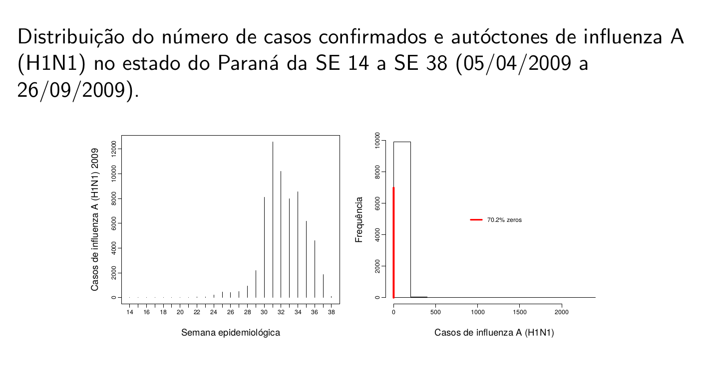

```{r,echo=FALSE,message=FALSE,warning=FALSE}
library(knitr)
library(pander)
# Set so that long lines in R will be wrapped:
opts_chunk$set(tidy.opts=list(width.cutoff=50),tidy=TRUE)

```

# Introdução à Análise Estatística Espacial


## O que é Análise Estatística Espacial ?

- São métodos estatísticos que levam em consideração a localização espacial do fenômeno estudado;

- Defini-se "Análise estatı́stica espacial quando os dados são espacialmente localizados e se considera explicitamente a possı́vel importância de seu arranjo espacial na análise ou interpretação dos resultados" (Bailey & Gatrell, 1995).

- Principal caracterı́stica: a localização geográfica é utilizada explicitamente na análise.

- Neste curso serão abordadas basicamente as técnicas estatı́sticas de análise espacial.

- Diversas operações realizadas em um SIG são também chamadas **análise espacial**, mas **não são** objeto deste curso.

## Origem da Estatística Espacial

- Dr. John Snow (1813-1858) Considerado pai da Epidemiologia Moderna


 {width=50%}


- Mapeamento dos casos de coléra (***$\bullet$***) e as bombas de água (***X***). (Londres, 1854)

 {width=80%}


## Quando usar métodos de análise espacial ?

-  ***A primeira pergunta a ser feita é:*** A distribuição dos dados apresenta um padrão aleatório ou apresenta uma agregação definida (**clusters**) ?


 {width=80%}


- **Heterogeneidade espacial:** A magnitude e a direção do fenômeno de interesse varia no espaço.

- **Violação da suposição de independência:** Os atributos da observação *i* influencia nos atributos na observação *j*. 


## Dependência espacial

- Quais as possı́veis implicações de não considerar a localização espacial na modelagem?

- "Todas as coisas são parecidas, mas coisas mais próximas se parecem mais que coisas mais distantes" (Tobler, 1979). Também conhecida como 1$^a$ Lei da Geografia

- "Independência é um pressuposto muito conveniente que faz grande parte da teoria estatı́stica matemática tratável. Entretanto, modelos que envolvem dependência estatı́stica são freqüentemente mais
realı́sticos. [...] dados espaciais, onde a dependência está presente em todas as direções e fica mais fraca a medida em que aumenta a dispersão na localização dos dados." (Cressie,1991)

- Generalizando, a maior parte dos fenômenos, sejam estes socioeconômicos ou da área da saúde, apresentam entre si uma relação - semelhança ou inibição - que depende da distância.


## Aplicações em Saúde

- **Mapeamento de doenças:** O objetivo geral é avaliar a variação geográfica na ocorrência das doenças
visando identificar diferenciais de risco, orientar a alocação de recursos, levantar hipóteses etiológicas.

- **Cluster:** O objetivo da detecção de cluster espacial é estabelecer a significância de um sobre-risco em um determinado espaço ou tempo e espaço. Este cluster pode ser causado por diferentes fatores: agentes infecciosos, contaminação ambiental localizada, efeitos colaterais de tratamentos, etc.

- **Estudos ecológicos:** Essencialmente modelos de regressão, onde se busca explicar a variação na
incidência da doença através de outras variáveis. 

- **Avaliação e monitoramento ambiental:** Estimativa e monitoramento da distribuição espacial de fatores ambientais relevantes para a saúde. Por exemplo, poluentes quı́micos, insolação (Raios UV), vegetação, clima, etc.

- A quantidade e disponibilidade de dados nesta área vem crescendo, com ênfase particular para as imagens de satélite, com resolução e acessibilidade cada vez maior.


## Tipologia dos dados espaciais

Os diferentes tipos de dados espaciais são tradicionalmente classificados de acordo com uma tipologia. Esta caracterização diz respeito a natureza estocástica da observação.

  - Cressie divide a estatı́stica espacial em 3 grandes áreas:

    - Dados de processos pontuais;

    - Dados de geoestatı́stica;

    - Dados de área;

Existem métodos estatı́sticos diferentes para descrever ou analisar estes
tipos de dados.


 {width=80%}


Eventualmente misturas de diferentes tipos de dados estão presentes em
um mesmo estudo.

Em algumas situações pode-se converter o dado de um tipo para outro.


## Dados de Processos Pontuais

- O principal interesse está no conjunto de coordenadas geográficas representando as localizações exatas de eventos.

- Exemplos: Localização de crimes, localização da residência dos casos de dengue, localização de espécies vegetais, etc.

- Neste caso, o dado aleatório de interesse é a localização espacial do evento.

- O objetivo é estudar a distribuição espacial dos pontos testando a hipótese sobre o padrão observado: existe aglomeração de casos ou eles estão dispostos aleatoriamente ?
 


Localização da ocorrência de todos os crimes violentos no ano de 1998 registrados pela PM de Belo Horizonte


{width=60%}


Existe aglomeração de casos em algum ponto da cidade ?

Localização da ocorrência de Dengue em Belo Horizonte

{width=60%}


Detection and modelling of case clusters for urban leptospirosis}

{width=90%}


http://www6.ensp.fiocruz.br/repositorio/sites/default/files/arquivos/DetectionModelling.pdf


Spatial distribution of leptospirosis in the city of Rio de Janeiro, Brazil, 1996-1999


{width=90%}


http://www.scielo.br/pdf/csp/v20n6/31.pdf


## Geoestatı́stica

- São dados que compreendem um conjunto de localizações (em geral latitudes e longitudes), mas agregados a eles uma medida contı́nua, como por exemplo o volume de chuva.

- Neste caso estaremos interessados em entender o padrão nos valores amostrados nestas localizações e também modelar e estimar valores em localizações não medidas.

- Bastante utilizada em ciências ambientais (chuva, temperatura, umidade, poluentes no ar, etc.)

- Exempplo: Mapa sobre o teor de argila no solo.

 {width=90%}


Krigagem da chuva no Rio de Janeiro

[TEIXEIRA, Tatiana Rodrigues de Araujo  e  CRUZ, Oswaldo Gonçalves. Spatial modeling of dengue and socio-environmental indicators in the city of Rio de Janeiro, Brazil.](http://www.scielo.br/pdf/csp/v27n3/19.pdf)


## Dados de Área

- Este tipo de dado pode ser visualizado em mapas onde o espaço é particionado em áreas e cada área é colorida de acordo com alguma variável.

- As áreas podem ser:

    - Irregulares: divisões de caráter polı́tico ou administrativo. Por exemplo: municı́pios,   setores  censitários, etc.
    
    - Regulares: medidas em grade regular. Por exemplo, imagens de satélite.
    
- Para cada uma destas áreas temos informações agregadas de um determinado fenômeno (em geral somas ou médias).

- Bastante utilizado em epidemiologia, economia e demografia, etc.
 


Taxas de câncer de pulmão na população branca masculina nos Estados Unidos, por condados no ano de 1998


{width=70%}


**Objetivo:** Identificar áreas de risco.
 


Spatial-temporal analysis of dengue deaths: identifying social vulnerabilities 

 {width=70%}


http://www.scielo.br/pdf/rsbmt/v50n1/0037-8682-rsbmt-50-01-00104.pdf


## Geoprocessamento
 

- O geoprocessamento é o processamento informatizado de
dados georreferenciados;

- Utiliza programas de computador que permitem o uso de
informações cartográficas (mapas, cartas topográficas e
plantas) e informações a que se possa associar
coordenadas desses mapas, cartas ou plantas;


 {width=50%}


## Tecnologias de Geoprocessamento
 
  {width=70%}


## Sistema de Informações Geográficas
 

* Um Sistema de Informação Geográfica (SIG ou GIS - Geographic Information System) é um sistema de hardware, software, informação espacial e procedimentos computacionais que permite e facilita a análise, gestão ou
representação do espaço e dos fenômenos que nele
ocorrem;

  {width=70%}


  {width=70%}


### QGIS
 
  {width=70%}


(https://www.qgis.org/en/site/)


  {width=70%}

 

https://www.qgis.org/en/site/


## Análise Espacial no R

[CRAN Task View: Analysis of Spatial Data](https://cran.r-project.org/web/views/Spatial.html)


## Alguns Conceitos

### Autocorrelação espacial

- É uma medida estatı́stica que quantifica e testa o grau de dependência entre observações no espaço.

    - Caso haja evidência de estrutura espacial, o postulado de independência das amostras, é inválido.
    
    - Nestes casos os modelos de regressão devem levar em conta explicitamente o espaço em suas formulações.
    
    - Dados espaciais são considerados uma única realização de um processo estocástico. Diferente da amostragem tradicional, em que cada observação traz uma informação independente, todas as observações são utilizadas de forma conjunta para descrever o padrão do fenômeno estudado.

### Estacionariedade

- O processo é estacionário se a média é constante e a covariância entre dois pontos quaisquer é função apenas da diferença entre as duas localizações.


### Isotropia

- O processo é isotrópico se além de estacionário, a covariância depende somente da distância entre as localizações.

## Aplicações

### Dengue em Dourados

  {width=100%}


  {width=100%}


  {width=100%}


### Vigilância dos vetores da Dengue usando modelagem espaço-temporal Bayesiana

  {width=100%}


  {width=100%}


  {width=100%}


  {width=100%}


### Modelo Espaço-Temporal para a Análise da Morbimortalidade por Influenza

  {width=100%}


- **Fonte de dados:** Sistema Nacional de Informação de Agravos de
Notificação (SINAN) do Ministério da Saúde, Brasil.

- **Desfecho:** Casos confirmados e autóctones de influenza A (H1N1) de
5 de abril a 26 de setembro de 2009.

- **Nı́vel de agregação espacial:** Municı́pio de residência (399)

- **Nı́vel de agregação temporal**: Semana epidemiológica (25)

- **Covariáveis:** Precipitação, temperatura (mı́nima e máxima), umidade
relativa do ar, altitude, taxa de pobreza, IDH municipal, densidade
demográfica e presença dos principais meios de transporte (ônibus
municipal, ônibus intermunicipal, barco e avião).

  {width=100%}


  {width=100%}


  {width=100%}


  {width=100%}


### Análise da temperatura na costa central da Califórnia

- Os dados consistem de medidas mensais de temperatura em graus
centı́grados em 23 estações monitoradoras localizadas na 5 a Região
Climática da Califórnia.

- As séries temporais correspondem ao perı́odo de janeiro de 1992 a
dezembro de 2002.

- A altitude para cada uma das estações também estava disponı́vel.

  {width=130%}


- A estrutura de média foi modelada usando um nı́vel variando ao longo do tempo, uma componente sazonal e um termo linear para a altitude.

  {width=130%}


### A Relação entre a Malária e a Chuva no Estado do Pará: Uma Análise Espaço-Temporal.

**Objetivos:**

- Estudar as similaridades/diferenças entre as ocorrências de malária no Pará;

- Estudar a relação entre a incidência de malária e a quantidade de chuva;

- Verificar existência de estrutura espacial e temporal.

**Material:**

- As informações deste trabalho referem-se ao número de casos de malária em alguns municı́pios do estado do Pará através de dados mensais coletados durante os anos de 96 à 98.

- Os dados de chuva são dados mensais observados durante os anos de 96 a 98 coletados em 78 estações monitoradoras espalhadas pelos municı́pios.


  {width=100%}


  {width=100%}


  {width=100%}

### Mapas de Fluxo


Dissertação “Análisis espacial de factores socioeconómicos, de servicios de salud y de
mortalidad por cáncer de mama, Argentina, 2009-2011” por Andrea Perinetti


## Material on line sobre Estatística Espacial

**Análise Espacial de Dados Geográficos**

http://www.dpi.inpe.br/gilberto/livro/analise/

**R Spatial**

https://www.r-spatial.org/

**Geocomputation with R**

https://bookdown.org/robinlovelace/geocompr/


## Onde encontrar dados espaciais ?

- Geographical Place Names http://www.geonames.org/

- Global Administrative Areas http://gadm.org/country

- Land Cover and Elevation http://eros.usgs.gov/#/Find_Data

- 2000 U.S. Census Data: http://disasternets.calit2.uci.edu/census2000/

- Natural Resources: http://www.prio.no/CSCW/Datasets/Geographical-and-Resource/

- International Conflict Data http://www.acleddata.com/

- A large number of links is also available at: http://gis.harvard.edu/

- http://www.people.fas.harvard.edu/~zhukov/Datasets.RData


## Bibliografia sugerida

Bailey, Trevor C.; Gatrell, Anthony C. (1995) Interactive Spatial Data Analysis. Harlow Essex: Longman.

Cressie, N. A. C. (1991). Statistic for Spatial Data. New York.

Costa, Ana C. C., et al. (2015). ”Surveillance of dengue vectors using spatio-temporal Bayesian modeling.”BMC medical informatics and decision making 15.1: 93.

Sansó, B., Schmidt, A. M. e Nobre, A. A. (2008). Bayesian Spatio-temporal models based on discrete convolutions. Canadian Journal of Statistics, 36, 239-258.

Nobre, A. A., Schmidt, A. M. e Lopes, H. F. (2005). Spatio-temporal models for mapping the incidence of malaria in Pará. Environmetrics, 16, 291-304.