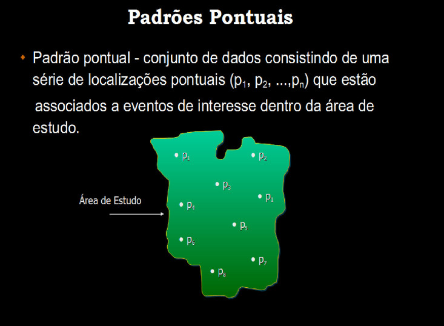
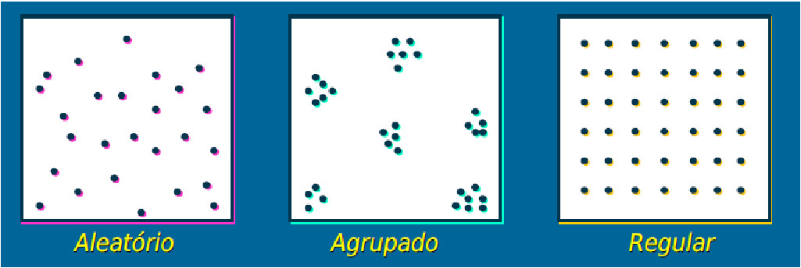

```{r,echo=FALSE,message=FALSE,warning=FALSE}
library(knitr)
library(pander)
# Set so that long lines in R will be wrapped:
opts_chunk$set(tidy.opts=list(width.cutoff=50),tidy=TRUE)

```


# Padrões Pontuais

## O que são Padrões Pontuais ?

A análise de padrão de pontos, é o tipo mais simples de análise de dados espaciais. Baseia-se na localização dos eventos em um determinada área de estudo a partir das coordenadas. O objetivo é estudar
a disposição espacial dos pontos a partir de suas coordenadas.

- Os processos pontuais são definidos como um conjunto de
pontos cuja localização está em $R^2$, sendo esse processo gerado por um mecanismo
estocástico.

- Os pontos são os pares de coordenadas *(x, y)*, que representam os eventos (x: observações, indivíduos, lugares ou qualquer outro objeto discreto definido no espaço).

| Evento | Coord X | Coord Y |
| :----: | :-----: |:-----: |
|   1    |  4,30   | 2,45    |
|   2    |  5,39   | 3,35    |
|   3    |  4,10   | 3,50    |


<!-- {width=70%} -->


- Na realidade o que se deseja é detectar padrões de aglomerados espaciais (“clusters”).

<!-- {width=100%} -->

{width=90%}


## Tipos de Distribuições 

- **Aleatória**, qualquer ponto tem a mesma probabilidade de ocorrer em qualquer local
e a posição de qualquer ponto não é afetada pela posição de qualquer outro ponto;

- **Uniforme**: cada ponto é tão longe de todos os seus vizinhos quanto possível;

- **Cluster**: Muitos pontos estão concentrados juntos, e grandes áreas podem conter pouquíssimos pontos, se houver algum.

{width=70%}

[Fonte: Geospatial Training Workshop](https://training.fws.gov/courses/references/tutorials/geospatial/CSP7304/)

Lendo os bancos com as localizações dos casos de homicídios, suicídios e acidentes de carro em Porto Alegre/RS

```{r, echo=T, warning=FALSE, results='asis', message = FALSE, out.width = "80%", fig.align = "center"}

library(splancs)
library(spatstat)
library(gpclib)

# lendo os bancos
homic <- read.table("dados/homic.dat", col.names=c("x","y"))
suic <- read.table("dados/suic.dat", col.names=c("x","y"))
acid <- read.table("dados/acid.dat", col.names=c("x","y"))

# Plotando os casos de homicídios em um plano cartesiano
plot(homic$x,homic$y)

```

Porto Alegre é uma cidade disposta ao longo do eixo norte/sul. O grafico perdeu a estrutura espacial, ajustando para o tamanho e forma da janela. Por isso é necessario informar ao programa que este tipo de objeto tem uma escala que deve ser preservada, um objeto do tipo *spatial point pattern*.

```{r, echo=T, warning=FALSE, results='asis', message = FALSE, out.width = "100%", fig.align = "center"}

homic.spp <- as.points(homic)
acid.spp <- as.points(acid)
suic.spp <- as.points(suic)

# Mapa
pointmap(homic.spp, pch=19)

# Adicionando no mapa as outras causas externas

pointmap(suic.spp, add=T, pch=19, col=2)
pointmap(acid.spp, add=T, pch=19, col=3)

```

Importando o poligono do contorno de Porto Alegre


```{r, echo=T, warning=FALSE, results='asis', message = FALSE, out.width = "100%", fig.align = "center"}
contorno.poa <- as.points(read.table("dados/contpoa.dat",col.names=c("x","y")))
polymap(contorno.poa)
pointmap(homic.spp, pch=19, add=T)
pointmap(suic.spp, pch=19, add=T, col=2)
pointmap(acid.spp, pch=19, add=T, col=3)

```

Os pontos fora do contorno sao das ilhas, nao devem ser incorporados a analise.

```{r, echo=T, warning=FALSE, results='hide', message = FALSE, out.width = "100%", fig.align = "center"}
homic2.spp <- delpoints(homic.spp)

```

```{r, echo=F, warning=FALSE, results='asis', message = FALSE, out.width = "100%", fig.align = "center"}
# write.table(homic2.spp, "dados/homic2.txt", row.names = FALSE, col.names=FALSE)
homic2 <- read.table("dados/homic2.txt", col.names=c("x","y"))
homic2.spp <- as.points(homic2)
```

Este comando é igual ao identify, clique em cada ponto que deseja deletar. Para terminar clique 2 vezes com o botao da direita

```{r, echo=T, warning=FALSE, results='hide', message = FALSE, out.width = "100%", fig.align = "center"}
polymap(contorno.poa)
pointmap(homic2.spp, pch=19, add=T)

```


## Processos pontuais 
 
Os processos pontuais podem ser descritos como:

i) **Processo de primeira ordem**, considerados globais ou de larga escala, que correspondem a variações no valor médio do processo no espaço. 
    
  - Tal processo pode ser representado por mensurações da intensidade baseado na densidade dos pontos (média dos eventos) na área de estudo (ex: Estimativa de Kernel).
    
    
ii) **Processo de segunda ordem**, denominados locais ou de pequena escala, é o processo representado pela interação entre dois pontos arbitrários. 
    
  - O objetivo desse processo é a mensuração da dependência espacial baseado na distância entre os pontos (ex: Vizinhos mais próximos, Função K).
    

<!-- ## Processos de primeira ordem -->

<!-- A intensidade do processo é definida como: esperança de $N(S)$ - número de eventos $N$ em sub-região $S$ - para uma pequena região $dx$ em -->
<!-- torno do ponto $x$, quando $dx$ tende a zero. -->

<!-- $$\dfrac{E[N(dx)]}{|dx|}$$ -->


## Completa Aletoriedade Espacial (*CSR - complete spatial randomness*)

$H_0$: Os pontos estão distribuidos aleatoriamente no espaço

$H_1$: Os pontos podem formar clusters ou estão dispersos no espaço


- *CSR* assume que os pontos seguem um processo homogênio de Poisson na área de estudo.

  <!-- - A densidade dos pontos é constante homogênea ao longo da área de estudo; -->

  <!-- - Para uma amostra aleatória de subregiões, a distribuição da frequência do número de pontos em cada região segue uma distribuição de poisson; -->

<!--     - O número de pontos em uma dada subregião e o mesmo para todas as subregiões na área de estudo; -->

   <!-- - O número de pontos na subregião, independe do número de pontos em qualquer outra subregião. -->
    

Simulando alguns padrões dos dados de ponto, temos o seguinte:

```{r, echo=F, warning=FALSE, results='hide', message = FALSE, out.width = "100%", fig.align = "center"}

# library("spatstat")
# set.seed(999)
# aleatorio <- rpoispp(50)
# regular <- rMaternII(200,0.1)
# agregado <- rMatClust(5, 0.05, 10)
# 
# 
# par(mfrow=c(1, 3))
# plot(aleatorio, main="Aleatório")
# plot(regular, main="Regular")
# plot(agregado, main="Agregado")

```

- Simulando os processo espaciais

```{r, echo=T, warning=FALSE, results='asis', message = FALSE, out.width = "100%", fig.align = "center"}

set.seed(9999)
# Criando uma caixa envoltoria
caixa <- rbind(c(0,0),c(0,1),c(1,1),c(1,0),c(0,0))

# Simulando um processo espacial aletaorio
#csr significa "complete spatial randomness"
alea.spp <- csr(caixa,100)

# Processo de poisson clusterizado
clu.spp <- pcp.sim(rho=20,m=10,s2=0.005, region.poly=caixa)
# rho= intensidade do processo de poisson "pai"(gerador)
# m=media 
# s2=variancia 

# Distribuicao regular
uni.spp <- jitter(gridpts(caixa,100),2)
# o comando jitter cria uma flutuacao aleatoria sobre os valores
# o comando gridpts gera uma grade regular
# 2 e' o fator de confusao adicionado ao grid regular
```

```{r, echo=F, warning=FALSE, results='hide', message = FALSE, out.width = "100%", fig.align = "center"}
# 
# # Verificando quantos pontos de fato foram criados em cada objeto
# pdense(clu.spp,caixa)
# pdense(uni.spp,caixa)
# pdense(alea.spp,caixa)

```

```{r, echo=T, warning=FALSE, results='asis', message = FALSE, out.width = "100%", fig.align = "center"}

par(mfrow=c(1, 3))
plot(alea.spp, main="Aleatório")
plot(uni.spp, main="Regular")
plot(clu.spp, main="Agregado")

```

Verificando a distribuição dos pontos por quadrantes 

```{r, echo=F, warning=FALSE, results='hide', message = FALSE, out.width = "100%", fig.align = "center"}
# aleatorioQ <- quadratcount(aleatorio, nx = 4, ny = 4)
# regularQ <- quadratcount(regular, nx = 4, ny = 4)
# agregadoQ <- quadratcount(agregado, nx = 4, ny = 4)
# 
# 
# par(mfrow=c(1, 3))
# plot(aleatorioQ, main="Aleatório")
# plot(aleatorio, add = TRUE)
# 
# plot(regularQ, main="Regular")
# plot(regular, add = TRUE)
# 
# plot(agregadoQ, main="Agregado")
# plot(agregado, add = TRUE)


```

```{r, echo=T, warning=FALSE, results='asis', message = FALSE, out.width = "100%", fig.align = "center"}

# Convertendo para a class ppp
library(spatstat)
alea.ppp <- as.ppp(alea.spp, c(0,1,0,1))
uni.ppp <- as.ppp(uni.spp, c(0,1,0,1))
clu.ppp <- as.ppp(clu.spp, c(0,1,0,1))

# Construindo os quadrantes com as respectivas contagens
aleatorioQ <- quadratcount(alea.ppp, nx = 4, ny = 4)
regularQ <- quadratcount(uni.ppp, nx = 4, ny = 4)
agregadoQ <- quadratcount(clu.ppp, nx = 4, ny = 4)


par(mfrow=c(1, 3))
plot(aleatorioQ, main="Aleatório")
plot(alea.ppp, add = TRUE)

plot(regularQ, main="Regular")
plot(uni.ppp, add = TRUE)

plot(agregadoQ, main="Agregado")
plot(clu.ppp, add = TRUE)

```

- Testando a Completa Aletoriedade Espacial (*CSR - complete spatial randomness*)

```{r, echo=T, warning=FALSE, results='asis', message = FALSE, fig.align = "center"}

quadrat.test(aleatorioQ)

```

```{r, echo=T, warning=FALSE, results='asis', message = FALSE, fig.align = "center"}

quadrat.test(agregadoQ)

```

```{r, echo=T, warning=FALSE, results='asis', message = FALSE, fig.align = "center"}

quadrat.test(regularQ)

```

## Estimativa de Kernel

Uma análise exploratória de um processo pontual começa pela estimação da intensidade de ocorrências do processo em toda a região em estudo. Com isso, gera-se uma superfı́cie cujo valor é proporcional à intensidade de eventos por unidade de área;

O estimador Kernel é um interpolador, que possibilita a estimação da intensidade do evento em toda a área, mesmo nas regiões onde o processo não tenha gerado nenhuma ocorrência real.

Essa técnica de alisamento, utiliza janela móvel que para cada área estima um peso variável conforme a distância.

O objetivo é de estimar a intensidade do processo pontual $=$ número de eventos por unidade de área 


{width=100%}

$$\hat{\lambda}(s) = \sum\limits_{i=1}^{n} \dfrac{1}{\tau^2} K \left( \frac{(s - s_i)}{\tau} \right) \nonumber$$

Sendo:

- $\hat{\lambda}(s)$ - valor estimado por área;

- A função $K(\bullet)\Rightarrow$ FDP, escolhida de forma adequada para construir uma superfície contínua sobre os dados;

- O parâmetro $\tau$ denominado "largura de banda ou faixa"" (**bandwidth**), controla o amaciamento da superfície gerada;

- $s$ centro da área, representada por uma localização qualquer na área de estudo;

- $S_i$ são as localizações dos eventos observados;

- $n$ representa o número de pontos (eventos).

{width=100%}

<!-- - Foi desenvolvida originalmente para obter uma estimação alisada -->
<!-- da densidade de probabilidade uni ou multivariada, ou um -->
<!-- histograma alisado. -->

<!-- - Estimar a intensidade de pontos dispostos no espaço é semelhante a estimar uma densidade de probabilidade bivariada. -->


### Estimativa de Kernel com correção por bordas

Primeiramente calcula-se o volume sob o Kernel que está de fato dentro da região de estudo.

$$\delta_{\tau}(s) = \int_{R}\dfrac{1}{\tau^2}k \left( \dfrac{(s-u)}{\tau}\right) du$$

Aplicando a correção das bordas obtém-se um estimador corrigido:

$$\hat{\lambda}(s) = \dfrac{1}{\delta_{\tau}(s)} \sum\limits_{i=1}^{n} \dfrac{1}{\tau^2} K \left( \frac{(s - s_i)}{\tau} \right) \nonumber$$

Exemplo: 


```{r, echo=F, warning=FALSE, results='hide', message = FALSE, out.width = "100%", fig.align = "center"}


# par(mfrow=c(1, 3))
# plot(density(aleatorio, bw = 5), main="Aleatório")
# plot(aleatorio, add = TRUE)
# plot(density(regular, bw = 0.1), main="Regular")
# plot(regular, add = TRUE)
# plot(density(agregado, bw = 0.1), main="Agregado")
# plot(agregado, add = TRUE)

```

```{r, echo=T, warning=FALSE, results='asis', message = FALSE, out.width = "100%", fig.align = "center"}

# Analisando o efeito de primeira ordem: variacao da intensidade
# kernel quartico

alea.ker <- kernel2d(alea.spp,caixa,h0=.1,nx=100,ny=100)
clu.ker <- kernel2d(clu.spp,caixa,h0=.1,nx=100,ny=100)
uni.ker <- kernel2d(uni.spp,caixa,h0=.1,nx=100,ny=100)

par(mfrow=c(1, 3))
image(alea.ker, col=gray(32:0/32),  main="Aleatorio")
pointmap(alea.spp, add=T,pch=19, col="red")

image(uni.ker, col=gray(32:0/32), main="Regular")
pointmap(uni.spp, add=T,pch=19, col="red")

image(clu.ker, col=gray(32:0/32), main="Cluster")
pointmap(clu.spp, add=T,pch=19,col="red")

```

Verificando a variacao dos valores da largura de banda estimado atraves do kernel

```{r, echo=T, warning=FALSE, results='asis', message = FALSE, out.width = "100%", fig.align = "center"}

range(clu.ker$z)
range(alea.ker$z)
range(uni.ker$z)

```

Alterando a largura de banda de forma exploratoria

```{r, echo=T, warning=FALSE, results='asis', message = FALSE, out.width = "100%", fig.align = "center"}
clu.ker <- kernel2d(clu.spp,caixa,h0=.05,nx=100,ny=100)
clu.ker1 <- kernel2d(clu.spp,caixa,h0=.2,nx=100,ny=100)
clu.ker2 <- kernel2d(clu.spp,caixa,h0=.5,nx=100,ny=100)


par(mfrow=c(1, 3))

image(clu.ker, col=gray(32:0/32), main="Cluster - Tau = 0.05")
pointmap(clu.spp, add=T)

image(clu.ker1, col=gray(32:0/32), main="Cluster - Tau = 0.2")
pointmap(clu.spp, add=T)

image(clu.ker2, col=gray(32:0/32), main="Cluster - Tau = 0.5")
pointmap(clu.spp, add=T)


```

Passando as linha de contorno

```{r, echo=T, warning=FALSE, results='asis', message = FALSE, out.width = "100%", fig.align = "center"}

par(mfrow=c(1, 3))
image(alea.ker, col=gray(32:0/32),  main="Aleatorio")
contour(alea.ker,add=T)

image(uni.ker, col=gray(32:0/32), main="Regular")
contour(uni.ker,add=T)

image(clu.ker, col=gray(32:0/32), main="Cluster")
contour(clu.ker,add=T)

```

Kernel 3D

```{r, echo=T, warning=FALSE, results='asis', message = FALSE, out.width = "100%", fig.align = "center"}

persp(clu.ker)

```

Estimando a largura de banda otima

```{r, echo=T, warning=FALSE, results='asis', message = FALSE, out.width = "100%", fig.align = "center"}
# Mean Square Error for a Kernel Smoothing - Mse
Mse2d <- mse2d(clu.spp, caixa, nsmse=20,range=0.2)
plot(Mse2d$h,Mse2d$mse, type="l", xlab="h",  ylab="Mse")
```

## Kernel com Variação da população

- O alisamento Kernel permite estimar “eventos por unidade de área”, sem considerar a população.

- Pode-se estimar “população por unidade de área”, e fazer a razão dos dois obtendo uma estimativa alisada de “eventos por população”

$$\hat{\lambda}(s) = \sum\limits_{i=1}^{n} \dfrac{1}{\tau^2} K \left( \frac{(s - s'_j)}{\tau} \right) y_i \nonumber$$

Sendo:

$\lambda'$ - Estimativa populacional para unidade de área

$\tau$ - Largura de banda

$y_i$ - População em cada ponto

Usa-se atribuir ao centróide do setor censitário ou ao centro populacional o número de habitantes de toda a área

## Razão de Kernel

A criação da taxa é a divisão dos alisamentos: eventos por unidade de área
população por unidade de área


$$\hat{\lambda}(s) = \dfrac{\sum\limits_{i=1}^{n} \dfrac{1}{\tau^2} K \left( \frac{(s - s_i)}{\tau} \right)}{\sum\limits_{i=1}^{n} \dfrac{1}{\tau^2} K \left( \frac{(s - s'_j)}{\tau} \right) y_i} \nonumber$$

- Pode-se usar diferentes larguras de banda (em geral maior no denominador para estabilizar mais)

- Pode-se usar outro evento como “estimador da população a risco”

**Exemplo:**Comparando 2 eventos (casos clusterizados - **casos** vs casos aleatórios - **controle**

```{r, echo=T, warning=FALSE, results='asis', message = FALSE, out.width = "100%", fig.align = "center"}

clu.ker2 <- kernel2d(clu.spp, caixa,h0=0.2,nx=100, ny=100)
clualea.ratio <- kernrat(clu.spp, alea.spp,caixa, h1 <- 0.2, h2 <- 0.2,nx=100,ny=100)

par(mfrow=c(1, 2))
image(clu.ker2, col=gray(32:0/32), main="Cluster")
pointmap(clu.spp, add=T, col=2,pch=19,cex=0.7)

image(clualea.ratio, col=gray(32:0/32), main="Razao Cluster/Aleatorio")
pointmap(clu.spp, add=T, col=2,pch=19,cex=0.7)
pointmap(alea.spp, add=T, col=4,pch=19,cex=0.7)

```

Fazendo o kernel para os dados de homicídio de Porto alegre/RS

**Exemplo**: Verificando o padrão espacial de segunda ordem dos casos de homicíodos em POA/RS


```{r, echo=FALSE, warning=FALSE, results='hide', message = FALSE, fig.align = "center", error=FALSE}
homicKer500 <-  kernel2d(homic2.spp,contorno.poa,h0=100,nx=100,ny=100)
homicKer1500 <- kernel2d(homic2.spp,contorno.poa,h0=500,nx=100,ny=100)
homicKer2500 <- kernel2d(homic2.spp,contorno.poa,h0=1500,nx=100,ny=100)

par(mfrow=c(1, 3))
polymap(contorno.poa,axes = FALSE)
image(homicKer500 , col=gray(32:0/32),add=T)
pointmap(homic2.spp, add=T, col=2,pch=19,cex=0.3)
title("Homicidios - 500m")

polymap(contorno.poa,axes=FALSE)
image(homicKer1500, col=gray(32:0/32),add=T)
pointmap(homic2.spp, add=T, col=2,pch=19,cex=0.3)
title("Homicidios - 1500m")

polymap(contorno.poa,axes = FALSE)
image(homicKer2500, col=gray(32:0/32),add=T)
pointmap(homic2.spp, add=T, col=2,pch=19,cex=0.3)
title("Homicidios - 2500m")
```


**Exemplo:**Fazendo a razão de kernel entre as causas de homicídio e suicídios de Porto alegre/RS

```{r, echo=T, warning=FALSE, results='hide', message = FALSE, out.width = "100%", fig.align = "center"}

kernel.ratio <- kernrat(homic2.spp, suic.spp,contorno.poa, h1 <- 500, h2 <-1500,nx=100,ny=100)

polymap(contorno.poa,axes = FALSE)
image(kernel.ratio, col=gray(32:0/32),add=T )
pointmap(homic2.spp, add=T, col=2,pch=19,cex=0.3)
pointmap(suic.spp, add=T, col=4,pch=19,cex=0.3)
title("Razao Homicidio/Suicidio")

```

Uma outra forma de fazer o kernel

```{r, echo=T, warning=FALSE, results='asis', message = FALSE, out.width = "100%", fig.align = "center"}
## construindo a grade de interpolação
range(contorno.poa[,1])
range(contorno.poa[,2])
grade <-  GridTopology(cellcentre.offset=c(17393,164998),cellsize=c(10,10),cells.dim=c(239,345))

## selecao de largura de banda no olho
polymap(contorno.poa)
pointmap(homic2.spp,add=T,col=4,pch=19,cex=0.7)
# procure olhando nas coordenadas qual seria uma distancia "razoavel"
# observe que de um extremo a outro do mapa temos 2390 (na horizontal). Entao uma distancia razoável seria...
``` 

```{r, echo=T, warning=FALSE, results='asis', message = FALSE, out.width = "100%", fig.align = "center"}
## seleção de largura de banda por mínimos quadrados
xx <- mse2d(homic2.spp, contorno.poa,nsmse=50,range=100)
plot(xx$h, xx$mse,  type="l", xlab="h",  ylab="Mse")
```

```{r, echo=T, warning=FALSE, results='asis', message = FALSE, out.width = "100%", fig.align = "center"}
homic.ker5 <- spkernel2d(homic2.spp, contorno.poa, h0=50, grd=grade)
homic.ker10 <- spkernel2d(homic2.spp, contorno.poa, h0=100, grd=grade)
homic.ker15 <- spkernel2d(homic2.spp, contorno.poa, h0=150, grd=grade)
homic.ker20 <- spkernel2d(homic2.spp, contorno.poa, h0=200, grd=grade)


df <- data.frame(ker5=homic.ker5, ker10=homic.ker10, ker15=homic.ker15, 
          ker20=homic.ker20)

kernels <- SpatialGridDataFrame(grade,data=df)
spplot(kernels,col.regions=terrain.colors(16),cuts=15)

```


## Função F e G - Distância do vizinho mais próximo

- Kernel e quadrat permitem explorar a variação da média do processo na região de
estudo (propriedade de primeira ordem)

- Para investigar propriedade de segunda ordem é necessário observar as distâncias
entre os eventos

- O método do vizinho mais próximo estima a função de distribuição
cumulativa baseado nas distâncias entre eventos ou pntos em uma região de análise.


- Dois tipos de distâncias: **evento-evento (W)** e **ponto aleatório-evento (X)**

$$\hat{F}(x) = \dfrac{\#x_i \leq x)}{m}$$

$$\hat{G}(w) = \dfrac{\#w_i \leq w)}{n}$$

- Sabendo que:

*W* - evento-evento

*X* - ponto-evento

*#* - contagem de pontos onde a condição acontece

*n* - total de eventos

*m* - total de pontos aleatórios

- Em ambas funções, podemos dizer que podem ser representadas pelo número de ($x_i$) ou ponto ($w_i$) cuja distância é menor ou igual ao evento ($x$) ou ponto ($w$), dividido pelo total de pontos ($m$) ou total de eventos ($n$) na região. 

- O resultado desta função empírica é o histograma das distâncias para o vizinho
mais próximo - cada classe do histograma é uma contagem de eventos que ocorrem até
aquela distância

A plotagem dos resultados desta função de distribuição cumulativa empírica pode ser usada como um método exploratório para se verificar se existe evidência de interação entre os eventos. Se esta plotagem apresentar um crescimento rápido para pequenos valores de distância, esta situação aponta para interação entre os eventos caracterizando agrupamentos nestas escalas. Se esta plotagem apresentar valores pequenos no seu início, e só crescer rapidamente para
valores maiores de distância, esta situação aponta para uma distribuição mais regular. 

```{r, echo=F, warning=FALSE, results='hide', message = FALSE, fig.align = "center"}

# par(mfrow=c(1, 3))
# plot(Gest(alea.ppp),main="Aleatório")
# plot(Gest(uni.ppp), main="Regular")
# plot(Gest(clu.ppp), main="Agregado")

```


```{r, echo=T, warning=FALSE, results='asis', message = FALSE, fig.align = "center"}

par(mfrow=c(1, 3))
plot(envelope(Y = alea.ppp, fun = Gest, nsim = 39), main="Aleatório")
plot(envelope(Y = uni.ppp, fun = Gest, nsim = 39), main="Regular")
plot(envelope(Y = clu.ppp, fun = Gest, nsim = 39), main="Agregado")

```
Embora o método do vizinho mais próximo forneça uma indicação inicial da distribuição espacial, ele considera apenas escalas pequenas. Para se ter informação mais efetiva para o padrão espacial em escalas maiores, o melhor método a ser utilizado é o da função $K$. 

## Função K de Ripley (ou apenas função K).

- A função $K$ permite analisar as propriedades de segunda ordem de um processo isotrópico

$$\lambda K(h) = E(\#eventos)$$

Sendo:

- $#eventos$ - é o número de eventos esperados até distância $h$

- $\lambda$ é a intensidade ou número médio de eventos por unidade de área

eventos contidos a uma distância h de um evento arbitrário$)$

- A função $K(h)$ é, para cada distância $h$, o somatório do total de pares cuja distância é menor de que $h$, vezes o inverso do total de pares ordenados existente na região $R$.

$$K(h) = \dfrac{1}{\lambda^{2} R}\sum \sum\limits_{i \neq j} I_{h} (d_{ij})$$

Supondo:

$$I_{h}(d_{ij}) = \begin{cases} 1  \ \ se\ \  d_{ij} \leq h \\ 0 \ \ se\ \  d_{ij} > h \end{cases}$$

$I_{h}(d_{ij})$ é uma função indicador

- Esta função também necessita de correção do efeito de borda

- A função *K* de Ripley conta quantos pontos há em círculos em torno de uma planta focal; 

- Os círculos começam com um raio pequeno e vão até um raio que inclui toda a área de estudo; 

- Faz-se uma média do número de pontos nas classes de distâncias em torno de todas as plantas focais da população. 


{width=100%}


- A distribuição é cumulativa e representa o no esperado de vizinhos em um círculo de raio *r* centrado em uma planta arbitrária dividido pela intensidade *λ* do padrão dos pontos na área de estudo;


Possíveis resultados:

- **quando o processo é completamente aleatório**, a curva se desvia relativamente pouco de $\pi r²$. A curva $K$ permanece perto de o valor de referência $\pi r²$;

- **no caso de um processo regular**, obtemos: $\hat{K}(r) < K_{pois}(r)$ porque se os pontos forem repulsivo, eles têm menos vizinhos em média em um raio $r$ do que teriam baseado no pressuposto de uma distribuição aleatória de pontos. Graficamente, a curva K reflete isso repulsão: vemos que no gráfico à abaixo, no processo regular, a curva K está localizada abaixo da referência valor ($\pi r²$);

- **no caso de um processo agregado**, há em média mais pontos em um raio $r$ ao redor os pontos do que o número esperado sob uma distribuição aleatória: consequentemente, os pontos atraem um ao outro e $\hat{K}(r) > K_{pois}(r)$. Graficamente, a curva $K$ está neste momento localizada acima da
valor de referência para todas as áreas de estudo.

```{r, echo=F, warning=FALSE, results='hide', message = FALSE, fig.align = "center"}

# aleatorioK <- Kest(alea.ppp)
# regularK <- Kest(uni.ppp)
# agregadoK <- Kest(clu.ppp)

# par(mfrow=c(1, 3))
# plot(aleatorioK,main="Aleatório")
# plot(regularK, main="Regular")
# plot(agregadoK, main="Agregado")

```

```{r, echo=T, warning=FALSE, results='asis', message = FALSE, fig.align = "center"}

par(mfrow=c(1, 3))
plot(envelope(Y = alea.ppp, fun = Kest, nsim = 39), main="Aleatório")
plot(envelope(Y = uni.ppp, fun = Kest, nsim = 39), main="Regular")
plot(envelope(Y = clu.ppp, fun = Kest, nsim = 39), main="Agregado")

```

## Função *L*

- A função $K(h)$ tem uma distribuição teórica sob condições de aleatoriedade, quando a probabilidade de ocorrência de um evento em qualquer ponto de *R* é independente da ocorrência de outros eventos e igual em toda a superfície.

Neste caso, o número de eventos a uma distância $h$ será $\pi \lambda h^2$:

$$ K(h) = \pi h^2$$

No caso de distribuição regular, $K(h)$ será menor que $\pi h^2$.

Distribuição em cluster, K(h) será maior que $\pi h^2$.

A função $L(h)$ permite comparar a função $K(h)$ e $\pi h^2$

$$L(h) = \sqrt {\dfrac{K(h)}{\pi}}$$

    - Picos positivos indicam atração espacial - cluster
    
    - Vales negativos - repulsão espacial ou regularidade
    
    

```{r, echo=F, warning=FALSE, results='hide', message = FALSE, fig.align = "center"}
# aleatorioL <- Lest(alea.ppp)
# regularL <- Lest(uni.ppp)
# agregadoL <- Lest(clu.ppp)

# par(mfrow=c(1, 3))
# plot(aleatorioL,main="Aleatório")
# plot(regularL, main="Regular")
# plot(agregadoL, main="Agregado")

```

```{r, echo=T, warning=FALSE, results='asis', message = FALSE, fig.align = "center"}

par(mfrow=c(1, 3))
plot(envelope(Y = alea.ppp, fun = Lest, nsim = 99), main="Aleatório")
plot(envelope(Y = uni.ppp, fun = Lest, nsim = 99), main="Regular")
plot(envelope(Y = clu.ppp, fun = Lest, nsim = 99), main="Agregado")

```

**Exemplo**: Verificando o padrão espacial de segunda ordem dos casos de homicíodos em POA/RS


```{r, echo=FALSE, warning=FALSE, results='asis', message = FALSE, fig.align = "center"}

# Convertendo para a class ppp
library(spatstat)
range(homic2[1])
range(homic2[2])
homic2.ppp <- as.ppp(homic2, c(17472, 19073, 165625, 168269))
plot(homic2.ppp)

par(mfrow=c(1, 3))
plot(envelope(Y = homic2.ppp, fun = Kest, nsim = 99), main="Funcao K")
plot(envelope(Y = homic2.ppp, fun = Gest, nsim = 99), main="Funcao G")
plot(envelope(Y = homic2.ppp, fun = Lest, nsim = 99), main="Funcao L")

```

## Detecção de cluster

- Definição (Knox): grupo de ocorrências geograficamente limitado em tamanho e concentração tais que seja improvável ocorrer por mero acaso.

- São causas de cluster: fonte comum, contagiosidade.

- Clusters são em geral espaço-temporais.

- É importante considerar:

    - Demais fatores de risco – sexo, idade;
    
    - Residência X outros locais;
    
    - Latência.
    
- Dois tipos básicos de testes:

    - **Focados**: testa-se a hipótese de excesso de casos ao redor de fonte suspeita, identificada antes de observar os dados;
    
    - **Genéricos**: busca identificar áreas quentes, sem especificar quais e quantas.
    
- Hipóteses dos testes:

  $H_0$: É ausência de cluster: completa aleatoriedade espacial (CSR).

- **CSR** 

- Sendo:

$n$ são subdivisões da região do estudo,

$y_i$ número de casos observados e $E_i$ esperados,

$\lambda$ eventos por unidade de área (e tempo)

- Alternativas:

    - Focados - $\lambda$ varia com a distância da fonte
    
    - Genéricos - existe regiões onde $\lambda$ é mais elevado
 
 
### Testes Genéricos de Cluster 

- **Knox:** Testa um número acima do esperado de pares de casos excessivamente próximos (segundo critério pré-estabelecido) no espaço e no tempo.
 
- **Mantel:** Distância no tempo e distância no espaço, se $x$ for 1 e $y$
for 1, equivale ao teste de Knox.

$$\sum \sum\limits_{i \neq j} x_{ij} y_{ij} $$

- **Cuzick-Edwards:** Caso-controle onde a coincidência de casos vizinhos aumenta o peso, e a junção controle-controle ou caso-controle tem peso zero; este teste permite considerar a variação populacional.

### Fonte Específica

- Cluster ao redor de um ponto ou uma linha

- Compara-se a ocorrência de no excessivo de “casos” em relação à população a partir de uma função de decaimento em relação à possível fonte

$$\lambda (s) = \rho \lambda'(s)f(h;\theta)$$

$$f(h;\theta) = 1 + \theta_1 e^{\theta_{2}h^2}$$

Sendo:

$\theta(s)$ - estimativa do evento p/ unidade de área

$\rho$ - parâmetro que indica a razão entre “casos” e “controles”

$\lambda'(s)$ - estimativa população p/ unidade de área

$f$ - função da distância para a fonte

$θ$ - parâmetros a estimar que descrevem como a incidência varia em torno da fonte


## Exercícios Propostos

1. Testar a CSR e explorar os Kernels para as causas de suicídio e acidentes de carro em POA/RS

2. Fazer a razão de kernel entre suicídios e acidentes de carro em POA/RS

3. Inspecionar o processo pontual de segunta ordem, utilizando as funções K, G e L para as causas de suicídio e acidentes de carro em POA/RS.


## Bibliografia sugerida

ASSUNÇÃO, Renato M. Estatística espacial com aplicações em epidemiologia, economia e sociologia. São Carlos: Associação Brasileira de Estatística, v. 131, 2001.

DIGGLE, Peter J. et al. Statistical analysis of spatial point patterns. Academic press, 1983.

GATRELL, Anthony C. et al. Spatial point pattern analysis and its application in geographical epidemiology. Transactions of the Institute of British geographers, p. 256-274, 1996.


