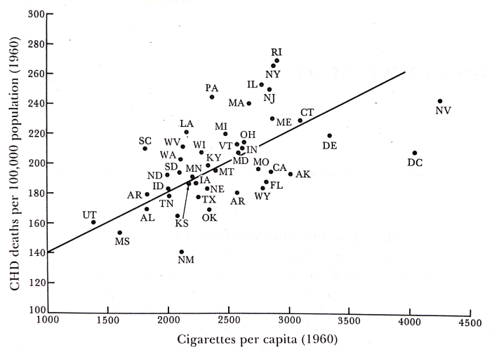
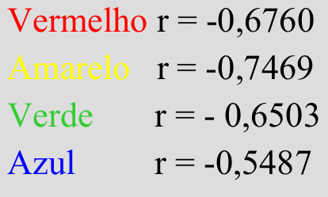
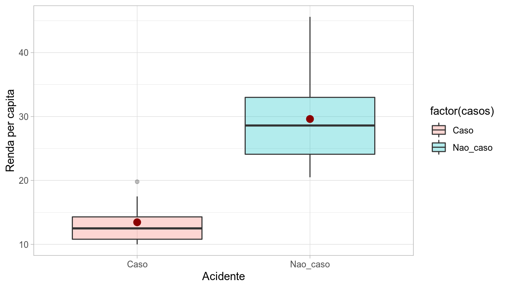

# Estudos Ecológicos

## O que são Estudos Ecológicos ?

- São estudos nos quais a **unidade de análise** (ou agregação) é uma **população** ou um grupo de pessoas, geralmente de uma área geográfica definida (ex: um país, um estado, uma cidade, etc.), em um determinado tempo definido.

- **Definição Clássica**: é um estudo observacional com a informação obtida e analisada no nível **agregado**.


- Geralmente são mais **baratos** e mais **rápidos** do que estudos envolvendo o indivíduo como unidade de análise.

- Procuram avaliar como os contextos (sociais, ambientais, etc) podem afetar a saúde de grupos populacionais.


## Principais objetivos  

- Gerar hipóteses etiológicas;

- Testar hipóteses etiológicas;

- Avaliar a efetividade de intervenções na população;

- Identificar áreas de risco.


**Exemplo 1**: Em 1960, Friedman mostrou uma correlação positiva entre as taxas de mortalidade por doença coronariana (DC) e as vendas de cigarros per capita, em 44 estados americanos.

 - Esta observação inicial contribuiu para a formulação da hipótese de que o tabagismo poderia causar doença coronariana



<small> Figura: Coronary heart disease mortality rates in the United States per capita cigarette sales in 1960, by state. (From FRIEDMAN GD, Cigarette smoking and geographic variation in coronary heart disease mortality in the United States. J. Chronic Dis. 20: 769, 1967)
</small>
 


 


## Tipos de Variáveis Utilizadas

- **Medidas Agregadas**: Medidas agregadas por grupos. ex: incidência, prevalência, mortalidade, proporção de fumantes;

- **Medidas Ambientais**: Características físicas do contexto onde o grupo convive. ex: nível de poluição, precipitação;

- **Medidas Globais**: Atributos de grupos, organizações ou lugares, que não podem ser mensurados a nível individual. ex: IDH, densidade demográfica, existência de um tipo de sistema de saúde.

- Em uma análise ecológica, todas as variáveis são medidas agrupadas. Apenas se conhece a distribuição marginal de cada variável.

<br>

|                       |           Desfecho (*Y*)     |       |
|-----------------------|:--------------:|:-----------:|:-----:|
| **Fator em Estudo (*X*)** |    Ocorreu     | Não ocorreu | **Total **|
| Exposto               |        ?       |      ?      | $E_1$ |
| Não Exposto           |        ?       |      ?      | $E_0$ |
| **Total**                 |      $D_1$     |    $D_0$    |  *n*  |


<br>


## Tipos de Desenhos de Estudos Ecológicos

- **Múltiplos Grupos**: O objetivo desse tipo de estudo é a comparação entre todos os grupos ou conjuntos populacionais envolvidos no estudo. Ex: Análise Espacial.

- **Desenhos de Séries Temporais**: Avalia um determinado desfecho ao longo do tempo em uma determinada população geograficamente definida. Ex: Análise de Séries Temporais.

- **Desenhos Mistos**: É a combinação entre os dois desenhos citados, pois avalia a evolução de um determinado desfecho em diferentes grupos populacionais ao longo do tempo. Ex: Análise Espaço-Temporais, Estudos Multiníveis.


## Aspectos históricos

- “Um estudo ecológico ou agregado focaliza a comparação de grupos, ao invés de indivíduos. A razão subjacente para este foco é que dados a nível individual da distribuição conjunta de duas (ou talvez todas) variáveis estão faltando internamente nos grupos; neste sentido um estudo ecológico é um desenho incompleto”.

<small> (Rothman, Kenneth J. et al. Modern epidemiology. Philadelphia: Wolters Kluwer Health/Lippincott Williams & Wilkins, 2008.) </small>


---

- “... estudar saúde no contexto ambiental. O objetivo é ambicioso: entender como o contexto afeta a saúde de pessoas e grupo através de seleção, distribuição, interação, adaptação, e outras respostas. Medidas de atributos do indivíduo não podem dar conta destes processos [...] Sem medir estes contextos, nem padrão de mortalidade e morbidade, nem o espalhamento epidêmico, nem a transmissão sexual podem ser explicados”

<small> (Susser, Am.J.Public Health, 1994;84:825-835) </small>


---


- A Epidemiologia é frequentemente definida em termos do estudo da determinação da distribuição da doença. Mas não se deve esquecer que quanto mais espalhada é uma causa particular, menos ela contribui para explicar a distribuição da doença.”

- “...dois tipos de perguntas etiológicas. A primeira busca as causas dos casos, e a segunda as causas da incidência.”

- “Aplicada à etiologia, a visão centralizada no indivíduo leva ao uso do risco-relativo como a representação básica da força etiológica: ou seja, o risco em indivíduos expostos relativo aos não-expostos. [...] Esta pode ser geralmente a melhor medida de força etiológica, mas não é medida de [...] importância em saúde pública.” 

- “É rara a doença cuja taxa de incidência não tenha variado largamente, seja ao longo do tempo ou entre populações
[...] Isto significa que as causas da incidência, desconhecidas que sejam, não são inevitáveis. [...] Mas identificar o agente causal pelos métodos tradicionais de caso-controle e coorte não terá sucesso se não houver suficientes diferenças na exposição dentro da população [...] Nestas circunstâncias tudo os que os métodos tradicionais fazem é encontrar marcadores de susceptibilidade individual. A chave deve ser buscada nas diferenças entre populações ou em mudanças nas
populações ao longo do tempo.”

<small> (Rose G. Sick individuals and sick populations. Int J Epidemiol. 2001 Jun;30(3):427-32; discussion 433-4.) </small>


---

- “ ... torna-se aparente que muitas das explicações convencionais dos determinantes da saúde - porque
algumas pessoas são saudáveis e outras não - são, na melhor das hipóteses seriamente incompletas, se não
simplesmente erradas. É assim, infelizmente, porque as sociedades modernas dedicam uma parte muito grande
de sua riqueza, esforço e atenção tentando manter ou melhorar a saúde dos indivíduos que compõem suas
populações. Estes esforços maciços são primeiramente canalizados para os sistemas de assistência à saúde,
presumivelmente refletindo uma crença que receber uma boa assistência é o mais importante determinante de
saúde.” 


<small> (Evans,R.G.”Why are some people healthy and others not”) </small>

---


- “Grande parte da pesquisa atual em epidemiologia está baseada no individualismo metodológico: a noção que a distribuição da saúde e doença em populações pode ser explicada exclusivamente em termos das características dos indivíduos.”


<small> (Diez-Roux AV. Bringing context back into epidemiology: variables and fallacies in multilevel analysis. AJPH,1998;88(2):216-22) </small>

---


- “A evidência de modestos efeitos de vizinhança na saúde é razoavelmente consistente, apesar da
heterogeneidade dos desenhos dos estudos [...] e prováveis erros de medida. Ao chamar a atenção da
saúde pública para os riscos associados com a estrutura social e ecológica de vizinhança, enseja-se possíveis intervenções inovadoras no nível da comunidade.”


<small> (Pickett KE, PearlL M. Multilevel analyses of neighbourhood socioeconomic context and health outcomes: a critical review. J Epidemiol Community Health 2001;55(2):111-22) </small>

---

## Epidemiologia social

- “...o ramo da epidemiologia que estuda a distribuição social e os determinantes sociais da saúde. A epidemiologia social incorpora um novo foco na comunidade como uma entidade em si, uma entidade mais complexa do que a soma das pessoas individuais que compõem a sociedade.” 

<small> (Berkman L. F. &
Kawachi I. (Editors). Social Epidemiology. Oxford University Press, 2000) </small>


- “Os médicos estão acostumados a pensar nos determinantes socioeconômicos da doença em termos dos fatores de risco de uma pessoa. [...] Agora parece claro que a riqueza absoluta ou a renda é um determinante menos importante da saúde do que a relativa disparidade na renda ou a diferença de renda entre os ricos e os pobres.” 

<small> (Kawachi I.; Kennedy B.P.; Wilkinson R.G. The Society and Population Health Reader: Income Inequality and Health. New Press, 1999). </small>


## Árvores, Bosques ou as Florestas?

### As Árvores

- Suponha os dados abaixo, onde a variável *“X”* representa um efeito de exposição e a variável *“Y”* um taxa. Ao fazermos uma regressão obtemos uma correlação de apenas **0,1469** entre as duas variáveis.

{width=400px}


### Os Bosques
  
  - Ao estratificarmos os dados evidencia-se uma estrutura, e ajustarmos uma regressão em cada grupo obtém-se:
  
  |      |      |
| :--: | :--: |
|  {width=100%}     |   {width=60%}   |
  


### As Florestas
  
- Tirando-se a média para cada grupo iremos obter quatro pontos sob os quais faremos uma regressão. O coeficiente de correlação obtido é **rho = 0,9938**
  
  {width=50%} 


## Falácia Ecológica ou viés de agregação

- *"Viés que pode ocorrer porque uma associação entre duas variáveis no nível agregado não necessariamente representa uma associação no nível individual"* 


- O problema é que não podemos fazer inferências para níveis distintos:

    i) Inferir para o indivíduos a partir de dados agregados (***falácia ecológica***)
    
    ii) Inferir para agregados populacionais a partir de dados individuais (***falácia atomística ou individualista***)

- Na estatística esse efeito é conhecido como [Paradoxo de Simpson](https://pt.wikipedia.org/wiki/Paradoxo_de_Simpson)

> “Textos de Epidemiologia fazem uma avaliação consistente sobre estudos ecológicos: eles são tentativas cruas de estimar correlações em nível individual. [...] Examinar esta questão de uma perspectiva diferente - como um problema geral de validade - mostrará que a falácia ecológica, conforme frequentemente usada, encoraja três noções interrelacionadas e falaciosas: 
> 
> (1) que modelos em nível individual são mais perfeitamente especificados que os de nível ecológico, 
> 
> (2) que correlações ecológicas são sempre substitutos para correlações de nível individual, e 
> 
> (3) que variáveis de nível de grupo não causam doença.”

<small> (Schwartz, Am.J.Public Health, 1994;84:819-824) </small>


---

**Religião e Sucídio**

- Um exemplo clássico de estudo ecológico:

    - Emile Durkheim (em 1897) associação ecológica positiva entre a proporção de indivíduos de religião Protestante e as taxas de suicídio (províncias da Prússia);
    
    - Durkheim concluiu que Protestantes tinham maior probabilidade de se suicidarem do que os Católicos;
    
    - Conclusão factível mas a inferência causal não é correta: poderiam ter sido os Católicos em províncias predominantemente Protestantes a cometer os suicídios, e a metodologia ecológica não permite discernir qual das duas hipóteses está certa.
    
    Para ler mais sobre este exemplo: Frans van Poppel and Lincoln H. Day. A Test of Durkheim's Theory of Suicide - Without Committing the "Ecological Fallacy". American Sociological Review, 1996. https://doi.org/10.2307/2096361

---

**Posse de armas de fogo e suicídio**

- Um exemplo mais recente:

    - Miller *et al* (2003) realizaram um estudo ecológico no Estados Unidos comparando as frequências de posse doméstica de armas de fogo com as de suicídio por arma de fogo e por outros meios, por estado. 
    - Estados com maiores proporções de posse de armas de fogo apresentaram maiores taxas de suicídio por armas de fogo, mas a *mesma* frequência de suicídios por outros meios.
    - Suicídios por outros meios serve como um "controle". Segundo os autores, a posse de armas não deveria impactar suicídios por outros meios. Além disso, os autores assumem que os fatores de confundimento seriam os mesmos para suicídios por arma de fogo e por outros meios.
    
  

<small>Figura. Relação entre posse doméstica de armas de fogo e mortalidade por suicídio nos Estados Unidos, por estado, A) por armas de fogo, B) por outros meios que não armas de fogo, e C) todos. (Fonte: Miller et al. Am J Epidemiol. 2013;178(6):946–955)
</small>

\

- Concordam que todos os confundimentos são os mesmos para os dois grupos de mortes por suicídio?
- Concordam que suicídios por outros meios não devem ser afetados pela posse doméstica de armas de fogo?
- É correto concluir que, nos Estados Unidos:
    - ter uma maior porcentagem de população com posse de armas causa taxas elevadas de suicídio por arma de fogo?
    - possuir uma arma é uma causa para suicídio por arma de fogo?

\

---


**Um outro exemplo**: Um pesquisador deseja estudar a relação entre acidentes de trânsito e a renda em três cidade distintas (A, B e C). 


|pop | renda_media| tx_acidente|
|:---|-----------:|-----------:|
|A   |    24.08571|       57.14|
|B   |    22.57143|       42.86|
|C   |    21.41429|       28.57|

---

- Observando o gráfico abaixo, o pesquisador observa um possível associaçãom entre a renda e a taxa de acidentes de trânsito;


- Quanto maior a renda, maior será a taxa de acidentes de trânsito.

---

- Observando os microdados, ou seja, os dados no nível individual, temos o seguinte:


```{=html}
<div id="htmlwidget-afb5a88e6fd079d2796a" style="width:100%;height:auto;" class="datatables html-widget"></div>
<script type="application/json" data-for="htmlwidget-afb5a88e6fd079d2796a">{"x":{"filter":"top","filterHTML":"<tr>\n  <td><\/td>\n  <td data-type=\"number\" style=\"vertical-align: top;\">\n    <div class=\"form-group has-feedback\" style=\"margin-bottom: auto;\">\n      <input type=\"search\" placeholder=\"All\" class=\"form-control\" style=\"width: 100%;\"/>\n      <span class=\"glyphicon glyphicon-remove-circle form-control-feedback\"><\/span>\n    <\/div>\n    <div style=\"display: none; position: absolute; width: 200px;\">\n      <div data-min=\"10\" data-max=\"45.6\" data-scale=\"1\"><\/div>\n      <span style=\"float: left;\"><\/span>\n      <span style=\"float: right;\"><\/span>\n    <\/div>\n  <\/td>\n  <td data-type=\"character\" style=\"vertical-align: top;\">\n    <div class=\"form-group has-feedback\" style=\"margin-bottom: auto;\">\n      <input type=\"search\" placeholder=\"All\" class=\"form-control\" style=\"width: 100%;\"/>\n      <span class=\"glyphicon glyphicon-remove-circle form-control-feedback\"><\/span>\n    <\/div>\n  <\/td>\n  <td data-type=\"character\" style=\"vertical-align: top;\">\n    <div class=\"form-group has-feedback\" style=\"margin-bottom: auto;\">\n      <input type=\"search\" placeholder=\"All\" class=\"form-control\" style=\"width: 100%;\"/>\n      <span class=\"glyphicon glyphicon-remove-circle form-control-feedback\"><\/span>\n    <\/div>\n  <\/td>\n<\/tr>","data":[["1","2","3","4","5","6","7","8","9","10","11","12","13","14","15","16","17","18","19","20","21"],[10.5,34.5,28.5,12.2,45.6,17.5,19.8,12.5,32.5,24.3,10,14.3,38,26.4,28.7,30.2,13.5,23.5,10.8,22.7,20.5],["A","A","A","A","A","A","A","B","B","B","B","B","B","B","C","C","C","C","C","C","C"],["Caso","Nao_caso","Nao_caso","Caso","Nao_caso","Caso","Caso","Caso","Nao_caso","Nao_caso","Caso","Caso","Nao_caso","Nao_caso","Nao_caso","Nao_caso","Caso","Nao_caso","Caso","Nao_caso","Nao_caso"]],"container":"<table class=\"display\">\n  <thead>\n    <tr>\n      <th> <\/th>\n      <th>renda<\/th>\n      <th>pop<\/th>\n      <th>casos<\/th>\n    <\/tr>\n  <\/thead>\n<\/table>","options":{"pageLength":5,"scrollX":true,"columnDefs":[{"className":"dt-right","targets":1},{"orderable":false,"targets":0}],"order":[],"autoWidth":false,"orderClasses":false,"orderCellsTop":true,"lengthMenu":[5,10,25,50,100]}},"evals":[],"jsHooks":[]}</script>
```

---

- De posse desses dados no nível individual, é possível fazer a seguinte análise:




---


- Dessa forma observamos que os indivíduos que sofreram algum tipo de acidente de trânsito, apresentam a menor renda;

- Qual dos dois níveis de inferência está errado ?

- Qual é, então, o problema ? ? ?


---


## Problemas práticos
  
**1. Numerador:**
  
  - subregistro
- duplicidade de registros
- georreferenciamento:
  - não localização
- informação incorreta
- preenchimento inadequado
- mudança na classificação ao longo do tempo

**2. Denominador:**
  
  - espaçamento do censo
- migração
- mudança de fronteiras (!!!!)


**3.Exposição:**
  
- pode ocorrer em diversos lugares 
- dificilmente mensurável com precisão
- uso de “proxy”
- diferentes áreas para medida de exposição e de efeito, e áreas não compatíveis
- Informações mais detalhadas (PNAD, amostra do censo) não extrapoláveis para populações pequenas

**4. Análise:**
  
- migração
- multicolinearidade


## Vantagens
  
  - Baixo custo e execução rápida, devido às fontes de dados secundários disponíveis;

- Conseguem estimar bem os efeitos de uma exposição quando ela varia pouco na área de estudo, pela comparação entre áreas (os estudos individuais não conseguem);

- Existem efeitos que somente podem ser medidos no nível ecológico, por ex. implantação de um novo sistema de saúde.


## Desvantagens
  
- Informações sobre comportamento, atitudes e história clínica não estão disponíveis (dados pessoais não disponíveis);

- Depende da qualidade das informações disponíveis (fontes diversas);

- Não se leva em conta a variabilidade da característica estudada dentro do grupo;

- Difícil estabelecer temporalidade entre causa e efeito.

- Migração entre grupos (por exemplo, mora em uma área e trabalha em outra).


## Resumindo
  
- Resgatando a ecologia: estudo das complexas inter-relações entre organismos vivos e o seu meio físico.

- Dados agregados – estudo ecológico clássico

- Mistura de dados individuais e agregados – modelos multinível

- Quando se estuda o tempo – séries temporais e modelos dinâmicos

- Quando é espacial – modelos clássicos de regressão ou espaciais

- Mistura espaço e tempo – modelos espaço-temporais

- Envolvendo relações entre indivíduos – redes


  
## Exercícios Propostos
  
1) As estatísticas internacionais indicam que o Chile tem uma das mais altas taxas de mortalidade por câncer de estômago. O país caracteriza-se por conter altos níveis de nitrato em seu solo, situação rara no mundo, neste particular. Estabeleceu-se a suspeita de ser o nitrato, em altas concentrações, um agente causal da neoplasia. Comparações regionais dentro do país, contrastando áreas com altas e baixas concentrações de nitrato, mostraram a
mesma relação: alto teor da substância no solo, (alta mortalidade por este tipo de neoplasia). Um estudo caso-controle subseqüente foi realizado, mas a nível individual, não foi possível encontrar tal associação. A hipótese, entretanto, não foi totalmente descartada. Qual a importância desse estudo ecológico no estudo sobre causalidade: concentração de
nitrato no solo vs câncer de estômago  ?
  
2) Os casos notificados de Influenza são maiores na cidade A do que na cidade
B. As taxas de vacinação para a influenza são mais baixas na cidade A do que na cidade
B. Quais das seguintes razões são razões pelas quais seria
é incorreto presumir que uma maior vacinação na cidade B
é o que está fazendo com que a cidade B tenha menos casos relatados de
 Influenza ? Escolha as opções corretas.

a) A cidade A e a cidade B podem ter diferentes cepas de Influenza

b) A cidade A e a cidade B podem ter proporções diferentes de
pessoas nas suas populações que são especialmente vulneráveis
à influenza (por exemplo, idosos, crianças e mulheres grávidas)

c) A cidade A e a cidade B podem ter diferenças nos cuidados de saúde ,
acessibilidade aos serviços e acesso a  diagnóstico da influenza
 
d) A cidade A e a cidade B podem ter climas diferentes, levando a
diferenças em como/onde as pessoas entram em contato com
um ao outro. Isto pode afetar as taxas de transmissão de Influenza


## Bibliografia sugerida


BERKMAN, Lisa F.; KAWACHI, Ichirō; GLYMOUR, M. Maria (Ed.). Social epidemiology. Oxford University Press, 2014.

DIEZ-ROUX, Ana V. Bringing context back into epidemiology: variables and fallacies in multilevel analysis. American journal of public health, v. 88, n. 2, p. 216-222, 1998.

EVANS, Robert G.; BARER, Morris L.; MARMOR, Theodore R. (Ed.). Why are some people healthy and others not?: The determinants of the health of populations. Transaction Publishers, 1994.

MORGENSTERN, Hal. Ecologic studies in epidemiology: concepts, principles, and methods. Annual review of public health, v. 16, n. 1, p. 61-81, 1995.

PICKETT, Kate E.; PEARL, Michelle. Multilevel analyses of neighbourhood socioeconomic context and health outcomes: a critical review. Journal of Epidemiology & Community Health, v. 55, n. 2, p. 111-122, 2001.

ROSE, Geoffrey. Sick individuals and sick populations. International journal of epidemiology, v. 30, n. 3, p. 427-432, 2001.


