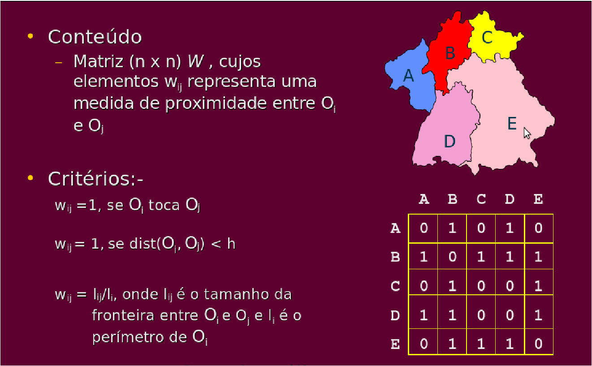
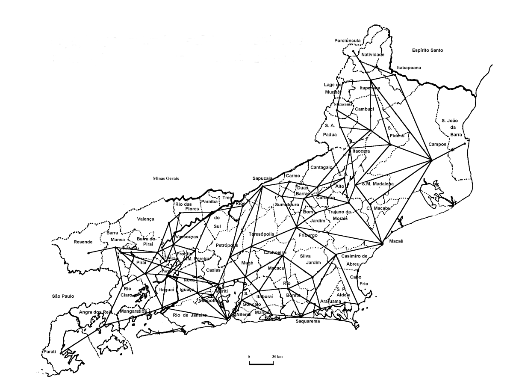
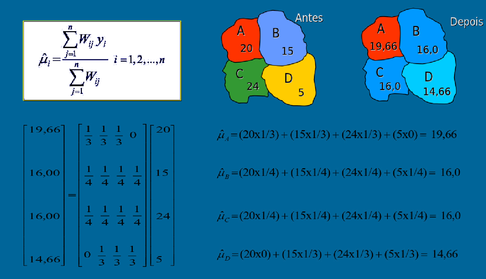
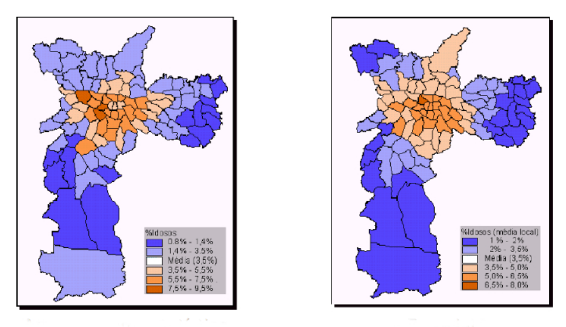
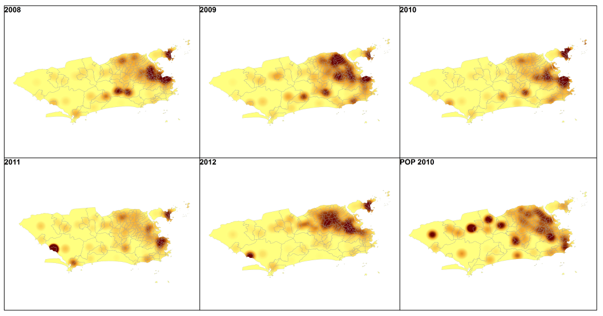
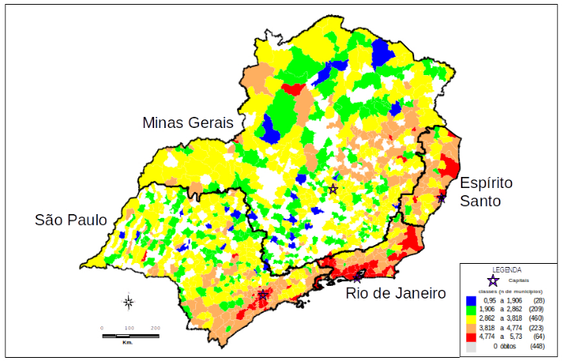
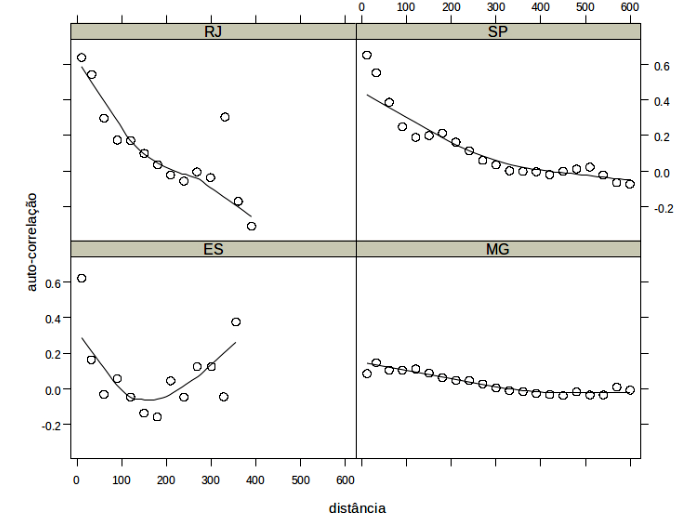
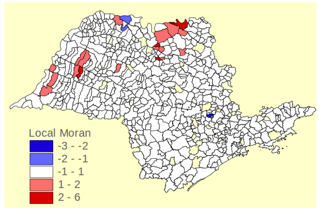

```{r,echo=FALSE,message=FALSE,warning=FALSE}
library(knitr)
library(pander)
# Set so that long lines in R will be wrapped:
opts_chunk$set(tidy.opts=list(width.cutoff=50),tidy=TRUE)

```

# Dados de Área I

## Introdução 

- Na análise de áreas o atributo estudado é em geral resultado de uma contagem ou uma medida de sı́ntse.

- O objetivo é a detecção e explicação de padrões e tendências observados entre áreas.

- Área é definida por um polı́gono cuja forma pode ser complexa bem como as relações de vizinhança.

O modelo básico do banco de dados:

| ID   |    Local    | Casos | População | Médico p/ 1000 hab |
| ---- | :---------: | :---: | :-------: | :----------------: |
| 001  |   Rio Bom   |  41   |   3209    |        5,4         |
| 002  | Serra Verde |  320  |   16897   |        2,6         |
| 003  | Poço Fundo  |  67   |   2569    |        1,3         |


## Principais bibliotecas do R

- maptools (visualização de dados de área)
- sp  (dados pontos,  área, grids, etc...)
- Spatstat (analise de processos pontuais)
- splancs (analise de processos pontuais)
- spdep (analise de dados de área)
- SpatialEpi (métodos para analise epidemiológica espacial)
- sf (pacote moderno para dados de pontos, áreas linhas etc... )
- tmap (mapas temáticos)

Podemos ver outros pacotes que podem interessar em:

[Task View: Analysis of Spatial Data](https://CRAN.R-project.org/view=Spatial)

Para os exemplos a seguir Utilizaremos as bibliotecas:

```{r, echo=T, warning=FALSE, results='hide', message = FALSE, out.width = "80%", fig.align = "center"}

library(tidyverse)
library(sf)
library(maptools)
library(cartography)
library(osmdata) # Open Street Map

```

Antes de mais nada como na aula anterior vamos baixar o *ZIP* contendo os arquivos no formato **shape**

```{r, echo=T, warning=FALSE, results='hide', message = FALSE, out.width = "100%", fig.align = "center"}

#opções para o Windows não se perder
options(download.file.method='libcurl',url.method='libcurl')

#local dos dados na rede
local <- 'https://gitlab.procc.fiocruz.br/oswaldo/eco2019/raw/master/dados/'

tmpdir <- tempdir()
download.file(paste0(local,'olinda.zip'),
              destfile = paste0(tmpdir,'/olinda.zip'))

unzip(zipfile = paste0(tmpdir,'/olinda.zip'),exdir = tmpdir)
dir(tmpdir)
```

Lendo o shape de olinda e exibindo os primeiros registros!

```{r echo=T, fig.align="center", message=FALSE, warning=FALSE, comments=NA, out.width="80%", results='markdown'}

olinda.sf <- read_sf(paste0(tmpdir,'/olinda.shp'), crs = 5535)

olinda.sf

```

<!-- ```{r, echo=T, warning=FALSE, results='hide', message = FALSE, out.width = "80%", fig.align = "center"} -->


<!-- ``` -->


## Visualização: Mapa Temático usando a biblioteca **tmap**


```{r, echo=FALSE, warning=FALSE, results='markdown', message = FALSE, out.width = "100%", fig.align = "center"}


library(tmap)

#olinda.sf <- st_read("shapes/olinda.shp",crs=5535)

tm_shape(olinda.sf) +
  tm_polygons("POP",
    style = "quantile",
    palette = "BuPu") +
  tm_legend(legend.position = c("left", "bottom"))


```

```{r, echo=F, warning=FALSE, results='asis', message = FALSE, out.width = "80%", fig.align = "center"}

DT::datatable(head(olinda.sf))


```

Calculando a taxa bruta de deteccao por 10000
```{r, echo=T, warning=FALSE, results='asis', message = FALSE, out.width = "100%", fig.align = "center"}

olinda.sf$tx <- olinda.sf$CASES*10000/olinda.sf$POP

```

Plotando o mapa temático da taxa de detecção
```{r, echo=T, warning=FALSE, results='asis', message = FALSE, out.width = "100%", fig.align = "center"}

plot(olinda.sf['tx'])

```

Utilizando o ggplot para plotar o mapa temático da taxa de detecção
```{r, echo=T, warning=FALSE, results='asis', message = FALSE, out.width = "100%", fig.align = "center"}

ggplot(olinda.sf) + 
  geom_sf(aes(fill=cut_number(tx, 5))) +
  scale_fill_brewer("Taxa de Detecção", palette = "OrRd") + 
  ggtitle("Taxa de Detecção de Hanseníase") + 
   theme_void()

```

Gerando mapas temáticos interativo da taxa de detecção
```{r, echo=T, warning=FALSE, results='asis', message = FALSE, out.width = "100%", fig.align = "center"}
library(tmap)
tm_shape(olinda.sf) +
  tm_polygons("tx", style="quantile", title="Taxa de Detecção de Hanseníase")

tmap_mode("view")
last_map()

```

Plotando o buble map da taxa

```{r, echo=T, warning=FALSE, results='asis', message = FALSE, out.width = "100%", fig.align = "center"}

plot(st_geometry(olinda.sf))
propSymbolsLayer(x = olinda.sf, var = "tx",
legend.title.txt = "Taxa de Detecção",
col = "#a7dfb4")

```


## Análise exploratória

### Efeitos de primeira ordem:

  - Médias móveis espaciais

  - Kernel
     
### Efeitos de segunda ordem (dependência espacial):

  - Índice de Moran
    
  - Índice de Geary

  - Correlograma
     
## Medidas de proximidade em dados de área

- Quando trabalhamos com atributos variando continuamente na área de estudo (geoestatı́stica) é natural usar distância entre localizações como medida de proximidade espacial.

- Precisamos definir como medir proximidade espacial em dados de área.

- Poderı́amos calcular por exemplo a distância entre os centros ou centróides dos polı́gonos.

- De forma mais geral, utilizamos uma matriz $W$, onde cada elemento $w_{ij}$ representa medida de proximidade espacial entre as áreas $A_i$ e $A_j$.

- A escolha de $w_{ij}$ depende do tipo de dado, da região, dos mecanismos particulares da dependência espacial.

## Matriz de vizinhança

Possíveis critérios:

| Tipos | Matrizes                                                     |
| :---: | :----------------------------------------------------------- |
|   1   | $$w_{ij} = \begin{cases} 1  \ \ \text{centróide de } A_i \ \text{é o mais próximo de } A_j \\ 0 \ \ \text{caso contrário} \end{cases}$$ |
|   2   | $$w_{ij} = \begin{cases} 1  \ \ \text{centróide de } A_i \ \text{dentro de distância especificada de } A_j \\ 0 \ \ \text{caso contrário} \end{cases}$$ |
|   3   | $$w_{ij} = \begin{cases} 1  \ \ A_i \ \text{tem fronteira comum com } A_j \\ 0 \ \ \text{caso contrário} \end{cases}$$ |
|   4   | $$w_{ij} = \dfrac{I_{ij}}{I_i} \ \text{sendo} \ I_{ij} \ \text{o comprimento da fronteira comum entre } A_i \ \text{e} \ A_j. I_{i} \ \text{é o perímetro de } \ A_i.$$ |

{width=1270px}

Ex: Ligações por estradas asfaltadas entre os municı́pios do estado do Rio de Janeiro

{width=1270px}

Construindo a Matrix de vizinhanca (lista de vizinhos)

A funcao *poly2nb* da bilioteca *spdep* cria uma lista de vizinhos a partir de poligonos para areas que fazem fronteira uma com a outra.

Repare o número medio de links 5.49. 

```{r, echo=T, warning=FALSE, results='asis', message = FALSE, out.width = "80%", fig.align = "center"}
library(spdep)
viz <- poly2nb(olinda.sf)
viz 

```

A classe do obj viz e  "lista de vizinho" (*nb=neighbours lists*)

```{r, echo=T, warning=FALSE, results='asis', message = FALSE, out.width = "80%", fig.align = "center"}
class(viz) 

```

Iremos precisar da coordenadas dos centróides 

```{r, echo=T, warning=FALSE, results='asis', message = FALSE, out.width = "80%", fig.align = "center"}

olinda.sp <- as(olinda.sf, 'Spatial') # convertendo em formato sp
coord <- coordinates(olinda.sp) # coordenadas dos centroidas dos poligonos de olinda
class(olinda.sp)

```

```{r, echo=T, warning=FALSE, results='asis', message = FALSE, out.width = "100%", fig.align = "center"}

viz.sf <- as(nb2lines(viz, coords = coord), 'sf')
viz.sf <- st_set_crs(viz.sf, st_crs(olinda.sf))

# Plota o grafo de conectividade por contiguidade
mapa.viz1 <- ggplot(olinda.sf) + 
          geom_sf(fill = 'salmon', color = 'white') +
          geom_sf(data = viz.sf) +
          theme_minimal() +
          ggtitle("Vizinhança por \n conectividade") +
          ylab("Latitude") +
          xlab("Longitude")
mapa.viz1

```

Contruindo uma lista de *K* vizinhos mais proximos. Neste exemplo ser feita a conectividade dos vizinhos mais próximos de primeira ordem.

```{r, echo=T, warning=FALSE, results='asis', message = FALSE, out.width = "100%", fig.align = "center"}

viz2 <- knn2nb(knearneigh(coord, 1))

viz2.sf <- as(nb2lines(viz2, coords = coord), 'sf')
viz2.sf <- st_set_crs(viz2.sf, st_crs(olinda.sf))

mapa.viz2 <- ggplot(olinda.sf) + 
          geom_sf(fill = 'salmon', color = 'white') +
          geom_sf(data = viz2.sf) +
          theme_minimal() +
          ggtitle("Vizinhança dos vizinhos \n mais próximos de primeira ordem") +
          ylab("Latitude") +
          xlab("Longitude")
mapa.viz2

```

Contruindo conectividade dos vizinhos por triangulação (poligono de voronoi)

```{r, echo=T, warning=FALSE, results='asis', message = FALSE, out.width = "100%", fig.align = "center"}

viz3 <- tri2nb(coord)

viz3.sf <- as(nb2lines(viz3, coords = coord), 'sf')
viz3.sf <- st_set_crs(viz3.sf, st_crs(olinda.sf))

mapa.viz3 <- ggplot(olinda.sf) + 
          geom_sf(fill = 'salmon', color = 'white') +
          geom_sf(data = viz3.sf) +
          theme_minimal() +
          ggtitle("Vizinhança por \n triangulação") +
          ylab("Latitude") +
          xlab("Longitude")
mapa.viz3

```

Contruindo conectividade dos vizinhos usando a distância entre os pontos. Se coordenadas estiverem em UTM temos distância em metros.

```{r, echo=T, warning=FALSE, results='asis', message = FALSE, out.width = "80%", fig.align = "center"}

dista <- dist(coord) # distancia euclidiana entre centroides

dista <- dista[lower.tri(dista)] # pega so o triangulo inferior

summary(dista) # sumamrio das distancias
hist(dista, br=100) # histograma das distancias

```

```{r, echo=T, warning=FALSE, results='asis', message = FALSE, out.width = "100%", fig.align = "center"}

viz4 <- dnearneigh(coordinates(olinda.sp),1,1000) # vizinhos a cada 1000m do centroide

viz4.sf <- as(nb2lines(viz4, coords = coord), 'sf')
viz4.sf <- st_set_crs(viz4.sf, st_crs(olinda.sf))

#plota o grafo de conectividade da distancia ate 1000m
mapa.viz4 <- ggplot(olinda.sf) + 
         geom_sf(fill = 'salmon', color = 'white') +
         geom_sf(data = viz4.sf) +
         theme_minimal() +
         ggtitle("Vizinhança pela distância \n das coordenadas (1000m)") +
         ylab("Latitude") +
         xlab("Longitude")
mapa.viz4

```


```{r, echo=T, warning=FALSE, results='asis', message = FALSE, out.width = "100%", fig.align = "center"}

library(gridExtra)
grid.arrange(mapa.viz1, mapa.viz2, mapa.viz3, mapa.viz4, ncol=2)

```


## Médias Móveis espaciais

A média móvel espacial é dada por:

$$\hat{\mu} = \dfrac{\sum_{j=1}^{n} w_{ij} y_i}{\sum_{j=1}^{n} w_{ij}}$$

Sendo:

- $w_{ij}$ é a ponderação obtida da matriz de vizinhança

- $y_i$ é o valor do atributo na área $i$

{width=1270px}

Ex: Percentual de idosos na cidade de São Paulo

{width=1270px}

## Kernel de Área (ou Atributo)

- Utiliza-se para áreas alocando o valor do atributo a um ponto da área, por exemplo centróide geométrico ou populacional.

- No kernel de um atributo contı́nuo (por ex., indicadores), inclui-se no denominador o kernel da distribuição dos centróides das áreas.

$$\hat{\mu}_{\tau}(s) = \dfrac{\sum\limits_{i=1}^{n} K \left( \frac{(s - s_i)}{\tau} \right) y_i \nonumber}{\sum\limits_{i=1}^{n} K \left( \frac{(s - s_i)}{\tau} \right) \nonumber}$$

Sendo:

$k$ - Função kernel

$\tau$ - Largura de banda

$y_i$ - Atributo em cada ponto (centróide da área)

- Obtém-se portanto a média do atributo na região.


- Quando as observações representam uma contagem, como por exemplo contagem da população, cada ponto receberá o atributo $p_i$ (população) alisado pela função $k$, e largura de banda $\tau$.

$$\hat{p}_{\tau}(s) = \sum\limits_{i=1}^{n} \dfrac{1}{\tau^2} K \left( \frac{(s - s_i)}{\tau} \right) p_i \nonumber$$

- Obtém-se portanto uma contagem de eventos por unidade de área.

Ex: Densidade dos casos de dengue no Rio de janeiro - 2008 a 2012

{width=1270px}


Como exemplo iremos plotar o kernel por atributos referente a taxa de detecção de hanseníase em Olinda/PE.

Primeiramente é necessário dissolver os poligonos em formato *sf* para obter o contorno.
Nesse caso queremos preservar o atributo *AREA*
```{r, echo=T, warning=FALSE, results='asis', message = FALSE, out.width = "100%", fig.align = "center"}

olinda.sf$AREA <- st_area(olinda.sf)
names(olinda.sf)

olinda.contorno <-olinda.sf %>%
  summarise(AREA = sum(AREA))


```


Duas formas para plotar o contorno de Olinda/PE.

```{r, echo=T, warning=FALSE, results='asis', message = FALSE, out.width = "100%", fig.align = "center"}

ggplot(olinda.contorno) + geom_sf()


```

Ou utilizando a biblioteca *spatstat*

```{r, echo=T, warning=FALSE, results='asis', message = FALSE, out.width = "100%", fig.align = "center"}
library(spatstat)
plot(olinda.contorno)
olinda.w <- as.owin(as_Spatial(olinda.contorno))

```
Mas podemos fazer de uma maneira bem mais simples onde não preservamos nenhum atributo!

```{r, echo=TRUE}
olinda2.contorno <- st_union(olinda.sf)
plot(olinda2.contorno)

```


Extraindo os centróidas dos polígonos em olinda.

```{r, echo=T, warning=FALSE, results='asis', message = FALSE, out.width = "100%", fig.align = "center"}

centroides <- st_centroid(st_geometry(olinda.sf))

# Transformando em os centróides em formato sp
centroides.sp <- as.data.frame(as_Spatial(centroides))
names(centroides.sp) <- c('X','Y')

plot(centroides.sp)

```

Colocando os pontos no formato *sp*

```{r, echo=T, warning=FALSE, results='asis', message = FALSE, out.width = "100%", fig.align = "center"}

centroides.ppp <- ppp(centroides.sp$X,centroides.sp$Y,olinda.w)

plot(centroides.ppp,pch=19,cex=0.5)


```

Fazendo o kernel por atributo da taxa de detecção

```{r, echo=T, warning=FALSE, results='asis', message = FALSE, out.width = "100%", fig.align = "center"}

kernel.tx <- density(centroides.ppp, 500, weights = olinda.sf$tx, scalekernel = TRUE)
plot(kernel.tx)

```

## Correlação espacial e Correlograma

- Em geoestatı́stica, utlizamos o covariograma e o variograma para analisar a estrutura de covariância do processo.

- Ideias similares podem ser utilizadas para dados de área supondo que os valores do atributo são localizados em um ponto dentro de cada área.

- Precisamos incorporar as medidas de proximidade espacial (matriz de vizinhança) utilizadas em dados de área.

- As técnicas mais comuns estimam correlação espacial ou autocorrelação espacial.

- As medidas mais comuns são: Índice de Moran e Índice de Geary.

Para uma matriz de vizinhança $W$ a correlação espacial Moran $I$ é
estimada como:

$$I = \dfrac{n \sum_{i=1}^n \sum_{j=1}^n w_{ij} (y_{i}-\bar{y})(y_{j}-\bar{y})}{(\sum_{i=1}(y_{i}-\bar{y})^2)(\sum \sum_{i\neq j} w_{ij})}$$

Sendo:

- $w_{ij}$ é o elemento da matriz de vizinhança.

- O Índice de Moran é um teste cuja hipótese nula é de independência
ou aleatoriedade espacial.

- Valores positivos (entre 0 e 1) indicam correlação direta e negativos
(entre -1 e 0) indicam correlação inversa.

Para uma matriz de vizinhança W a correlação espacial *Geary C* é estimada como

$$C = \dfrac{(n-1) \sum_{i=1}^n \sum_{j=1}^n w_{ij} (y_{i}-y_{j})}{2(\sum_{i=1}(y_{i}-\bar{y})^2)(\sum \sum_{i\neq j} w_{ij})}$$

Sendo:

- $w_{ij}$ o elemento da matriz de vizinhança.

- O ı́ndice * C de Geary* assemelha-se ao variogra.

Podemos generalizar as estimativas de correlação espacial para diferentes
lags e calcular o correlograma. Por exemplo, o *ı́ndice de Moran no lag $k *$ é
dado por:

$$I^{(k)} = \dfrac{n \sum_{i=1}^n \sum_{j=1}^n w_{ij}^{(k)} (y_{i}-\bar{y})(y_{j}-\bar{y})}{(\sum_{i=1}(y_{i}-\bar{y})^2)(\sum \sum_{i\neq j} w_{ij}^{(k)})}$$

Sendo:

- $w_{ij}$ o elemento da matriz de vizinhança no lag $k$, $W^{(k)}$

- Desta forma se constrói a função de autocorrelação para cada lag.

- A significância estatı́stica pode ser calculada por permutação ou, caso
a variável tenha distribuição normal, por teste $Z$

Ex: Logaritmo da taxa mortalidade por homicı́dios no Sudeste, 1991

{width=570px}


Ex: Correlograma da taxa mortalidade por homicı́dios no Sudeste, 1991

{width=570px}


## Indicadores Locais de Associação Espacial

- Os indicadores globais de autocorrelação espacial, como o *ı́ndice de Moran*, fornecem um único valor como medida da associação espacial para todo o conjunto de dados, o que é útil na caracterização da região de estudo como um todo.

- Muitas vezes é desejável examinar padrões com mais detalhe.

- Os indicadores locais permitem encontrar os "bolsões" de dependência espacial não evidenciados nos ı́ndices globais.

- Permitem identificar:

    - Clusters: agrupamentos de objetos com valores semelhantes

    - Outliers: objetos anômalos
    
    - Existência de mais de um regime espacial
    
- A significância estatı́stica também é calculada por permutações e
supõe-se normalidade da variável.

## Indicadores Locais de Associação Espacial (LISA)

O ı́ndice local de Moran pode ser expresso para cada área$ i$ a partir dos
valores normalizados $z_i$ do atributo como:


$$I_{i} = \dfrac{z_{i}\sum_{j=1}^{n} w_{ij}z_{j}}{\sum_{j=1}^n z_{j}^2}$$

Sendo $z_i$ o desvio de *i* em relação a média global e $z_j$ é a média dos
desvios dos vizinhos de *i*.

  - $i > 0$ - clusters de valores similares.

  - $i < 0$ - clusters de valores distintos (Ex: uma localização com valores
altos rodeada por uma vizinhança de valores baixos).

- A significância estatı́stica do uso do* ı́ndice de Moran local* também
deve ser computada.

Ex: Mapa temáticos com o Moran Global da Incidência de Hansenı́ase São Paulo,1989


{width=570px}

Ex: Moran Local da Incidência de Hansenı́ase São Paulo,1989

{width=570px}

Obtendo a correlação da taxa de  detecção de haseníase em Olinda/PE

```{r, echo=T, warning=FALSE, results='asis', message = FALSE, out.width = "80%", fig.align = "center"}

pesos.viz <- nb2listw(viz)
moran.test(na.omit(olinda.sf$tx), pesos.viz)

```

Plotando o correlograma

```{r, echo=T, warning=FALSE, results='markdown', message = FALSE, out.width = "80%", fig.align = "center",comment=NA}

correl <- sp.correlogram(viz, olinda.sf$tx, order = 8, method = "I")
correl

```

```{r, echo=T, warning=FALSE, results='asis', message = FALSE, out.width = "100%", fig.align = "center"}
plot(correl)

```

Mapeando os polígonos que tiveram os p-valores mais significativos no Moran Local.

```{r, echo=T, warning=FALSE, results='markdown', message = FALSE, out.width = "80%", fig.align = "center",comment=NA}
olinda.sf$pval <- localmoran(olinda.sf$tx, pesos.viz)[,5]

tm_shape(olinda.sf) + 
  tm_polygons(col='pval', title="p-valores", breaks=c(0, 0.01, 0.05, 0.10, 1), border.col = "white", palette="-Blues") +
  tm_scale_bar(width = 0.15) 

```

Moran Local (Lisa Map) da taxa de detecção de haseníase em Olinda/PE

```{r, echo=T, warning=FALSE, results='markdown', message = FALSE, out.width = "80%", fig.align = "center",comment=NA}

resI <- localmoran.sad(lm(olinda.sf$tx ~ 1), 1:length(viz), viz, style = "W")
summary(resI)[1:10,]

```

```{r, echo=T, warning=FALSE, results='asis', message = FALSE, out.width = "100%", fig.align = "center"}

olinda.sf$MoranLocal <- summary(resI)[,1] 
olinda.sf$SaddlePoint <- summary(resI)[,4]

library(scales)

map.moran <- ggplot(olinda.sf) + 
  geom_sf(aes(fill = MoranLocal), color = 'black') +
  scale_fill_gradientn(colours=c("blue", "white", "red"), 
    values=rescale(c(min(olinda.sf$MoranLocal), 0, max(olinda.sf$MoranLocal))), guide="colorbar") + 
  ggtitle("Moran local") + 
  theme_void()

map.saddle <- ggplot(olinda.sf) + 
  geom_sf(aes(fill = SaddlePoint), color = 'black') +
  scale_fill_gradientn(colours=c("blue", "white", "red"), 
    values=rescale(c(min(olinda.sf$SaddlePoint), 0, max(olinda.sf$SaddlePoint))), guide="colorbar") + 
  ggtitle("Saddle Point") + 
  theme_void()


grid.arrange(map.moran, map.saddle, nrow=1)

```

## Método Bayesiano Empı́rico

- Suponha $\theta_i$ a taxa desconhecida na área $i$ e seja $r_i = \dfrac{y_i}{n_i}$ a taxa observada na área $i$.

- Suponha que temos uma distribuição *a priori* para $\theta_i$ com média $\mu_i$ e variância $\phi_i$.

- Assim a taxa bayesiana empı́rica é dada por:

$$\hat{\theta} = w_i r_i + (1-w_i)\mu_i$$
Sabendo que:

$$w_i = \dfrac{\phi_i}{\phi_i +\mu_i/n_i}$$

- $\mu_i$ e $\phi_i$ são estimados a partir dos dados, supondo que $\mu_i = \mu$ e $\phi_i = \phi$.

EX: Taxa de Detecção de Hanseníase em Olinda/PE

```{r, echo=T, warning=FALSE, results='asis', message = FALSE, out.width = "100%", fig.align = "center"}

tx.bayes <- EBlocal(olinda.sf$CASES, olinda.sf$POP, viz) 

olinda.sf$tx.bayes <- tx.bayes[,2]*10000 # Incluindo somente a coluna da taxa bayesiana no banco olinda.sf

```

```{r, echo=T, warning=FALSE, results='asis', message = FALSE, out.width = "100%", fig.align = "center"}

plot(olinda.sf$tx, olinda.sf$tx.bayes)

```

```{r, echo=T, warning=FALSE, results='asis', message = FALSE, out.width = "100%", fig.align = "center"}
library(colorspace) # Para fazer o scale_fill_discrete_sequential

olinda.sf$brks <- cut(olinda.sf$tx, include.lowest=TRUE,  right=TRUE,
                   breaks=c(-0.01, 0, 15, 30, 45, 100, 300), 
                   labels=c("0", "0 - 15", "15 - 30", "30 - 45", "45 - 100", "> 100"))

mapa.tx.bruta <- ggplot(olinda.sf) + 
  geom_sf(aes(fill = brks), color = 'black') +
  ggtitle("Taxa Bruta") + 
  scale_fill_discrete_sequential(palette ='Heat',  
                                 na.value = "grey75", 
                                 name='Taxa') +
  theme_void()


olinda.sf$brks <- cut(olinda.sf$tx.bayes, include.lowest=TRUE,  right=TRUE,
                   breaks=c(-0.01, 0, 15, 30, 45, 100, 231), 
                   labels=c("0", "0 - 15", "15 - 30", "30 - 45", "45 - 100", "> 100"))

mapa.tx.bayes <- ggplot(olinda.sf) + 
  geom_sf(aes(fill = brks), color = 'black') +
  ggtitle("Taxa Bayesiana empírica") + 
  scale_fill_discrete_sequential(palette ='Heat',  
                                 c1=80,c2 =30,l1=30,l2=90,p1=0.2,p2=1.5,
                                 na.value = "grey75", 
                                 drop=FALSE,
                                 name='Taxa') +
  theme_void()

library(gridExtra)
grid.arrange(mapa.tx.bruta, mapa.tx.bayes, ncol=2)


```

## Uso de taxas padronizadas (SMR)

- Para permitir comparações entre diferentes populações no espaço ou no tempo, as taxas devem ser padronizadas.

- Padronizar as população de risco por tamanho, estrutura etária e sexo é comumente empregado.

- O SMR permite comparar diferentes variáveis se adotamos uma escala única em vários mapas. Por exemplo, taxas de morbidade de doenças com incidência muito diferentes.

- Padronização direta pode ser usada (com população mundial como padrão) quando queremos oferecer o estudo para possı́veis comparações internacionais. Estas taxas tendem a ter mais variância.

Para cada região $i$, calcula-se o número esperado de eventos caso o risco
na área $i$ seja igual ao risco esperado na região total.

$$E_i = Pop_{i} r$$

- Sabendo que $r = \dfrac{\sum O_i}{\sum Pop_i}$, ou seja, $r$ é o número total de eventos em todas as regiões dividido pela população total das regiões.

- Número esperado: $SMR_i = O_i /E_i$.

- É comum SMR ser multiplicada por 100.


```{r echo=T, fig.align="center", message=FALSE, warning=FALSE, comments=NA, out.width="80%", comment=NA, results='markdown'}

 tx_media <- sum(olinda.sf$CASES)/sum(olinda.sf$POP)
  tx_media*10000

  casos <- olinda.sf$CASES
  esperados <- olinda.sf$POP*tx_media

   olinda.sf$SMR <-  (casos/esperados)*100

boxplot(olinda.sf$tx,olinda.sf$tx.bayes,olinda.sf$SMR,names = c('Taxa bruta','Taxa baeysiana empírica','SMR'),col=3)
```

```{r echo=T, fig.align="center", message=FALSE, warning=FALSE, comments=NA, out.width="80%", comment=NA, results='markdown'}
olinda.sf$brks <- cut(olinda.sf$SMR, include.lowest=FALSE,  right=TRUE,
                   breaks=c(-0.01, 0, 15, 30, 45, 100, 600), 
                   labels=c("0", "0 - 15", "15 - 30", "30 - 45", "45 - 100", "> 100"))

mapa.smr <- ggplot(olinda.sf) + 
  geom_sf(aes(fill = brks), color = 'black') +
  ggtitle("SMR") + 
  scale_fill_discrete_sequential(palette ='Heat',  
                                 c1=80,c2 =30,l1=30,l2=90,p1=0.2,p2=1.5,
                                na.value = "grey75", 
                                drop=FALSE,
                                 name='SMR') +
  theme_void()

#library(gridExtra)
#grid.arrange(mapa.tx.bruta, mapa.tx.bayes, mapa.smr,ncol=2)
mapa.smr
```


## Bibliografia sugerida

Interactive Spatial Data Analysis by Trevor C. Bailey , Anthony C. Gatrell Routledge, 1995 

Applied Spatial Statistics for Public Health Data;  Lance A. Waller, Carol A. Gotway  Wiley-Interscience 1St ed. 2004

Applied Spatial Data Analysis with R;  Roger S. Bivand, Edzer Pebesma , Virgilio Gomez-Rubio Springer; Edição: 2nd ed. 2013

* Online
  - [Spatial Data Science with R](https://rspatial.org/raster/index.html)
