--- 
title: "ESTUDOS ECOLÓGICOS 2021"
author: "Oswaldo G Cruz &  Laís P Freitas"
date: "Atualizado em: 11 de junho de 2021"
site: bookdown::bookdown_site
documentclass: book
#bibliography: [book.bib]
biblio-style: apalike
link-citations: yes
theme: cerulean
---


# Apresentação


**Disciplina:** Estudos Ecológicos - Introdução aos Métodos de Análises Temporais e Espaciais (ENSP.82.134.2)

Carga Horaria: 90 horas (10 aulas) - 3 Créditos

Professores: Oswaldo G Cruz & Laís P Freitas

Período: 07 de Maio de 2021 a 09 de Julho 2021

**Ementa:**

Este curso se propõe a estudar métodos de séries temporais e estatística espacial, visando analisar a saúde de grupos populacionais a partir de sua localização temporal e espacial, bem como sua interação com o ambiente. Serão abordados os seguintes tópicos: Introdução e definições de estudos ecológicos; falácia ecológica vs falácia atomista; introdução, definições e importância das sereis temporais; tendência e sazonalidade; autocorrelação serial; filtros e alisamentos; modelo Box & Jenkings (ARIMA); Tipologia dos dados espaciais; Padrão de pontos; Área; Geoestatística. Modelos aditivos generalizados (GAM). O curso terá aulas práticas realizadas em R.

**Cronograma**

-   Aula 1 (07/05) - Estudos Ecológicos
-   Aula 2 (14/05) - Séries Temporais - Análise Exploratória
-   Aula 3 (21/05) - Séries Temporais - Técnicas de Suavização
-   Aula 4 (28/05) - Modelagem em Séries Temporais
-   Aula 5 (04/06) - Introdução à Análise Estatística Espacial & Padrão de Pontos I
-   Aula 6 (11/06) - Análise Espacial - Padrão de Pontos II
-   Aula 7 (18/06) - Análise Espacial - Dados de Área I
-   Aula 8 (25/06) - Análise Espacial - Dados de Área II
-   Aula 9 (02/07) - Análise Espacial - Geoestatística
-   Aula 10 (09/07) - Análise Espaço-Temporal & Instruções e Dúvidas para o Trabalho Final

**Monitor:**   

_**Denis de Oliveira Rodrigues**_

**Avaliação:**

Instruções para o Trabalho Final Prazo final: 06/08/2021

Clique [AQUI para instruções](roteiro-para-a-execucao-do-trabalho-final.html)


# Estudos Ecológicos

## O que são Estudos Ecológicos ?

- São estudos nos quais a **unidade de análise** (ou agregação) é uma **população** ou um grupo de pessoas, geralmente de uma área geográfica definida (ex: um país, um estado, uma cidade, etc.), em um determinado tempo definido.

- **Definição Clássica**: é um estudo observacional com a informação obtida e analisada no nível **agregado**.


- Geralmente são mais **baratos** e mais **rápidos** do que estudos envolvendo o indivíduo como unidade de análise.

- Procuram avaliar como os contextos (sociais, ambientais, etc) podem afetar a saúde de grupos populacionais.


## Principais objetivos  

- Gerar hipóteses etiológicas;

- Testar hipóteses etiológicas;

- Avaliar a efetividade de intervenções na população;

- Identificar áreas de risco.


**Exemplo 1**: Em 1960, Friedman mostrou uma correlação positiva entre as taxas de mortalidade por doença coronariana (DC) e as vendas de cigarros per capita, em 44 estados americanos.

 - Esta observação inicial contribuiu para a formulação da hipótese de que o tabagismo poderia causar doença coronariana

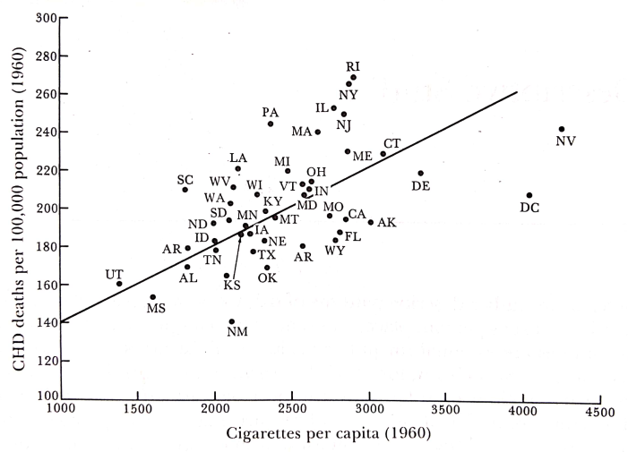

<small> Figura: Coronary heart disease mortality rates in the United States per capita cigarette sales in 1960, by state. (From FRIEDMAN GD, Cigarette smoking and geographic variation in coronary heart disease mortality in the United States. J. Chronic Dis. 20: 769, 1967)
</small>
 


 


## Tipos de Variáveis Utilizadas

- **Medidas Agregadas**: Medidas agregadas por grupos. ex: incidência, prevalência, mortalidade, proporção de fumantes;

- **Medidas Ambientais**: Características físicas do contexto onde o grupo convive. ex: nível de poluição, precipitação;

- **Medidas Globais**: Atributos de grupos, organizações ou lugares, que não podem ser mensurados a nível individual. ex: IDH, densidade demográfica, existência de um tipo de sistema de saúde.

- Em uma análise ecológica, todas as variáveis são medidas agrupadas. Apenas se conhece a distribuição marginal de cada variável.

<br>

|                       |           Desfecho (*Y*)     |       |
|-----------------------|:--------------:|:-----------:|:-----:|
| **Fator em Estudo (*X*)** |    Ocorreu     | Não ocorreu | **Total **|
| Exposto               |        ?       |      ?      | $E_1$ |
| Não Exposto           |        ?       |      ?      | $E_0$ |
| **Total**                 |      $D_1$     |    $D_0$    |  *n*  |


<br>


## Tipos de Desenhos de Estudos Ecológicos

- **Múltiplos Grupos**: O objetivo desse tipo de estudo é a comparação entre todos os grupos ou conjuntos populacionais envolvidos no estudo. Ex: Análise Espacial.

- **Desenhos de Séries Temporais**: Avalia um determinado desfecho ao longo do tempo em uma determinada população geograficamente definida. Ex: Análise de Séries Temporais.

- **Desenhos Mistos**: É a combinação entre os dois desenhos citados, pois avalia a evolução de um determinado desfecho em diferentes grupos populacionais ao longo do tempo. Ex: Análise Espaço-Temporais, Estudos Multiníveis.


## Aspectos históricos

- “Um estudo ecológico ou agregado focaliza a comparação de grupos, ao invés de indivíduos. A razão subjacente para este foco é que dados a nível individual da distribuição conjunta de duas (ou talvez todas) variáveis estão faltando internamente nos grupos; neste sentido um estudo ecológico é um desenho incompleto”.

<small> (Rothman, Kenneth J. et al. Modern epidemiology. Philadelphia: Wolters Kluwer Health/Lippincott Williams & Wilkins, 2008.) </small>


---

- “... estudar saúde no contexto ambiental. O objetivo é ambicioso: entender como o contexto afeta a saúde de pessoas e grupo através de seleção, distribuição, interação, adaptação, e outras respostas. Medidas de atributos do indivíduo não podem dar conta destes processos [...] Sem medir estes contextos, nem padrão de mortalidade e morbidade, nem o espalhamento epidêmico, nem a transmissão sexual podem ser explicados”

<small> (Susser, Am.J.Public Health, 1994;84:825-835) </small>


---


- A Epidemiologia é frequentemente definida em termos do estudo da determinação da distribuição da doença. Mas não se deve esquecer que quanto mais espalhada é uma causa particular, menos ela contribui para explicar a distribuição da doença.”

- “...dois tipos de perguntas etiológicas. A primeira busca as causas dos casos, e a segunda as causas da incidência.”

- “Aplicada à etiologia, a visão centralizada no indivíduo leva ao uso do risco-relativo como a representação básica da força etiológica: ou seja, o risco em indivíduos expostos relativo aos não-expostos. [...] Esta pode ser geralmente a melhor medida de força etiológica, mas não é medida de [...] importância em saúde pública.” 

- “É rara a doença cuja taxa de incidência não tenha variado largamente, seja ao longo do tempo ou entre populações
[...] Isto significa que as causas da incidência, desconhecidas que sejam, não são inevitáveis. [...] Mas identificar o agente causal pelos métodos tradicionais de caso-controle e coorte não terá sucesso se não houver suficientes diferenças na exposição dentro da população [...] Nestas circunstâncias tudo os que os métodos tradicionais fazem é encontrar marcadores de susceptibilidade individual. A chave deve ser buscada nas diferenças entre populações ou em mudanças nas
populações ao longo do tempo.”

<small> (Rose G. Sick individuals and sick populations. Int J Epidemiol. 2001 Jun;30(3):427-32; discussion 433-4.) </small>


---

- “ ... torna-se aparente que muitas das explicações convencionais dos determinantes da saúde - porque
algumas pessoas são saudáveis e outras não - são, na melhor das hipóteses seriamente incompletas, se não
simplesmente erradas. É assim, infelizmente, porque as sociedades modernas dedicam uma parte muito grande
de sua riqueza, esforço e atenção tentando manter ou melhorar a saúde dos indivíduos que compõem suas
populações. Estes esforços maciços são primeiramente canalizados para os sistemas de assistência à saúde,
presumivelmente refletindo uma crença que receber uma boa assistência é o mais importante determinante de
saúde.” 


<small> (Evans,R.G.”Why are some people healthy and others not”) </small>

---


- “Grande parte da pesquisa atual em epidemiologia está baseada no individualismo metodológico: a noção que a distribuição da saúde e doença em populações pode ser explicada exclusivamente em termos das características dos indivíduos.”


<small> (Diez-Roux AV. Bringing context back into epidemiology: variables and fallacies in multilevel analysis. AJPH,1998;88(2):216-22) </small>

---


- “A evidência de modestos efeitos de vizinhança na saúde é razoavelmente consistente, apesar da
heterogeneidade dos desenhos dos estudos [...] e prováveis erros de medida. Ao chamar a atenção da
saúde pública para os riscos associados com a estrutura social e ecológica de vizinhança, enseja-se possíveis intervenções inovadoras no nível da comunidade.”


<small> (Pickett KE, PearlL M. Multilevel analyses of neighbourhood socioeconomic context and health outcomes: a critical review. J Epidemiol Community Health 2001;55(2):111-22) </small>

---

## Epidemiologia social

- “...o ramo da epidemiologia que estuda a distribuição social e os determinantes sociais da saúde. A epidemiologia social incorpora um novo foco na comunidade como uma entidade em si, uma entidade mais complexa do que a soma das pessoas individuais que compõem a sociedade.” 

<small> (Berkman L. F. &
Kawachi I. (Editors). Social Epidemiology. Oxford University Press, 2000) </small>


- “Os médicos estão acostumados a pensar nos determinantes socioeconômicos da doença em termos dos fatores de risco de uma pessoa. [...] Agora parece claro que a riqueza absoluta ou a renda é um determinante menos importante da saúde do que a relativa disparidade na renda ou a diferença de renda entre os ricos e os pobres.” 

<small> (Kawachi I.; Kennedy B.P.; Wilkinson R.G. The Society and Population Health Reader: Income Inequality and Health. New Press, 1999). </small>


## Árvores, Bosques ou as Florestas?

### As Árvores

- Suponha os dados abaixo, onde a variável *“X”* representa um efeito de exposição e a variável *“Y”* um taxa. Ao fazermos uma regressão obtemos uma correlação de apenas **0,1469** entre as duas variáveis.

{width=400px}


### Os Bosques
  
  - Ao estratificarmos os dados evidencia-se uma estrutura, e ajustarmos uma regressão em cada grupo obtém-se:
  
  |      |      |
| :--: | :--: |
|  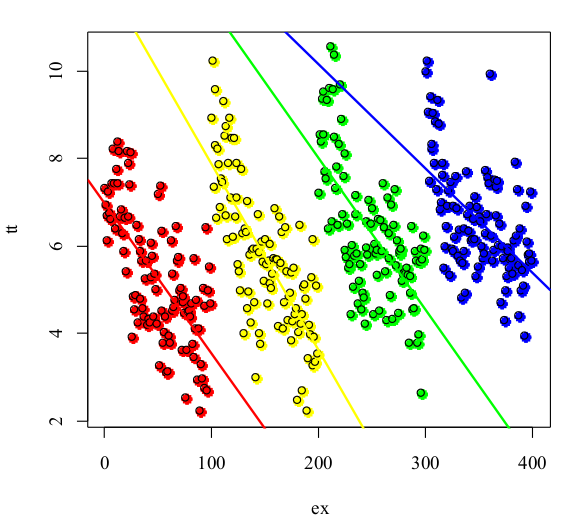{width=100%}     |   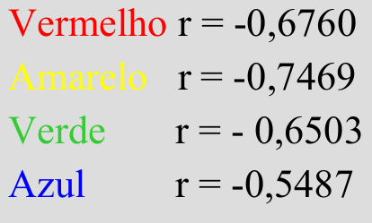{width=60%}   |
  


### As Florestas
  
- Tirando-se a média para cada grupo iremos obter quatro pontos sob os quais faremos uma regressão. O coeficiente de correlação obtido é **rho = 0,9938**
  
  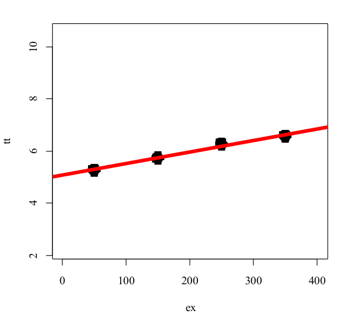{width=50%} 


## Falácia Ecológica ou viés de agregação

- *"Viés que pode ocorrer porque uma associação entre duas variáveis no nível agregado não necessariamente representa uma associação no nível individual"* 


- O problema é que não podemos fazer inferências para níveis distintos:

    i) Inferir para o indivíduos a partir de dados agregados (***falácia ecológica***)
    
    ii) Inferir para agregados populacionais a partir de dados individuais (***falácia atomística ou individualista***)

- Na estatística esse efeito é conhecido como [Paradoxo de Simpson](https://pt.wikipedia.org/wiki/Paradoxo_de_Simpson)

> “Textos de Epidemiologia fazem uma avaliação consistente sobre estudos ecológicos: eles são tentativas cruas de estimar correlações em nível individual. [...] Examinar esta questão de uma perspectiva diferente - como um problema geral de validade - mostrará que a falácia ecológica, conforme frequentemente usada, encoraja três noções interrelacionadas e falaciosas: 
> 
> (1) que modelos em nível individual são mais perfeitamente especificados que os de nível ecológico, 
> 
> (2) que correlações ecológicas são sempre substitutos para correlações de nível individual, e 
> 
> (3) que variáveis de nível de grupo não causam doença.”

<small> (Schwartz, Am.J.Public Health, 1994;84:819-824) </small>


---

**Religião e Sucídio**

- Um exemplo clássico de estudo ecológico:

    - Emile Durkheim (em 1897) associação ecológica positiva entre a proporção de indivíduos de religião Protestante e as taxas de suicídio (províncias da Prússia);
    
    - Durkheim concluiu que Protestantes tinham maior probabilidade de se suicidarem do que os Católicos;
    
    - Conclusão factível mas a inferência causal não é correta: poderiam ter sido os Católicos em províncias predominantemente Protestantes a cometer os suicídios, e a metodologia ecológica não permite discernir qual das duas hipóteses está certa.
    
    Para ler mais sobre este exemplo: Frans van Poppel and Lincoln H. Day. A Test of Durkheim's Theory of Suicide - Without Committing the "Ecological Fallacy". American Sociological Review, 1996. https://doi.org/10.2307/2096361

---

**Posse de armas de fogo e suicídio**

- Um exemplo mais recente:

    - Miller *et al* (2003) realizaram um estudo ecológico no Estados Unidos comparando as frequências de posse doméstica de armas de fogo com as de suicídio por arma de fogo e por outros meios, por estado. 
    - Estados com maiores proporções de posse de armas de fogo apresentaram maiores taxas de suicídio por armas de fogo, mas a *mesma* frequência de suicídios por outros meios.
    - Suicídios por outros meios serve como um "controle". Segundo os autores, a posse de armas não deveria impactar suicídios por outros meios. Além disso, os autores assumem que os fatores de confundimento seriam os mesmos para suicídios por arma de fogo e por outros meios.
    
  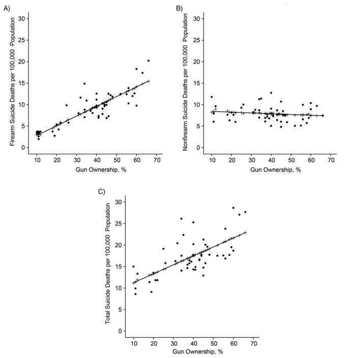

<small>Figura. Relação entre posse doméstica de armas de fogo e mortalidade por suicídio nos Estados Unidos, por estado, A) por armas de fogo, B) por outros meios que não armas de fogo, e C) todos. (Fonte: Miller et al. Am J Epidemiol. 2013;178(6):946–955)
</small>

\

- Concordam que todos os confundimentos são os mesmos para os dois grupos de mortes por suicídio?
- Concordam que suicídios por outros meios não devem ser afetados pela posse doméstica de armas de fogo?
- É correto concluir que, nos Estados Unidos:
    - ter uma maior porcentagem de população com posse de armas causa taxas elevadas de suicídio por arma de fogo?
    - possuir uma arma é uma causa para suicídio por arma de fogo?

\

---


**Um outro exemplo**: Um pesquisador deseja estudar a relação entre acidentes de trânsito e a renda em três cidade distintas (A, B e C). 


|pop | renda_media| tx_acidente|
|:---|-----------:|-----------:|
|A   |    24.08571|       57.14|
|B   |    22.57143|       42.86|
|C   |    21.41429|       28.57|

---

- Observando o gráfico abaixo, o pesquisador observa um possível associaçãom entre a renda e a taxa de acidentes de trânsito;


- Quanto maior a renda, maior será a taxa de acidentes de trânsito.

---

- Observando os microdados, ou seja, os dados no nível individual, temos o seguinte:


```{=html}
<div id="htmlwidget-7c75c3251d8e308028ff" style="width:100%;height:auto;" class="datatables html-widget"></div>
<script type="application/json" data-for="htmlwidget-7c75c3251d8e308028ff">{"x":{"filter":"top","filterHTML":"<tr>\n  <td><\/td>\n  <td data-type=\"number\" style=\"vertical-align: top;\">\n    <div class=\"form-group has-feedback\" style=\"margin-bottom: auto;\">\n      <input type=\"search\" placeholder=\"All\" class=\"form-control\" style=\"width: 100%;\"/>\n      <span class=\"glyphicon glyphicon-remove-circle form-control-feedback\"><\/span>\n    <\/div>\n    <div style=\"display: none; position: absolute; width: 200px;\">\n      <div data-min=\"10\" data-max=\"45.6\" data-scale=\"1\"><\/div>\n      <span style=\"float: left;\"><\/span>\n      <span style=\"float: right;\"><\/span>\n    <\/div>\n  <\/td>\n  <td data-type=\"character\" style=\"vertical-align: top;\">\n    <div class=\"form-group has-feedback\" style=\"margin-bottom: auto;\">\n      <input type=\"search\" placeholder=\"All\" class=\"form-control\" style=\"width: 100%;\"/>\n      <span class=\"glyphicon glyphicon-remove-circle form-control-feedback\"><\/span>\n    <\/div>\n  <\/td>\n  <td data-type=\"character\" style=\"vertical-align: top;\">\n    <div class=\"form-group has-feedback\" style=\"margin-bottom: auto;\">\n      <input type=\"search\" placeholder=\"All\" class=\"form-control\" style=\"width: 100%;\"/>\n      <span class=\"glyphicon glyphicon-remove-circle form-control-feedback\"><\/span>\n    <\/div>\n  <\/td>\n<\/tr>","data":[["1","2","3","4","5","6","7","8","9","10","11","12","13","14","15","16","17","18","19","20","21"],[10.5,34.5,28.5,12.2,45.6,17.5,19.8,12.5,32.5,24.3,10,14.3,38,26.4,28.7,30.2,13.5,23.5,10.8,22.7,20.5],["A","A","A","A","A","A","A","B","B","B","B","B","B","B","C","C","C","C","C","C","C"],["Caso","Nao_caso","Nao_caso","Caso","Nao_caso","Caso","Caso","Caso","Nao_caso","Nao_caso","Caso","Caso","Nao_caso","Nao_caso","Nao_caso","Nao_caso","Caso","Nao_caso","Caso","Nao_caso","Nao_caso"]],"container":"<table class=\"display\">\n  <thead>\n    <tr>\n      <th> <\/th>\n      <th>renda<\/th>\n      <th>pop<\/th>\n      <th>casos<\/th>\n    <\/tr>\n  <\/thead>\n<\/table>","options":{"pageLength":5,"scrollX":true,"columnDefs":[{"className":"dt-right","targets":1},{"orderable":false,"targets":0}],"order":[],"autoWidth":false,"orderClasses":false,"orderCellsTop":true,"lengthMenu":[5,10,25,50,100]}},"evals":[],"jsHooks":[]}</script>
```

---

- De posse desses dados no nível individual, é possível fazer a seguinte análise:

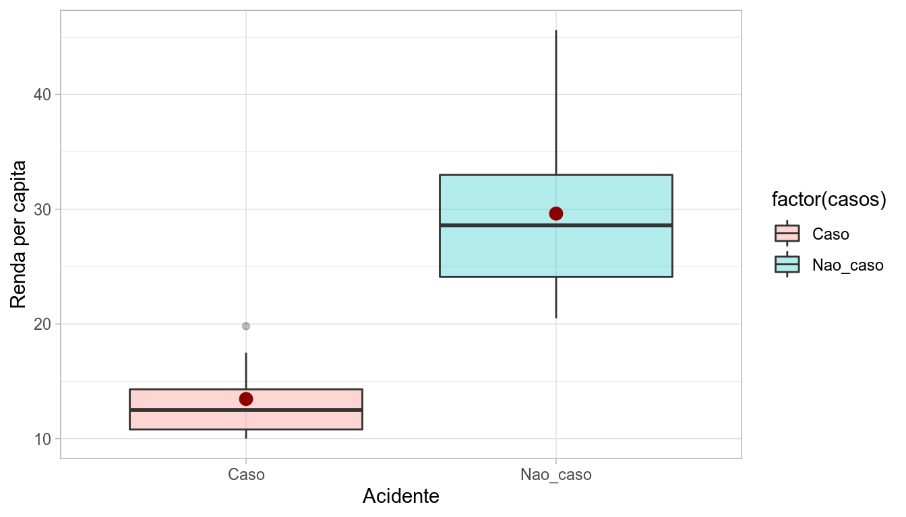


---


- Dessa forma observamos que os indivíduos que sofreram algum tipo de acidente de trânsito, apresentam a menor renda;

- Qual dos dois níveis de inferência está errado ?

- Qual é, então, o problema ? ? ?


---


## Problemas práticos
  
**1. Numerador:**
  
  - subregistro
- duplicidade de registros
- georreferenciamento:
  - não localização
- informação incorreta
- preenchimento inadequado
- mudança na classificação ao longo do tempo

**2. Denominador:**
  
  - espaçamento do censo
- migração
- mudança de fronteiras (!!!!)


**3.Exposição:**
  
- pode ocorrer em diversos lugares 
- dificilmente mensurável com precisão
- uso de “proxy”
- diferentes áreas para medida de exposição e de efeito, e áreas não compatíveis
- Informações mais detalhadas (PNAD, amostra do censo) não extrapoláveis para populações pequenas

**4. Análise:**
  
- migração
- multicolinearidade


## Vantagens
  
  - Baixo custo e execução rápida, devido às fontes de dados secundários disponíveis;

- Conseguem estimar bem os efeitos de uma exposição quando ela varia pouco na área de estudo, pela comparação entre áreas (os estudos individuais não conseguem);

- Existem efeitos que somente podem ser medidos no nível ecológico, por ex. implantação de um novo sistema de saúde.


## Desvantagens
  
- Informações sobre comportamento, atitudes e história clínica não estão disponíveis (dados pessoais não disponíveis);

- Depende da qualidade das informações disponíveis (fontes diversas);

- Não se leva em conta a variabilidade da característica estudada dentro do grupo;

- Difícil estabelecer temporalidade entre causa e efeito.

- Migração entre grupos (por exemplo, mora em uma área e trabalha em outra).


## Resumindo
  
- Resgatando a ecologia: estudo das complexas inter-relações entre organismos vivos e o seu meio físico.

- Dados agregados – estudo ecológico clássico

- Mistura de dados individuais e agregados – modelos multinível

- Quando se estuda o tempo – séries temporais e modelos dinâmicos

- Quando é espacial – modelos clássicos de regressão ou espaciais

- Mistura espaço e tempo – modelos espaço-temporais

- Envolvendo relações entre indivíduos – redes


  
## Exercícios Propostos
  
1) As estatísticas internacionais indicam que o Chile tem uma das mais altas taxas de mortalidade por câncer de estômago. O país caracteriza-se por conter altos níveis de nitrato em seu solo, situação rara no mundo, neste particular. Estabeleceu-se a suspeita de ser o nitrato, em altas concentrações, um agente causal da neoplasia. Comparações regionais dentro do país, contrastando áreas com altas e baixas concentrações de nitrato, mostraram a
mesma relação: alto teor da substância no solo, (alta mortalidade por este tipo de neoplasia). Um estudo caso-controle subseqüente foi realizado, mas a nível individual, não foi possível encontrar tal associação. A hipótese, entretanto, não foi totalmente descartada. Qual a importância desse estudo ecológico no estudo sobre causalidade: concentração de
nitrato no solo vs câncer de estômago  ?
  
2) Os casos notificados de Influenza são maiores na cidade A do que na cidade
B. As taxas de vacinação para a influenza são mais baixas na cidade A do que na cidade
B. Quais das seguintes razões são razões pelas quais seria
é incorreto presumir que uma maior vacinação na cidade B
é o que está fazendo com que a cidade B tenha menos casos relatados de
 Influenza ? Escolha as opções corretas.

a) A cidade A e a cidade B podem ter diferentes cepas de Influenza

b) A cidade A e a cidade B podem ter proporções diferentes de
pessoas nas suas populações que são especialmente vulneráveis
à influenza (por exemplo, idosos, crianças e mulheres grávidas)

c) A cidade A e a cidade B podem ter diferenças nos cuidados de saúde ,
acessibilidade aos serviços e acesso a  diagnóstico da influenza
 
d) A cidade A e a cidade B podem ter climas diferentes, levando a
diferenças em como/onde as pessoas entram em contato com
um ao outro. Isto pode afetar as taxas de transmissão de Influenza


## Bibliografia sugerida


BERKMAN, Lisa F.; KAWACHI, Ichirō; GLYMOUR, M. Maria (Ed.). Social epidemiology. Oxford University Press, 2014.

DIEZ-ROUX, Ana V. Bringing context back into epidemiology: variables and fallacies in multilevel analysis. American journal of public health, v. 88, n. 2, p. 216-222, 1998.

EVANS, Robert G.; BARER, Morris L.; MARMOR, Theodore R. (Ed.). Why are some people healthy and others not?: The determinants of the health of populations. Transaction Publishers, 1994.

MORGENSTERN, Hal. Ecologic studies in epidemiology: concepts, principles, and methods. Annual review of public health, v. 16, n. 1, p. 61-81, 1995.

PICKETT, Kate E.; PEARL, Michelle. Multilevel analyses of neighbourhood socioeconomic context and health outcomes: a critical review. Journal of Epidemiology & Community Health, v. 55, n. 2, p. 111-122, 2001.

ROSE, Geoffrey. Sick individuals and sick populations. International journal of epidemiology, v. 30, n. 3, p. 427-432, 2001.


# Introdução às Séries Temporais


## O que são Séries Temporais ?

- **Definição**: Entende-se por Séries Temporais (ST) todo e qualquer conjunto de dados (absolutos ou relativos, discretos ou contínuos), ordenados cronologicamente.

- **Condição**: Esses dados seguem uma ordenação em função do tempo (dependência temporal).

- De modo geral, as séries temporais apresentam sequências de observações relativas a determinada variável ao longo de um intervalo específico de tempo (dia, mês, trimestre, ano, etc.), isto é, referem-se a fluxos de valores periódicos, os quais dão uma visão geral sobre o andamento ou comportamento da variável em análise.

- A maneira mais comum de visualizar séries temporais é usar um gráfico de linhas simples, em que o eixo horizontal representa os incrementos de tempo e o eixo vertical representa a variável que está sendo medida.

- Seguem abaixo alguns exemplo de séries temporais:

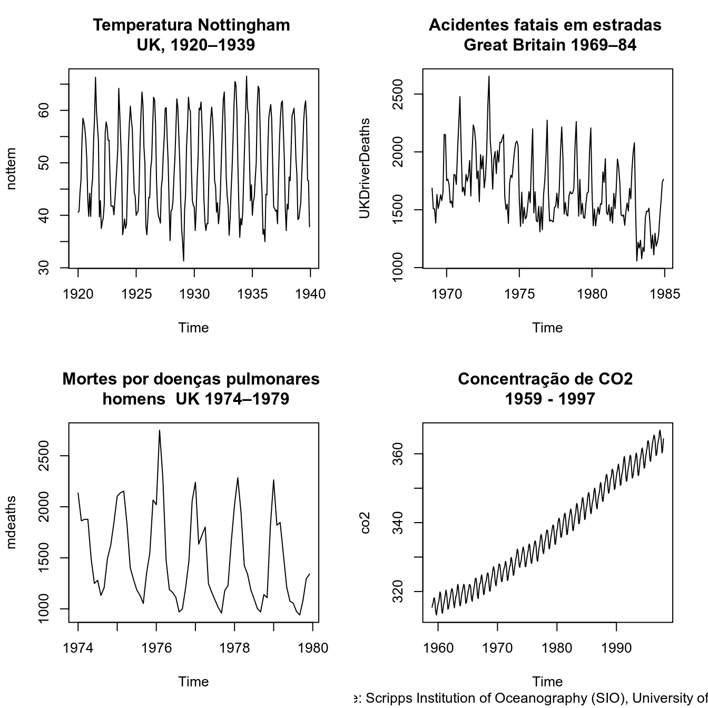


<!-- {width=770px} -->

- As séries temporais podem ser de natureza **regular** ou **irregular**. 

    - As **séries temporais regulares ou uniformes** são aquelas que podem ser expressas sempre com o mesmo intervalo de tempo (frequência).
    
    - As **séries temporais irregulares ou não uniformes** são aquelas em que as frequências de tempo são diferentes ou que apresentam dados ausentes (*missing data*). Algumas vezes podem ser transformadas em séries regulares agregando ouinterpolando os dados mensurados.


##  Hipóteses básicas do estudo das séries temporais

- Há um sistema causal relacionando as variáveis no tempo;

- Ao longo do tempo, o sistema influencia todos os dados sob análise, de modo regular  e permanente;

- Os dados históricos refletem a influência média de um conjunto de fatores.


Tais hipóteses se baseiam no pressuposto de que as relações apontadas pela experiência pregressa permitem prever o possível comportamento das variáveis sob análise, determinando se seu comportamento apresenta propriedades **determinísticas** e/ou **aleatórias**.


## Classificação dos tipos de séries temporais

- **Contínuas:** A informação é obtida em qualquer intervalo de tempo (podendo ser discretizando em intervalos iguais) ou é acumulada por período.
**Ex:** Temperatura, pluviosidade, partículas em suspensão.


- **Discretas:** Observações obtidas em intervalos de tempo discreto e equidistantes (ano, mês, dias, semanas epidemiológicas).
**Ex:** Mortalidade infantil, notificações por DIC.

- **Multivariada:**  São várias coleções de observações para a mesma sequência de períodos de tempo, ou seja,envolvem mais de uma série histórica.
**Ex:** Número de homicídios e acidentes no Sudeste.

- **Multidimensional:**  São várias coleções de observações para a mesma sequência de períodos de tempo, descrevendo o mesmo fenômeno em diferentes contextos.
**Ex:** Número de AVCs em diversas UFs.

## Processo Estocástico

- Um processo estocástico pode ser pensado de duas formas:

    - um conjunto de possíveis trajetórias de um fenômeno físico que poderiam ser observadas;
    
    - um conjunto de variáveis aleatórias, uma para cada tempo $t$.
    
- Cada valor observado de uma trajetória é um dos possíveis valores que poderiam ter sido observados, de acordo com a distribuição de probabilidades da respectiva variável aleatória.

- Definir séries temporais consiste em determinar as funções matemáticas que apontam suas componentes básicas e permitem prever a evolução dos fenômenos estudados (como um eventual crescimento ou decrescimento futuro).

- As séries temporais podem ser matematicamente representadas por funções do tipo:

 $$Z_t = f(tempo, a)$$

Sendo $Z_t$ o valor da variável $Z$ no tempo $t$, e $a$ a componente aleatória associada à função matemática do tempo.


- Série com a mesma estrutura: cada série é uma possível realização do mesmo processo estocástico.

{width=670px}


## Notação e Nomenclatura

- Matematicamente, uma série temporal discreta é representada por: $Z_t = (Z_1 , Z_2 , Z_3 , ... , Z_n)$, sendo: $Z$, a variável observável e $t = 1,2,...,n$, o parâmetro do tempo.

- Simulando duas séries temporais de um evento, com a mesma estrutura:

{width=770px}


## Objetivos: análise de séries temporais

| Objetivo                                                     | Exemplo                                                      |
| ------------------------------------------------------------ | ------------------------------------------------------------ |
| **Descrição:** verificar existência de tendência, sazonalidade, ciclos. Histogramas, boxplots, são ferramentas da análise exploratória descritiva | Identificar tendência da AIDS; sazonalidade da dengue visando estabelecer melhor período de intervenção. |
| **Estabelecimento de causalidade:** estudo da relação de causa-efeito | Vacina X sarampo; Mortalidade por DIC X melhor assistência   |
| **Classificação:** identificação de padrões                  | A série de leishmaniose tegumentar é “igual” à visceral?     |
| **Controle:** sistemas dinâmicos, caracterizados por uma entrada $X_t$, uma série de saída $Z_t$ e uma função de transferência $V_t$ | Modelar a resposta a medidas de controle de epidemia         |
| **Monitoramento (nowcast):** Detectar variações no comportamento da séries temporais conforme elas ocorram | Dosagem de Hormônios ou de sinais vitais em CTI              |
| **Predição (forecast) : ** prever o comportamento futuro de uma serie | Predição de epidemias                                        |
| **Atualização (nowcast): ** predição sobre o presente        | corrigir atraso de notificações                              |                                                             |


## Estacionariedade

- Uma série temporal é dita estacionária quando ela se desenvolve no tempo aleatoriamente ao redor de uma média constante e com uma variância constante, refletindo alguma forma de equilíbrio estável. 

{width=1270px}

- Na prática, a maioria das séries que encontramos apresentam algum tipo de não estacionariedade, como por exemplo, tendência.

- O modelo mais simples de uma séries temporal estacionária pode ser representado por:

$$Z_t = \mu + a_t$$

Sendo $\mu$ a média do processo temporal e $a_t$ a componente aleatória, chama de **Ruído Branco** em análises de séries temporais. 


- A estacionariedade da séries temporais pode ser:

    - 1$^a$ ordem - média constante ao longo de todo o período
    
    - 2$^a$ ordem - variância constante ao longo de todo o período


### Função de Autocovariância de um processo estacionário

$$\gamma_h = E{\{[Z_t - E(Z_t)][Z_{t-h} - E(Z_{t-h})]\}}$$

- A covariância não depende do tempo, mas da distância entre as observações.

- Um processo é considerado **fracamente estacionário** se:

    i) $E(Z_t)=\mu$, $\forall t$ (constante)
    
    ii) $var(Z_t) = \sigma^2$, $\forall t$ (constante)
    
    iii) $Cov(Z_t, Z_{t-h}) = \gamma_h$, $\forall t$ (não depende do instante no tempo, apenas da distância h)

- Sendo o **ruído branco (White Noise)**, também chamado de Processo Puramente Randômico, uma variável aleatória $a_t$, com média zero e variância $\sigma²_a$:

    i) $a_t \sim N(0, \sigma^2_a)$
    
    ii) $Cov(a_t, a_{t-h}) = 0$, $\forall h \neq 0$ (Não correlacionados)
    

### Por que a estacionariedade é importante ?

- A maioria das técnicas estatísticas utilizadas em séries temporais supõe que estas sejam estacionárias. Caso a série temporal não seja estacionária, será necessário transformar os dados. 

- A transformação mais comum consiste em tomar diferenças sucessivas da série original, até se obter uma série estacionária. 

    - A primeira diferença de $Z_t$:

       $$\bigtriangledown Z_t = Z_t - Z_{t-1}$$
       
       
    - A segunda diferença de $Z_t$:

       $$\bigtriangledown^{2} Z_t = \bigtriangledown[\Delta Z_t] = \bigtriangledown[Z_t - Z_{t-1}]$$
       
     
     - A *n-ésima* diferença de $Z_t$:

       $$\bigtriangledown^{n} Z_t = \bigtriangledown[\bigtriangledown^{n-1} Z_t]$$
       
       
    - Logaritmo dos dados - Estabilizar a variância 
    
       $$\bigtriangledown log Z_t = log Z_t - log Z_{t-1}$$
       
  
    - Transformações Box-Cox
    

- Pode-se diferenciar tantas vezes quanto necessário até estabilizar (porém, em geral se diferencia apenas uma vez, raramente duas vezes).


**Como saber se um processo é estacionário ?**

- Visualizando a série, aplicando a **decomposição**, boxplots, etc.
    
- Testes Estatísticos, ex: **Dickey-Fuller**


---

## Pressuposto da Independência

- Os métodos usuais de análise estatística de dados têm como pressuposto básico a **independência** dos eventos (casos). Ou seja, a ocorrência de um caso de doença em uma dada pessoa seria independente da ocorrência em outra pessoa.

- Pressupostos básicos para uma análise de regressão:
  
    - $E(e_i) = 0$
    
    - Variância $\sigma^2$ constante (homocedasticidade);

    - $e_i \sim N(0, \sigma^2)$
    
    - $e_i \neq e_j$, são independentes
    

- Na análise da incidência de doenças (ou qualquer outro indicador ecológico) ao longo do tempo isso não é verdade: a incidência em um determinado dia/mês ou ano em geral é **correlacionada** com a ocorrência no dia/mês/ano anterior.

- Esta correlação é expressa em uma função denominada **função de autocorrelação**.

---

## Dependência serial

- Quanto à dependência, séries temporais podem possuir: 

    - **Independência** (sem dependência serial): série puramente aleatória ou ruído branco;
    
    -  **Memória longa**: a dependência desaparece lentamente (os valores de pontos no passado influenciam momentos muito
    adiante no tempo - exemplo: doenças com grande latência como hanseníase);
    
    - **Memória curta**: dependência desaparece rapidamente (doenças de alta infecciosidade e "explosivas"" - exemplo: influenza).

---


## Função de Autocorrelação - FAC (*Autocorrelation function - ACF*) 


O coeficiente de correlação entre $Z_{t}$ e $Z_{t-h}$ é chamado de autocorrelação de *h-ésima* ordem e é denotadado por:

$$
{\rho}_{k}=\frac {Cov\left({Z}_{t},{Z}_{t-h} \right)}{\sqrt{Var\left({Z}_{t},{Z}_{t-h} \right)}} =\frac{Cov\left({Z}_{t},{Z}_{t-h} \right)}{Var\left({Z}_{t} \right)} =\frac{{\gamma}_{k}}{{\gamma}_{0}}
$$

Temos então:

- ${\rho}_{0}=1$

- $-1\leq {\rho}_{l} \leq 1$

Um conjunto de autocorrelações, $\left\{\rho_{h}\right\}$, é chamado de **função de autocorrelação de $Z_{t}$**. Para uma dada amostra, $\left\{Z_{t}\right\}_{t=1}^{T}$, suponha que $\overline{Z}$ é a média amostral. Então, a autocorrelação amostral de primeira ordem de $Z_{t}$ pode ser definida como:

$$
{\hat{\rho}}_{1}=\frac{\sum _{t=2}^{T}{\left({Z}_{t}-\overline{Z}\right) \left({Z}_{t-1}-\overline{Z}\right)}}{\sum_{t=1}^{T}{{\left({Z}_{t}-\overline{Z}\right)}^{2}}}
$$

que é um estimador consistente de ${\rho}_{1}$. Em geral, a autocorrelação amostral de *h-ésima* ordem de $Z_{t}$ pode ser definida como:

$$
{\hat{\rho}}_{h}=\frac{\sum_{t=h+1}^{T}{\left({Z}_{t}-\overline{Z}\right) \left({Z}_{t-h}-\overline{Z} \right)}}{\sum_{t=1}^{T}{{\left({Z}_{t}-\overline{Z}\right)}^{2}}} 
$$
para $0\leq h \leq T-1$. 

Por exemplo, suponha que você está avaliando uma série temporal qualquer e quer visualizar como as defasagens da série podem impactar seu valor atual (ou seja, se $Z_{t}$ é relacionado com $Z_{t-h}$ para $k\ge1$). A função de autocorrelação pode ser usada para obter tal informação.

Num primeiro momento, visualize os dados da série para 10 lags (defasagens). Observe que os lags se tornam novas colunas e na medida que elas aumentam, incrementa-se as linhas sem observações.


```{=html}
<div id="htmlwidget-27454e8c52419ad00125" style="width:100%;height:auto;" class="datatables html-widget"></div>
<script type="application/json" data-for="htmlwidget-27454e8c52419ad00125">{"x":{"filter":"none","data":[[28.61,27.8,28.19,28.26,30.36,30.42,32.76,31.95,30.89,28.24],[null,28.61,27.8,28.19,28.26,30.36,30.42,32.76,31.95,30.89],[null,null,28.61,27.8,28.19,28.26,30.36,30.42,32.76,31.95],[null,null,null,28.61,27.8,28.19,28.26,30.36,30.42,32.76],[null,null,null,null,28.61,27.8,28.19,28.26,30.36,30.42],[null,null,null,null,null,28.61,27.8,28.19,28.26,30.36],[null,null,null,null,null,null,28.61,27.8,28.19,28.26],[null,null,null,null,null,null,null,28.61,27.8,28.19],[null,null,null,null,null,null,null,null,28.61,27.8],[null,null,null,null,null,null,null,null,null,28.61],[null,null,null,null,null,null,null,null,null,null]],"container":"<table class=\"display\">\n  <thead>\n    <tr>\n      <th>atual<\/th>\n      <th>lag1<\/th>\n      <th>lag2<\/th>\n      <th>lag3<\/th>\n      <th>lag4<\/th>\n      <th>lag5<\/th>\n      <th>lag6<\/th>\n      <th>lag7<\/th>\n      <th>lag8<\/th>\n      <th>lag9<\/th>\n      <th>lag10<\/th>\n    <\/tr>\n  <\/thead>\n<\/table>","options":{"columnDefs":[{"className":"dt-center","targets":"_all"}],"dom":"t","order":[],"autoWidth":false,"orderClasses":false}},"evals":[],"jsHooks":[]}</script>
```


Apesar da simples correlação entre os dados nos ajudar a identificar defasagens que poderíam contribuir para o comportamento da série em $t$, precisamos fazer uso de testes estatísticos que verifiquem a significância da relação entre o valor atual e suas lags. Neste sentido, a função de autocorrelação tem grande importância. 

Abaixo, um exemplo de **função de autocorrelação**. Observe que há duas linhas horizontais que representam os limites do teste de significância sendo que valores acima ou abaixo da linha são estatisticamente significantes. Neste documento, apresentaremos o teste que é realizado.


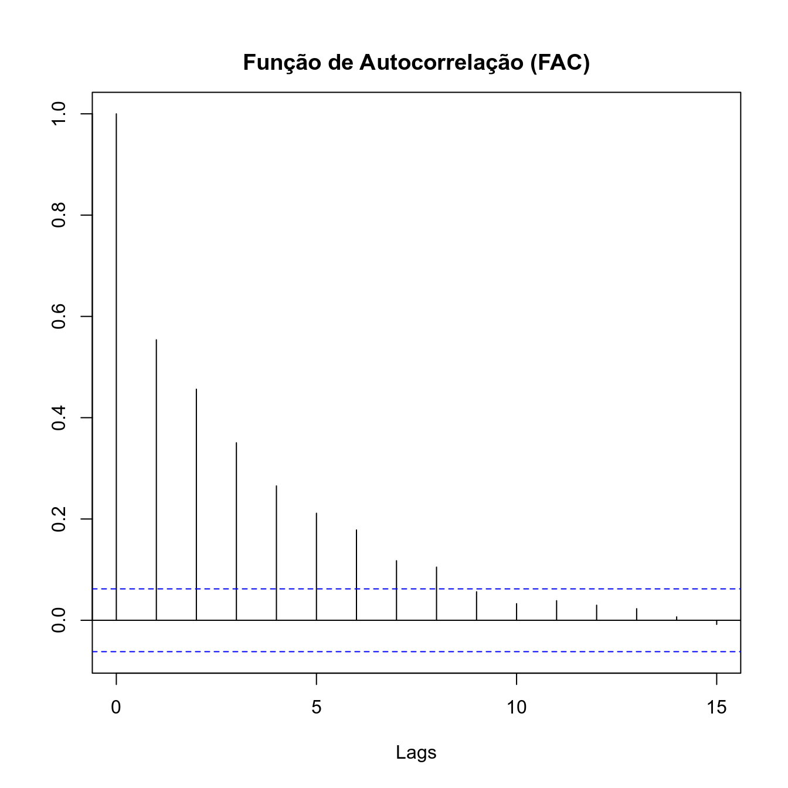

- O correlograma é uma das principais ferramentas de análise exploratória em séries temporais, pois indica como cada valor em um dado instante de tempo $t$ se relaciona com os valores em $t+1, t+2,...,t+j$


Para um dado $h$, os resultados da **Função de Autocorrelação** podem ser testados usando um teste que pode ser representado pelas seguintes hipóteses:

$$
\begin{aligned}
&& H_{0}: \rho_{h}=0 \\
&& H_{1}: \rho_{h}\neq 0
\end{aligned}
$$

---


## Componentes de uma Série Temporal 

- As séries temporais podem ser separadas em componentes *sistemáticas* (apontam movimentos regulares) e *não sistemáticas* (apontam movimentos irregulares). 

São elas: 

- Componentes Sistemáticas (podem ou não estar presentes)

    - Tendência

    - Sazonalidade

    - Ciclo 

- Componentes Não Sistemáticas

    - Aleatória ou Ruído Branco


- As análises exploratórias de séries temporais buscam isolar e interpretar as componentes. Tais componentes podem atuar de maneira isolada ou inter-relacionadas.


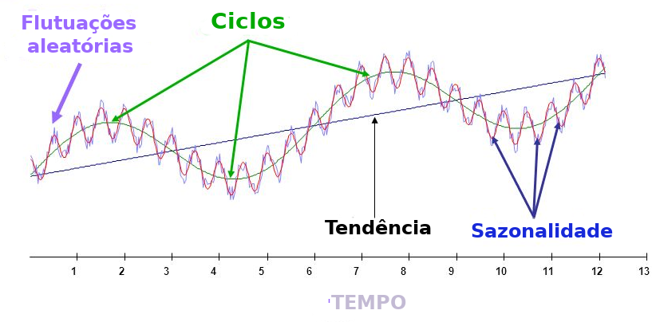


---

## Tendência

- É a indicadora da direção global dos dados (ou movimento geral da variável), do percurso traçado e de sua linha contínua;

- É o efeito de longo prazo na média. Pode ser o aumento ou redução a longo prazo...


<!-- {width=1270px} -->


---


## Sazonalidade

- São ciclos de curto prazo (não maiores que um ano), em torno da tendência;

- Costumam se referir a eventos ligados a estação do ano, vinculados ao calendário e geralmente repetidos a cada doze meses;

- Efeitos ligados à variações periódicas (semanal, mensal, anual, etc.);

- Padrões que ocorrem em intervalos fixos.

Ex: Medidas de Temperatura (aumenta no verão e diminui no inverno).

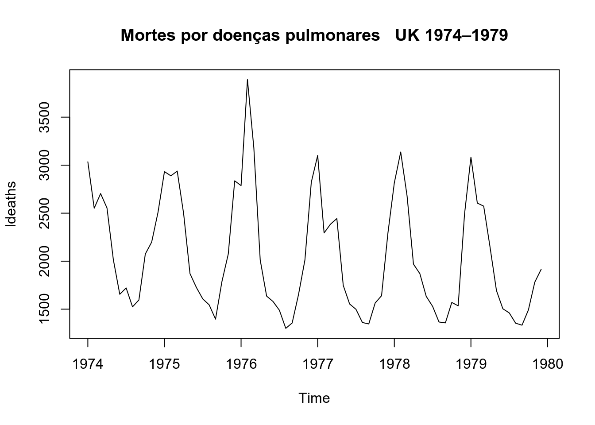

---

## Ciclo

- Os ciclos são oscilações (aproximadamente regulares) em torno da tendência. Podem dever-se a fenômenos naturais, socioculturais ou econômicos, como variações climáticas (ex: excesso ou falta de chuva pode produzir ciclos agrícolas)

- Variações que apesar de periódicas não são associadas automaticamente a nenhuma medida do calendário;

- Aumento ou redução de frequência sem intervalos fixos.

Ex: Ciclos Econômicos e Ciclos de epidemias.

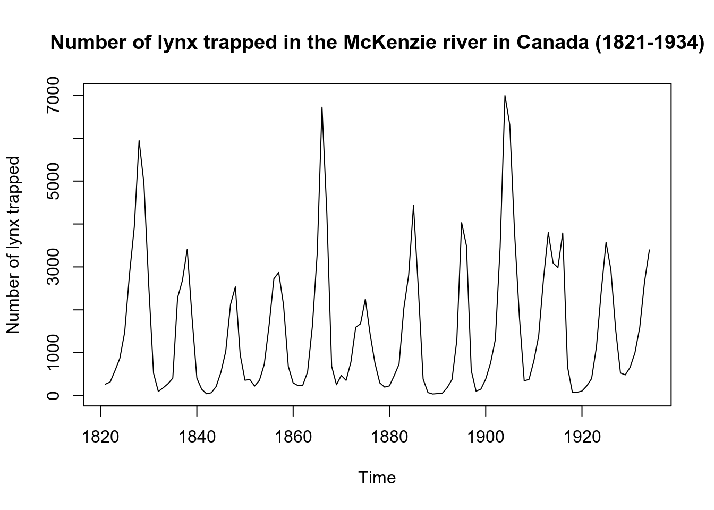


- A diferença entre os ciclos, propriamente ditos, e a sazonalidade é o período de avaliação (curto e longo);

- A semelhança é que ambos definem oscilações relativamente regulares em torno da tendência.

- Na área de saúde é pouco comum encontrarmos ciclos, ainda que possam existir.

---

### Como detectar a sazonalidade ?

- Visualmente

  - Boxplots
  - seasonplot
  - monthplot 
  - decomposição
    


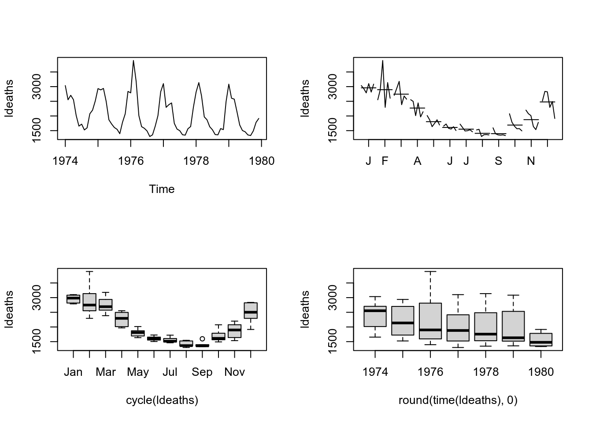

---

## Termo Aleatório ou Ruído Branco

- Conceitualmente, a componente aleatória é uma mistura de pertubações bruscas, irregulares e esporádicas nos movimentos das séries que tipificam os fenômenos. Na realidade é resultante dos efeitos de múltiplas causas que dificilmente/não conseguem ser previstos.

- Exemplos típicos de eventos aleatórios:

  - Secas
  - Enchentes 
  - Terremotos
  - Ocorrência de epidemias
  - Crise política
  - Conflitos Socioeconômicos
  
---


## Composição dos Modelos de séries temporais

- A série pode ser descrita como sendo a soma ou multiplicação dos componentes (tendência, sazonalidade, ciclicidade - se houver - e termo aleatório).


### Modelo Aditivo

$$Z_t = T_t + S_t + a_t$$ 

sendo $t = 1,2, ..., N$

- Essa composição de modelo sugere que a variação sazonal parece constante, não muda quando da série temporal aumenta.


### Modelo Multiplicativo 

$$Z_t = T_t . S_t . a_t$$

- Essa composição de modelo sugere que a sazonalidade varia em conjunto com a tendência (aumenta de amplitude quando aumenta a tendência).
- Pode ser transformado em aditivo usando $log$.


$$log(Z_t) = log(T_t . S_t . a_t) = log(T_t) + log(S_t) + log(a_t)$$


---

## Decomposição de séries temporais 

 

---

## Prática no R

### A biblioteca *ts* é a mais utilizada no R 

Na biblioteca **ts** a função mais utilizada tem o mesmo nome `ts` , não é necessário chamar `library(ts)` pois a mesma já se encontra carregada por default.

A função `ts` tem como argumentos principais: 

- **data**: um vetor, data.frame ou matriz com dados para a série

- **start**: tempo da primeira observação e/ou  **end**: tempo da última observação

- **frequency**: quantidade de observações por unidade de tempo, podendo representar: Anual = 1, Trimestral = 4, Mensal = 12 e Semanal = 52

---


### Simulando uma Série Temporal

Vamos simular uma série usando a função `rnorm` para gerar 60 pontos aleatórios , com media 0 e desvio 1 em seguida vamos usar a função `ts` para transformar o vetor em uma objeto *ts* e finalmente fazer um gráfico. 


```r
# Uma serie temporal normalmente distribuída
serie <-  rnorm(60)

# usando a função ts para criar um objeto da classe ts
# pode-se usar também  end=c(2016,12) mas basta um! 
serie.ts  <- ts(serie,start = c(2012,1), frequency=12) 
```

Vamos observar agora como é um objeto do tipo _ts_ 


```r
serie.ts
```

```
              Jan          Feb          Mar          Apr          May          Jun          Jul          Aug          Sep          Oct          Nov          Dec
2012 -0.850789274  1.098551160 -1.206355025  0.581862276  0.863689895  0.983052004 -1.271260251 -0.001062756 -0.960910158  1.259209306 -0.866606890  0.249044190
2013 -0.086168223 -0.492884341 -0.268998914 -0.399240236 -0.944297510  1.013188332 -0.408704068 -0.181086790  1.183755855 -1.608494491 -2.272439862 -2.040607916
2014 -0.648006354  0.717722237 -0.103400012  0.327017362 -0.977597331  0.341442983  0.043822392 -1.021578363  0.793427719  0.501624458 -1.554470354  0.883497837
2015 -0.207767801  1.831374014  0.177264382 -0.805840648  1.947932470  0.121197052 -0.354949127  1.052866250  1.163113962 -0.798832818  0.775455294 -1.995007352
2016 -0.350562193  0.380864742  0.258213780  0.964510263 -0.491278153  0.081638756 -0.161770723  1.272817069 -0.720269271  1.541051559  0.853661550  0.802399491
```

Para se obter o gráfico basta usar a função _plot_ 


```r
# gráfico da série
plot(serie.ts)
```

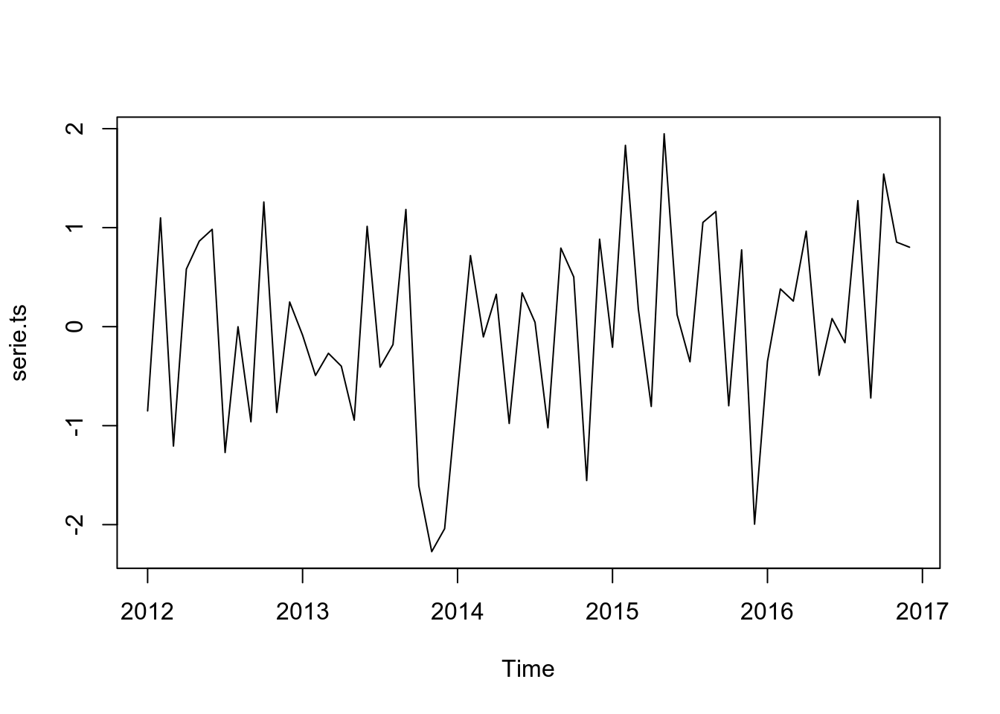


---

### Importando uma vetor e transformando em Série Temporal

Vamos usar agora um exemplo de casos caxumba em Nova York de 1928-1972 proveniente  do livro:


>Yorke, J.A. and London, W.P. (1973) 
>"Recurrent Outbreaks of Measles, Chickenpox and Mumps",
>American Journal of Epidemiology, Vol. 98, pp.469


Observe que a partir de um dado puramente vetorial já podemos obter um objeto *ts* 

[Clique aqui para ver como são os dados brutos](https://gitlab.procc.fiocruz.br/oswaldo/eco2019/raw/master/exemplos/caxumba.dat)

Para ler os dados utilizaremos a função `scan` que importa dados vetoriais. Nesse exemplo estaremos usando os dados diretos de uma [URL](https://pt.wikipedia.org/wiki/URL) mas o dado poderia estar no seu disco, assim você importaria localmente!


**OBSERVAÇÃO:**  

    No MS-Windows existe algum problema ao acessar sites seguros (HTTPS) 
    assim vamos definir uma função que permita o acesso a esse tipo de site. 
    podemos tentar duas coisas:
    
    

```R

options(url.method="libcurl")

```


Ou criar uma função:

```R

scan.win <- function(x) {scan(url(x,method = 'libcurl'))}

```

> No Windows 10 aparentemente não é necessário o procedimento acima mas fique atento que ao longo do curso estaremos importando dados com frequência. Descubra como fazer essa importação funcionar no seu computador! 

Exemplo com dados de Caxumba, não se esqueça de definir a função acima!


```r
dados <- scan('https://gitlab.procc.fiocruz.br/oswaldo/eco2019/raw/master/exemplos/caxumba.dat')
caxumba <- ts(dados,start = c(1928,1),frequency = 12)
plot(caxumba)
```

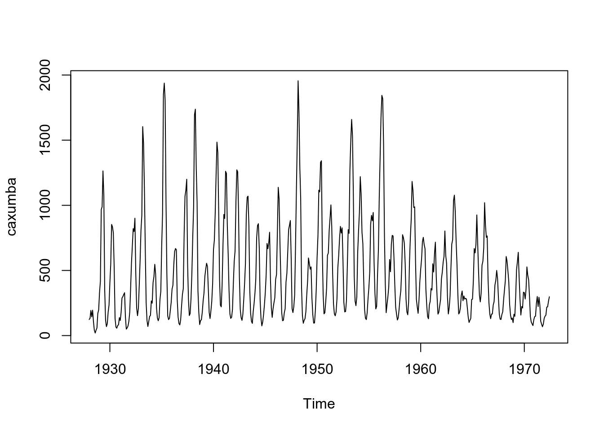

---

### Utilizando dados da incidência de dengue nas Filipinas, 2008 - 2016

Exemplo serie mensal da  Incidência  de dengue por  100,000hab  em uma região das Filipinas de  2008 to 2016.
Fonte: Kaggle 


```r
dengue <- read.csv("https://gitlab.procc.fiocruz.br/oswaldo/eco2019/raw/master/dados/denguecases2.csv")
head(dengue)
```

```
##   Month Year Dengue_Cases
## 1   Apr 2008    131.13331
## 2   Aug 2008    159.97741
## 3   Dec 2008     93.65630
## 4   Feb 2008     49.38712
## 5   Jan 2008     79.85915
## 6   Jul 2008    152.63940
```


Antes de colocando em formato de série temporal utilizando a biblioteca *ts* do R, precisamos ordenar o _dataframe_ para que possamos transformar corretamente em uma série temporal uma vez que a função baseia-se somente na ordem de entrada.

Assim vamos alterar  a coluna _Month_ em um fator para que possamos manter a ordem dos meses e em seguida usar a função **order** para reordenar todo o _dataframe_.


```r
dengue$Month <- factor(dengue$Month,levels = month.abb)

dengue <- dengue[order(dengue$Year,dengue$Month),]

head(dengue)
```

```
##   Month Year Dengue_Cases
## 5   Jan 2008     79.85915
## 4   Feb 2008     49.38712
## 8   Mar 2008    115.13416
## 1   Apr 2008    131.13331
## 9   May 2008    129.20466
## 7   Jun 2008    210.24223
```

Com o dado na devida ordem e podemos continuar a transformação em  série temporal.


```r
# Convertendo os dados para o formato de Séries Temporais
# A frequency=12 foi especificado pois queremos mostrar dos dados mensais
denguets <- ts(dengue$Dengue_Cases,start=c(2008,1),frequency=12)
plot(denguets, ylab="Casos de Dengue", xlab="Tempo")
```


Verificando e testando a autocorrelação dos casos de dengue.

$$
\begin{aligned}
&& H_{0}: \rho_{h}=0 \\
&& H_{1}: \rho_{h}\neq 0
\end{aligned}
$$


```r
acf(denguets, lag.max=20, main="Função de Autocorrelação")
```

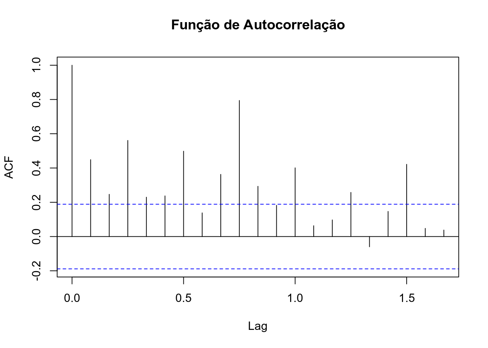


```r
Box.test(denguets, lag=20, type="Ljung-Box")
```


	Box-Ljung test

data:  denguets
X-squared = 271.51, df = 20, p-value < 2.2e-16

Através do gráfico e do teste do ACF, é possível verificar que a incidência de dengue é correlacionada ao longo do tempo.

---

**Fazendo uma análise descritiva da série temporal**


```r
denguets
```

```
           Jan       Feb       Mar       Apr       May       Jun       Jul       Aug       Sep       Oct       Nov       Dec
2008  79.85915  49.38712 115.13416 131.13331 129.20466 210.24223 152.63940 159.97741 307.65474  58.74152  36.17346  93.65630
2009  87.96879  96.47914 190.36630  98.15255 124.03703 215.76350  40.66555  39.54446  85.84889  70.55726  95.37771 171.74569
2010  81.62430  95.59756 174.13877  33.54686  32.44285  60.04658  55.22568  90.16454 135.63883  74.17619  71.39315 138.44613
2011  33.66412  46.52083  93.34766  58.76998 134.83900 187.12547 109.27259  88.23193 143.89752  53.87635  91.05780 184.88198
2012 114.48472 251.27249 400.20592 162.21779 191.47219 276.13014  75.88479 128.88087 423.70277 239.40052 421.72803 607.49949
2013 244.44260 374.95060 530.46735  75.91858 132.94225 678.00967 387.48040 448.67952 515.58071 303.43820 530.61714 696.56174
2014  56.28797 113.67882 522.16422 249.49254 326.64717 366.61897 237.79033 509.79051 469.48018  41.43502  87.44494 226.41755
2015 134.40762 255.93445 243.46980 212.50300 485.76066 331.08272  33.81837  60.95752 121.16441 104.00878 210.63816 160.61858
2016 201.73756 362.34941 270.55192  18.94775  57.02598  57.41445  70.58666 145.36292 116.41069 119.08265 245.19665 194.46347
```

Vamos verificar a propriedades da série:


| Estatística          | Função R            | Valor |
| -------------------- | :--------------------: | :-----: |
| Comprimento da Serie | *length()*           |   108    |
| media      | *mean()*  |  192.0458131    |
| mediana      |  *median()* |  134.62331    |
| máximo  | *max()*  |   696.56174    |
| minimo | *min()* |   18.947748    |
| amplitude | *range()* | 18.947748, 696.56174 |
| frequência | *frequency()* |  12   |
| período de inicio | *start()* |  2008, 1     |
| período de fim | *end()* |  2016, 12     |


Pode-se pedir também o sumário da série!


```r
summary(denguets)
```

```
   Min. 1st Qu.  Median    Mean 3rd Qu.    Max. 
  18.95   81.18  134.62  192.05  246.27  696.56 
```


```r
hist(denguets,breaks = 10)
```

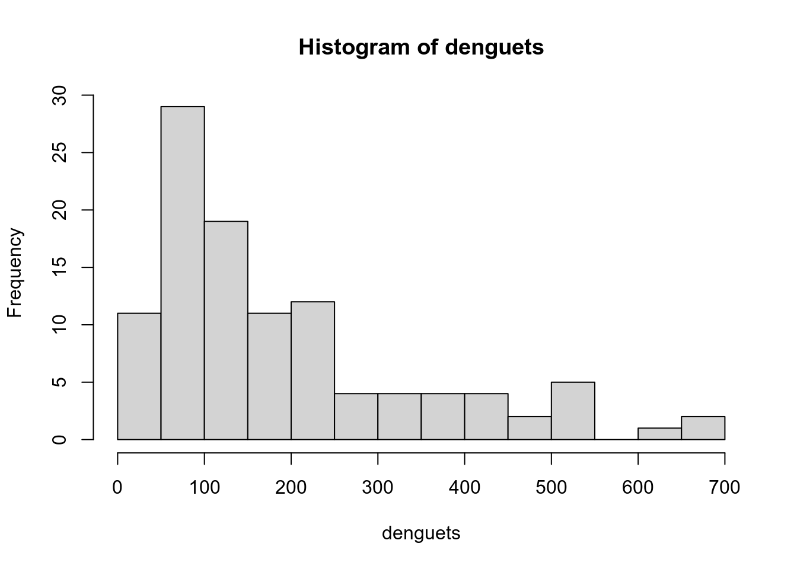


```r
boxplot(denguets,col='lightblue')
```


Mudando a janela de tempo da série temporal: observando apenas os dados de Jan 2010 até Dez de 2012.


```r
denguets2 <- window(denguets, start=c(2010,1),end=c(2012,12),frequency=12)
plot(denguets2, ylab="Casos de Dengue", xlab="Tempo")
```

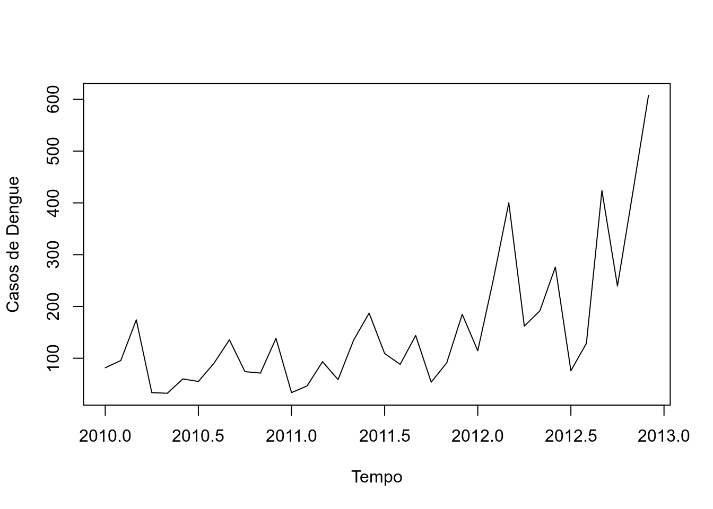

---

**Decompondo a série temporal**

Decompondo a série temporal dos casos de dengue via método clássico **decompose** (Decomposição via Médias Móveis):


```r
plot(decompose(denguets))
```

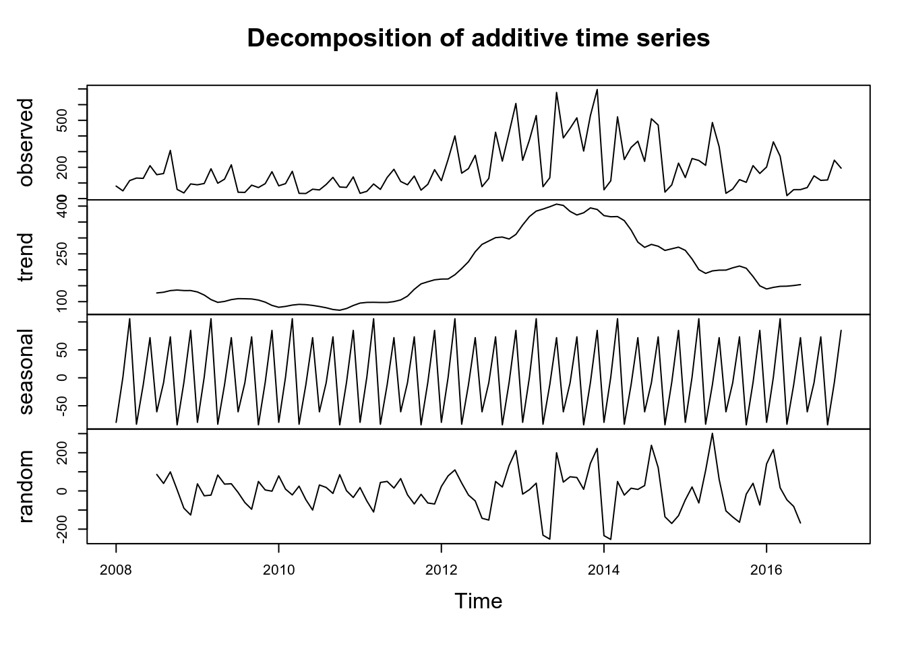

Decompondo a série temporal dos casos de dengue via **STL (Seasonal and Trend decomposition using Loess)**:

- É mais robusta, mais sensível a vários tipos de sazonalidade e lida melhor com os *outliers*.


```r
plot(stl(denguets, s.window="periodic"))
```

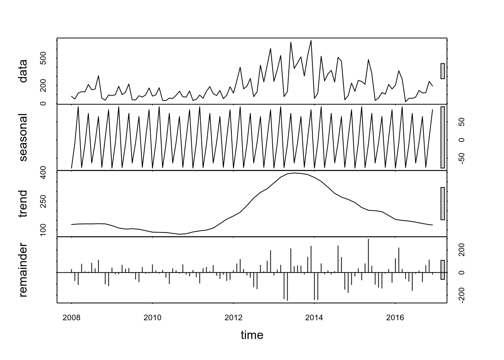


```r
decom_dengue <- stl(denguets,12)
head(decom_dengue$time.series)
```

```
          seasonal    trend  remainder
Jan 2008 -71.00930 132.7212  18.147256
Feb 2008 -26.81769 132.8553 -56.650467
Mar 2008  81.88596 132.9894 -99.741166
Apr 2008 -65.11369 133.1235  63.123548
May 2008 -22.99327 132.7289  19.468992
Jun 2008  80.32281 132.3344  -2.415003
```

```r
plot(decom_dengue)
```

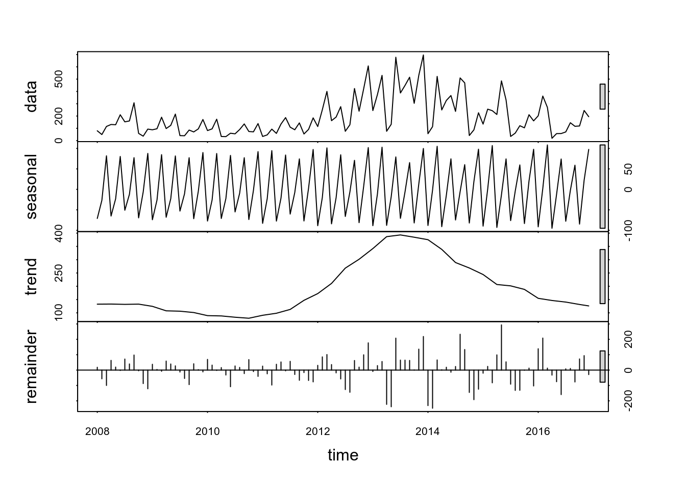

```r
Trend <- decom_dengue$time.series[,2]
Seasonal <-  decom_dengue$time.series[,1]
Random <- decom_dengue$time.series[,3]
```

Refazendo o sinal original da séries temporais através das componentes:


```r
recomposed_dengue <- Trend+Seasonal+Random

par(mfrow=c(1,2))
plot(denguets, ylab="Incidência Dengue", main="Original")
plot(as.ts(recomposed_dengue), ylab="Incidência Dengue", main="Recomposta")
```

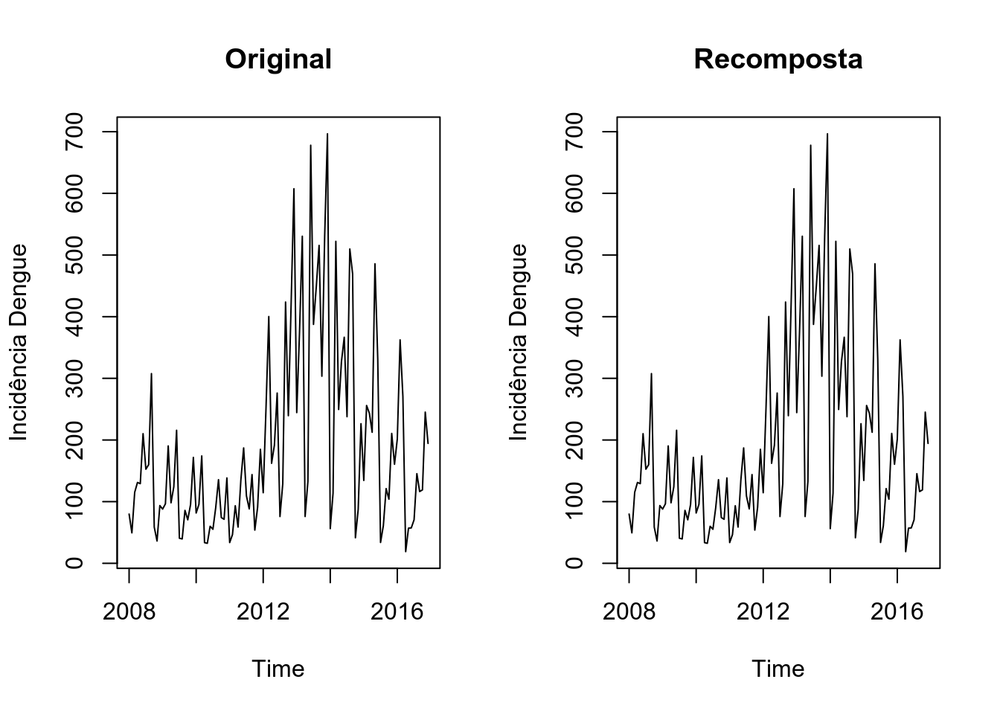

Em algumas séries temporais não é fácil avaliar suas componentes de maneira visual, ou seja, de maneira gráfica. Para podermos avaliar melhor precisamos utilizar alguns testes estatísticos. 

Outra forma de fazer gráficos é através das bibliotecas  ggplot e ggfortify:


```r
library(ggplot2)
library(ggfortify)

autoplot(denguets)
```

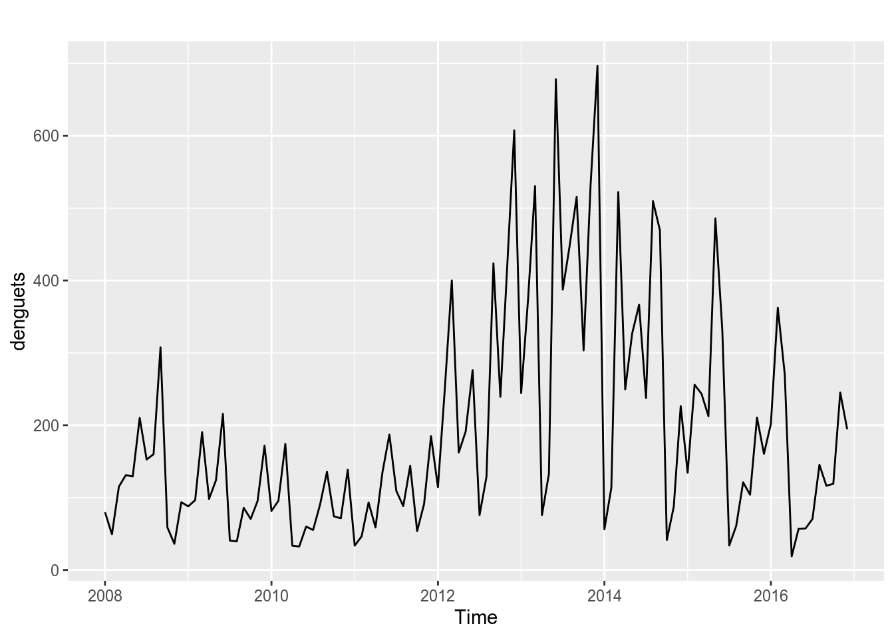

```r
autoplot(decompose(denguets))
```

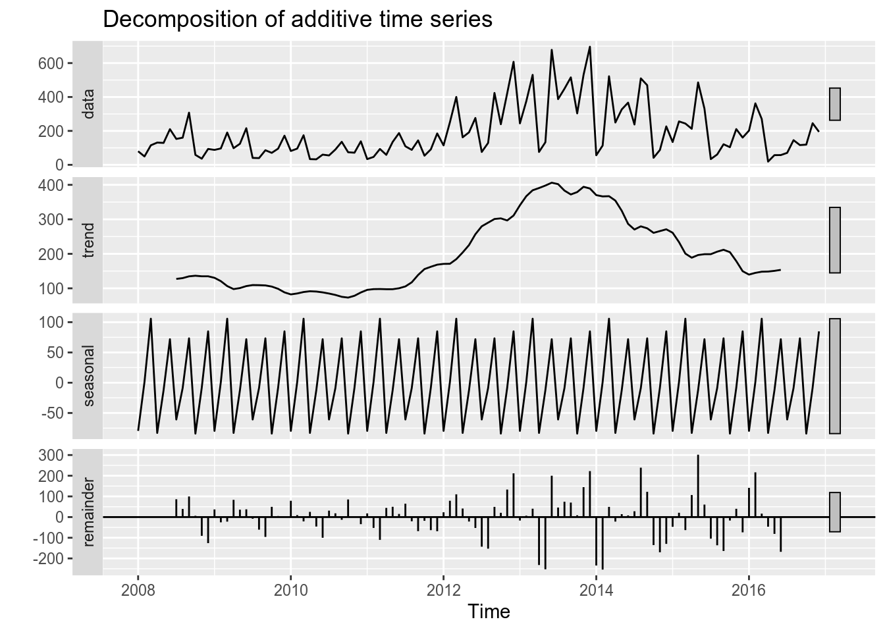

---

**Avaliando a Estacionariedade da série temporal**

Segundo o teste de ***Dickey-Fuller***:

$H_{0}$: A série temporal não é Estacionária

$H_{1}$: A série temporal é Estacionária

Alguns exemplos:

<!-- OC: Editar figura abaixo -->


Testando a estacionariedade da série dos casos de dengue: 


```r
library(tseries)
adf.test(denguets)
```


	Augmented Dickey-Fuller Test

data:  denguets
Dickey-Fuller = -1.9795, Lag order = 4, p-value = 0.5851
alternative hypothesis: stationary

Como *p-valor = 0,5851*, não rejeitamos a hipótese nula, ou seja, não há indícios da série temporal ser estacionária.

---

**Avaliando a tendência em uma série temporal**

Construindo uma reta baseado no modelo de regressão linear simples para verificar a tendência da incidência da dengue:


```r
plot(denguets, main = "Incidência de Dengue 2008 a 2016")
abline(reg=lm(denguets ~ time(denguets)), col = "red")
```

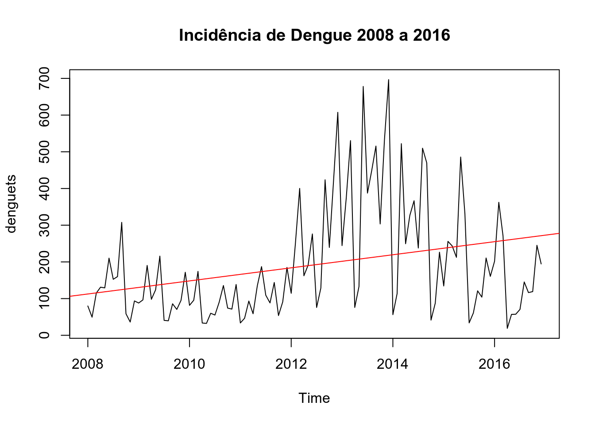


Construindo uma curva suavizada baseada na função *lowess* para verificar tendência da incidência da dengue:


```r
plot(denguets, ylab="Casos de Dengue", xlab="Tempo") 
library(Kendall)
lines(lowess(time(denguets),denguets),lwd=3, col=2)
```

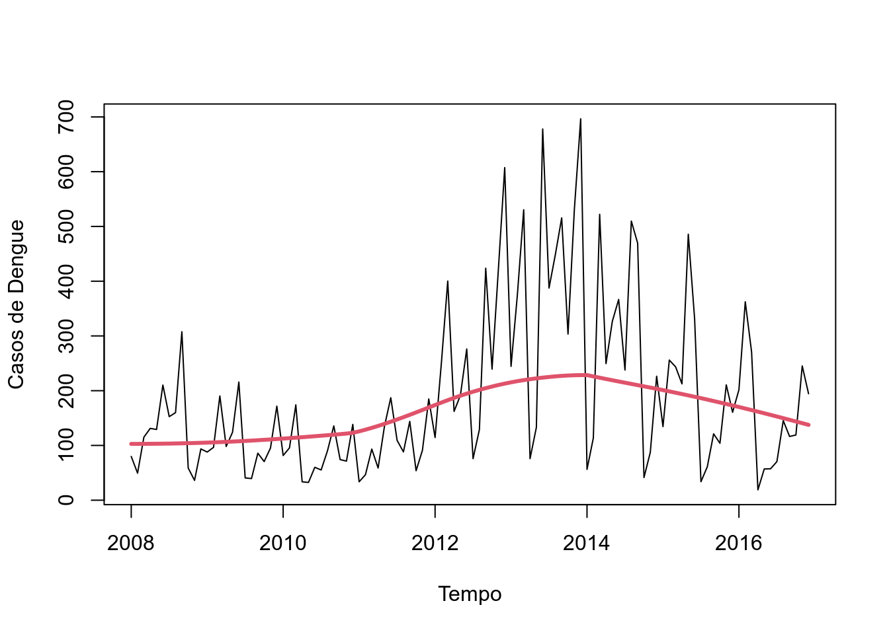


Uma outra forma de mostrar a tendência da série temporal é fazendo a média anual. Observe que a curva se parece um pouco com a curva do *lowess* porém menos suave.


```r
plot(aggregate(denguets, FUN=mean))
```

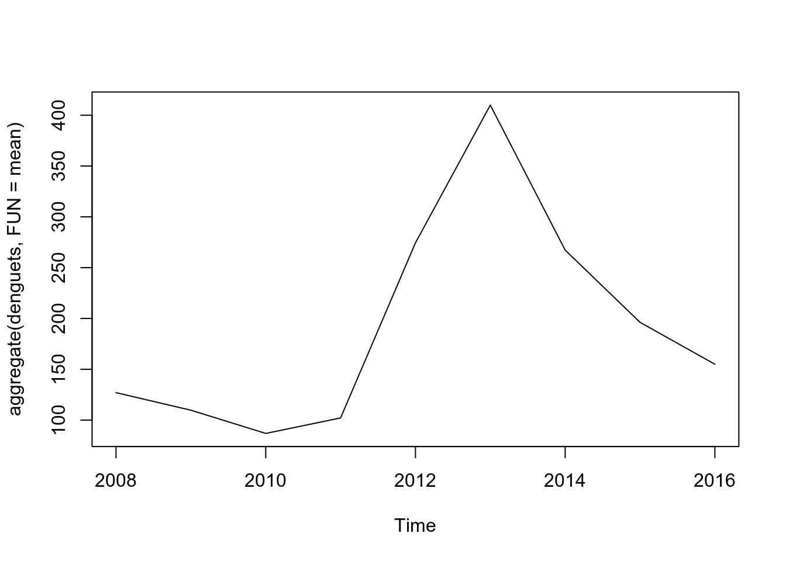

---

**Avaliando a Sazonalidade da série temporal**

De maneira visual podemos utilizar algumas técnicas gráficas, tais como:


- **Boxplot**


```r
boxplot(denguets ~ cycle(denguets))  
```

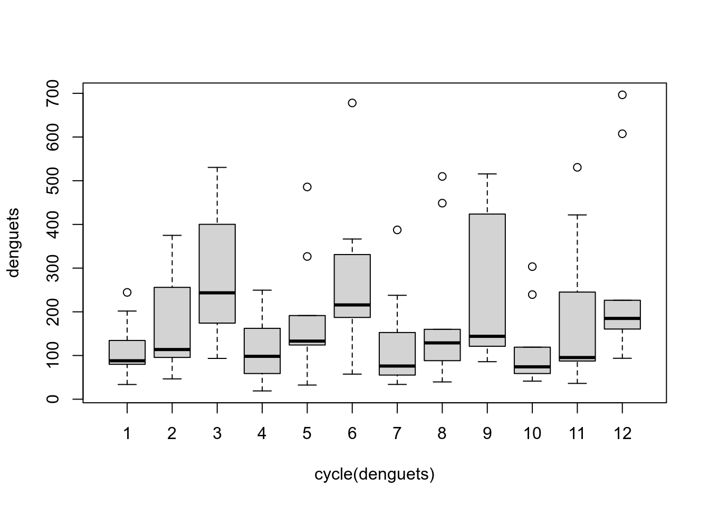


- **Monthplot**


```r
monthplot(denguets) 
```

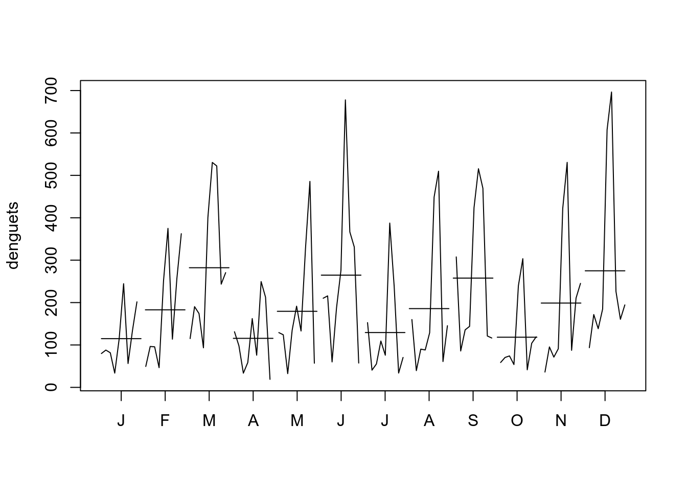


- **Seasonplot** (funçao disponibilizada pela library forecast)


```r
library(forecast)
seasonplot(denguets,col=terrain.colors(6),lwd=2)  
```

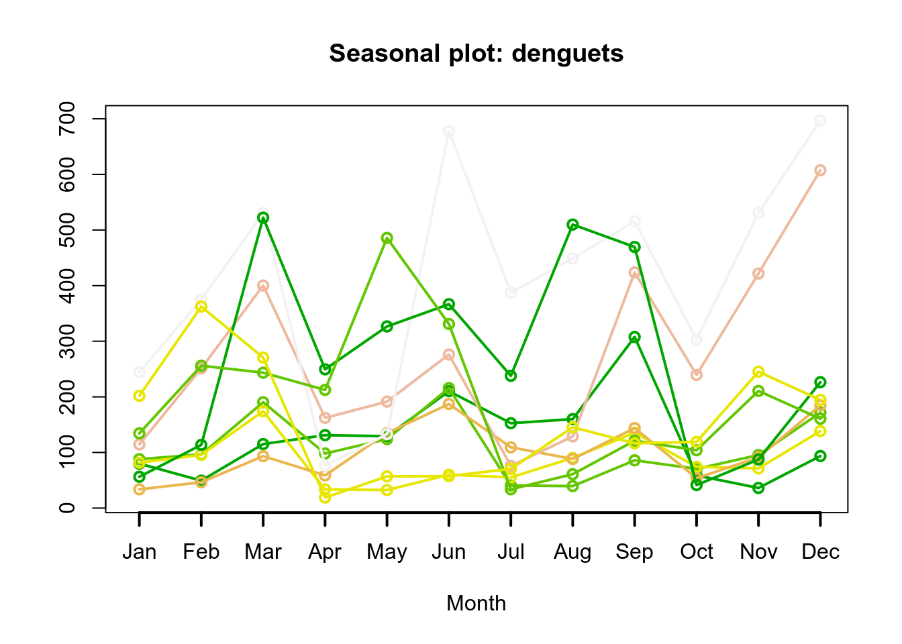

---

<!-- Outras possibilidades de fazer utilizando a biblioteca ggplot -->

<!-- ```{r, echo=T, warning=FALSE, results='asis', message = FALSE, out.width = "100%", fig.align = "center"} -->

<!-- ggsubseriesplot(denguets)  # monthplot -->
<!-- ggseasonplot(denguets)  # seasonplot -->
<!-- ggseasonplot(denguets, polar = T) -->

<!-- ``` -->

<!-- Segundo o teste de ***Kruskall-Wallis***: -->

<!-- $H_{0}$: Não existe diferença entre os períodos, ou seja, a série não apresenta sazonalidade -->

<!-- $H_{1}$: Existe diferença em pelo menos um período em relação aos demais, ou seja, há indícios da séries temporais apresentar sazonalidade -->

<!-- ```{r, echo=T, warning=FALSE, results='asis', message = FALSE, out.width = "70%", fig.align = "center"} -->
<!-- kruskal.test(denguets ~ cycle(denguets))   -->

<!-- ``` -->

<!-- Neste caso, podemos dizer que existe indícios da da série apresentar períodos que são maiores ou menores que outros. -->


<!-- ## Transformação -->

<!-- ```{r, echo=T, warning=FALSE, results='asis', message = FALSE, out.width = "100%", fig.align = "center"} -->
<!-- par(mfrow=c(2,2)) -->

<!-- #serie original -->
<!-- plot(denguets, ylab="Casos", main="Original") -->

<!-- #lambda = 0, logaritmica -->
<!-- t1 <-  BoxCox(denguets,lambda =0 ) -->
<!-- plot(t1, ylab="Casos", main="Lambda = 0, Logarítmica") -->

<!-- #gera labda automático -->
<!-- lbd <-  BoxCox.lambda(denguets) -->
<!-- # print(lbd) -->
<!-- t3 <-  BoxCox(denguets,lambda =lbd ) -->
<!-- plot(t3, ylab="Casos", main="Labda Automático") -->

<!-- #diferenciacao -->
<!-- t4 <-  diff(denguets) -->
<!-- plot(t4, ylab="Casos", main="Diferenciação") -->

<!-- ``` -->

## Exercícios Propostos

Utilizando os bancos: 

1. Série mensal de óbitos por doenças respiratórias na região  Sul do Brasil de 1996 a 2017 (pode ser acessado na URL https://bit.ly/2P4CJj4, fonte: DataSUS/MS)

2. Série semanal do numero de casos Malaria nos EUA de 1974 a 1984 (pode ser acessado na URL https://bit.ly/2KMXsCC, fonte:CDC/US)

Importe a série para um formato **_ts_** e faça: 

i) Uma análise exploratórias dos dados em formato séries temporais;

ii) Decomponha a série temporal;

iii) Através de análises gráficas e/ou testes estatísticos, avalie e verifique a existência de tendência e sazonalidade na série.


## Outros materiais sobre Séries Temporais

**Time Series Task View:**

https://cran.r-project.org/web/views/TimeSeries.html

**Blog, Ebook and Forecast Documentation by Rob Hyndman:**

https://otexts.org/fpp2/intro.html

**Extracting Seasonality and Trend from Data: Decomposition Using R**

https://anomaly.io/seasonal-trend-decomposition-in-r/index.html

**STL: A seasonal-trend decomposition procedure based on loess**

https://www.scb.se/contentassets/ca21efb41fee47d293bbee5bf7be7fb3/stl-a-seasonal-trend-decomposition-procedure-based-on-loess.pdf)


**Stackoverflow Community:**

https://stackoverflow.com/questions


## Bibliografia sugerida

DIGGLE, Peter. Time Series: A Biostatistical Introduction (Oxford Statistical Science Series, No. 5) 1st Edition, 1996

FERREIRA, Pedro Guilherme Costa. Análise de Séries Temporais em R: curso introdutório. 2018.

METCALFE, Andrew V.; COWPERTWAIT, Paul SP. Introductory time series with R. Springer-Verlag New York, 2009.

MORETTIN, Pedro A.; TOLOI, Clélia M.C. Análise de Séries Temporais: Modelos Lineares Univariados. Bluscher - ABE - Projeto Fisher. Edição 3, 2018.

WOODWARD, Wayne A.; GRAY, Henry L.; ELLIOTT, Alan C. Applied time series analysis with R. CRC press, 2017.


# Transformações e Suavizações

## Introdução

As transformações e as funções de alisamento (suavização) em séries temporais são normalmente empregados para nos ajudar a ver melhor os padrões existentes - tais como as tendências e sazonalidade - e suavizar as oscilações irregulares (ruídos) para que possamos obter uma série mais limpa com um sinal mais claro.

Estas técnicas não nos fornecem um modelo, mas podem ser um bom primeiro passo na descrição para os vários componentes da série.

## Transfomação dos dados em ST

Alguns exemplos:

-   **Utilização de funções:** Logarítmicas, Potências, Exponenciais, ou transformação *Box-Cox*.

-   **Diferenciação:** Séries não estacionárias. Objetivo é transformar a série em estacionária, estabilizando a média ( $\bigtriangledown Z_t$ ).

-   **Box-Cox:** Estabiliza a variância. (também o **log** , **sqrt** etc...)

-   **Médias Móveis:** Permite a suavização dos dados da ST. Reduz *outliers* e captura a tendência.

-   **Outras técnicas de suavização:** Kernel, Loess/Lowess, Splines e *Generalized Additive Model* (GAM).

Para demostrar o resultado dessas transformações, iremos aplicar algumas dessas técnicas.

### Transformações Box-Cox, Diferenciação e Logarítmica

Esta é uma técnica de transformação de dados útil para estabilizar a variância, tornar os dados mais semelhantes à distribuição normal, melhorar a validade das medidas de associação e para outros procedimentos de estabilização de dados.

-   Box and Cox (1964) propuseram uma transformação na variável da ST $Z_t$, que depende do parâmetro $\lambda$ da seguinte forma:

$$ Z_{t}(\lambda) = \left\{ \begin{array}{rc} Z_t^{\lambda}, &\mbox{se} \quad \lambda \neq 0, \\  ln(Z_t) , &\mbox{se} \quad \lambda = 0. \end{array}\right.$$

-   Se o valor de $\lambda$ é igual a zero, a transformação logarítmica da sequência inicial é realizada.
-   Se o valor de lambda difere de zero, a transformação é por lei exponencial.
-   Quando $\lambda$ = 1, a série é analisada em sua escala original.
-   $\lambda = 1/2$ corresponde à transformação da raiz quadrada.
-   Para que a transformação seja aplicável, a série deve ser estritamente positiva.

Ex: Utilizando os dados do dataset Air Passengers, temos:


```r
library(forecast)
par(mfrow=c(3,2))
# Série original
plot(AirPassengers, ylab="Passageiros", main="Original")
# Lambda = 0, Logaritmica 
t1 <- BoxCox(AirPassengers,lambda =0 )
plot(t1, ylab="Passageiros", main="Lambda = 0, Logaritmica")
# Lambda = 0.1 
t2 <- BoxCox(AirPassengers,lambda =.1 )
plot(t2, ylab="Passageiros", main="Lambda = 0.1")
# Gera labda automático
lbd <- BoxCox.lambda(AirPassengers)
# print(lbd)
t3 <- BoxCox(AirPassengers,lambda =lbd )
plot(t3, ylab="Passageiros", main=paste0("Lambda Automático (",round(lbd,4),")"))
# Diferenciação 
t4 <- diff(AirPassengers)
plot(t4, ylab="Passageiros", main="Diferenciação ")
# Logarítmo 
t5 <- diff(log(AirPassengers))
plot(t5, ylab="Passageiros", main="Diferença do Log")
```

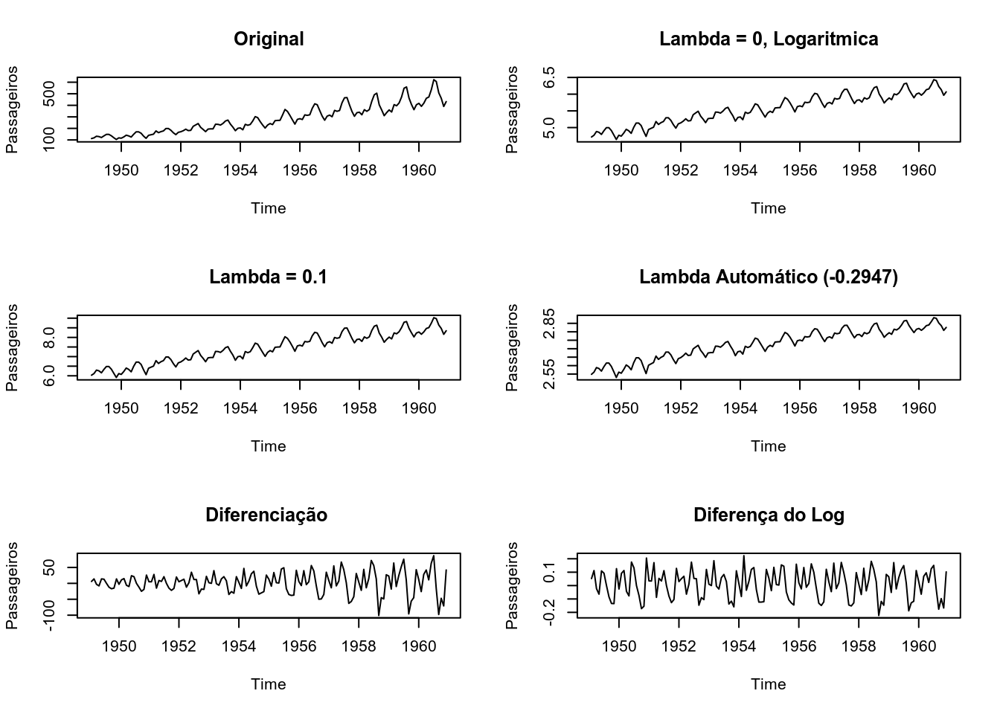

## Métodos de Alisamento ou Suavização

-   Uma função é suave quando contínua e derivável em todos os pontos.

-   Utiliza-se a expressão *Funções de Suavização* para definir funções que, aplicadas sobre um conjunto numérico, retornam outro conjunto cujos valores tendem à média (local ou global).

-   Funções de suavização são utilizadas quando se supõe que o fenômeno é, de fato, suave, e as observações apresentam variabilidade aleatória pouco relevante.

-   Também são utilizadas quando se deseja modelar a estrutura geral o fenômeno, desconsiderando cada ocorência isolada.

### Algumas funções de suavização

Existem diversos tipos de funções de suavização no **R**. Dentre as principais, destacamos:

1)  **Médias móveis:** O método mais simples de suavização.

2)  **Kernel density:** Estimativa de densidade de probabilidade -- equivale à uma média ponderada.

3)  **Loess/Lowess:** *locally (weighted) estimated scatterplot smoothing* -- estende a mesma idéia, mas os valores entram em uma regressão (ponderada ou não), retornando não apenas a média, mas também uma inclinação ($\beta$).

4)  **Splines:** cúbica, quadrática, p-splines, thin plate splines etc...

Todas essas funções podem ser uni ou multi-dimensionais. Existem ainda várias outras funções para suavizar.

<!-- {width=700px} -->

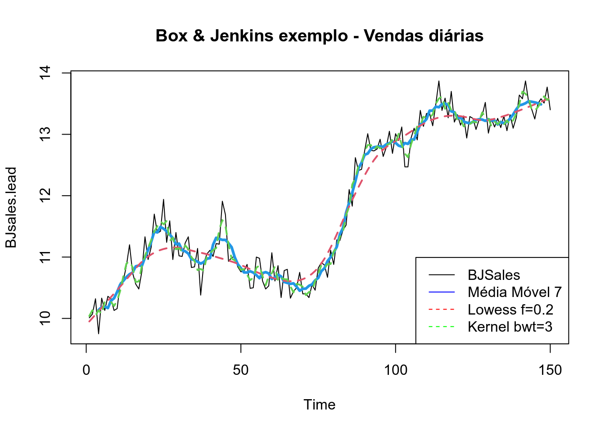

## Médias móveis

Considere a ST estacionária e localmente constante, composta de seu nível e mais um ruído aleatório:

$$ Z_t = \mu_t + a_t , $$ $$t = 1,2,...,N $$

Sendo $E(a_t) = 0$, $Var(a_t)=\sigma^2_a$ e $\mu_t$ é um parâmetro desconhecido que varia com o tempo.

A técnica de média móvel consiste em calcular a média aritmética das $h$ observcações mais recentes, ou seja:

$$M_t = \dfrac{Z_t+Z_{t-1}+...+Z_{t-h+1}}{h}$$

-   Denotamos por $h$ o comprimento da média.

-   Desta forma, $M_t$ é uma estimativa do nível $\mu_t$ que não leva em consideração as observações mais antigas. Note que a cada período a observação mais antiga é substituída pela mais recente, calculando-se uma média nova.

<!-- #{width=700px} -->

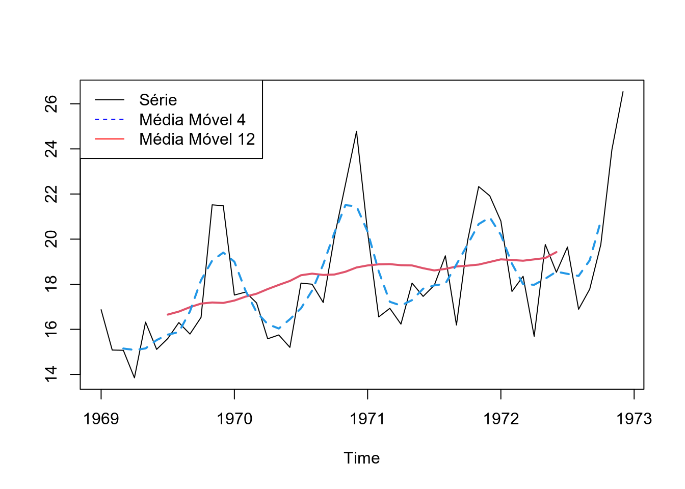

Vamos exemplificar o que acontece quando se usa uma janela de 3 meses. Repare as 3 primeiras observações na série original:

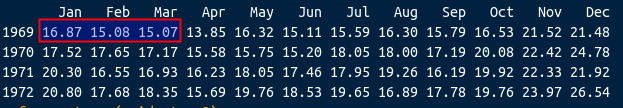{width="1270px"}

Agroa a série com Média Móvel 3. Note que o primeiro e o último valores da série agora são **NA**:

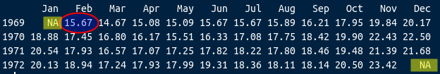{width="1270px"}

Observe que o valor para fevereiro é calculado a partir dos 3 primeiros valores.

```C
    (16.87 + 15.08 + 15.07)/3 =  15.67
```    
    
Note que o exemplo acima é uma media móvel **centrada** com uma janela de 3 meses. Nesse caso, se perde o primeiro e o último pontos da série. 

Existe ainda a possibilidade de se alinhar a media  móvel à direita ou à esquerda, sendo a media centrada o *default* na grande maioria das funções. 


**Exemplo:** Utilizando a ST mensal de mortes em estradas no Reino Unido (1969--1984), temos :


```r
library(forecast)
plot(UKDriverDeaths,ylab='',main="Média Móvel Centrada")
lines(ma(UKDriverDeaths,12),col=2,lty=1,lwd=2)
lines(ma(UKDriverDeaths,4),col=4,lty=2,lwd=2)
legend("topright",legend=c("Óbitos","Média Móvel 4","Média Móvel 12"),
       col = c("black",'blue','red'), lty=c(1,2,1), cex=1)
```

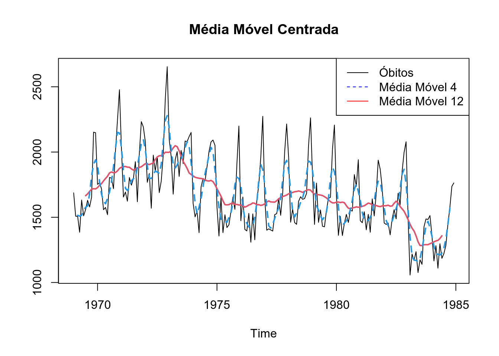

Existem muitas funções em diversos pacotes que possibilitam fazer a media móvel. No exemplo anterior, usamos a função `ma()` do pacote `forecast`.  Vamos a seguir usar a função `rollmean()` do pacote `zoo`, mostrando como ficariam as médias móveis com esses outros alinhamentos.  


```r
plot(UKDriverDeaths,ylab='',main="Média Móvel alinhada à direita")
lines(zoo::rollmean(UKDriverDeaths,k=6,align = 'right'),col=4,lwd=2)
```

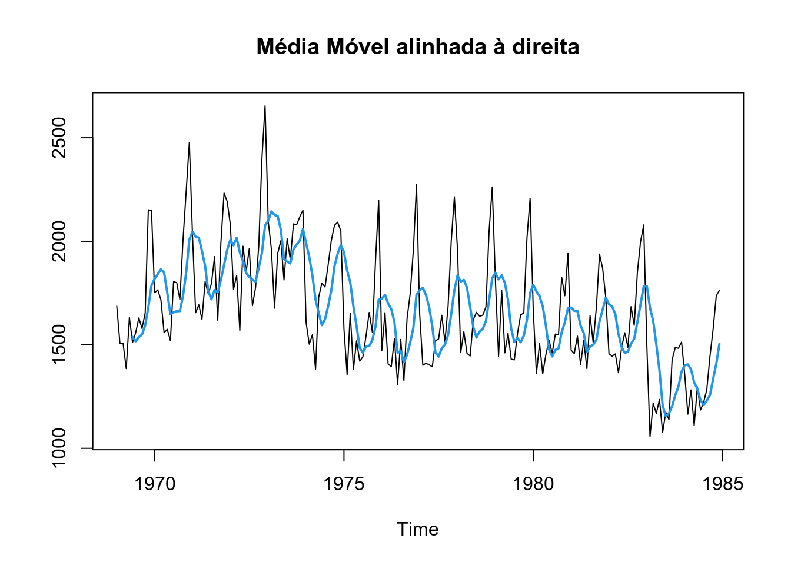

```r
plot(UKDriverDeaths,ylab='',main="Média Móvel alinhada à esquerda")
lines(zoo::rollmean(UKDriverDeaths,k=6,align = 'left'),col=6,lwd=2)
```

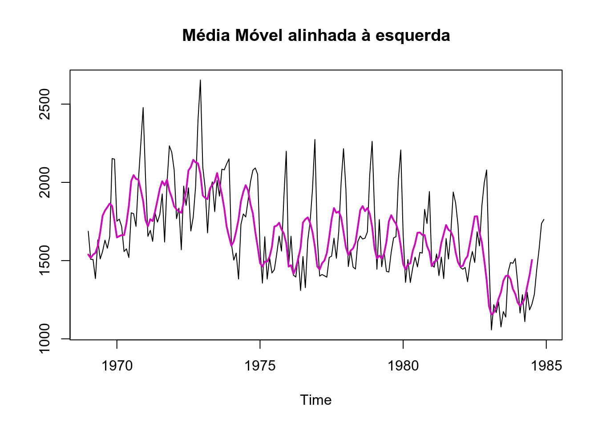


### Utilização das Médias Móveis

-   Processo de Transformação - "Suavização da Série"

-   Remoção de outliers

-   Identificação de tendências

**Ex:** Médias Móveis - ordem 5

## Kernel

O algoritmo:

-   Seja $(x)$ ponto para o qual se deseja estimar f(.)

-   Defina a função **kernel**: simétrica, unimodal, centrada em $(x)$, que cai a zero nos limites da **vizinhança**.

-   Esse subconjunto dos dados, também denominado **janela**, **largura de banda** ou **parâmetro de suavização** controla flexibilidade do kernel.

-   Repita o procedimento para diversos $(x)$

-   Conecte os pontos

$$\hat{f_h}(x) = \dfrac{1}{Nh}\sum{K \left( \dfrac{x-x_i}{h}\right)}$$

-   $h$ $\rightarrow$ largura de banda

-   $K$ $\rightarrow$ função de suavização

Kernel Gaussiano: $$k(x)=\dfrac{1}{\sqrt{2\pi}} exp(1/2 x^2)$$

### Diferentes Funções Kernel

{width="700px"}

Vamos a uma demostração:


Ao chamar a função `demo()` você vai ver um painel de controle como o abaixo: 

E uma gráfico de uma função **kernel** como abaixo. Utilize o controle deslizante mostrado pela seta e altere as opções.

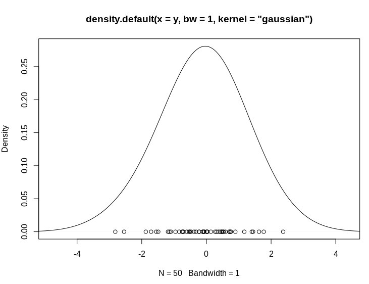

-   Série Temporal: Leptospirose *vs* Clima.


```r
#declara local na internet onde estão os dados
local <- "https://gitlab.procc.fiocruz.br/oswaldo/eco2019/raw/master/dados/"


## a função paste0 junta o local e o nome do arquivo!
lepto <- read.csv2(paste0(local,"leptoruido.csv"), header=T)
dia <- read.table(paste0(local,"climadia.dat"), header=T)

library(lattice)
library(car)
library(sm)
library(survival)

#XY condicionado
xyplot(cases + totrain + tempmed ~ week,
 outer=TRUE, layout=c(1, 3), pch=1, type="l",ylab="",
  scales=list(x=list(relation='same'), y=list(relation='free')),
 data=lepto)
```


-   Exemplos de Kernel em histogramas 


```r
#### density - default "gaussian"
hist(lepto$totrain, breaks=seq(0,400,by=10),freq=F, col="darkgray", main = "Chuva")
lines(density(lepto$totrain , 4),col=2)
lines(density(lepto$totrain , 12),col="blue")
legend("topright", c("4","12"), title="BW", col=c(2,"blue"), lty=c(1,1))
```

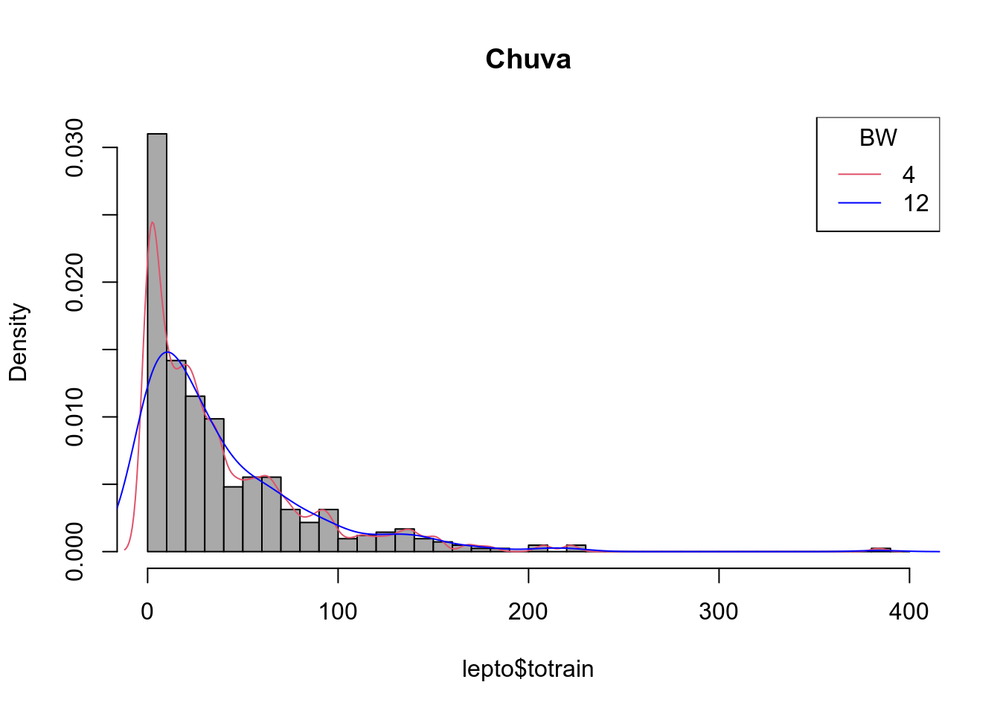

```r
hist(lepto$cases, breaks=seq(0,36,by=1),freq=F, col="darkgray", main = "Casos Leptospirose")
lines(density(lepto$cases , 1),col=2)
lines(density(lepto$cases , 2),col="green")
lines(density(lepto$cases , 4),col="blue")
legend("topright", c("1","2","4"), title="BW", col=c(2,"green","blue"), lty=c(1,1,1))
```

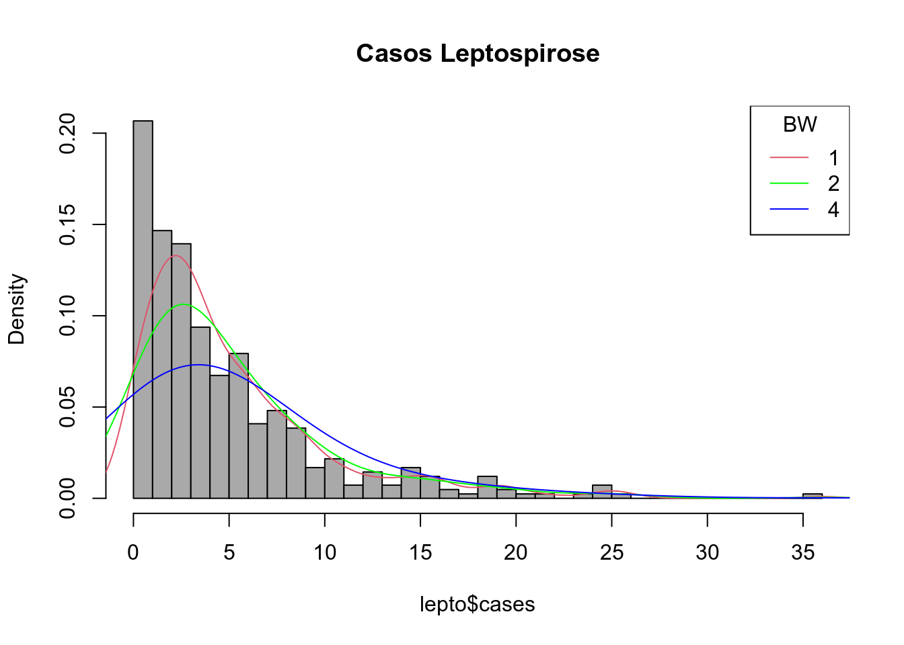

```r
hist(lepto$cases, breaks=seq(0,36,by=1),freq=F, col="darkgray")
lines(density(lepto$cases , 2, kernel = "rectangular" ),col=2)
lines(density(lepto$cases , 2, kernel = "triangular" ),col="green")
lines(density(lepto$cases , 2, kernel = "gaussian" ),col="blue")
legend("topright", c("retangular","triangular","gaussiano"), title="BW", col=c(2,"green","blue"), lty=c(1,1,1))
```

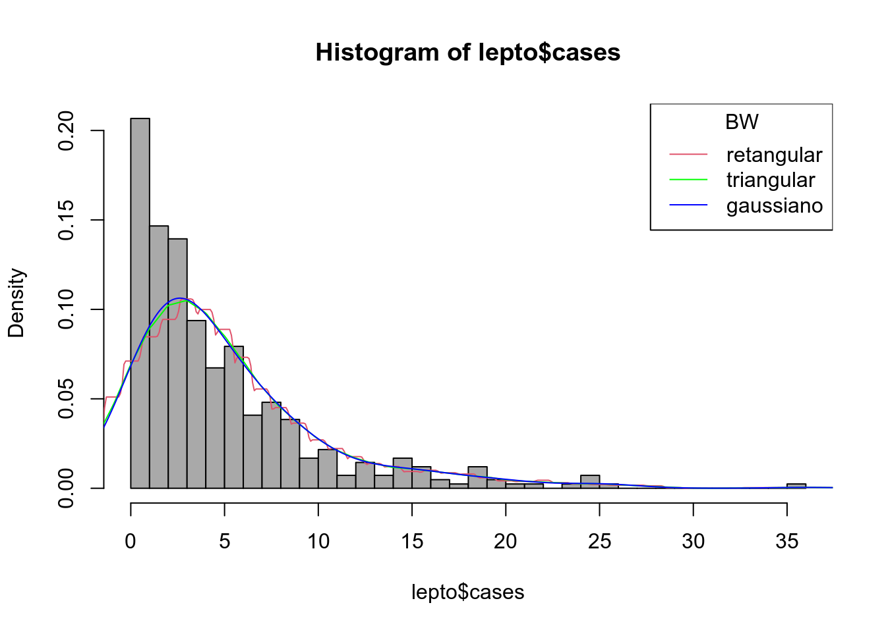

-   Aplicando o Kernel em ST:


```r
plot(totrain ~ week, data=lepto, cex=.3, pch=19,col="gray35",ylab="Kernel Chuva", xlab="Semana", 
  main="Kernel Smooth")
lines(ksmooth(lepto$week, lepto$totrain, kernel = "normal", bandwidth = 52), col=3)
lines(ksmooth(lepto$week, lepto$totrain, kernel = "normal", bandwidth = 21), lwd=2,col=7)
lines(ksmooth(lepto$week, lepto$totrain, kernel = "normal", bandwidth = 13), col=2)
lines(ksmooth(lepto$week, lepto$totrain, kernel = "normal",  bandwidth = 4), col=4)
legend("topright",c("52 sem.","21 sem.","13 sem.","4 sem."),fill=c(3,7,2,4), title="Janela",bty="n")
```

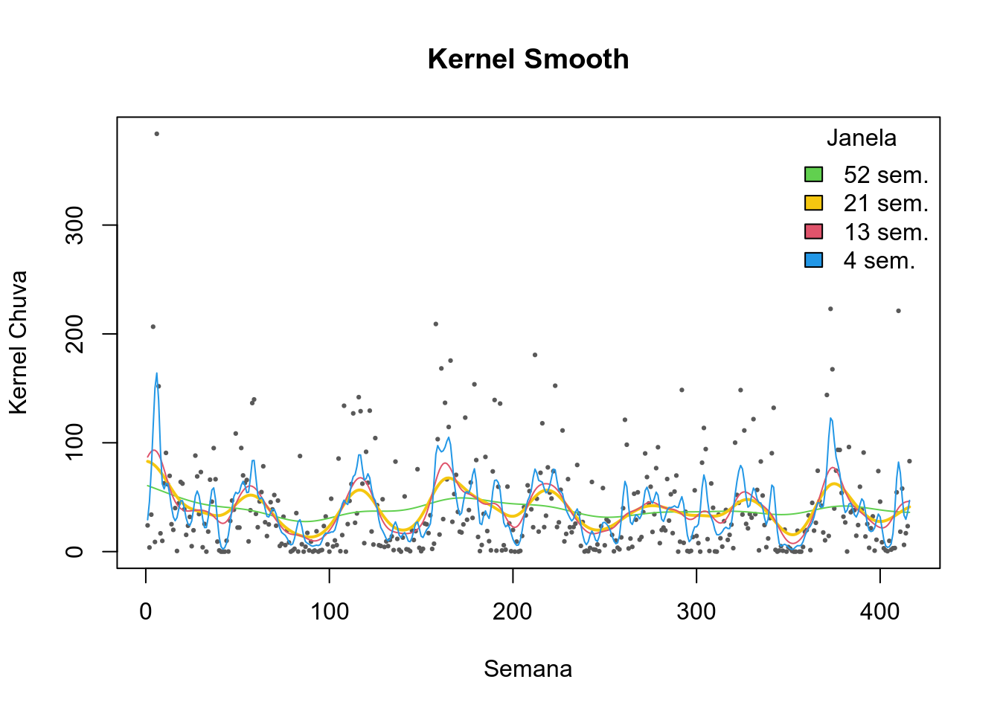

### Largura de Banda

Como estimar a largura de banda ?

-   Validação cruzada

$$CV(\lambda) = \frac{1}{n} \sum_{j=1}^n \left( y_i - \hat{f}_{\lambda(j)} (x_j) \right) ^2$$

-   O ponto deixado fora do ajuste a cada vez,

-   $\lambda$ o valor que minimiza essa equação.


```r
### efeito de borda
# exluindo os pontos 1 a 3 para forcar borda
lepto2 <- lepto[-c(1,2,3),]

hcv(lepto2$week, lepto2$totrain, display="lines")
```

[1] 6.129

```r
abline(v= 6.129356, col=2,lty=2)
```

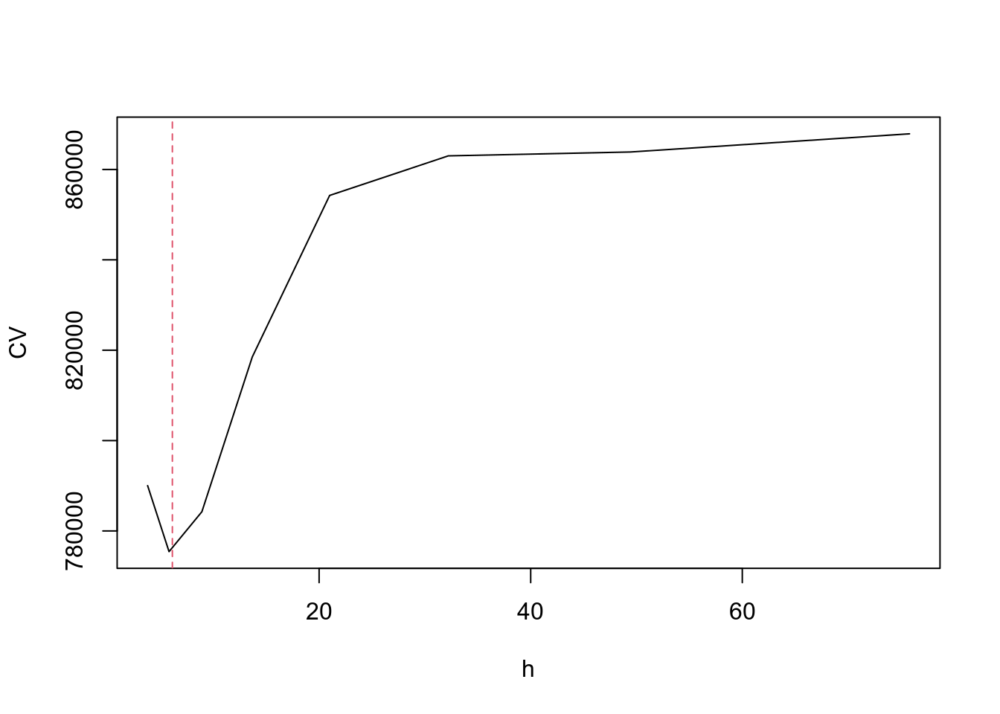


```r
plot(totrain ~ week, data=lepto2, cex=.3, pch=19,col="gray35",ylab="Kernel Chuva", xlab="Semana", 
  main="Kernel Smooth -- Efeito de Borda")
lines(ksmooth(lepto$week, lepto$totrain, kernel = "normal", bandwidth = 21 ), col=2)
lines(ksmooth(lepto2$week, lepto2$totrain, kernel = "normal", bandwidth = 6.1 ), col=1)
legend("topright",c("21 sem.","6 sem."),fill=c(2,1), title="Janela",bty="n")
```

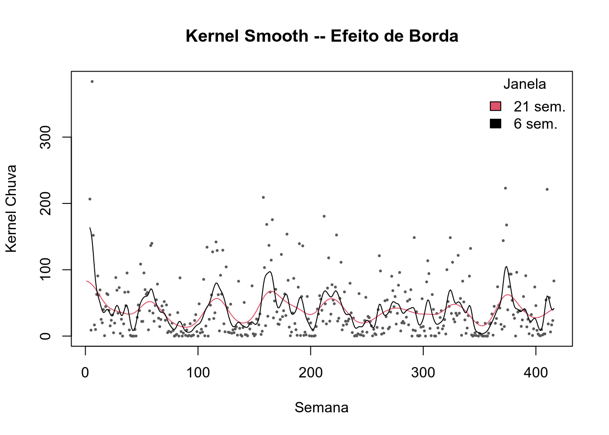

### Utilização do Kernel

-   Vantagens: simples, ótimo para análise exploratória.

-   Desvantagens: efeito de borda.

-   Muito sensível à largura de banda.

-   Escolha automática de largura de banda pode não ser o desejável.

-   Pouco sensível à forma da função, desde que suave.

## Loess / Lowess

-  _Loess_ (Locally Estimated Scatterplot Smoothing)  e _lowess_  (Locally Weighted Scatterplot Smoothing) são funções semelhante ao kernel, mas os valores são estimados a partir de uma regressão local ao invés da média ponderada.

-   No caso do *loess* a cada ponto do conjunto de dados um polinômio é ajustado utilizando uma reta a um sub-conjunto dos dados através de mínimos quadrados. 

- Já  para o *lowess*, é ajustada uma reta por mínimos quadrados **ponderados** de forma a dar maior peso aos pontos próximos.

-   O subconjunto dos dados é também denominado **janela**, **largura de banda** ou **parâmetro de suavização** e controla flexibilidade da função de regressão -- se a janela for igual ao total de pontos fica igual à regressão.

-   Quanto maior o tamanho da janela, maior o alisamento e vice-versa.

-   O grau do polinômio de cada regressão local em geral é baixo. Polinômio de primeiro grau é a regressão linear local; de segundo regressão quadrática.

-   A largura da janela é indicado por uma fração dos dados que varia de 0 a 1.

    -   Exemplo: largura 0,1 significa que a janela tem largura que equivale a 10% do eixo horizontal;

    -   Polinômio de grau 0 é a média móvel;

    -   Se a janela for de 100% dos pontos = média.

Existem varias funções que implementam o *loess/lowess* no R, por exemplo: `lowess()` e `loess()` .


```r
plot(lepto$week, lepto$totrain,cex=.3, pch=19, col="gray35",ylab="Lowess Chuva", xlab="Semana", main="Lowess - Bandwidth e Grau do Polinômio")
lines(lowess(lepto$totrain ~ lepto$week, f = 0.75),col=4)
lines(lowess(lepto$totrain ~ lepto$week, f = 0.015),col=2)
legend("topright",c("f=0.75","f=0.015"),col=c(4,2), title="",bty="n",lty=c(1,1))
```

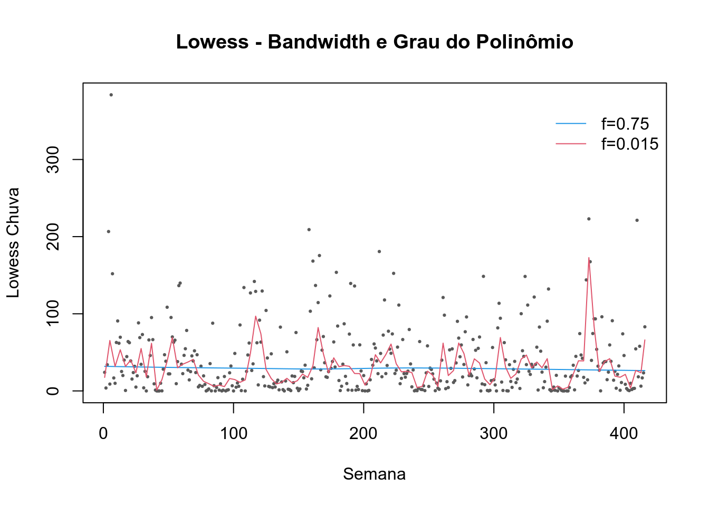


```r
# Loess – Span & Grau
plot(lepto$week, lepto$totrain,cex=.3, pch=19, col="gray35",ylab="Loess Chuva", xlab="Semana", main="Loess - Bandwidth e Grau do Polinômio")
lines(predict(loess(totrain ~ week , data=lepto,span = 0.75, degree = 2)),col=2)
lines(predict(loess(totrain ~ week , data=lepto,span = 0.75, degree = 1)),col=2,lwd=2,lty=2)
lines(predict(loess(totrain ~ week , data=lepto,span = 0.05, degree = 2)),col="darkblue")
lines(predict(loess(totrain ~ week , data=lepto,span = 0.05, degree = 1)),col="darkblue",lwd=2,lty=2)
legend("topright",c("75% - 2º","75% - Linear (default)","5% - 2º","5% - Linear"),lty=c(1,2,1,2), col=c(2,2,"darkblue","darkblue"), title="Janela e Grau",bty="n")
```

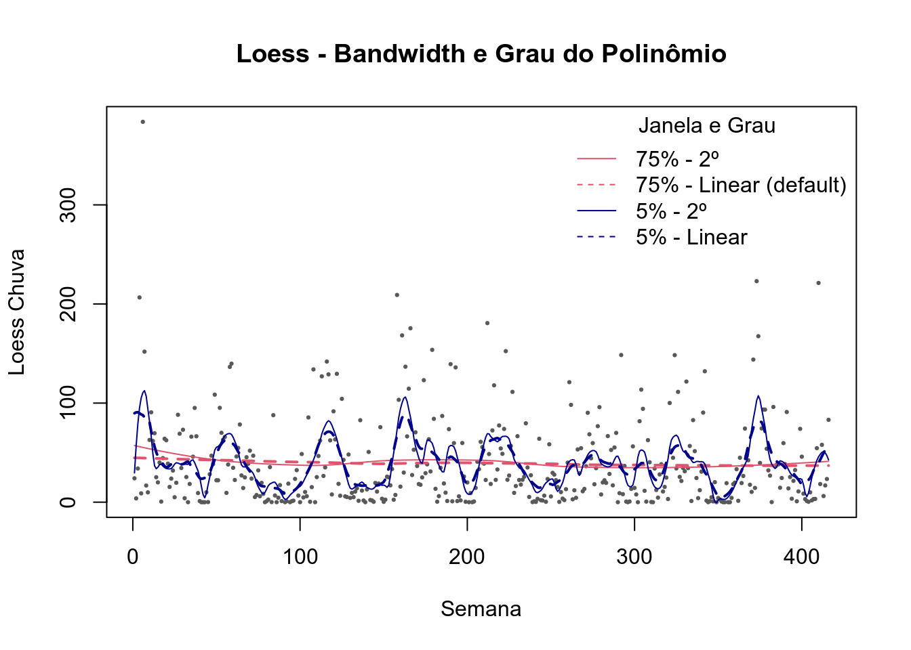


```r
# Loess – Span
# lowess - f 
plot(lepto$week, lepto$totrain,cex=.3, pch=19, col="gray35",ylab="Loess Chuva", xlab="Semana", main="Loess - Bandwidth")
lines(predict(loess(totrain ~ week , data=lepto,span = 0.15, degree = 2)),col=1, lwd=1.5)
lines(predict(loess(totrain ~ week , data=lepto,span = 0.05, degree = 2)),col=2, lwd=1.5)
lines(predict(loess(totrain ~ week , data=lepto,span = 0.10, degree = 2)),col="darkblue", lwd=1.5)
legend("topright",c("  5% (21 sem.)","10% (41 sem.)","15% (61 sem.)"),col=c(2,"darkblue",1), lty=c(1,1,1),title="Janela",bty="n")
```

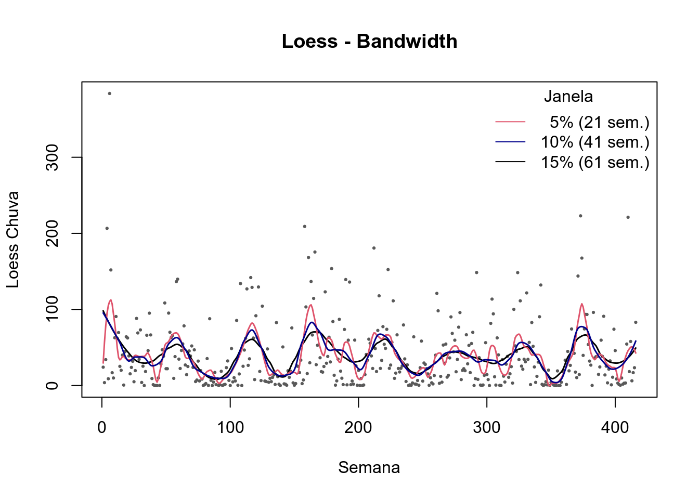


```r
# Loess – Span & Borda
plot(lepto$week, lepto$totrain,cex=.3, pch=19, col="gray35",ylab="Loess Chuva", xlab="Semana", main="Loess - Bandwidth")
lines(predict(loess(totrain ~ week , data=lepto2,span = 0.15, degree = 2)),col=1, lwd=1.5)
lines(predict(loess(totrain ~ week , data=lepto2,span = 0.05, degree = 2)),col=2, lwd=1.5)
lines(predict(loess(totrain ~ week , data=lepto2,span = 0.10, degree = 2)),col="darkblue", lwd=1.5)
legend("topright",c("  5% (21 sem.)","10% (41 sem.)","15% (61 sem.)"),col=c(2,"darkblue",1), lty=c(1,1,1),title="Janela",bty="n")
```

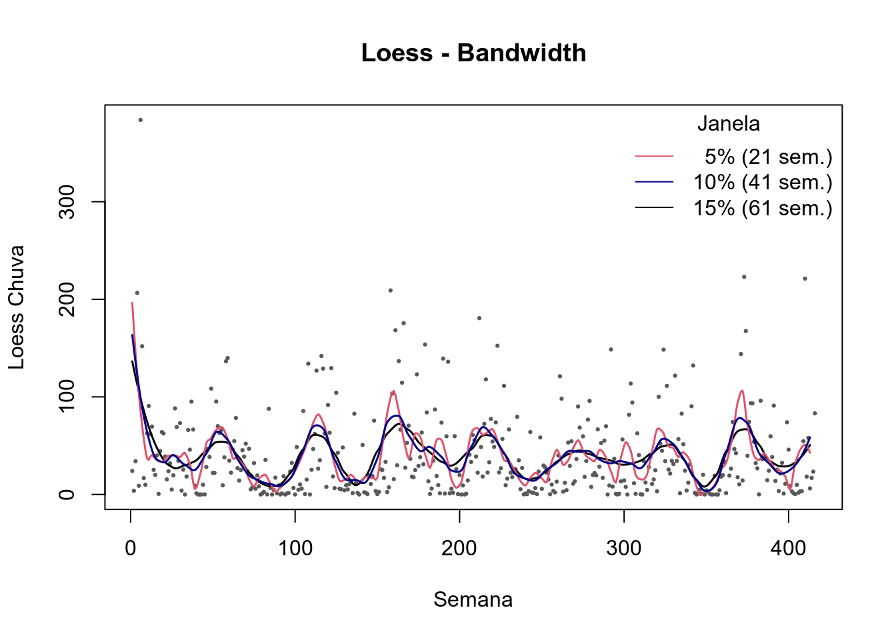


```r
# Loess – Outra forma, mas fica pouco suave
scatter.smooth(lepto$week, lepto$tempmed, span = .05, degree = 2, family =  "gaussian", 
               col= "darkgray", cex=.5, ylab="Temperatura", xlab="Semana")
```

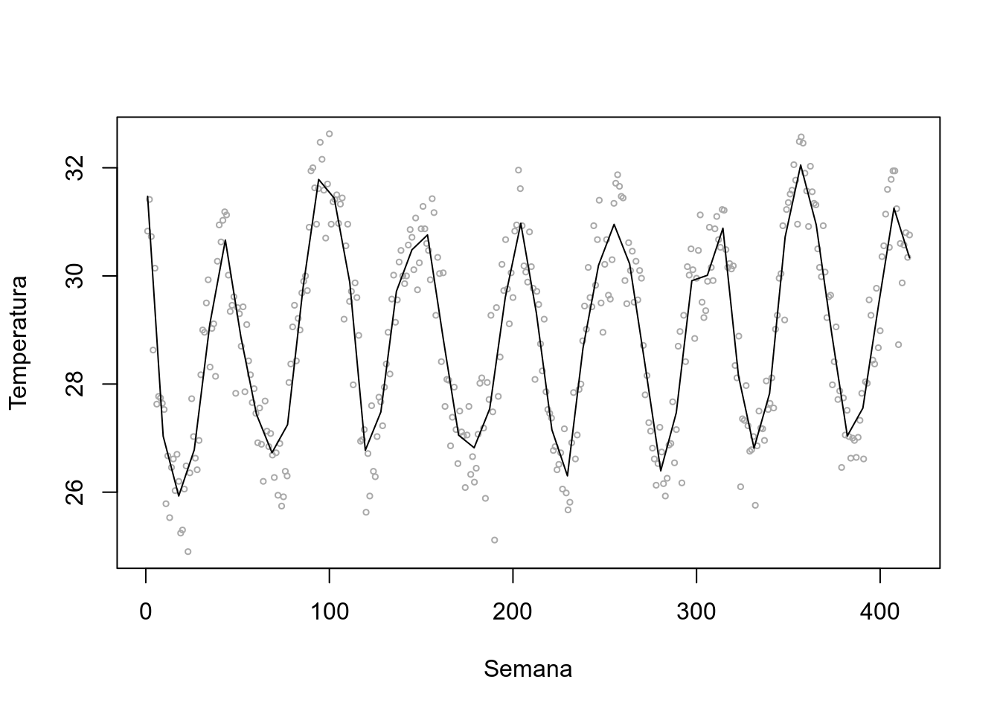

```r
scatter.smooth(lepto$week, lepto$totrain, span = .05, degree = 2, family =  "gaussian", 
               col= "darkgray", cex=.5, ylab="Chuva", xlab="Semana")
```

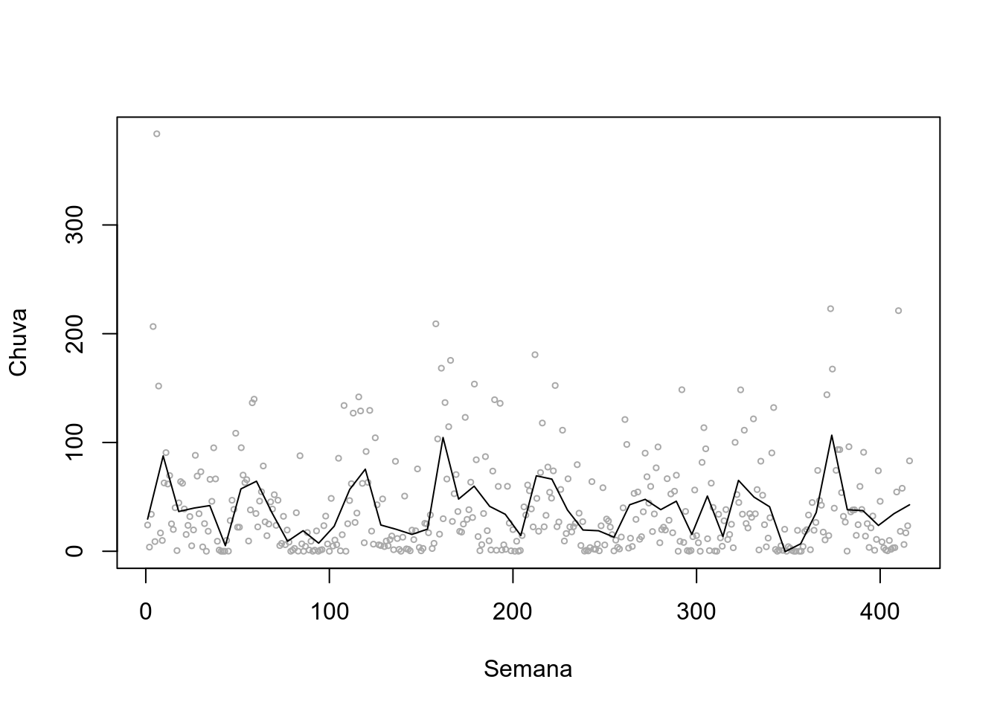

```r
scatter.smooth(lepto$week, lepto$cases, span = .05, degree = 2, family =  "gaussian", 
               col= "darkgray", cex=.5, ylab="Casos Leptospirose", xlab="Semana")
```


### Utilização do loess/lowess

-   Vantagens: simples, ótimo para análise exploratória.
  -   Menos sensível à borda.

-   Desvantagens: pode ser sensível a valores extremos.


### Comparando

<!-- {width=700px} -->

{width="7000px"}

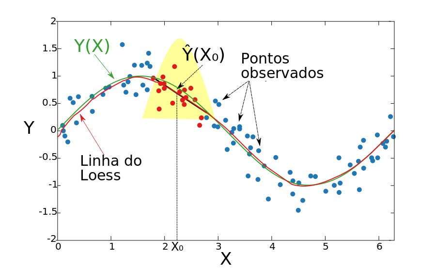{width="7000px"}

## Splines

-   Splines são um conjunto de funções polinomiais que possuem muitos usos. No nosso caso, estaremos usando como uma função de suavização que juntam nós, de forma suave, mantendo propriedades matemáticas ótimas. A mais usada para este fim é a regressão penalizada chamada *spline cúbica natural*, com nós em valores distintos de $x_i$.

- A escolha do parâmetro de suavização pode ser visual ou mais formal, quando a definição é dada pelo valor que minimiza o erro quadrático médio do ajuste, ou através de alguma forma de validação cruzada.

-   Na  regressão penalizada quer se encontrar a solução $\hat{f}(x)$ que minimize:

$$\sum\left[y_i - f(x_i) \right]^2 + \tau  \int f''(x)]^2 dx$$ sendo $\tau$ o parâmetro de alisamento:

 Se $\tau = 0 \Rightarrow \hat{f}(x)$ é interpolação pontual (conecta os pontos)
 
 Se $\tau = 1 \Rightarrow \hat{f}(x)$ é interpolação linear simples 

-   Se $\tau$ é muito grande $\Rightarrow \hat{f}(x)$ será tal que $f''(x)$ seja zero em todos os pontos, ou seja, mínimos quadrados.


### Splines *vs* Loess/Lowess

-   No _spline_ se minimiza uma função-objetivo explícita, é mais elegante matematicamente que _loess/lowess_.

-   O ajuste dos dois é muito semelhante para o mesmo número de graus de liberdade.

-   Pode-se ajustar essas funções para diversos preditores.


Existe uma forma mais complexa de spline mais complexo para splines (thin plate splines) que pode ser usada em modelos *GAM*. 

Ambas as funções podem também ser utilizadas no espaço.


```r
plot(lepto$week, lepto$cases, ylab="Casos Leptospirose", xlab="Semana", main = "spline(.) -- 3 methods")
lines(spline(lepto$week, lepto$cases, n=10 ), col = 2)
lines(spline(lepto$week, lepto$cases, n=10, method = "natural"), col = 3)
lines(spline(lepto$week, lepto$cases, n=10, method = "periodic"), col = 4)
legend("topright",c("Defaut","Natural","Periódico"),col=c(2,3,4), lty=c(1,1,1),title="Janela",bty="n")
```

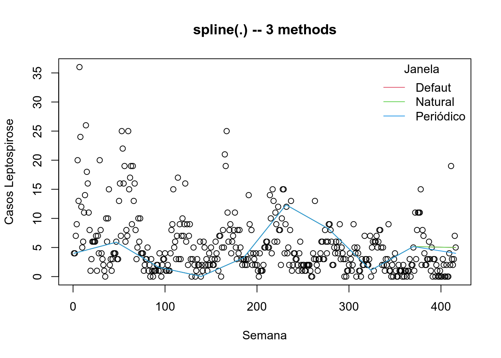


```r
lepto.spl <- smooth.spline(lepto$week, lepto$cases)
lepto.spl.cv <- smooth.spline(lepto$week, lepto$cases, cv =T)
plot(lepto$week, lepto$cases, cex=.6, col="darkgray", ylab="Casos Leptospirose", xlab="Semana")
lines(lepto.spl, col=1)
lines(lepto.spl.cv, col=5)
lines(smooth.spline(lepto$week, lepto$cases, df=10),col=3)
lines(smooth.spline(lepto$week, lepto$cases, df=50),col=4)
lines(smooth.spline(lepto$week, lepto$cases, df=2),col=2)
legend("topright",c("Sem CV","Com CV","df=10", "df=50", "df=2"),col=c(1,5,3,4,2), lty=c(1,1,1),title="Janela",bty="n")
```


<!-- ### Tipos de splines -->

<!-- - Cubic regression spline – polinômios de grau 3 ajustados aos -->

<!-- intervalos dos dados definidos pelos nós distribuı́dos regularmente em -->

<!-- todo o escopo dos dados. A base é a soma de nós mais 2, que -->

<!-- correspondem ao inı́cio e fim da curva. Os polinômios são unidos de -->

<!-- forma que a existir as 1 e 2 derivadas. -->

<!-- - Cyclic cubic regression spline – força a função a ter o mesmo valor e -->

<!-- mesmas derivadas no inı́cio e final. Interessante para séries de tempo -->

<!-- com sazonalidade. -->

<!-- - P-splines – Baseia-se na B-spline, na qual a função vai -->

<!-- obrigatoriamente a zero em m+3 nós adjacentes. A p-spline se baseia -->

<!-- nessa, porém aplica uma penalidade diferencial entre β’s adjacentes -->

<!-- para controlar a “wiggliness”. -->

<!-- - Thin plate – menor erro quadrático, menor número de parâmetros -->

<!-- considerado o estimador ótimo. Facilmente adaptável para duas/três -->

<!-- dimensões. -->

<!-- Tensor Product – Semelhante ao Thin Plate, mas permite escalas -->

<!-- | bs=  |    Descrição     | Vantagens                                                    | Desvantagens                                                 | -->

<!-- | :--: | :--------------: | ------------------------------------------------------------ | ------------------------------------------------------------ | -->

<!-- | "tp" |    Thin Plate    | Suaviza múltiplas covariáveis. Não se altera com a rotação. Estimador ótimo. | Computacionalmente custoso. Não é invariante quanto à escala. | -->

<!-- | "cr" | Cubic Regression | Computacionalmente barato. Parâmetros interpretáveis diretamente. | Só uma covariável. Baseado na escolha dos nós. Estimador não ótimo. | -->

<!-- | "cc" |    Cyclic CRS    | Começo e fim = 's                                            | Idem.                                                        | -->

<!-- | "ps" |    P-splines     | Qualquer combinação de base e ordem.                         | Nós em intervalos iguais. Penalidades difíceis de interpretar. Estimador não ótimo. | -->

<!-- ```{r, echo=T, warning=FALSE, results='asis', message = FALSE, out.width = "100%", fig.align = "center"} -->

<!-- ### Tipos de splines -->

<!-- library(mgcv) -->

<!-- rain.tp <- gam(totrain ~ s(week,bs="tp"), data=lepto ) -->

<!-- rain.ps <- gam(totrain ~ s(week,bs="ps"), data=lepto ) # -->

<!-- rain.cc <- gam(totrain ~ s(week,bs="cc"), data=lepto ) # -->

<!-- rain.cr <- gam(totrain ~ s(week,bs="cr"), data=lepto ) # -->

<!-- rain.ad <- gam(totrain ~ s(week,bs="ad"), data=lepto )  -->

<!-- ThinPlate  <- predict(rain.tp)   -->

<!-- P.spline <- predict(rain.ps)   -->

<!-- CubicRegression <- predict(rain.cr)   -->

<!-- CyclicCR <- predict(rain.cc)   -->

<!-- Adaptative <- predict(rain.ad)  -->

<!-- xyplot(Adaptative +CyclicCR  + CubicRegression+P.spline + ThinPlate~ week, -->

<!--  outer=TRUE, layout=c(1, 5), pch=19, cex=.2, ylab="", -->

<!--  scales=list(x=list(at=seq(0,416,52),relation='same'), y=list(relation="same")), data=lepto) -->

<!-- ``` -->

<!-- ```{r, echo=T, warning=FALSE, results='asis', message = FALSE, out.width = "100%", fig.align = "center"} -->

<!-- par(mfrow=c(5,1),mai=c(0.2,0.5412 ,0.5412,0.05),mgp=c(2,.5,0)) -->

<!-- plot(rain.tp,shade=TRUE,ylab="TP",xlab="",residuals=F,xaxp=c(0,416,8),main="Chuva", pch=19, cex=.2, xaxt="n") -->

<!-- plot(rain.ps,shade=TRUE,main="",ylab="PS",xlab="",residuals=F,xaxp=c(0,416,8),  pch=19, cex=.2,  xaxt="n") -->

<!-- plot(rain.cr,shade=TRUE,main="",ylab="CC",xlab="",residuals=F,xaxp=c(0,416,8),  pch=19, cex=.2,  xaxt="n") -->

<!-- plot(rain.cc,shade=TRUE,main="",ylab="CC",xlab="",residuals=F,xaxp=c(0,416,8),  pch=19, cex=.2,  xaxt="n") -->

<!-- plot(rain.ad,shade=TRUE,main="",ylab="Adaptative",xlab="",residuals=F,xaxp=c(0,416,8),  pch=19, cex=.2) -->

<!-- temp.tp <- gam(tempmed ~ s(week,bs="tp",k=52), data=lepto)  -->

<!-- temp.ps <- gam(tempmed ~ s(week,bs="ps",k=52), data=lepto ) # -->

<!-- temp.cc <- gam(tempmed ~ s(week,bs="cc",k=52), data=lepto ) -->

<!-- par(mfrow=c(3,1),mai=c(0.05,0.5412 ,0.5412,0.05),mgp=c(2,1,0)) -->

<!-- plot(temp.tp,shade=TRUE,ylab="TP",xlab="",xaxp=c(0,416,8) , main="Temperatura", cex=2) -->

<!-- plot(temp.ps,shade=TRUE,main="",ylab="PS",xlab="",xaxp=c(0,416,8), cex=2) -->

<!-- plot(temp.cc,shade=TRUE,main="",ylab="CC",xlab="",xaxp=c(0,416,8), cex=2) -->

<!-- cases.tp <- gam(cases ~ s(week,bs="tp",k=52), data=lepto ) #ciclica -->

<!-- cases.ps <- gam(cases ~ s(week,bs="ps",k=52), data=lepto ) # -->

<!-- cases.cc <- gam(cases ~ s(week,bs="cc",k=52), data=lepto) -->

<!-- par(mfrow=c(3,1),mai=c(0.05,0.5412 ,0.5412,0.05),mgp=c(2,1,0)) -->

<!-- plot(cases.tp,shade=TRUE,ylab="TP",xlab="",xaxp=c(0,416,8), main="Casos", cex=2) -->

<!-- plot(cases.ps,shade=TRUE,main="",ylab="PS",xlab="",xaxp=c(0,416,8), cex=2) -->

<!-- plot(cases.cc,shade=TRUE,main="",ylab="CC",xlab="",xaxp=c(0,416,8), cex=2) -->

<!-- ``` -->

## Exercícios Propostos

1)  Seja $Z_t$ [*(temperaturaNY.csv)*](https://gitlab.procc.fiocruz.br/oswaldo/eco2019/raw/master/dados/temperaturaNY.csv) uma série temporal referente às médias anuais das temperaturas na cidade de Nova York durante os anos de 1912 e 1971. Utilize e discuta alguns métodos de transformação e/ou suavização para descrever a série.

2)  Faça o mesmo com a série de dengue nas Filipinas [*(denguecases2.csv)*](https://gitlab.procc.fiocruz.br/oswaldo/eco2019/raw/master/dados/denguecases2.csv)

Verifique as séries com atenção e veja como será a melhor maneira de ler e transformar o dado em ST. Lembre-se que no windows você talvez precise precisar rodar o código:

``` {.r}
options(url.method="libcurl")
scan.win <- function(x) {scan(url(x,method = 'libcurl'))}
```

## Bibliografia sugerida

Faraway, J.J. Extending the Linear Model with R. Chapman & Hall/CRC Texts in Statistical Science Series, 2006.

Hastie, T.; Tibshirani, R. Generalised Additive Models. Chapman & Hall, 1990.

Wood, S.N. Generalized Additive Models: An Introduction with R. Chapman & Hall/CRC Texts in Statistical Science Series, 2006.

Venables, W.N. & Ripley, B.D. Modern Applied Statistics with S. (MASS) Fourth Edition 2002


# Modelagem em Séries Temporais


## O que são os Modelos Box & Jenkins 

A abordagem de Box-Jenkins para a modelagem dos processos ARIMA foi descrita num livro publicado por George Box e Gwilym Jenkins em 1970. 

```
BOX, G.E.P. and G.M. JENKINS (1970) 
Time series analysis: Forecasting and control, San Francisco: Holden-Day.
```

O método criado por  Box & Jenkins envolve a identificação de um processo ARIMA (modelos autorregressivos, integrados e de médias móveis) adequado, ajustando-o aos dados e, uma vez ajustados permite também utilizar esses modelos para a descrição e/ou previsão (*forecast*).


Uma das características atraentes da abordagem Box-Jenkins é que os processos ARIMA são uma classe muito rica de modelos  e geralmente é possível encontrar um modelo que forneça uma descrição adequada dos dados. Ajustam simultaneamente tendência, sazonalidade, ciclicidade e estrutura de dependência serial. 


- A dependência serial é a influência que um dado evento no tempo recebe de pontos anteriores.

- O processo de modelagem **B&J** é feito em um ciclo iterativo de 3 estágios (repetido até o ajuste do modelo mais adequado):

    i) **Identificação** - análise exploratória, baseada em gráficos dos dados brutos, autocorrelação, autocorrelação parcial, buscando identificar o tipo de modelo + adequado;
    
    ii) **Estimação** - estimativa de termos e parâmetros e seleção do "*melhor modelo*";

    iii) **Diagnóstico** - critérios de ajuste, parcimônia.
    

## Alguns processos estocásticos

- **Processo aleatório (ruido branco)**: sequência de variáveis aleatórias ($a_t$) que são mutuamente independentes e identicamente distribuídas. Possui média e variância constantes e os coeficientes de autocorrelação são iguais a:

$$ \rho_{h} = \left\{ \begin{array}{rc} 1, &\mbox{se} \quad h = 0, \\  0 , &\mbox{se} \quad h = \pm 1, \pm 2, ... \end{array}\right.$$

- **Passeio aleatório (random walk)**: Denomina-se passeio aleatório quando a variável aleatória $Z_t$ é igual à $Z_{t-1}$ mais um erro aleatório $\rightarrow$ $Z_t = Z_{t-1} + a_t$.

    - Quando $t = 0 \rightarrow Z_1 = a_1$, logo $$Z_t = \sum_{t}^{i=1} a_i$$


## Modelo ARIMA 

Na análise de séries temporais, um Modelo Autorregressivo Integrado de Médias Móveis (*Autoregressive Integrated Moving Average* ou **ARIMA**, na sigla em inglês) é uma generalização de um Modelo Autorregressivo de Médias Móveis (**ARMA**). Ambos os modelos são ajustados aos dados da série temporal para entender melhor os dados ou para prever pontos futuros na série. Modelos ARIMA são aplicados em alguns casos em que os dados mostram evidências de não estacionariedade, em que um passo inicial de diferenciação (correspondente à parte "integrada" do modelo) pode ser aplicado uma ou mais vezes para eliminar a não estacionariedade.


Temos então:

- **AR (Autorregressivo)**: avalia a relação entre os períodos (*lags*) através da autocorrelação, ou seja, indica que a variável de interesse é "regressada" em seus próprios valores defasados, isto é, anteriores. O objetivo de desse modelo e extrair essa influência.

- **I (Integrated)**: Aplica a diferenciação, se necessária, ou seja, indica que os valores de dados foram substituídos com a diferença entre seus valores. E os valores anteriores e este processo diferenciador pode ter sido realizado mais de uma vez.

- **MA (Moving Average)**: Indica que o erro de regressão é na verdade uma combinação linear dos termos de erro, cujos valores ocorreram contemporaneamente e em vários momentos no passado, ou seja, avalia os erros entre períodos e extrai estes erros (não tem relação com MA usados para suavização da ST). 

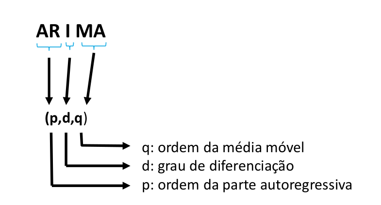{width=400px}


- **p** é a ordem (número de defasagens) do modelo autorregressivo;

- **d** é o grau de diferenciação (o número de vezes em que os dados tiveram valores passados subtraídos);

- **q** é a ordem do modelo de média móvel.

Exemplos:

| Parâmetro | Descrição                                                                                         |
|-----------|---------------------------------------------------------------------------------------------------|
| $p = 1$   | Significa que uma determinada observação pode ser explicada pela observação prévia + erro         |
| $p = 2$   | Significa que uma determinada observação pode ser explicada por duas observações prévias + erro   |
| $d = 0$   | Significa que não é aplicada a diferenciação                                                          |
| $d = 1$   | Significa que será aplicada diferenciação de primeira ordem                                       |
| $d = 2$   | Significa que será aplicada diferenciação de segunda ordem                                        |
| $q = 1$   | Significa que uma determinada observação pode ser explicada pelo erro da observação prévia        |
| $q = 2$   | Significa que uma determinada observação pode ser explicada pelo erro de duas observações prévias |


|         ARIMA         |                     Descrição                     |
|:---------------------:|:-------------------------------------------------:|
| AR(1) ou ARIMA(1,0,0) | Apenas elemento autorregressivo, de $1^{a}$ ordem |
| AR(2) ou ARIMA(2,0,0) | Apenas elemento autorregressivo, de $2^{a}$ ordem |
| MA(1) ou ARIMA(0,0,1) | Apenas Média Móvel                                |
| ARMA(1,1)             | Autorregressão e média móvel de $1^{a}$ ordem     |


### Modelo Autorregressivo de ordem *p* - AR(p) ou ARIMA(p,0,0)

Supondo que a variável aleatória $Z_t$ é linearmente correlacionada com seus próprios valores defasados, este é um modelo autorregressivo geral de ordem *p*.

$$Z_t = c + \phi_1 Z_{t-1} + \phi_2 Z_{t-2} + ... + \phi_p Z_{t-p} + a_t$$, sendo $t=1,2,...,p$.

- O objetivo é estimar:

    - a constante *c* - média do processo ou intercepto
    
    - a ordem *p* do modelo - até onde vai a dependência
    
    - os parâmetros $\phi$ de cada termo - peso de cada ponto passado na determinação do ponto *t*

- Para estimar os parâmetros $\phi$ de um AR, a estacionariedade de $1^a$ e $2^a$ ordens são fundamentais !!!


| Processo |                            Modelo                            |
| :------: | :----------------------------------------------------------: |
|  AR(1)   |                $$Z_t = c + \phi_1 Z_{t-1} + a_t$$                |
|  AR(2)   |       $$Z_t = c + \phi_1 Z_{t-1} + \phi_2 Z_{t-2} + a_t$$        |
| $\dots$  |                           $\dots$                            |
|  AR(p)   | $$Z_t = c + \phi_1 Z_{t-1} + \phi_2 Z_{t-2} + ... + \phi_p Z_{t-p} + a_t$$ |


### Condições de estacionariedade

Uma série é estacionária quando suas propriedades não variam ao longo do tempo. Em um processo AR, a estacionariedade se reflete na estimação dos parâmetros:

  - No caso AR(1) basta que $|\phi_1| < 1$ para que o processo seja estacionário.
    
  - No caso AR(2):
    
      - $|\phi_2|< 1$ 
        
      - $\phi_2 + \phi_1 < 1$ 
        
      - $\phi_2 - \phi_1 < 1$ 


### Modelo de Médias Móveis de ordem *q* - MA(q) ou ARIMA(0,0,q)

Independente do processo autorregressivo, cada elemento da série pode também ser afetado pelo erro passado - processo "Médias Móveis". Neste caso, o valor de $Z_t$ depende de valores do componente aleatório em pontos anteriores (usa-se a denominação choque aleatório).

 $$Z_t = C + a_t - \theta_1 a_{t-1} - \theta_2 a_{t-2} - ... - \theta_p a_{t-q}$$

- Por convenção os termos em *a* são escritos com sinais negativos.

- Cada observação é a soma de um componente aleatório $a_t$ e uma combinação dos componentes aleatórios anteriores.

- O modelo pode ser escrito baseado nas defasagens (informações passadas) do ruído branco.

| Processo |                            Modelo                            |
| :------: | :----------------------------------------------------------: |
|  MA(1)   |                $$Z_t = c + a_t - \theta_1 a_{t-1}$$                |
|  MA(2)   |       $$Z_t = c + a_t - \theta_1 a_{t-1} - \theta_2 a_{t-2}$$        |
| $\dots$  |                           $\dots$                            |
|  MA(q)   | $$Z_t = c + a_t - \theta_1 a_{t-1} - \theta_2 a_{t-2} - ... - \theta_p a_{t-q} + a_t$$ |


### Condições de invertibilidade

- No modelo MA não há restrição sobre os $\theta$'s para que o processo seja estacionário, mas é necessário garantir a invertibilidade.

- Existe uma dualidade entre processos médias móveis e autorregressivo, onde a equação de MA pode ser reescrita na forma AR (de ordem infinita). Se isso for possível, podemos dizer que o processo é invertível, ou seja, se puder utilizar um AR(p) para explicar um MA(q).

- Mas, para isso algumas condições devem ser satisfeitas:

    - No caso MA(1) basta que $|\theta| < 1$ para que o processo é invertível.
    
    - No caso MA(2):
    
         - $|\theta_2|< 1$ 
         
         - $\theta_2 + \theta_1 < 1$ 
         
         - $\theta_2 - \theta_1 < 1$ 


### Modelo Autorregressivo de Médias Móveis de ordem *p* e *q* - ARMA(p,q) ou ARIMA(p,0,q)

A importância de um modelo ARMA está no fato de poder descrever uma série estacionária por um modelo que envolve menos parâmetros que um MA puro ou um AR puro.

$$Z_t = c + \phi_1 Z_{t-1} + \phi_2 Z_{t-2} + ... + \phi_p Z_{t-p} + a_t - \theta_1 a_{t-1} - \theta_2 a_{t-2} - ... - \theta_p a_{t-q}$$

- Cada observação é definida por combinação linear de observações anteriores e combinação de componentes aleatórios anteriores.

- Neste modelo misto, as duas condições - **estacionariedade** e **invertibilidade** - são necessárias.


| Processo |                            Modelo                            |
| :------: | :----------------------------------------------------------: |
|  ARMA(1,1)   |                $$Z_t = c + \phi_1 Z_{t-1} + a_t - \theta_1 a_{t-1}$$                |
|  ARMA(2,2)   |       $$Z_t = c + \phi_1 Z_{t-1} + \phi_2 Z_{t-2} + a_t - \theta_1 a_{t-1} - \theta_2 a_{t-2}$$        |
| $\dots$  |                           $\dots$                            |
|  ARMA(p,q)   | $$Z_t = c + \phi_1 Z_{t-1} + \phi_2 Z_{t-2} + ... + \phi_p Z_{t-p} + a_t - \theta_1 a_{t-1} - \theta_2 a_{t-2} - ... - \theta_p a_{t-q}$$ |


- No caso ARMA(1,1), o processo será estacionário se $|\phi_1| < 1$ e $|\theta_1| < 1$, respectivamente. 


### Modelo Autorregressivo Integrado de Médias Móveis de ordem *p*, *d* e *q* - ARIMA(p,d,q) 

Neste modelo se utiliza o método de diferenças para obter a estacionariedade da série. Também chamado de **operador de deslocamento (backshift)**.

 $$W_t = \bigtriangledown Z_t = (1-B)Z_t = Z_t - Z_{t-1}$$

O modelo então passa a ser:

$$W_t = \phi_1 W_{t-1} + ... + \phi_p W_{t-p} + a_t - \theta_1 a_{t-1} - ... - \theta_q a_{t-q}$$

$$\phi(B)W_t = \theta(B)a_t$$

$$\phi(B)(1-B)^d Z_t = \theta(B)a_t$$

Assim, se a série for estacionária, podemos representá-la por um modelo ARMA(p,q). 

A figura abaixo mostra a série não estacionária antes e após diferenciação - $d(1)$

  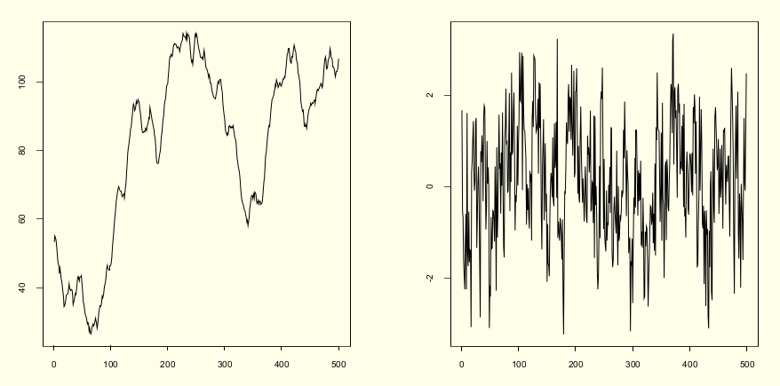{width=80%} 

A figura abaixo mostra a ACF antes e após a diferenciação:

 {width=80%} 

### Resumo - Modelos ARIMA não sazonais 

Resumindo, os modelos ARIMA não sazonais são geralmente denotados como ARIMA(p,d,q), em que os parâmetros **p,d,q** são números inteiros não negativos.

- Robusto: Pode ser usado em praticamente qualquer tipo de ST

- Dados estáveis, com poucos outliers

- Requer dados estacionários: pode ser transformada usando diferenciação: remove tendências

- Subtrai a observação do período atual do período anterior

- A diferenciação pode ser feita 1x: diferenciação de primeira ordem

- Ou pode ser necessário uma segunda vez: diferenciação de segunda ordem (mais raro)

---

## Modelos ARIMA sazonais (SARIMA) - $ARIMA(p,d,q)(P,D,Q)_m$

- Em epidemiologia é comum observar sazonalidadenos dados. Ou seja, considerando medidas mensais, pode-se esperar que a série dependa também dos termos $Z_{t-12}$ e talvez $Z_{t-24}$.

$$\phi(B) \Phi(B^s)\bigtriangledown_{s}^{D} \bigtriangledown^{d}Z_t = C + \theta(B) \Theta(B^s) a_t$$


| $\phi(B) \Phi(B^s)\bigtriangledown_{s}^{D} \bigtriangledown^{d}Z_t$ | $C + \theta(B) \Theta(B^s) a_t$                              |
| ------------------------------------------------------------ | ------------------------------------------------------------ |
| AR(p) *backshift* x AR(P) sazonal *backshift* sazonal x diferenciação sazonal x diferenciação x tendência $Z_t$ | Média do processo + MA(q) *backshift* x MA(Q) sazonal *backshift* sazonal x erro aleatório |


São geralmente denotados como $ARIMA(p,d,q)(P,D,Q)_{m}$, em que:

- **m** se refere ao número de períodos em cada temporada;

- **P, D e Q** se referem aos termos de autorregressão, diferenciação e média móvel para a parte sazonal do modelo ARIMA.


## Função de Autocorrelação Parcial (FACP) - (*Partial Autocorrelation Function - PACF*)

- A correlação medida diretamente em $t-1$, $t-2$ até $t-p$ é a função de autocorrelação.

- Uma outra ferramenta utilizada no processo de identificação do modelo é a **Função de Autocorrelação Parcial (FACP)**.  Esta medida corresponde a correlação de $Z_t$ e $Z_{t-h}$ removendo o efeito dos pontos intermediários $Z_{t-1}, Z_{t-2}, \dots , Z_{t-h+1}$  e é denotada por $\rho_{h}$.

- Ou seja, PACF é a correlação da série temporal com um atraso de si mesmo porém com a dependência linear de todos os desfasamentos entre eles removidos.

$$\rho_{kk} = Corr(X_t, X_{t-l}|X_{t-1}, X_{t-2},\dots,X_{t-h+1})$$

\

Segue abaixo um exemplo um exemplo de ACF, com já vimos anteriormente, e do PACF. Observe que há duas linhas horizontais que representam os limites do teste de significância sendo que valores acima ou abaixo da linha são estatisticamente significantes.


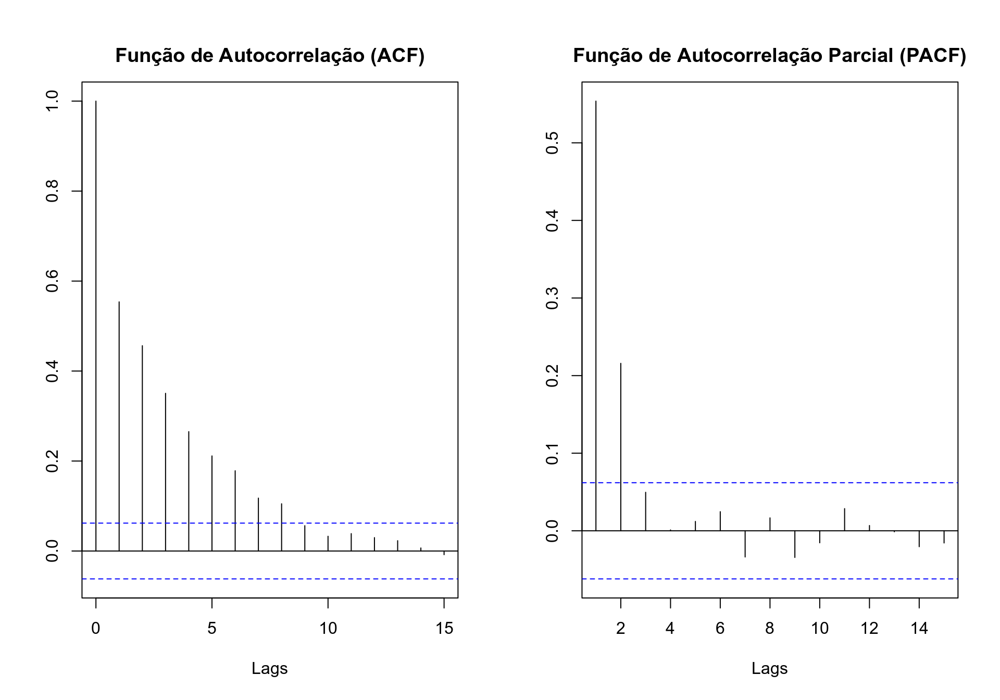

- No $lag = 1$, a ACF e a PACF são iguais.

- Na PACF somente existe correlação até o lag igual a ordem do modelo AR - ex: modelo de ordem 3 somente
apresenta valores de PACF até o $3^o$ lag.

- As formas gráficas do ACF e PACF servem para definir valores de *p* e *q*. Olhando para os correlogramas, podemos determinar que tipo de modelo selecionar e quais serão os valores de *p*, *d* e *q*.

| Modelo    | Padrão do ACF                                                | Padrão do PACF                                        |
| --------- | ------------------------------------------------------------ | ----------------------------------------------------- |
| AR(p)     | Decaimento exponencial ou padrão de onda senoidal amortecida ou ambos | Picos significantes através de primeiros lags         |
| MA(q)     | Picos significantes através de primeiros lags                | Decaimento exponencial ou padrão em forma de senoides |
| ARMA(1,1) | Decaimento exponencial a partir do lag 1                     | Decaimento exponencial a partir do lag 1              |
| ARMA(p,q) | Decaimento exponencial                                       | Decaimento exponencial                                 |

## Processo de Modelagem

Para a construção do modelo podemos seguir o seguinte roteiro no qual a escolha da estrutura do modelo é baseado nos próprios dados:

1) Identifica-se um modelo com base na análise de autocorrelações, autocorrelações parciais e outros critérios;

2) Estima-se os parâmetros do modelo identificado;

3) Verifica-se se o modelo ajustado é adequado aos dados através de uma análise de resíduos.

4) Caso o modelo não seja adequado o roteiro é repetido, voltando à fase de identificação do modelo.


- Como definir valores de p, d e q ?

 - **p**: ordem da parte autoregressiva – PACF

 - **d**: grau de diferenciação – Teste de Estacionariedade

 - **q**: ordem da média móvel – ACF


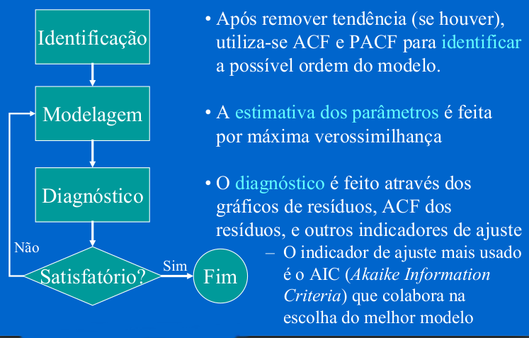{width=1270px}

## Processo de Identificação

{width=1270px}

- Esse processo pode ser extremamente difícil, mesmo para experientes. E nem sempre o modelo mais sugestivo é o melhor.

- Existem vários critérios para identificação de um modelo, por isso, é possível identificar modelos diferentes dependendo do critério que foi escolhido para identificação.

- Testar todas as combinações possíveis dos parâmetros $p,d,q$ do modelo ARIMA seria uma boa ideia, mas isso pode ser um pouco demorado se for feito de forma manual.


### Simulando os dados das ST com estruturas ARIMA


Simulando um processo AR(1)


```r
# Simulando 100 observações através de um processo AR(1) com média 30
ar.sim<-arima.sim(model=list(ar=.9),n=200, mean = 30)

# Construindo o gráfico de ST
ts.plot(ar.sim)
```

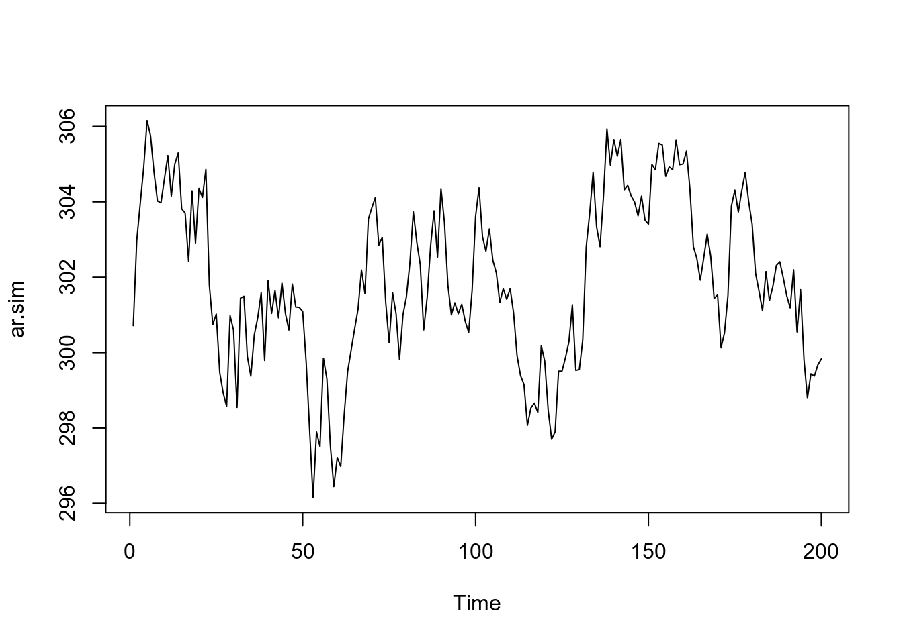

```r
# ACF e PACF
par(mfrow=c(1,2))
ar.acf <- acf(ar.sim,type="correlation",plot=T)
ar.pacf <- acf(ar.sim,type="partial",plot=T)

plot(ar.acf)
plot(ar.pacf)
```

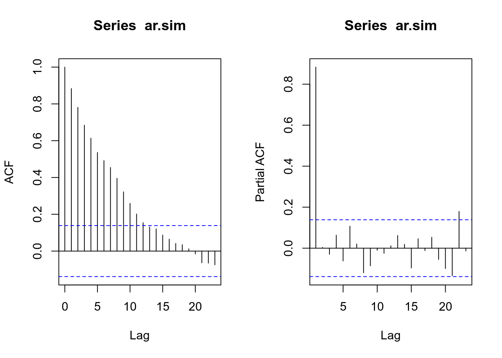

Simulando um processo AR(2)


```r
# Simulando 100 observações através de um processo AR(2) com média 30
ar.sim <- arima.sim(model=list(ar=c(.9,-.2)),n=200, mean = 30)

# Construindo o gráfico de ST
ts.plot(ar.sim)
```

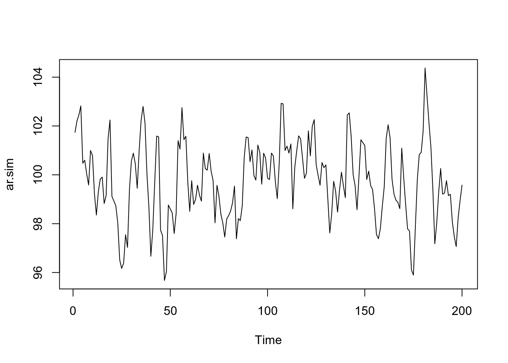

```r
# ACF e PACF
par(mfrow=c(1,2))
ar.acf <- acf(ar.sim,type="correlation",plot=T)
ar.pacf <- acf(ar.sim,type="partial",plot=T)

plot(ar.acf)
plot(ar.pacf)
```

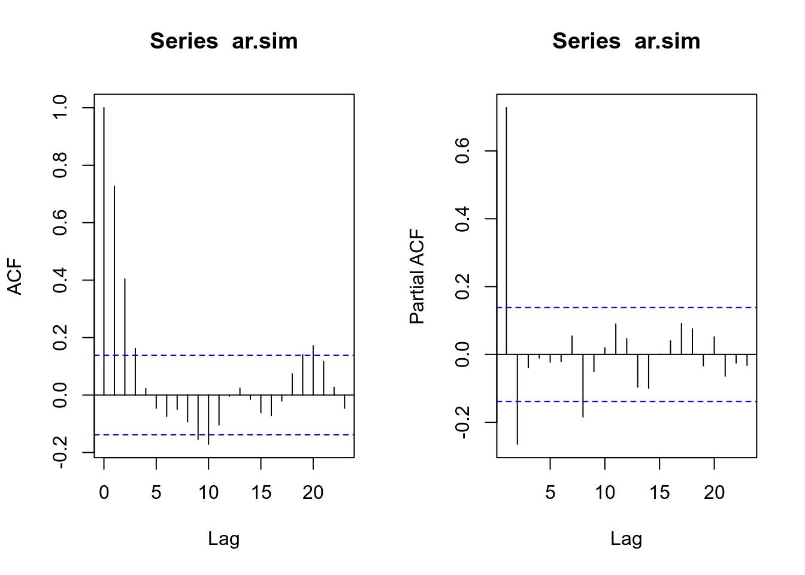

Simulando um processo MA(2)


```r
# Simulando 200 observações através de um processo MA(2) com média 30
ma.sim <- arima.sim(model=list(ma=c(-.7,.1)),n=200, mean = 30)

# Construindo o gráfico de ST
ts.plot(ma.sim)
```

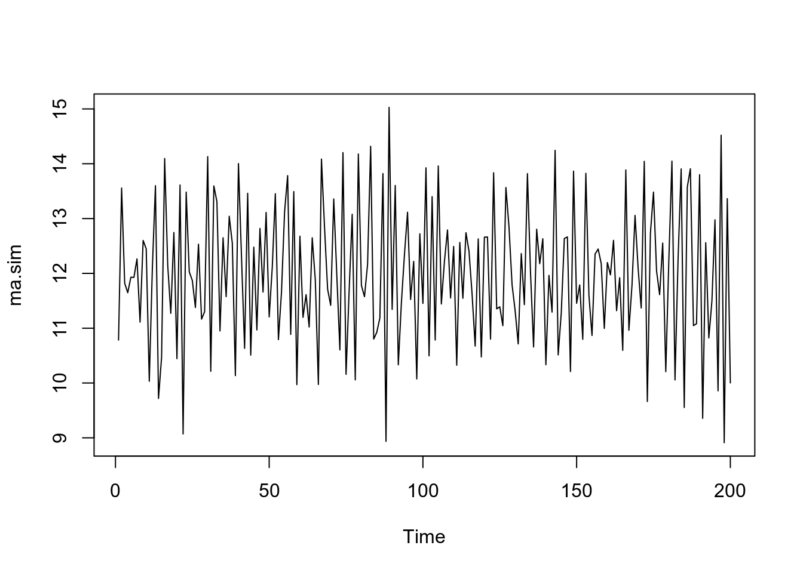

```r
# ACF e PACF
par(mfrow=c(1,2))
ma.acf <- acf(ma.sim,type="correlation",plot=T)
ma.pacf <- acf(ma.sim,type="partial",plot=T)

plot(ma.acf)
plot(ma.pacf)
```

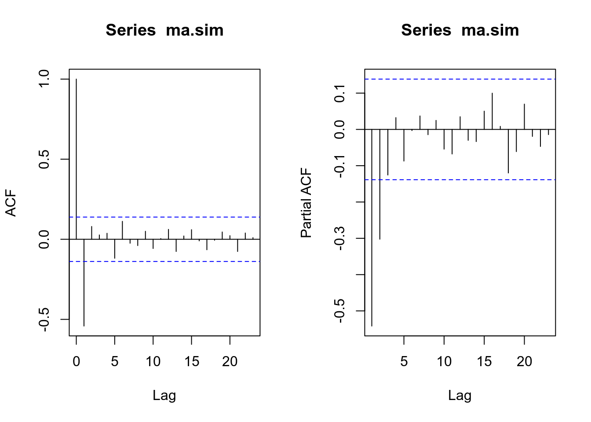

Simulando um processo ARMA(2,2)


```r
# Simulando 200 observações através de um processo ARMA(2,2) com média 30
arma.sim <-arima.sim(model=list(ar=c(.9,-.2),ma=c(-.7,.1)),n=200, mean = 30)

# Construindo o gráfico de ST
ts.plot(arma.sim)
```

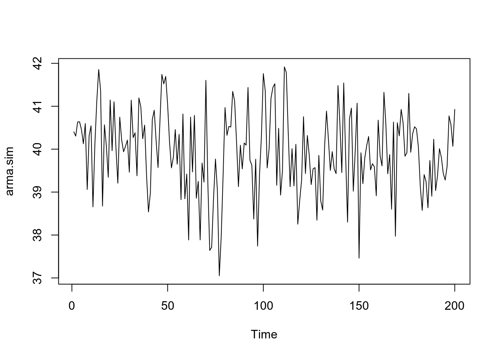

```r
# ACF e PACF
par(mfrow=c(1,2))
arma.acf <- acf(arma.sim,type="correlation",plot=T)
arma.pacf <- acf(arma.sim,type="partial",plot=T)

plot(arma.acf)
plot(arma.pacf)
```

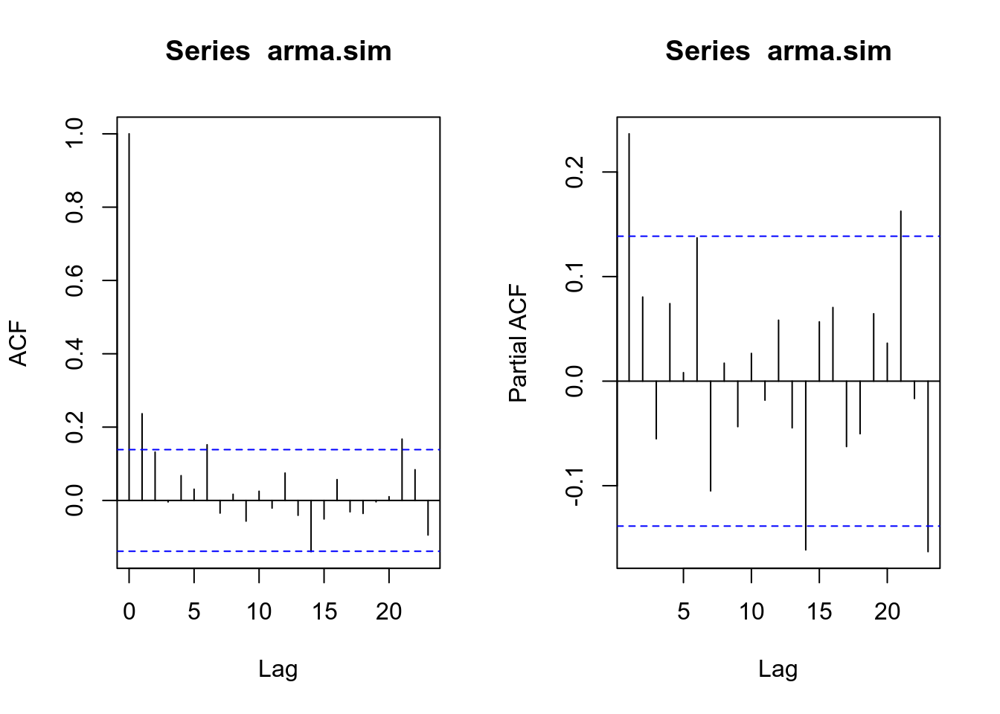

## Métricas para avaliar a qualidade do ajuste

- Para determinar a ordem de um modelo ARIMA não sazonal, um critério útil é o **critério de informação de Akaike (AIC)**.

$$AIC = - 2log(L) + 2(p+q+k+1)$$

em que *L* é verossimilhança dos dados, *p* é a ordem da parte autoregressiva e *q* é a ordem da parte de média móvel. O parâmetro *k* neste critério é definido como o número de parâmetros no modelo sendo ajustado aos dados.

- O **AIC corrigido para modelos ARIMA (AICc)** pode ser escrito como:

$$AICc = AIC + \dfrac{2(p+q+k+1)(p+q+k+2)}{T-p-q-k-2}$$

- O **critério de informação bayesiano (BIC)** pode ser escrito como:

   $$BIC = AIC + (log(n) - 2) (p+q+k+1)$$


- O objetivo é o minimizar os valores de AIC, AICc e BIC para um bom modelo. Quanto menor o valor de um destes critérios para uma gama de modelos investigados, melhor o modelo se adequará aos dados.

- O AICc pode ser usado apenas para comparar modelos ARIMA com as mesmas ordens de diferenciação. Para modelos ARIMA como ordens distintas de diferenciação, a raiz do erro quadrático médio pode ser usada para comparação de modelos.

- A abordagem do BIC penaliza mais intensamente os modelos por levar em consideração o $n$.


## Análise de Resíduos

Se o modelo está correto, as nossas suposições iniciais feitas para os resíduos devem ser satisfeitas, isto é, $a_t \sim N(0, \sigma^{2}_{a})$ e independentes.

Assim, a análise de resíduos é feita da seguinte forma:

1) Faz-se um gráfico da série $a_t$ e observa-se a sua estacionariedade e se sua média é igual a zero (aproximadamente).

2) Se a série $a_t$ for estacionária, calcula-se suas funções de autocorrelação e autocorrelação parcial amostral;

3) Se as funções em (2) indicarem que o processo gerador de $a_t$ é um ruído branco, o modelo escolhido para $Y_t$ poderá ser ser considerado adequado. Senão, podemos utilizar a análise dos resíduos para identificar outro modelo para a série.

Lembrando que o processo $a_t$ é um ruído branco se:

 i) $E(a_t) = 0$,

 ii) $a_t \sim N(0, \sigma^2_a)$,

 iii) $Cov(a_t, a_{t-h}) = 0$, $\forall h \neq 0$ (Não correlacionados)

## Ajuste manual de modelo ARIMA


```r
library(forecast)
ggtsdisplay(ldeaths)
```

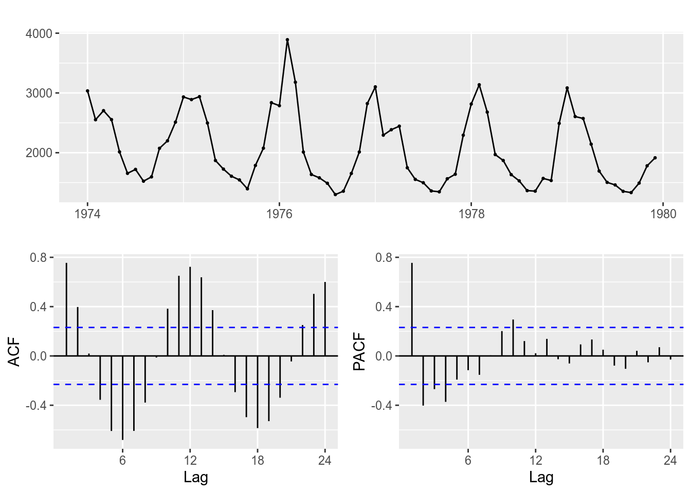

```r
modelo0 <- Arima(ldeaths,order = c(1,0,0),seasonal = c(1,1,1))
checkresiduals(modelo0)
```

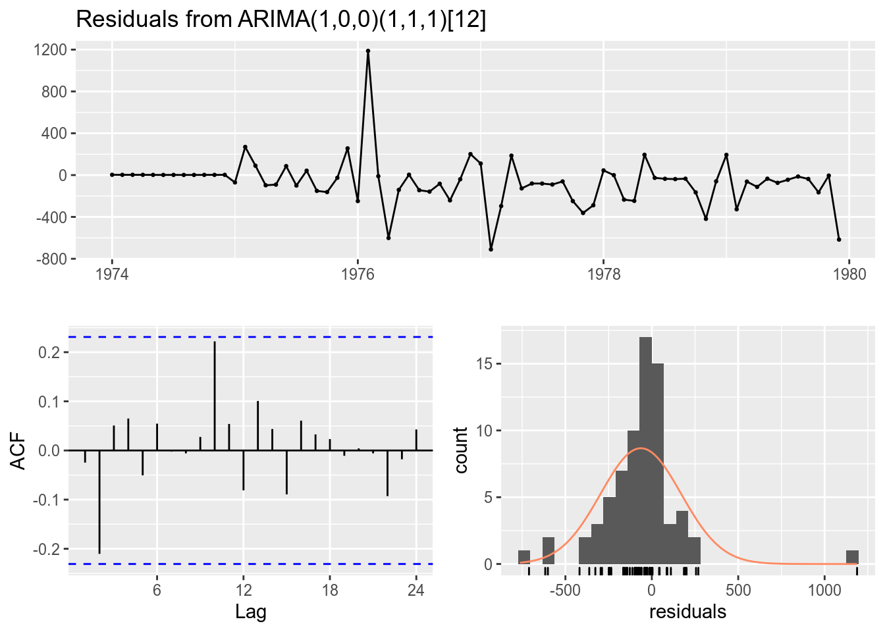
	Ljung-Box test

data:  Residuals from ARIMA(1,0,0)(1,1,1)[12]
Q* = 11, df = 11, p-value = 0.5

Model df: 3.   Total lags used: 14

```r
tsdiag(modelo0)
```

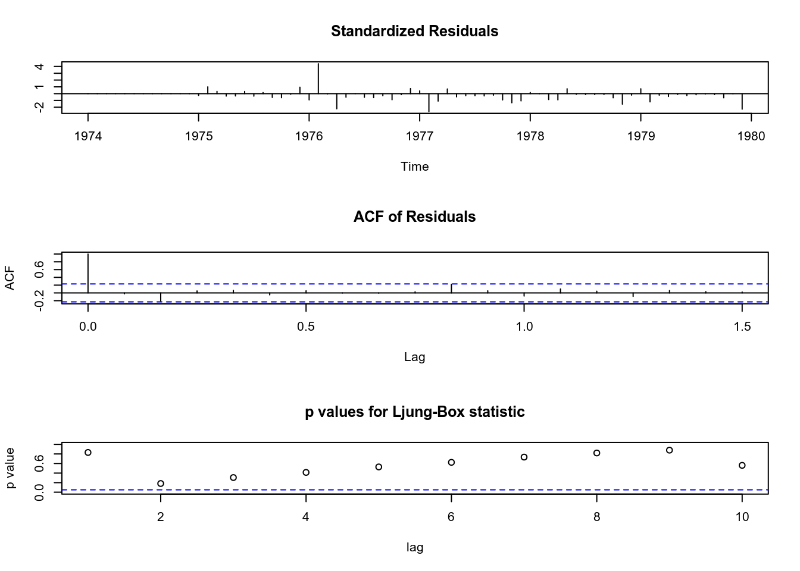


```r
plot(ldeaths)
lines(fitted(modelo0),col="red")
```

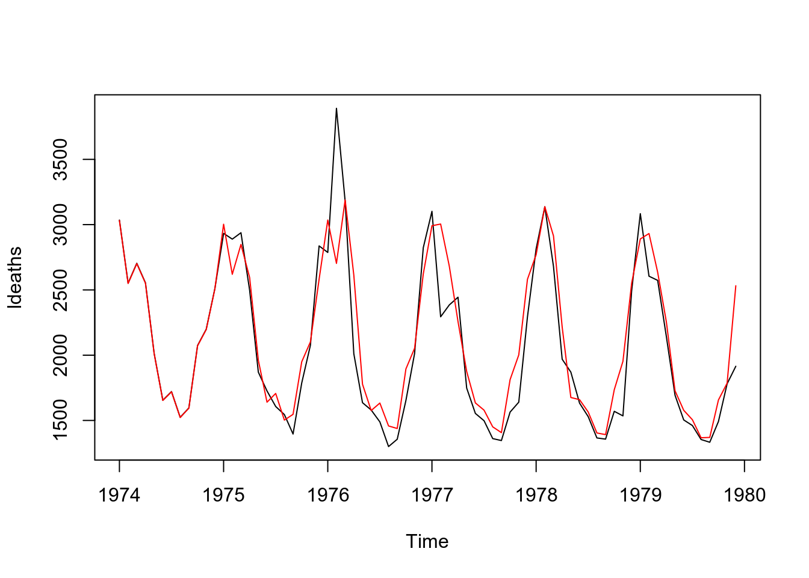


## Ajuste automático de modelos ARIMA

O pacote [*forecast*](http://pkg.robjhyndman.com/forecast) de autoria Rob Hyndman e colaboradores possui diversas funções para
visualização, análise e predições de séries temporais. Entre elas existe uma função que faz ajustes automáticos para modelos ARIMA.
Essa função se chama `auto.arima()`.


- Testa diferentes combinações de $p$, $d$ e  $q$ buscando o melhor ajuste

- Extremamente flexível

- Mesmo intuindo um modelo, você pode usá-la para confirmar sua parametrização


Alguns parâmetros importantes da função `auto.arima()`:

- `stationary` - Se TRUE, restringe sua busca por modelos estacionários.

- `seasonal` - Se FALSE, restringe sua busca por modelos não sazonais.

- `stepwise` - Se TRUE, utilizará o métodos de *stepwise* de seleção (mais rápido). Caso contrário, irá buscar todas as combinações. O método de seleção *non-stepwise* pode ser muito lento, especialmente para os modelos sazonais.

- `trace` - Se TRUE, a lista de modelos ARIMA considerados será reportada.

- `approximation` - Se TRUE, o processo de estimação é feito através das somas dos quadrados condicionais e os critérios de informação utilizados para a seleção de modelos são aproximados. O modelo final ainda é calculado usando estimativa de máxima verossimilhança. A aproximação deve ser usada para séries temporais longas ou um período sazonal elevado para evitar tempos de computação excessivos.


```r
# Utilizando trace = T, será possível verificar todo o processo de criação e teste dos modelos
modelo1 <-  auto.arima(ldeaths, trace = F, allowdrift=F)

# Neste modelo, será feito uma busca maior para uma solução "mais otimizada"
modelo2 <-  auto.arima(ldeaths, trace = F, stepwise = F, approximation = F,parallel = TRUE)
```

Vamos verificar cada um dos modelos obtidos:


```r
modelo1
```

```
## Series: ldeaths 
## ARIMA(0,0,1)(2,1,0)[12] 
## 
## Coefficients:
##         ma1    sar1    sar2
##       0.427  -0.860  -0.361
## s.e.  0.138   0.143   0.145
## 
## sigma^2 estimated as 70422:  log likelihood=-423.3
## AIC=854.6   AICc=855.3   BIC=863
```


```r
tsdiag(modelo1)
```


```r
modelo2
```

```
## Series: ldeaths 
## ARIMA(2,0,0)(0,1,2)[12] with drift 
## 
## Coefficients:
##         ar1     ar2    sma1   sma2   drift
##       0.255  -0.339  -1.163  0.357  -5.334
## s.e.  0.134   0.140   0.362  0.205   0.905
## 
## sigma^2 estimated as 49449:  log likelihood=-416.4
## AIC=844.8   AICc=846.4   BIC=857.4
```


```r
tsdiag(modelo2)
```

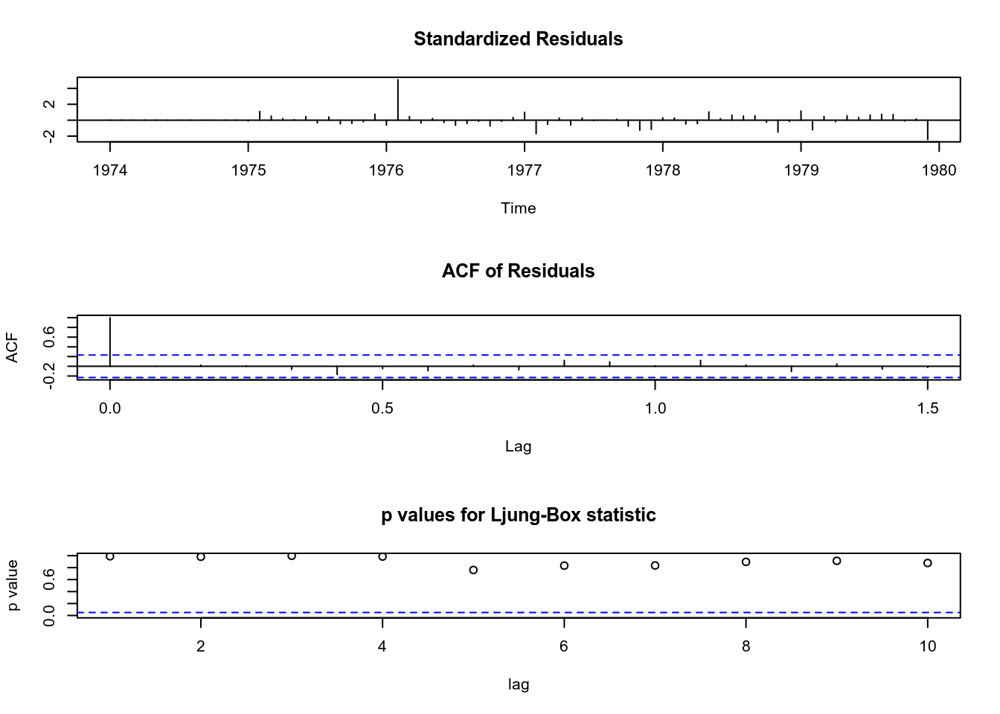


Comparando os ajustes dos modelos:


```r
plot(ldeaths,lwd=2)
lines(fitted(modelo0),col="red",lty=2,lwd=2)
lines(fitted(modelo1),col="blue",lty=2,lwd=2)
lines(fitted(modelo2),col="orange",lty=2,lwd=2)
```

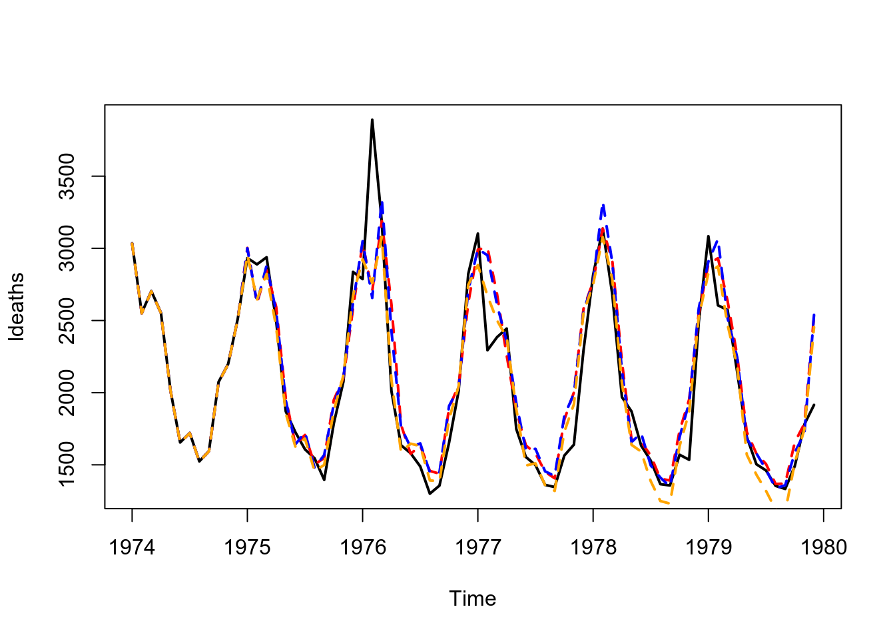


## Modelos de Previsão

Uma vez ajustado um modelo ARIMA a uma série temporal é possível fazer uma predição de $K$ passos a frente, permitindo obter a previsão da série no instante $t + k$, denotada por $\widehat {Z}_{t+k}$. Podemos obter também os limites de confiança.

Os modelos de previsão são uma área importante e um campo muito ativo de desenvolvimento de métodos estatísticos e computacionais. Aqui vamos somente apresentar um exemplo utilizando um dos modelos já ajustados para a serie *ldeaths*.

Uma maneira simples de obter o valor predito é usando a função *predict()*.

\


```r
predict(modelo1, n.ahead = 12)
```


```{=html}
<div id="htmlwidget-32443275c0a7eb076410" style="width:100%;height:auto;" class="datatables html-widget"></div>
<script type="application/json" data-for="htmlwidget-32443275c0a7eb076410">{"x":{"filter":"none","data":[["1","2","3","4","5","6","7","8","9","10","11","12"],[2690.3615026526,2757.67820676617,2557.88175625962,2165.06931141259,1801.05678939326,1586.33587577134,1508.24758017364,1362.50784323957,1349.65436216017,1556.87607550998,1607.49252438622,2338.55209689625],[265.371941651055,288.538508659501,288.538508659501,288.538508659501,288.538508659501,288.538508659501,288.538508659501,288.538508659501,288.538508659501,288.538508659501,288.538508659501,288.538508659501]],"container":"<table class=\"display\">\n  <thead>\n    <tr>\n      <th> <\/th>\n      <th>pred<\/th>\n      <th>se<\/th>\n    <\/tr>\n  <\/thead>\n<\/table>","options":{"columnDefs":[{"className":"dt-right","targets":[1,2]},{"orderable":false,"targets":0}],"order":[],"autoWidth":false,"orderClasses":false}},"evals":[],"jsHooks":[]}</script>
```

\

O pacote *forecast* possui funções para facilitar a predição e visualização. Veja na função abaixo que o modelo já retorna não só o valor predito mas também os limites superior e inferior para os níveis de confiança 80 e 95.

\


```r
forecast(modelo1,h=12)
```


```{=html}
<div id="htmlwidget-e1c5296cbbeaa3eea0ff" style="width:100%;height:auto;" class="datatables html-widget"></div>
<script type="application/json" data-for="htmlwidget-e1c5296cbbeaa3eea0ff">{"x":{"filter":"none","data":[["Jan 1980","Feb 1980","Mar 1980","Apr 1980","May 1980","Jun 1980","Jul 1980","Aug 1980","Sep 1980","Oct 1980","Nov 1980","Dec 1980"],[2690.36,2757.68,2557.88,2165.07,1801.06,1586.34,1508.25,1362.51,1349.65,1556.88,1607.49,2338.55],[2350.27,2387.9,2188.1,1795.29,1431.28,1216.56,1138.47,992.73,979.88,1187.1,1237.72,1968.78],[3030.45,3127.46,2927.66,2534.85,2170.83,1956.11,1878.02,1732.28,1719.43,1926.65,1977.27,2708.33],[2170.24,2192.15,1992.36,1599.54,1235.53,1020.81,942.72,796.98,784.13,991.35,1041.97,1773.03],[3210.48,3323.2,3123.41,2730.59,2366.58,2151.86,2073.77,1928.03,1915.18,2122.4,2173.02,2904.08]],"container":"<table class=\"display\">\n  <thead>\n    <tr>\n      <th> <\/th>\n      <th>Point Forecast<\/th>\n      <th>Lo 80<\/th>\n      <th>Hi 80<\/th>\n      <th>Lo 95<\/th>\n      <th>Hi 95<\/th>\n    <\/tr>\n  <\/thead>\n<\/table>","options":{"columnDefs":[{"className":"dt-right","targets":[1,2,3,4,5]},{"orderable":false,"targets":0}],"order":[],"autoWidth":false,"orderClasses":false}},"evals":[],"jsHooks":[]}</script>
```

\

Ele também facilita a confecção de gráficos.


```r
plot(pred)  # a função autoplot produz no formato ggplot
```

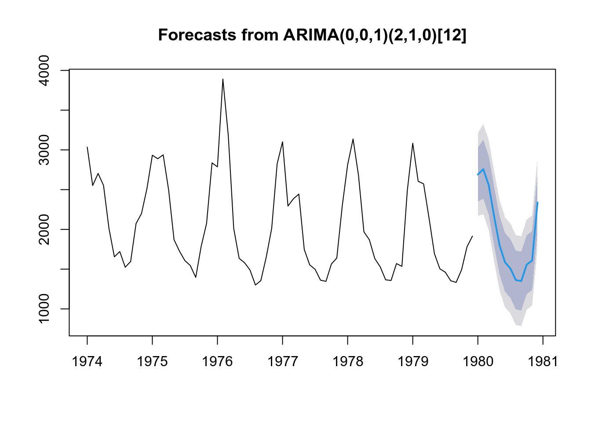


Para saber mais sobre séries temporais e previsões recomendamos o excelente livro online
[Forecasting: Principles and Practice Rob J Hyndman and George Athanasopoulos](https://otexts.com/fpp3/)


## Correlação Cruzada (*Cross-Correlation*)

- Vamos considerar a situação em que temos duas ou mais séries temporais e queremos explorar as relações entre elas. A ideia seria modelar a série $Z_{t}^{1}$ usando os pontos anteriores de $Z_{t}^{2}$.

- A correlação cruzada descreve o grau de correlação entre duas séries.

- A correlação cruzada é usada para determinar quando uma mudança em um série pode potencializar a *causa* da mudança na outra série.

$$Z_{t} =  v(B) X_t + N_t$$
para a qual:


* $v(B)$  é a função de transferência (filtro)
* $Z_t,X_t$ são séries estacionarias
* $N_t$  é um ruído independente de $X_t$


- Vamos analisar:

    - O atraso de uma série em relação a outra

    - O feedback

    - Correlação dos resíduos, removida a estrutura temporal


A título de demonstração da função de correlação cruzada (*Cross-correlation Function*), vamos usar como exemplo dados de temperatura da área central do Reino Unido, obtidos do [UK Met Office](http://hadobs.metoffice.gov.uk/hadcet/data/download.html) e vamos correlacionar com a série **ldeaths** .

\


```r
uktemp <- read.table('https://gitlab.procc.fiocruz.br/oswaldo/eco2019/raw/master/dados/UKtemp.tsv')
uktemp <- ts(as.vector(t(uktemp[,2:13])),start = c(1970,1),frequency = 12)
uktemp.ts <- window(uktemp,start=c(1974,1),end=c(1979,12))
fcc <- ccf(uktemp.ts,ldeaths)
```

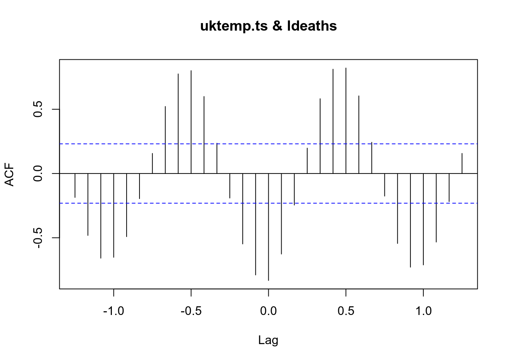


```r
cbind(fcc$lag,fcc$acf)
```

<table class="table" style="margin-left: auto; margin-right: auto;">
<tbody>
  <tr>
   <td style="text-align:right;"> -1.2500 </td>
   <td style="text-align:right;"> -0.1859 </td>
  </tr>
  <tr>
   <td style="text-align:right;"> -1.1667 </td>
   <td style="text-align:right;"> -0.4816 </td>
  </tr>
  <tr>
   <td style="text-align:right;"> -1.0833 </td>
   <td style="text-align:right;"> -0.6586 </td>
  </tr>
  <tr>
   <td style="text-align:right;"> -1.0000 </td>
   <td style="text-align:right;"> -0.6518 </td>
  </tr>
  <tr>
   <td style="text-align:right;"> -0.9167 </td>
   <td style="text-align:right;"> -0.4912 </td>
  </tr>
  <tr>
   <td style="text-align:right;"> -0.8333 </td>
   <td style="text-align:right;"> -0.1953 </td>
  </tr>
  <tr>
   <td style="text-align:right;"> -0.7500 </td>
   <td style="text-align:right;"> 0.1562 </td>
  </tr>
  <tr>
   <td style="text-align:right;"> -0.6667 </td>
   <td style="text-align:right;"> 0.5214 </td>
  </tr>
  <tr>
   <td style="text-align:right;"> -0.5833 </td>
   <td style="text-align:right;"> 0.7748 </td>
  </tr>
  <tr>
   <td style="text-align:right;"> -0.5000 </td>
   <td style="text-align:right;"> 0.8002 </td>
  </tr>
  <tr>
   <td style="text-align:right;"> -0.4167 </td>
   <td style="text-align:right;"> 0.5991 </td>
  </tr>
  <tr>
   <td style="text-align:right;"> -0.3333 </td>
   <td style="text-align:right;"> 0.2354 </td>
  </tr>
  <tr>
   <td style="text-align:right;"> -0.2500 </td>
   <td style="text-align:right;"> -0.1907 </td>
  </tr>
  <tr>
   <td style="text-align:right;"> -0.1667 </td>
   <td style="text-align:right;"> -0.5479 </td>
  </tr>
  <tr>
   <td style="text-align:right;"> -0.0833 </td>
   <td style="text-align:right;"> -0.7891 </td>
  </tr>
  <tr>
   <td style="text-align:right;"> 0.0000 </td>
   <td style="text-align:right;"> -0.8320 </td>
  </tr>
  <tr>
   <td style="text-align:right;"> 0.0833 </td>
   <td style="text-align:right;"> -0.6264 </td>
  </tr>
  <tr>
   <td style="text-align:right;"> 0.1667 </td>
   <td style="text-align:right;"> -0.2453 </td>
  </tr>
  <tr>
   <td style="text-align:right;"> 0.2500 </td>
   <td style="text-align:right;"> 0.1974 </td>
  </tr>
  <tr>
   <td style="text-align:right;"> 0.3333 </td>
   <td style="text-align:right;"> 0.5818 </td>
  </tr>
  <tr>
   <td style="text-align:right;"> 0.4167 </td>
   <td style="text-align:right;"> 0.8115 </td>
  </tr>
  <tr>
   <td style="text-align:right;"> 0.5000 </td>
   <td style="text-align:right;"> 0.8207 </td>
  </tr>
  <tr>
   <td style="text-align:right;"> 0.5833 </td>
   <td style="text-align:right;"> 0.6039 </td>
  </tr>
  <tr>
   <td style="text-align:right;"> 0.6667 </td>
   <td style="text-align:right;"> 0.2426 </td>
  </tr>
  <tr>
   <td style="text-align:right;"> 0.7500 </td>
   <td style="text-align:right;"> -0.1756 </td>
  </tr>
  <tr>
   <td style="text-align:right;"> 0.8333 </td>
   <td style="text-align:right;"> -0.5441 </td>
  </tr>
  <tr>
   <td style="text-align:right;"> 0.9167 </td>
   <td style="text-align:right;"> -0.7285 </td>
  </tr>
  <tr>
   <td style="text-align:right;"> 1.0000 </td>
   <td style="text-align:right;"> -0.7110 </td>
  </tr>
  <tr>
   <td style="text-align:right;"> 1.0833 </td>
   <td style="text-align:right;"> -0.5332 </td>
  </tr>
  <tr>
   <td style="text-align:right;"> 1.1667 </td>
   <td style="text-align:right;"> -0.2181 </td>
  </tr>
  <tr>
   <td style="text-align:right;"> 1.2500 </td>
   <td style="text-align:right;"> 0.1562 </td>
  </tr>
</tbody>
</table>


```r
max(abs(fcc$acf))
```

```
## [1] 0.832
```


## GAM (Generalized Additive Models)

- Um modelo aditivo generalizado (Hastie and Tibishirani, 1990) é um modelo linear generalizado com um preditor linear envolvendo a soma de funções suavizadas das covariáveis + os efeitos fixos das mesmas.


$$\eta = \sum X \beta + f_1(x_{1i}) + f_2(x_{2i}) + \ldots$$

- Pode ser considerado uma extensão do GLM, onde o preditor linear $\eta = E(Y_i)$ não é limitado para a regressão linear, sendo $Y_i \sim$ alguma distribuição da família exponencial.

- $Y_i$ é a variável resposta (desfecho)

- $X$ é o vetor das variáveis explicativas (exposição)

- $\beta$ representa o vetor de parâmetros a serem estimados pelo modelo.

- O modelo inclui qualquer função das covariáveis independentes ($x_i$)

- $f(x)$ pode ser uma função não-paramétrica, cuja forma não é especificada *a priori*. Mas pode ser estimada através de curvas de alisamento (ex: *kernel*, *loess*, *splines*, etc.)

- A curva alisada permite descrever a forma e revelar possíveis não linearidades nas
   relações estudadas, uma vez que não apresenta a estrutura rígida de uma função
   paramétrica, como nos GLM's.

- Quando usar? Quando o efeito da covariável muda dependendo do seu valor.

### Tipos de splines

- *Cubic regression spline* – polinômios de grau 3 ajustados aos intervalos dos dados definidos pelos nós distribuı́dos regularmente em todo o escopo dos dados. A base é a soma de nós mais 2, que correspondem ao início e fim da curva. Os polinômios são unidos de forma a existir as 1 e 2 derivadas.

- *Cyclic cubic regression spline* – força a função a ter o mesmo valor e mesmas derivadas no início e final. Interessante para séries temporais com sazonalidade.

- *P-splines* – Baseia-se na B-spline, na qual a função vai obrigatoriamente a zero em m+3 nós adjacentes. A p-spline se baseia nessa, porém aplica uma penalidade diferencial entre *β*’s adjacentes para controlar a “wiggliness”.

- *Thin plate* – menor erro quadrático, menor número de parâmetros considerado o estimador ótimo. Facilmente adaptável para duas/três dimensões.

- *Tensor Product* – Semelhante ao Thin Plate, mas permite escalas


| bs=  |    Descrição     | Vantagens                                                    | Desvantagens                                                 |
| :--: | :--------------: | ------------------------------------------------------------ | ------------------------------------------------------------ |
| "tp" |    Thin Plate    | Suaviza múltiplas covariáveis. Não se altera com a rotação. Estimador ótimo. | Computacionalmente custoso. Não é invariante quanto à escala. |
| "cr" | Cubic Regression | Computacionalmente barato. Parâmetros interpretáveis diretamente. | Só uma covariável. Baseado na escolha dos nós. Estimador não ótimo. |
| "cc" |    Cyclic CRS    | Começo e fim = 's                                            | Idem.                                                        |
| "ps" |    P-splines     | Qualquer combinação de base e ordem.                         | Nós em intervalos iguais. Penalidades difíceis de interpretar. Estimador não ótimo. |

### Por que não usar ?

- Os modelos estatísticos visam explicar os dados observados, não simplesmente reproduzi-lo $\rightarrow$ **overfitting**

- Modelos paramétricos em geral são melhores para estimar erros padrão ou intervalos de confiança

- Modelos paramétricos são mais eficientes, se corretamente especificados (menor número de observações)


### GAM em Séries Temporais

- A idéia principal é modelar o efeito de covariáveis em alguns eventos de saúde ao longo do tempo

- Razões:

    - Permitir a inclusão da dependência do tempo

    - Relação não-linear

    - Tendência e sazonalidade podem ser facilmente incorporadas

- Considerando a variável resposta uma contagem, as escolhas para as distribuições são:

    - Poisson: $\lambda$ $=$ valores esperados e $=$ variância $\rightarrow$ superdispersão

    - Quasipoisson: não é uma distribuição, mas uma maneira de relaxar suposição do modelo anterior e levar em consideração a superdispersão. (Não estima o AIC automaticamente).

    - Negative Binomial: tem uma média $\mu$, um parâmetro de escala $\theta$ e a variância como a função $V(\mu)=\mu+\mu^2/\theta$

    - Modelos com inflação zero: modelos de mistura que combinam uma massa pontual a zero com uma distribuição de contagem como Poisson, geométrica ou binomial negativa


### Exemplo de  modelo GAM aplicado a ST ldeaths


Transforma o exemplo **ldeaths** de *ts* em *data.frame* preservando as estruturas temporais (tempo e mês)


```R
ldeaths.df <- data.frame(tempo=time(ldeaths),obitos=ldeaths,mes=cycle(ldeaths))
ldeaths.df
```

<table>
 <thead>
  <tr>
   <th style="text-align:right;"> tempo </th>
   <th style="text-align:right;"> obitos </th>
   <th style="text-align:right;"> mes </th>
  </tr>
 </thead>
<tbody>
  <tr>
   <td style="text-align:right;"> 1974 </td>
   <td style="text-align:right;"> 3035 </td>
   <td style="text-align:right;"> 1 </td>
  </tr>
  <tr>
   <td style="text-align:right;"> 1974 </td>
   <td style="text-align:right;"> 2552 </td>
   <td style="text-align:right;"> 2 </td>
  </tr>
  <tr>
   <td style="text-align:right;"> 1974 </td>
   <td style="text-align:right;"> 2704 </td>
   <td style="text-align:right;"> 3 </td>
  </tr>
  <tr>
   <td style="text-align:right;"> 1974 </td>
   <td style="text-align:right;"> 2554 </td>
   <td style="text-align:right;"> 4 </td>
  </tr>
  <tr>
   <td style="text-align:right;"> 1974 </td>
   <td style="text-align:right;"> 2014 </td>
   <td style="text-align:right;"> 5 </td>
  </tr>
  <tr>
   <td style="text-align:right;"> 1974 </td>
   <td style="text-align:right;"> 1655 </td>
   <td style="text-align:right;"> 6 </td>
  </tr>
</tbody>
</table>

Modelando como **GAM**:

```R
mod0 <- gam ( obitos ~ s(tempo) + s(mes),data=ldeaths.df)
mod0
```

Sumário do modelo

<!-- html table generated in R 4.0.5 by xtable 1.8-4 package -->
<!-- Fri Jun 11 17:46:17 2021 -->
<table border=1>
<caption align="bottom">  </caption>
  <tr> <td> A. parametric coefficients </td> <td align="right"> Estimate </td> <td align="right"> Std. Error </td> <td align="right"> t-value </td> <td align="right"> p-value </td> </tr>
  <tr> <td> (Intercept) </td> <td align="right"> 2056.6250 </td> <td align="right"> 26.7125 </td> <td align="right"> 76.9911 </td> <td align="right"> &lt; 0.0001 </td> </tr>
   <tr> <td> B. smooth terms </td> <td align="right"> edf </td> <td align="right"> Ref.df </td> <td align="right"> F-value </td> <td align="right"> p-value </td> </tr>
  <tr> <td> s(tempo) </td> <td align="right"> 1.0003 </td> <td align="right"> 1.0007 </td> <td align="right"> 14.4150 </td> <td align="right"> 0.0003 </td> </tr>
  <tr> <td> s(mes) </td> <td align="right"> 5.7942 </td> <td align="right"> 6.9532 </td> <td align="right"> 59.0681 </td> <td align="right"> &lt; 0.0001 </td> </tr>
   <a name=tab.gam></a>
</table>

R-quadrado(ajustado) = 0.86   Deviance Explicada = 0.88  AIC = 995.27

**Gráfico dos termos suaves:**

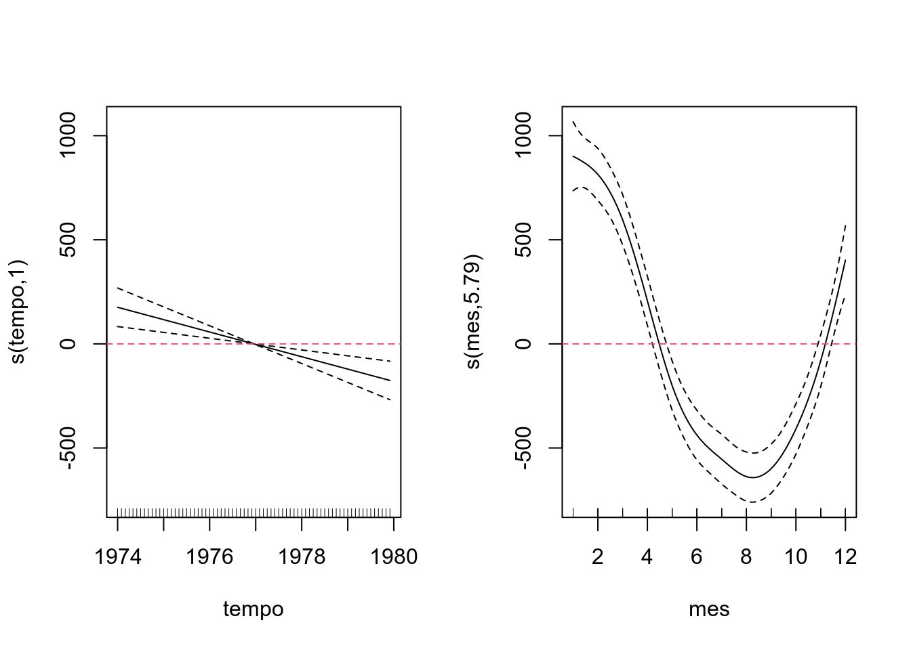

**Análise de resíduos**

Vamos verificar se sobraram estruturas nos resíduos usando a ACF dos resíduos e o teste de Ljung-Box:


```r
acf(residuals(mod0))
```

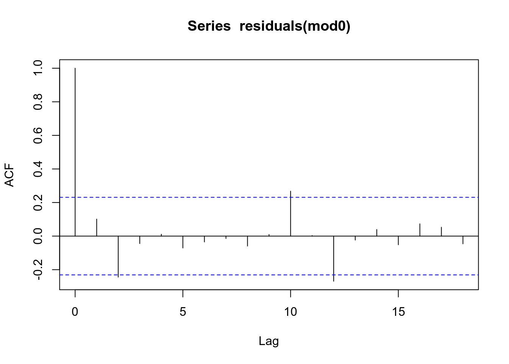

```R
Box.test(residuals(mod0),type='Ljung-Box')
```


-------------------------------
 Test statistic   df   P value 
---------------- ---- ---------
     0.7716       1    0.3797  
-------------------------------

Table: Box-Ljung test: `residuals(mod0)`

Como podemos observar a variável *tempo* que captura a tendência ficou completamente linear.

Vamos agora usar a variavel *tempo* de forma linear no modelo.

```R
mod1 <- gam ( obitos ~ tempo + s(mes),data=ldeaths.df)
mod1
```


<!-- html table generated in R 4.0.5 by xtable 1.8-4 package -->
<!-- Fri Jun 11 17:46:18 2021 -->
<table border=1>
<caption align="bottom">  </caption>
  <tr> <td> A. parametric coefficients </td> <td align="right"> Estimate </td> <td align="right"> Std. Error </td> <td align="right"> t-value </td> <td align="right"> p-value </td> </tr>
  <tr> <td> (Intercept) </td> <td align="right"> 119492.6570 </td> <td align="right"> 30969.4892 </td> <td align="right"> 3.8584 </td> <td align="right"> 0.0003 </td> </tr>
  <tr> <td> tempo </td> <td align="right"> -59.4024 </td> <td align="right"> 15.6652 </td> <td align="right"> -3.7920 </td> <td align="right"> 0.0003 </td> </tr>
   <tr> <td> B. smooth terms </td> <td align="right"> edf </td> <td align="right"> Ref.df </td> <td align="right"> F-value </td> <td align="right"> p-value </td> </tr>
  <tr> <td> s(mes) </td> <td align="right"> 5.5691 </td> <td align="right"> 6.7170 </td> <td align="right"> 60.8243 </td> <td align="right"> &lt; 0.0001 </td> </tr>
   <a name=tab.gam></a>
</table>


R-quadrado(ajustado) = 0.86  Deviance Explicada =0.87  AIC = 994.67


```r
acf(residuals(mod1))
```


```R
Box.test(residuals(mod1),type='Ljung-Box')
```


-------------------------------
 Test statistic   df   P value 
---------------- ---- ---------
     0.7346       1    0.3914  
-------------------------------

Table: Box-Ljung test: `residuals(mod1)`


### Exemplo GAM: Casos de Leptospirose *vs* Clima


- Vamos utilizar uma a série temporal dos casos de leptospirose com as variáveis de esposição total de chuva e temperatura.


$$\text{Lepto}(t) = \text{rain}(t-?) + \text{humidity}(t-?) + AR(t,t-1) + trend + seasonality + \varepsilon$$

- Tendência e Sazonalidade $\to$ função suavizadora

- Covariáveis $\to$ lag no tempo

- É possível incluir a variabilidade populacional em risco (*offset*)


```r
lepto <- read.csv2("https://gitlab.procc.fiocruz.br/oswaldo/eco2019/raw/master/dados/leptoruido.csv", header=T)
dia <- read.table("https://gitlab.procc.fiocruz.br/oswaldo/eco2019/raw/master/dados/climadia.dat", header=T)

library(lattice)
library(car)
library(sm)
library(survival)
library(mgcv)

#XY condicionado
xyplot(cases + totrain + tempmed ~ week,
 outer=TRUE, layout=c(1, 3), pch=1, type="l",ylab="",
  scales=list(x=list(relation='same'), y=list(relation='free')),
 data=lepto)
```

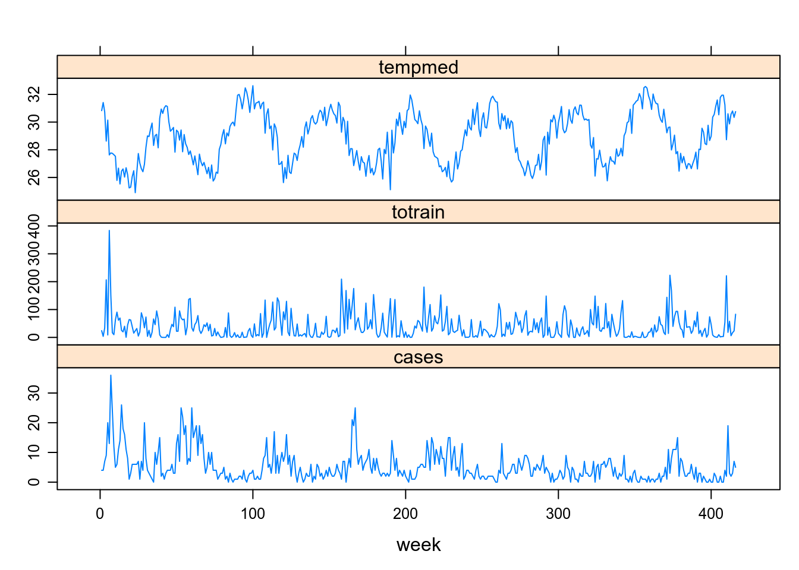

- Modelando a Chuva como resposta e colocando a função suavizadora para capturar o efeito nas semanas epidemológicas


```r
xyplot(totrain ~ week,
 outer=TRUE, layout=c(1, 1), pch=1, type="l",ylab="Chuva",
  scales=list(x=list(relation='same'), y=list(relation='free')),
 data=lepto)
```

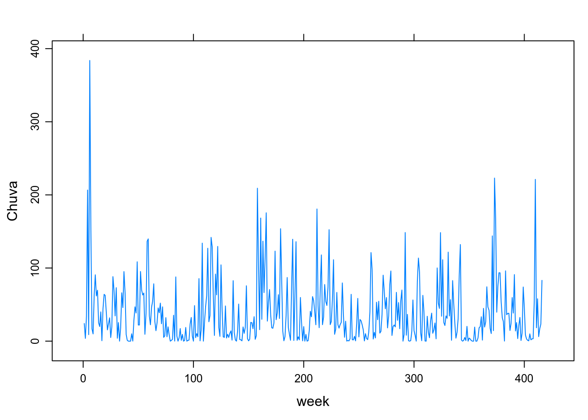

```r
# Ajustando a chuva como resposta
par(mfrow=c(2,2))
rain.tp.auto <- gam(totrain ~ s(week,bs="tp"), data=lepto )

plot(rain.tp.auto,main=paste('K = ',rain.tp.auto$smooth[[1]]$bs.dim))

rain.tp.k1 <- gam(totrain ~ s(week,bs="tp",k=1), data=lepto )

plot(rain.tp.k1,main = paste('K =',rain.tp.k1$smooth[[1]]$bs.dim))

rain.tp.k30 <- gam(totrain ~ s(week,bs="tp",k=30), data=lepto )

plot(rain.tp.k30,main=paste('K =',rain.tp.k30$smooth[[1]]$bs.dim))

rain.ad <- gam(totrain ~ s(week,bs="ad"), data=lepto )

plot(rain.ad,main=paste('K(adaptável) =', rain.ad$smooth[[1]]$bs.dim))
```

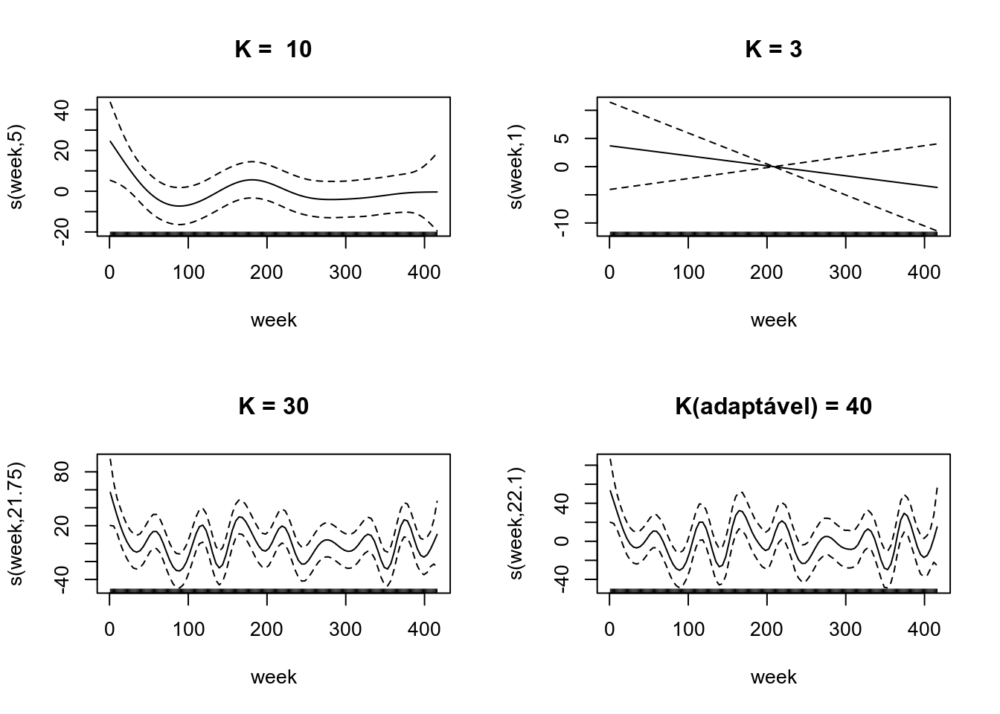

```r
# ThinPlate  <- predict(rain.tp)
# P.spline <- predict(rain.ps)
# CubicRegression <- predict(rain.cr)
# CyclicCR <- predict(rain.cc)
# Adaptative <- predict(rain.ad)
```


<!-- 992 A 1034 JA ESTAVA COMENTADA ANTES -->


<!-- - Uma outra forma de representar o efeito da chuva -->

<!-- ```{r, echo=T, warning=FALSE, results='asis', message = FALSE, out.width = "100%", fig.align = "center"} -->
<!-- #  -->
<!-- # par(mfrow=c(3,2),mai=c(0.2,0.5412 ,0.5412,0.05),mgp=c(2,.5,0)) -->
<!-- # plot(rain.tp,shade=TRUE,ylab="TP",xlab="",residuals=F,xaxp=c(0,416,8),main="Chuva", pch=19, cex=.2, xaxt="n") -->
<!-- # plot(rain.ps,shade=TRUE,main="",ylab="PS",xlab="",residuals=F,xaxp=c(0,416,8),  pch=19, cex=.2,  xaxt="n") -->
<!-- # plot(rain.cr,shade=TRUE,main="",ylab="CC",xlab="",residuals=F,xaxp=c(0,416,8),  pch=19, cex=.2,  xaxt="n") -->
<!-- # plot(rain.cc,shade=TRUE,main="",ylab="CC",xlab="",residuals=F,xaxp=c(0,416,8),  pch=19, cex=.2,  xaxt="n") -->
<!-- # plot(rain.ad,shade=TRUE,main="",ylab="Adaptative",xlab="",residuals=F,xaxp=c(0,416,8),  pch=19, cex=.2) -->
<!-- #  -->

<!-- ``` -->

<!-- - Série da temperatura (ThinPlate - tp, P.spline - ps, CubicRegression - cc) -->

<!-- ```{r, echo=T, warning=FALSE, results='asis', message = FALSE, out.width = "100%", fig.align = "center"} -->

<!-- temp.tp <- gam(tempmed ~ s(week,bs="tp",k=52), data=lepto)  -->
<!-- temp.ps <- gam(tempmed ~ s(week,bs="ps",k=52), data=lepto )  -->
<!-- temp.cc <- gam(tempmed ~ s(week,bs="cc",k=52), data=lepto ) -->

<!-- par(mfrow=c(3,1),mai=c(0.05,0.5412 ,0.5412,0.05),mgp=c(2,1,0)) -->
<!-- plot(temp.tp,shade=TRUE,ylab="TP",xlab="",xaxp=c(0,416,8) , main="Temperatura", cex=2) -->
<!-- plot(temp.ps,shade=TRUE,main="",ylab="PS",xlab="",xaxp=c(0,416,8), cex=2) -->
<!-- plot(temp.cc,shade=TRUE,main="",ylab="CC",xlab="",xaxp=c(0,416,8), cex=2) -->

<!-- ``` -->

<!-- - Série dos casos de leptospirose (ThinPlate - tp, P.spline - ps, CubicRegression - cc) -->

<!-- ```{r, echo=T, warning=FALSE, results='asis', message = FALSE, out.width = "100%", fig.align = "center"} -->

<!-- cases.tp <- gam(cases ~ s(week,bs="tp",k=52), data=lepto ) #ciclica -->
<!-- cases.ps <- gam(cases ~ s(week,bs="ps",k=52), data=lepto ) # -->
<!-- cases.cc <- gam(cases ~ s(week,bs="cc",k=52), data=lepto) -->

<!-- par(mfrow=c(3,1),mai=c(0.05,0.5412 ,0.5412,0.05),mgp=c(2,1,0)) -->
<!-- plot(cases.tp,shade=TRUE,ylab="TP",xlab="",xaxp=c(0,416,8), main="Casos", cex=2) -->
<!-- plot(cases.ps,shade=TRUE,main="",ylab="PS",xlab="",xaxp=c(0,416,8), cex=2) -->
<!-- plot(cases.cc,shade=TRUE,main="",ylab="CC",xlab="",xaxp=c(0,416,8), cex=2) -->

<!-- ``` -->


- Ajustando a série dos casos de leptospirose via distribuição Poisson:


```r
library(quantmod) # para utilizar a funcao Lag

chuvl0 <- gam(cases ~ s(totrain)       ,family=poisson,data=subset(lepto, week>5))
chuvl1 <- gam(cases ~ s(Lag(totrain,1)),family=poisson,data=subset(lepto, week>5))
chuvl2 <- gam(cases ~ s(Lag(totrain,2)),family=poisson,data=subset(lepto, week>5))
chuvl3 <- gam(cases ~ s(Lag(totrain,3)),family=poisson,data=subset(lepto, week>5))
chuvl4 <- gam(cases ~ s(Lag(totrain,4)),family=poisson,data=subset(lepto, week>5))
chuvl5 <- gam(cases ~ s(Lag(totrain,5)),family=poisson,data=subset(lepto, week>5))
```


```r
AIC(chuvl0,chuvl1,chuvl2,chuvl3,chuvl4,chuvl5)
```


```{=html}
<div id="htmlwidget-3aca9be01e4eaaae47e3" style="width:100%;height:auto;" class="datatables html-widget"></div>
<script type="application/json" data-for="htmlwidget-3aca9be01e4eaaae47e3">{"x":{"filter":"none","data":[["chuvl0","chuvl1","chuvl2","chuvl3","chuvl4","chuvl5"],[8.98,9.68,9.72,8.41,9.67,9.6],[2855.95,2426.26,2379.5,2683.73,2661.15,2716.69]],"container":"<table class=\"display\">\n  <thead>\n    <tr>\n      <th> <\/th>\n      <th>df<\/th>\n      <th>AIC<\/th>\n    <\/tr>\n  <\/thead>\n<\/table>","options":{"columnDefs":[{"className":"dt-right","targets":[1,2]},{"orderable":false,"targets":0}],"order":[],"autoWidth":false,"orderClasses":false}},"evals":[],"jsHooks":[]}</script>
```


- Ajustando a série dos casos de leptospirose via distribuição Binomial Negativa


```r
chuvnb0 <- gam(cases ~ s(Lag(totrain,0)),data=lepto, family=nb(), subset=week>5)
chuvnb1 <- gam(cases ~ s(Lag(totrain,1)),data=lepto, family=nb(), subset=week>5)
chuvnb2 <- gam(cases ~ s(Lag(totrain,2)),data=lepto, family=nb(), subset=week>5)
chuvnb3 <- gam(cases ~ s(Lag(totrain,3)),data=lepto, family=nb(), subset=week>5)
chuvnb4 <- gam(cases ~ s(Lag(totrain,4)),data=lepto, family=nb(), subset=week>5)
chuvnb5 <- gam(cases ~ s(Lag(totrain,5)),data=lepto, family=nb(), subset=week>5)
chuvnb5$family$getTheta()
```

[1] 0.4864


```r
AIC(chuvnb0,chuvnb1,chuvnb2,chuvnb3,chuvnb4,chuvnb5)
```


```{=html}
<div id="htmlwidget-d6cc69dabf5dd70c5d12" style="width:100%;height:auto;" class="datatables html-widget"></div>
<script type="application/json" data-for="htmlwidget-d6cc69dabf5dd70c5d12">{"x":{"filter":"none","data":[["chuvnb0","chuvnb1","chuvnb2","chuvnb3","chuvnb4","chuvnb5"],[8,7.98,6.86,7.36,8.09,7.12],[2207.45,2094.93,2107.23,2189.67,2192.28,2212.9]],"container":"<table class=\"display\">\n  <thead>\n    <tr>\n      <th> <\/th>\n      <th>df<\/th>\n      <th>AIC<\/th>\n    <\/tr>\n  <\/thead>\n<\/table>","options":{"columnDefs":[{"className":"dt-right","targets":[1,2]},{"orderable":false,"targets":0}],"order":[],"autoWidth":false,"orderClasses":false}},"evals":[],"jsHooks":[]}</script>
```

- Comparando os AIC's de ambos os modelos entre os lags


```r
plot(0:5,AIC(chuvl0,chuvl1,chuvl2,chuvl3,chuvl4,chuvl5)[,2], type="l",ylim=c(2090,2850), ylab="AIC's", xlab = "Lags")
lines(0:5,AIC(chuvnb0,chuvnb1,chuvnb2,chuvnb3,chuvnb4,chuvnb5)[,2], type="l",col=2)

legend("right",c("Poisson","Bin. Neg."),col=1:2,fill=1:2)
```

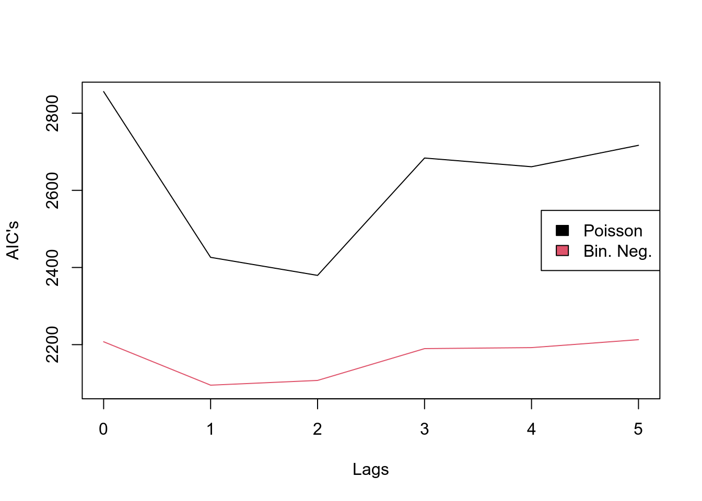

- Verificando a distribuição da chuva entre todos os lags


```r
boxplot(lepto$totrain)
```

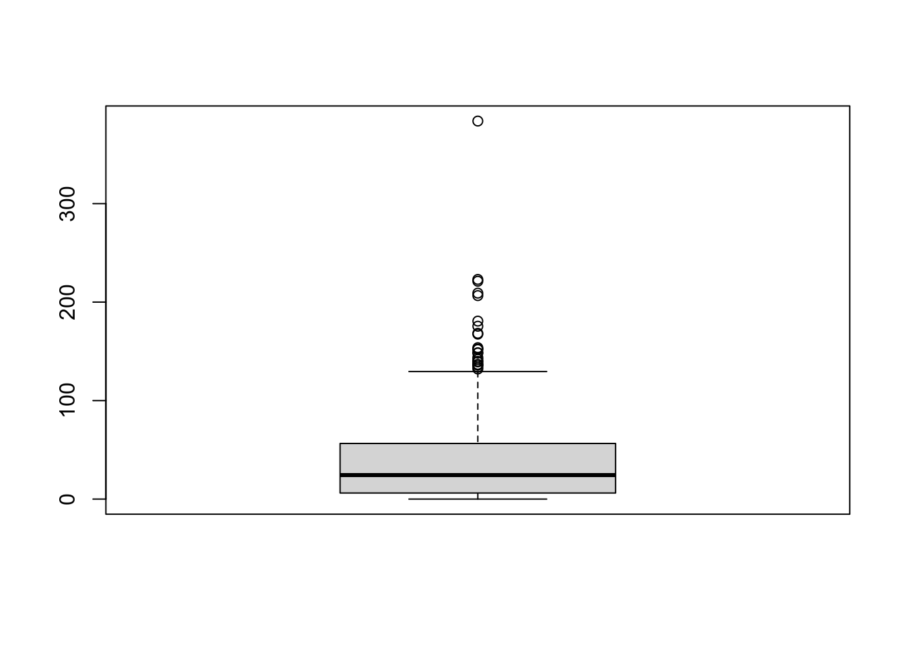

```r
par(mfrow=c(3,2),mai=c(0.05,0.5412 ,0.5412,0.05),mgp=c(2,1,0))

plot(chuvnb0,ylab="Lag=0")
abline(h=0,lty=2,col=2)
plot(chuvnb1,ylab="Lag=1")
abline(h=0,lty=2,col=2)
plot(chuvnb2,ylab="Lag=2")
abline(h=0,lty=2,col=2)
plot(chuvnb3,ylab="Lag=3")
abline(h=0,lty=2,col=2)
plot(chuvnb4,ylab="Lag=4")
abline(h=0,lty=2,col=2)
plot(chuvnb5,ylab="Lag=5")
abline(h=0,lty=2,col=2)
```

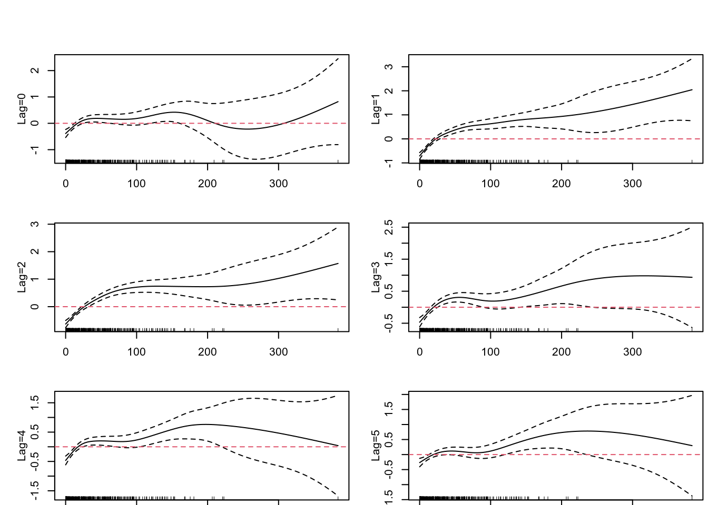


<!-- 1138 A 1163 JA ESTAVA COMENTADA ANTES -->


<!-- Analisando os resíduos do modelo casos.chuva.gam.4 -->


<!-- ```{r, echo=T, warning=FALSE, results='asis', message = FALSE, out.width = "100%", fig.align = "center"} -->
<!-- par(mfrow=c(2,2)) -->
<!-- gam.check(casos.chuva.gam.4, pch=19,cex=.3) -->
<!-- ``` -->

<!-- Plotano o ACF e PACF -->
<!-- ```{r, echo=T, warning=FALSE, results='asis', message = FALSE, out.width = "100%", fig.align = "center"} -->
<!-- # ACF e PACF -->
<!-- par(mfrow=c(1,2)) -->
<!-- ar.acf <- acf(casos.chuva.gam.4$residuals,type="correlation",plot=T) -->
<!-- ar.pacf <- acf(casos.chuva.gam.4$residuals,type="partial",plot=T) -->

<!-- plot(ar.acf) -->
<!-- plot(ar.pacf) -->

<!-- ``` -->

<!-- Teste de Ljung-Box  -->

<!-- ```{r, echo=T, warning=FALSE, results='asis', message = FALSE, out.width = "100%", fig.align = "center"} -->
<!--  Box.test(casos.chuva.gam.4$residuals, type = "Ljung") -->

<!-- ``` -->


- E agora? incluir humidade, temperatura, etc etc...


## Exercícios Propostos

1) Utilize o banco de dados do R chamado *Seatbelts*, que é baseado em uma série histórica que mostra os totais mensais dos condutores de automóveis na Grã-Bretanha mortos ou gravemente feridos, de 1969 a dezembro de 1984. O uso obrigatório dos cintos de segurança foi introduzido em 31 de janeiro de 1983.


|   Variáveis   |                          Descrição                          |
|:-------------:|:-----------------------------------------------------------:|
| DriversKilled | Motoristas de carro mortos                                  |
| drivers       | Motoristas                                                  |
| front         | Passageiros do banco da frente mortos ou gravemente feridos |
| rear          | Passageiros do banco traseiro mortos ou gravemente feridos  |
| kms           | Distância percorrida                                        |
| PetroPrice    | Preço da gasolina                                           |
| VanKilled     | Número de condutores de van (veículo leve de mercadorias)   |
| law           | A lei estava em vigor naquele mês (1/0)                     |

Pede-se:

* Ajuste um modelo ARIMA com a variável de desfecho DriversKilled;
* Ajuste um modelo GAM utilizando a variável de desfecho DriversKilled e verifique quais variáveis estão mais associadas ao modelo.


2) Dados climatológicos de temperaturas máxima, mínima e pluviosidade para as 10 áreas de planejamento (AP) da cidade do Rio de Janeiro de 2001 a 2016  estão disponíveis nos arquivos abaixo. Use a função *read.csv2* para ler o dado.

* [temperatura máxima](https://gitlab.procc.fiocruz.br/oswaldo/eco2019/raw/master/exemplos/max_ALL.csv)

* [temperatura mínima](https://gitlab.procc.fiocruz.br/oswaldo/eco2019/raw/master/exemplos/max_ALL.csv)

* [pluviosidade](https://gitlab.procc.fiocruz.br/oswaldo/eco2019/raw/master/exemplos/rain_ALL.csv)

Escolha uma delas, descreva a série  e tente modelar usando os modelos B&J ou GAM.


### Exercícios Resolvidos

* [Acidentes de transito UK](https://gitlab.procc.fiocruz.br/oswaldo/eco2019/raw/master/scripts/ex1_cap4_seatbealt.r)

* [Dados Climaticos](https://gitlab.procc.fiocruz.br/oswaldo/eco2019/raw/master/scripts/ex2_cap4_pluviosidade.r)

## Bibliografia sugerida

Asteriou, D.; Hall, S.G. Applied econometrics. Macmillan International Higher Education, 2015.

Brockwell, Peter J.; DAVIS, Richard A.; CALDER, Matthew V. Introduction to time series and forecasting. New York: springer, 2002.

Harvey, A. C. and Durbin, J. The effects of seat belt legislation on British road casualties: A case study in structural time series modelling. Journal of the Royal Statistical Society series A, 149, 187–227. 1986.

Hastie, T.; Tibshirani, R. Generalised Additive Models. Chapman & Hall, 1990.

Hyndman, R. J. and Khandakar, Y. Automatic time series forecasting: The forecast package for R, Journal of Statistical Software, 26(3). 2008.

Hyndman, R. J. and Athanasopoulos, G. [Forecasting: Principles and Practice 3rd edition](https://otexts.com/fpp3/).

Webster, C.E.J. Time series properties of econometric models and their implied ARIMA representation. 1983.

Wood, S.N. Generalized Additive Models: An Introduction with R. Chapman & Hall/CRC Texts in Statistical Science Series, 2006.


# Introdução à Análise Estatística Espacial


## O que é Análise Estatística Espacial?

- São métodos estatísticos que levam em consideração a localização espacial do fenômeno estudado;

- Define-se "Análise estatística espacial quando os dados são espacialmente localizados e se considera explicitamente a possível importância de seu arranjo espacial na análise ou interpretação dos resultados" (Bailey & Gatrell, 1995).

- Principal característica: a localização geográfica é utilizada explicitamente na análise.

- Neste curso serão abordadas basicamente as técnicas estatísticas de análise espacial.

- Diversas operações realizadas em um SIG são também chamadas de **análise espacial**, mas **não são** objeto deste curso.

## Origem da Estatística Espacial

- Dr. John Snow (1813-1858) Considerado pai da Epidemiologia Moderna:


 {width=65%}

\

- Mapeamento dos casos de coléra (***$\bullet$***) e as bombas de água (***X***). (Londres, 1854)

 {width=90%}


## Quando usar métodos de análise espacial?

-  ***A primeira pergunta a ser feita é:*** A distribuição dos dados apresenta um padrão aleatório ou apresenta algum outro tipo de padrão? (*Tendências, clusters, Regular*)


 {width=80%}


- **Heterogeneidade espacial:** A magnitude e a direção do fenômeno de interesse varia no espaço.

- **Violação da suposição de independência:** Os atributos da observação *i* influenciam nos atributos na observação *j*. 


## Dependência espacial

- A visão da Geografia 

---

:::: {.greenbox data-latex=""}
::: {.center data-latex=""}
Conhecida como 1$^a$ Lei da Geografia!
:::

"Todas as coisas são parecidas, mas coisas mais próximas se parecem mais que coisas mais distantes." 

(Waldo Tobler, 1979) [wikipedia](https://pt.wikipedia.org/wiki/Primeira_lei_da_geografia#:~:text=De%20acordo%20com%20Waldo%20Tobler,relacionadas%20do%20que%20coisas%20distantes%22.)

::::

--- 

- Quais as possíveis implicações de não considerar a localização espacial na modelagem? 

:::: {.greenbox data-latex=""}
::: {.center data-latex=""}
Dependência Estatística Espacial
:::
"Independência é um pressuposto muito conveniente que faz grande parte da teoria estatı́stica matemática tratável. Entretanto, modelos que envolvem dependência estatı́stica são freqüentemente mais realı́sticos. [...] dados espaciais, onde a dependência está presente em todas as direções e fica mais fraca a medida em que aumenta a dispersão na localização dos dados." (Noel Cressie, Statistics for spatial data. 1991)
::::

\ 

 **Generalizando, a maior parte dos fenômenos, sejam estes socioeconômicos ou da área da saúde, apresentam entre si uma relação - semelhança ou inibição - que depende da distância.**


## Principais aplicações em Saúde

- **Mapeamento de doenças:** O objetivo geral é avaliar a variação geográfica na ocorrência das doenças visando identificar diferenciais de risco, orientar a alocação de recursos, levantar hipóteses etiológicas.

- **Clusters:** O objetivo da detecção de cluster espacial é estabelecer a significância de um sobrerrisco em um determinado espaço ou tempo e espaço. Este cluster pode ser causado por diferentes fatores: agentes infecciosos, contaminação ambiental localizada, efeitos colaterais de tratamentos, etc.

- **Estudos ecológicos:** Essencialmente modelos de regressão, onde se busca explicar a variação na incidência da doença através de outras variáveis. 

- **Avaliação e monitoramento ambiental:** Estimativa e monitoramento da distribuição espacial de fatores ambientais relevantes para a saúde. Por exemplo, poluentes químicos, insolação (Raios UV), vegetação, clima, etc.

-  A quantidade e disponibilidade de dados nesta área atualmente é bem grande, com ênfase particular para as imagens de satélite, com resolução e acessibilidade cada vez maiores.


## Tipologia dos dados espaciais

Os diferentes tipos de dados espaciais são tradicionalmente classificados de acordo com uma tipologia. Esta caracterização diz respeito a natureza estocástica da observação.

  - Cressie divide a estatística espacial em 3 grandes áreas:

    - Dados de processos pontuais;

    - Dados de geoestatística;

    - Dados de área;

Existem métodos estatísticos diferentes para descrever ou analisar estes tipos de dados.


 <!-- {width=80%} -->

|                              |       Tipo de Dado       |       Exemplos        | Técnicas                                          |
| ---------------------------- | :----------------------: | :-------------------: | :------------------------------------------------ |
| Análises de padrões pontuais |   Eventos localizados    | Ocorrência de doenças | - Determinação de Padrões<br /> - Cluster          |
| Geoestatística               |         Amostras         | Variáveis ambientais  | - Interpolação de superfícies                     |
| Análises de dados de Área    | Atributos de um polígono |   Dados censitários   | - Correlação espacial<br />* modelos de Regressão |
 
 

:::: {.blackbox data-latex=""}
::: {.center data-latex=""}
**OBSERVAÇÃO!**
:::
- Existem ainda outros tipos de dados como por exemplo imagens de satélites (RASTER), redes e fluxos que não serão vistos nesse curso. 

- Eventualmente misturas de diferentes tipos de dados estão presentes em um mesmo estudo.

- Em algumas situações pode-se converter o dado de um tipo para outro (troca de suporte).
::::


## Dados de Processos Pontuais

- O principal interesse está no conjunto de coordenadas geográficas representando as localizações exatas de eventos.

- Exemplos: Localização de crimes, localização da residência dos casos de dengue, localização de espécies vegetais, etc.

- Neste caso, o dado aleatório de interesse é a localização espacial do evento.

- O objetivo é estudar a distribuição espacial dos pontos testando a hipótese sobre o padrão observado: existe aglomeração/cluster de casos ou eles estão dispostos aleatoriamente?
 


**- Localização da ocorrência de todos os crimes violentos no ano de 1998 registrados pela PM de Belo Horizonte:**


{width=60%}


Existe aglomeração de casos em alguma área da cidade?

\

**- Localização da ocorrência de casos de Dengue em Belo Horizonte: (Jean Barrado)**

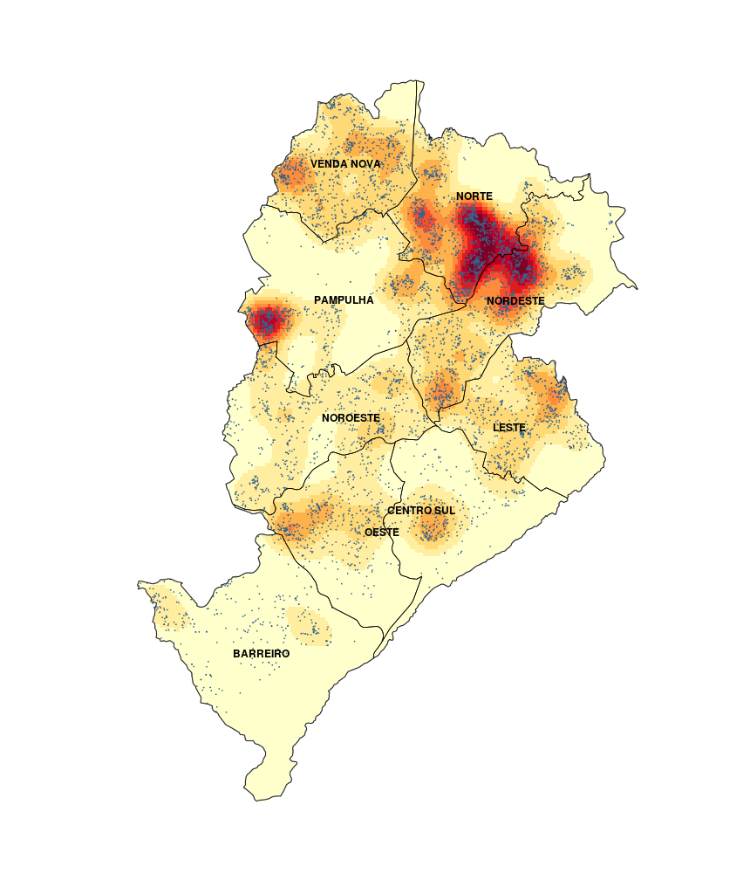{width=80%}


**- Detection and modelling of case clusters for urban leptospirosis:**

{width=100%}

[Fonte: Tassinari et al. (2008)](http://www6.ensp.fiocruz.br/repositorio/sites/default/files/arquivos/DetectionModelling.pdf).


**- Spatial distribution of leptospirosis in the city of Rio de Janeiro, Brazil, 1996-1999:**


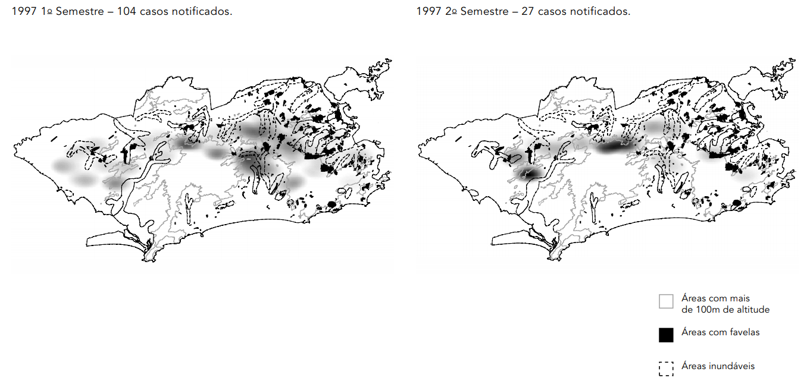{width=100%}

[Fonte: Tassinari et al. (2004)](http://www.scielo.br/pdf/csp/v20n6/31.pdf)


## Geoestatı́stica

- São dados que compreendem um conjunto de localizações (em geral latitudes e longitudes), mas agregados a eles uma medida contínua, como por exemplo o volume de chuva.

- Neste caso estaremos interessados em entender o padrão nos valores amostrados nestas localizações e também modelar e estimar valores em localizações não medidas.

- Bastante utilizada em ciências ambientais (chuva, temperatura, umidade, poluentes no ar, etc.)

- Exemplo: Mapa sobre o teor de argila no solo.

 {width=90%}


- Krigagem da chuva no Rio de Janeiro


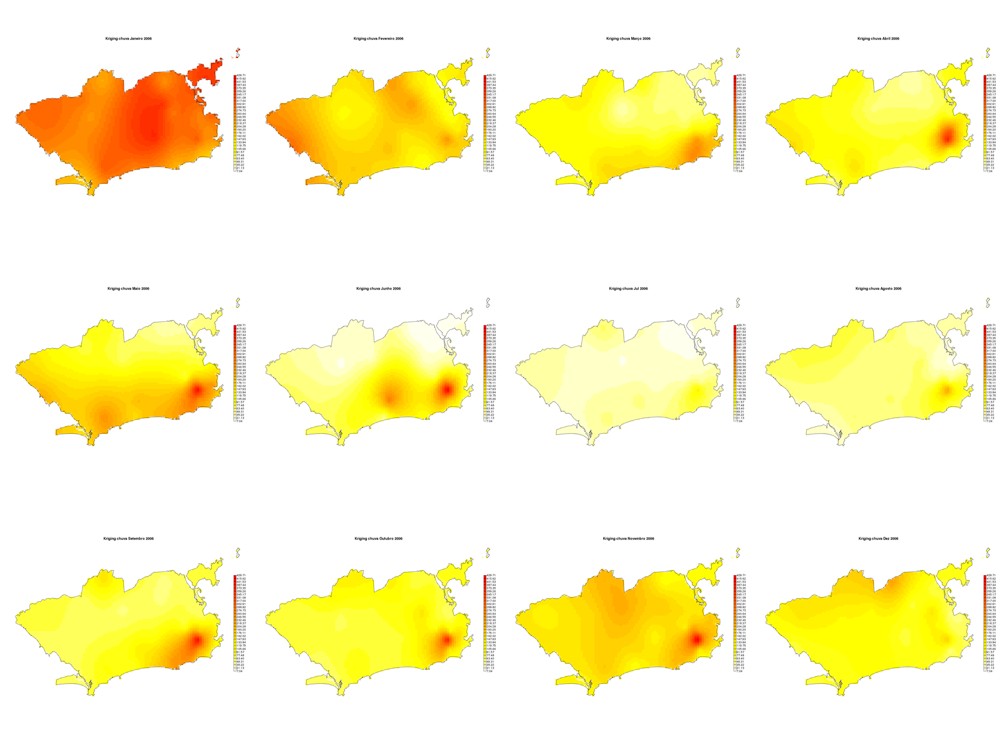
[Fonte: Teixeira e Cruz (2011)](http://www.scielo.br/pdf/csp/v27n3/19.pdf)


## Dados de Área

- Este tipo de dado pode ser visualizado em mapas onde o espaço é particionado em áreas e cada área é colorida de acordo com alguma variável.

- As áreas podem ser:

    - Irregulares: divisões de caráter polı́tico ou administrativo. Por exemplo: municípios, setores censitários, etc.
    - Regulares: medidas em grade regular. Por exemplo, imagens de satélite.
    
- Para cada uma destas áreas temos informações agregadas de um determinado fenômeno (em geral somas ou médias).

- Bastante utilizados em epidemiologia, economia e demografia, etc.
 
**Objetivo:** Identificar áreas de risco.

\

**-Taxas de câncer de pulmão na população branca masculina nos Estados Unidos, por condados no ano de 1998:**


{width=70%}


 
\


## Geoprocessamento
 
- Geoprocessamento é um conjunto de técnicas , softwares e hardware  capazes de coletar , tratar , analisar e disseminar informações georreferenciadas  permitindo  o desenvolvimento de novos dados, analises e aplicações;

- Utiliza programas de computador que permitem o uso integrado de informações cartográficas (mapas, cartas topográficas , imagens de satélites etc...) e informações tabulares (dados alfanumericos) e possibilita  se associar coordenadas desses dados a mapas ;

- Duas das principais  ferramentas de geoprocessamento são os Sistema de Informações Geográficas (SIG) e o  Sensoriamento Remoto (SR) 

- Este curso não vai abordar a tecnologias de Sensoriamento  Remoto ainda que exista a possibilidade, cada vez maior  de se integrar todas as técnicas usando o R. 

 {width=50%}


## Tecnologias de Geoprocessamento
 
  {width=100%}


## Sistema de Informações Geográficas
 

- Um Sistema de Informação Geográfica (SIG ou GIS - Geographic Information System) é um sistema de hardware, software, informação espacial e procedimentos computacionais que permite e facilita a análise, gestão ou
representação do espaço e dos fenômenos que nele ocorrem.


  {width=70%}


### QGIS
 
  {width=100%}


\

https://qgis.org/pt_BR/site/

\

  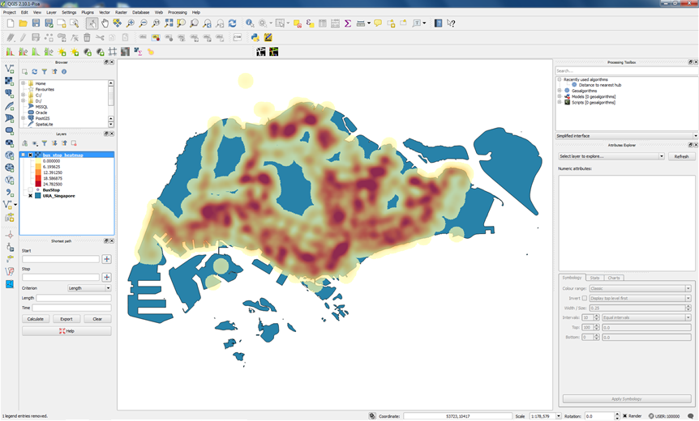{width=100%}

 


## Análise Espacial no R

[CRAN Task View: Analysis of Spatial Data](https://cran.r-project.org/web/views/Spatial.html)


## Alguns Conceitos

### Autocorrelação espacial

- É uma medida estatística que quantifica e testa o grau de dependência entre observações no espaço.

    - Caso haja evidência de estrutura espacial, o postulado de independência das amostras, é inválido.
    
    - Nestes casos os modelos de regressão devem levar em conta explicitamente o espaço em suas formulações.
    
    - Dados espaciais são considerados uma única realização de um processo estocástico. Diferente da amostragem tradicional, em que cada observação traz uma informação independente, todas as observações são utilizadas de forma conjunta para descrever o padrão do fenômeno estudado.

### Estacionariedade

- O processo é estacionário se a média é constante e a covariância entre dois pontos quaisquer é função apenas da distancia entre as duas localizações.


### Isotropia

- O processo é isotrópico se além de estacionário, a covariância depende somente da distância entre as localizações.

\

## Aplicações

### Dengue em Dourados

  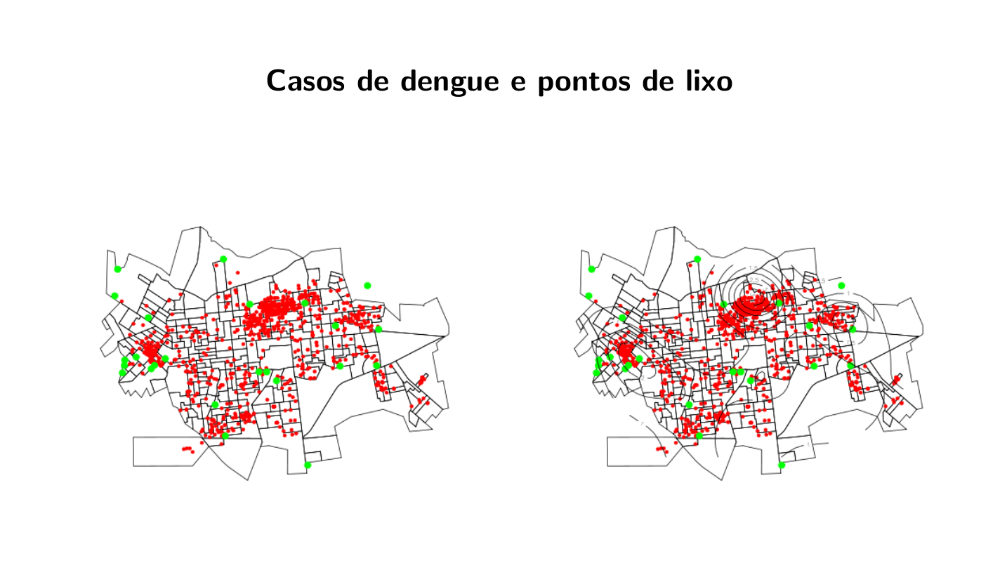{width=100%}


  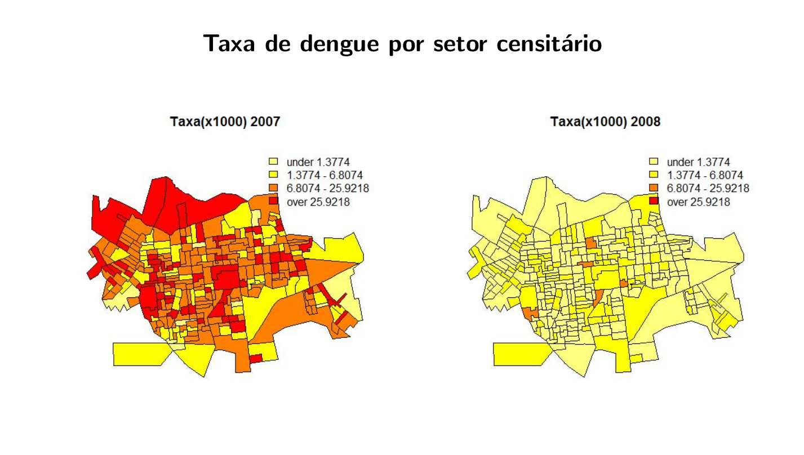{width=100%}


  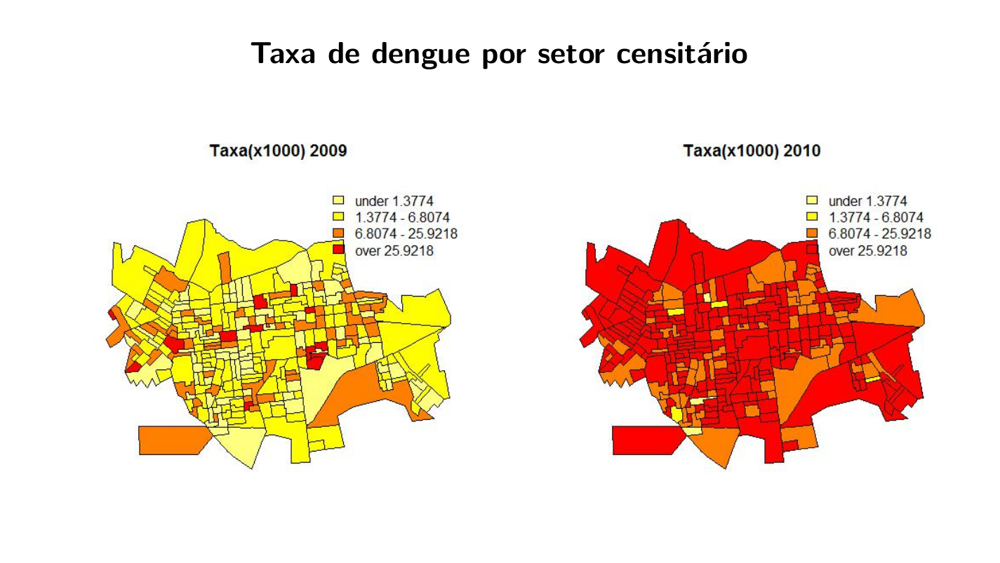{width=100%}


### Vigilância dos vetores da Dengue usando modelagem espaço-temporal Bayesiana

  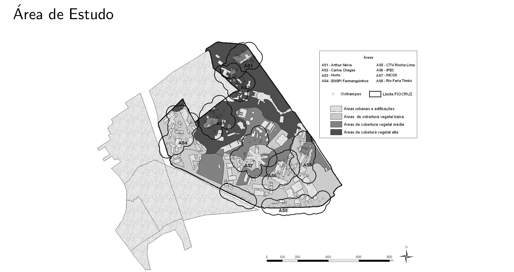{width=100%}


  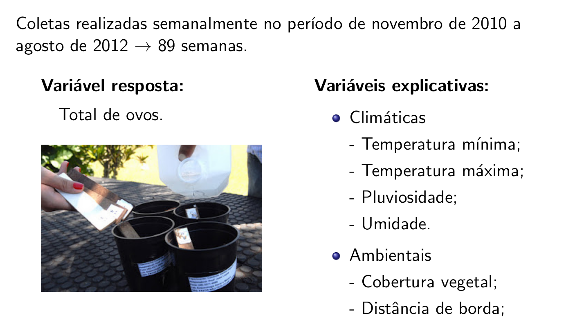{width=100%}


  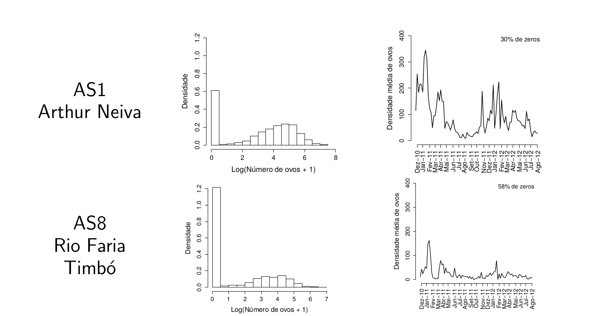{width=100%}


  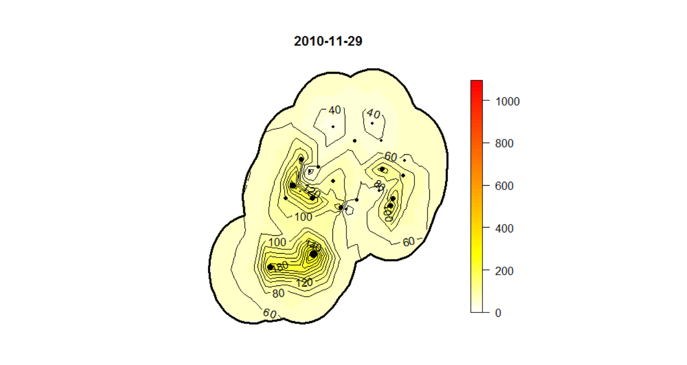{width=100%}


### Modelo Espaço-Temporal para a Análise da Morbimortalidade por Influenza

  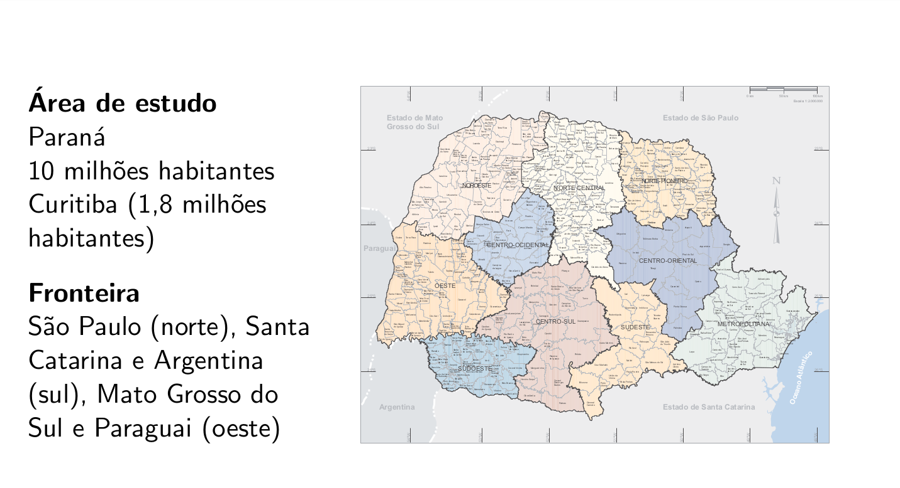{width=100%}


- **Fonte de dados:** Sistema Nacional de Informação de Agravos de Notificação (SINAN) do Ministério da Saúde, Brasil.

- **Desfecho:** Casos confirmados e autóctones de influenza A (H1N1) de 5 de abril a 26 de setembro de 2009.

- **Nı́vel de agregação espacial:** Município de residência (399)

- **Nı́vel de agregação temporal**: Semana epidemiológica (25)

- **Covariáveis:** Precipitação, temperatura (mı́nima e máxima), umidade relativa do ar, altitude, taxa de pobreza, IDH municipal, densidade demográfica e presença dos principais meios de transporte (ônibus municipal, ônibus intermunicipal, barco e avião).

  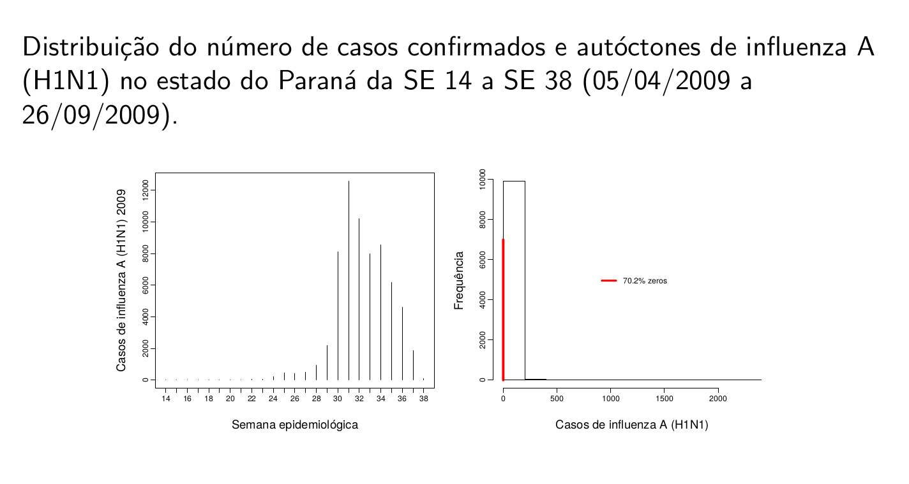{width=100%}


  {width=100%}


  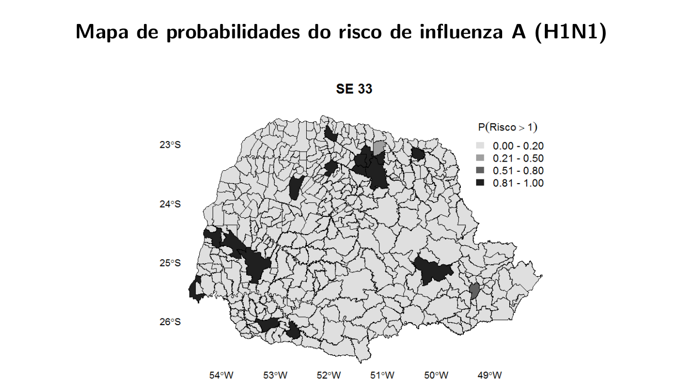{width=100%}


  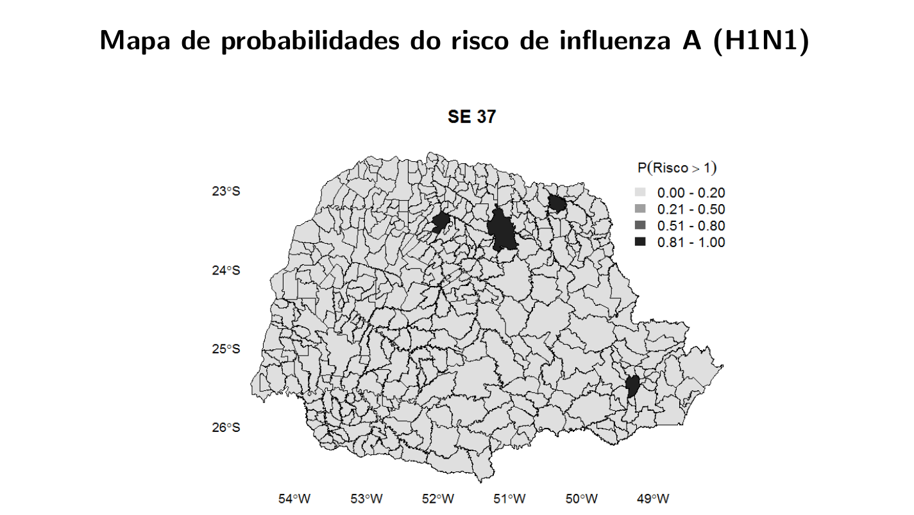{width=100%}


### Análise da temperatura na costa central da Califórnia

- Os dados consistem de medidas mensais de temperatura em graus
centı́grados em 23 estações monitoradoras localizadas na 5 a Região
Climática da Califórnia.

- As séries temporais correspondem ao perı́odo de janeiro de 1992 a
dezembro de 2002.

- A altitude para cada uma das estações também estava disponı́vel.

  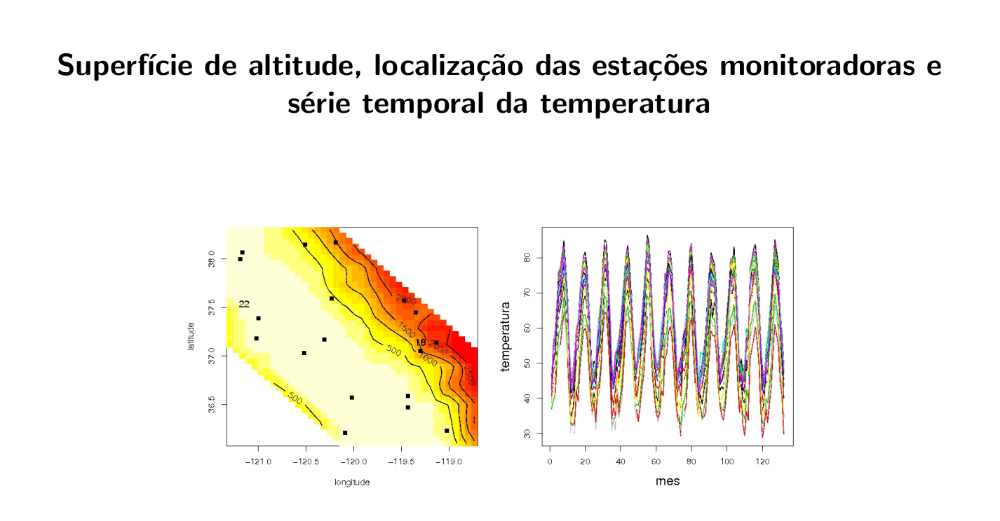{width=130%}


- A estrutura de média foi modelada usando um nı́vel variando ao longo do tempo, uma componente sazonal e um termo linear para a altitude.

  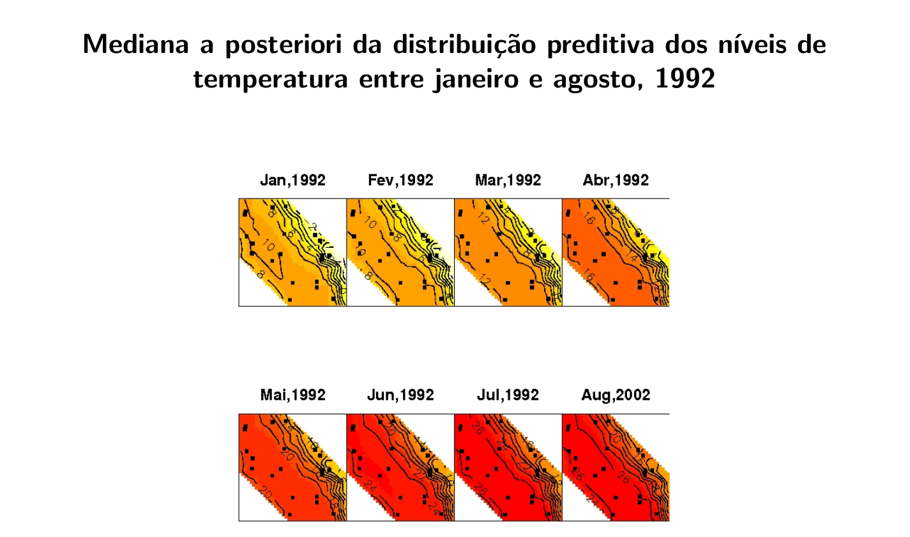{width=130%}


### A Relação entre a Malária e a Chuva no Estado do Pará: Uma Análise Espaço-Temporal.

**Objetivos:**

- Estudar as similaridades/diferenças entre as ocorrências de malária no Pará;

- Estudar a relação entre a incidência de malária e a quantidade de chuva;

- Verificar existência de estrutura espacial e temporal.

**Material:**

- As informações deste trabalho referem-se ao número de casos de malária em alguns municı́pios do estado do Pará através de dados mensais coletados durante os anos de 96 à 98.

- Os dados de chuva são dados mensais observados durante os anos de 96 a 98 coletados em 78 estações monitoradoras espalhadas pelos municı́pios.


  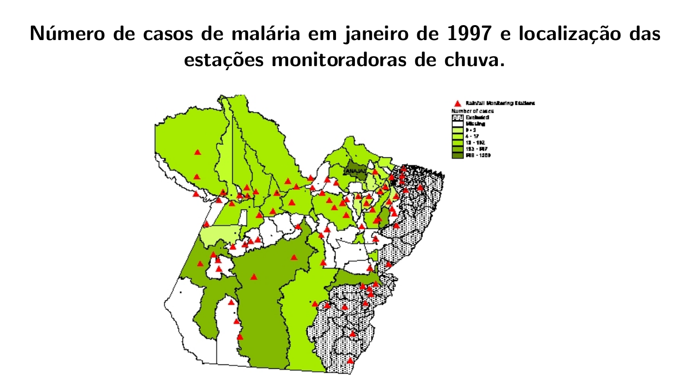{width=100%}


  {width=100%}


  {width=100%}


### Modelagem espaço temporal da Chikungunya  no município do Rio de Janeiro 


**- Spatio-temporal modelling of the first Chikungunya in Rio de Janeiro:**

<video width="800"  controls>
  <source src="video/video2.mp4" type="video/mp4">
</video>


[Fonte: Freitas et al. (2020)](https://doi.org/10.1101/2020.06.08.20125757)


### Mapas de Fluxo

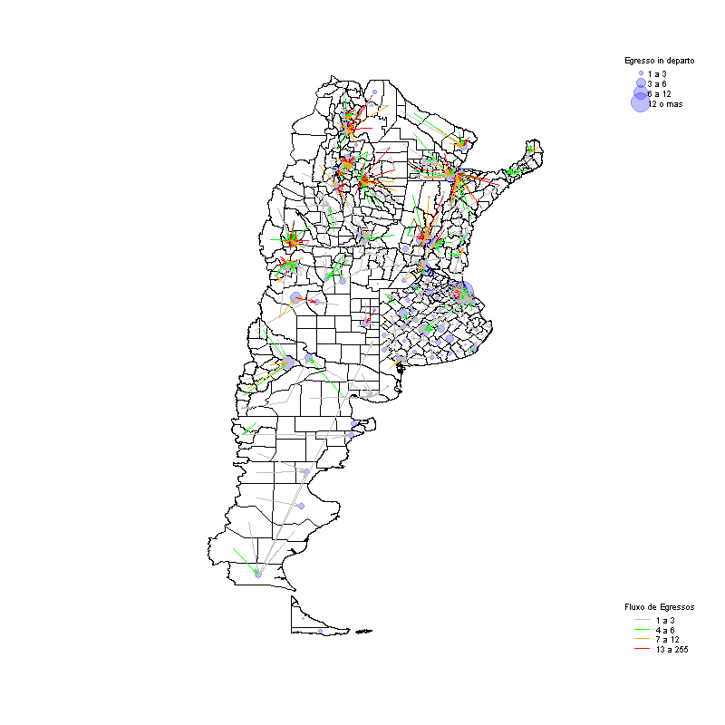

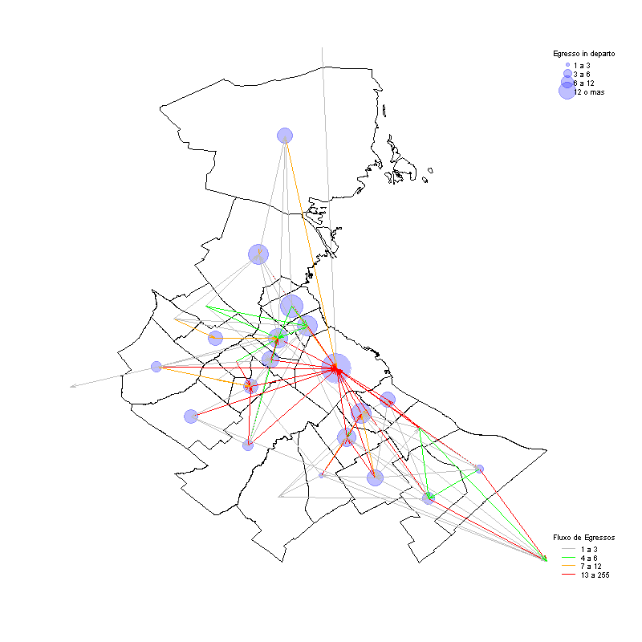
Fonte: Dissertação “Análisis espacial de factores socioeconómicos, de servicios de salud y de mortalidad por cáncer de mama, Argentina, 2009-2011” por Andrea Perinetti.


## Material on line sobre Estatística Espacial

**Análise Espacial de Dados Geográficos**

http://www.dpi.inpe.br/gilberto/livro/analise/

**R Spatial**

https://www.r-spatial.org/

**Geocomputation with R**

https://bookdown.org/robinlovelace/geocompr/


## Onde encontrar dados espaciais ?

#### Malhas Digitais Nacionais 

- [IBGE: Malhas territoriais](https://www.ibge.gov.br/geociencias/organizacao-do-territorio/malhas-territoriais.html)

- [IBGE: Portal de mapas](https://portaldemapas.ibge.gov.br/)

- [IpeaGeo: Malhas](https://www.ipea.gov.br/ipeageo/malhas.html)

- [INDE: Infraestrutura Nacional de Dados Espaciais](https://visualizador.inde.gov.br/)

- [portal Dados Abertos](https://dados.gov.br/dataset?tags=Geoespacial&groups=saude)

#### Agregadores de Links e Bases

- [LabGIS UERJ](https://www.labgis.uerj.br/fontes_dados.php)

- [GeoAplicada](https://www.geoaplicada.com/download-dados-espaciais/)

- [ForestGIS](https://forest-gis.com/download-de-shapefiles/)


## Bibliografia sugerida

Bailey, Trevor C.; Gatrell, Anthony C. (1995) Interactive Spatial Data Analysis. Harlow Essex: Longman.

Cressie, N. A. C. (1991). Statistic for Spatial Data. New York.

Costa, Ana C. C., et al. (2015). Surveillance of dengue vectors using spatio-temporal Bayesian modeling. BMC medical informatics and decision making 15.1: 93.

Sansó, B., Schmidt, A. M. e Nobre, A. A. (2008). Bayesian Spatio-temporal models based on discrete convolutions. Canadian Journal of Statistics, 36, 239-258.

Nobre, A. A., Schmidt, A. M. e Lopes, H. F. (2005). Spatio-temporal models for mapping the incidence of malaria in Pará. Environmetrics, 16, 291-304.

Pfeiffer, D. U., et al. (2008) Spatial Analysis in Epidemiology. Oxford University Press. 


# Padrões Pontuais I

## O que são Padrões Pontuais?

A análise de padrão de pontos é o tipo mais simples de análise de dados espaciais. Baseia-se na localização dos eventos em um determinada área de estudo a partir das coordenadas. O objetivo é estudar a disposição espacial dos pontos a partir de suas coordenadas.

- Os processos pontuais são definidos como um conjunto de pontos cuja localização está em $R^2$, sendo esse processo gerado por um mecanismo estocástico.

- Os pontos são os pares de coordenadas *(x, y)*, que representam os eventos (observações, indivíduos, lugares ou qualquer outro objeto discreto definido no espaço).

| Evento | Coord X | Coord Y |
| :----: | :-----: |:-----: |
|   1    |  4,30   | 2,45    |
|   2    |  5,39   | 3,35    |
|   3    |  4,10   | 3,50    |


- Em geral o  que se deseja é verificar a ocorrência de padrões espaciais nos pontos e se estão aglomerados espacialmente (*clusters*) ou se estão aleatoriamente distribuídos .

No exemplo abaixo temos os pontos dos casos suspeitos em uma investigação de surto de hepatite A no Rio de Janeiro no verão de 2017/2018. As estrelas amarelas mostram locais onde foi encontrado o vírus da hepatite A (HAV) em amostras de água. 

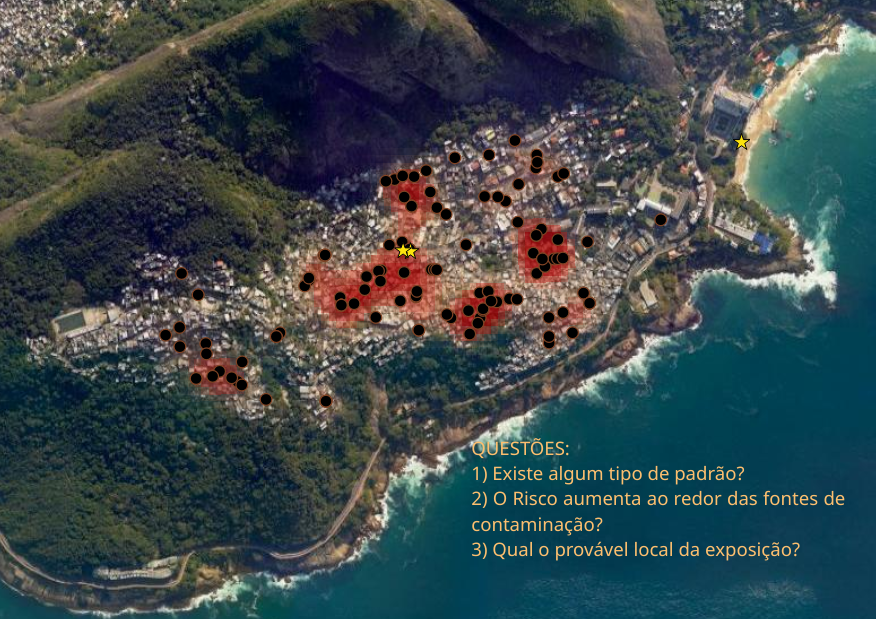{width=100%}


## Tipos de Distribuições 

- **Aleatória**: qualquer ponto tem a mesma probabilidade de ocorrer em qualquer local e a posição de qualquer ponto não é afetada pela posição de qualquer outro ponto;

- **Uniforme**: cada ponto é tão longe de todos os seus vizinhos quanto possível;

- **Cluster**: Muitos pontos estão concentrados juntos, e grandes áreas podem conter pouquíssimos pontos, se houver algum.

{width=70%}

[Fonte: Geospatial Training Workshop](https://training.fws.gov/courses/references/tutorials/geospatial/CSP7304/)

Lendo os bancos com as localizações dos casos de homicídios, suicídios e acidentes de carro em Porto Alegre/RS.

As principais bibliotecas do **R** que estaremos usando nos exemplos abaixo são:

- `splancs`
- `spatstat`


```r
library(splancs)
library(spatstat)
library(gpclib)

# lendo os bancos
local <- "https://gitlab.procc.fiocruz.br/oswaldo/eco2019/raw/master/dados/"

homic <- read.table(paste0(local, "homic.dat"), col.names = c("x", 
    "y"))
suic <- read.table(paste0(local, "suic.dat"), col.names = c("x", 
    "y"))
acid <- read.table(paste0(local, "acid.dat"), col.names = c("x", 
    "y"))

# Plotando os casos de homicídios em um plano
# cartesiano
plot(homic$x, homic$y)
```

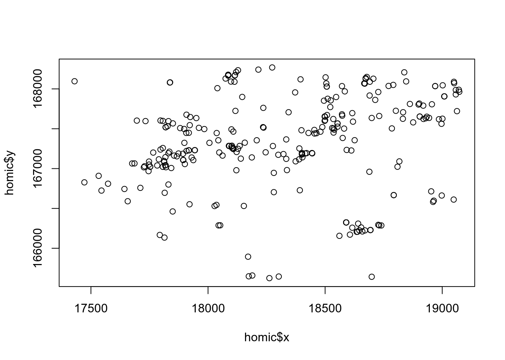

\

Porto Alegre é uma cidade disposta ao longo do eixo norte/sul. O grafico perdeu a estrutura espacial, ajustando para o tamanho e forma da janela. Por isso é necessario informar ao programa que este tipo de objeto tem uma escala que deve ser preservada, um objeto do tipo *spatial point pattern*.


```r
homic.spp <- as.points(homic)
acid.spp <- as.points(acid)
suic.spp <- as.points(suic)

# Mapa
pointmap(homic.spp, pch = 19)

# Adicionando no mapa as outras causas externas

pointmap(suic.spp, add = T, pch = 19, col = 2)
pointmap(acid.spp, add = T, pch = 19, col = 3)
```

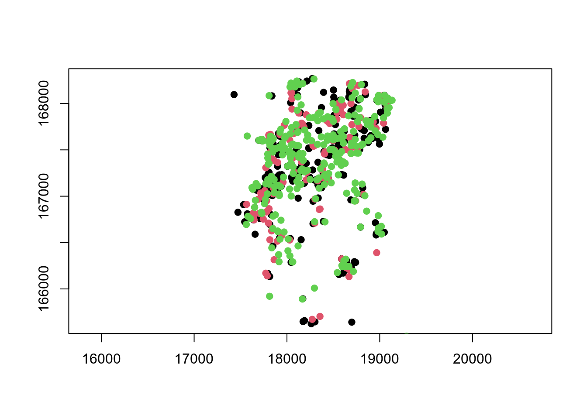

\

Importando o polígono do contorno de Porto Alegre:


```r
# contorno de porto alegre
contorno.poa <- as.points(read.table(paste0(local, 
    "/contpoa.dat"), col.names = c("x", "y")))

polymap(contorno.poa)
pointmap(homic.spp, pch = 19, add = T, cex = 0.5)
pointmap(suic.spp, pch = 19, add = T, col = 2, cex = 0.5)
pointmap(acid.spp, pch = 19, add = T, col = 3, cex = 0.5)
```

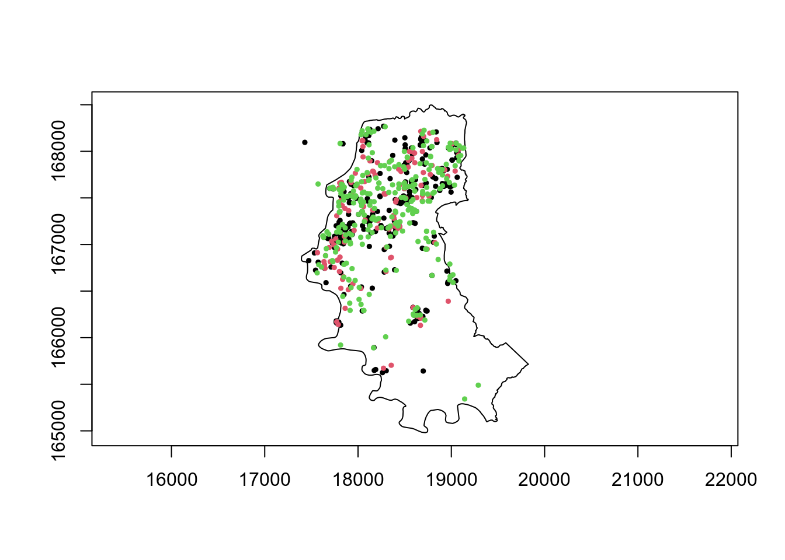

\

Os pontos fora do contorno sao das ilhas, não devem ser incorporados a análise.


```r
homic2.spp <- delpoints(homic.spp)
```

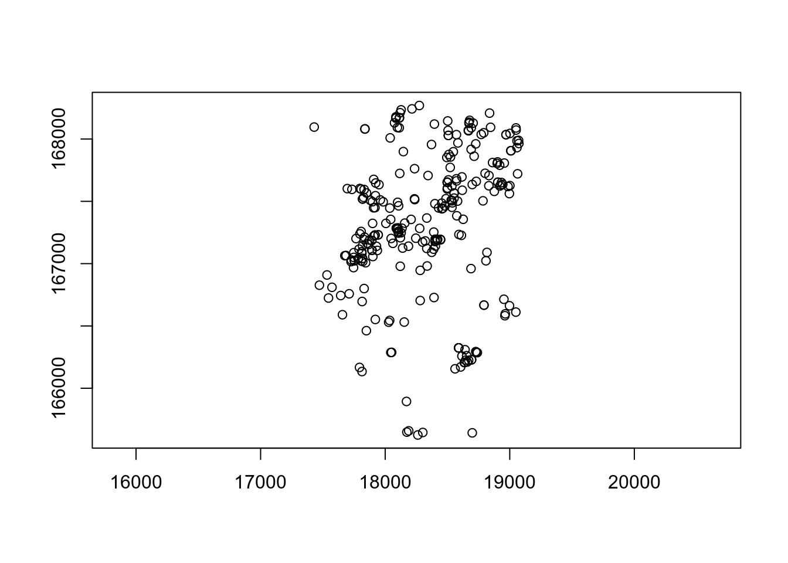


\

Este comando é igual ao `identify`, clique em cada ponto que deseja deletar. Para terminar, clique 2 vezes com o botão da direita.


```r
polymap(contorno.poa)
pointmap(homic2.spp, pch = 19, add = T, cex = 0.5)
```

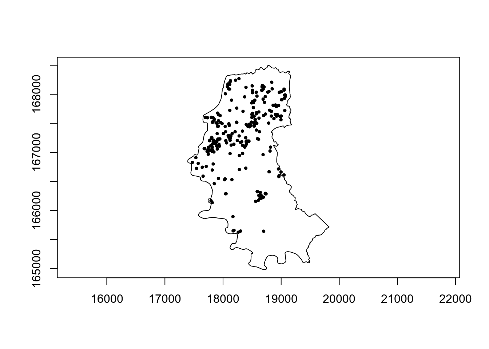


## Processos pontuais 
 
Os processos pontuais podem ser descritos como:

i) **Processo de primeira ordem**, considerados globais ou de larga escala, que correspondem a variações no valor médio do processo no espaço. 
    
  - Tal processo pode ser representado por mensurações da intensidade baseado na densidade dos pontos (média dos eventos) na área de estudo (ex: Estimativa de Kernel).
    
    
ii) **Processo de segunda ordem**, denominados locais ou de pequena escala, é o processo representado pela interação entre dois pontos arbitrários. 
    
  - O objetivo desse processo é a mensuração da dependência espacial baseado na distância entre os pontos (ex: Vizinhos mais próximos, Função K).
    

## Completa Aletoriedade Espacial  (*CSR - complete spatial randomness*)

$H_0$: Os pontos estão distribuidos aleatoriamente no espaço

$H_1$: Os pontos podem formar clusters ou estão dispersos no espaço


- *CSR* assume que os pontos seguem um processo homogêneo de Poisson na área de estudo.

  <!-- - A densidade dos pontos é constante homogênea ao longo da área de estudo; -->

  <!-- - Para uma amostra aleatória de subregiões, a distribuição da frequência do número de pontos em cada região segue uma distribuição de poisson; -->

<!--     - O número de pontos em uma dada subregião e o mesmo para todas as subregiões na área de estudo; -->

   <!-- - O número de pontos na subregião, independe do número de pontos em qualquer outra subregião. -->
    

Simulando alguns padrões dos dados de ponto, temos o seguinte:

- Simulando os processo espaciais:


```r
set.seed(9999)
# Criando uma caixa envoltória
caixa <- rbind(c(0, 0), c(0, 1), c(1, 1), c(1, 0), 
    c(0, 0))

# Simulando um processo espacial aleatório csr
# significa 'complete spatial randomness'
alea.spp <- csr(caixa, 100)

# Processo de poisson clusterizado
clu.spp <- pcp.sim(rho = 20, m = 10, s2 = 0.005, region.poly = caixa)
# rho= intensidade do processo de poisson
# 'pai'(gerador) m=media s2=variancia

# Distribuição regular
uni.spp <- jitter(gridpts(caixa, 100), 2)
# o comando jitter cria uma flutuação aleatória
# sobre os valores o comando gridpts gera uma grade
# regular 2 é o fator de confusão adicionado ao
# grid regular
```


```r
par(mfrow = c(1, 3))
plot(alea.spp, main = "Aleatório")
plot(uni.spp, main = "Regular")
plot(clu.spp, main = "Agregado")
```

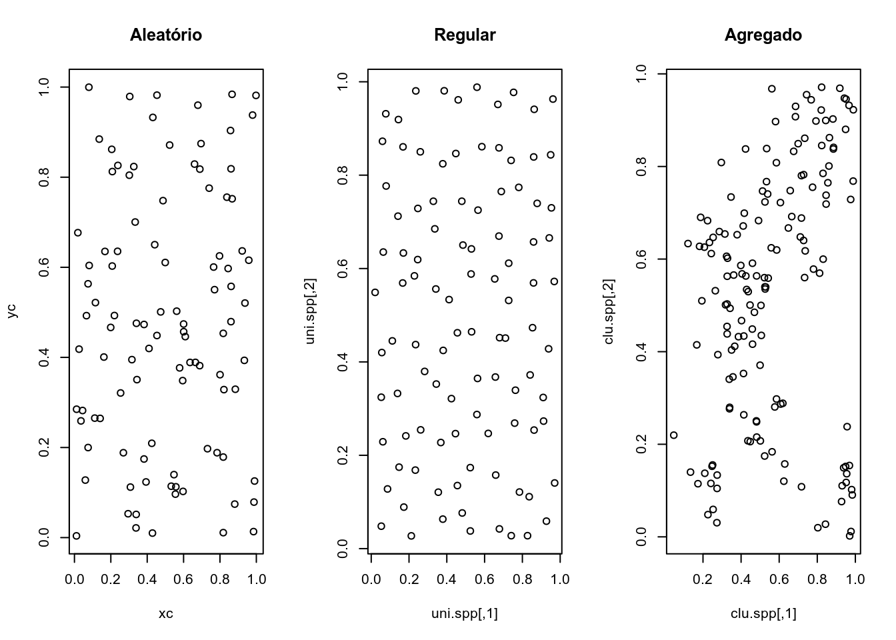

\

Verificando a distribuição dos pontos por quadrantes: 


```r
# Convertendo para a class ppp
library(spatstat)

alea.ppp <- as.ppp(alea.spp, c(0, 1, 0, 1))
uni.ppp <- as.ppp(uni.spp, c(0, 1, 0, 1))
clu.ppp <- as.ppp(clu.spp, c(0, 1, 0, 1))

# Construindo os quadrantes com as respectivas
# contagens
aleatorioQ <- quadratcount(alea.ppp, nx = 4, ny = 4)
regularQ <- quadratcount(uni.ppp, nx = 4, ny = 4)
agregadoQ <- quadratcount(clu.ppp, nx = 4, ny = 4)


par(mfrow = c(1, 3))
plot(aleatorioQ, main = "Aleatório")
plot(alea.ppp, add = TRUE)

plot(regularQ, main = "Regular")
plot(uni.ppp, add = TRUE)

plot(agregadoQ, main = "Agregado")
plot(clu.ppp, add = TRUE)
```


\

Testando a Completa Aletoriedade Espacial (*CSR - complete spatial randomness*):


```r
quadrat.test(aleatorioQ)
```

```

	Chi-squared test of CSR using quadrat counts

data:  
X2 = 12, df = 15, p-value = 0.6
alternative hypothesis: two.sided

Quadrats: 4 by 4 grid of tiles
```


```r
quadrat.test(agregadoQ)
```

```

	Chi-squared test of CSR using quadrat counts

data:  
X2 = 93, df = 15, p-value = 5e-13
alternative hypothesis: two.sided

Quadrats: 4 by 4 grid of tiles
```


```r
quadrat.test(regularQ)
```

```

	Chi-squared test of CSR using quadrat counts

data:  
X2 = 2.4, df = 15, p-value = 2e-04
alternative hypothesis: two.sided

Quadrats: 4 by 4 grid of tiles
```


---


## Estimativa de Kernel

Uma análise exploratória de um processo pontual geralmente é iniciada pela estimação da intensidade de ocorrências do processo em toda a região em estudo. Com isso, gera-se uma superfície cujo valor é proporcional à intensidade de eventos por unidade de área.

O estimador Kernel é um interpolador, que possibilita a estimação da intensidade do evento em toda a área, mesmo nas regiões onde o processo não tenha gerado nenhuma ocorrência real.

Essa técnica de alisamento, utiliza janela móvel que, para cada área, estima um peso variável conforme a distância.

O objetivo é de estimar a intensidade do processo pontual $=$ número de eventos por unidade de área.


{width=100%}

$$\hat{\lambda}(s) = \sum\limits_{i=1}^{n} \dfrac{1}{\tau^2} K \left( \frac{(s - s_i)}{\tau} \right) \nonumber$$

Sendo:

- $\hat{\lambda}(s)$ o valor estimado por área;

- A função $K(\bullet)$ uma FDP, escolhida de forma adequada para construir uma superfície contínua sobre os dados;

- O parâmetro $\tau$ denominado "largura de banda ou faixa" (*bandwidth*), controla a suavização da superfície gerada;

- $s$ o centro da área, representado por uma localização qualquer na área de estudo;

- $s_i$ as localizações dos eventos observados;

- $n$ o número de pontos (eventos).

{width=100%}


<!-- - Foi desenvolvida originalmente para obter uma estimação alisada -->
<!-- da densidade de probabilidade uni ou multivariada, ou um -->
<!-- histograma alisado. -->

<!-- - Estimar a intensidade de pontos dispostos no espaço é semelhante a estimar uma densidade de probabilidade bivariada. -->


### Estimativa de Kernel com correção por bordas

Primeiramente calcula-se o volume sob o Kernel que está de fato dentro da região de estudo.

$$\delta_{\tau}(s) = \int_{R}\dfrac{1}{\tau^2}k \left( \dfrac{(s-u)}{\tau}\right) du$$

Aplicando a correção das bordas, obtém-se um estimador corrigido:

$$\hat{\lambda}(s) = \dfrac{1}{\delta_{\tau}(s)} \sum\limits_{i=1}^{n} \dfrac{1}{\tau^2} K \left( \frac{(s - s_i)}{\tau} \right) \nonumber$$

**Exemplo:**


```r
# Analisando o efeito de primeira ordem: variação
# da intensidade kernel quartico

alea.ker <- kernel2d(alea.spp, caixa, h0 = 0.1, nx = 100, 
    ny = 100)
clu.ker <- kernel2d(clu.spp, caixa, h0 = 0.1, nx = 100, 
    ny = 100)
uni.ker <- kernel2d(uni.spp, caixa, h0 = 0.1, nx = 100, 
    ny = 100)

par(mfrow = c(1, 3))
image(alea.ker, col = gray(32:0/32), main = "Aleatório")
pointmap(alea.spp, add = T, pch = 19, col = "red")

image(uni.ker, col = gray(32:0/32), main = "Regular")
pointmap(uni.spp, add = T, pch = 19, col = "red")

image(clu.ker, col = gray(32:0/32), main = "Cluster")
pointmap(clu.spp, add = T, pch = 19, col = "red")
```

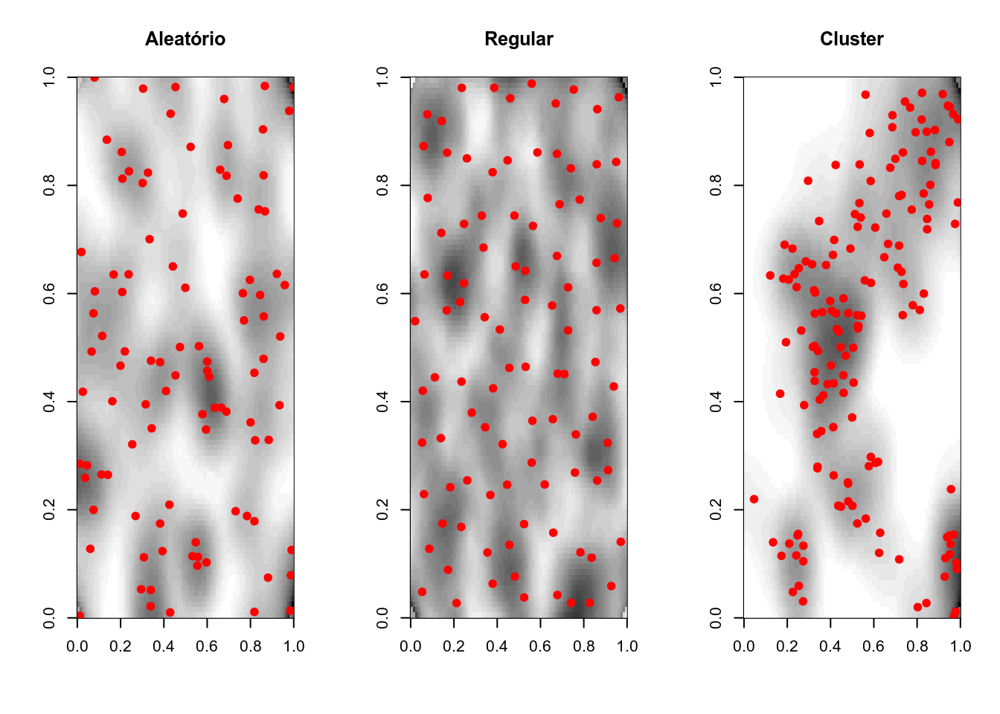

\

Alterando a largura de banda de forma exploratória para os dados clusterizados:


```r
clu.ker <- kernel2d(clu.spp, caixa, h0 = 0.05, nx = 100, 
    ny = 100)
clu.ker1 <- kernel2d(clu.spp, caixa, h0 = 0.2, nx = 100, 
    ny = 100)
clu.ker2 <- kernel2d(clu.spp, caixa, h0 = 0.5, nx = 100, 
    ny = 100)


par(mfrow = c(1, 3))
image(clu.ker, col = gray(32:0/32), main = "Cluster - Tau = 0.05")
pointmap(clu.spp, add = T)
image(clu.ker1, col = gray(32:0/32), main = "Cluster - Tau = 0.2")
pointmap(clu.spp, add = T)
image(clu.ker2, col = gray(32:0/32), main = "Cluster - Tau = 0.5")
pointmap(clu.spp, add = T)
```

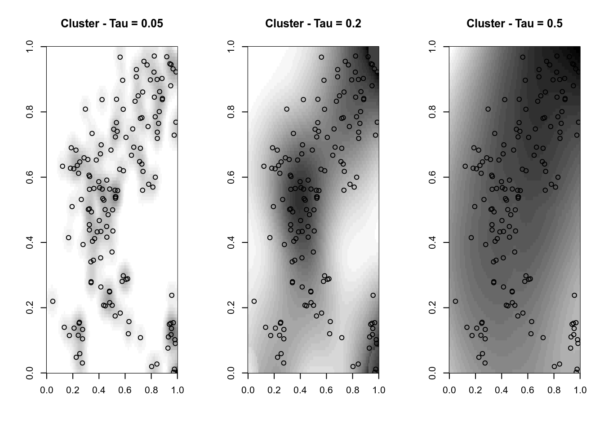

\

Passando as linhas de contorno nos exemplos com Tau=0.1:


```r
par(mfrow = c(1, 3))
image(alea.ker, col = gray(32:0/32), main = "Aleatório")
contour(alea.ker, add = T)

image(uni.ker, col = gray(32:0/32), main = "Regular")
contour(uni.ker, add = T)

image(clu.ker, col = gray(32:0/32), main = "Cluster")
contour(clu.ker, add = T)
```

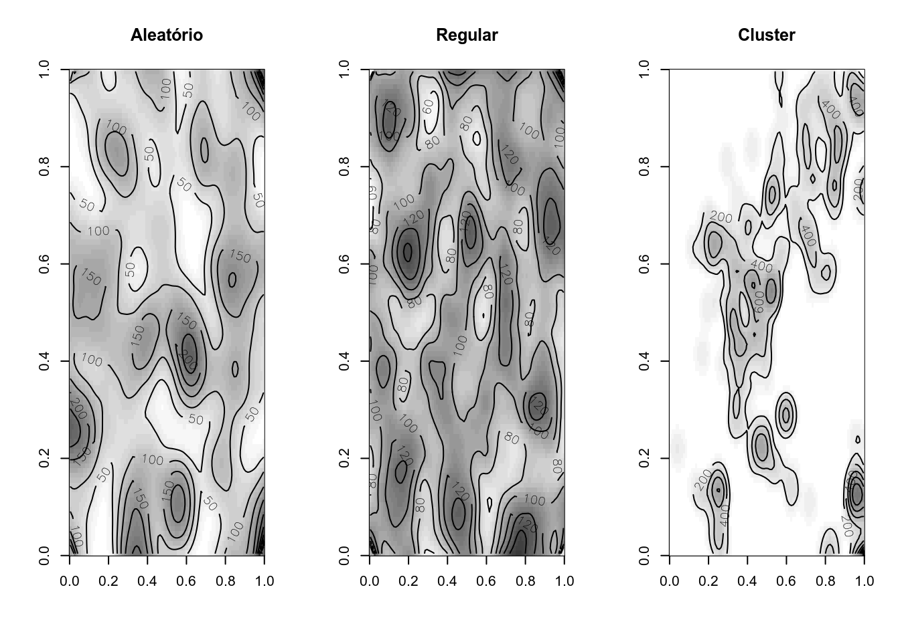

Visualizando a superfície do Kernel em 3D:


Clique [AQUI para explorar interativamente a perspectiva em 3D](teste3d.html)

\

Estimando a largura de banda ótima:


```r
# Mean Square Error for a Kernel Smoothing - Mse
Mse2d <- mse2d(clu.spp, caixa, nsmse = 20, range = 0.2)
plot(Mse2d$h, Mse2d$mse, type = "l", xlab = "h", ylab = "Mse")
```

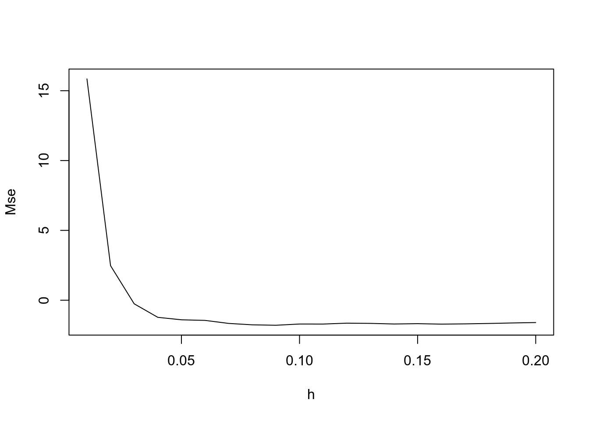

O valor de **h** que apresenta o menor Erro Quadrático Médio (MSE) é de 0.09.

<!-- Oswaldo: Fazer figura com valor sugerido -->


```r
clu.ker.mse <- kernel2d(clu.spp, caixa, h0 = 0.09, 
    nx = 100, ny = 100)
```

Xrange is  0 1 
Yrange is  0 1 
Doing quartic kernel

```r
par(mfrow = c(1, 2))
image(clu.ker.mse, col = gray(32:0/32), main = "Cluster - Tau = 0.09")
pointmap(clu.spp, add = T, pch = 19, col = 2, cex = 0.4)
contour(clu.ker.mse, add = T, levels = seq(0, 500, 
    by = 100))


image(clu.ker1, col = gray(32:0/32), main = "Cluster - Tau = 0.2")
pointmap(clu.spp, add = T, pch = 19, col = 2, cex = 0.4)
contour(clu.ker1, add = T, levels = seq(0, 500, by = 100))
```

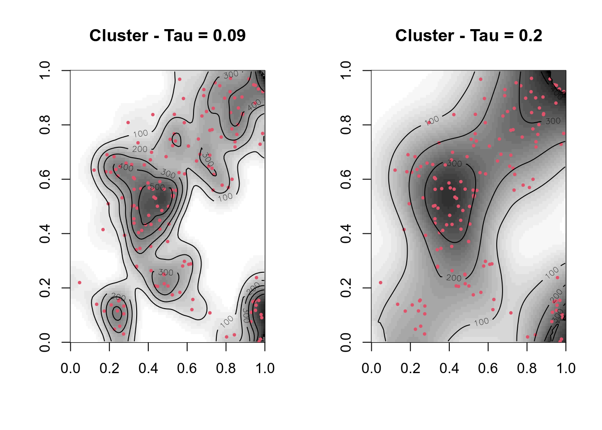

Neste caso a largura de banda sugerida pelo método MSE se mostrou mais interessante para evidenciar mais os locais com possíveis clusters, ao passo que o valor de $\tau$ de 0.20 suaviza mais, mostrando menos locais de elevação da densidade de pontos. 


## Kernel por atributo

- O alisamento utilizando o Kernel permite estimar a densidade de eventos por unidade de área. É possível, também, se usar uma covariável (atributo). 

- Como exemplo, pode-se estimar a “população por unidade de área”, e até mesmo fazer a razão entre dois Kernels obtendo uma estimativa alisada de “eventos por população”.

$$\hat{\lambda}(s) = \sum\limits_{i=1}^{n} \dfrac{1}{\tau^2} K \left( \frac{(s - s'_j)}{\tau} \right) y_i \nonumber$$
<!-- Oswaldo, conferir a formula com a descrição abaixo, pq na formula nao tem $\lambda'$. e o que é o j?-->

Sendo:

$\lambda'$ : Estimativa do atributo para unidade de área

$\tau$ : Largura de banda

$y_i$ : valor do atributo em cada ponto

Pode-se atribuir ao centróide do setor censitário ou ao centro populacional o número de habitantes de toda a área (atributo), por exemplo.


## Razão de Kernel

Vamos criar uma “taxa suavizada” a partir da divisão dos alisamentos dos eventos por unidade de área dividido pelo  alisamento da  população por unidade de área.


$$\hat{\lambda}(s) = \dfrac{\sum\limits_{i=1}^{n} \dfrac{1}{\tau^2} K \left( \frac{(s - s_i)}{\tau} \right)}{\sum\limits_{i=1}^{n} \dfrac{1}{\tau^2} K \left( \frac{(s - s'_j)}{\tau} \right) y_i} \nonumber$$

\

- Pode-se usar diferentes larguras de banda (em geral maior no denominador para estabilizar mais).

- Pode-se usar outro evento pontual como “estimador da população a risco”.

\


**Exemplo:** Comparando 2 eventos: casos clusterizados (*casos*) vs casos aleatórios (*controle*):


```r
clu.ker2 <- kernel2d(clu.spp, caixa, h0 = 0.2, nx = 100, 
    ny = 100)
clualea.ratio <- kernrat(clu.spp, alea.spp, caixa, 
    h1 <- 0.2, h2 <- 0.2, nx = 100, ny = 100)

par(mfrow = c(1, 2))
image(clu.ker2, col = gray(32:0/32), main = "Cluster")
pointmap(clu.spp, add = T, col = 2, pch = 19, cex = 0.7)

image(clualea.ratio, col = gray(32:0/32), main = "Razão Cluster/Aleatório")
pointmap(clu.spp, add = T, col = 2, pch = 19, cex = 0.7)
pointmap(alea.spp, add = T, col = 4, pch = 19, cex = 0.7)
```

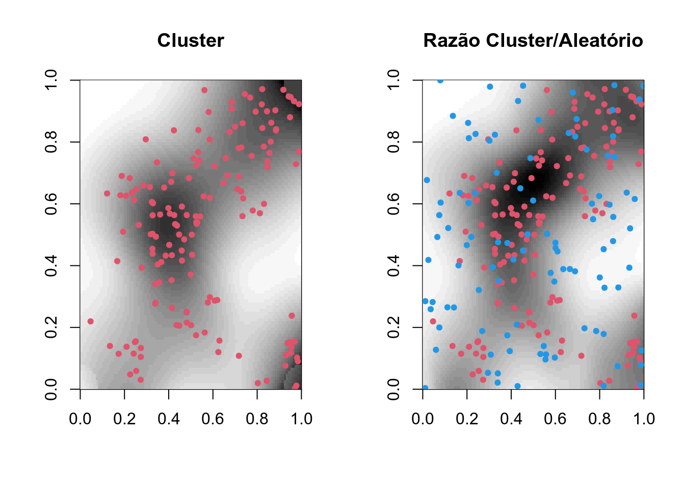


**Exemplo**: Verificando o padrão espacial de segunda ordem dos casos de homicídos em POA/RS:


```r
homicKer500 <- kernel2d(homic2.spp, contorno.poa, h0 = 100, 
    nx = 100, ny = 100)
homicKer1500 <- kernel2d(homic2.spp, contorno.poa, 
    h0 = 500, nx = 100, ny = 100)
homicKer2500 <- kernel2d(homic2.spp, contorno.poa, 
    h0 = 1500, nx = 100, ny = 100)

par(mfrow = c(1, 3))
polymap(contorno.poa, axes = FALSE)
image(homicKer500, col = gray(32:0/32), add = TRUE)
pointmap(homic2.spp, add = T, col = 4, pch = 19, cex = 0.5)
title("Homicídios - 500m")

polymap(contorno.poa, axes = FALSE)
image(homicKer1500, col = gray(32:0/32), add = TRUE)
pointmap(homic2.spp, add = T, col = 4, pch = 19, cex = 0.5)
title("Homicídios - 1500m")

polymap(contorno.poa, axes = FALSE)
image(homicKer2500, col = gray(32:0/32), add = TRUE)
pointmap(homic2.spp, add = T, col = 4, pch = 19, cex = 0.5)
title("Homicídios - 2500m")
```

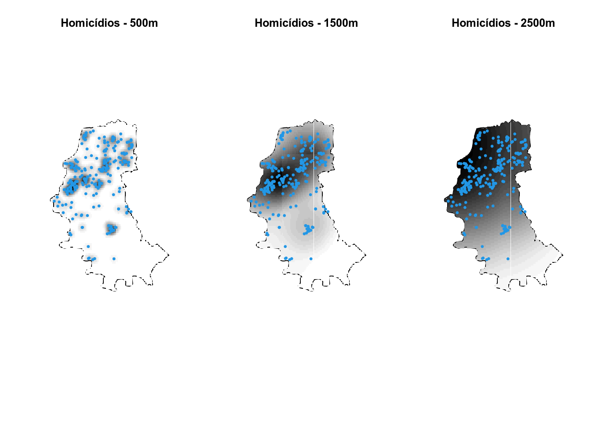


**Exemplo:** Fazendo a razão de kernel entre as causas de homicídio e suicídios de Porto alegre/RS:


```r
kernel.ratio <- kernrat(homic2.spp, suic.spp, contorno.poa, 
    h1 = 500, h2 = 750, nx = 100, ny = 100)

polymap(contorno.poa, axes = FALSE)
image(kernel.ratio, col = gray(32:0/32), add = T)
pointmap(homic2.spp, add = T, col = 2, pch = 19, cex = 0.4)
pointmap(suic.spp, add = T, col = 4, pch = 19, cex = 0.4)
title("Razao Homicidio/Suicidio")
```

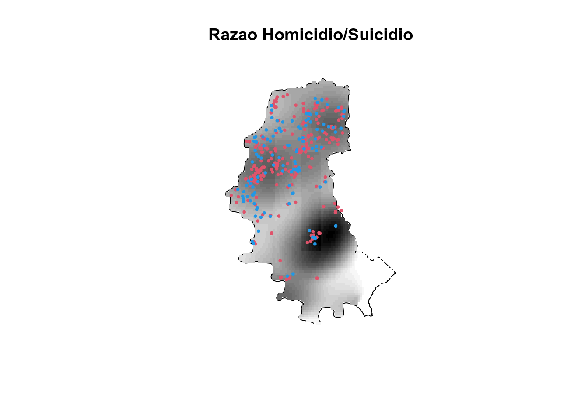

**Exemplo:** Uma outra forma de fazer o kernel para os dados de homicídio de POA/RS:


```r
## construindo a grade de interpolação
## range(contorno.poa[,1]) range(contorno.poa[,2])
bbox(contorno.poa)
```

```
     min    max
x  17393  19826
y 164981 168498
```

```r
grade <- GridTopology(cellcentre.offset = c(17393, 
    164998), cellsize = c(10, 10), cells.dim = c(239, 
    345))

## selecao de largura de banda no olho
polymap(contorno.poa)
pointmap(homic2.spp, add = T, col = 4, pch = 19, cex = 0.7)
```

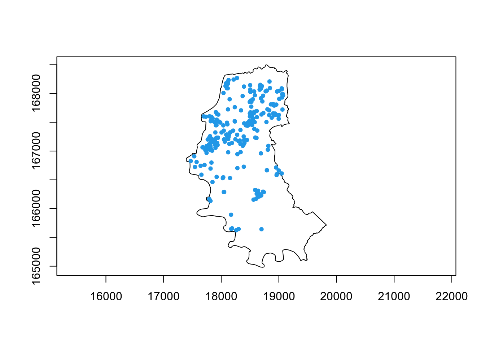

    Procure olhando nas coordenadas qual seria uma distância "razoável".
    Observe que de um extremo a outro do mapa temos 2390 (na horizontal).
    Então uma distância razoável seria...


```r
## seleção de largura de banda por mínimos quadrados
xx <- mse2d(homic2.spp, contorno.poa, nsmse = 50, range = 100)
plot(xx$h, xx$mse, type = "l", xlab = "h", ylab = "Mse")
```

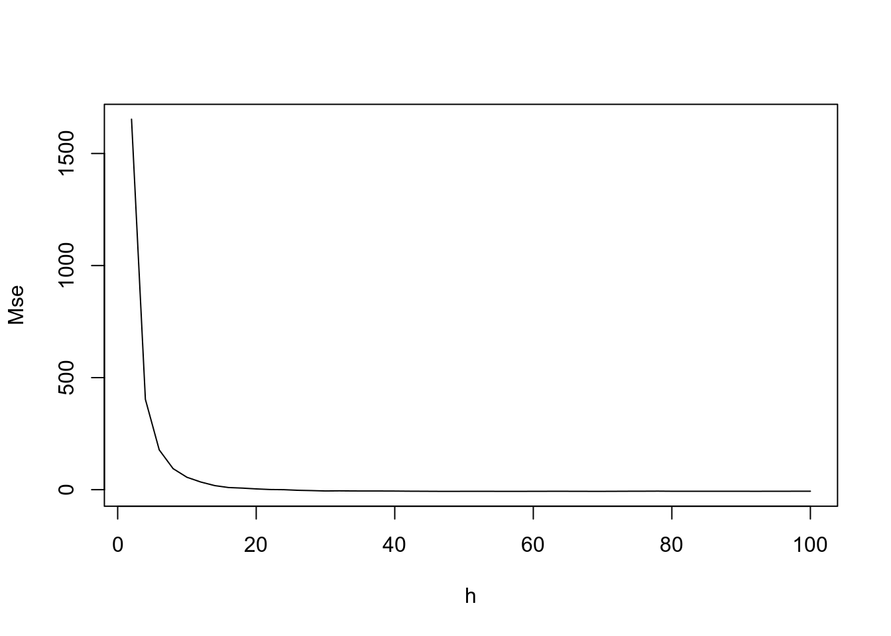


```r
homic.ker5 <- spkernel2d(homic2.spp, contorno.poa, 
    h0 = 100, grd = grade)
homic.ker10 <- spkernel2d(homic2.spp, contorno.poa, 
    h0 = 200, grd = grade)
homic.ker15 <- spkernel2d(homic2.spp, contorno.poa, 
    h0 = 500, grd = grade)
homic.ker20 <- spkernel2d(homic2.spp, contorno.poa, 
    h0 = 750, grd = grade)


df <- data.frame(ker100 = homic.ker5, ker200 = homic.ker10, 
    ker500 = homic.ker15, ker750 = homic.ker20)

kernels <- SpatialGridDataFrame(grade, data = df)

spplot(kernels, col.regions = terrain.colors(16), cuts = 15)
```

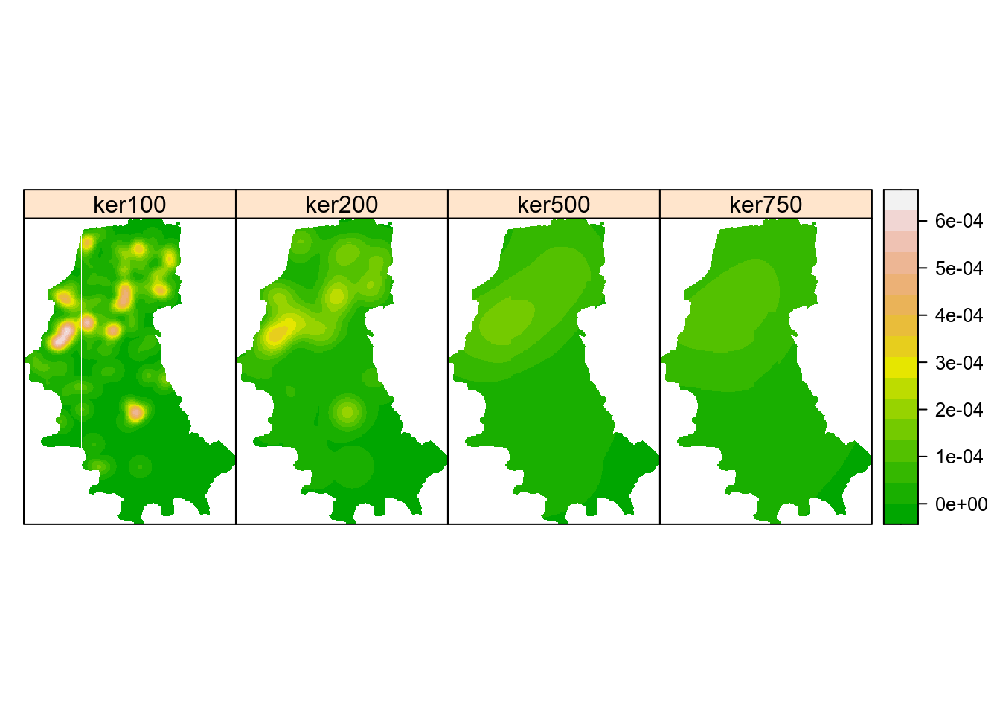


## Análise preliminar de um processo pontual 

### Função F e G - Distância do vizinho mais próximo

- Kernel e quadrat permitem explorar a variação da média do processo na região de estudo (propriedade de primeira ordem).

- Para investigar a propriedade de segunda ordem é necessário observar as distâncias entre os eventos.

- O método do vizinho mais próximo estima a função de distribuição cumulativa baseado nas distâncias entre eventos ou pontos em uma região de análise.


- Dois tipos de distâncias: **evento-evento (W)** e **ponto aleatório-evento (X)**

$$\hat{F}(x) = \dfrac{\#(x_i \leq x)}{m}$$

$$\hat{G}(w) = \dfrac{\#(w_i \leq w)}{n}$$

- Sabendo que:

*W* - evento-evento

*X* - ponto-evento

*#* - contagem de pontos onde a condição acontece

*n* - total de eventos

*m* - total de pontos aleatórios

- Podemos dizer que ambas as funções podem ser representadas pelo número de ($x_i$) ou ($w_i$) cuja distância é menor ou igual ao evento ($x$) ou ponto ($w$), dividido pelo total de pontos ($m$) ou total de eventos ($n$) na região.

- O resultado desta função empírica é o histograma das distâncias para o vizinho
mais próximo - cada classe do histograma é uma contagem de eventos que ocorrem até
aquela distância.

A plotagem dos resultados desta função de distribuição cumulativa empírica pode ser usada como um método exploratório para verificar se existe evidência de interação entre os eventos. Se esta plotagem apresentar um crescimento rápido para pequenos valores de distância, esta situação aponta para interação entre os eventos caracterizando agrupamentos nestas escalas. Se esta plotagem apresentar valores pequenos no seu início, e só crescer rapidamente para
valores maiores de distância, esta situação aponta para uma distribuição mais regular.


```r
par(mfrow = c(1, 3))
plot(envelope(Y = alea.ppp, fun = Gest, nsim = 99), 
    main = "Aleatório")
plot(envelope(Y = uni.ppp, fun = Gest, nsim = 99), 
    main = "Regular")
plot(envelope(Y = clu.ppp, fun = Gest, nsim = 99), 
    main = "Agregado")
```

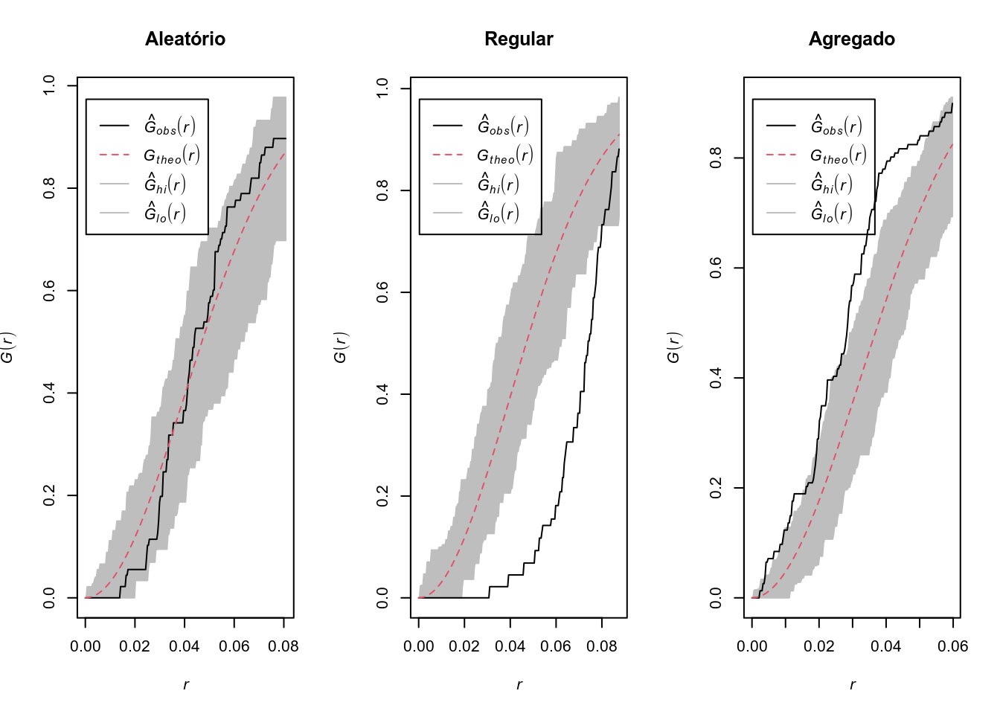
Embora o método do vizinho mais próximo forneça uma indicação inicial da distribuição espacial, ele considera apenas escalas pequenas. Para se ter informação mais efetiva para o padrão espacial em escalas maiores, o melhor método a ser utilizado é o da função $K$.


## Propriedade de segunda ordem 

### Função K de Ripley (ou apenas função K)

- A função $K$ permite analisar as propriedades de segunda ordem de um processo isotrópico.

$$\lambda K(h) = E(\#eventos)$$

Sendo:

- $#eventos$ - o número de eventos esperados até distância $h$

- $\lambda$ - a intensidade ou número médio de eventos por unidade de área

eventos contidos a uma distância h de um evento arbitrário$)$

- A função $K(h)$ é, para cada distância $h$, o somatório do total de pares cuja distância é menor de que $h$, vezes o inverso do total de pares ordenados existente na região $R$.

$$K(h) = \dfrac{1}{\lambda^{2} R}\sum \sum\limits_{i \neq j} I_{h} (d_{ij})$$

Supondo:

$$I_{h}(d_{ij}) = \begin{cases} 1  \ \ se\ \  d_{ij} \leq h \\ 0 \ \ se\ \  d_{ij} > h \end{cases}$$

$I_{h}(d_{ij})$ é uma função indicadora

- Esta função também necessita de correção do efeito de borda;

- A função *K* de Ripley conta quantos pontos há em círculos em torno de uma planta focal;

- Os círculos começam com um raio pequeno e vão até um raio que inclui toda a área de estudo;

- Faz-se uma média do número de pontos nas classes de distâncias em torno de todas as plantas focais da população.


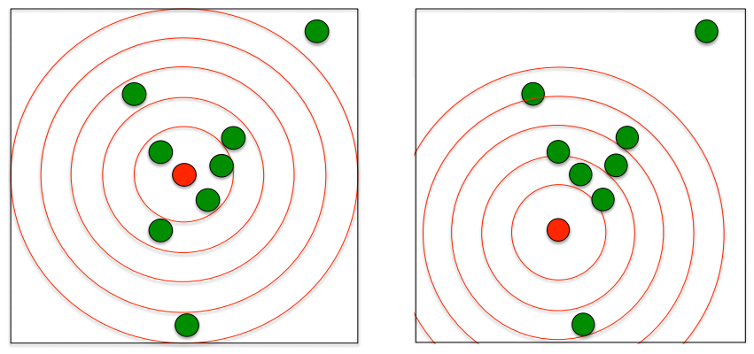{width=100%}


- A distribuição é cumulativa e representa o no esperado de vizinhos em um círculo de raio *r* centrado em uma planta arbitrária dividido pela intensidade $\lambda$ do padrão dos pontos na área de estudo;


Possíveis resultados:

- **quando o processo é completamente aleatório**, a curva se desvia relativamente pouco de $\pi r²$. A curva $K$ permanece perto de o valor de referência $\pi r²$;

- **no caso de um processo regular**, obtemos: $\hat{K}(r) < K_{pois}(r)$ porque se os pontos forem repulsivos, eles têm menos vizinhos em média em um raio $r$ do que teriam baseado no pressuposto de uma distribuição aleatória de pontos. Graficamente, a curva K reflete isso repulsão: vemos que no gráfico à abaixo, no processo regular, a curva K está localizada abaixo da referência valor ($\pi r²$);

- **no caso de um processo agregado**, há em média mais pontos em um raio $r$ ao redor os pontos do que o número esperado sob uma distribuição aleatória: consequentemente, os pontos atraem um ao outro e $\hat{K}(r) > K_{pois}(r)$. Graficamente, a curva $K$ está neste momento localizada acima da
valor de referência para todas as áreas de estudo.


```r
par(mfrow = c(1, 3))
plot(envelope(Y = alea.ppp, fun = Kest, nsim = 99), 
    main = "Aleatório")
plot(envelope(Y = uni.ppp, fun = Kest, nsim = 99), 
    main = "Regular")
plot(envelope(Y = clu.ppp, fun = Kest, nsim = 99), 
    main = "Agregado")
```

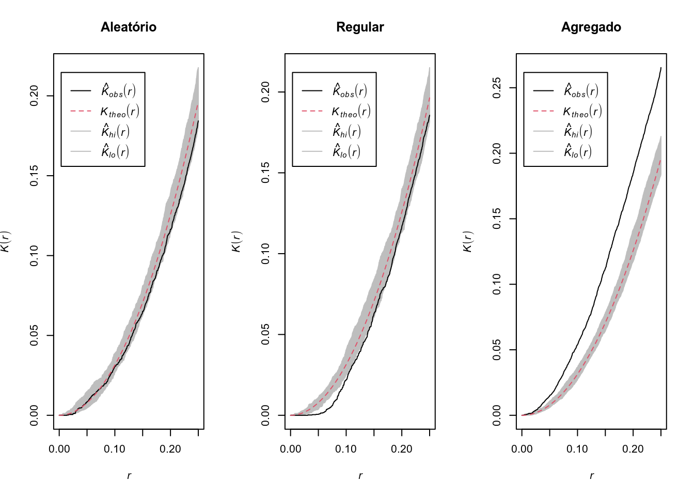

### Função *L*

- A função $K(h)$ tem uma distribuição teórica sob condições de aleatoriedade, quando a probabilidade de ocorrência de um evento em qualquer ponto de *R* é independente da ocorrência de outros eventos e igual em toda a superfície.

Neste caso, o número de eventos a uma distância $h$ será $\pi \lambda h^2$:

$$ K(h) = \pi h^2$$

No caso de distribuição regular, $K(h)$ será menor que $\pi h^2$.

Distribuição em cluster, K(h) será maior que $\pi h^2$.

A função $L(h)$ permite comparar a função $K(h)$ e $\pi h^2$

$$L(h) = \sqrt {\dfrac{K(h)}{\pi}}$$

    - Picos positivos indicam atração espacial - cluster

    - Vales negativos - repulsão espacial ou regularidade


```r
par(mfrow = c(1, 3))
plot(envelope(Y = alea.ppp, fun = Lest, nsim = 99), 
    main = "Aleatório")
plot(envelope(Y = uni.ppp, fun = Lest, nsim = 99), 
    main = "Regular")
plot(envelope(Y = clu.ppp, fun = Lest, nsim = 99), 
    main = "Agregado")
```

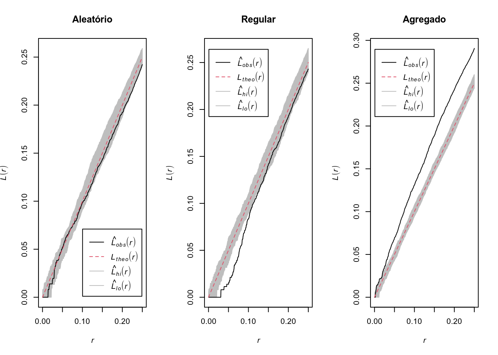

**Exemplo**: Verificando o padrão espacial de segunda ordem dos casos de homicíodos em POA/RS:


```r
# Convertendo para a class ppp
library(spatstat)
# range(homic2[1]) range(homic2[2])

w <- as.owin(list(xrange = range(homic2$x), yrange = range(homic2$y)))
w
```

window: rectangle = [17472, 19073] x [165625, 168269] units

```r
homic2.ppp <- as.ppp(homic2, w)
plot(homic2.ppp, pch = 19, cex = 0.5)
polymap(contorno.poa, add = T)
```

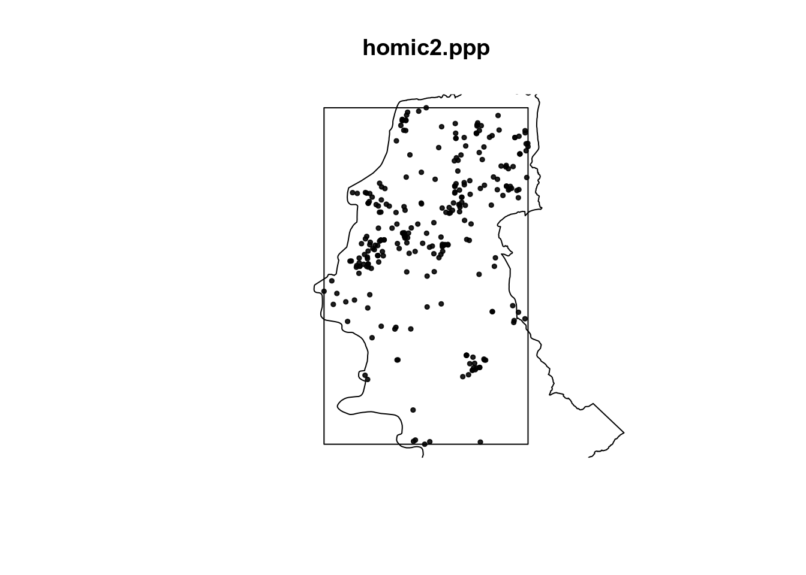
Note que o restangulo envolvente (**bbox**) foi feito com a coordenadas dos dados, não do contorno de POA.

Grafícos das Funções *K* , *G* e *L* dos homicíodos em POA/RS:


```r
par(mfrow = c(1, 3))
plot(envelope(Y = homic2.ppp, fun = Kest, nsim = 99), 
    main = "Funcao K")
plot(envelope(Y = homic2.ppp, fun = Gest, nsim = 99), 
    main = "Funcao G")
plot(envelope(Y = homic2.ppp, fun = Lest, nsim = 99), 
    main = "Funcao L")
```

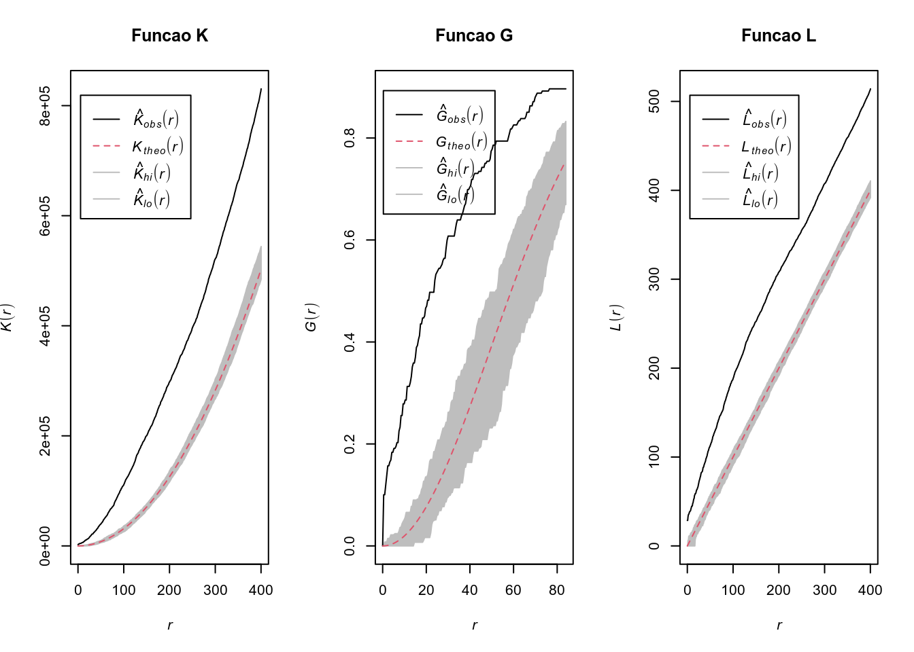

Comente esses resultados!

## Detecção de cluster

- Definição (Knox): grupo de ocorrências geograficamente limitado em tamanho e concentração tais que seja improvável ocorrer por mero acaso.

- São causas de cluster: fonte comum, contagiosidade.

- Clusters são em geral espaço-temporais.

- É importante considerar:

    - Demais fatores de risco – sexo, idade;

    - Residência X outros locais;

    - Latência.

- Dois tipos básicos de testes:

    - **Focados**: testa-se a hipótese de excesso de casos ao redor de fonte suspeita, identificada antes de observar os dados;

    - **Genéricos**: busca identificar áreas quentes, sem especificar quais e quantas.

- Hipóteses dos testes:

  $H_0$: É ausência de cluster: completa aleatoriedade espacial (CSR).

- **CSR**

- Sendo:

$n$ são subdivisões da região do estudo,

$y_i$ número de casos observados e $E_i$ esperados,

$\lambda$ eventos por unidade de área (e tempo).

- Alternativas:

    - Focados - $\lambda$ varia com a distância da fonte

    - Genéricos - existe regiões onde $\lambda$ é mais elevado

\

### Testes Genéricos de Cluster

- **Knox:** Testa um número acima do esperado de pares de casos excessivamente próximos (segundo critério pré-estabelecido) no espaço e no tempo.

- **Mantel:** Distância no tempo e distância no espaço, se $x$ for 1 e $y$
for 1, equivale ao teste de Knox.

$$\sum \sum\limits_{i \neq j} x_{ij} y_{ij} $$

- **Cuzick-Edwards:** Caso-controle onde a coincidência de casos vizinhos aumenta o peso, e a junção controle-controle ou caso-controle tem peso zero; este teste permite considerar a variação populacional.

\


### Fonte Específica

- Cluster ao redor de um ponto ou uma linha.

- Compara-se a ocorrência de no excessivo de “casos” em relação à população a partir de uma função de decaimento em relação à possível fonte.

$$\lambda (s) = \rho \lambda'(s)f(h;\theta)$$

$$f(h;\theta) = 1 + \theta_1 e^{\theta_{2}h^2}$$

Sendo:

$\theta(s)$ - estimativa do evento p/ unidade de área

$\rho$ - parâmetro que indica a razão entre “casos” e “controles”

$\lambda'(s)$ - estimativa população p/ unidade de área

$f$ - função da distância para a fonte

$θ$ - parâmetros a estimar que descrevem como a incidência varia em torno da fonte


## Exercícios Propostos

1. Testar a CSR e explorar os Kernels para as causas de suicídio e acidentes de carro em POA/RS.

2. Fazer a razão de kernel entre suicídios e acidentes de carro em POA/RS.

3. Inspecionar o processo pontual de segunta ordem, utilizando as funções K, G e L para as causas de suicídio e acidentes de carro em POA/RS.

### Exercícios Resolvidos

* [Exercícios Padrões Pontuais](https://gitlab.procc.fiocruz.br/oswaldo/eco2019/raw/master/scripts/ex_cap6_padraoponto.r)


## Bibliografia sugerida

ASSUNÇÃO, Renato M. Estatística espacial com aplicações em epidemiologia, economia e sociologia. São Carlos: Associação Brasileira de Estatística, v. 131, 2001.

DIGGLE, Peter J. et al. Statistical analysis of spatial point patterns. Academic press, 1983.

GATRELL, Anthony C. et al. Spatial point pattern analysis and its application in geographical epidemiology. Transactions of the Institute of British geographers, p. 256-274, 1996.

BADDELEY, Adrian , RUBAK, Ege, TURNER, Rolf Turner.  Spatial Point Patterns: Methodology and Applications with R Chapman and Hall/CRC  810 Pages. 1st Edition 2015.

BIVAN, Roger. et al. Applied Spatial Data Analysis with R, Springler 2008


<!-- ```{r child="capitulo7.Rmd", echo=FALSE} -->


<!-- ``` -->

<!-- ```{r child="capitulo8.Rmd", echo=FALSE} -->


<!-- ``` -->


<!-- ```{r child="capitulo9.Rmd", echo=FALSE} -->


<!-- ``` -->


<!-- ```{r child="capitulo10.Rmd", echo=FALSE} -->


<!-- ``` -->


<!-- ```{r child="capitulo11.Rmd", echo=FALSE} -->


<!-- ``` -->


<!-- ```{r child="capitulo12.Rmd", echo=FALSE} -->


<!-- ``` -->


# Análise Espacial - Dados de Área I

# Dados de Área II

# Análise Espacial - Geoestatística

# Análise Espaço-Temporal & Instruções e Dúvidas para o Trabalho Final


# Roteiro para a execução do trabalho final


1- Este trabalho poderá ser feito de forma **individual ou em dupla**;

2- Este trabalho será dividido em duas etapas. A primeira etapa deverá ser baseada em uma análise do tipo Série Temporal (ST) e a segunda em uma Análise Espacial (AE). A primeira etapa irá valer **4,0** pontos e a segunda **6,0** pontos;

3- Em cada etapa poderá ser feita análises com tipos de dados diferentes, ou seja, com desfechos ou estudos distintos para cada tipo de análise;

4- Em ambas as etapas, o tema analisado deverá ser descrito sucintamente assim como as variáveis analisadas, sempre especificando a unidade espacial (ex: setor censitário, bairro, município, estado, etc.) e a temporal (ex: dia, semana, mês, ano, etc) que serão levadas em consideração. Caso os dados sejam os mesmos em ambas as etapas, tal descrição poderá ser feita apenas uma vez;

5- A primeira etapa deverá constar os seguintes procedimentos para as análises: Ler o banco de dados pretendido, transformar em formato de ST, decompor a ST e testar a presença dessas componentes. Opcionalmente ajustar os modelos , testar os pressupostos e interpretar o modelo.  

6- A segunda etapa poderá ser  feita utilizando os tipos de dados em padrão pontual ou em área. Nesta etapa deverá constar um dos seguintes procedimentos para as análises: 
  
6.1 – Padrão Pontual
  
i) Ler o banco de dados pretendido
ii) Transformar em formato espacial
iii) Explorar o Processo de primeira ordem (Ex: Testar CSR, Função Kernel)
iv) Explorar o Processo de segunda ordem (Ex: Função K, F, L)
v) Opcional: Modelagem (Ex: GAM)

OU 

6.2 – Dados de Área  

i) Ler o arquivo vetorial (.shp) e/ou banco de dados pretendido
ii) criar Matriz de Vizinhança
iii) Análise exploratória Espacial (Mapas temáticos, autocorrelação espacial)
iv) Opcional: Modelagem (ex: SAR, CAR ou GWR) 


7- Discutir os resultados em ambas as etapas.

8- Entregar um relatório escrito em PDF no formato de artigo com introdução, objetivos, metodologia, resultados e sua respectiva análise e uma breve discussão.

9- Não esquecer de compactar todos os scripts e dados em um unico arquivo com seu nome ou nome da dupla e data 
(por exemplo Laís_&_Oswaldo_04Ago2021.ZIP).


10- O prazo **FINAL** para envio dos trabalhos é **06 de Agosto de 2021**

11- Envio do trabalho devera ser feito usando o link abaixo!

[Clique aqui para enviar o arquivo final](https://own)

### Sugestões de locais para baixar os dados e os mapas

[SIDRA/IBGE](https://sidra.ibge.gov.br/home/pms/brasil)

[TABNET-MS](http://www2.datasus.gov.br/DATASUS/index.php?area=02)

[openDataSUS](https://opendatasus.saude.gov.br)

[Brasil.IO](https://brasil.io/home/) 

## Ficha de Avaliação

Para que possamos melhorar o curso gostaríamos muito de contar com a colaboração de vocês, para isso pedimos que preencham um formulário de avaliação do curso no google forms. 

O formulário pode ser preenchido de uma maneira anonima e conta com uma sessão de identificação , nome (opcional) se é aluno de mestrado ou doutorado e  qual é sua área de formação básica. Em seguida  pedimos que avaliem o curso em 4 módulos  

* Estudos Ecológico
* Series temporais 
* Analise exploratória espacial
* Modelagem espacial

e ao final existe um campo livre onde você poderá fazer criticas, observações , sugestões etc… 

**por favor preencha com atenção e envie somente uma vez, o formulário é anonimo não temos como identificar duplicidades!**

clique no link abaixo e acesse:

[Google Forms](https://xxxxxxx)
  
## FIM 

**Parabéns você chegou ao final do Curso**


# Anexo I - Roteiro séries temporais {-}

# Anexo II - Fazendo mapas com ggplot {-}
