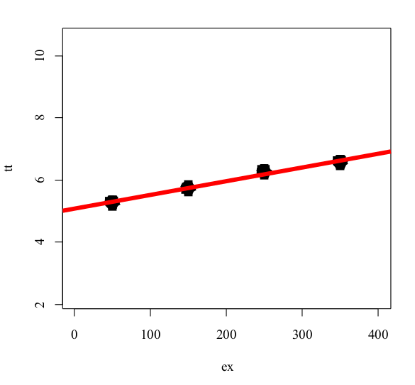
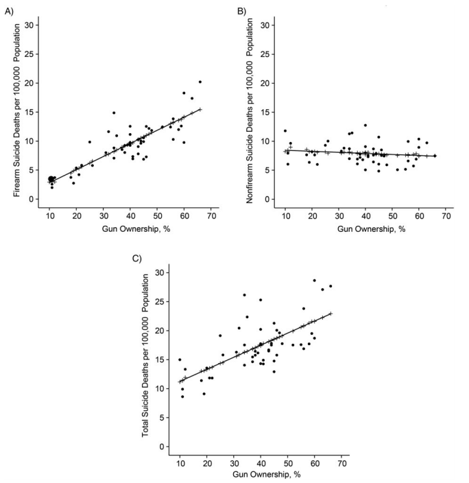
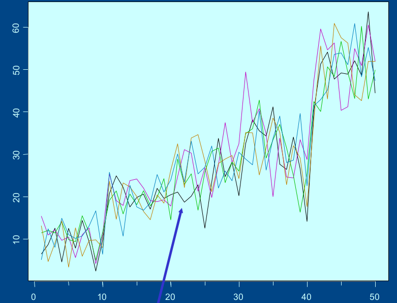
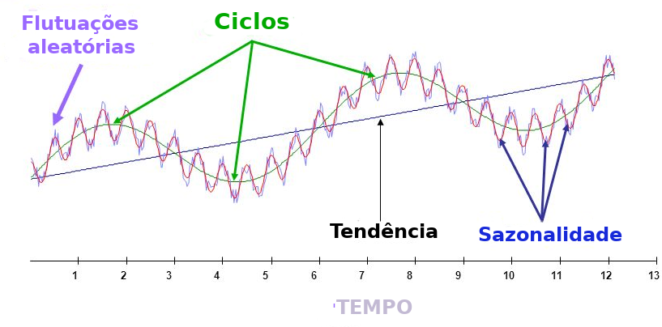
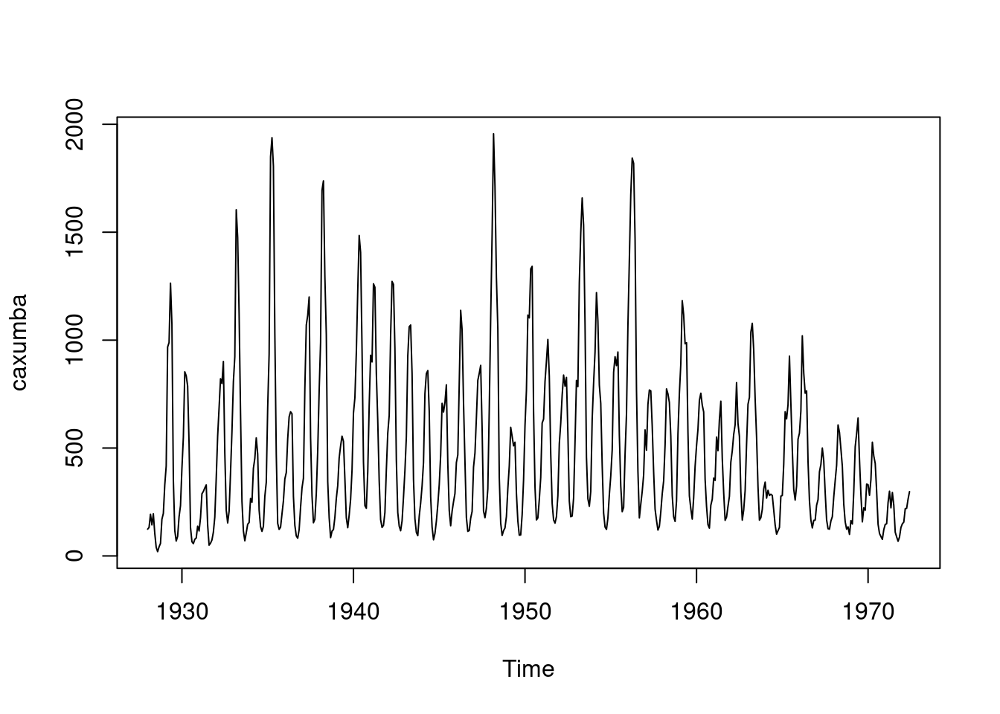
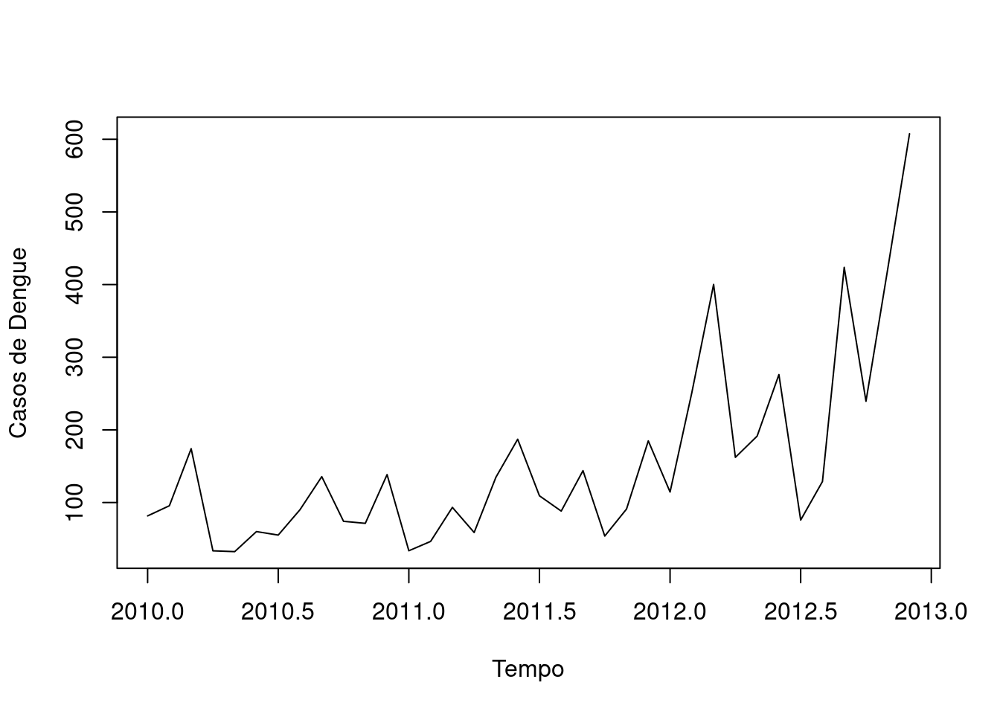

--- 
title: "ESTUDOS ECOLÓGICOS 2021"
author: "Oswaldo G Cruz &  Laís P Freitas"
date: "Atualizado em: 14 de maio de 2021"
site: bookdown::bookdown_site
documentclass: book
#bibliography: [book.bib]
biblio-style: apalike
link-citations: yes
theme: cerulean
---


# Apresentação


**Disciplina:** Estudos Ecológicos - Introdução aos Métodos de Análises Temporais e Espaciais (ENSP.82.134.2)

Carga Horaria: 90 horas (10 aulas) - 3 Créditos

Professores: Oswaldo G Cruz & Laís P Freitas

Período: 07 de Maio de 2021 a 09 de Julho 2021

**Ementa:**

Este curso se propõe a estudar métodos de séries temporais e estatística espacial, visando analisar a saúde de grupos populacionais a partir de sua localização temporal e espacial, bem como sua interação com o ambiente. Serão abordados os seguintes tópicos: Introdução e definições de estudos ecológicos; falácia ecológica vs falácia atomista; introdução, definições e importância das sereis temporais; tendência e sazonalidade; autocorrelação serial; filtros e alisamentos; modelo Box & Jenkings (ARIMA); Tipologia dos dados espaciais; Padrão de pontos; Área; Geoestatística. Modelos aditivos generalizados (GAM). O curso terá aulas práticas realizadas em R.

**Cronograma**

-   Aula 1 (07/05) - Estudos Ecológicos
-   Aula 2 (14/05) - Séries Temporais - Análise Exploratória
-   Aula 3 (21/05) - Séries Temporais - Técnicas de Suavização
-   Aula 4 (28/05) - Modelagem em Séries Temporais
-   Aula 5 (04/06) - Introdução à Análise Estatística Espacial & Padrão de Pontos I
-   Aula 6 (11/06) - Análise Espacial - Padrão de Pontos II
-   Aula 7 (18/06) - Análise Espacial - Dados de Área I
-   Aula 8 (25/06) - Análise Espacial - Dados de Área II
-   Aula 9 (02/07) - Análise Espacial - Geoestatística
-   Aula 10 (09/07) - Análise Espaço-Temporal & Instruções e Dúvidas para o Trabalho Final

**Monitor:**   

_**Denis de Oliveira Rodrigues**_

**Avaliação:**

Instruções para o Trabalho Final Prazo final: 06/08/2021

Clique [AQUI para instruções](roteiro-para-a-execucao-do-trabalho-final.html)


# Estudos Ecológicos

## O que são Estudos Ecológicos ?

- São estudos nos quais a **unidade de análise** (ou agregação) é uma **população** ou um grupo de pessoas, geralmente de uma área geográfica definida (ex: um país, um estado, uma cidade, etc.), em um determinado tempo definido.

- **Definição Clássica**: é um estudo observacional com a informação obtida e analisada no nível **agregado**.


- Geralmente são mais **baratos** e mais **rápidos** do que estudos envolvendo o indivíduo como unidade de análise.

- Procuram avaliar como os contextos (sociais, ambientais, etc) podem afetar a saúde de grupos populacionais.


## Principais objetivos  

- Gerar hipóteses etiológicas;

- Testar hipóteses etiológicas;

- Avaliar a efetividade de intervenções na população;

- Identificar áreas de risco.


**Exemplo 1**: Em 1960, Friedman mostrou uma correlação positiva entre as taxas de mortalidade por doença coronariana (DC) e as vendas de cigarros per capita, em 44 estados americanos.

 - Esta observação inicial contribuiu para a formulação da hipótese de que o tabagismo poderia causar doença coronariana


<small> Figura: Coronary heart disease mortality rates in the United States per capita cigarette sales in 1960, by state. (From FRIEDMAN GD, Cigarette smoking and geographic variation in coronary heart disease mortality in the United States. J. Chronic Dis. 20: 769, 1967)
</small>
 


 


## Tipos de Variáveis Utilizadas

- **Medidas Agregadas**: Medidas agregadas por grupos. ex: incidência, prevalência, mortalidade, proporção de fumantes;

- **Medidas Ambientais**: Características físicas do contexto onde o grupo convive. ex: nível de poluição, precipitação;

- **Medidas Globais**: Atributos de grupos, organizações ou lugares, que não podem ser mensurados a nível individual. ex: IDH, densidade demográfica, existência de um tipo de sistema de saúde.

- Em uma análise ecológica, todas as variáveis são medidas agrupadas. Apenas se conhece a distribuição marginal de cada variável.

<br>

|                       |           Desfecho (*Y*)     |       |
|-----------------------|:--------------:|:-----------:|:-----:|
| **Fator em Estudo (*X*)** |    Ocorreu     | Não ocorreu | **Total **|
| Exposto               |        ?       |      ?      | $E_1$ |
| Não Exposto           |        ?       |      ?      | $E_0$ |
| **Total**                 |      $D_1$     |    $D_0$    |  *n*  |


<br>


## Tipos de Desenhos de Estudos Ecológicos

- **Múltiplos Grupos**: O objetivo desse tipo de estudo é a comparação entre todos os grupos ou conjuntos populacionais envolvidos no estudo. Ex: Análise Espacial.

- **Desenhos de Séries Temporais**: Avalia um determinado desfecho ao longo do tempo em uma determinada população geograficamente definida. Ex: Análise de Séries Temporais.

- **Desenhos Mistos**: É a combinação entre os dois desenhos citados, pois avalia a evolução de um determinado desfecho em diferentes grupos populacionais ao longo do tempo. Ex: Análise Espaço-Temporais, Estudos Multiníveis.


## Aspectos históricos

- “Um estudo ecológico ou agregado focaliza a comparação de grupos, ao invés de indivíduos. A razão subjacente para este foco é que dados a nível individual da distribuição conjunta de duas (ou talvez todas) variáveis estão faltando internamente nos grupos; neste sentido um estudo ecológico é um desenho incompleto”.

<small> (Rothman, Kenneth J. et al. Modern epidemiology. Philadelphia: Wolters Kluwer Health/Lippincott Williams & Wilkins, 2008.) </small>


---

- “... estudar saúde no contexto ambiental. O objetivo é ambicioso: entender como o contexto afeta a saúde de pessoas e grupo através de seleção, distribuição, interação, adaptação, e outras respostas. Medidas de atributos do indivíduo não podem dar conta destes processos [...] Sem medir estes contextos, nem padrão de mortalidade e morbidade, nem o espalhamento epidêmico, nem a transmissão sexual podem ser explicados”

<small> (Susser, Am.J.Public Health, 1994;84:825-835) </small>


---


- A Epidemiologia é frequentemente definida em termos do estudo da determinação da distribuição da doença. Mas não se deve esquecer que quanto mais espalhada é uma causa particular, menos ela contribui para explicar a distribuição da doença.”

- “...dois tipos de perguntas etiológicas. A primeira busca as causas dos casos, e a segunda as causas da incidência.”

- “Aplicada à etiologia, a visão centralizada no indivíduo leva ao uso do risco-relativo como a representação básica da força etiológica: ou seja, o risco em indivíduos expostos relativo aos não-expostos. [...] Esta pode ser geralmente a melhor medida de força etiológica, mas não é medida de [...] importância em saúde pública.” 

- “É rara a doença cuja taxa de incidência não tenha variado largamente, seja ao longo do tempo ou entre populações
[...] Isto significa que as causas da incidência, desconhecidas que sejam, não são inevitáveis. [...] Mas identificar o agente causal pelos métodos tradicionais de caso-controle e coorte não terá sucesso se não houver suficientes diferenças na exposição dentro da população [...] Nestas circunstâncias tudo os que os métodos tradicionais fazem é encontrar marcadores de susceptibilidade individual. A chave deve ser buscada nas diferenças entre populações ou em mudanças nas
populações ao longo do tempo.”

<small> (Rose G. Sick individuals and sick populations. Int J Epidemiol. 2001 Jun;30(3):427-32; discussion 433-4.) </small>


---

- “ ... torna-se aparente que muitas das explicações convencionais dos determinantes da saúde - porque
algumas pessoas são saudáveis e outras não - são, na melhor das hipóteses seriamente incompletas, se não
simplesmente erradas. É assim, infelizmente, porque as sociedades modernas dedicam uma parte muito grande
de sua riqueza, esforço e atenção tentando manter ou melhorar a saúde dos indivíduos que compõem suas
populações. Estes esforços maciços são primeiramente canalizados para os sistemas de assistência à saúde,
presumivelmente refletindo uma crença que receber uma boa assistência é o mais importante determinante de
saúde.” 


<small> (Evans,R.G.”Why are some people healthy and others not”) </small>

---


- “Grande parte da pesquisa atual em epidemiologia está baseada no individualismo metodológico: a noção que a distribuição da saúde e doença em populações pode ser explicada exclusivamente em termos das características dos indivíduos.”


<small> (Diez-Roux AV. Bringing context back into epidemiology: variables and fallacies in multilevel analysis. AJPH,1998;88(2):216-22) </small>

---


- “A evidência de modestos efeitos de vizinhança na saúde é razoavelmente consistente, apesar da
heterogeneidade dos desenhos dos estudos [...] e prováveis erros de medida. Ao chamar a atenção da
saúde pública para os riscos associados com a estrutura social e ecológica de vizinhança, enseja-se possíveis intervenções inovadoras no nível da comunidade.”


<small> (Pickett KE, PearlL M. Multilevel analyses of neighbourhood socioeconomic context and health outcomes: a critical review. J Epidemiol Community Health 2001;55(2):111-22) </small>

---

## Epidemiologia social

- “...o ramo da epidemiologia que estuda a distribuição social e os determinantes sociais da saúde. A epidemiologia social incorpora um novo foco na comunidade como uma entidade em si, uma entidade mais complexa do que a soma das pessoas individuais que compõem a sociedade.” 

<small> (Berkman L. F. &
Kawachi I. (Editors). Social Epidemiology. Oxford University Press, 2000) </small>


- “Os médicos estão acostumados a pensar nos determinantes socioeconômicos da doença em termos dos fatores de risco de uma pessoa. [...] Agora parece claro que a riqueza absoluta ou a renda é um determinante menos importante da saúde do que a relativa disparidade na renda ou a diferença de renda entre os ricos e os pobres.” 

<small> (Kawachi I.; Kennedy B.P.; Wilkinson R.G. The Society and Population Health Reader: Income Inequality and Health. New Press, 1999). </small>


## Árvores, Bosques ou as Florestas?

### As Árvores

- Suponha os dados abaixo, onde a variável *“X”* representa um efeito de exposição e a variável *“Y”* um taxa. Ao fazermos uma regressão obtemos uma correlação de apenas **0,1469** entre as duas variáveis.

{width=400px}


### Os Bosques
  
  - Ao estratificarmos os dados evidencia-se uma estrutura, e ajustarmos uma regressão em cada grupo obtém-se:
  
  |      |      |
| :--: | :--: |
|  {width=100%}     |   {width=60%}   |
  


### As Florestas
  
- Tirando-se a média para cada grupo iremos obter quatro pontos sob os quais faremos uma regressão. O coeficiente de correlação obtido é **rho = 0,9938**
  
  {width=50%} 


## Falácia Ecológica ou viés de agregação

- *"Viés que pode ocorrer porque uma associação entre duas variáveis no nível agregado não necessariamente representa uma associação no nível individual"* 


- O problema é que não podemos fazer inferências para níveis distintos:

    i) Inferir para o indivíduos a partir de dados agregados (***falácia ecológica***)
    
    ii) Inferir para agregados populacionais a partir de dados individuais (***falácia atomística ou individualista***)

- Na estatística esse efeito é conhecido como [Paradoxo de Simpson](https://pt.wikipedia.org/wiki/Paradoxo_de_Simpson)

> “Textos de Epidemiologia fazem uma avaliação consistente sobre estudos ecológicos: eles são tentativas cruas de estimar correlações em nível individual. [...] Examinar esta questão de uma perspectiva diferente - como um problema geral de validade - mostrará que a falácia ecológica, conforme frequentemente usada, encoraja três noções interrelacionadas e falaciosas: 
> 
> (1) que modelos em nível individual são mais perfeitamente especificados que os de nível ecológico, 
> 
> (2) que correlações ecológicas são sempre substitutos para correlações de nível individual, e 
> 
> (3) que variáveis de nível de grupo não causam doença.”

<small> (Schwartz, Am.J.Public Health, 1994;84:819-824) </small>


---

**Religião e Sucídio**

- Um exemplo clássico de estudo ecológico:

    - Emile Durkheim (em 1897) associação ecológica positiva entre a proporção de indivíduos de religião Protestante e as taxas de suicídio (províncias da Prússia);
    
    - Durkheim concluiu que Protestantes tinham maior probabilidade de se suicidarem do que os Católicos;
    
    - Conclusão factível mas a inferência causal não é correta: poderiam ter sido os Católicos em províncias predominantemente Protestantes a cometer os suicídios, e a metodologia ecológica não permite discernir qual das duas hipóteses está certa.
    
    Para ler mais sobre este exemplo: Frans van Poppel and Lincoln H. Day. A Test of Durkheim's Theory of Suicide - Without Committing the "Ecological Fallacy". American Sociological Review, 1996. https://doi.org/10.2307/2096361

---

**Posse de armas de fogo e suicídio**

- Um exemplo mais recente:

    - Miller *et al* (2003) realizaram um estudo ecológico no Estados Unidos comparando as frequências de posse doméstica de armas de fogo com as de suicídio por arma de fogo e por outros meios, por estado. 
    - Estados com maiores proporções de posse de armas de fogo apresentaram maiores taxas de suicídio por armas de fogo, mas a *mesma* frequência de suicídios por outros meios.
    - Suicídios por outros meios serve como um "controle". Segundo os autores, a posse de armas não deveria impactar suicídios por outros meios. Além disso, os autores assumem que os fatores de confundimento seriam os mesmos para suicídios por arma de fogo e por outros meios.
    
  

<small>Figura. Relação entre posse doméstica de armas de fogo e mortalidade por suicídio nos Estados Unidos, por estado, A) por armas de fogo, B) por outros meios que não armas de fogo, e C) todos. (Fonte: Miller et al. Am J Epidemiol. 2013;178(6):946–955)
</small>

\

- Concordam que todos os confundimentos são os mesmos para os dois grupos de mortes por suicídio?
- Concordam que suicídios por outros meios não devem ser afetados pela posse doméstica de armas de fogo?
- É correto concluir que, nos Estados Unidos:
    - ter uma maior porcentagem de população com posse de armas causa taxas elevadas de suicídio por arma de fogo?
    - possuir uma arma é uma causa para suicídio por arma de fogo?

\

---


**Um outro exemplo**: Um pesquisador deseja estudar a relação entre acidentes de trânsito e a renda em três cidade distintas (A, B e C). 


|pop | renda_media| tx_acidente|
|:---|-----------:|-----------:|
|A   |    24.08571|       57.14|
|B   |    22.57143|       42.86|
|C   |    21.41429|       28.57|

---

- Observando o gráfico abaixo, o pesquisador observa um possível associaçãom entre a renda e a taxa de acidentes de trânsito;


- Quanto maior a renda, maior será a taxa de acidentes de trânsito.

---

- Observando os microdados, ou seja, os dados no nível individual, temos o seguinte:


```{=html}
<div id="htmlwidget-de1f6169bf39fb47d756" style="width:100%;height:auto;" class="datatables html-widget"></div>
<script type="application/json" data-for="htmlwidget-de1f6169bf39fb47d756">{"x":{"filter":"top","filterHTML":"<tr>\n  <td><\/td>\n  <td data-type=\"number\" style=\"vertical-align: top;\">\n    <div class=\"form-group has-feedback\" style=\"margin-bottom: auto;\">\n      <input type=\"search\" placeholder=\"All\" class=\"form-control\" style=\"width: 100%;\"/>\n      <span class=\"glyphicon glyphicon-remove-circle form-control-feedback\"><\/span>\n    <\/div>\n    <div style=\"display: none; position: absolute; width: 200px;\">\n      <div data-min=\"10\" data-max=\"45.6\" data-scale=\"1\"><\/div>\n      <span style=\"float: left;\"><\/span>\n      <span style=\"float: right;\"><\/span>\n    <\/div>\n  <\/td>\n  <td data-type=\"character\" style=\"vertical-align: top;\">\n    <div class=\"form-group has-feedback\" style=\"margin-bottom: auto;\">\n      <input type=\"search\" placeholder=\"All\" class=\"form-control\" style=\"width: 100%;\"/>\n      <span class=\"glyphicon glyphicon-remove-circle form-control-feedback\"><\/span>\n    <\/div>\n  <\/td>\n  <td data-type=\"character\" style=\"vertical-align: top;\">\n    <div class=\"form-group has-feedback\" style=\"margin-bottom: auto;\">\n      <input type=\"search\" placeholder=\"All\" class=\"form-control\" style=\"width: 100%;\"/>\n      <span class=\"glyphicon glyphicon-remove-circle form-control-feedback\"><\/span>\n    <\/div>\n  <\/td>\n<\/tr>","data":[["1","2","3","4","5","6","7","8","9","10","11","12","13","14","15","16","17","18","19","20","21"],[10.5,34.5,28.5,12.2,45.6,17.5,19.8,12.5,32.5,24.3,10,14.3,38,26.4,28.7,30.2,13.5,23.5,10.8,22.7,20.5],["A","A","A","A","A","A","A","B","B","B","B","B","B","B","C","C","C","C","C","C","C"],["Caso","Nao_caso","Nao_caso","Caso","Nao_caso","Caso","Caso","Caso","Nao_caso","Nao_caso","Caso","Caso","Nao_caso","Nao_caso","Nao_caso","Nao_caso","Caso","Nao_caso","Caso","Nao_caso","Nao_caso"]],"container":"<table class=\"display\">\n  <thead>\n    <tr>\n      <th> <\/th>\n      <th>renda<\/th>\n      <th>pop<\/th>\n      <th>casos<\/th>\n    <\/tr>\n  <\/thead>\n<\/table>","options":{"pageLength":5,"scrollX":true,"columnDefs":[{"className":"dt-right","targets":1},{"orderable":false,"targets":0}],"order":[],"autoWidth":false,"orderClasses":false,"orderCellsTop":true,"lengthMenu":[5,10,25,50,100]}},"evals":[],"jsHooks":[]}</script>
```

---

- De posse desses dados no nível individual, é possível fazer a seguinte análise:


---


- Dessa forma observamos que os indivíduos que sofreram algum tipo de acidente de trânsito, apresentam a menor renda;

- Qual dos dois níveis de inferência está errado ?

- Qual é, então, o problema ? ? ?


---


## Problemas práticos
  
**1. Numerador:**
  
  - subregistro
- duplicidade de registros
- georreferenciamento:
  - não localização
- informação incorreta
- preenchimento inadequado
- mudança na classificação ao longo do tempo

**2. Denominador:**
  
  - espaçamento do censo
- migração
- mudança de fronteiras (!!!!)


**3.Exposição:**
  
- pode ocorrer em diversos lugares 
- dificilmente mensurável com precisão
- uso de “proxy”
- diferentes áreas para medida de exposição e de efeito, e áreas não compatíveis
- Informações mais detalhadas (PNAD, amostra do censo) não extrapoláveis para populações pequenas

**4. Análise:**
  
- migração
- multicolinearidade


## Vantagens
  
  - Baixo custo e execução rápida, devido às fontes de dados secundários disponíveis;

- Conseguem estimar bem os efeitos de uma exposição quando ela varia pouco na área de estudo, pela comparação entre áreas (os estudos individuais não conseguem);

- Existem efeitos que somente podem ser medidos no nível ecológico, por ex. implantação de um novo sistema de saúde.


## Desvantagens
  
- Informações sobre comportamento, atitudes e história clínica não estão disponíveis (dados pessoais não disponíveis);

- Depende da qualidade das informações disponíveis (fontes diversas);

- Não se leva em conta a variabilidade da característica estudada dentro do grupo;

- Difícil estabelecer temporalidade entre causa e efeito.

- Migração entre grupos (por exemplo, mora em uma área e trabalha em outra).


## Resumindo
  
- Resgatando a ecologia: estudo das complexas inter-relações entre organismos vivos e o seu meio físico.

- Dados agregados – estudo ecológico clássico

- Mistura de dados individuais e agregados – modelos multinível

- Quando se estuda o tempo – séries temporais e modelos dinâmicos

- Quando é espacial – modelos clássicos de regressão ou espaciais

- Mistura espaço e tempo – modelos espaço-temporais

- Envolvendo relações entre indivíduos – redes


  
## Exercícios Propostos
  
1) As estatísticas internacionais indicam que o Chile tem uma das mais altas taxas de mortalidade por câncer de estômago. O país caracteriza-se por conter altos níveis de nitrato em seu solo, situação rara no mundo, neste particular. Estabeleceu-se a suspeita de ser o nitrato, em altas concentrações, um agente causal da neoplasia. Comparações regionais dentro do país, contrastando áreas com altas e baixas concentrações de nitrato, mostraram a
mesma relação: alto teor da substância no solo, (alta mortalidade por este tipo de neoplasia). Um estudo caso-controle subseqüente foi realizado, mas a nível individual, não foi possível encontrar tal associação. A hipótese, entretanto, não foi totalmente descartada. Qual a importância desse estudo ecológico no estudo sobre causalidade: concentração de
nitrato no solo vs câncer de estômago  ?
  
2) Os casos notificados de Influenza são maiores na cidade A do que na cidade
B. As taxas de vacinação para a influenza são mais baixas na cidade A do que na cidade
B. Quais das seguintes razões são razões pelas quais seria
é incorreto presumir que uma maior vacinação na cidade B
é o que está fazendo com que a cidade B tenha menos casos relatados de
 Influenza ? Escolha as opções corretas.

a) A cidade A e a cidade B podem ter diferentes cepas de Influenza

b) A cidade A e a cidade B podem ter proporções diferentes de
pessoas nas suas populações que são especialmente vulneráveis
à influenza (por exemplo, idosos, crianças e mulheres grávidas)

c) A cidade A e a cidade B podem ter diferenças nos cuidados de saúde ,
acessibilidade aos serviços e acesso a  diagnóstico da influenza
 
d) A cidade A e a cidade B podem ter climas diferentes, levando a
diferenças em como/onde as pessoas entram em contato com
um ao outro. Isto pode afetar as taxas de transmissão de Influenza


## Bibliografia sugerida


BERKMAN, Lisa F.; KAWACHI, Ichirō; GLYMOUR, M. Maria (Ed.). Social epidemiology. Oxford University Press, 2014.

DIEZ-ROUX, Ana V. Bringing context back into epidemiology: variables and fallacies in multilevel analysis. American journal of public health, v. 88, n. 2, p. 216-222, 1998.

EVANS, Robert G.; BARER, Morris L.; MARMOR, Theodore R. (Ed.). Why are some people healthy and others not?: The determinants of the health of populations. Transaction Publishers, 1994.

MORGENSTERN, Hal. Ecologic studies in epidemiology: concepts, principles, and methods. Annual review of public health, v. 16, n. 1, p. 61-81, 1995.

PICKETT, Kate E.; PEARL, Michelle. Multilevel analyses of neighbourhood socioeconomic context and health outcomes: a critical review. Journal of Epidemiology & Community Health, v. 55, n. 2, p. 111-122, 2001.

ROSE, Geoffrey. Sick individuals and sick populations. International journal of epidemiology, v. 30, n. 3, p. 427-432, 2001.


# Introdução às Séries Temporais


## O que são Séries Temporais ?

- **Definição**: Entende-se por Séries Temporais (ST) todo e qualquer conjunto de dados (absolutos ou relativos, discretos ou contínuos), ordenados cronologicamente.

- **Condição**: Esses dados seguem uma ordenação em função do tempo (dependência temporal).

- De modo geral, as séries temporais apresentam sequências de observações relativas a determinada variável ao longo de um intervalo específico de tempo (dia, mês, trimestre, ano, etc.), isto é, referem-se a fluxos de valores periódicos, os quais dão uma visão geral sobre o andamento ou comportamento da variável em análise.

- A maneira mais comum de visualizar séries temporais é usar um gráfico de linhas simples, em que o eixo horizontal representa os incrementos de tempo e o eixo vertical representa a variável que está sendo medida.

- Seguem abaixo alguns exemplo de séries temporais:


<!-- {width=770px} -->

- As séries temporais podem ser de natureza **regular** ou **irregular**. 

    - As **séries temporais regulares ou uniformes** são aquelas que podem ser expressas sempre com o mesmo intervalo de tempo (frequência).
    
    - As **séries temporais irregulares ou não uniformes** são aquelas em que as frequências de tempo são diferentes ou que apresentam dados ausentes (*missing data*). Algumas vezes podem ser transformadas em séries regulares agregando ouinterpolando os dados mensurados.


##  Hipóteses básicas do estudo das séries temporais

- Há um sistema causal relacionando as variáveis no tempo;

- Ao longo do tempo, o sistema influencia todos os dados sob análise, de modo regular  e permanente;

- Os dados históricos refletem a influência média de um conjunto de fatores.


Tais hipóteses se baseiam no pressuposto de que as relações apontadas pela experiência pregressa permitem prever o possível comportamento das variáveis sob análise, determinando se seu comportamento apresenta propriedades **determinísticas** e/ou **aleatórias**.


## Classificação dos tipos de séries temporais

- **Contínuas:** A informação é obtida em qualquer intervalo de tempo (podendo ser discretizando em intervalos iguais) ou é acumulada por período.
**Ex:** Temperatura, pluviosidade, partículas em suspensão.


- **Discretas:** Observações obtidas em intervalos de tempo discreto e equidistantes (ano, mês, dias, semanas epidemiológicas).
**Ex:** Mortalidade infantil, notificações por DIC.

- **Multivariada:**  São várias coleções de observações para a mesma sequência de períodos de tempo, ou seja,envolvem mais de uma série histórica.
**Ex:** Número de homicídios e acidentes no Sudeste.

- **Multidimensional:**  São várias coleções de observações para a mesma sequência de períodos de tempo, descrevendo o mesmo fenômeno em diferentes contextos.
**Ex:** Número de AVCs em diversas UFs.

## Processo Estocástico

- Um processo estocástico pode ser pensado de duas formas:

    - um conjunto de possíveis trajetórias de um fenômeno físico que poderiam ser observadas;
    
    - um conjunto de variáveis aleatórias, uma para cada tempo $t$.
    
- Cada valor observado de uma trajetória é um dos possíveis valores que poderiam ter sido observados, de acordo com a distribuição de probabilidades da respectiva variável aleatória.

- Definir séries temporais consiste em determinar as funções matemáticas que apontam suas componentes básicas e permitem prever a evolução dos fenômenos estudados (como um eventual crescimento ou decrescimento futuro).

- As séries temporais podem ser matematicamente representadas por funções do tipo:

 $$Z_t = f(tempo, a)$$

Sendo $Z_t$ o valor da variável $Z$ no tempo $t$, e $a$ a componente aleatória associada à função matemática do tempo.


- Série com a mesma estrutura: cada série é uma possível realização do mesmo processo estocástico.

{width=670px}


## Notação e Nomenclatura

- Matematicamente, uma série temporal discreta é representada por: $Z_t = (Z_1 , Z_2 , Z_3 , ... , Z_n)$, sendo: $Z$, a variável observável e $t = 1,2,...,n$, o parâmetro do tempo.

- Simulando duas séries temporais de um evento, com a mesma estrutura:

{width=770px}


## Objetivos: análise de séries temporais

| Objetivo                                                     | Exemplo                                                      |
| ------------------------------------------------------------ | ------------------------------------------------------------ |
| **Descrição:** verificar existência de tendência, sazonalidade, ciclos. Histogramas, boxplots, são ferramentas da análise exploratória descritiva | Identificar tendência da AIDS; sazonalidade da dengue visando estabelecer melhor período de intervenção. |
| **Estabelecimento de causalidade:** estudo da relação de causa-efeito | Vacina X sarampo; Mortalidade por DIC X melhor assistência   |
| **Classificação:** identificação de padrões                  | A série de leishmaniose tegumentar é “igual” à visceral?     |
| **Controle:** sistemas dinâmicos, caracterizados por uma entrada $X_t$, uma série de saída $Z_t$ e uma função de transferência $V_t$ | Modelar a resposta a medidas de controle de epidemia         |
| **Monitoramento (nowcast):** Detectar variações no comportamento da séries temporais conforme elas ocorram | Dosagem de Hormônios ou de sinais vitais em CTI              |
| **Predição (forecast) : ** prever o comportamento futuro de uma serie | Predição de epidemias                                        |
| **Atualização (nowcast): ** predição sobre o presente        | corrigir atraso de notificações                              |                                                             |


## Estacionariedade

- Uma série temporal é dita estacionária quando ela se desenvolve no tempo aleatoriamente ao redor de uma média constante e com uma variância constante, refletindo alguma forma de equilíbrio estável. 

{width=1270px}

- Na prática, a maioria das séries que encontramos apresentam algum tipo de não estacionariedade, como por exemplo, tendência.

- O modelo mais simples de uma séries temporal estacionária pode ser representado por:

$$Z_t = \mu + a_t$$

Sendo $\mu$ a média do processo temporal e $a_t$ a componente aleatória, chama de **Ruído Branco** em análises de séries temporais. 


- A estacionariedade da séries temporais pode ser:

    - 1$^a$ ordem - média constante ao longo de todo o período
    
    - 2$^a$ ordem - variância constante ao longo de todo o período


### Função de Autocovariância de um processo estacionário

$$\gamma_h = E{\{[Z_t - E(Z_t)][Z_{t-h} - E(Z_{t-h})]\}}$$

- A covariância não depende do tempo, mas da distância entre as observações.

- Um processo é considerado **fracamente estacionário** se:

    i) $E(Z_t)=\mu$, $\forall t$ (constante)
    
    ii) $var(Z_t) = \sigma^2$, $\forall t$ (constante)
    
    iii) $Cov(Z_t, Z_{t-h}) = \gamma_h$, $\forall t$ (não depende do instante no tempo, apenas da distância h)

- Sendo o **ruído branco (White Noise)**, também chamado de Processo Puramente Randômico, uma variável aleatória $a_t$, com média zero e variância $\sigma²_a$:

    i) $a_t \sim N(0, \sigma^2_a)$
    
    ii) $Cov(a_t, a_{t-h}) = 0$, $\forall h \neq 0$ (Não correlacionados)
    

### Por que a estacionariedade é importante ?

- A maioria das técnicas estatísticas utilizadas em séries temporais supõe que estas sejam estacionárias. Caso a série temporal não seja estacionária, será necessário transformar os dados. 

- A transformação mais comum consiste em tomar diferenças sucessivas da série original, até se obter uma série estacionária. 

    - A primeira diferença de $Z_t$:

       $$\bigtriangledown Z_t = Z_t - Z_{t-1}$$
       
       
    - A segunda diferença de $Z_t$:

       $$\bigtriangledown^{2} Z_t = \bigtriangledown[\Delta Z_t] = \bigtriangledown[Z_t - Z_{t-1}]$$
       
     
     - A *n-ésima* diferença de $Z_t$:

       $$\bigtriangledown^{n} Z_t = \bigtriangledown[\bigtriangledown^{n-1} Z_t]$$
       
       
    - Logaritmo dos dados - Estabilizar a variância 
    
       $$\bigtriangledown log Z_t = log Z_t - log Z_{t-1}$$
       
  
    - Transformações Box-Cox
    

- Pode-se diferenciar tantas vezes quanto necessário até estabilizar (porém, em geral se diferencia apenas uma vez, raramente duas vezes).


**Como saber se um processo é estacionário ?**

- Visualizando a série, aplicando a **decomposição**, boxplots, etc.
    
- Testes Estatísticos, ex: **Dickey-Fuller**


---

## Pressuposto da Independência

- Os métodos usuais de análise estatística de dados têm como pressuposto básico a **independência** dos eventos (casos). Ou seja, a ocorrência de um caso de doença em uma dada pessoa seria independente da ocorrência em outra pessoa.

- Pressupostos básicos para uma análise de regressão:
  
    - $E(e_i) = 0$
    
    - Variância $\sigma^2$ constante (homocedasticidade);

    - $e_i \sim N(0, \sigma^2)$
    
    - $e_i \neq e_j$, são independentes
    

- Na análise da incidência de doenças (ou qualquer outro indicador ecológico) ao longo do tempo isso não é verdade: a incidência em um determinado dia/mês ou ano em geral é **correlacionada** com a ocorrência no dia/mês/ano anterior.

- Esta correlação é expressa em uma função denominada **função de autocorrelação**.

---

## Dependência serial

- Quanto à dependência, séries temporais podem possuir: 

    - **Independência** (sem dependência serial): série puramente aleatória ou ruído branco;
    
    -  **Memória longa**: a dependência desaparece lentamente (os valores de pontos no passado influenciam momentos muito
    adiante no tempo - exemplo: doenças com grande latência como hanseníase);
    
    - **Memória curta**: dependência desaparece rapidamente (doenças de alta infecciosidade e "explosivas"" - exemplo: influenza).

---


## Função de Autocorrelação - FAC (*Autocorrelation function - ACF*) 


O coeficiente de correlação entre $Z_{t}$ e $Z_{t-h}$ é chamado de autocorrelação de *h-ésima* ordem e é denotadado por:

$$
{\rho}_{k}=\frac {Cov\left({Z}_{t},{Z}_{t-h} \right)}{\sqrt{Var\left({Z}_{t},{Z}_{t-h} \right)}} =\frac{Cov\left({Z}_{t},{Z}_{t-h} \right)}{Var\left({Z}_{t} \right)} =\frac{{\gamma}_{k}}{{\gamma}_{0}}
$$

Temos então:

- ${\rho}_{0}=1$

- $-1\leq {\rho}_{l} \leq 1$

Um conjunto de autocorrelações, $\left\{\rho_{h}\right\}$, é chamado de **função de autocorrelação de $Z_{t}$**. Para uma dada amostra, $\left\{Z_{t}\right\}_{t=1}^{T}$, suponha que $\overline{Z}$ é a média amostral. Então, a autocorrelação amostral de primeira ordem de $Z_{t}$ pode ser definida como:

$$
{\hat{\rho}}_{1}=\frac{\sum _{t=2}^{T}{\left({Z}_{t}-\overline{Z}\right) \left({Z}_{t-1}-\overline{Z}\right)}}{\sum_{t=1}^{T}{{\left({Z}_{t}-\overline{Z}\right)}^{2}}}
$$

que é um estimador consistente de ${\rho}_{1}$. Em geral, a autocorrelação amostral de *h-ésima* ordem de $Z_{t}$ pode ser definida como:

$$
{\hat{\rho}}_{h}=\frac{\sum_{t=h+1}^{T}{\left({Z}_{t}-\overline{Z}\right) \left({Z}_{t-h}-\overline{Z} \right)}}{\sum_{t=1}^{T}{{\left({Z}_{t}-\overline{Z}\right)}^{2}}} 
$$
para $0\leq h \leq T-1$. 

Por exemplo, suponha que você está avaliando uma série temporal qualquer e quer visualizar como as defasagens da série podem impactar seu valor atual (ou seja, se $Z_{t}$ é relacionado com $Z_{t-h}$ para $k\ge1$). A função de autocorrelação pode ser usada para obter tal informação.

Num primeiro momento, visualize os dados da série para 10 lags (defasagens). Observe que os lags se tornam novas colunas e na medida que elas aumentam, incrementa-se as linhas sem observações.


```{=html}
<div id="htmlwidget-d7014c1774c09f095bc1" style="width:100%;height:auto;" class="datatables html-widget"></div>
<script type="application/json" data-for="htmlwidget-d7014c1774c09f095bc1">{"x":{"filter":"none","data":[[28.61,27.8,28.19,28.26,30.36,30.42,32.76,31.95,30.89,28.24],[null,28.61,27.8,28.19,28.26,30.36,30.42,32.76,31.95,30.89],[null,null,28.61,27.8,28.19,28.26,30.36,30.42,32.76,31.95],[null,null,null,28.61,27.8,28.19,28.26,30.36,30.42,32.76],[null,null,null,null,28.61,27.8,28.19,28.26,30.36,30.42],[null,null,null,null,null,28.61,27.8,28.19,28.26,30.36],[null,null,null,null,null,null,28.61,27.8,28.19,28.26],[null,null,null,null,null,null,null,28.61,27.8,28.19],[null,null,null,null,null,null,null,null,28.61,27.8],[null,null,null,null,null,null,null,null,null,28.61],[null,null,null,null,null,null,null,null,null,null]],"container":"<table class=\"display\">\n  <thead>\n    <tr>\n      <th>atual<\/th>\n      <th>lag1<\/th>\n      <th>lag2<\/th>\n      <th>lag3<\/th>\n      <th>lag4<\/th>\n      <th>lag5<\/th>\n      <th>lag6<\/th>\n      <th>lag7<\/th>\n      <th>lag8<\/th>\n      <th>lag9<\/th>\n      <th>lag10<\/th>\n    <\/tr>\n  <\/thead>\n<\/table>","options":{"columnDefs":[{"className":"dt-center","targets":"_all"}],"dom":"t","order":[],"autoWidth":false,"orderClasses":false}},"evals":[],"jsHooks":[]}</script>
```


Apesar da simples correlação entre os dados nos ajudar a identificar defasagens que poderíam contribuir para o comportamento da série em $t$, precisamos fazer uso de testes estatísticos que verifiquem a significância da relação entre o valor atual e suas lags. Neste sentido, a função de autocorrelação tem grande importância. 

Abaixo, um exemplo de **função de autocorrelação**. Observe que há duas linhas horizontais que representam os limites do teste de significância sendo que valores acima ou abaixo da linha são estatisticamente significantes. Neste documento, apresentaremos o teste que é realizado.


- O correlograma é uma das principais ferramentas de análise exploratória em séries temporais, pois indica como cada valor em um dado instante de tempo $t$ se relaciona com os valores em $t+1, t+2,...,t+j$


Para um dado $h$, os resultados da **Função de Autocorrelação** podem ser testados usando um teste que pode ser representado pelas seguintes hipóteses:

$$
\begin{aligned}
&& H_{0}: \rho_{h}=0 \\
&& H_{1}: \rho_{h}\neq 0
\end{aligned}
$$

---


## Componentes de uma Série Temporal 

- As séries temporais podem ser separadas em componentes *sistemáticas* (apontam movimentos regulares) e *não sistemáticas* (apontam movimentos irregulares). 

São elas: 

- Componentes Sistemáticas (podem ou não estar presentes)

    - Tendência

    - Sazonalidade

    - Ciclo 

- Componentes Não Sistemáticas

    - Aleatória ou Ruído Branco


- As análises exploratórias de séries temporais buscam isolar e interpretar as componentes. Tais componentes podem atuar de maneira isolada ou inter-relacionadas.





---

## Tendência

- É a indicadora da direção global dos dados (ou movimento geral da variável), do percurso traçado e de sua linha contínua;

- É o efeito de longo prazo na média. Pode ser o aumento ou redução a longo prazo...


<!-- {width=1270px} -->


---


## Sazonalidade

- São ciclos de curto prazo (não maiores que um ano), em torno da tendência;

- Costumam se referir a eventos ligados a estação do ano, vinculados ao calendário e geralmente repetidos a cada doze meses;

- Efeitos ligados à variações periódicas (semanal, mensal, anual, etc.);

- Padrões que ocorrem em intervalos fixos.

Ex: Medidas de Temperatura (aumenta no verão e diminui no inverno).


---

## Ciclo

- Os ciclos são oscilações (aproximadamente regulares) em torno da tendência. Podem dever-se a fenômenos naturais, socioculturais ou econômicos, como variações climáticas (ex: excesso ou falta de chuva pode produzir ciclos agrícolas)

- Variações que apesar de periódicas não são associadas automaticamente a nenhuma medida do calendário;

- Aumento ou redução de frequência sem intervalos fixos.

Ex: Ciclos Econômicos e Ciclos de epidemias.


- A diferença entre os ciclos, propriamente ditos, e a sazonalidade é o período de avaliação (curto e longo);

- A semelhança é que ambos definem oscilações relativamente regulares em torno da tendência.

- Na área de saúde é pouco comum encontrarmos ciclos, ainda que possam existir.

---

### Como detectar a sazonalidade ?

- Visualmente

  - Boxplots
  - seasonplot
  - monthplot 
  - decomposição
    


---

## Termo Aleatório ou Ruído Branco

- Conceitualmente, a componente aleatória é uma mistura de pertubações bruscas, irregulares e esporádicas nos movimentos das séries que tipificam os fenômenos. Na realidade é resultante dos efeitos de múltiplas causas que dificilmente/não conseguem ser previstos.

- Exemplos típicos de eventos aleatórios:

  - Secas
  - Enchentes 
  - Terremotos
  - Ocorrência de epidemias
  - Crise política
  - Conflitos Socioeconômicos
  
---


## Composição dos Modelos de séries temporais

- A série pode ser descrita como sendo a soma ou multiplicação dos componentes (tendência, sazonalidade, ciclicidade - se houver - e termo aleatório).


### Modelo Aditivo

$$Z_t = T_t + S_t + a_t$$ 

sendo $t = 1,2, ..., N$

- Essa composição de modelo sugere que a variação sazonal parece constante, não muda quando da série temporal aumenta.


### Modelo Multiplicativo 

$$Z_t = T_t . S_t . a_t$$

- Essa composição de modelo sugere que a sazonalidade varia em conjunto com a tendência (aumenta de amplitude quando aumenta a tendência).
- Pode ser transformado em aditivo usando $log$.


$$log(Z_t) = log(T_t . S_t . a_t) = log(T_t) + log(S_t) + log(a_t)$$


---

## Decomposição de séries temporais 

 

---

## Prática no R

### A biblioteca *ts* é a mais utilizada no R 

Na biblioteca **ts** a função mais utilizada tem o mesmo nome `ts` , não é necessário chamar `library(ts)` pois a mesma já se encontra carregada por default.

A função `ts` tem como argumentos principais: 

- **data**: um vetor, data.frame ou matriz com dados para a série

- **start**: tempo da primeira observação e/ou  **end**: tempo da última observação

- **frequency**: quantidade de observações por unidade de tempo, podendo representar: Anual = 1, Trimestral = 4, Mensal = 12 e Semanal = 52

---


### Simulando uma Série Temporal

Vamos simular uma série usando a função `rnorm` para gerar 60 pontos aleatórios , com media 0 e desvio 1 em seguida vamos usar a função `ts` para transformar o vetor em uma objeto *ts* e finalmente fazer um gráfico. 


```r
# Uma serie temporal normalmente distribuída
serie <-  rnorm(60)

# usando a função ts para criar um objeto da classe ts
# pode-se usar também  end=c(2016,12) mas basta um! 
serie.ts  <- ts(serie,start = c(2012,1), frequency=12) 
```

Vamos observar agora como é um objeto do tipo _ts_ 


```r
serie.ts
```

```
              Jan          Feb          Mar          Apr          May          Jun          Jul          Aug          Sep          Oct          Nov          Dec
2012 -0.850789274  1.098551160 -1.206355025  0.581862276  0.863689895  0.983052004 -1.271260251 -0.001062756 -0.960910158  1.259209306 -0.866606890  0.249044190
2013 -0.086168223 -0.492884341 -0.268998914 -0.399240236 -0.944297510  1.013188332 -0.408704068 -0.181086790  1.183755855 -1.608494491 -2.272439862 -2.040607916
2014 -0.648006354  0.717722237 -0.103400012  0.327017362 -0.977597331  0.341442983  0.043822392 -1.021578363  0.793427719  0.501624458 -1.554470354  0.883497837
2015 -0.207767801  1.831374014  0.177264382 -0.805840648  1.947932470  0.121197052 -0.354949127  1.052866250  1.163113962 -0.798832818  0.775455294 -1.995007352
2016 -0.350562193  0.380864742  0.258213780  0.964510263 -0.491278153  0.081638756 -0.161770723  1.272817069 -0.720269271  1.541051559  0.853661550  0.802399491
```

Para se obter o gráfico basta usar a função _plot_ 


```r
# gráfico da série
plot(serie.ts)
```


---

### Importando uma vetor e transformando em Série Temporal

Vamos usar agora um exemplo de casos caxumba em Nova York de 1928-1972 proveniente  do livro:


>Yorke, J.A. and London, W.P. (1973) 
>"Recurrent Outbreaks of Measles, Chickenpox and Mumps",
>American Journal of Epidemiology, Vol. 98, pp.469


Observe que a partir de um dado puramente vetorial já podemos obter um objeto *ts* 

[Clique aqui para ver como são os dados brutos](https://gitlab.procc.fiocruz.br/oswaldo/eco2019/raw/master/exemplos/caxumba.dat)

Para ler os dados utilizaremos a função `scan` que importa dados vetoriais. Nesse exemplo estaremos usando os dados diretos de uma [URL](https://pt.wikipedia.org/wiki/URL) mas o dado poderia estar no seu disco, assim você importaria localmente!


**OBSERVAÇÃO:**  

    No MS-Windows existe algum problema ao acessar sites seguros (HTTPS) 
    assim vamos definir uma função que permita o acesso a esse tipo de site. 
    podemos tentar duas coisas:
    
    

```R

options(url.method="libcurl")

```


Ou criar uma função:

```R

scan.win <- function(x) {scan(url(x,method = 'libcurl'))}

```

> No Windows 10 aparentemente não é necessário o procedimento acima mas fique atento que ao longo do curso estaremos importando dados com frequência. Descubra como fazer essa importação funcionar no seu computador! 

Exemplo com dados de Caxumba, não se esqueça de definir a função acima!


```r
dados <- scan('https://gitlab.procc.fiocruz.br/oswaldo/eco2019/raw/master/exemplos/caxumba.dat')
caxumba <- ts(dados,start = c(1928,1),frequency = 12)
plot(caxumba)
```


---

### Utilizando dados da incidência de dengue nas Filipinas, 2008 - 2016


```r
dengue <- read.csv("https://gitlab.procc.fiocruz.br/oswaldo/eco2019/raw/master/dados/denguecases2.csv")
```

Colocando em formato de série temporal utilizando a biblioteca *ts* do R.


```r
# Convertendo os dados para o formato de Séries Temporais
# A frequency=12 foi especificado pois queremos mostrar dos dados mensais
denguets <- ts(dengue$Dengue_Cases,start=c(2008,1),frequency=12)
plot(denguets, ylab="Casos de Dengue", xlab="Tempo")
```


Verificando e testando a autocorrelação dos casos de dengue.

$$
\begin{aligned}
&& H_{0}: \rho_{h}=0 \\
&& H_{1}: \rho_{h}\neq 0
\end{aligned}
$$


```r
acf(denguets, lag.max=20, main="Função de Autocorrelação")
```


```r
Box.test(denguets, lag=20, type="Ljung-Box")
```


	Box-Ljung test

data:  denguets
X-squared = 171.88, df = 20, p-value < 2.2e-16

Através do gráfico e do teste do ACF, é possível verificar que a incidência de dengue é correlacionada ao longo do tempo.

---

**Fazendo uma análise descritiva da série temporal**


```r
denguets
```

```
           Jan       Feb       Mar       Apr       May       Jun       Jul       Aug       Sep       Oct       Nov       Dec
2008 131.13331 159.97741  93.65630  49.38712  79.85915 152.63940 210.24223 115.13416 129.20466  36.17346  58.74152 307.65474
2009  98.15255  39.54446 171.74569  96.47914  87.96879  40.66555 215.76350 190.36630 124.03703  95.37771  70.55726  85.84889
2010  33.54686  90.16454 138.44613  95.59756  81.62430  55.22568  60.04658 174.13877  32.44285  71.39315  74.17619 135.63883
2011  58.76998  88.23193 184.88198  46.52083  33.66412 109.27259 187.12547  93.34766 134.83900  91.05780  53.87635 143.89752
2012 162.21779 128.88087 607.49949 251.27249 114.48472  75.88479 276.13014 400.20592 191.47219 421.72803 239.40052 423.70277
2013  75.91858 448.67952 696.56174 374.95060 244.44260 387.48040 678.00967 530.46735 132.94225 530.61714 303.43820 515.58071
2014 249.49254 509.79051 226.41755 113.67882  56.28797 237.79033 366.61897 522.16422 326.64717  87.44494  41.43502 469.48018
2015 212.50300  60.95752 160.61858 255.93445 134.40762  33.81837 331.08272 243.46980 485.76066 210.63816 104.00878 121.16441
2016  18.94775 145.36292 194.46347 362.34941 201.73756  70.58666  57.41445 270.55192  57.02598 245.19665 119.08265 116.41069
```

Vamos verificar a propriedades da série:


| Estatística          | Função R            | Valor |
| -------------------- | :--------------------: | :-----: |
| Comprimento da Serie | *length()*           |   108    |
| media      | *mean()*  |  192.0458131    |
| mediana      |  *median()* |  134.62331    |
| máximo  | *max()*  |   696.56174    |
| minimo | *min()* |   18.947748    |
| amplitude | *range()* | 18.947748, 696.56174 |
| frequência | *frequency()* |  12   |
| período de inicio | *start()* |  2008, 1     |
| período de fim | *end()* |  2016, 12     |


Pode-se pedir também o sumário da série!


```r
summary(denguets)
```

```
   Min. 1st Qu.  Median    Mean 3rd Qu.    Max. 
  18.95   81.18  134.62  192.05  246.27  696.56 
```


```r
hist(denguets,breaks = 10)
```


```r
boxplot(denguets,col='lightblue')
```


Mudando a janela de tempo da série temporal: observando apenas os dados de Jan 2010 até Dez de 2012.


```r
denguets2 <- window(denguets, start=c(2010,1),end=c(2012,12),frequency=12)
plot(denguets2, ylab="Casos de Dengue", xlab="Tempo")
```


---

**Decompondo a série temporal**

Decompondo a série temporal dos casos de dengue via método clássico **decompose** (Decomposição via Médias Móveis):


```r
plot(decompose(denguets))
```



Decompondo a série temporal dos casos de dengue via **STL (Seasonal and Trend decomposition using Loess)**:

- É mais robusta, mais sensível a vários tipos de sazonalidade e lida melhor com os *outliers*.


```r
plot(stl(denguets, s.window="periodic"))
```


```r
decom_dengue <- stl(denguets,12)
head(decom_dengue$time.series)
```

```
           seasonal    trend  remainder
Jan 2008 -61.728316 127.2111   65.65057
Feb 2008  -3.857297 126.4055   37.42925
Mar 2008  99.537062 125.5998 -131.48061
Apr 2008 -30.319394 124.7942  -45.08772
May 2008 -76.786911 123.8962   32.74986
Jun 2008 -49.643626 122.9982   79.28485
```

```r
plot(decom_dengue)
```


```r
Trend <- decom_dengue$time.series[,2]
Seasonal <-  decom_dengue$time.series[,1]
Random <- decom_dengue$time.series[,3]
```

Refazendo o sinal original da séries temporais através das componentes:


```r
recomposed_dengue <- Trend+Seasonal+Random

par(mfrow=c(1,2))
plot(denguets, ylab="Incidência Dengue", main="Original")
plot(as.ts(recomposed_dengue), ylab="Incidência Dengue", main="Recomposta")
```


Em algumas séries temporais não é fácil avaliar suas componentes de maneira visual, ou seja, de maneira gráfica. Para podermos avaliar melhor precisamos utilizar alguns testes estatísticos. 

Outra forma através do ggplot:


```r
library(ggfortify)
autoplot(denguets)
```


```r
autoplot(decompose(denguets))
```


---

**Avaliando a Estacionariedade da série temporal**

Segundo o teste de ***Dickey-Fuller***:

$H_{0}$: A série temporal não é Estacionária

$H_{1}$: A série temporal é Estacionária

Alguns exemplos:

<!-- OC: Editar figura abaixo -->


Testando a estacionariedade da série dos casos de dengue: 


```r
library(tseries)
adf.test(denguets)
```


	Augmented Dickey-Fuller Test

data:  denguets
Dickey-Fuller = -2.0782, Lag order = 4, p-value = 0.5442
alternative hypothesis: stationary

Como *p-valor = 0,5442*, não rejeitamos a hipótese nula, ou seja, não há indícios da série temporal ser estacionária.

---

**Avaliando a tendência em uma série temporal**

Construindo uma reta baseado no modelo de regressão linear simples para verificar a tendência da incidência da dengue:


```r
plot(denguets, main = "Incidência de Dengue 2008 a 2016")
abline(reg=lm(denguets ~ time(denguets)), col = "red")
```


Construindo uma curva suavizada baseada na função *lowess* para verificar tendência da incidência da dengue:


```r
plot(denguets, ylab="Casos de Dengue", xlab="Tempo") 
library(Kendall)
lines(lowess(time(denguets),denguets),lwd=3, col=2)
```


Uma outra forma de mostrar a tendência da série temporal é fazendo a média anual. Observe que a curva se parece um pouco com a curva do *lowess* porém menos suave.


```r
plot(aggregate(denguets, FUN=mean))
```


---

**Avaliando a Sazonalidade da série temporal**

De maneira visual podemos utilizar algumas técnicas gráficas, tais como:


- **Boxplot**


```r
boxplot(denguets ~ cycle(denguets))  
```


- **Monthplot**


```r
monthplot(denguets) 
```




- **Seasonplot** (funçao disponibilizada pela library forecast)


```r
seasonplot(denguets,col=rainbow(6),lwd=2)  
```


---

<!-- Outras possibilidades de fazer utilizando a biblioteca ggplot -->

<!-- ```{r, echo=T, warning=FALSE, results='asis', message = FALSE, out.width = "100%", fig.align = "center"} -->

<!-- ggsubseriesplot(denguets)  # monthplot -->
<!-- ggseasonplot(denguets)  # seasonplot -->
<!-- ggseasonplot(denguets, polar = T) -->

<!-- ``` -->

<!-- Segundo o teste de ***Kruskall-Wallis***: -->

<!-- $H_{0}$: Não existe diferença entre os períodos, ou seja, a série não apresenta sazonalidade -->

<!-- $H_{1}$: Existe diferença em pelo menos um período em relação aos demais, ou seja, há indícios da séries temporais apresentar sazonalidade -->

<!-- ```{r, echo=T, warning=FALSE, results='asis', message = FALSE, out.width = "70%", fig.align = "center"} -->
<!-- kruskal.test(denguets ~ cycle(denguets))   -->

<!-- ``` -->

<!-- Neste caso, podemos dizer que existe indícios da da série apresentar períodos que são maiores ou menores que outros. -->


<!-- ## Transformação -->

<!-- ```{r, echo=T, warning=FALSE, results='asis', message = FALSE, out.width = "100%", fig.align = "center"} -->
<!-- par(mfrow=c(2,2)) -->

<!-- #serie original -->
<!-- plot(denguets, ylab="Casos", main="Original") -->

<!-- #lambda = 0, logaritmica -->
<!-- t1 <-  BoxCox(denguets,lambda =0 ) -->
<!-- plot(t1, ylab="Casos", main="Lambda = 0, Logarítmica") -->

<!-- #gera labda automático -->
<!-- lbd <-  BoxCox.lambda(denguets) -->
<!-- # print(lbd) -->
<!-- t3 <-  BoxCox(denguets,lambda =lbd ) -->
<!-- plot(t3, ylab="Casos", main="Labda Automático") -->

<!-- #diferenciacao -->
<!-- t4 <-  diff(denguets) -->
<!-- plot(t4, ylab="Casos", main="Diferenciação") -->

<!-- ``` -->

## Exercícios Propostos

Utilizando os bancos: 

1. Série mensal de óbitos por doenças respiratórias na região  Sul do Brasil de 1996 a 2017 (pode ser acessado na URL https://bit.ly/2P4CJj4, fonte: DataSUS/MS)

2. Série semanal do numero de casos Malaria nos EUA de 1974 a 1984 (pode ser acessado na URL https://bit.ly/2KMXsCC, fonte:CDC/US)

Importe a série para um formato **_ts_** e faça: 

i) Uma análise exploratórias dos dados em formato séries temporais;

ii) Decomponha a série temporal;

iii) Através de análises gráficas e/ou testes estatísticos, avalie e verifique a existência de tendência e sazonalidade na série.


## Outros materiais sobre Séries Temporais

**Time Series Task View:**

https://cran.r-project.org/web/views/TimeSeries.html

**Blog, Ebook and Forecast Documentation by Rob Hyndman:**

https://otexts.org/fpp2/intro.html

**Extracting Seasonality and Trend from Data: Decomposition Using R**

https://anomaly.io/seasonal-trend-decomposition-in-r/index.html

**STL: A seasonal-trend decomposition procedure based on loess**

https://www.scb.se/contentassets/ca21efb41fee47d293bbee5bf7be7fb3/stl-a-seasonal-trend-decomposition-procedure-based-on-loess.pdf)


**Stackoverflow Community:**

https://stackoverflow.com/questions


## Bibliografia sugerida

DIGGLE, Peter. Time Series: A Biostatistical Introduction (Oxford Statistical Science Series, No. 5) 1st Edition, 1996

FERREIRA, Pedro Guilherme Costa. Análise de Séries Temporais em R: curso introdutório. 2018.

METCALFE, Andrew V.; COWPERTWAIT, Paul SP. Introductory time series with R. Springer-Verlag New York, 2009.

MORETTIN, Pedro A.; TOLOI, Clélia M.C. Análise de Séries Temporais: Modelos Lineares Univariados. Bluscher - ABE - Projeto Fisher. Edição 3, 2018.

WOODWARD, Wayne A.; GRAY, Henry L.; ELLIOTT, Alan C. Applied time series analysis with R. CRC press, 2017.


<!-- ```{r child="capitulo3.Rmd", echo=FALSE} -->


<!-- ``` -->

<!-- ```{r child="capitulo4.Rmd", echo=FALSE} -->


<!-- ``` -->

<!-- ```{r child="capitulo5.Rmd", echo=FALSE} -->


<!-- ``` -->

<!-- ```{r child="capitulo6.Rmd", echo=FALSE} -->


<!-- ``` -->

<!-- ```{r child="capitulo7.Rmd", echo=FALSE} -->


<!-- ``` -->

<!-- ```{r child="capitulo8.Rmd", echo=FALSE} -->


<!-- ``` -->


<!-- ```{r child="capitulo9.Rmd", echo=FALSE} -->


<!-- ``` -->


<!-- ```{r child="capitulo10.Rmd", echo=FALSE} -->


<!-- ``` -->


<!-- ```{r child="capitulo11.Rmd", echo=FALSE} -->


<!-- ``` -->


<!-- ```{r child="capitulo12.Rmd", echo=FALSE} -->


<!-- ``` -->


# Séries Temporais - Técnicas de Suavização

#  Modelagem em Séries Temporais

# Introdução à Análise Estatística Espacial & Padrão de Pontos I

# Análise Espacial - Padrão de Pontos II

# Análise Espacial - Dados de Área I

# Dados de Área II

# Análise Espacial - Geoestatística

# Análise Espaço-Temporal & Instruções e Dúvidas para o Trabalho Final


# Roteiro para a execução do trabalho final


1- Este trabalho poderá ser feito de forma **individual ou em dupla**;

2- Este trabalho será dividido em duas etapas. A primeira etapa deverá ser baseada em uma análise do tipo Série Temporal (ST) e a segunda em uma Análise Espacial (AE). A primeira etapa irá valer **4,0** pontos e a segunda **6,0** pontos;

3- Em cada etapa poderá ser feita análises com tipos de dados diferentes, ou seja, com desfechos ou estudos distintos para cada tipo de análise;

4- Em ambas as etapas, o tema analisado deverá ser descrito sucintamente assim como as variáveis analisadas, sempre especificando a unidade espacial (ex: setor censitário, bairro, município, estado, etc.) e a temporal (ex: dia, semana, mês, ano, etc) que serão levadas em consideração. Caso os dados sejam os mesmos em ambas as etapas, tal descrição poderá ser feita apenas uma vez;

5- A primeira etapa deverá constar os seguintes procedimentos para as análises: Ler o banco de dados pretendido, transformar em formato de ST, decompor a ST e testar a presença dessas componentes. Opcionalmente ajustar os modelos , testar os pressupostos e interpretar o modelo.  

6- A segunda etapa poderá ser  feita utilizando os tipos de dados em padrão pontual ou em área. Nesta etapa deverá constar um dos seguintes procedimentos para as análises: 
  
6.1 – Padrão Pontual
  
i) Ler o banco de dados pretendido
ii) Transformar em formato espacial
iii) Explorar o Processo de primeira ordem (Ex: Testar CSR, Função Kernel)
iv) Explorar o Processo de segunda ordem (Ex: Função K, F, L)
v) Opcional: Modelagem (Ex: GAM)

OU 

6.2 – Dados de Área  

i) Ler o arquivo vetorial (.shp) e/ou banco de dados pretendido
ii) criar Matriz de Vizinhança
iii) Análise exploratória Espacial (Mapas temáticos, autocorrelação espacial)
iv) Opcional: Modelagem (ex: SAR, CAR ou GWR) 


7- Discutir os resultados em ambas as etapas.

8- Entregar um relatório escrito em PDF no formato de artigo com introdução, objetivos, metodologia, resultados e sua respectiva análise e uma breve discussão.

9- Não esquecer de compactar todos os scripts e dados em um unico arquivo com seu nome ou nome da dupla e data 
(por exemplo Laís_&_Oswaldo_04Ago2021.ZIP).


10- O prazo **FINAL** para envio dos trabalhos é **06 de Agosto de 2021**

11- Envio do trabalho devera ser feito usando o link abaixo!

[Clique aqui para enviar o arquivo final](https://own)

### Sugestões de locais para baixar os dados e os mapas

[SIDRA/IBGE](https://sidra.ibge.gov.br/home/pms/brasil)

[TABNET-MS](http://www2.datasus.gov.br/DATASUS/index.php?area=02)

[openDataSUS](https://opendatasus.saude.gov.br)

[Brasil.IO](https://brasil.io/home/) 

## Ficha de Avaliação

Para que possamos melhorar o curso gostaríamos muito de contar com a colaboração de vocês, para isso pedimos que preencham um formulário de avaliação do curso no google forms. 

O formulário pode ser preenchido de uma maneira anonima e conta com uma sessão de identificação , nome (opcional) se é aluno de mestrado ou doutorado e  qual é sua área de formação básica. Em seguida  pedimos que avaliem o curso em 4 módulos  

* Estudos Ecológico
* Series temporais 
* Analise exploratória espacial
* Modelagem espacial

e ao final existe um campo livre onde você poderá fazer criticas, observações , sugestões etc… 

**por favor preencha com atenção e envie somente uma vez, o formulário é anonimo não temos como identificar duplicidades!**

clique no link abaixo e acesse:

[Google Forms](https://xxxxxxx)
  
## FIM 

**Parabéns você chegou ao final do Curso**


# Anexo I - Roteiro séries temporais {-}

# Anexo II - Fazendo mapas com ggplot {-}
