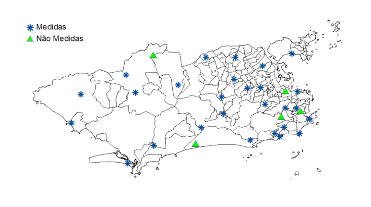
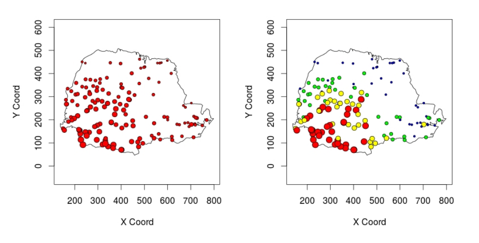
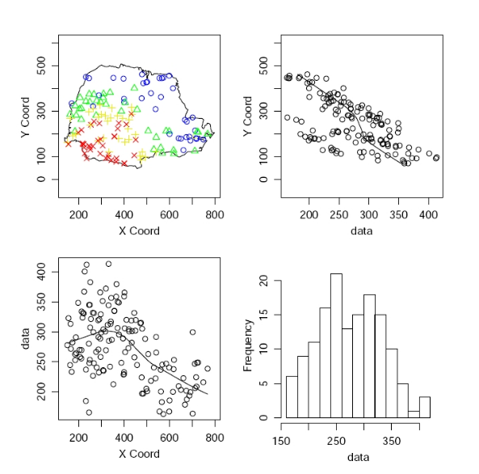
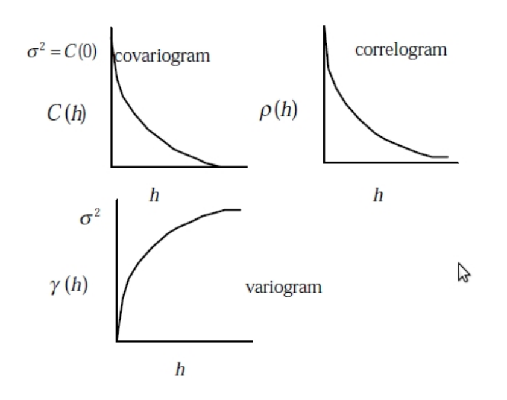
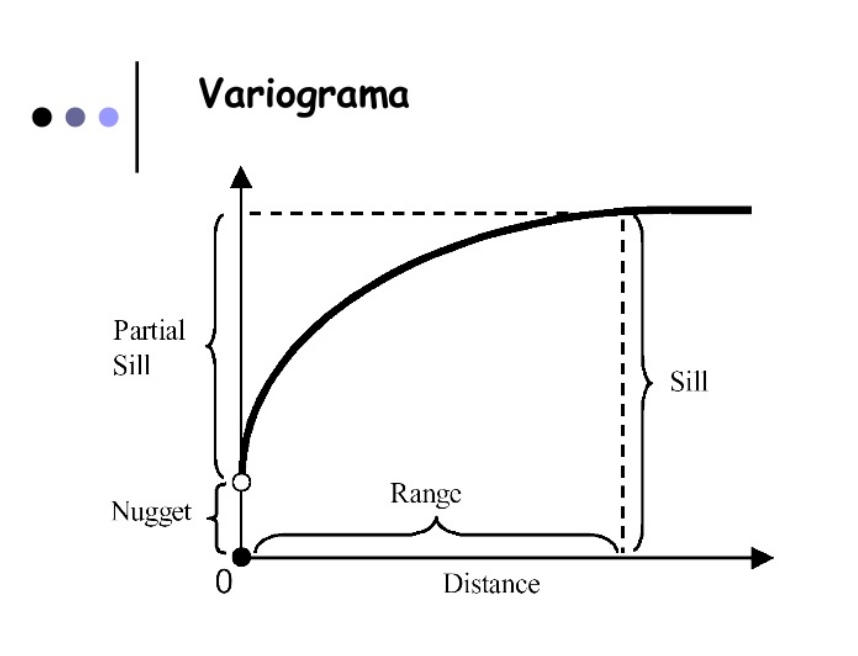
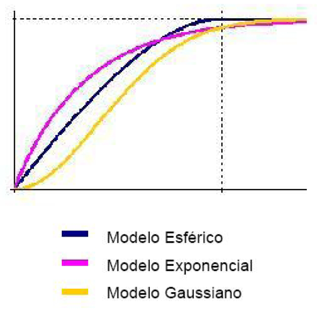
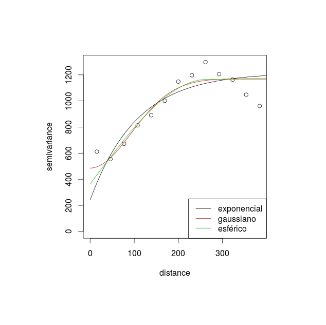
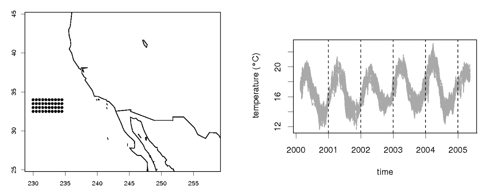
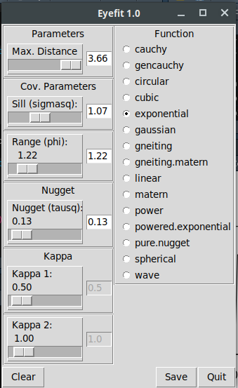

```{r,echo=FALSE,message=FALSE,warning=FALSE}
library(knitr)
library(pander)
# Set so that long lines in R will be wrapped:
opts_chunk$set(tidy.opts=list(width.cutoff=50),tidy=TRUE)

```


# Geoestatística

## Conceito

Podemos definir como sendo uma análise de um atributo espacialmente contínuo amostrado em localizações fixas. 

Os dados compreendem um conjunto de localizações (em geral latitudes e longitudes), mas agregados a cada uma delas, uma medida. Como por exemplo:

- O volume de chuva medido em estações de monitoramento;
 
- O número de ovos do *Aedes aegypti* postados em ovitrampas.
 
## Objetivos

- Entender o padrão dos valores amostrados nestas localizações;

- Estimar valores em localizações sem medidas dado os valores observados em localizações com medidas.

## Principais aplicações

- Geologia

- Ciências ambientais (chuva, temperatura, umidade, poluentes no ar, etc.)

## Exemplo

Estações de monitoramento pluviométrico da cidade do Rio de Janeiro.

{width=90%}

Interesse: Fazer previsão para alguns pontos da cidade ou para toda a cidade.

## Efeitos

Os fenômenos espaciais são o resultado de uma mistura de efeitos de primeira e segunda ordem.

- **Efeitos de primeira ordem:** variação do valor médio do processo no espaço, ou seja, tendência global ou de grande escala.

- **Efeitos de segunda ordem:** resultam da estrutura de correlação espacial ou dependência espacial do processo, ou seja, são efeitos locais ou de pequena escala.


## Formalizando 

- Seja $Y(s)$ um vetor aleatório nas localizações $s$, onde $s$ varia continuamente sobre $D$, um subconjunto fixo de $R^2$ .

- Em geral existem $n$ estações de coleta de dados onde são observadas as variáveis $(Y(s_1), ... , Y(s_n))$.

- Podemos particionar os dados espacialmente contínuos em dois termos: uma média e um erro associado:

$$Y(s) = \mu(s) + e(s)$$

- A análise espacial é composta por um conjunto de procedimentos cuja finalidade é a escolha de um modelo que considere explicitamente a componente espacial existente.


## Efeito de primeira ordem: regressão linear 

Supondo  $\mu(s) = \mu(x, y) = \beta_0 + \beta_1 x_1 + \beta_2 x_2$, temos

$$Y(s) = \mu(s) + e(s)$$

$$Y(s) = \beta_0 + \beta_1 x_1 + \beta_2 x_2 + e(s)$$ sendo $e(s) \sim N(0, \sigma^2)$


  
## Efeito de segunda ordem: regressão espacial 

Supondo  $\mu(s) = \mu(x, y) = \beta_0 + \beta_1 x_1 + \beta_2 x_2$, temos

$$Y(s) = \mu(s) + e(s)$$

$$Y(s) = \beta_0 + \beta_1 x_1 + \beta_2 x_2 + e(s)$$ sendo $e(s) \sim N(0, \sigma^2)$


  
  
Deste modo, denotamos a média e a variância do processo por:

$E(Y(s)) = \mu(s)$ e $Var(Y(s)) = \sigma^2(s)$

A covariância desse processo em dois pontos distintos, $s_i$ e $s_j$ , será dada por:

$$C(s_i, s_j) = E((Y(s_i) − \mu(s_i))(Y(s_j) − \mu(s_j))$$

E a correlação será:

$$\rho (s_i, s_j) = \dfrac{C(s_i, s_j)}{\sigma(s_i) \sigma(s_j)} $$


## Análise exploratória

Inicialmente são utilizadas técnicas de análise exploratórias e de visualização dos dados.

Para os **efeitos de primeira ordem**:

- Mapa com a localização dos pontos e a intensidade do processo.

- Plot de $Y(s)$ *versus* cada coordenada, por exemplo latitude e longitude.

Para os **efeitos de segunda ordem**:

- Covariograma

- Variograma


### Análise exploratória: efeitos de primeira ordem

Exemplo: Medidas pluviométricas em 143 estações monitoradoras no estado do Paraná

{width=90%}

Analisando a variação da intensidade da chuva segundo Latitudine (Y) e Longitude (X)

{width=80%}


## Simplificações: Estacionariedade e Isotropia

Quando o processo é **estacionário**:

- A média $E(Y(s)) = \mu$ para todo $s$

- A variância $Var(Y(s + h) − Y (s)) = 2 \gamma (h)$

para a qual $2 \gamma (h)$ é chamado de variograma e $\gamma (h)$ é o semi-variograma.

- A covariância

$$C(s_i, s_j) = C (s_i − s_j ) = C(h)$$

Sendo $C(h)$ o covariograma do processo.

\

Quando o processo é **isotrópico**:

$$C(s_i, s_j ) = C(||s_i − s_j ||) = C(h)$$

para a qual $||.||$ denota distância euclideana.

\

## Variograma empírico

Um estimador natural para o variograma (variograma empírico), considerando a distância $h$, é:

$$2 \gamma^2 (h) = \dfrac{1}{n(h)} \sum_{s_{i} - s_{j} = h} (y(s_i) - y(s_j))^2$$

para a qual a soma é feita sobre todos os pares de dados observados com uma distância $h$ e $n(h)$ é o número de pares com distância $h$.

Exemplo: Variograma empírico para os dados de chuva do Paraná.

{width=60%}

### Relação entre variograma, covariograma e correlograma

{width=70%}

- Para um processo espacial estacionário, o covariograma, o correlograma e o variograma fornecem informações similares;

- O covariograma e o correlograma têm a mesma forma, sendo que o correlograma possui como máximo o valor 1;

- O variograma também tem a mesma forma do covariograma, mas aparece "invertido";

- Enquanto o covariograma começa de um máximo em $\sigma^2$ em $h = 0$ e decresce até 0, o variograma inicia em 0 e cresce até um máximo de $\sigma^2$.

### Estrutura do variograma

{width=70%}

Observando o gráfico do variograma podemos destacar alguns elementos importantes:

- **Nugget (Efeito pepita):** representa os possíveis erros de medida, por exemplo, devidos ao processo de coleta. É o valor de $\gamma(0) = \tau^2$;

- **Sill (Patamar):** é o valor do variograma onde concluímos não haver mais correlação entre as observações, ou que elas sejam pouco correlacionadas;

- **Range (Amplitude):** é o valor da distância a partir da qual concluímos não haver mais correlacão entre as observações, ou que elas são pouco correlacionadas. No variograma a amplitude é o ponto de $x$ onde a curva atinge um patamar.


### Variogramas para modelos isotrópicos

Alguns exemplos de funções de variogramas para modelos isotrópicos:

- **Esférica:**
 
$\gamma (h) = \left\{ \begin{array}{rll}
\sigma^2 &  h > \phi \\
\sigma^2 \left\{ \dfrac{2}{3}  \left( \dfrac{h}{\phi} \right) - \dfrac{1}{2} \left( \dfrac{h}{\phi}\right)^3  \right\} &  0 < h < \phi
\end{array}\right.$


- **Exponencial**

$\gamma(h)=  \sigma^2(1 - exp\{-(\dfrac{h}{\phi})\})$ , $h > 0$


- **Gaussiano**

$\gamma(h)= \sigma^2(1 - exp\{-(\dfrac{h}{\phi})^2\})$  , $h > 0$


{width=60%}

- O modelo gaussiano, por exemplo, apresenta um crescimento lento e um comportamento parabólico próximo a origem e fornece um modelo para fenômenos extremamente contínuos.

- O modelo exponencial cresce mais rapidamente perto da origem mas a aproximação da função ao patamar é mais lenta.

- Frequentemente os modelos são ajustados aos dados observados no variograma empírico, apenas por uma comparação visual.

Por exemplo, para os dados de chuva do Paraná, utilizando diferentes variogramas:

{width=90%}

### Aplicação 1

- Dados de temperatura para uma região do oceano pacífico na costa da Califórnia.

- As medidas correspondem a uma grade regular 10 x 4(longitude x latitude) com uma resolução espacial de 0,5 ($n = 40$).

- Os dados foram registrados a cada 8 dias de julho de 2000 a maio de 2005 (T=240).

{width=90%}


### Aplicação 2

- Contagem de ovos de Aedes aegypti em armadilhas de oviposição colocadas em Higienópolis (área urbana).

- Os dados foram registrados por semana epidemiológica de setembro de 2006 a março de 2008.

{width=100%}

## Modelagem em Geoestatística

Em geral, assumimos que $Y(s)$ segue um processo Gaussiano tal que 

$$Y(.) \sim PG(\mu(.), c(.; .))$$

sendo $\mu(.)$ é a tendência do processo $Y(.)$ e $c(.; .)$, sua função de covariância.

A tendência pode ser explicada através de funções polinomiais das coordenadas geográficas, funções suaves (ex: *thin plate splines*) e covariáveis medidas nas mesmas localizações.

- Os variogramas e covariogramas empíricos correspondem a uma estimativa da estrutura de covariância, sob a hipótese de alguma estacionaridade.

- Se não temos estacionaridade, os variogramas e covariogramas empíricos podem ser dominados por efeitos de primeira ordem.

- A matriz de covariância deve ser simétrica e positiva definida.

- A matriz de covariância é estimada através de modelos paramétricos.

Por exemplo: função de covariância exponencial, gaussiana, Matérn, etc.

### Modelando dados de Geoestatística - Dados de chuva no Paraná

Podemos ajustar o seguinte modelo:

$$chuva(s) = \beta_0 + \beta_1 lat(s) + \beta_2 long (s) + Z (s) + e(s)$$

para o qual:

- Z(.) é um processo Gaussiano com média 0 e estrutura de correlação, $\rho(.; \phi)$, dada pela função exponencial e variância igual a $\sigma^2$.

- A componente $e(.)$ representa o erro de medida (**efeito pepita**) tal que $e(.) \sim N(0, \tau^2)$.

## Krigagem

- O principal interesse em geoestatística é prever valores de uma variável que é espacialmente contínua, em localizações em que esta não foi medida.

- A técnica de prever para localizações não medidas, é chamada frequentemente de **krigagem**. 

- O nome deriva do geólogo sul africano *D. G. Krige* que desenvolveu a primeira versão do método.

- Estima o processo em uma localização não observada $s'$, $\hat{Y}(s')$ .

Uma forma simples de obter estimativas para uma localização não medida é:

$$\hat{y}(s') = \hat{\mu}(s')$$

Neste caso, estamos considerando apenas efeitos globais.

Podemos utilizar o conhecimento sobre a função de covariancia $C$ para adicionar à previsão uma estrutura de efeitos locais.

**Tipos de krigagem:**

- Krigagem simples

- Krigagem ordinária

- Krigagem universal

- Krigagem bayesiana

### Krigagem Universal

- Assume-se que existe um componente de tendência, ou seja, $\mu(s) = x(s)\beta$ .

- Vamos estimar $\hat{y}(s')$ através de uma combinação linear ponderada dos valores observados nas localizações medidas.

$$\hat{y}(s') = \sum_{i=1}^{n} \lambda_i(s')y(s_i)$$

sendo $\lambda_i(s')$ o peso dado a cada $y(s_i)$ e esse peso é função da covariância.

### Algumas considerações da krigagem em geral:

- Vale lembrar que todo processo está suscetível à escolha dos modelos para a tendência e para o variograma.

- Uma maneira de avaliar todo o procedimento é fazer uma validação cruzada.

- Na validação cruzada, cada elemento observado, $y(s_i)$, é retirado e utilizando o restante dos dados fazemos uma previsão para a localização retirada. Como resultado, obtemos um conjunto de $n$ erros de previsão entre o valor observado e o valor predito.

- Esses erros podem ser analisados e podemos avaliar o processo de krigagem e se necessário podemos fazer ajustes no modelo para o variograma ou para a superfície de tendência.

### Krigagem - Dados de chuva no Paraná

O modelo ajustado com as estimativas dos parâmetros são:

$$chuva(s) = 421.8 − 0.15 lat(s) − 0.39 long (s) + Z (s) + e(s)$$

sendo:

- $Z(s)$ um processo Gaussiano com média $0$ e estrutura de correlação exponencial com $\phi = 130$ e variância igual a $\sigma^2 = 685$.

- A variância do efeito pepita $\tau^2 = 480$.

Utilizando a krigagem universal, obtemos:


{width=80%}


## Prática no R 

## Aplicação 1 - Dados de temperatura


Lendo o banco:

```{r echo=T, fig.align="center", message=FALSE, warning=FALSE, comments=NA, out.width="80%", comment=NA, results="markdown"}
local <- 'https://gitlab.procc.fiocruz.br/oswaldo/eco2019/raw/master/dados/'
temperatura <- read.table(paste0(local,"temperatura.dat"))
```

Carregando o pacote geoR:

```{r echo=T, fig.align="center", message=FALSE, warning=FALSE, comments=NA, out.width="80%", comment=NA, results="markdown"}
library(geoR)
```

Transformando em objeto geodata:

```{r echo=T, fig.align="center", message=FALSE, warning=FALSE, comments=NA, out.width="80%", comment=NA, results="markdown"}

temp.geo <- as.geodata(temperatura, coords.col=1:2, data.col=3)
summary(temp.geo)

```

Análise exploratória:

```{r echo=T, fig.align="center", message=FALSE, warning=FALSE, comments=NA, out.width="80%", comment=NA, results="markdown"}

points(temp.geo) 

```

Controlando o tamanho dos pontos:

```{r echo=T, fig.align="center", message=FALSE, warning=FALSE, comments=NA, out.width="80%", comment=NA, results="markdown"}

points(temp.geo, pt.div="equal")  
points(temp.geo, cex.min=.6, cex.max=.6)
points(temp.geo, cex.min=.3, cex.max=3,col=2)

```

Dividindo os dados em quantis:

```{r echo=T, fig.align="center", message=FALSE, warning=FALSE, comments=NA, out.width="80%", comment=NA, results="markdown"}

points(temp.geo, cex.min=1, cex.max=1, pt.div="quart")
points(temp.geo, pt.div="quart")
points(temp.geo, pt.div="dec")
points(temp.geo, cex.min=1, cex.max=1, pt.div="quint")

```

Modificando o formato dos pontos:

```{r echo=T, fig.align="center", message=FALSE, warning=FALSE, comments=NA, out.width="80%", comment=NA, results="markdown"}

points(temp.geo, pt.div="equal", pch.seq="+")
points(temp.geo, pt.div="data.proportional", pch.seq="+")

```

Removendo a tendência, isto é, fazendo o gráfico dos resíduos de uma regressão linear nas coordenadas:

```{r echo=T, fig.align="center", message=FALSE, warning=FALSE, comments=NA, out.width="80%", comment=NA, results="markdown"}

points(temp.geo, trend="cte",col=2)
points(temp.geo, trend="1st",col=2)

```

Outros gráficos:

```{r echo=T, fig.align="center", message=FALSE, warning=FALSE, comments=NA, out.width="80%", comment=NA, results="markdown"}

plot.geodata(temp.geo)
plot.geodata(temp.geo, low=T)
plot.geodata(temp.geo, trend="1st", low=T)

```

Calculando o variograma:

```{r echo=T, fig.align="center", message=FALSE, warning=FALSE, comments=NA, out.width="80%", comment=NA, results="markdown"}

variog.temp <- variog(temp.geo, max.dist=4)
plot(variog.temp, main="variograma") 
variog.temp2 <- variog(temp.geo, max.dist=4, trend="1st")
plot(variog.temp2, main="variograma") 

```


Ajustando os parâmetros do variograma de maneira interativa

```R
dev.new()
variog.temp <- eyefit(variog.temp)
```

{width=50%}


Utilizando a função variofit para estimar os parâmetros da função de covariância:

```{r echo=T, fig.align="center", message=FALSE, warning=FALSE, comments=NA, out.width="80%", comment=NA, results="markdown"}

wls1 <- variofit(variog.temp2,cov.model="matern",fix.nugget=FALSE)
#summary(wls1)
wls2 <- variofit(variog.temp2,cov.model="exponential",fix.nugget=FALSE)
#summary(wls2)
wls3 <- variofit(variog.temp2,cov.model="gaussian",fix.nugget=FALSE)
#summary(wls3)
wls4 <- variofit(variog.temp2,cov.model="spherical",fix.nugget=FALSE)
#summary(wls4)

```

```{r echo=T, fig.align="center", message=FALSE, warning=FALSE, comments=NA, out.width="80%", comment=NA, results="markdown"}

par(mfrow=c(2,2))
plot(variog.temp2, main="matern")
lines(wls1)
plot(variog.temp2, main="exponencial")
lines(wls2)
plot(variog.temp2, main="gaussian")
lines(wls3)
plot(variog.temp2, main="esférico")
lines(wls4)

```

```{r echo=T, fig.align="center", message=FALSE, warning=FALSE, comments=NA, out.width="80%", comment=NA, results="markdown"}

par(mfrow=c(1,1))
plot(variog.temp2)
lines(wls1)
lines(wls2, col=2)
lines(wls3, col=3)
lines(wls4, col=4)
legend("bottomright", legend=c("matern","exponencial","gaussiano","esférico"), col=1:4, lty=1)

```

### Krigagem 

```{r echo=T}
resp.kg <- krige.conv(temp.geo, loc=temp.geo$coords,
                      krige = krige.control(cov.pars = c(0.14,1.60)))
image(resp.kg)


```

Interpolando para a grade

```{r echo=T}
grade <- expand.grid(seq(230.0,234.5,length.out = 200),seq(32.5,34.0,length.out = 200))

resp.kg2 <- krige.conv(temp.geo,loc=grade ,krige = krige.control(cov.pars = c(1.52,1.60)))
image(resp.kg2)
image(resp.kg2, val=sqrt(resp.kg2$krige.var), main="Erro padrão kriging")
```


## Repita a análise para o banco de ovos em Higienópolis 

Lendo o banco:

```{r echo=T, fig.align="center", message=FALSE, warning=FALSE, comments=NA, out.width="80%", comment=NA, results="markdown"}

higi <- read.table(paste0(local,"ovoshigi.dat"))
higi.borda <- read.table(paste0(local,"points_higi.dat"))

```

Transformando em objeto geodata:

```{r echo=T, fig.align="center", message=FALSE, warning=FALSE, comments=NA, out.width="80%", comment=NA, results="markdown"}

ovo.geo <- as.geodata(higi, coords.col=1:2, data.col=3)
summary(ovo.geo)
points(ovo.geo, col=2, bor=higi.borda)

```

## Bibliografia sugerida

Diggle, Peter J. & Ribeiro Jr, Paulo Justiniano; Model-based Geostatistics Series: Springer Series in Statistics, 2007.

Isaaks and Srivastava; An Introduction to Applied Geostatistics 1st Edition, 1989.
 
Cressie, N. A. Statistics For Spatial Data. Revised edition. Iowa State Univesity, New York: A Wiley Interscience Publication, 1993.
 
