```{r,echo=FALSE,message=FALSE,warning=FALSE}
library(knitr)
library(pander)
# Set so that long lines in R will be wrapped:
opts_chunk$set(tidy.opts=list(width.cutoff=50),tidy=TRUE)

```

# Análise Espaço-Temporal

## Alguns Conceitos

> "Senhores, as idéias sobre espaço e tempo que eu gostaria de falar a vocês nasce do solo da física experimental. É daí que provêm sua força. A proposta é radical. De agora em diante, espaço por si só e tempo por si só devem desaparecer nas sombras, enquanto somente a união dos dois preserva sua independência."

[*Minkowski*](https://pt.wikipedia.org/wiki/Hermann_Minkowski), Setembro de 1908.


- O interesse na distribuição espaço-temporal esteve presente desde os primórdios da epidemiologia.

- Entretanto, apesar de técnicas que permitem a incorporação das dimensões **tempo e espaço** serem utilizadas, apenas **recentemente** a interação **espaço-tempo** tem sido considerada.

## Processo de difusão das doenças

Um exemplo de simulação por multi-agentes

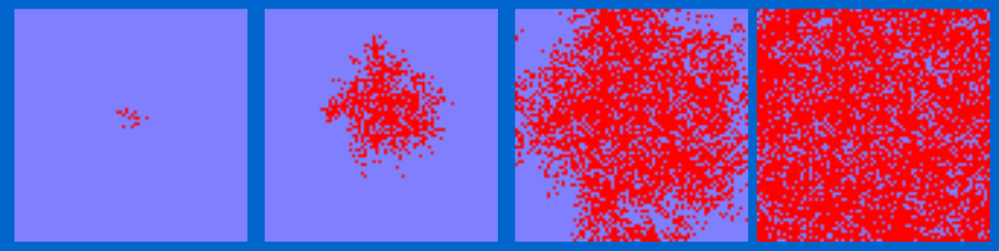{width=80%}

### Difusão Espacial

**Difusão** - dispersar a partir de um centro, disseminar, propagar, espalhar.

Em geografia utiliza-se 2 conceitos:

- **Difusão por expansão:** Quando um material, uma informação, etc... se espalha de um local p/ o outro, permanecendo (ou até mesmo se intensificando) na região inicial. 

Ex: doença transmissível.

- **Difusão por realocação:** Quando o material difundido deixa a área original e se move p/ novas áreas. 

Ex: Movimentos migratórios.


<!-- - Difusão por **expansão** também pode ocorrer através de uma sequência de classes locais, neste caso é denominado espalhamento **hierárquico** (ex: moda, bens de consumo), que tendem a passar por classes sociais diferentes e se irradia a partir das grandes metrópoles. -->

<!-- - Difusão em **cascata** é um caso particular, onde a difusão sempre se dá dos grandes centros p/ os menores. -->

Padrões de difusão espacial para doenças:

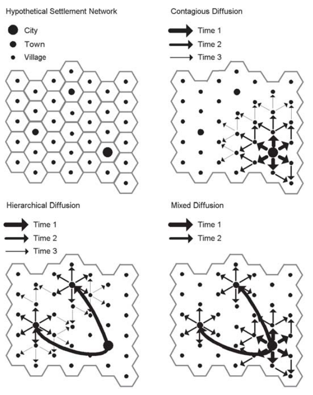

Fonte: GIS and public health / by Ellen K. Cromley and Sara L. McLafferty. — 2nd ed

- Na geografia houve um grande interesse por modelos de difusão desde do inicio do século, e se intensificou a partir da década de 50 com o trabalho pioneiro de [*Hägerstrand*](https://en.wikipedia.org/wiki/Torsten_H%C3%A4gerstrand). Um dos principais interesses dos geógrafos eram os modelos de difusão de inovações tecnológicas.

- Na epidemiologia, por outro lado, devido a influência de [* R Ross (1915);AG McKendrick & WO Kermack (1927) ;  W Hamer (1928)* ](https://en.wikipedia.org/wiki/Mathematical_modelling_of_infectious_disease), os modelos compartimentais foram mais utilizados. Estes modelos  pressupõem uma mistura homogênea da população o que raramente é verdade. 

### Espacializando a difusão das doenças

- O principal desafio é como introduzir as dimensões espaço e tempo na modelagem da difusão das doenças transmissíveis.

- Qual o impacto do espaço e da interação espaço-tempo ?

- Eles são capazes de mudar parâmetros inferidos para a interação das populações envolvidas ?

- São capazes de trazer novidades na análise e interpretação de resultados ?

- Quais os possíveis modelos e maneiras de incorporar o espaço e tempo ?

### Processo de difusão das doenças

- Sob o ponto de vista da Ecologia, mais especificamente da dinâmica de populações uma doença transmissível, é o resultado da interação entre pelo menos 2 espécies
(parasita X hospedeiro).

- Também na ecologia os modelos de crescimento populacional, interação entre espécies, competição e etc... apesar de utilizarem o tempo em suas equações de
crescimento [*Lotka-Volterra*](https://pt.wikipedia.org/wiki/Equa%C3%A7%C3%A3o_de_Lotka-Volterra) não incorporam a dimensão espaço.

- A introdução do espaço nos modelos, mesmo com uma única espécie, é capaz de alterar a inferência dos parâmetros a respeito da dinâmica desta espécie.


### Modelos de difusão de doenças

- No início do século XX surgiram os primeiros modelos de transmissão de doenças , que consideravam que o curso de uma epidemia deveria depender do número de suscetíveis, das taxas de contato entre os indivíduos infectados e suscetíveis e do número de infectados.

- A partir daí, diversos modelos determinísticos foram empregados permitindo inferir parâmetros de epidemias.

- À medida em que o interesse se volta para pequenas populações e eventos raros, foram introduzidos modelos estocásticos.

- No entanto, a medida que se adiciona variáveis (por exemplo, estrutura etária, populações de vetor) esses modelos se tornam muito complexos, dificultando ou
impossibilitando uma solução analítica.

- Neste contexto pode-se empregar métodos numéricos ou simulações na estimação parâmetros. No entanto a inclusão do espaço e tempo dificultam em muito ou
mesmo inviabilizam a convergência nessa classe de modelos.

- Os avanços na modelagem espaço-temporal empregam modelos bayesianos (MCMC) onde é possível modelar os componentes espaço-temporais.

## Analise Exploratória Espaço-temporal

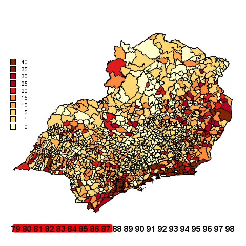{width=50%}

Animação da Taxa bruta dos Homicídios em homens de 15-49 anos no sudeste de 1980 a 1998  

[Ver animação taxa bruta](video_taxa.html)

<!-- [Ver animação taxa bruta](https://own.procc.fiocruz.br/owncloud/index.php/s/Xk67ALqasjCFNtJ) -->

<!-- [Ver animação taxa bruta](https://drive.google.com/file/d/1QteyaWCwdu3zhmykeGkOi2H89R-y-w--/view) -->

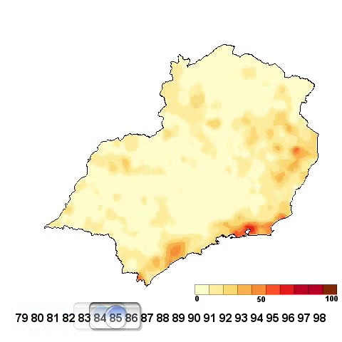{width=50%}

Animação da Taxa suavizada no tempo (media móvel) e no espaço (Kernel 2d)  Homicídios em homens de 15-49 anos no sudeste de 1980 a 1998   


[Ver animação suavizada (tempo e espaço)](video_kernel.html)

<!--  -->
<!-- [Ver animação suavizada (tempo e espaço)](https://drive.google.com/file/d/1nvZJBcU1Btu7ybmf2fgwb4rfpOFCZIEu/view) -->


## Cluster Espaço-Temporal

- Um cluster (aglomerado/conglomerado) é qualquer agregado espacial de eventos que seja estatisticamente não aleatório.

- Um cluster representa uma região cujo risco de ocorrência de um fenômeno é alto ou baixo quando comparado às demais áreas de estudo.

- Objetivo: identificar áreas de risco elevado em áreas específicas da região de estudo. 
    - Também pode ser utilizado para identificar áreas de risco menor que o esperado.

- A estatística de varredura (*scan*) de Kulldorff (*SaTScan*) pode ser aplicada a dados espaciais, temporais, ou espaço-temporais, para vários modelos de probabilidade.

- Alternativa aos **Índices I de Moran** e **C de Geary**.


### A estatística scan

- A estatística Scan foi desenvolvida por Kulldorff e Nagarwalla (1995) e, para sua aplicação, a informação da área é associada a um único ponto dentro do polígono (ex: centróide).

- Para detecção de aglomerados espaço-temporais, a estatística scan se baseia em um algoritmo que percorre a área de estudo como um cilindro, com variados tamanhos, que se move no espaço (base do cilindro) e no tempo (altura do cilindro) em busca de áreas cuja ocorrência de um fenômeno seja significativamente mais provável.

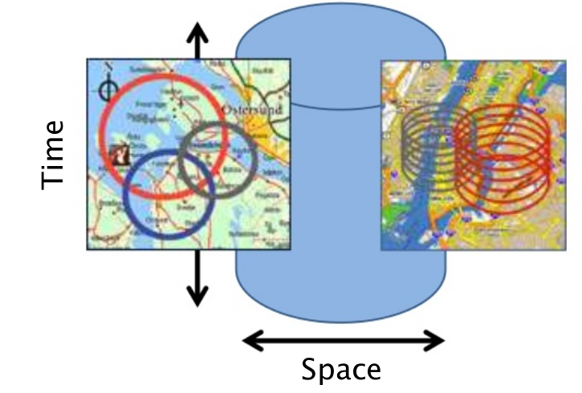{width=50%}

- A hipótese nula é de que não existe clusters na região de estudo.

- As hipóteses são testadas por meio de um teste da razão de verossimilhança.

- Simulação é utilizada para verificar a significância.

- [Software SaTScan](https://www.satscan.org/)

- O SaTScan ser rodado de dentro do R através do pacote `rsatscan`, porém o software precisa estar instalado na máquina.

\

Quando se trata de estudos com dados de contagem (por exemplo, número de homicídios por localidade) os modelos de probabilidade comumente usados são Poisson e de Permutação Espaço-Tempo.

O modelo Permutação Espaço-Tempo possui a mesma ideia básica do modelo Poisson, entretanto três características o diferenciam:

- Este modelo só trabalha com interação espaço-tempo, ou seja, procura apenas clusters que ocorrem no espaço e no tempo simultaneamente (o modelo Poisson pode ser apenas espacial);

- Tem a flexibilidade de trabalhar apenas com os casos, ou seja, não é necessário informação da população;

- Seu modelo probabilı́stico resulta que os casos seguem a distribuição Hipergeométrica, sob a hipótese nula
.

### Aplicação 1 - Leptospirose no Rio de Janeiro

[Detection and modelling of case clusters for urban leptospirosis](https://www.arca.fiocruz.br/bitstream/icict/12207/2/Tassinari%20WS%20Detection%20and%20modeling....pdf)


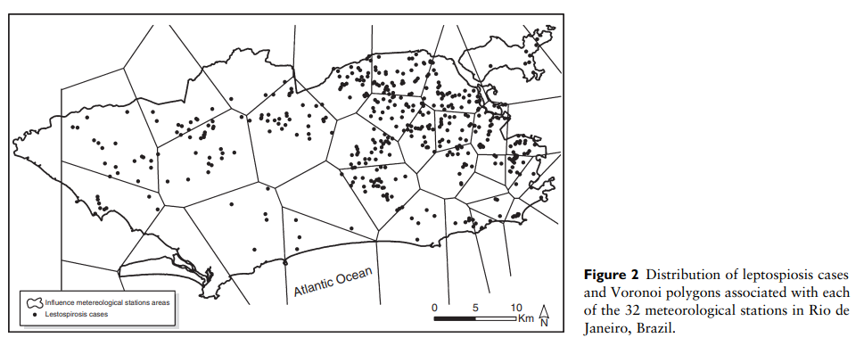{width=100%}

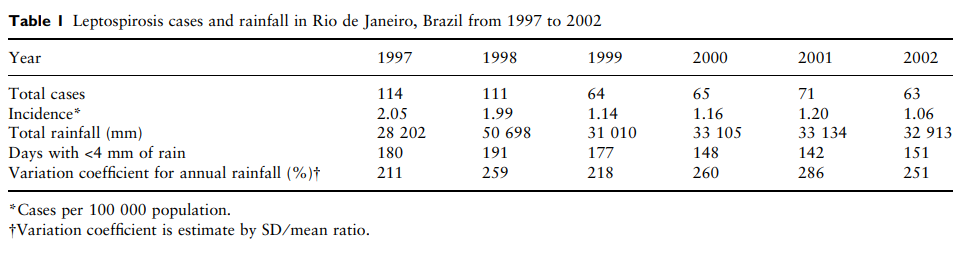{width=100%}

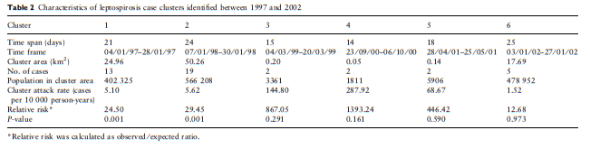{width=100%}

Clusters ocorreram no verão com uma janela temporal de 14 a 25 dias.

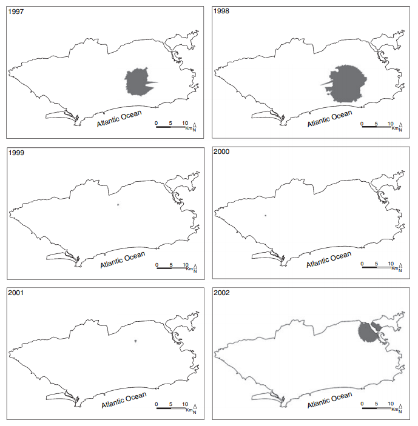{width=100%}


<!-- Oswaldo, tirei a figura abaixo pois é do modelo e não do satscan -->
<!-- 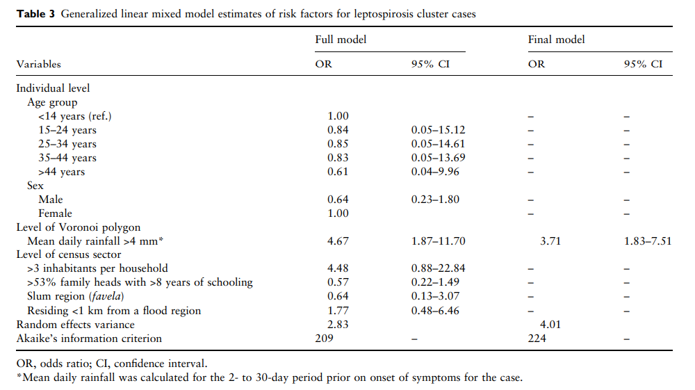{width=100%} -->


### Aplicação 2 - Arboviroses no Rio de Janeiro

[Space–time dynamics of a triple epidemic: dengue, chikungunya and Zika clusters in the city of Rio de Janeiro](https://royalsocietypublishing.org/doi/10.1098/rspb.2019.1867)


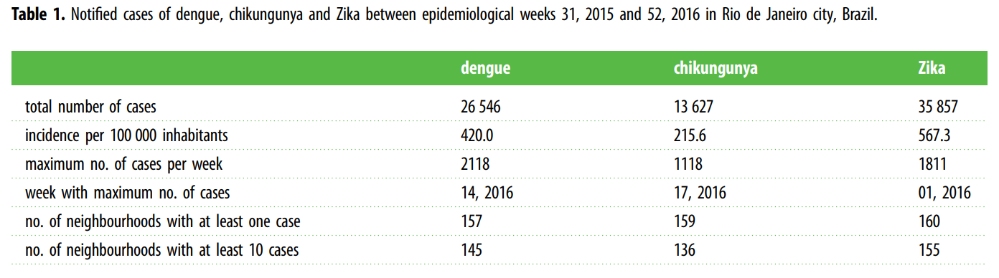{width=100%}

Número de casos de dengue, chikungunya e Zika entre 2 de Agosto 2015 e 31 de Dezembro 2016, Rio de Janeiro:

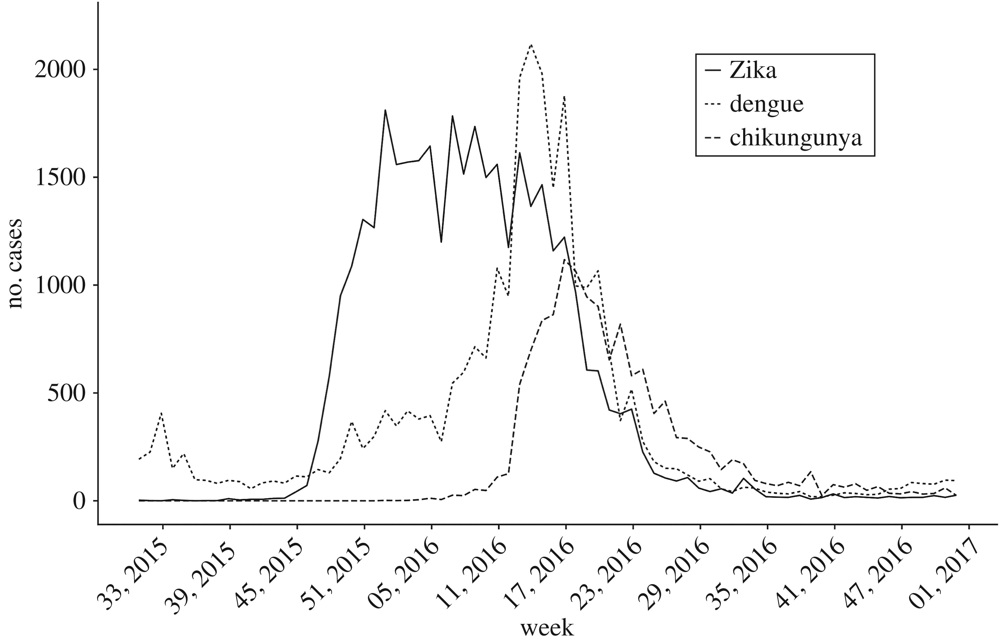{width=100%}

Zika cases clusters:

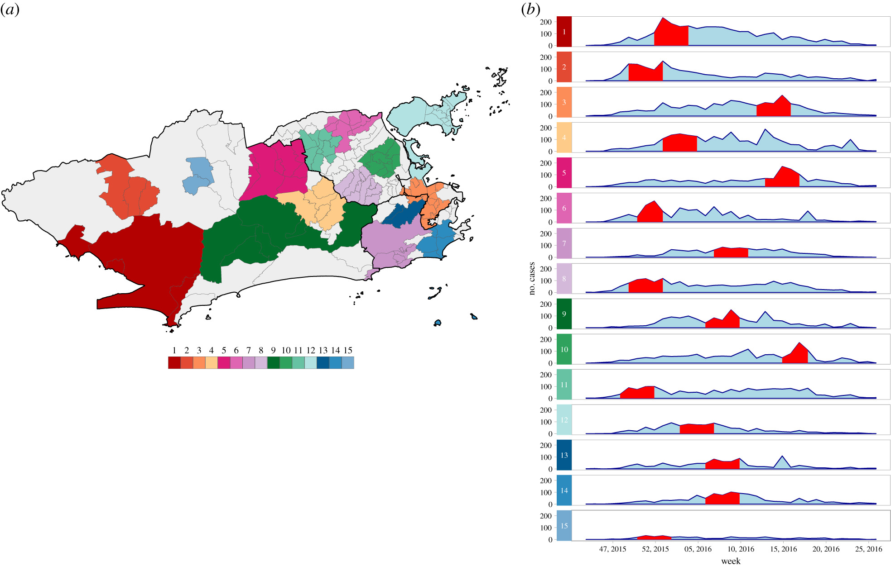{width=100%}

Dengue, chikungunya and Zika multivariate clusters:

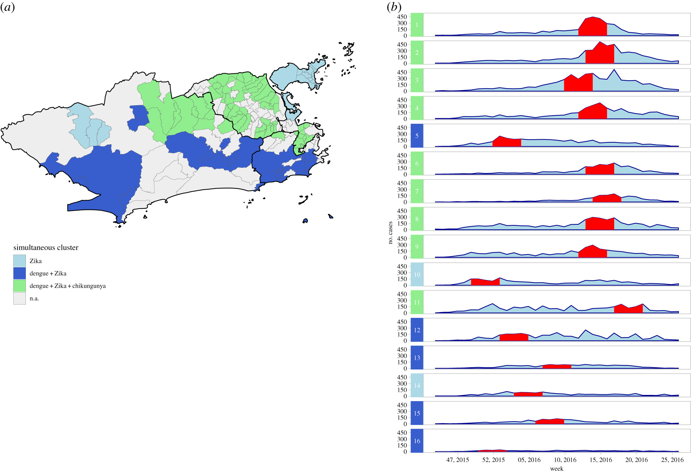{width=100%}


## Modelagem Estatística Espaço-temporal

- Diversas estratégias podem ser empregadas para modelar fenômenos espaço-temporais. Sendo que esta área recentemente, diversas famílias de modelos tem sido propostos. A seguir mostraremos uma aplicação utilizando Modelo Hierárquico Bayesiano Espaço-Temporal.

- Modelagem Espaço-temporal dos homicídios na Região Sudeste, utilizando Modelos Aditivos Generalizados Mistos (GAMM).

- O modelo proposto segue uma distribuição de Poisson, onde o numero de casos de homicídios em cada município num determinado ano é dado por:

  - Componente de tendência temporal;
  
  - Componente espacialmente estruturado;

  - Componente espacial não estruturado (aleatório);
  
  - Efeito de pertencer ou não a um determinado estado;
  
  - Pertence ou não a uma região metropolitana.
  
Modelo aditivos generalizados mistos (GAMM):

$$y_{it} \sim Poisson(\lambda_{it})$$

$$log(\lambda_{it}) = offset(pop) + \beta_i\sum x_{ik} + f^{tend}_{tempo} +  f^{sazonal}_{tempo}  +  f^{estrut}_{espaço} +  f^{ñestrut}_{espaço}$$

Sendo $\beta_i\sum x_{ik}$ os efeitos fixos.


- A estimação dos parâmetros foi obtida por inferência bayesiana utilizando-se o software [BayesX]{https://www.uni-goettingen.de/de/what+is+bayesx/550520.html}, onde também foi criada a matriz de vizinhança utilizada neste trabalho. 

- Os diagnósticos de convergência fora realizados no [*S-plus*](https://pt.wikipedia.org/wiki/S-PLUS).


### Alguns resultados

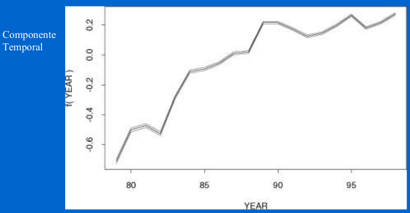{width=80%}

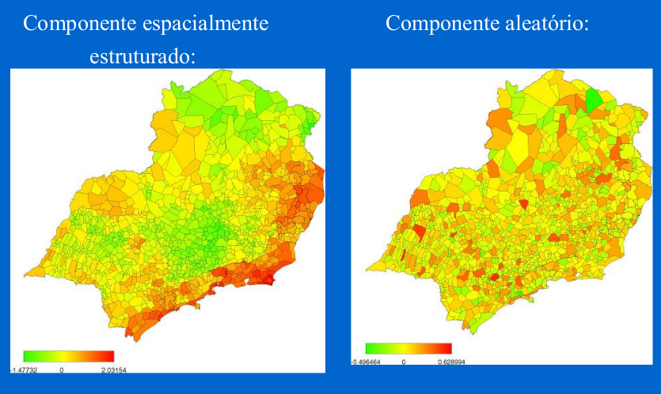{width=80%}

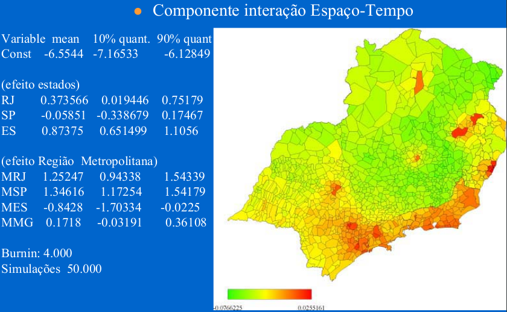{width=80%}

## Bibliografia sugerida

Bernardinelli L, Clayton D, Pascutto C, Montomoli C, Ghislandi M, Songini M. Bayesian analysis of space–time variation in disease risk. Stat Med. 1995;14:2433–2443. 

Diggle,P.J.; Chetwynd,A.G.; Haggkvist,R.; Morris,S.E. (1995). Second-order analysis of space-time clustering. Statistical Methods in Medical Research 4 , 124-136

Waller LA, Carlin BP, Xia H, Gelfand AE. Hierarchical spatiotemporal mapping of disease rates. J Am Stat Assoc. 1997;92:607–617.

Knorr-Held L, Besag J. Modelling risk from a disease in time and space. Stat Med. 1998;17:2045–2060. 

Knorr-Held L. Bayesian modelling of inseparable space–time variation in disease risk. Stat Med. 2000;19:2555–2567.


* Online:

[Geospatial Health Data: Modeling and Visualization with R-INLA and Shiny](https://paula-moraga.github.io/book-geospatial/)
