# Introdução às Séries Temporais


## O que são Séries Temporais ?

- **Definição**: Entende-se por Séries Temporais (ST) todo e qualquer conjunto de dados (absolutos ou relativos, discretos ou contínuos), ordenados cronologicamente.

- **Condição**: Esses dados seguem uma ordenação em função do tempo (dependência temporal).

- De modo geral, as séries temporais apresentam sequências de observações relativas a determinada variável ao longo de um intervalo específico de tempo (dia, mês, trimestre, ano, etc.), isto é, referem-se a fluxos de valores periódicos, os quais dão uma visão geral sobre o andamento ou comportamento da variável em análise.

- A maneira mais comum de visualizar séries temporais é usar um gráfico de linhas simples, em que o eixo horizontal representa os incrementos de tempo e o eixo vertical representa a variável que está sendo medida.

- Seguem abaixo alguns exemplo de séries temporais:


<!-- 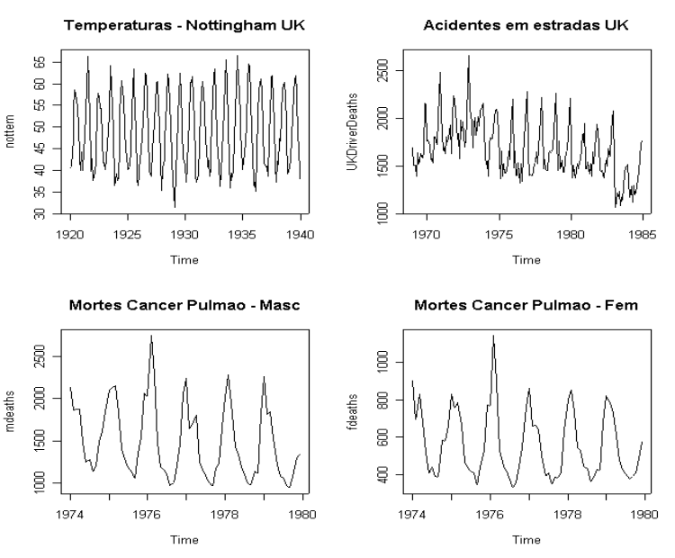{width=770px} -->

- As séries temporais podem ser de natureza **regular** ou **irregular**. 

    - As **séries temporais regulares ou uniformes** são aquelas que podem ser expressas sempre com o mesmo intervalo de tempo (frequência).
    
    - As **séries temporais irregulares ou não uniformes** são aquelas em que as frequências de tempo são diferentes ou que apresentam dados ausentes (*missing data*). Algumas vezes podem ser transformadas em séries regulares agregando ouinterpolando os dados mensurados.


##  Hipóteses básicas do estudo das séries temporais

- Há um sistema causal relacionando as variáveis no tempo;

- Ao longo do tempo, o sistema influencia todos os dados sob análise, de modo regular  e permanente;

- Os dados históricos refletem a influência média de um conjunto de fatores.


Tais hipóteses se baseiam no pressuposto de que as relações apontadas pela experiência pregressa permitem prever o possível comportamento das variáveis sob análise, determinando se seu comportamento apresenta propriedades **determinísticas** e/ou **aleatórias**.


## Classificação dos tipos de séries temporais

- **Contínuas:** A informação é obtida em qualquer intervalo de tempo (podendo ser discretizando em intervalos iguais) ou é acumulada por período.
**Ex:** Temperatura, pluviosidade, partículas em suspensão.


- **Discretas:** Observações obtidas em intervalos de tempo discreto e equidistantes (ano, mês, dias, semanas epidemiológicas).
**Ex:** Mortalidade infantil, notificações por DIC.

- **Multivariada:**  São várias coleções de observações para a mesma sequência de períodos de tempo, ou seja,envolvem mais de uma série histórica.
**Ex:** Número de homicídios e acidentes no Sudeste.

- **Multidimensional:**  São várias coleções de observações para a mesma sequência de períodos de tempo, descrevendo o mesmo fenômeno em diferentes contextos.
**Ex:** Número de AVCs em diversas UFs.

## Processo Estocástico

- Um processo estocástico pode ser pensado de duas formas:

    - um conjunto de possíveis trajetórias de um fenômeno físico que poderiam ser observadas;
    
    - um conjunto de variáveis aleatórias, uma para cada tempo $t$.
    
- Cada valor observado de uma trajetória é um dos possíveis valores que poderiam ter sido observados, de acordo com a distribuição de probabilidades da respectiva variável aleatória.

- Definir séries temporais consiste em determinar as funções matemáticas que apontam suas componentes básicas e permitem prever a evolução dos fenômenos estudados (como um eventual crescimento ou decrescimento futuro).

- As séries temporais podem ser matematicamente representadas por funções do tipo:

 $$Z_t = f(tempo, a)$$

Sendo $Z_t$ o valor da variável $Z$ no tempo $t$, e $a$ a componente aleatória associada à função matemática do tempo.


- Série com a mesma estrutura: cada série é uma possível realização do mesmo processo estocástico.

{width=670px}


## Notação e Nomenclatura

- Matematicamente, uma série temporal discreta é representada por: $Z_t = (Z_1 , Z_2 , Z_3 , ... , Z_n)$, sendo: $Z$, a variável observável e $t = 1,2,...,n$, o parâmetro do tempo.

- Simulando duas séries temporais de um evento, com a mesma estrutura:

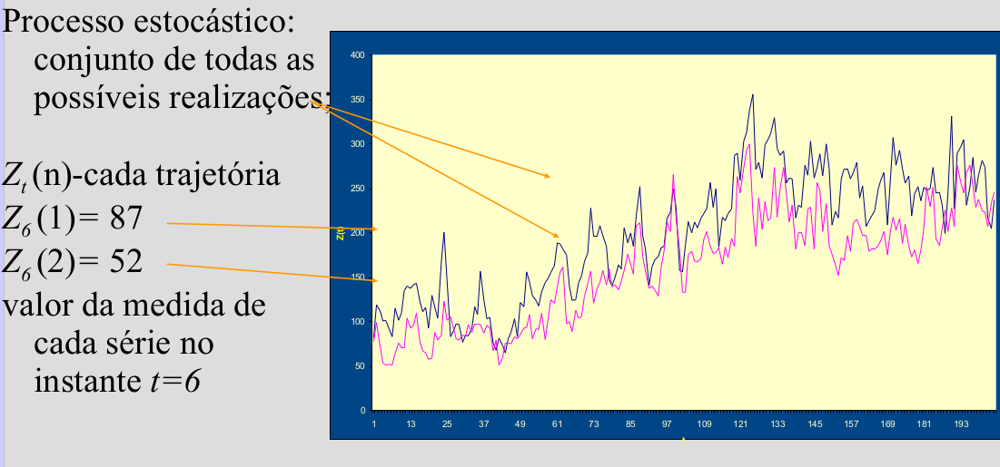{width=770px}


## Objetivos: análise de séries temporais

| Objetivo                                                     | Exemplo                                                      |
| ------------------------------------------------------------ | ------------------------------------------------------------ |
| **Descrição:** verificar existência de tendência, sazonalidade, ciclos. Histogramas, boxplots, são ferramentas da análise exploratória descritiva | Identificar tendência da AIDS; sazonalidade da dengue visando estabelecer melhor período de intervenção. |
| **Estabelecimento de causalidade:** estudo da relação de causa-efeito | Vacina X sarampo; Mortalidade por DIC X melhor assistência   |
| **Classificação:** identificação de padrões                  | A série de leishmaniose tegumentar é “igual” à visceral?     |
| **Controle:** sistemas dinâmicos, caracterizados por uma entrada $X_t$, uma série de saída $Z_t$ e uma função de transferência $V_t$ | Modelar a resposta a medidas de controle de epidemia         |
| **Monitoramento (nowcast):** Detectar variações no comportamento da séries temporais conforme elas ocorram | Dosagem de Hormônios ou de sinais vitais em CTI              |
| **Predição (forecast) : ** prever o comportamento futuro de uma serie | Predição de epidemias                                        |
| **Atualização (nowcast): ** predição sobre o presente        | corrigir atraso de notificações                              |                                                             |


## Estacionariedade

- Uma série temporal é dita estacionária quando ela se desenvolve no tempo aleatoriamente ao redor de uma média constante e com uma variância constante, refletindo alguma forma de equilíbrio estável. 

{width=1270px}

- Na prática, a maioria das séries que encontramos apresentam algum tipo de não estacionariedade, como por exemplo, tendência.

- O modelo mais simples de uma séries temporal estacionária pode ser representado por:

$$Z_t = \mu + a_t$$

Sendo $\mu$ a média do processo temporal e $a_t$ a componente aleatória, chama de **Ruído Branco** em análises de séries temporais. 


- A estacionariedade da séries temporais pode ser:

    - 1$^a$ ordem - média constante ao longo de todo o período
    
    - 2$^a$ ordem - variância constante ao longo de todo o período


### Função de Autocovariância de um processo estacionário

$$\gamma_h = E{\{[Z_t - E(Z_t)][Z_{t-h} - E(Z_{t-h})]\}}$$

- A covariância não depende do tempo, mas da distância entre as observações.

- Um processo é considerado **fracamente estacionário** se:

    i) $E(Z_t)=\mu$, $\forall t$ (constante)
    
    ii) $var(Z_t) = \sigma^2$, $\forall t$ (constante)
    
    iii) $Cov(Z_t, Z_{t-h}) = \gamma_h$, $\forall t$ (não depende do instante no tempo, apenas da distância h)

- Sendo o **ruído branco (White Noise)**, também chamado de Processo Puramente Randômico, uma variável aleatória $a_t$, com média zero e variância $\sigma²_a$:

    i) $a_t \sim N(0, \sigma^2_a)$
    
    ii) $Cov(a_t, a_{t-h}) = 0$, $\forall h \neq 0$ (Não correlacionados)
    

### Por que a estacionariedade é importante ?

- A maioria das técnicas estatísticas utilizadas em séries temporais supõe que estas sejam estacionárias. Caso a série temporal não seja estacionária, será necessário transformar os dados. 

- A transformação mais comum consiste em tomar diferenças sucessivas da série original, até se obter uma série estacionária. 

    - A primeira diferença de $Z_t$:

       $$\bigtriangledown Z_t = Z_t - Z_{t-1}$$
       
       
    - A segunda diferença de $Z_t$:

       $$\bigtriangledown^{2} Z_t = \bigtriangledown[\Delta Z_t] = \bigtriangledown[Z_t - Z_{t-1}]$$
       
     
     - A *n-ésima* diferença de $Z_t$:

       $$\bigtriangledown^{n} Z_t = \bigtriangledown[\bigtriangledown^{n-1} Z_t]$$
       
       
    - Logaritmo dos dados - Estabilizar a variância 
    
       $$\bigtriangledown log Z_t = log Z_t - log Z_{t-1}$$
       
  
    - Transformações Box-Cox
    

- Pode-se diferenciar tantas vezes quanto necessário até estabilizar (porém, em geral se diferencia apenas uma vez, raramente duas vezes).


**Como saber se um processo é estacionário ?**

- Visualizando a série, aplicando a **decomposição**, boxplots, etc.
    
- Testes Estatísticos, ex: **Dickey-Fuller**


---

## Pressuposto da Independência

- Os métodos usuais de análise estatística de dados têm como pressuposto básico a **independência** dos eventos (casos). Ou seja, a ocorrência de um caso de doença em uma dada pessoa seria independente da ocorrência em outra pessoa.

- Pressupostos básicos para uma análise de regressão:
  
    - $E(e_i) = 0$
    
    - Variância $\sigma^2$ constante (homocedasticidade);

    - $e_i \sim N(0, \sigma^2)$
    
    - $e_i \neq e_j$, são independentes
    

- Na análise da incidência de doenças (ou qualquer outro indicador ecológico) ao longo do tempo isso não é verdade: a incidência em um determinado dia/mês ou ano em geral é **correlacionada** com a ocorrência no dia/mês/ano anterior.

- Esta correlação é expressa em uma função denominada **função de autocorrelação**.

---

## Dependência serial

- Quanto à dependência, séries temporais podem possuir: 

    - **Independência** (sem dependência serial): série puramente aleatória ou ruído branco;
    
    -  **Memória longa**: a dependência desaparece lentamente (os valores de pontos no passado influenciam momentos muito
    adiante no tempo - exemplo: doenças com grande latência como hanseníase);
    
    - **Memória curta**: dependência desaparece rapidamente (doenças de alta infecciosidade e "explosivas"" - exemplo: influenza).

---


## Função de Autocorrelação - FAC (*Autocorrelation function - ACF*) 


O coeficiente de correlação entre $Z_{t}$ e $Z_{t-h}$ é chamado de autocorrelação de *h-ésima* ordem e é denotadado por:

$$
{\rho}_{k}=\frac {Cov\left({Z}_{t},{Z}_{t-h} \right)}{\sqrt{Var\left({Z}_{t},{Z}_{t-h} \right)}} =\frac{Cov\left({Z}_{t},{Z}_{t-h} \right)}{Var\left({Z}_{t} \right)} =\frac{{\gamma}_{k}}{{\gamma}_{0}}
$$

Temos então:

- ${\rho}_{0}=1$

- $-1\leq {\rho}_{l} \leq 1$

Um conjunto de autocorrelações, $\left\{\rho_{h}\right\}$, é chamado de **função de autocorrelação de $Z_{t}$**. Para uma dada amostra, $\left\{Z_{t}\right\}_{t=1}^{T}$, suponha que $\overline{Z}$ é a média amostral. Então, a autocorrelação amostral de primeira ordem de $Z_{t}$ pode ser definida como:

$$
{\hat{\rho}}_{1}=\frac{\sum _{t=2}^{T}{\left({Z}_{t}-\overline{Z}\right) \left({Z}_{t-1}-\overline{Z}\right)}}{\sum_{t=1}^{T}{{\left({Z}_{t}-\overline{Z}\right)}^{2}}}
$$

que é um estimador consistente de ${\rho}_{1}$. Em geral, a autocorrelação amostral de *h-ésima* ordem de $Z_{t}$ pode ser definida como:

$$
{\hat{\rho}}_{h}=\frac{\sum_{t=h+1}^{T}{\left({Z}_{t}-\overline{Z}\right) \left({Z}_{t-h}-\overline{Z} \right)}}{\sum_{t=1}^{T}{{\left({Z}_{t}-\overline{Z}\right)}^{2}}} 
$$
para $0\leq h \leq T-1$. 

Por exemplo, suponha que você está avaliando uma série temporal qualquer e quer visualizar como as defasagens da série podem impactar seu valor atual (ou seja, se $Z_{t}$ é relacionado com $Z_{t-h}$ para $k\ge1$). A função de autocorrelação pode ser usada para obter tal informação.

Num primeiro momento, visualize os dados da série para 10 lags (defasagens). Observe que os lags se tornam novas colunas e na medida que elas aumentam, incrementa-se as linhas sem observações.


```{=html}
<div class="datatables html-widget html-fill-item-overflow-hidden html-fill-item" id="htmlwidget-cc8da5beb30438f489cf" style="width:100%;height:auto;"></div>
<script type="application/json" data-for="htmlwidget-cc8da5beb30438f489cf">{"x":{"filter":"none","vertical":false,"data":[[28.61,27.8,28.19,28.26,30.36,30.42,32.76,31.95,30.89,28.24],[null,28.61,27.8,28.19,28.26,30.36,30.42,32.76,31.95,30.89],[null,null,28.61,27.8,28.19,28.26,30.36,30.42,32.76,31.95],[null,null,null,28.61,27.8,28.19,28.26,30.36,30.42,32.76],[null,null,null,null,28.61,27.8,28.19,28.26,30.36,30.42],[null,null,null,null,null,28.61,27.8,28.19,28.26,30.36],[null,null,null,null,null,null,28.61,27.8,28.19,28.26],[null,null,null,null,null,null,null,28.61,27.8,28.19],[null,null,null,null,null,null,null,null,28.61,27.8],[null,null,null,null,null,null,null,null,null,28.61],[null,null,null,null,null,null,null,null,null,null]],"container":"<table class=\"display\">\n  <thead>\n    <tr>\n      <th>atual<\/th>\n      <th>lag1<\/th>\n      <th>lag2<\/th>\n      <th>lag3<\/th>\n      <th>lag4<\/th>\n      <th>lag5<\/th>\n      <th>lag6<\/th>\n      <th>lag7<\/th>\n      <th>lag8<\/th>\n      <th>lag9<\/th>\n      <th>lag10<\/th>\n    <\/tr>\n  <\/thead>\n<\/table>","options":{"columnDefs":[{"className":"dt-center","targets":"_all"}],"dom":"t","order":[],"autoWidth":false,"orderClasses":false}},"evals":[],"jsHooks":[]}</script>
```


Apesar da simples correlação entre os dados nos ajudar a identificar defasagens que poderíam contribuir para o comportamento da série em $t$, precisamos fazer uso de testes estatísticos que verifiquem a significância da relação entre o valor atual e suas lags. Neste sentido, a função de autocorrelação tem grande importância. 

Abaixo, um exemplo de **função de autocorrelação**. Observe que há duas linhas horizontais que representam os limites do teste de significância sendo que valores acima ou abaixo da linha são estatisticamente significantes. Neste documento, apresentaremos o teste que é realizado.


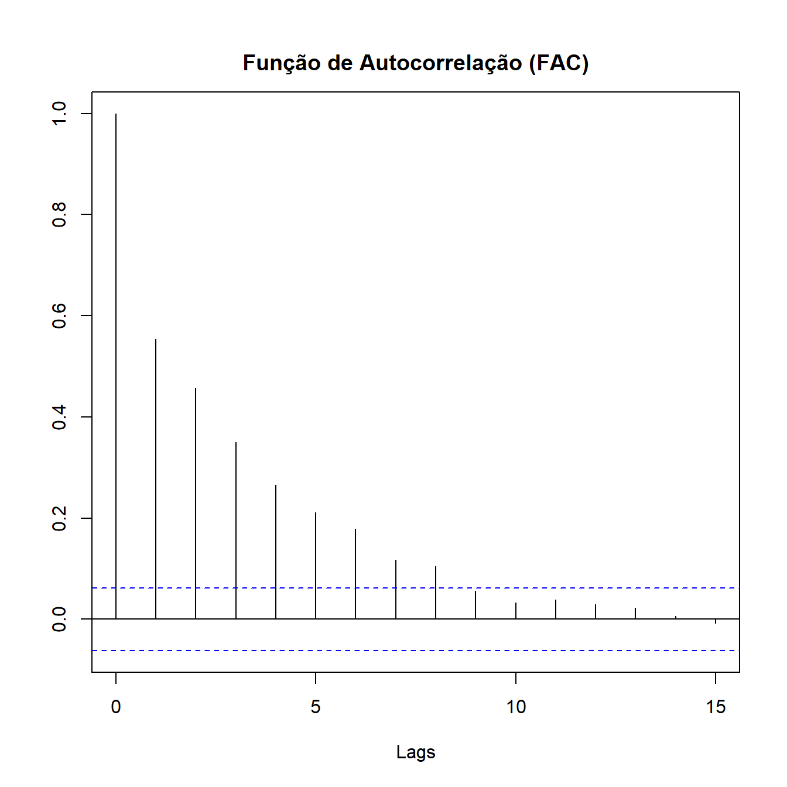

- O correlograma é uma das principais ferramentas de análise exploratória em séries temporais, pois indica como cada valor em um dado instante de tempo $t$ se relaciona com os valores em $t+1, t+2,...,t+j$


Para um dado $h$, os resultados da **Função de Autocorrelação** podem ser testados usando um teste que pode ser representado pelas seguintes hipóteses:

$$
\begin{aligned}
&& H_{0}: \rho_{h}=0 \\
&& H_{1}: \rho_{h}\neq 0
\end{aligned}
$$

---


## Componentes de uma Série Temporal 

- As séries temporais podem ser separadas em componentes *sistemáticas* (apontam movimentos regulares) e *não sistemáticas* (apontam movimentos irregulares). 

São elas: 

- Componentes Sistemáticas (podem ou não estar presentes)

    - Tendência

    - Sazonalidade

    - Ciclo 

- Componentes Não Sistemáticas

    - Aleatória ou Ruído Branco


- As análises exploratórias de séries temporais buscam isolar e interpretar as componentes. Tais componentes podem atuar de maneira isolada ou inter-relacionadas.


---

## Tendência

- É a indicadora da direção global dos dados (ou movimento geral da variável), do percurso traçado e de sua linha contínua;

- É o efeito de longo prazo na média. Pode ser o aumento ou redução a longo prazo...

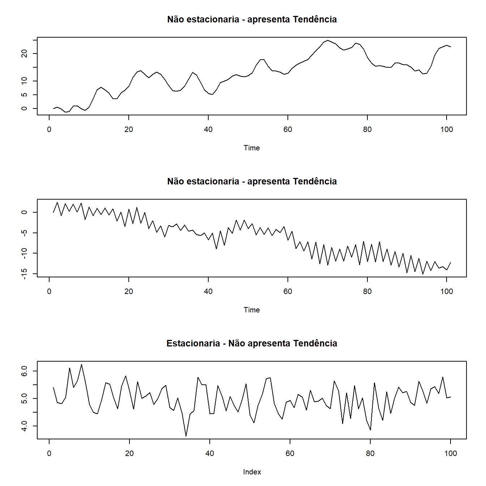


<!-- 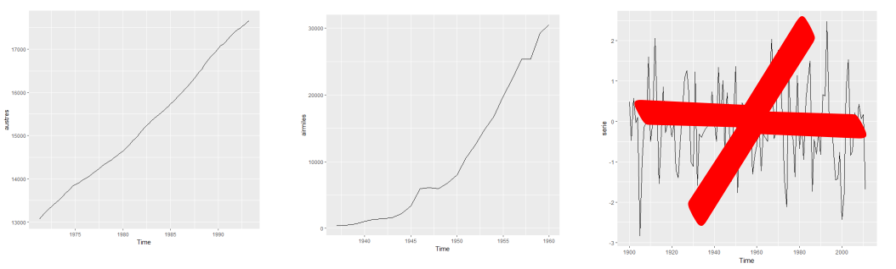{width=1270px} -->


---


## Sazonalidade

- São ciclos de curto prazo (não maiores que um ano), em torno da tendência;

- Costumam se referir a eventos ligados a estação do ano, vinculados ao calendário e geralmente repetidos a cada doze meses;

- Efeitos ligados à variações periódicas (semanal, mensal, anual, etc.);

- Padrões que ocorrem em intervalos fixos.

Ex: Medidas de Temperatura (aumenta no verão e diminui no inverno).

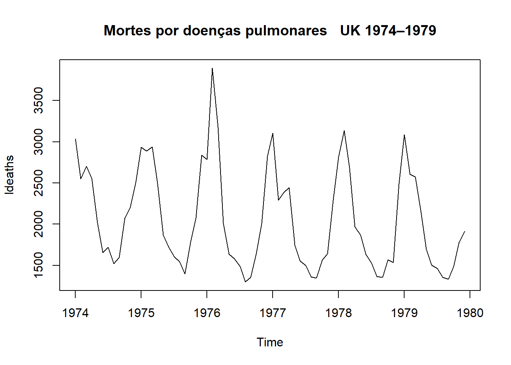

---

## Ciclo

- Os ciclos são oscilações (aproximadamente regulares) em torno da tendência. Podem dever-se a fenômenos naturais, socioculturais ou econômicos, como variações climáticas (ex: excesso ou falta de chuva pode produzir ciclos agrícolas)

- Variações que apesar de periódicas não são associadas automaticamente a nenhuma medida do calendário;

- Aumento ou redução de frequência sem intervalos fixos.

Ex: Ciclos Econômicos e Ciclos de epidemias.

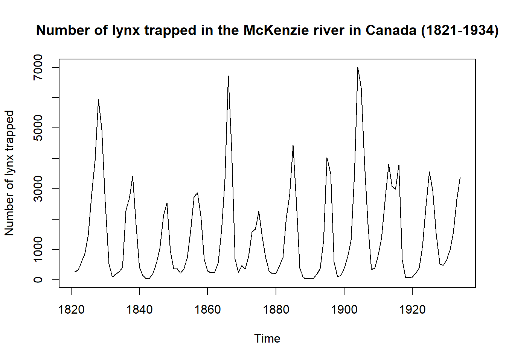


- A diferença entre os ciclos, propriamente ditos, e a sazonalidade é o período de avaliação (curto e longo);

- A semelhança é que ambos definem oscilações relativamente regulares em torno da tendência.

- Na área de saúde é pouco comum encontrarmos ciclos, ainda que possam existir.

---

### Como detectar a sazonalidade ?

- Visualmente

  - Boxplots
  - seasonplot
  - monthplot 
  - decomposição
    


---

## Termo Aleatório ou Ruído Branco

- Conceitualmente, a componente aleatória é uma mistura de pertubações bruscas, irregulares e esporádicas nos movimentos das séries que tipificam os fenômenos. Na realidade é resultante dos efeitos de múltiplas causas que dificilmente/não conseguem ser previstos.

- Exemplos típicos de eventos aleatórios:

  - Secas
  - Enchentes 
  - Terremotos
  - Ocorrência de epidemias
  - Crise política
  - Conflitos Socioeconômicos
  
---


## Composição dos Modelos de séries temporais

- A série pode ser descrita como sendo a soma ou multiplicação dos componentes (tendência, sazonalidade, ciclicidade - se houver - e termo aleatório).


### Modelo Aditivo

$$Z_t = T_t + S_t + a_t$$ 

sendo $t = 1,2, ..., N$

- Essa composição de modelo sugere que a variação sazonal parece constante, não muda quando da série temporal aumenta.


### Modelo Multiplicativo 

$$Z_t = T_t . S_t . a_t$$

- Essa composição de modelo sugere que a sazonalidade varia em conjunto com a tendência (aumenta de amplitude quando aumenta a tendência).
- Pode ser transformado em aditivo usando $log$.


$$log(Z_t) = log(T_t . S_t . a_t) = log(T_t) + log(S_t) + log(a_t)$$


---

## Decomposição de séries temporais 

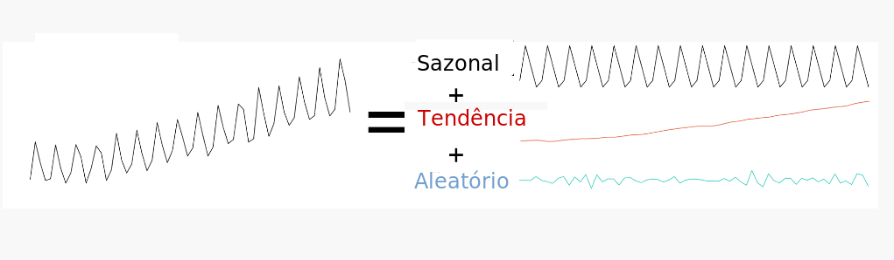 

---

## Prática no R

### A biblioteca *ts* é a mais utilizada no R 

Na biblioteca **ts** a função mais utilizada tem o mesmo nome `ts` , não é necessário chamar `library(ts)` pois a mesma já se encontra carregada por default.

A função `ts` tem como argumentos principais: 

- **data**: um vetor, data.frame ou matriz com dados para a série

- **start**: tempo da primeira observação e/ou  **end**: tempo da última observação

- **frequency**: quantidade de observações por unidade de tempo, podendo representar: Anual = 1, Trimestral = 4, Mensal = 12 e Semanal = 52

---


### Simulando uma Série Temporal

Vamos simular uma série usando a função `rnorm` para gerar 60 pontos aleatórios , com media 0 e desvio 1 em seguida vamos usar a função `ts` para transformar o vetor em uma objeto *ts* e finalmente fazer um gráfico. 


```r
# Uma serie temporal normalmente distribuída
serie <-  rnorm(60)

# usando a função ts para criar um objeto da classe ts
# pode-se usar também  end=c(2016,12) mas basta um! 
serie.ts  <- ts(serie,start = c(2012,1), frequency=12) 
```

Vamos observar agora como é um objeto do tipo _ts_ 


```r
serie.ts
```

```
              Jan          Feb          Mar          Apr          May          Jun          Jul          Aug          Sep          Oct          Nov          Dec
2012 -0.850789274  1.098551160 -1.206355025  0.581862276  0.863689895  0.983052004 -1.271260251 -0.001062756 -0.960910158  1.259209306 -0.866606890  0.249044190
2013 -0.086168223 -0.492884341 -0.268998914 -0.399240236 -0.944297510  1.013188332 -0.408704068 -0.181086790  1.183755855 -1.608494491 -2.272439862 -2.040607916
2014 -0.648006354  0.717722237 -0.103400012  0.327017362 -0.977597331  0.341442983  0.043822392 -1.021578363  0.793427719  0.501624458 -1.554470354  0.883497837
2015 -0.207767801  1.831374014  0.177264382 -0.805840648  1.947932470  0.121197052 -0.354949127  1.052866250  1.163113962 -0.798832818  0.775455294 -1.995007352
2016 -0.350562193  0.380864742  0.258213780  0.964510263 -0.491278153  0.081638756 -0.161770723  1.272817069 -0.720269271  1.541051559  0.853661550  0.802399491
```

Para se obter o gráfico basta usar a função _plot_ 


```r
# gráfico da série
plot(serie.ts)
```

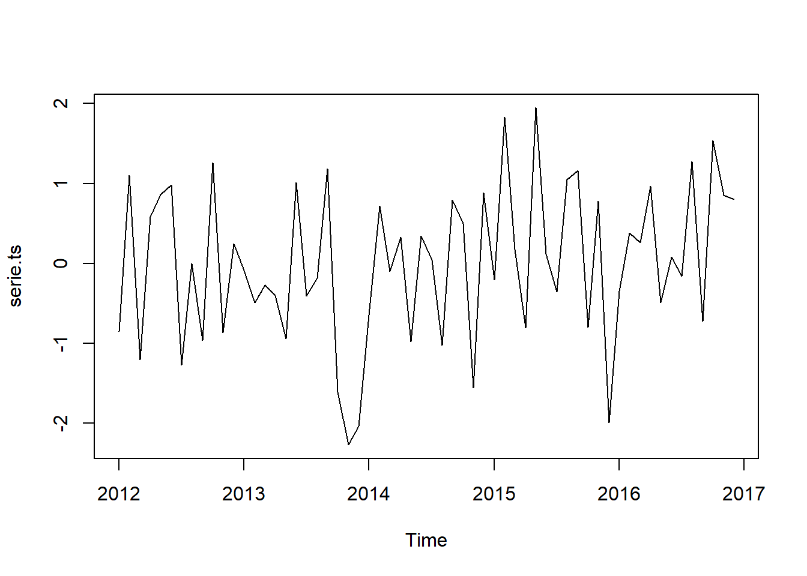


---

### Importando uma vetor e transformando em Série Temporal

Vamos usar agora um exemplo de casos caxumba em Nova York de 1928-1972 proveniente  do livro:


>Yorke, J.A. and London, W.P. (1973) 
>"Recurrent Outbreaks of Measles, Chickenpox and Mumps",
>American Journal of Epidemiology, Vol. 98, pp.469


Observe que a partir de um dado puramente vetorial já podemos obter um objeto *ts* 

[Clique aqui para ver como são os dados brutos](https://raw.githubusercontent.com/ogcruz/dados_eco_2023/main/exemplos/caxumba.dat)

Para ler os dados utilizaremos a função `scan` que importa dados vetoriais. Nesse exemplo estaremos usando os dados diretos de uma [URL](https://pt.wikipedia.org/wiki/URL) mas o dado poderia estar no seu disco, assim você importaria localmente!


**OBSERVAÇÃO:**  

    No MS-Windows existe algum problema ao acessar sites seguros (HTTPS) 
    assim vamos definir uma função que permita o acesso a esse tipo de site. 
    podemos tentar duas coisas:
    
    

```R

options(url.method="libcurl")

```


Ou criar uma função:

```R

scan.win <- function(x) {scan(url(x,method = 'libcurl'))}

```

> No Windows 10 aparentemente não é necessário o procedimento acima mas fique atento que ao longo do curso estaremos importando dados com frequência. Descubra como fazer essa importação funcionar no seu computador! 

Exemplo com dados de Caxumba, não se esqueça de definir a função acima!


```r
dados <- scan('https://raw.githubusercontent.com/ogcruz/dados_eco_2023/main/exemplos/caxumba.dat')
caxumba <- ts(dados,start = c(1928,1),frequency = 12)
plot(caxumba)
```

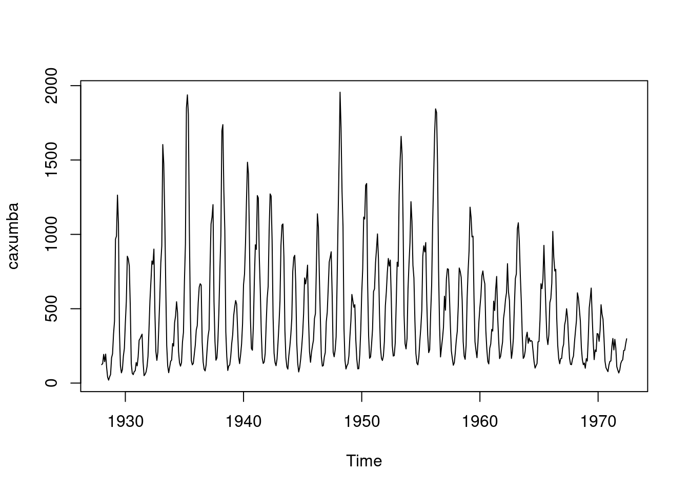

---

### Utilizando dados da incidência de dengue nas Filipinas, 2008 - 2016

Exemplo serie mensal da  Incidência  de dengue por  100,000hab  em uma região das Filipinas de  2008 to 2016.
Fonte: Kaggle 


```r
dengue <- read.csv("https://raw.githubusercontent.com/ogcruz/dados_eco_2023/main/dados/denguecases2.csv")
head(dengue)
```

```
##   Month Year Dengue_Cases
## 1   Apr 2008    131.13331
## 2   Aug 2008    159.97741
## 3   Dec 2008     93.65630
## 4   Feb 2008     49.38712
## 5   Jan 2008     79.85915
## 6   Jul 2008    152.63940
```


Antes de colocando em formato de série temporal utilizando a biblioteca *ts* do R, precisamos ordenar o _dataframe_ para que possamos transformar corretamente em uma série temporal uma vez que a função baseia-se somente na ordem de entrada.

Assim vamos alterar  a coluna _Month_ em um fator para que possamos manter a ordem dos meses e em seguida usar a função **order** para reordenar todo o _dataframe_.


```r
dengue$Month <- factor(dengue$Month,levels = month.abb)

dengue <- dengue[order(dengue$Year,dengue$Month),]

head(dengue)
```

```
##   Month Year Dengue_Cases
## 5   Jan 2008     79.85915
## 4   Feb 2008     49.38712
## 8   Mar 2008    115.13416
## 1   Apr 2008    131.13331
## 9   May 2008    129.20466
## 7   Jun 2008    210.24223
```

Com o dado na devida ordem e podemos continuar a transformação em  série temporal.


```r
# Convertendo os dados para o formato de Séries Temporais
# A frequency=12 foi especificado pois queremos mostrar dos dados mensais
denguets <- ts(dengue$Dengue_Cases,start=c(2008,1),frequency=12)
plot(denguets, ylab="Casos de Dengue", xlab="Tempo")
```

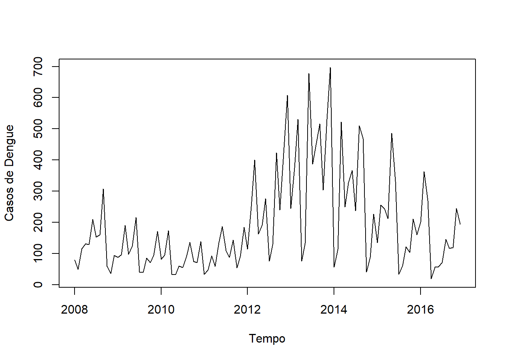


Verificando e testando a autocorrelação dos casos de dengue.

$$
\begin{aligned}
&& H_{0}: \rho_{h}=0 \\
&& H_{1}: \rho_{h}\neq 0
\end{aligned}
$$


```r
acf(denguets, lag.max=20, main="Função de Autocorrelação")
```


```r
Box.test(denguets, lag=20, type="Ljung-Box")
```


	Box-Ljung test

data:  denguets
X-squared = 271.51, df = 20, p-value < 2.2e-16

Através do gráfico e do teste do ACF, é possível verificar que a incidência de dengue é correlacionada ao longo do tempo.

---

**Fazendo uma análise descritiva da série temporal**


```r
denguets
```

```
           Jan       Feb       Mar       Apr       May       Jun       Jul       Aug       Sep       Oct       Nov       Dec
2008  79.85915  49.38712 115.13416 131.13331 129.20466 210.24223 152.63940 159.97741 307.65474  58.74152  36.17346  93.65630
2009  87.96879  96.47914 190.36630  98.15255 124.03703 215.76350  40.66555  39.54446  85.84889  70.55726  95.37771 171.74569
2010  81.62430  95.59756 174.13877  33.54686  32.44285  60.04658  55.22568  90.16454 135.63883  74.17619  71.39315 138.44613
2011  33.66412  46.52083  93.34766  58.76998 134.83900 187.12547 109.27259  88.23193 143.89752  53.87635  91.05780 184.88198
2012 114.48472 251.27249 400.20592 162.21779 191.47219 276.13014  75.88479 128.88087 423.70277 239.40052 421.72803 607.49949
2013 244.44260 374.95060 530.46735  75.91858 132.94225 678.00967 387.48040 448.67952 515.58071 303.43820 530.61714 696.56174
2014  56.28797 113.67882 522.16422 249.49254 326.64717 366.61897 237.79033 509.79051 469.48018  41.43502  87.44494 226.41755
2015 134.40762 255.93445 243.46980 212.50300 485.76066 331.08272  33.81837  60.95752 121.16441 104.00878 210.63816 160.61858
2016 201.73756 362.34941 270.55192  18.94775  57.02598  57.41445  70.58666 145.36292 116.41069 119.08265 245.19665 194.46347
```

Vamos verificar a propriedades da série:


| Estatística          | Função R            | Valor |
| -------------------- | :--------------------: | :-----: |
| Comprimento da Serie | *length()*           |   108    |
| media      | *mean()*  |  192.0458131    |
| mediana      |  *median()* |  134.62331    |
| máximo  | *max()*  |   696.56174    |
| minimo | *min()* |   18.947748    |
| amplitude | *range()* | 18.947748, 696.56174 |
| frequência | *frequency()* |  12   |
| período de inicio | *start()* |  2008, 1     |
| período de fim | *end()* |  2016, 12     |


Pode-se pedir também o sumário da série!


```r
summary(denguets)
```

```
   Min. 1st Qu.  Median    Mean 3rd Qu.    Max. 
  18.95   81.18  134.62  192.05  246.27  696.56 
```


```r
hist(denguets,breaks = 10)
```

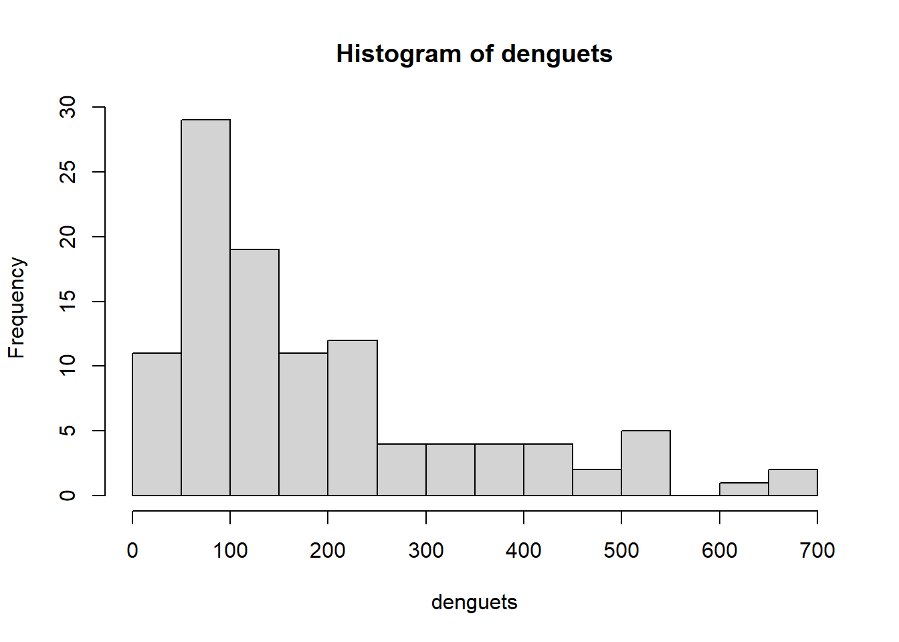


```r
boxplot(denguets,col='lightblue')
```

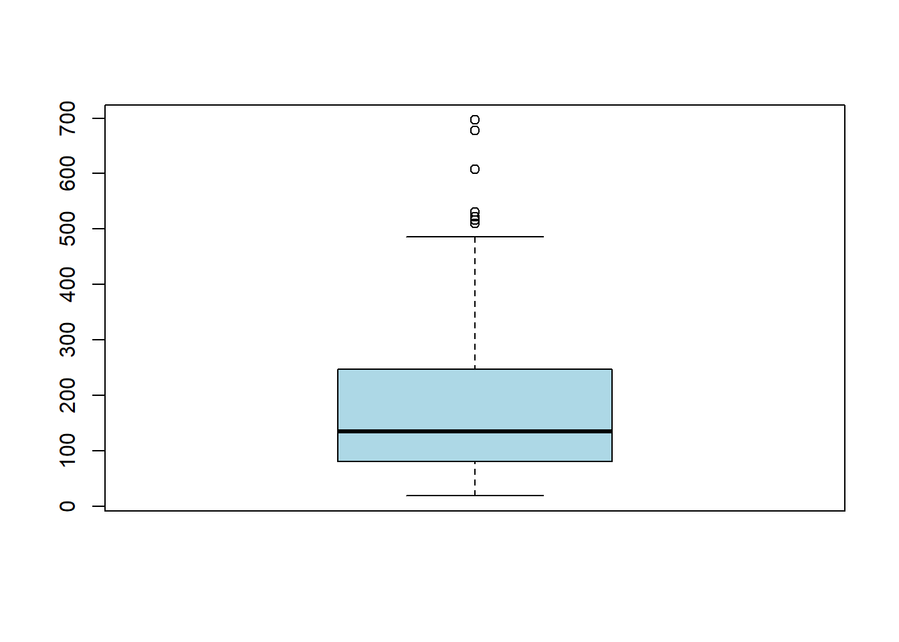


Mudando a janela de tempo da série temporal: observando apenas os dados de Jan 2010 até Dez de 2012.


```r
denguets2 <- window(denguets, start=c(2010,1),end=c(2012,12),frequency=12)
plot(denguets2, ylab="Casos de Dengue", xlab="Tempo")
```

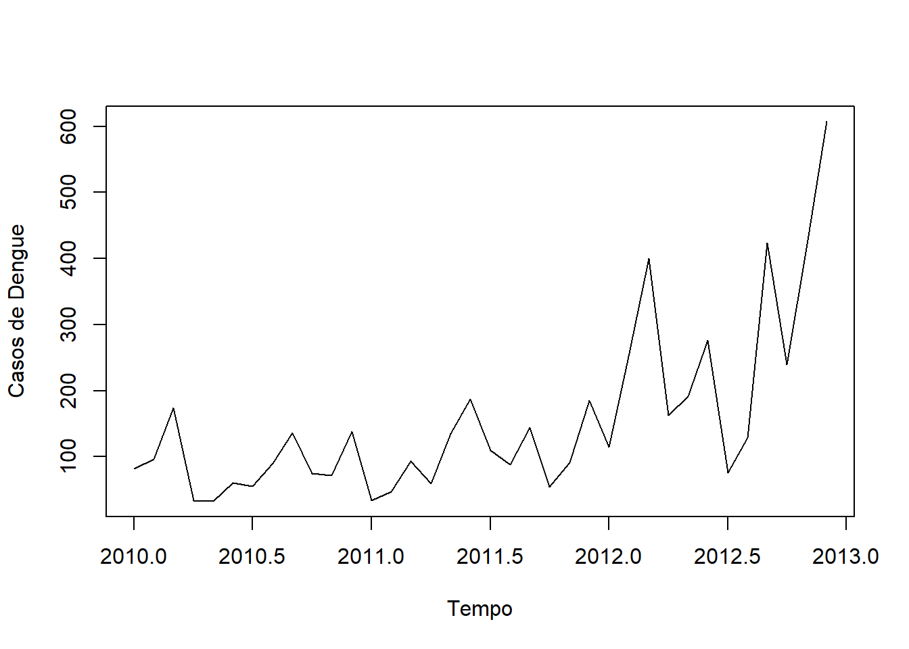

---

**Decompondo a série temporal**

Decompondo a série temporal dos casos de dengue via método clássico **decompose** (Decomposição via Médias Móveis):


```r
plot(decompose(denguets))
```

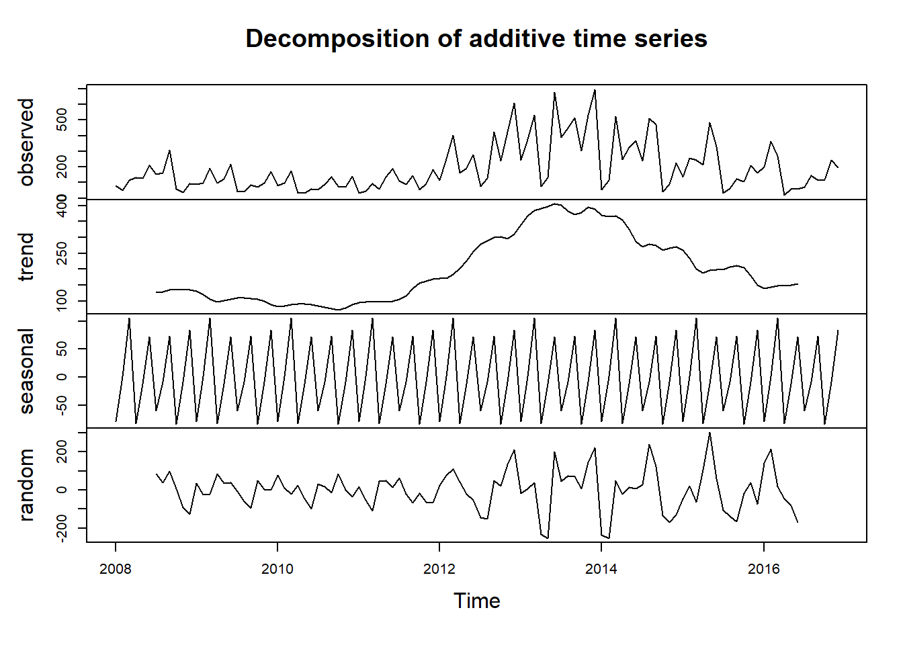

Decompondo a série temporal dos casos de dengue via **STL (Seasonal and Trend decomposition using Loess)**:

- É mais robusta, mais sensível a vários tipos de sazonalidade e lida melhor com os *outliers*.


```r
plot(stl(denguets, s.window="periodic"))
```

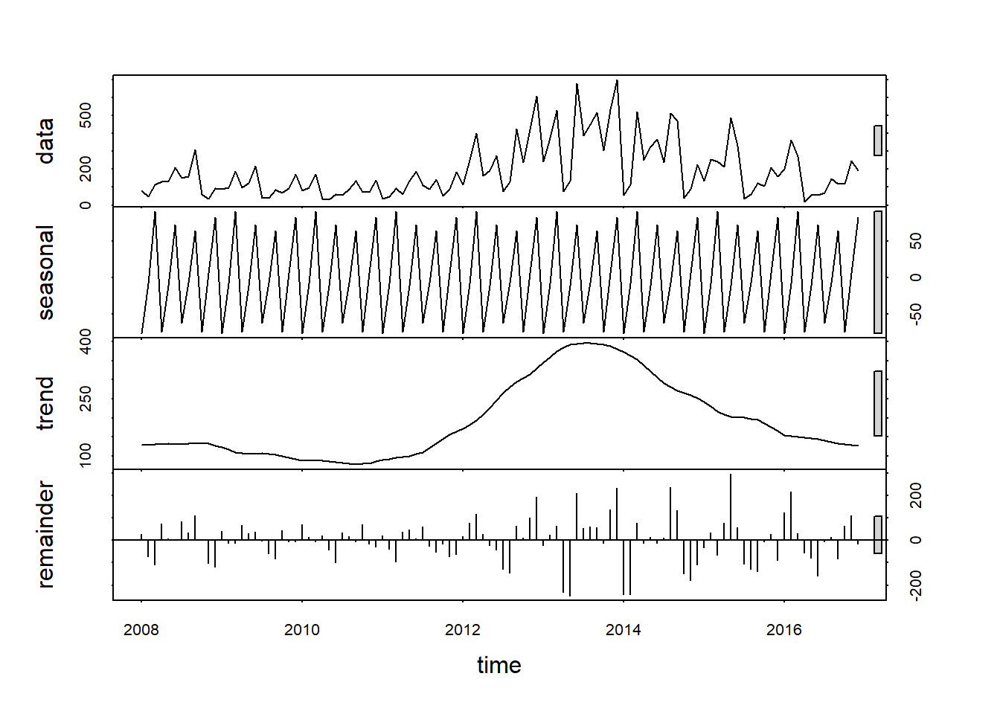


```r
decom_dengue <- stl(denguets,12)
head(decom_dengue$time.series)
```

```
          seasonal    trend  remainder
Jan 2008 -71.00930 132.7212  18.147256
Feb 2008 -26.81769 132.8553 -56.650467
Mar 2008  81.88596 132.9894 -99.741166
Apr 2008 -65.11369 133.1235  63.123548
May 2008 -22.99327 132.7289  19.468992
Jun 2008  80.32281 132.3344  -2.415003
```

```r
plot(decom_dengue)
```


```r
Trend <- decom_dengue$time.series[,2]
Seasonal <-  decom_dengue$time.series[,1]
Random <- decom_dengue$time.series[,3]
```

Refazendo o sinal original da séries temporais através das componentes:


```r
recomposed_dengue <- Trend+Seasonal+Random

par(mfrow=c(1,2))
plot(denguets, ylab="Incidência Dengue", main="Original")
plot(as.ts(recomposed_dengue), ylab="Incidência Dengue", main="Recomposta")
```


Em algumas séries temporais não é fácil avaliar suas componentes de maneira visual, ou seja, de maneira gráfica. Para podermos avaliar melhor precisamos utilizar alguns testes estatísticos. 

Outra forma de fazer gráficos é através das bibliotecas  ggplot e ggfortify:


```r
library(ggplot2)
library(ggfortify)

autoplot(denguets)
```


```r
autoplot(decompose(denguets))
```


---

**Avaliando a Estacionariedade da série temporal**

Segundo o teste de ***Dickey-Fuller***:

$H_{0}$: A série temporal não é Estacionária

$H_{1}$: A série temporal é Estacionária

Alguns exemplos:

<!-- OC: Editar figura abaixo -->


Testando a estacionariedade da série dos casos de dengue: 


```r
library(tseries)
adf.test(denguets)
```


	Augmented Dickey-Fuller Test

data:  denguets
Dickey-Fuller = -1.9795, Lag order = 4, p-value = 0.5851
alternative hypothesis: stationary

Como *p-valor = 0,5851*, não rejeitamos a hipótese nula, ou seja, não há indícios da série temporal ser estacionária.

---

**Avaliando a tendência em uma série temporal**

Construindo uma reta baseado no modelo de regressão linear simples para verificar a tendência da incidência da dengue:


```r
plot(denguets, main = "Incidência de Dengue 2008 a 2016")
abline(reg=lm(denguets ~ time(denguets)), col = "red")
```

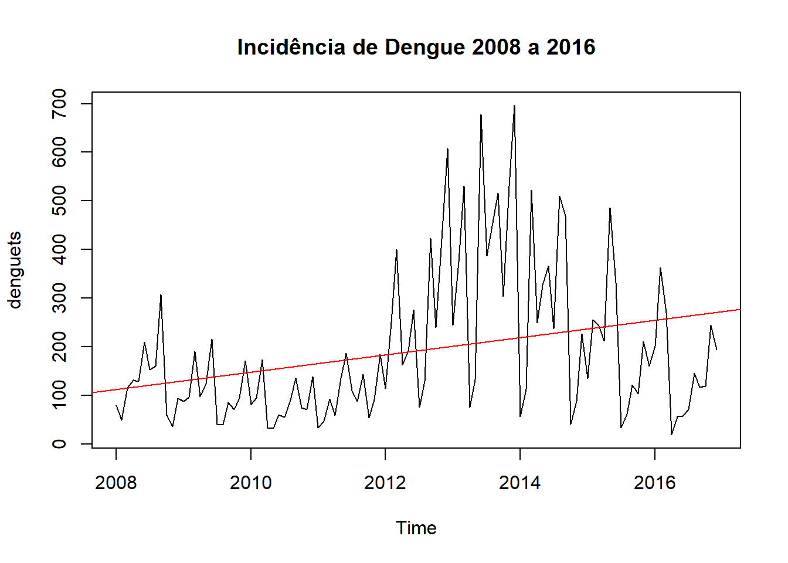


Construindo uma curva suavizada baseada na função *lowess* para verificar tendência da incidência da dengue:


```r
plot(denguets, ylab="Casos de Dengue", xlab="Tempo") 
library(Kendall)
lines(lowess(time(denguets),denguets),lwd=3, col=2)
```

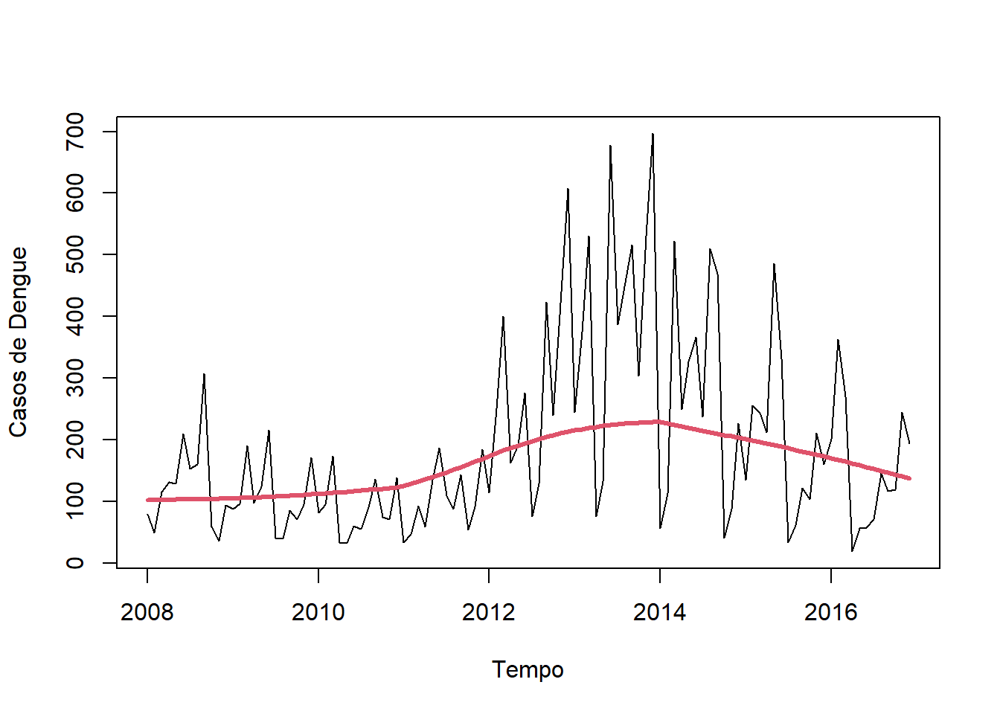


Uma outra forma de mostrar a tendência da série temporal é fazendo a média anual. Observe que a curva se parece um pouco com a curva do *lowess* porém menos suave.


```r
plot(aggregate(denguets, FUN=mean))
```

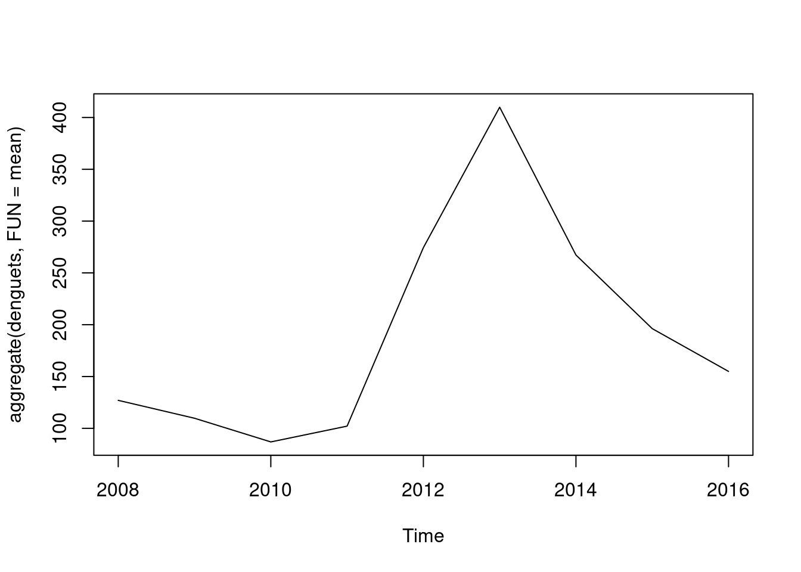

---

**Avaliando a Sazonalidade da série temporal**

De maneira visual podemos utilizar algumas técnicas gráficas, tais como:


- **Boxplot**


```r
boxplot(denguets ~ cycle(denguets))  
```

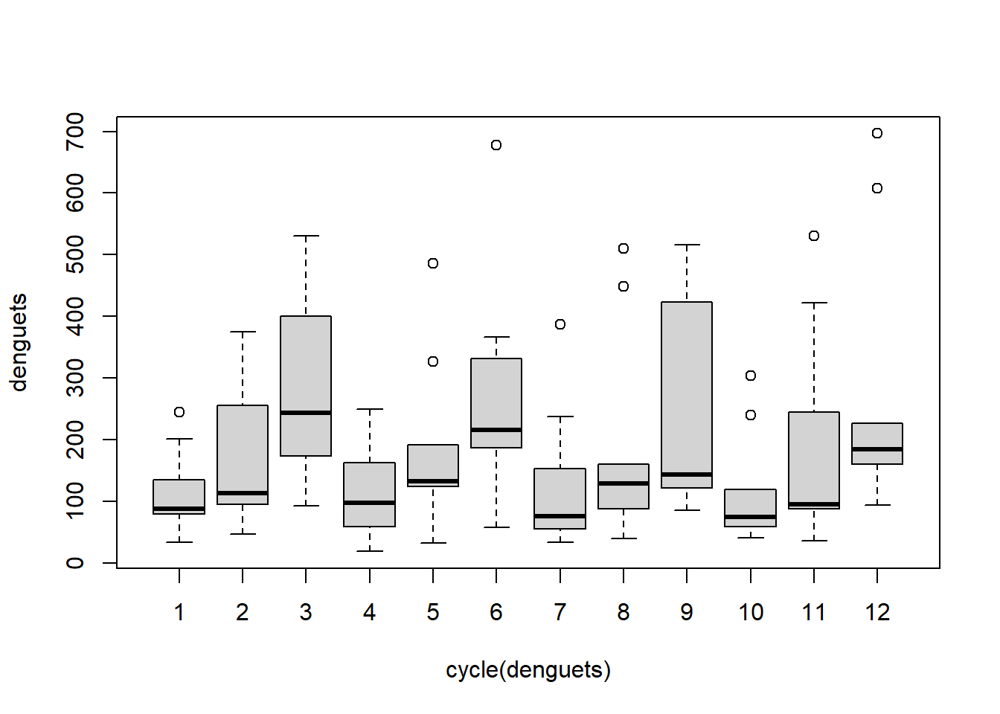


- **Monthplot**


```r
monthplot(denguets) 
```

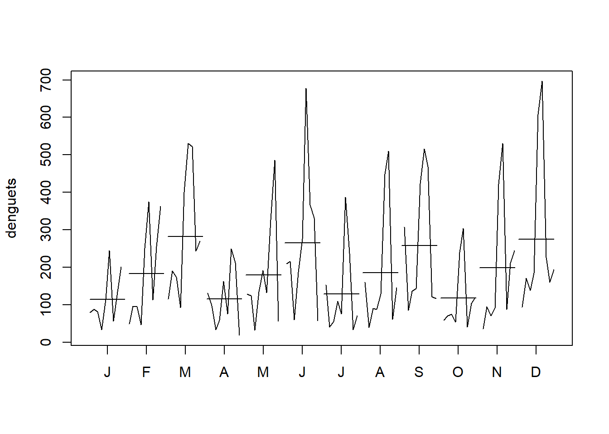


- **Seasonplot** (funçao disponibilizada pela library forecast)


```r
library(forecast)
seasonplot(denguets,col=terrain.colors(6),lwd=2)  
```

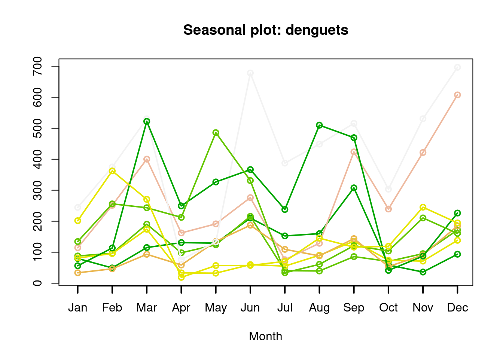

---

<!-- Outras possibilidades de fazer utilizando a biblioteca ggplot -->

<!-- ```{r, echo=T, warning=FALSE, results='asis', message = FALSE, out.width = "100%", fig.align = "center"} -->

<!-- ggsubseriesplot(denguets)  # monthplot -->
<!-- ggseasonplot(denguets)  # seasonplot -->
<!-- ggseasonplot(denguets, polar = T) -->

<!-- ``` -->

<!-- Segundo o teste de ***Kruskall-Wallis***: -->

<!-- $H_{0}$: Não existe diferença entre os períodos, ou seja, a série não apresenta sazonalidade -->

<!-- $H_{1}$: Existe diferença em pelo menos um período em relação aos demais, ou seja, há indícios da séries temporais apresentar sazonalidade -->

<!-- ```{r, echo=T, warning=FALSE, results='asis', message = FALSE, out.width = "70%", fig.align = "center"} -->
<!-- kruskal.test(denguets ~ cycle(denguets))   -->

<!-- ``` -->

<!-- Neste caso, podemos dizer que existe indícios da da série apresentar períodos que são maiores ou menores que outros. -->


<!-- ## Transformação -->

<!-- ```{r, echo=T, warning=FALSE, results='asis', message = FALSE, out.width = "100%", fig.align = "center"} -->
<!-- par(mfrow=c(2,2)) -->

<!-- #serie original -->
<!-- plot(denguets, ylab="Casos", main="Original") -->

<!-- #lambda = 0, logaritmica -->
<!-- t1 <-  BoxCox(denguets,lambda =0 ) -->
<!-- plot(t1, ylab="Casos", main="Lambda = 0, Logarítmica") -->

<!-- #gera labda automático -->
<!-- lbd <-  BoxCox.lambda(denguets) -->
<!-- # print(lbd) -->
<!-- t3 <-  BoxCox(denguets,lambda =lbd ) -->
<!-- plot(t3, ylab="Casos", main="Labda Automático") -->

<!-- #diferenciacao -->
<!-- t4 <-  diff(denguets) -->
<!-- plot(t4, ylab="Casos", main="Diferenciação") -->

<!-- ``` -->

## Exercícios Propostos

Utilizando os bancos: 

1. Série mensal de óbitos por doenças respiratórias na região  Sul do Brasil de 1996 a 2017 (pode ser acessado na URL https://bit.ly/obtsul, fonte: DataSUS/MS)

2. Série semanal do numero de casos Malaria nos EUA de 1974 a 1984 (pode ser acessado na URL https://bit.ly/cdcmal, fonte:CDC/US)

Importe a série para um formato **_ts_** e faça: 

i) Uma análise exploratórias dos dados em formato séries temporais;

ii) Decomponha a série temporal;

iii) Através de análises gráficas e/ou testes estatísticos, avalie e verifique a existência de tendência e sazonalidade na série.


## Outros materiais sobre Séries Temporais

**Time Series Task View:**

https://cran.r-project.org/web/views/TimeSeries.html

**Blog, Ebook and Forecast Documentation by Rob Hyndman:**

https://otexts.org/fpp2/intro.html


**STL: A seasonal-trend decomposition procedure based on loess**

https://www.scb.se/contentassets/ca21efb41fee47d293bbee5bf7be7fb3/stl-a-seasonal-trend-decomposition-procedure-based-on-loess.pdf)


**Stackoverflow Community:**

https://stackoverflow.com/questions


## Bibliografia sugerida

DIGGLE, Peter. Time Series: A Biostatistical Introduction (Oxford Statistical Science Series, No. 5) 1st Edition, 1996

FERREIRA, Pedro Guilherme Costa. Análise de Séries Temporais em R: curso introdutório. 2018.

METCALFE, Andrew V.; COWPERTWAIT, Paul SP. Introductory time series with R. Springer-Verlag New York, 2009.

MORETTIN, Pedro A.; TOLOI, Clélia M.C. Análise de Séries Temporais: Modelos Lineares Univariados. Bluscher - ABE - Projeto Fisher. Edição 3, 2018.

WOODWARD, Wayne A.; GRAY, Henry L.; ELLIOTT, Alan C. Applied time series analysis with R. CRC press, 2017.

