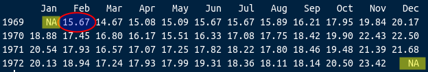
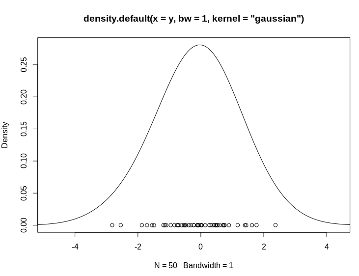
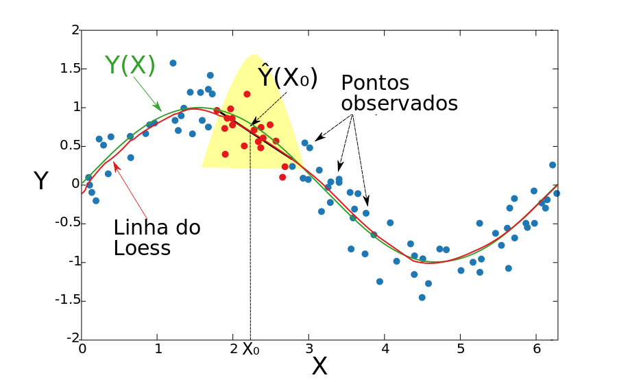

# Transformações e Suavizações

## Introdução

As transformações e as funções de alisamento (suavização) em séries temporais são normalmente empregados para nos ajudar a ver melhor os padrões existentes - tais como as tendências e sazonalidade - e suavizar as oscilações irregulares (ruídos) para que possamos obter uma série mais limpa com um sinal mais claro.

Estas técnicas não nos fornecem um modelo, mas podem ser um bom primeiro passo na descrição para os vários componentes da série.

## Transfomação dos dados em ST

Alguns exemplos:

-   **Utilização de funções:** Logarítmicas, Potências, Exponenciais, ou transformação *Box-Cox*.

-   **Diferenciação:** Séries não estacionárias. Objetivo é transformar a série em estacionária, estabilizando a média ( $\bigtriangledown Z_t$ ).

-   **Box-Cox:** Estabiliza a variância. (também o **log** , **sqrt** etc...)

-   **Médias Móveis:** Permite a suavização dos dados da ST. Reduz *outliers* e captura a tendência.

-   **Outras técnicas de suavização:** Kernel, Loess/Lowess, Splines e *Generalized Additive Model* (GAM).

Para demostrar o resultado dessas transformações, iremos aplicar algumas dessas técnicas.

### Transformações Box-Cox, Diferenciação e Logarítmica

Esta é uma técnica de transformação de dados útil para estabilizar a variância, tornar os dados mais semelhantes à distribuição normal, melhorar a validade das medidas de associação e para outros procedimentos de estabilização de dados.

-   Box and Cox (1964) propuseram uma transformação na variável da ST $Z_t$, que depende do parâmetro $\lambda$ da seguinte forma:

$$ Z_{t}(\lambda) = \left\{ \begin{array}{rc} Z_t^{\lambda}, &\mbox{se} \quad \lambda \neq 0, \\  ln(Z_t) , &\mbox{se} \quad \lambda = 0. \end{array}\right.$$

-   Se o valor de $\lambda$ é igual a zero, a transformação logarítmica da sequência inicial é realizada.
-   Se o valor de lambda difere de zero, a transformação é por lei exponencial.
-   Quando $\lambda$ = 1, a série é analisada em sua escala original.
-   $\lambda = 1/2$ corresponde à transformação da raiz quadrada.
-   Para que a transformação seja aplicável, a série deve ser estritamente positiva.

Ex: Utilizando os dados do dataset Air Passengers, temos:

```{r, echo=T, warning=FALSE, results='asis', message = FALSE, out.width = "100%"}
library(forecast)
par(mfrow=c(3,2))
# Série original
plot(AirPassengers, ylab="Passageiros", main="Original")
# Lambda = 0, Logaritmica 
t1 <- BoxCox(AirPassengers,lambda =0 )
plot(t1, ylab="Passageiros", main="Lambda = 0, Logaritmica")
# Lambda = 0.1 
t2 <- BoxCox(AirPassengers,lambda =.1 )
plot(t2, ylab="Passageiros", main="Lambda = 0.1")
# Gera labda automático
lbd <- BoxCox.lambda(AirPassengers)
# print(lbd)
t3 <- BoxCox(AirPassengers,lambda =lbd )
plot(t3, ylab="Passageiros", main=paste0("Lambda Automático (",round(lbd,4),")"))
# Diferenciação 
t4 <- diff(AirPassengers)
plot(t4, ylab="Passageiros", main="Diferenciação ")
# Logarítmo 
t5 <- diff(log(AirPassengers))
plot(t5, ylab="Passageiros", main="Diferença do Log")

```

## Métodos de Alisamento ou Suavização

-   Uma função é suave quando contínua e derivável em todos os pontos.

-   Utiliza-se a expressão *Funções de Suavização* para definir funções que, aplicadas sobre um conjunto numérico, retornam outro conjunto cujos valores tendem à média (local ou global).

-   Funções de suavização são utilizadas quando se supõe que o fenômeno é, de fato, suave, e as observações apresentam variabilidade aleatória pouco relevante.

-   Também são utilizadas quando se deseja modelar a estrutura geral o fenômeno, desconsiderando cada ocorência isolada.

### Algumas funções de suavização

Existem diversos tipos de funções de suavização no **R**. Dentre as principais, destacamos:

1)  **Médias móveis:** O método mais simples de suavização.

2)  **Kernel density:** Estimativa de densidade de probabilidade -- equivale à uma média ponderada.

3)  **Loess/Lowess:** *locally (weighted) estimated scatterplot smoothing* -- estende a mesma idéia, mas os valores entram em uma regressão (ponderada ou não), retornando não apenas a média, mas também uma inclinação ($\beta$).

4)  **Splines:** cúbica, quadrática, p-splines, thin plate splines etc...

Todas essas funções podem ser uni ou multi-dimensionais. Existem ainda várias outras funções para suavizar.

<!-- {width=700px} -->

```{r echo=FALSE}
plot(BJsales.lead,main='Box & Jenkins exemplo - Vendas diárias')
lines(forecast::ma(BJsales.lead,7),col=4,lwd=3)
lines(lowess(BJsales.lead,f=0.2),col=2,lwd=2,lty=2)
lines(ksmooth(time(BJsales.lead),BJsales.lead,bandwidth = 3),col=3,lwd=2,lty=2)
legend("bottomright",legend=c("BJSales","Média Móvel 7","Lowess f=0.2",'Kernel bwt=3'),
       col = c("black","blue","red",'green'), lty=c(1,1,2,2), cex=1)


```

## Médias móveis

Considere a ST estacionária e localmente constante, composta de seu nível e mais um ruído aleatório:

$$ Z_t = \mu_t + a_t , $$ $$t = 1,2,...,N $$

Sendo $E(a_t) = 0$, $Var(a_t)=\sigma^2_a$ e $\mu_t$ é um parâmetro desconhecido que varia com o tempo.

A técnica de média móvel consiste em calcular a média aritmética das $h$ observcações mais recentes, ou seja:

$$M_t = \dfrac{Z_t+Z_{t-1}+...+Z_{t-h+1}}{h}$$

-   Denotamos por $h$ o comprimento da média.

-   Desta forma, $M_t$ é uma estimativa do nível $\mu_t$ que não leva em consideração as observações mais antigas. Note que a cada período a observação mais antiga é substituída pela mais recente, calculando-se uma média nova.

<!-- #{width=700px} -->

```{r echo=FALSE}
acidentes <- window(UKDriverDeaths,end=c(1972,12))/100
options(digits = 4)
plot(acidentes,ylab='')
#acidentes
lines(forecast::ma(acidentes,12),col=2,lty=1,lwd=2)
lines(forecast::ma(acidentes,4),col=4,lty=2,lwd=2)
legend("topleft",legend=c("Série","Média Móvel 4","Média Móvel 12"),
       col = c("black",'blue','red'), lty=c(1,2,1), cex=1)


```

Vamos exemplificar o que acontece quando se usa uma janela de 3 meses. Repare as 3 primeiras observações na série original:

{width="1270px"}

Agroa a série com Média Móvel 3. Note que o primeiro e o último valores da série agora são **NA**:

{width="1270px"}

Observe que o valor para fevereiro é calculado a partir dos 3 primeiros valores.

```C
    (16.87 + 15.08 + 15.07)/3 =  15.67
```    
    
Note que o exemplo acima é uma media móvel **centrada** com uma janela de 3 meses. Nesse caso, se perde o primeiro e o último pontos da série. 

Existe ainda a possibilidade de se alinhar a media  móvel à direita ou à esquerda, sendo a media centrada o *default* na grande maioria das funções. 


**Exemplo:** Utilizando a ST mensal de mortes em estradas no Reino Unido (1969--1984), temos :

```{r, echo=T, warning=FALSE, results='asis', message = FALSE, out.width = "100%", fig.align = "center"}
library(forecast)
plot(UKDriverDeaths,ylab='',main="Média Móvel Centrada")
lines(ma(UKDriverDeaths,12),col=2,lty=1,lwd=2)
lines(ma(UKDriverDeaths,4),col=4,lty=2,lwd=2)
legend("topright",legend=c("Óbitos","Média Móvel 4","Média Móvel 12"),
       col = c("black",'blue','red'), lty=c(1,2,1), cex=1)
```

Existem muitas funções em diversos pacotes que possibilitam fazer a media móvel. No exemplo anterior, usamos a função `ma()` do pacote `forecast`.  Vamos a seguir usar a função `rollmean()` do pacote `zoo`, mostrando como ficariam as médias móveis com esses outros alinhamentos.  

```{r echo=T}
plot(UKDriverDeaths,ylab='',main="Média Móvel alinhada à direita")
lines(zoo::rollmean(UKDriverDeaths,k=6,align = 'right'),col=4,lwd=2)
```
```{r echo=T}
plot(UKDriverDeaths,ylab='',main="Média Móvel alinhada à esquerda")
lines(zoo::rollmean(UKDriverDeaths,k=6,align = 'left'),col=6,lwd=2)
```


### Utilização das Médias Móveis

-   Processo de Transformação - "Suavização da Série"

-   Remoção de outliers

-   Identificação de tendências

**Ex:** Médias Móveis - ordem 5

## Kernel

O algoritmo:

-   Seja $(x)$ ponto para o qual se deseja estimar f(.)

-   Defina a função **kernel**: simétrica, unimodal, centrada em $(x)$, que cai a zero nos limites da **vizinhança**.

-   Esse subconjunto dos dados, também denominado **janela**, **largura de banda** ou **parâmetro de suavização** controla flexibilidade do kernel.

-   Repita o procedimento para diversos $(x)$

-   Conecte os pontos

$$\hat{f_h}(x) = \dfrac{1}{Nh}\sum{K \left( \dfrac{x-x_i}{h}\right)}$$

-   $h$ $\rightarrow$ largura de banda

-   $K$ $\rightarrow$ função de suavização

Kernel Gaussiano: $$k(x)=\dfrac{1}{\sqrt{2\pi}} exp(1/2 x^2)$$

### Diferentes Funções Kernel

{width="700px"}

Vamos a uma demostração:

```{r eval=FALSE}
library(tcltk)
demo("tkdensity")
```

Ao chamar a função `demo()` você vai ver um painel de controle como o abaixo: 

E uma gráfico de uma função **kernel** como abaixo. Utilize o controle deslizante mostrado pela seta e altere as opções.



-   Série Temporal: Leptospirose *vs* Clima.

```{r, echo=T, warning=FALSE, results='asis', message = FALSE, out.width = "100%", fig.align = "center"}

#declara local na internet onde estão os dados
local <- "https://raw.githubusercontent.com/ogcruz/dados_eco_2023/main/dados/"


## a função paste0 junta o local e o nome do arquivo!
lepto <- read.csv2(paste0(local,"leptoruido.csv"), header=T)
dia <- read.table(paste0(local,"climadia.dat"), header=T)

library(lattice)
library(car)
library(sm)
library(survival)

#XY condicionado
xyplot(cases + totrain + tempmed ~ week,
 outer=TRUE, layout=c(1, 3), pch=1, type="l",ylab="",
  scales=list(x=list(relation='same'), y=list(relation='free')),
 data=lepto)

```

-   Exemplos de Kernel em histogramas 

```{r, echo=T, warning=FALSE, results='asis', message = FALSE, out.width = "100%", fig.align = "center"}
#### density - default "gaussian"
hist(lepto$totrain, breaks=seq(0,400,by=10),freq=F, col="darkgray", main = "Chuva")
lines(density(lepto$totrain , 4),col=2)
lines(density(lepto$totrain , 12),col="blue")
legend("topright", c("4","12"), title="BW", col=c(2,"blue"), lty=c(1,1))
  
hist(lepto$cases, breaks=seq(0,36,by=1),freq=F, col="darkgray", main = "Casos Leptospirose")
lines(density(lepto$cases , 1),col=2)
lines(density(lepto$cases , 2),col="green")
lines(density(lepto$cases , 4),col="blue")
legend("topright", c("1","2","4"), title="BW", col=c(2,"green","blue"), lty=c(1,1,1))

hist(lepto$cases, breaks=seq(0,36,by=1),freq=F, col="darkgray")
lines(density(lepto$cases , 2, kernel = "rectangular" ),col=2)
lines(density(lepto$cases , 2, kernel = "triangular" ),col="green")
lines(density(lepto$cases , 2, kernel = "gaussian" ),col="blue")
legend("topright", c("retangular","triangular","gaussiano"), title="BW", col=c(2,"green","blue"), lty=c(1,1,1))

```

-   Aplicando o Kernel em ST:

```{r, echo=T, warning=FALSE, results='asis', message = FALSE, out.width = "100%", fig.align = "center"}
plot(totrain ~ week, data=lepto, cex=.3, pch=19,col="gray35",ylab="Kernel Chuva", xlab="Semana", 
  main="Kernel Smooth")
lines(ksmooth(lepto$week, lepto$totrain, kernel = "normal", bandwidth = 52), col=3)
lines(ksmooth(lepto$week, lepto$totrain, kernel = "normal", bandwidth = 21), lwd=2,col=7)
lines(ksmooth(lepto$week, lepto$totrain, kernel = "normal", bandwidth = 13), col=2)
lines(ksmooth(lepto$week, lepto$totrain, kernel = "normal",  bandwidth = 4), col=4)
legend("topright",c("52 sem.","21 sem.","13 sem.","4 sem."),fill=c(3,7,2,4), title="Janela",bty="n")

```

### Largura de Banda

Como estimar a largura de banda ?

-   Validação cruzada

$$CV(\lambda) = \frac{1}{n} \sum_{j=1}^n \left( y_i - \hat{f}_{\lambda(j)} (x_j) \right) ^2$$

-   O ponto deixado fora do ajuste a cada vez,

-   $\lambda$ o valor que minimiza essa equação.

```{r, echo=T, warning=FALSE, results='asis', message = FALSE, out.width = "100%", fig.align = "center"}
### efeito de borda
# exluindo os pontos 1 a 3 para forcar borda
lepto2 <- lepto[-c(1,2,3),]

hcv(lepto2$week, lepto2$totrain, display="lines")
abline(v= 6.129356, col=2,lty=2)

```

```{r, echo=T, warning=FALSE, results='asis', message = FALSE, out.width = "100%", fig.align = "center"}
plot(totrain ~ week, data=lepto2, cex=.3, pch=19,col="gray35",ylab="Kernel Chuva", xlab="Semana", 
  main="Kernel Smooth -- Efeito de Borda")
lines(ksmooth(lepto$week, lepto$totrain, kernel = "normal", bandwidth = 21 ), col=2)
lines(ksmooth(lepto2$week, lepto2$totrain, kernel = "normal", bandwidth = 6.1 ), col=1)
legend("topright",c("21 sem.","6 sem."),fill=c(2,1), title="Janela",bty="n")

```

### Utilização do Kernel

-   Vantagens: simples, ótimo para análise exploratória.

-   Desvantagens: efeito de borda.

-   Muito sensível à largura de banda.

-   Escolha automática de largura de banda pode não ser o desejável.

-   Pouco sensível à forma da função, desde que suave.

## Loess / Lowess

-  _Loess_ (Locally Estimated Scatterplot Smoothing)  e _lowess_  (Locally Weighted Scatterplot Smoothing) são funções semelhante ao kernel, mas os valores são estimados a partir de uma regressão local ao invés da média ponderada.

-   No caso do *loess* a cada ponto do conjunto de dados um polinômio é ajustado utilizando uma reta a um sub-conjunto dos dados através de mínimos quadrados. 

- Já  para o *lowess*, é ajustada uma reta por mínimos quadrados **ponderados** de forma a dar maior peso aos pontos próximos.

-   O subconjunto dos dados é também denominado **janela**, **largura de banda** ou **parâmetro de suavização** e controla flexibilidade da função de regressão -- se a janela for igual ao total de pontos fica igual à regressão.

-   Quanto maior o tamanho da janela, maior o alisamento e vice-versa.

-   O grau do polinômio de cada regressão local em geral é baixo. Polinômio de primeiro grau é a regressão linear local; de segundo regressão quadrática.

-   A largura da janela é indicado por uma fração dos dados que varia de 0 a 1.

    -   Exemplo: largura 0,1 significa que a janela tem largura que equivale a 10% do eixo horizontal;

    -   Polinômio de grau 0 é a média móvel;

    -   Se a janela for de 100% dos pontos = média.

Existem varias funções que implementam o *loess/lowess* no R, por exemplo: `lowess()` e `loess()` .

```{r echo=T, warning=FALSE, results='asis', message = FALSE, out.width = "100%", fig.align = "center"}
plot(lepto$week, lepto$totrain,cex=.3, pch=19, col="gray35",ylab="Lowess Chuva", xlab="Semana", main="Lowess - Bandwidth e Grau do Polinômio")
lines(lowess(lepto$totrain ~ lepto$week, f = 0.75),col=4)
lines(lowess(lepto$totrain ~ lepto$week, f = 0.015),col=2)
legend("topright",c("f=0.75","f=0.015"),col=c(4,2), title="",bty="n",lty=c(1,1))
```

```{r, echo=T, warning=FALSE, results='asis', message = FALSE, out.width = "100%", fig.align = "center"}
# Loess – Span & Grau
plot(lepto$week, lepto$totrain,cex=.3, pch=19, col="gray35",ylab="Loess Chuva", xlab="Semana", main="Loess - Bandwidth e Grau do Polinômio")
lines(predict(loess(totrain ~ week , data=lepto,span = 0.75, degree = 2)),col=2)
lines(predict(loess(totrain ~ week , data=lepto,span = 0.75, degree = 1)),col=2,lwd=2,lty=2)
lines(predict(loess(totrain ~ week , data=lepto,span = 0.05, degree = 2)),col="darkblue")
lines(predict(loess(totrain ~ week , data=lepto,span = 0.05, degree = 1)),col="darkblue",lwd=2,lty=2)
legend("topright",c("75% - 2º","75% - Linear (default)","5% - 2º","5% - Linear"),lty=c(1,2,1,2), col=c(2,2,"darkblue","darkblue"), title="Janela e Grau",bty="n")

```

```{r, echo=T, warning=FALSE, results='asis', message = FALSE, out.width = "100%", fig.align = "center"}
# Loess – Span
# lowess - f 
plot(lepto$week, lepto$totrain,cex=.3, pch=19, col="gray35",ylab="Loess Chuva", xlab="Semana", main="Loess - Bandwidth")
lines(predict(loess(totrain ~ week , data=lepto,span = 0.15, degree = 2)),col=1, lwd=1.5)
lines(predict(loess(totrain ~ week , data=lepto,span = 0.05, degree = 2)),col=2, lwd=1.5)
lines(predict(loess(totrain ~ week , data=lepto,span = 0.10, degree = 2)),col="darkblue", lwd=1.5)
legend("topright",c("  5% (21 sem.)","10% (41 sem.)","15% (61 sem.)"),col=c(2,"darkblue",1), lty=c(1,1,1),title="Janela",bty="n")

```

```{r, echo=T, warning=FALSE, results='asis', message = FALSE, out.width = "100%", fig.align = "center"}
# Loess – Span & Borda
plot(lepto$week, lepto$totrain,cex=.3, pch=19, col="gray35",ylab="Loess Chuva", xlab="Semana", main="Loess - Bandwidth")
lines(predict(loess(totrain ~ week , data=lepto2,span = 0.15, degree = 2)),col=1, lwd=1.5)
lines(predict(loess(totrain ~ week , data=lepto2,span = 0.05, degree = 2)),col=2, lwd=1.5)
lines(predict(loess(totrain ~ week , data=lepto2,span = 0.10, degree = 2)),col="darkblue", lwd=1.5)
legend("topright",c("  5% (21 sem.)","10% (41 sem.)","15% (61 sem.)"),col=c(2,"darkblue",1), lty=c(1,1,1),title="Janela",bty="n")

```

```{r}

```

```{r, echo=T, warning=FALSE, results='asis', message = FALSE, out.width = "100%", fig.align = "center"}
# Loess – Outra forma, mas fica pouco suave
scatter.smooth(lepto$week, lepto$tempmed, span = .05, degree = 2, family =  "gaussian", 
               col= "darkgray", cex=.5, ylab="Temperatura", xlab="Semana")
scatter.smooth(lepto$week, lepto$totrain, span = .05, degree = 2, family =  "gaussian", 
               col= "darkgray", cex=.5, ylab="Chuva", xlab="Semana")
scatter.smooth(lepto$week, lepto$cases, span = .05, degree = 2, family =  "gaussian", 
               col= "darkgray", cex=.5, ylab="Casos Leptospirose", xlab="Semana")

```

### Utilização do loess/lowess

-   Vantagens: simples, ótimo para análise exploratória.
  -   Menos sensível à borda.

-   Desvantagens: pode ser sensível a valores extremos.


### Comparando

<!-- {width=700px} -->

{width="7000px"}

{width="7000px"}

## Splines

-   Splines são um conjunto de funções polinomiais que possuem muitos usos. No nosso caso, estaremos usando como uma função de suavização que juntam nós, de forma suave, mantendo propriedades matemáticas ótimas. A mais usada para este fim é a regressão penalizada chamada *spline cúbica natural*, com nós em valores distintos de $x_i$.

- A escolha do parâmetro de suavização pode ser visual ou mais formal, quando a definição é dada pelo valor que minimiza o erro quadrático médio do ajuste, ou através de alguma forma de validação cruzada.

-   Na  regressão penalizada quer se encontrar a solução $\hat{f}(x)$ que minimize:

$$\sum\left[y_i - f(x_i) \right]^2 + \tau  \int f''(x)]^2 dx$$ sendo $\tau$ o parâmetro de alisamento:

 Se $\tau = 0 \Rightarrow \hat{f}(x)$ é interpolação pontual (conecta os pontos)
 
 Se $\tau = 1 \Rightarrow \hat{f}(x)$ é interpolação linear simples 

-   Se $\tau$ é muito grande $\Rightarrow \hat{f}(x)$ será tal que $f''(x)$ seja zero em todos os pontos, ou seja, mínimos quadrados.


### Splines *vs* Loess/Lowess

-   No _spline_ se minimiza uma função-objetivo explícita, é mais elegante matematicamente que _loess/lowess_.

-   O ajuste dos dois é muito semelhante para o mesmo número de graus de liberdade.

-   Pode-se ajustar essas funções para diversos preditores.


Existe uma forma mais complexa de spline mais complexo para splines (thin plate splines) que pode ser usada em modelos *GAM*. 

Ambas as funções podem também ser utilizadas no espaço.


```{r, echo=T, warning=FALSE, results='asis', message = FALSE, out.width = "100%", fig.align = "center"}
plot(lepto$week, lepto$cases, ylab="Casos Leptospirose", xlab="Semana", main = "spline(.) -- 3 methods")
lines(spline(lepto$week, lepto$cases, n=10 ), col = 2)
lines(spline(lepto$week, lepto$cases, n=10, method = "natural"), col = 3)
lines(spline(lepto$week, lepto$cases, n=10, method = "periodic"), col = 4)
legend("topright",c("Defaut","Natural","Periódico"),col=c(2,3,4), lty=c(1,1,1),title="Janela",bty="n")

```

```{r, echo=T, warning=FALSE, results='asis', message = FALSE, out.width = "100%", fig.align = "center"}
lepto.spl <- smooth.spline(lepto$week, lepto$cases)
lepto.spl.cv <- smooth.spline(lepto$week, lepto$cases, cv =T)
plot(lepto$week, lepto$cases, cex=.6, col="darkgray", ylab="Casos Leptospirose", xlab="Semana")
lines(lepto.spl, col=1)
lines(lepto.spl.cv, col=5)
lines(smooth.spline(lepto$week, lepto$cases, df=10),col=3)
lines(smooth.spline(lepto$week, lepto$cases, df=50),col=4)
lines(smooth.spline(lepto$week, lepto$cases, df=2),col=2)
legend("topright",c("Sem CV","Com CV","df=10", "df=50", "df=2"),col=c(1,5,3,4,2), lty=c(1,1,1),title="Janela",bty="n")

```

<!-- ### Tipos de splines -->

<!-- - Cubic regression spline – polinômios de grau 3 ajustados aos -->

<!-- intervalos dos dados definidos pelos nós distribuı́dos regularmente em -->

<!-- todo o escopo dos dados. A base é a soma de nós mais 2, que -->

<!-- correspondem ao inı́cio e fim da curva. Os polinômios são unidos de -->

<!-- forma que a existir as 1 e 2 derivadas. -->

<!-- - Cyclic cubic regression spline – força a função a ter o mesmo valor e -->

<!-- mesmas derivadas no inı́cio e final. Interessante para séries de tempo -->

<!-- com sazonalidade. -->

<!-- - P-splines – Baseia-se na B-spline, na qual a função vai -->

<!-- obrigatoriamente a zero em m+3 nós adjacentes. A p-spline se baseia -->

<!-- nessa, porém aplica uma penalidade diferencial entre β’s adjacentes -->

<!-- para controlar a “wiggliness”. -->

<!-- - Thin plate – menor erro quadrático, menor número de parâmetros -->

<!-- considerado o estimador ótimo. Facilmente adaptável para duas/três -->

<!-- dimensões. -->

<!-- Tensor Product – Semelhante ao Thin Plate, mas permite escalas -->

<!-- | bs=  |    Descrição     | Vantagens                                                    | Desvantagens                                                 | -->

<!-- | :--: | :--------------: | ------------------------------------------------------------ | ------------------------------------------------------------ | -->

<!-- | "tp" |    Thin Plate    | Suaviza múltiplas covariáveis. Não se altera com a rotação. Estimador ótimo. | Computacionalmente custoso. Não é invariante quanto à escala. | -->

<!-- | "cr" | Cubic Regression | Computacionalmente barato. Parâmetros interpretáveis diretamente. | Só uma covariável. Baseado na escolha dos nós. Estimador não ótimo. | -->

<!-- | "cc" |    Cyclic CRS    | Começo e fim = 's                                            | Idem.                                                        | -->

<!-- | "ps" |    P-splines     | Qualquer combinação de base e ordem.                         | Nós em intervalos iguais. Penalidades difíceis de interpretar. Estimador não ótimo. | -->

<!-- ```{r, echo=T, warning=FALSE, results='asis', message = FALSE, out.width = "100%", fig.align = "center"} -->

<!-- ### Tipos de splines -->

<!-- library(mgcv) -->

<!-- rain.tp <- gam(totrain ~ s(week,bs="tp"), data=lepto ) -->

<!-- rain.ps <- gam(totrain ~ s(week,bs="ps"), data=lepto ) # -->

<!-- rain.cc <- gam(totrain ~ s(week,bs="cc"), data=lepto ) # -->

<!-- rain.cr <- gam(totrain ~ s(week,bs="cr"), data=lepto ) # -->

<!-- rain.ad <- gam(totrain ~ s(week,bs="ad"), data=lepto )  -->

<!-- ThinPlate  <- predict(rain.tp)   -->

<!-- P.spline <- predict(rain.ps)   -->

<!-- CubicRegression <- predict(rain.cr)   -->

<!-- CyclicCR <- predict(rain.cc)   -->

<!-- Adaptative <- predict(rain.ad)  -->

<!-- xyplot(Adaptative +CyclicCR  + CubicRegression+P.spline + ThinPlate~ week, -->

<!--  outer=TRUE, layout=c(1, 5), pch=19, cex=.2, ylab="", -->

<!--  scales=list(x=list(at=seq(0,416,52),relation='same'), y=list(relation="same")), data=lepto) -->

<!-- ``` -->

<!-- ```{r, echo=T, warning=FALSE, results='asis', message = FALSE, out.width = "100%", fig.align = "center"} -->

<!-- par(mfrow=c(5,1),mai=c(0.2,0.5412 ,0.5412,0.05),mgp=c(2,.5,0)) -->

<!-- plot(rain.tp,shade=TRUE,ylab="TP",xlab="",residuals=F,xaxp=c(0,416,8),main="Chuva", pch=19, cex=.2, xaxt="n") -->

<!-- plot(rain.ps,shade=TRUE,main="",ylab="PS",xlab="",residuals=F,xaxp=c(0,416,8),  pch=19, cex=.2,  xaxt="n") -->

<!-- plot(rain.cr,shade=TRUE,main="",ylab="CC",xlab="",residuals=F,xaxp=c(0,416,8),  pch=19, cex=.2,  xaxt="n") -->

<!-- plot(rain.cc,shade=TRUE,main="",ylab="CC",xlab="",residuals=F,xaxp=c(0,416,8),  pch=19, cex=.2,  xaxt="n") -->

<!-- plot(rain.ad,shade=TRUE,main="",ylab="Adaptative",xlab="",residuals=F,xaxp=c(0,416,8),  pch=19, cex=.2) -->

<!-- temp.tp <- gam(tempmed ~ s(week,bs="tp",k=52), data=lepto)  -->

<!-- temp.ps <- gam(tempmed ~ s(week,bs="ps",k=52), data=lepto ) # -->

<!-- temp.cc <- gam(tempmed ~ s(week,bs="cc",k=52), data=lepto ) -->

<!-- par(mfrow=c(3,1),mai=c(0.05,0.5412 ,0.5412,0.05),mgp=c(2,1,0)) -->

<!-- plot(temp.tp,shade=TRUE,ylab="TP",xlab="",xaxp=c(0,416,8) , main="Temperatura", cex=2) -->

<!-- plot(temp.ps,shade=TRUE,main="",ylab="PS",xlab="",xaxp=c(0,416,8), cex=2) -->

<!-- plot(temp.cc,shade=TRUE,main="",ylab="CC",xlab="",xaxp=c(0,416,8), cex=2) -->

<!-- cases.tp <- gam(cases ~ s(week,bs="tp",k=52), data=lepto ) #ciclica -->

<!-- cases.ps <- gam(cases ~ s(week,bs="ps",k=52), data=lepto ) # -->

<!-- cases.cc <- gam(cases ~ s(week,bs="cc",k=52), data=lepto) -->

<!-- par(mfrow=c(3,1),mai=c(0.05,0.5412 ,0.5412,0.05),mgp=c(2,1,0)) -->

<!-- plot(cases.tp,shade=TRUE,ylab="TP",xlab="",xaxp=c(0,416,8), main="Casos", cex=2) -->

<!-- plot(cases.ps,shade=TRUE,main="",ylab="PS",xlab="",xaxp=c(0,416,8), cex=2) -->

<!-- plot(cases.cc,shade=TRUE,main="",ylab="CC",xlab="",xaxp=c(0,416,8), cex=2) -->

<!-- ``` -->

## Exercícios Propostos

1)  Seja $Z_t$ [*(temperaturaNY.csv)*](https://raw.githubusercontent.com/ogcruz/dados_eco_2023/main/dados//temperaturaNY.csv) uma série temporal referente às médias anuais das temperaturas na cidade de Nova York durante os anos de 1912 e 1971. Utilize e discuta alguns métodos de transformação e/ou suavização para descrever a série.

2)  Faça o mesmo com a série de dengue nas Filipinas [*(denguecases2.csv)*](https://raw.githubusercontent.com/ogcruz/dados_eco_2023/main/dados/denguecases2.csv)

Verifique as séries com atenção e veja como será a melhor maneira de ler e transformar o dado em ST. Lembre-se que no windows você talvez precise precisar rodar o código:

``` {.r}
options(url.method="libcurl")
scan.win <- function(x) {scan(url(x,method = 'libcurl'))}
```

## Bibliografia sugerida

Faraway, J.J. Extending the Linear Model with R. Chapman & Hall/CRC Texts in Statistical Science Series, 2006.

Hastie, T.; Tibshirani, R. Generalised Additive Models. Chapman & Hall, 1990.

Wood, S.N. Generalized Additive Models: An Introduction with R. Chapman & Hall/CRC Texts in Statistical Science Series, 2006.

Venables, W.N. & Ripley, B.D. Modern Applied Statistics with S. (MASS) Fourth Edition 2002
