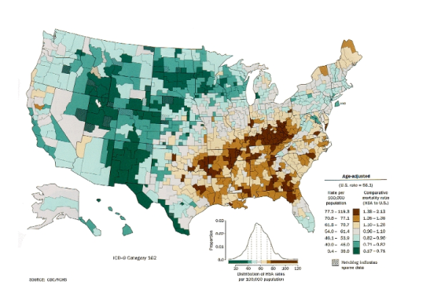
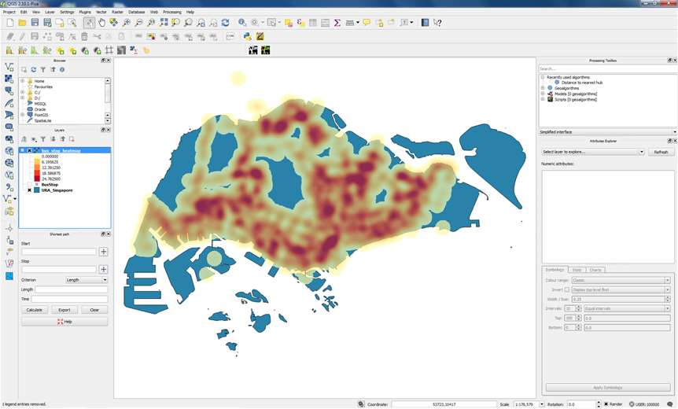
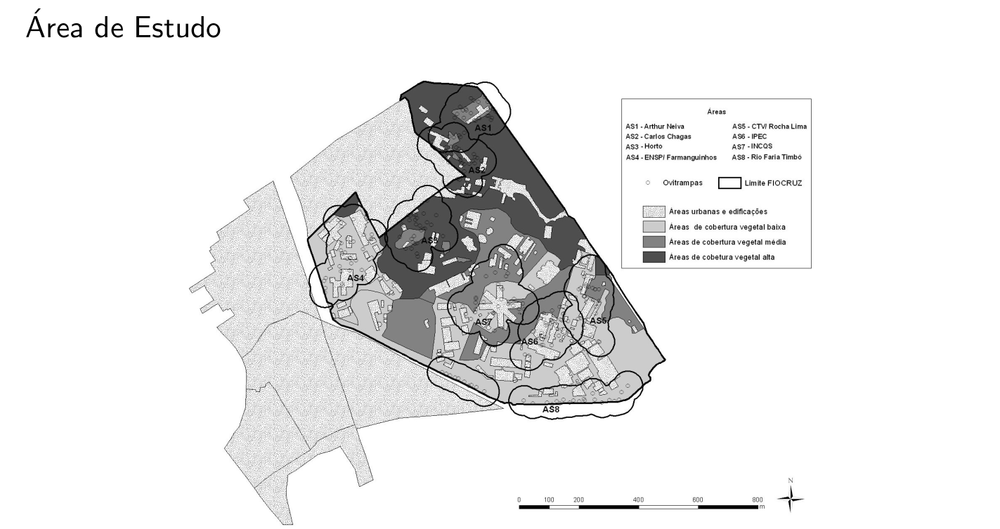
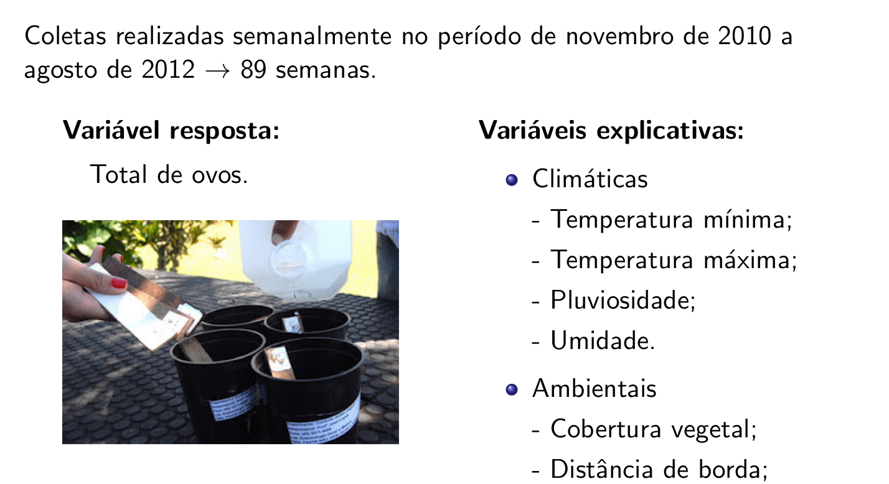

```{r,echo=FALSE,message=FALSE,warning=FALSE}
library(knitr)
library(pander)
# Set so that long lines in R will be wrapped:
opts_chunk$set(tidy.opts=list(width.cutoff=50),tidy=TRUE)

```

# Introdução à Análise Estatística Espacial


## O que é Análise Estatística Espacial?

- São métodos estatísticos que levam em consideração a localização espacial do fenômeno estudado;

- Define-se "Análise estatística espacial quando os dados são espacialmente localizados e se considera explicitamente a possível importância de seu arranjo espacial na análise ou interpretação dos resultados" (Bailey & Gatrell, 1995).

- Principal característica: a localização geográfica é utilizada explicitamente na análise.

- Neste curso serão abordadas basicamente as técnicas estatísticas de análise espacial.

- Diversas operações realizadas em um SIG são também chamadas de **análise espacial**, mas **não são** objeto deste curso.

## Origem da Estatística Espacial

- Dr. John Snow (1813-1858) Considerado pai da Epidemiologia Moderna:


 {width=65%}

\

- Mapeamento dos casos de coléra (***$\bullet$***) e as bombas de água (***X***). (Londres, 1854)

 {width=90%}


## Quando usar métodos de análise espacial?

-  ***A primeira pergunta a ser feita é:*** A distribuição dos dados apresenta um padrão aleatório ou apresenta algum outro tipo de padrão? (*Tendências, clusters, Regular*)


 {width=80%}


- **Heterogeneidade espacial:** A magnitude e a direção do fenômeno de interesse varia no espaço.

- **Violação da suposição de independência:** Os atributos da observação *i* influenciam nos atributos na observação *j*. 


## Dependência espacial

- A visão da Geografia 

---

:::: {.greenbox data-latex=""}
::: {.center data-latex=""}
Conhecida como 1$^a$ Lei da Geografia!
:::

"Todas as coisas são parecidas, mas coisas mais próximas se parecem mais que coisas mais distantes." 

(Waldo Tobler, 1979) [wikipedia](https://pt.wikipedia.org/wiki/Primeira_lei_da_geografia#:~:text=De%20acordo%20com%20Waldo%20Tobler,relacionadas%20do%20que%20coisas%20distantes%22.)

::::

--- 

- Quais as possíveis implicações de não considerar a localização espacial na modelagem? 

:::: {.greenbox data-latex=""}
::: {.center data-latex=""}
Dependência Estatística Espacial
:::
"Independência é um pressuposto muito conveniente que faz grande parte da teoria estatı́stica matemática tratável. Entretanto, modelos que envolvem dependência estatı́stica são freqüentemente mais realı́sticos. [...] dados espaciais, onde a dependência está presente em todas as direções e fica mais fraca a medida em que aumenta a dispersão na localização dos dados." (Noel Cressie, Statistics for spatial data. 1991)
::::

\ 

 **Generalizando, a maior parte dos fenômenos, sejam estes socioeconômicos ou da área da saúde, apresentam entre si uma relação - semelhança ou inibição - que depende da distância.**


## Principais aplicações em Saúde

- **Mapeamento de doenças:** O objetivo geral é avaliar a variação geográfica na ocorrência das doenças visando identificar diferenciais de risco, orientar a alocação de recursos, levantar hipóteses etiológicas.

- **Clusters:** O objetivo da detecção de cluster espacial é estabelecer a significância de um sobrerrisco em um determinado espaço ou tempo e espaço. Este cluster pode ser causado por diferentes fatores: agentes infecciosos, contaminação ambiental localizada, efeitos colaterais de tratamentos, etc.

- **Estudos ecológicos:** Essencialmente modelos de regressão, onde se busca explicar a variação na incidência da doença através de outras variáveis. 

- **Avaliação e monitoramento ambiental:** Estimativa e monitoramento da distribuição espacial de fatores ambientais relevantes para a saúde. Por exemplo, poluentes químicos, insolação (Raios UV), vegetação, clima, etc.

-  A quantidade e disponibilidade de dados nesta área atualmente é bem grande, com ênfase particular para as imagens de satélite, com resolução e acessibilidade cada vez maiores.


## Tipologia dos dados espaciais

Os diferentes tipos de dados espaciais são tradicionalmente classificados de acordo com uma tipologia. Esta caracterização diz respeito a natureza estocástica da observação.

  - Cressie divide a estatística espacial em 3 grandes áreas:

    - Dados de processos pontuais;

    - Dados de geoestatística;

    - Dados de área;

Existem métodos estatísticos diferentes para descrever ou analisar estes tipos de dados.


 <!-- {width=80%} -->

|                              |       Tipo de Dado       |       Exemplos        | Técnicas                                          |
| ---------------------------- | :----------------------: | :-------------------: | :------------------------------------------------ |
| Análises de padrões pontuais |   Eventos localizados    | Ocorrência de doenças | - Determinação de Padrões<br /> - Cluster          |
| Geoestatística               |         Amostras         | Variáveis ambientais  | - Interpolação de superfícies                     |
| Análises de dados de Área    | Atributos de um polígono |   Dados censitários   | - Correlação espacial<br />* modelos de Regressão |
 
 

:::: {.blackbox data-latex=""}
::: {.center data-latex=""}
**OBSERVAÇÃO!**
:::
- Existem ainda outros tipos de dados como por exemplo imagens de satélites (RASTER), redes e fluxos que não serão vistos nesse curso. 

- Eventualmente misturas de diferentes tipos de dados estão presentes em um mesmo estudo.

- Em algumas situações pode-se converter o dado de um tipo para outro (troca de suporte).
::::


## Dados de Processos Pontuais

- O principal interesse está no conjunto de coordenadas geográficas representando as localizações exatas de eventos.

- Exemplos: Localização de crimes, localização da residência dos casos de dengue, localização de espécies vegetais, etc.

- Neste caso, o dado aleatório de interesse é a localização espacial do evento.

- O objetivo é estudar a distribuição espacial dos pontos testando a hipótese sobre o padrão observado: existe aglomeração/cluster de casos ou eles estão dispostos aleatoriamente?
 


**- Localização da ocorrência de todos os crimes violentos no ano de 1998 registrados pela PM de Belo Horizonte:**


{width=60%}


Existe aglomeração de casos em alguma área da cidade?

\

**- Localização da ocorrência de casos de Dengue em Belo Horizonte: (Jean Barrado)**

{width=80%}


**- Detection and modelling of case clusters for urban leptospirosis:**

{width=100%}

[Fonte: Tassinari et al. (2008)](http://www6.ensp.fiocruz.br/repositorio/sites/default/files/arquivos/DetectionModelling.pdf).


**- Spatial distribution of leptospirosis in the city of Rio de Janeiro, Brazil, 1996-1999:**


{width=100%}

[Fonte: Tassinari et al. (2004)](http://www.scielo.br/pdf/csp/v20n6/31.pdf)


## Geoestatı́stica

- São dados que compreendem um conjunto de localizações (em geral latitudes e longitudes), mas agregados a eles uma medida contínua, como por exemplo o volume de chuva.

- Neste caso estaremos interessados em entender o padrão nos valores amostrados nestas localizações e também modelar e estimar valores em localizações não medidas.

- Bastante utilizada em ciências ambientais (chuva, temperatura, umidade, poluentes no ar, etc.)

- Exemplo: Mapa sobre o teor de argila no solo.

 {width=90%}


- Krigagem da chuva no Rio de Janeiro


[Fonte: Teixeira e Cruz (2011)](http://www.scielo.br/pdf/csp/v27n3/19.pdf)


## Dados de Área

- Este tipo de dado pode ser visualizado em mapas onde o espaço é particionado em áreas e cada área é colorida de acordo com alguma variável.

- As áreas podem ser:

    - Irregulares: divisões de caráter polı́tico ou administrativo. Por exemplo: municípios, setores censitários, etc.
    - Regulares: medidas em grade regular. Por exemplo, imagens de satélite.
    
- Para cada uma destas áreas temos informações agregadas de um determinado fenômeno (em geral somas ou médias).

- Bastante utilizados em epidemiologia, economia e demografia, etc.
 
**Objetivo:** Identificar áreas de risco.

\

**-Taxas de câncer de pulmão na população branca masculina nos Estados Unidos, por condados no ano de 1998:**


{width=70%}


 
\


## Geoprocessamento
 
- Geoprocessamento é um conjunto de técnicas , softwares e hardware  capazes de coletar , tratar , analisar e disseminar informações georreferenciadas  permitindo  o desenvolvimento de novos dados, analises e aplicações;

- Utiliza programas de computador que permitem o uso integrado de informações cartográficas (mapas, cartas topográficas , imagens de satélites etc...) e informações tabulares (dados alfanumericos) e possibilita  se associar coordenadas desses dados a mapas ;

- Duas das principais  ferramentas de geoprocessamento são os Sistema de Informações Geográficas (SIG) e o  Sensoriamento Remoto (SR) 

- Este curso não vai abordar a tecnologias de Sensoriamento  Remoto ainda que exista a possibilidade, cada vez maior  de se integrar todas as técnicas usando o R. 

 {width=50%}


## Tecnologias de Geoprocessamento
 
  {width=100%}


## Sistema de Informações Geográficas
 

- Um Sistema de Informação Geográfica (SIG ou GIS - Geographic Information System) é um sistema de hardware, software, informação espacial e procedimentos computacionais que permite e facilita a análise, gestão ou
representação do espaço e dos fenômenos que nele ocorrem.


  {width=70%}


### QGIS
 
  {width=100%}


\

https://qgis.org/pt_BR/site/

\

  {width=100%}

 


## Análise Espacial no R

[CRAN Task View: Analysis of Spatial Data](https://cran.r-project.org/web/views/Spatial.html)


## Alguns Conceitos

### Autocorrelação espacial

- É uma medida estatística que quantifica e testa o grau de dependência entre observações no espaço.

    - Caso haja evidência de estrutura espacial, o postulado de independência das amostras, é inválido.
    
    - Nestes casos os modelos de regressão devem levar em conta explicitamente o espaço em suas formulações.
    
    - Dados espaciais são considerados uma única realização de um processo estocástico. Diferente da amostragem tradicional, em que cada observação traz uma informação independente, todas as observações são utilizadas de forma conjunta para descrever o padrão do fenômeno estudado.

### Estacionariedade

- O processo é estacionário se a média é constante e a covariância entre dois pontos quaisquer é função apenas da distancia entre as duas localizações.


### Isotropia

- O processo é isotrópico se além de estacionário, a covariância depende somente da distância entre as localizações.

\

## Aplicações

### Dengue em Dourados

  {width=100%}


  {width=100%}


  {width=100%}


### Vigilância dos vetores da Dengue usando modelagem espaço-temporal Bayesiana

  {width=100%}


  {width=100%}


  {width=100%}


  {width=100%}


### Modelo Espaço-Temporal para a Análise da Morbimortalidade por Influenza

  {width=100%}


- **Fonte de dados:** Sistema Nacional de Informação de Agravos de Notificação (SINAN) do Ministério da Saúde, Brasil.

- **Desfecho:** Casos confirmados e autóctones de influenza A (H1N1) de 5 de abril a 26 de setembro de 2009.

- **Nı́vel de agregação espacial:** Município de residência (399)

- **Nı́vel de agregação temporal**: Semana epidemiológica (25)

- **Covariáveis:** Precipitação, temperatura (mı́nima e máxima), umidade relativa do ar, altitude, taxa de pobreza, IDH municipal, densidade demográfica e presença dos principais meios de transporte (ônibus municipal, ônibus intermunicipal, barco e avião).

  {width=100%}


  {width=100%}


  {width=100%}


  {width=100%}


### Análise da temperatura na costa central da Califórnia

- Os dados consistem de medidas mensais de temperatura em graus
centı́grados em 23 estações monitoradoras localizadas na 5 a Região
Climática da Califórnia.

- As séries temporais correspondem ao perı́odo de janeiro de 1992 a
dezembro de 2002.

- A altitude para cada uma das estações também estava disponı́vel.

  {width=130%}


- A estrutura de média foi modelada usando um nı́vel variando ao longo do tempo, uma componente sazonal e um termo linear para a altitude.

  {width=130%}


### A Relação entre a Malária e a Chuva no Estado do Pará: Uma Análise Espaço-Temporal.

**Objetivos:**

- Estudar as similaridades/diferenças entre as ocorrências de malária no Pará;

- Estudar a relação entre a incidência de malária e a quantidade de chuva;

- Verificar existência de estrutura espacial e temporal.

**Material:**

- As informações deste trabalho referem-se ao número de casos de malária em alguns municı́pios do estado do Pará através de dados mensais coletados durante os anos de 96 à 98.

- Os dados de chuva são dados mensais observados durante os anos de 96 a 98 coletados em 78 estações monitoradoras espalhadas pelos municı́pios.


  {width=100%}


  {width=100%}


  {width=100%}


### Modelagem espaço temporal da Chikungunya  no município do Rio de Janeiro 


**- Spatio-temporal modelling of the first Chikungunya in Rio de Janeiro:**

<video width="800"  controls>
  <source src="video/video2.mp4" type="video/mp4">
</video>


[Fonte: Freitas et al. (2020)](https://doi.org/10.1101/2020.06.08.20125757)


### Mapas de Fluxo


Fonte: Dissertação “Análisis espacial de factores socioeconómicos, de servicios de salud y de mortalidad por cáncer de mama, Argentina, 2009-2011” por Andrea Perinetti.


## Material on line sobre Estatística Espacial

**Análise Espacial de Dados Geográficos**

http://www.dpi.inpe.br/gilberto/livro/analise/

**R Spatial**

https://www.r-spatial.org/

**Geocomputation with R**

https://bookdown.org/robinlovelace/geocompr/


## Onde encontrar dados espaciais ?

#### Malhas Digitais Nacionais 

- [IBGE: Malhas territoriais](https://www.ibge.gov.br/geociencias/organizacao-do-territorio/malhas-territoriais.html)

- [IBGE: Portal de mapas](https://portaldemapas.ibge.gov.br/)

- [IpeaGeo: Malhas](https://www.ipea.gov.br/ipeageo/malhas.html)

- [INDE: Infraestrutura Nacional de Dados Espaciais](https://visualizador.inde.gov.br/)

- [portal Dados Abertos](https://dados.gov.br/dataset?tags=Geoespacial&groups=saude)

#### Agregadores de Links e Bases

- [LabGIS UERJ](https://www.labgis.uerj.br/fontes_dados.php)

- [GeoAplicada](https://www.geoaplicada.com/download-dados-espaciais/)

- [ForestGIS](https://forest-gis.com/download-de-shapefiles/)


## Bibliografia sugerida

Bailey, Trevor C.; Gatrell, Anthony C. (1995) Interactive Spatial Data Analysis. Harlow Essex: Longman.

Cressie, N. A. C. (1991). Statistic for Spatial Data. New York.

Costa, Ana C. C., et al. (2015). Surveillance of dengue vectors using spatio-temporal Bayesian modeling. BMC medical informatics and decision making 15.1: 93.

Sansó, B., Schmidt, A. M. e Nobre, A. A. (2008). Bayesian Spatio-temporal models based on discrete convolutions. Canadian Journal of Statistics, 36, 239-258.

Nobre, A. A., Schmidt, A. M. e Lopes, H. F. (2005). Spatio-temporal models for mapping the incidence of malaria in Pará. Environmetrics, 16, 291-304.

Pfeiffer, D. U., et al. (2008) Spatial Analysis in Epidemiology. Oxford University Press. 