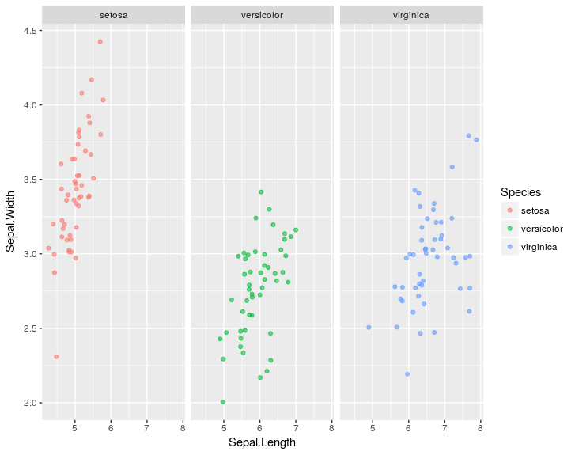
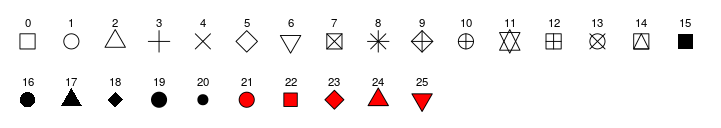
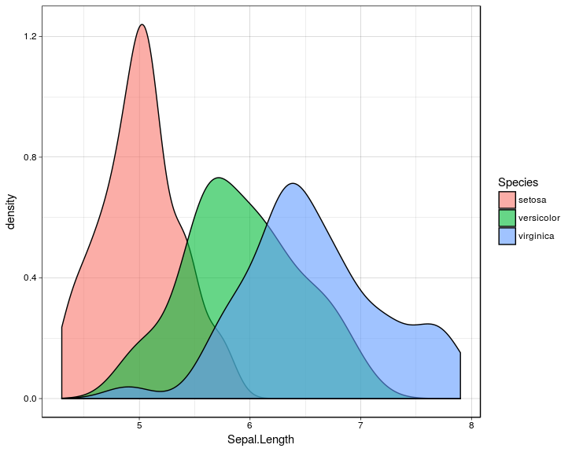
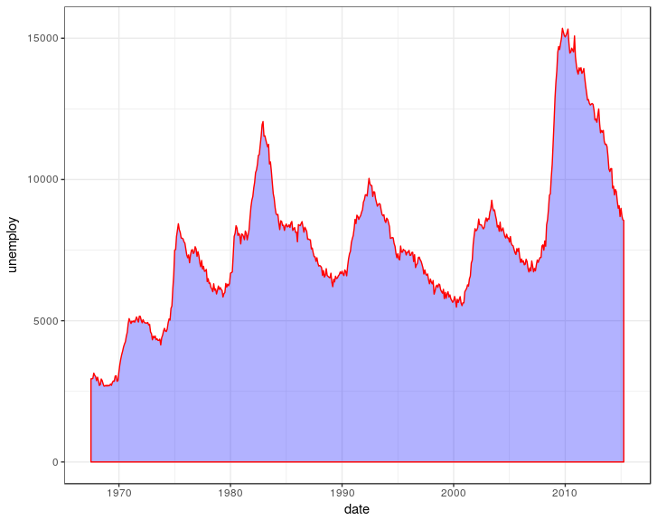

# 


[TOC]


## Gráficos com ggplot 


O ggplot2 é uma pacote do **R**, criado por Hadley Wickham ( Chief Scientist do [RStudio](http://rstudio.com/)) ,  que faz parte do *tidyverse* e implementa um sistema de gráficos baseados em uma gramatica própria permitindo a criação de gráficos avançados. Essa gramatica se encarrega de diversos detalhes que precisariam ser especificados se fossemos fazer usando o modulo base do **R**. A gramatica do *ggplot2* é portanto diferente dos demais pacotes gráficos existentes no **R** e faz com que pareça mais complicado de se chegar ao resultado desejado, no entanto, como no *dplyr* após nos familiarizarmos com ela, podemos através da combinação de seus diversos elementos   usando  poucas linhas conseguimos produzir gráficos bastante complexos , multicamadas e com excelente qualidade final.

Usando essa gramatica e possível combinar seus elementos e facilmente criar novos gráficos de muitas maneiras customizando seu aspecto. Atualmente podemos encontrar mais de 70 pacotes do **R** que estendem ou implementam funções gráficas da **ggplot2** podemos ver [Aqui alguns desses pacotes](http://www.ggplot2-exts.org/gallery/).


 a gramatica da *ggplot2* consiste dos seguintes elementos que representam camadas:

 

| Elemento                       | Descição                                                     | Funções         |
| ------------------------------ | :----------------------------------------------------------- | --------------- |
| Dado<br>(Data)               | o conjunto de dados que será usado                           | **ggplot()**    |
| Estética<br>( Aesthetics)    | variáveis e escalas  para mapear o gráfico                   | **aes()**       |
| Geometria<br>( Geometries)   | elementos visuais usados no gráfico (linhas, pontos, barras,etc...)                         | **geom_???()**  |
| Estatistica<br>( Statistics) | representação estatística dos dados para <br>melhor entendimento/visualização | **stat_???()**, |
| Faceta<br>( Facets)          | múltiplos gráficos (sub painéis)                             | **facet_???()** |
| Escala<br>( scale )          | controla varios aspectos dos eixos, como cores, labels <br>transformações etc...  | **scale_???()** |
| Coordenada<br>( Coordinates) | representação espacial dos dados                             | **coord_???()** |
| Tema<br>( Themes)            | estilos do fundo, fontes, tamanos ,cores aspectos gerias                                | **theme_???()** |
|                                |                                                              |                 |
|                                |                                                              |                 |


Para fazer um graficos precisamos pelo menos das camadas de Dados, Estética Geometria 

Para saber mais consulte:

[Documentação  da ggplot2](http://ggplot2.tidyverse.org/reference/)

[Tutorial ggplot2](http://tutorials.iq.harvard.edu/R/Rgraphics/Rgraphics.html)

[R Graphics Cookbook](http://www.cookbook-r.com/Graphs/)


#### 1.0 Adicionando camadas em um gráfico de linha (Scaterplot) 

Como exemplo para ilustrar como funcionam as camadas na *ggplot2* vamos utilizar os dados *iris* como exemplo. O primeiro passo para se fazer um grafico é conhecer o dado ,então use as funções **head()** e **str()** para isso.


```
> str(iris)
'data.frame':	150 obs. of  5 variables:
 $ Sepal.Length: num  5.1 4.9 4.7 4.6 5 5.4 4.6 5 4.4 4.9 ...
 $ Sepal.Width : num  3.5 3 3.2 3.1 3.6 3.9 3.4 3.4 2.9 3.1 ...
 $ Petal.Length: num  1.4 1.4 1.3 1.5 1.4 1.7 1.4 1.5 1.4 1.5 ...
 $ Petal.Width : num  0.2 0.2 0.2 0.2 0.2 0.4 0.3 0.2 0.2 0.1 ...
 $ Species     : Factor w/ 3 levels "setosa","versicolor",..: 1 1 1 1 1 1 1 1 1 1 ...
```

agora vamos ao nosso gráfico, suponha que queremos explorar a relação entre o comprimento e a largura da Sépala das especies de Lírios no dado apresentado acima.

No  pacote *graphics* que esta disponível no **R** bastaria :

```R
 plot(iris$Sepal.Length, iris$Sepal.Width)
```

Ao tentar aplicar a mesma logica ao *ggplot2* teríamos:

```R
 ggplot(iris, aes(x = Sepal.Length, y = Sepal.Width)) 
```

onde *iris* é o nome do *data.frame* , e a função *aes* representa os aspectos estéticos ou seja, nesse caso os elementos **x** e **y** 

a linha acima  gerar um gráfico sem nenhum elemento 


para que possamos visualizar os pontos necessitamos de um elemento geométrico, nesse caso pontos.

```
ggplot(iris, aes(x = Sepal.Length, y = Sepal.Width)) +   geom_point()
```


Uma das características interessantes da *ggplot2* e que podemos ir armazenando os elementos gráficos e comando as camadas como no comando abaixo:


```
p <- ggplot(iris, aes(x = Sepal.Length, y = Sepal.Width))
p + geom_point()
```

 vamos supor que queremos cores para cada uma das especies , nesse caso vamos ter de alterar um dos aspectos de mapeamento dos dados (estéticos)

```
p <- ggplot(iris, aes(x = Sepal.Length, y = Sepal.Width,color=Species))
p + geom_point()
```


Agora temos além das cores para cada especie , uma legenda. Mas  nosso gráficos varias pontos são coincidentes, para melhor exibir esse pontos vamos usar a função **geom_jitter()** que adiciona um descolamento aleatório a cada dimensão e além disso vamos adicionar uma transparência aos pontos de 60%.


```
p + geom_jitter(alpha = 0.6)
```


repita o comando e veja que o gráfico muda um pouco, uma vez que o  "ruido" adicionado pela função é aleatório.  repare também que existem pontos mais escuros, ou seja mesmo com o jitter ainda pode haver alguma sobreposição. 

Vamos adicionar mais uma camada dividindo em sub painéis por especie.


```
ggplot(iris, aes(x = Sepal.Length, y = Sepal.Width,color=Species)) +
  geom_jitter(alpha = 0.6) +
  facet_grid(. ~ Species)
```




Em seguida vamos adicionar mais uma camada , a estatística adicionando uma reta de regressão linear a cada subplot


```
ggplot(iris, aes(x = Sepal.Length, y = Sepal.Width,color=Species)) +
  geom_jitter(alpha = 0.6) +
  facet_grid(. ~ Species) +
  stat_smooth(method = "lm", se = F, col = "black")
```


Manipulando uma outra camada, desta vez, a de coordenadas, vamos fazer com que as coordenadas de **x** e **y** fique com um espaçamento igual. Para isso vamos usar a função **coord_equal()** 


```
ggplot(iris, aes(x = Sepal.Length, y = Sepal.Width,color=Species)) +
  geom_jitter(alpha = 0.6) +
  facet_grid(. ~ Species) +
  stat_smooth(method = "lm", se = F, col = "black") +
  coord_equal() 
```


existem varias outras funções uteis para altera coordenadas, entre as mais usadas poderíamos destacar 

**scale_x_...()** e **scale_y_...()**  onde **...** pode ser continuou, date, log etc... permitindo especificar melhor as escalas de **x** e **y** de nosso gráfico 


mais um aspecto que pode nos interessar aqui é modificar os *labels* através da função **labs()** 


```
ggplot(iris, aes(x = Sepal.Length, y = Sepal.Width,color=Species)) +
  geom_jitter(alpha = 1) +
  facet_grid(. ~ Species) +
  stat_smooth(method = "lm", se = F, col = "black")  +
  coord_equal() +
  labs( title = "Comprimento vs largura da Sépala em 3 especies de Lírios",
       x="comprimento(cm)" ,
       y ="largura(cm)" ,
       color = "Especie" )
```


no exemplo acima estamos especificando os labels do gráfico, das coordenadas **x** e **y** e da legenda de uma só vez. existem ainda as funções **ggtitle() , xlab(), ylab() ** .


podemos alterar ainda a camada do tema , varios temas já configurados estão disponíveis sendo também possível criar seu próprio tema.


```
ggplot(iris, aes(x = Sepal.Length, y = Sepal.Width,color=Species)) +
  geom_jitter(alpha = 1) +
  facet_grid(. ~ Species) +
  stat_smooth(method = "lm", se = F, col = "black")  +
  coord_equal() +
  labs( title = "Comprimento vs largura da Sépala em 3 especies de Lírios",
        subtitle = "Edgar Anderson's Iris Data",
         x="comprimento(cm)" ,
         y ="largura(cm)" ,
         color = "Especie" ) +
   theme_light()

```


experimente outros temas como por exemplo **theme_dark(), theme_minimal(), theme_linedraw(), theme_void()** , atribua a parte ate labs a um objeto e depois teste apenas modificando o tema.

#### 1.1 Camada Estética (aes) 

Antes de mais nada vamos conhecer um pouco mais as opções disponíveis na camada estética ( **aes()**), ela possui os seguintes parâmetros. 

| Parametro | Descrição                                |
| --------- | ---------------------------------------- |
| x         | valores do eixo x                        |
| y         | valores do eixo y                        |
| colour    | cor/cores da linhas externas ou dos pontos |
| fill      | cor de preenchimento                     |
| size      | diâmetro do ponto/espesura da linha      |
| alpha     | transparência (0 - nenhuma a 1 - transparente) |
| linetype  | padrão da linha, 1 - solida, 2 a 12 tracejadas  (fig 1) |
| labels    | texto no gráfico ou nos eixos            |
| shape     | tipo de simbolo empregado  0 a 25 (fig 2) ou qualquer letra/numero |
|           |                                          |


A linhas que podemos definir são


figura 1 - Linhas 


e o símbolos , note que para os simbolo sólidos de 21 a 25 pode-se definir a cor da linha com o parâmetro *colour* e o preenchimento  do simbolo com *fill* 



figura 2 - Simbolos


#### 1.2 Histogramas e densidade   


Agora que já vimos a ideia de camadas vamos fazer um simples histograma.


```R
ggplot(iris, aes(x = Sepal.Width)) +
geom_histogram()

```

repare que a função **geom_histogram()** retornou uma mensagem de aviso 

```R
`stat_bin()` using `bins = 30`. Pick better value with `binwidth`.
```

podemos especificar a quantidade de classes  usando os parâmetros *binwidth* ou *bins*. você deve sempre buscar um valor mais adequado o defaul são 30 classes. 


```R
p <- ggplot(iris, aes(x = Sepal.Width)) 
p + geom_histogram( binwidth = 0.1 )
```


ou 

```
p + geom_histogram(bins=30)
```

para converter aproximadamente bins em binwidth , onde 30 seria o numero de bins e o resultado

```R
> diff(range(iris$Sepal.Length) / 30)
[1] 0.12

```


Suponha agora que queremos um histograma para cada especie. 

```
 ggplot(iris, aes( Sepal.Length,fill=Species))  + 
 geom_histogram(binwidth = 0.1)
```


podemos também usar o parâmetro *position* da função **geom_histogram()** para especificar baras lado a lado ou empilhadas . Teste as opções *dodge* e *fill* , o default é *stack*. 

```
 ggplot(iris, aes( Sepal.Length,fill=Species))  + 
 geom_histogram(bins=10,position = "dodge")
```


Teste também as opções de coordenadas **cord_flip()** e **coord_polar()** 


```R
  ggplot(iris, aes( Sepal.Length,fill=Species)) + 
  geom_histogram(bins=40) + 
  coord_polar() + 
  theme_linedraw()
```


a função **geom_density()** é semelhante, teste com parametro *alpha*  

```
ggplot(iris, aes( Sepal.Length,fill=Species)) +
geom_density(binwidth=0.1,alpha=0.6)  + 
theme_linedraw()
```



#### 1.3 Gráfico de barras (barplot) 


um barplot simples é facilmente obtido , veja que aqui nesse *data.frame* por default o total é "contado" pela  função **geom_bat()** que tem como *default* o parâmetro *stat="count"*  , ou seja, as ocorrências de cada tipo da variável *vore* serão contadas e exibidas no gráfico gerado. 


```
  ggplot(msleep, aes(vore)) +  geom_bar()  ## bar plot!!!!
```


mas se tivermos o seguinte dado, como fazer para ter um barplot 


```R
 exemplo <-  data.frame(sexo = c( "Masculino", "Feminino","Ignorado"),
             total = c(4567,3867,90))
 
```


uma primeira tentativa seria:


```
ggplot(exemplo,aes(sexo)) + geom_bar()
```

ou quem sabe 

```
ggplot(exemplo,aes(total)) + geom_bar()
```

parece que vamos precisar da variável *sexo* e também de *total* 


```R
ggplot(exemplo,aes(sexo,total)) + geom_bar()
Erro: stat_count() must not be used with a y aesthetic
```

continuamos sem sucesso mas a mensagem de erro da uma pista. a função **geom_bar()**  está contando o numero de vezes que Feminino, Masculino e ignorado aparecem no *data.frame*, assim sendo precisamos além de especificar *aes(sexo,total)* também avisar a função **geom_bar()** para usar o valro de total 

```R
 ggplot(exemplo,aes(sexo,total,fill=sexo)) + geom_bar(stat='identity')
```


Valor olhar os dados 

```
str(exemplo)
'data.frame':	3 obs. of  2 variables:
 $ sexo : Factor w/ 3 levels "Feminino","Ignorado",..: 3 1 2
 $ total: num  4567 3867 90
```

Observe que  sexo é um fator e que por default a ordem do fator é alfabética, você pode confirmar isso pedindo 


```R
> levels(exemplo$sexo)
[1] "Feminino"  "Ignorado"  "Masculino"
```


uma das principais razões de não conseguirmos fazer gráficos corretamente na *ggplot2* tem a ver com a maneira que a biblioteca trata os fatores. Para resolver esse problema precisamos reordenar o fator para seguir a ordem de entrada.

```
 exemplo$sexo<- factor(exemplo$sexo, levels=as.character(exemplo$sexo))
 
```

vamos conferir

```
> levels(exemplo$sexo)
[1] "Masculino" "Feminino"  "Ignorado"
```

e por fim fazer mais uma vez o nosso gráfico na ordem especificada no novo fator. 


```R
 ggplot(exemplo,aes(sexo,total,fill=sexo)) + geom_bar(stat='identity')
```


mais um exemplo, suponha que você tem dados das medias mensais de temperaturas medias , máximas , mínimas e precipitação do Rio de janeiro
```R
 
rio <-   data.frame(
   T_media = c(26.1,	26,	25.2,	23.6,	21.8,	20.9,	20.6,	21,	21.7,	22.5,	23.8,	24.6) ,
   T_minima= c(22.3,	22.4,	21.7,	20.1,	18.2,	17,	16.7,	17,	18,	19,	20.3,	21),
   T_maxima = c(30,	29.7,	28.8,	27.2,	25.5,	24.9,	24.5,	25,	25.4,	26.1,	27.3,	28.2),
   Chuva = c(149,	147,	147,	130,	93,	58,	55,	59,	76,	103,	116,	145) ,
   mes = c("Janeiro",	"Fevereiro",	"Março"	, "Abril",	"Maio", 	"Junho"	, "Julho",	"Agosto",	"Setembro",	"Outubro",	"Novembro", "Dezembro"),
   stringsAsFactors = FALSE)
```

antes de mais nada apos inspecionar os dados vamos corrigir o fator *mes*

```
 rio$mes <- factor(rio$mes, levels=as.character(rio$mes))
```

e agora vamos produzir um gráfico de barras com os valores médios mensais e em cada barra os valores mínimo e máximo. Vamos colorir de acordo com uma escala de cores onde azul são temperaturas mais frias e vermelho as  mais quentes.

```R
 ggplot(rio,aes(mes,T_media))  + 
   geom_bar(aes(fill=T_media),stat='identity') +
   scale_fill_gradient(low= "blue",high="red") +
   geom_errorbar(aes(ymin=T_minima,ymax=T_maxima))
```


Repare no comando acima que temos duas funções **geom_???()** no mesmo gráfico, no caso uma faz as barras e outra as barras de erros.  Esse é um recurso comumente empregado para adicionar diversas camadas a nosso gráfico.  


#### 1.4 boxplot 

um boxplot básico teria 


```R
ggplot(iris, aes( Species,Sepal.Length)) + 
geom_boxplot()  + 
theme_linedraw()
```


ou ainda algo por especie e com as coordenadas rodadas!

```
 ggplot(iris, aes(x = Species, y = Sepal.Width,fill=Species)) +
   geom_boxplot() +
   coord_flip()
```


Suponha que necessitamos de um boxplot para as quatro variáveis do *dataframe* *iris* como fazer isso em *ggplot2* ? no  **R** padrão (*graphics*) faríamos

```
boxplot(iris$Sepal.Length,iris$Sepal.Width,iris$Petal.Length,iris$Petal.Width)
```


Este é onde a maioria dos iniciantes em *ggplot2* se confunde. Para fazer isso é necessario transformar o dado para um formato longo, ou seja, apenas 3 colunas.


```
 iris.wide <- iris %>%  gather(tipo, valor, -Species)
```

use **str()** e **head()** para ver como ficou a nova estrutura de dados. A partir desse novo formato podemos:


```
ggplot(iris.wide,aes(tipo,valor)) + 
geom_boxplot()
```


Se quisermos diferenciar por especie

```
 ggplot(iris.wide,aes(tipo,valor,fill=Species)) + 
 geom_boxplot()
```


se quisermos agora subplots  especie


```
  ggplot(iris.wide,aes(tipo,valor,fill=tipo)) + 
  geom_boxplot() + 
  facet_grid(~Species)
```


repare que o texto do label em *x* ficou confuso, como podemos modificar isso? Seria possível também eliminar a legenda a direita já que as variáveis tem label?


```
 ggplot(iris.wide,aes(tipo,valor,fill=tipo)) + 
 geom_boxplot() + 
 facet_grid(~Species) + 
 theme(axis.text.x=element_text(angle=90,hjust=1),
 	legend.position="none",
 	panel.background =element_rect(fill="white",color="black") )

```


Repare que no gráfico acima customizamos o tema, mudando vários aspectos como a orientação do texto no label, e a cor de fundo no background. para se ter uma ideia de quantos parâmetros podem ser modificados no tema, use o comando

```
View(theme_grey())
```


#### 1.5 gráficos de linha 


O grafico de linha é um dos mais empregados , são necessárias duas variáveis *x* e *y* , em geral continuas. existem algumas funções que fazem 


```
ggplot(economics, aes(date, unemploy)) +
    geom_line(colour = "red")
```


podemos também representar a área abaixo da linha

```
  ggplot(economics, aes(date, unemploy)) +
    geom_area(colour = "red",fill="blue",alpha=0.3) +
    theme_bw()
```



ou ainda como uma função em escada (*step*) 

```

  ggplot(economics[1:32,], aes(date, unemploy)) +
    geom_step(colour = "red")
```


podemos representar vários elementos, como pontos e linhas suavizadas 


```
 ggplot(economics, aes(date, unemploy)) +
    geom_point(size=0.5) +
    geom_smooth(colour="blue") 
```


só para mostrar que podemos fazer linhas com outros tipos de dados


```
kilo <- data.frame(
  sexo = factor(c("Feminino","Feminino","Masculino","Masculino")),
  hora = factor(c("Almoço","Jantar","Almoço","Jantar"), levels=c("Almoço","Jantar")),
  gramas = c(289, 334, 450, 385))
```


Note que temos 2 fatores e uma variável numérica apenas.


```
ggplot(data=kilo, aes(x=hora, y=gramas, group=sexo, shape=sexo, colour=sexo)) +
geom_line(aes(linetype=sexo), size=1) +  
  geom_point(size=5) +        
  scale_colour_hue(name="Sexo",      
                   l=30)  +                  
  scale_shape_manual(name="Sexo",
                     values=c(22,21)) +      
  scale_linetype_discrete(name="Sexo") +
  xlab("Refeição") + ylab("Gramas") + 
  ggtitle("Quantidade consumida por 2 pessoas em um restaurante à Kilo") +     
  theme_bw()
```


Existem ainda muitas outras funções que são capazes de produzir gráficos interessantes e complexos. Além da existência de muitos pacotes que estendem as funções da *ggplot2*, podemos destacar *ggExtra*, *ggmaps*, *ggedit* entre cerca de 70 outros. 


Visite esses sites para ter algumas indeias/ inspirações

[ggplot gallery](http://www.ggplot2-exts.org/gallery/)

[top 50 ggplot2 visualization](http://r-statistics.co/Top50-Ggplot2-Visualizations-MasterList-R-Code.html)


#### 1.6 Gráficos interativos

Existem bibliotecas que implementam gráficos interativos que são compatíveis com a *ggplot2* , segue um pequeno exemplo usando a plotly:


```
install.packages(plotly)
```


```R
p <- ggplot(p <- economics, aes(date, unemploy)) +
  geom_line(colour = "red")

library(plotly)
ggplotly(p)
```


#### 1.7 Mapas

Como já foi dito diversos pacotes adicionam funcionalidades ao **ggplot** um dos mais completos pacotes para tratar de dados espaciais é o pacote **sf** 

```R
library(sf)

nc <- st_read(system.file("shape/nc.shp", package = "sf"))

ggplot(nc) +
  geom_sf(aes(fill = NWBIR79)) +
  theme_void()
```


Adicionando uma nova paleta de cores

```R
ggplot(nc) +
  geom_sf(aes(fill = NWBIR79)) +
  scale_fill_viridis_c(option = "plasma",name='Nascimentos \n em 1979') +
  theme_void()

```


#### Animações


O pacote **gganimate** permite criar animações 


```R
library(gganimate)

p <- ggplot(iris, aes(x = Petal.Width, y = Petal.Length)) +
  geom_point()

plot(p)
```

o primeiro passo é criar um gráfico comum e em seguida vamos fazer a animação 


a chave para isso é a introdução dos elementos de transição usando a função *transition_states* que neste exeplo muda o estado para cada especie, gerando a animação.
```R
anim <- p +
  transition_states(Species,
                    transition_length = 2,
                    state_length = 1)

anim
```


Essa breve introdução tem como objetivo mostra um pouco da filosofia do **ggplot** e suas capacidades. Como sempre existem muita documentação e exemplos online  boa jornada!

