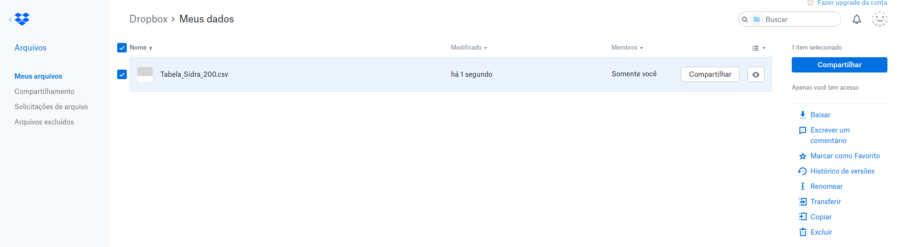
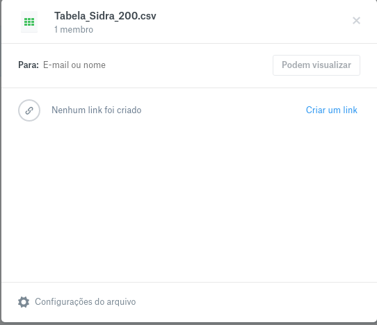
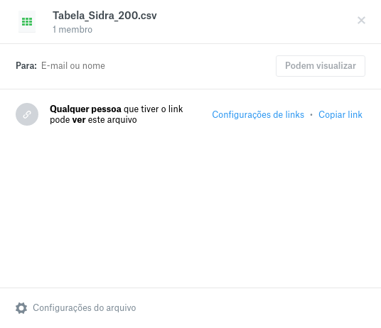
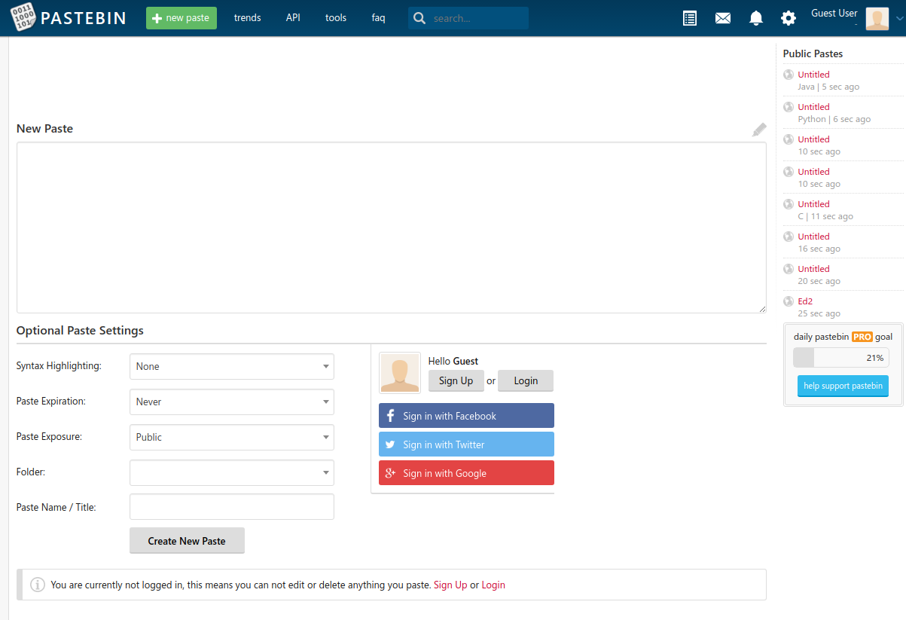
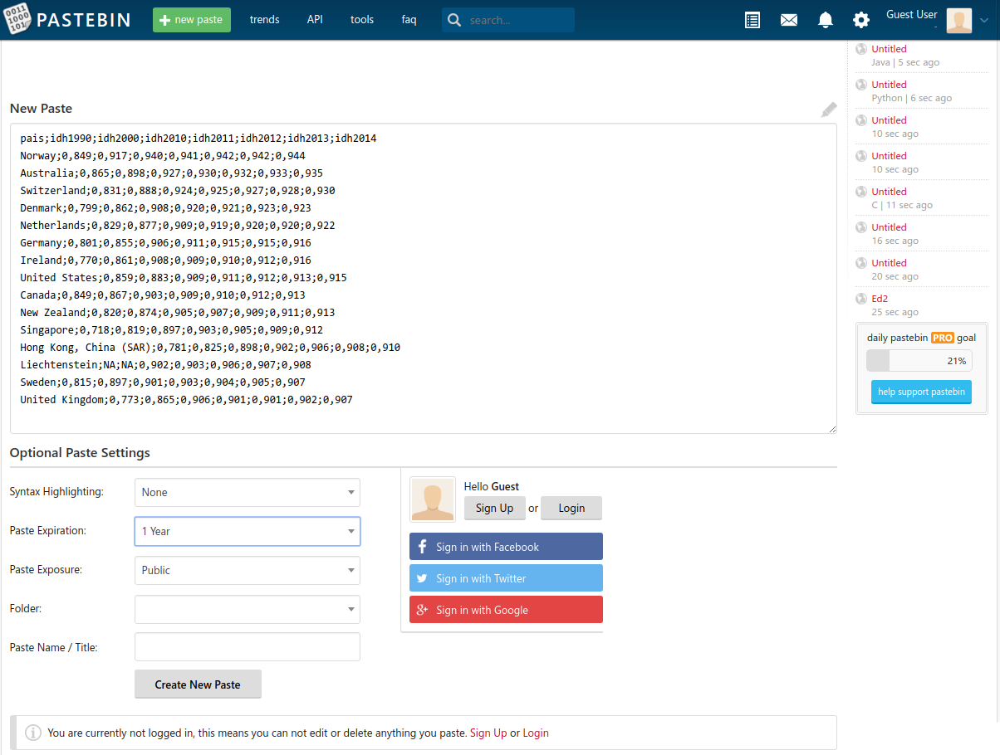
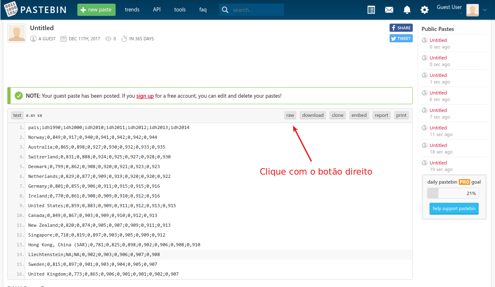

# Curso Introdução a datascience aplicada epidemiologia

### Intruções para o trabalho final

* ##### Prazo Final 25 de Fevereiro de 2018

* #####Trabalho individual ou em dupla 

* #####Formato Rmarkdown 

#### Conteudo :

Os seguintes itens devem constar do Trabalho final

* formato de relatorio com texto descrevendo os dados e procedimentos
* importação de dados externos (veja observações)
* preparação/limpeza dos dados usando o *tidyverse* 
* criação de novas variaveis 
* geração de pelo menos um grafico e uma tabela

O Arquivo no formato *.rmd* devera ser encaminhad por email para [meu email](oswaldo.cruz@fiocruz.br)  ate a data especificada. 

#### Observações: 

caso não saiba como colocar seu dados *online* aqui vao duas dicas:

##### 1. Dropbox

Faça o login na sua conta do [Dropbox](https://dropbox.com)  , escolha a pasta e o arquivo que deseja gerar o link

clique em compartilhar

clique em Criar um Link

agora clique em copiar o link e você vai ter algo assim que podera ser usado no **R**

https://www.dropbox.com/s/jh0tyxgs1pzyydu/Tabela_Sidra_200.csv?dl=0

como por exemplo

tabela <- read.csv2("https://www.dropbox.com/s/jh0tyxgs1pzyydu/Tabela_Sidra_200.csv?dl=0")

##### 2. Pastebin

o [Pastebin](https://pastebin.com/) é um serviço que permite colocar um arquivo *ASCII* e obter um link que pode ser usado

basta acessar a pagina 

usando um editor de texto (lembre-se nunca word, wordpad) selecione os dados em *ascii*, por exemplo um CSV, um TSV DAT etc... e cole 

por fim clique no botão **Create New Paste**

você tera agora essa saida, clique com o botão direito no pequeno botão **RAW**  e escolha a opção "Copiar o Link" ou apenas clique no botão e será levado a pagina com seus dados!

