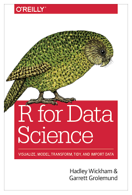
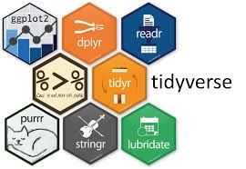

# 

#### Arrumando os dados

De agora em diante vamos usar como adotar como ferramenta de análise os pacotes do **tidyverse** , você provavelmente já deve ter usado alguma delas. 

Mas antes vamos falar do seu criador chamado  Hadley Wickham atualmente cientista chefe do  RStudio e professor adjunto de estatística da Universidade de  Auckland, na Nova Zelandia e
 mais recentemente das universidades de Stanford e Rice. Ele é um Cientista de Dados e é a mente responsável por vários pacotes do **R**, tanto pelo desenvolvimento quanto pelo aspecto conceitual desses pacotes. Um exemplo é o  ggplot. A preocupação dele ao criar esses pacotes foi tornar o **R** uma ferramenta mais poderosa e fácil de utilizar para Data Science. Esses pacotes lhe valeram um convite para se tornar uma peça chave no desenvolvimento e rumos do *RStudio*.
 

|     |     |
 | :--:	 | :--:	 | 

Ele é  autor do livro *R for data science* que pode ser encontrado na Amazon por cerca de US$ 25. No entanto, ele é um entusiasta não só de open source e de open science como também pratica o que prega e oferece seu livro gratuitamente no link http://r4ds.had.co.nz/  . O livro é muito bom e muito desse curso foi inspirado nele, 

#### o Tidyverse

Diversos pacotes integram o tidyverse , cada pacote foi criado independente e depois foram integrados na forma desse "metapacote". 

 
 
  |      |    | 
 | :--:	 | :--:	 | 

Alguns dos pacotes já são conhecidos por vocês como por exemplo o *ggplot2* e talvez alguns conheçam o *dplyr* o importante é dizer que tudo que esses pacotes fazem pode ser feito também ou pelo modulo base do **R** ou por algum outro pacote. 

Então qual a vantagem? Como dito anteriormente esse conjunto de pacotes guardam mais do que uma coerência, possuem um conceito que simplifica e torna mais objetiva a realização de tarefas de arrumar os dados (tidy , quer dizer arrumar , ajeitar). Nesses pacotes as funções que fazem as operações em geral são verbos que deixam clara as ações envolvidas. veja o exemplo abaixo:

		mtcars %>% select (mpg,cyl,hp,wt) %>% group_by(cyl) %>% summarise(hp_media=mean(hp),hp_min=min(hp),hp_max=max(hp),consumo_medio=mean(mpg)/3.7)
		

Em apenas uma linha estamos selecionando variáveis, agrupando por número de cilindros, e criado uma estatística sumária para a potência em HP e para o consume médio e transformando de galoes para litros(em 1974, aparentemente os carros bebiam muita gasolina!!!)
