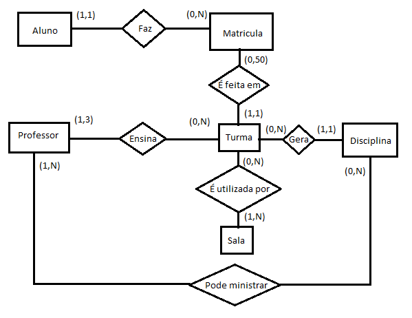

# Banco de Dados & SQL

### Introdução
* O conceito de banco de dados esta muito presente em nosso dia-a-dia e faz parte de nossa vida

* Banco de dados (BD) desempenha um papel crítico em muitas áreas onde computadores são utilizados 

* BD está presente em muitas áreas diferentes (negócios, engenharia, educação, medicina, etc.)

* Um arranjo aleatório de dados não pode ser considerado um banco de dados 
* uma planilha não pode ser considerada um BD

### Sistema Gerenciador de Banco de Dados 

Um Sistema Gerenciador de Banco de Dados (SGBD) é uma coleção de programas que habilitam usuários a criar e manter um banco de dados.

O SGBD é um software de propósito geral, que facilita o processo de definição, construção e manipulação de um bancos de dados.

<br>


###  Terminologia Básica


* Campo – unidade básica de informação mínima com significado ( Coluna)

* Registro - conjunto de campos (linha)

*  Atributo          - área que pode conter um tipo de dados. É a interseção de  uma  linha com uma coluna. 

* Tabela -conjunto de registros 

* Banco de Dados (BD)-conjunto de Tabelas e as formas de manipulação (relacionamentos)

* Modelo de Dados - Consiste de um conjunto de conceitos utilizados para descrever a estrutura de um BD, ou seja, os tipos de dados, relacionamentos e restrições sobre estes dados

* Modelo Relaciona - representa os dados em um BD, por meio de um conjunto de relações

* Chave Primária    - É a coluna que identifica com exclusividade  cada  linha   de um tabela
                              
* Chave Estrangeira - É uma coluna ou conjunto de colunas  referente  a  uma  chave 
  primária de uma outra tabela. A partir da  chave  estrangeira 
 podemos relacionar tabelas (join)

<br>

### Modelo de Dados

* Consiste de um conjunto de conceitos utilizados para descrever a estrutura de um BD, ou seja, os tipos de dados, relacionamentos e restrições sobre estes dados

* No Modelo Relacional representa-se os dados em um BD, por meio de um conjunto de relações. 

* existem varias tecnicase tipos de representações de modelagem  ( modelo externo, modelo ER,modelo conceitual)



# SQL - Structured Query Language

## 1  Introdução ao SQL


   SQL é a linguagem padrão para bancos de dados relacionais. Os principais Bancos de Dados Relacionais aceitam alguma forma  do   SQL. Abaixo, algumas terminologias em Banco de Dados
   
   SQL surgiu no início da década de 70, por uma iniciativa da IBM.  desde a decada de 1990 tornou-se a linguagem mais popular para acesso a bancos de dados, juntamente com a difusão de SGBDs relacionais
  
  exietem dois tipo basicos de linguagem: 
   
*   	Linguagem procedural: fornece uma descrição detalhada de **COMO** um tarefa é realizada, operando sobre um registro ou uma unidade de dados a cada vez.
*	Linguagem não procedural: é uma descrição de **O QUE**  se deseja, onde o sistema deverá determinar a forma de fazer.
 
 o SQL consiste em uma linguagem não procedural que permite a interface básica para comunicação com o banco de dados
 
	
Um SGBD realiza alguns processos que podem ser  efetuados por meio da linguagem SQL

* DEFINIÇÃO (DDL): criação do esquema (tabelas e relaconamentos)  que atenderá as necessidades no BD;

* MANIPULAÇÃO( DML): inclusão, deleção e modificação dos  dados no  BD;

* CONSULTA (DQL) : realização de consultas  no BD; 
 


		select nome from alunos ; 
	

	

### DEFINIÇÃO e MANIPULAÇÃO (DDL & DML)

Para iniciar a definição de um BD é necessário conhecer os tipos de dados que o BD manipula.  De uma maneira geral serão
 manipulados os tipos: 

	• números 	    	( -45  |  0  |  25.57 )
	• caracteres		(José Roberto   | abacaxi| rua das amendoeiras, 516)
	• datas e horas 	(dia, mês e ano | 23 / 12 / 01  | 2017-10-01 21:07:47 GMT0)
	• objetos binarios 	(imagem, musica, arquivo executavel) 
	
	obs: o dado faltante é chamado NULL
	

A sintaxe que identifica estes tipos dependentes do BD, em geral:

```SQL
		integer, float, double – numéricos
		character, char(n),varchar(n)  – caracteres variáveis até 4000
		date  – de 1/1/4712 A.C. até 31/12/9999 D.C.
		blob - objetos binarios até ~ 4Gb
```		
		
#### criando uma tabela
Para criar uma tabela será usada a declaração SQL (DDL) criando a tabela. de uma maneira geral

	create table <nome_tabela>   (
	   campo_1  <tipo de dado>,        -- atributo do campo
	   campo_2  <tipo de dado>,
	   campo_3 <tipo de dados> ) ;
	

	 O ponto e vírgula encerra uma instrução deixando-a pronta para ser executada <ENTER>.		


#### Exemplo
Como seria a criação de uma tabela  que armazenaria os nomes e siglas de todas a UF


		
		CREATE TABLE estados
		(
		   uf integer, 
		   sigla char(2), 
		   regiao char(2),
		   nome varchar(50) 
		) 
		

		
#### Inserindo dados (populando a tabela)

Instrução INSERT - Esta instrução é usada para inserir dados na tabela.

	INSERT INTO <tabela>[(coluna_1,...,coluna_n)] VALUES (valor_1,...,valor_n);

Exemplo:


	
		INSERT INTO estados(uf, sigla, regiao,nome) VALUES (33, 'RJ', 'SE','Rio de Janeiro');
		INSERT INTO estados VALUES (31, 'MG', 'SE','Minas Gerais');
		INSERT INTO estados(sigla, nome,uf,regiao) VALUES ('SP', 'São Paulo', 35,'SE');
		INSERT INTO estados( nome,regiao,uf,sigla) VALUES ('Espirito Santo', 'SE',32,'ES');
		INSERT INTO estador(sigla,'regiao',nome) VALUES('GO', 'CO','Goiás'); -- faltou UF que vai assumir valor NULL
		
#### Apagando os Dados
Instrução DELETE - Esta instrução é usada para remover uma ou registros da tabela, possuindo duas formas básicas: 
	
		DELETE  FROM  <tabela>;		
				ou
		DELETE  FROM  <tabela>  WHERE  <condição>;
	
	A primeira forma é obrigatória e apaga todos os dados da tabela, enquanto que a segunda possui uma parte opcional, a partir do WHERE, que apaga somente os dados da tabela que atendem a uma condição (ou condições) imposta pela cláusula WHERE.
	
Exemplo:

	DELETE FROM ESTADOS WHERE SIGLA = 'SP'; -- 1 linha deletada
	
	DELETE FROM ESTADOS WHERE NOME = 'ACRE';  -- nenhuma linha encontrada
		
	DELETE FROM ESTADOS; -- todas as  linhas deletadas  ATENÇÃO. 
	
#### Remover uma Tabela

Para se remover uma tabela deve-se usar o comando DROP TABLE.

	DROP TABLE <nome_da_tabela>;

Por meio deste comando a tabela deixará de existir neste banco de dados, sendo todas as informações contidas nela vão ser  ** TOTALMENTE apagadas (Não tem UNDO) **.

Exemplo:
	
		DROP TABLE ESTADOS; -- Tabela eliminada
	
### CONSULTA (DQL)

Instrução SELECT

Esta instrução é a essência do linguagem SQL. É por meio dela que se recupera dados de um banco de dados. De modo simples, forma declarativa, está se dizendo ao BD quais informações foram selecionadas para serem recuperadas.

Pode-se dividir esta instrução em quatro partes básicas:

	• select 	– seguido dos atributos que se deseja ver (obrigatório)
	• from 		– seguido de onde se obterão os dados (obrigatório)
	• where 	– seguido das restrições de recuperação (opcional)
	• order by 	– seguido da forma como os dados serão classificados (opcional) 
	• group by 	– Agrega os dados  (opcional) 

O símbolo asterisco ( * ) significa que todos atributos da relação informada deverão ser recuperados.

Exemplo:

	SELECT * from ESTADO;
	
	SELECT * FROM estado WHERE SIGLA='GO' OR NOME='Acre' ; 
	

	
o **SELECT** será a instrução mais comumente usada na linguagem SQL. repare que o **SQL** não é case sensitive como a maioria das linguagens! 
	
Na cláusula **WHERE**  serão utilizados alguns operadores de comparação e lógicos para que a condição seja especificada. Os operadores logicos usados em SQL são:

 

#### criando novas tabelas a partir de tabelas existentes

É muito simples a criação de novas tabelas bastausar o CREATE TABLE usando o resultado de um SELECT.

	CREATE TABLE sudeste AS (SELECT * FROM estados WHERE regiao = 'SE')  ;


### JOINS (Relacionando as Tabelas)

Existem diversas maneiras de se fazer o relacionamento entre duas tabelas.
os mais comuns são:

1. INNER JOIN
Este é simples e comumente empregado. Esta query retornará todos os registros da tabela A (esquerda) que têm correspondência com a tabela B (direita). Ou seja o que existe de comun entre A e B.  Podemos escrever este JOIN da seguinte forma:

		SELECT *
		FROM A
		INNER JOIN B
		ON A.chave = B.chave

2. LEFT JOIN
Esta consulta retorna todos os registros da tabela A (esquerda)  e o que existir em comun com a tabela B (direita) O código ficará da seguinte forma:

		SELECT *
		FROM A
		LEFT JOIN B
		ON A.chave = B.chave


3. OUTER JOIN
Este relacionamento é conhecido tambem como FULL OUTER JOIN ou FULL JOIN. Esta consulta retornará todos os registros das duas tabelas e juntando também os registros correspondentes entres as duas tabelas. O que for diferente nas duas tabelas ficara com o valor NULL. O código ficará da seguinte forma:

		SELECT *
		FROM A
		FULL OUTER JOIN B 
		ON A.chave = B.chave
		


[Fonte da figura](https://www.codeproject.com/Articles/33052/Visual-Representation-of-SQL-Joins)

### Funções

Seguem algmas funções comumente usadas em SQL, lembre-se que cada versão e SGDB usa dialetos diferentes. 

Funções  simples (mais comumente usadas): 
	
	ABS(n)= Devolve o valor absoluto de (n). 
	CEIL(n)= Obtém o valor inteiro imediatamente superior ou igual a "n". 
	FLOOT(n) = Devolve o valor inteiro imediatamente inferior ou igual a "n". 
	MOD (m, n)= Devolve o resto resultante de dividir "m" entre "n". 
	POWER (m, exponente)= Calcula a potência de um número. 
	ROUND (numero [, m])= Arredonda números com o número de dígitos de precisão indicados. 
	SIGN (valor)= Indica o signal do "valor". 
	SQRT(n)= Devolve a raiz quadrada de "n". 
	TRUNC (numero, [m])= Trunca números para que tenham uma certa quantidade de dígitos de precisão. 
	
	 
Funções Agregadas :

	
	COUNT ( * | Expressão)= Conta o número  de ocorencias (A opção "*" conta todos os registros selecionados). 
	AVG (n)= Calcula o valor médio de "n" ignorando os valores nulos. 
	MAX (expressão)= Calcula o máximo. 
	MIN (expressão)= Calcula o mínimo. 
	SUM (expressão)= Obtém a soma dos valores da expressão. (se houver NULL retorna NULL)
	TOTAL(expressão) = soma ignorando NULL
	
Funções de caracteres: 


	CONCAT (str1, str2)= Devolve "str1" concatenada com "str2". 
	LOWER (str)= Devolve a string  em minúsculas. 
	UPPER (str)= Devolve a string em maiúsculas. 
	SUBSTR (str, m [,n])= Obtém parte de uma string. 
	LENGTH (str)= Devolve o número de caracteres de str. 
	REPLACE (str, cadeia_busca [, cadeia_substitucao])= Substitui um caractere ou caracteres de uma cadeia com 0 ou mais caracteres. 

	
	
funções de datas:

	DATE() - retorna a data ou tranforma em data
	TIME() - retorna tempo
	STRFTIME(fmt,data) - formata a data no formato 
	
	
Exemplos:

	SELECT count(*) from Estados;
	SELECT date() ; 
	SELECT round(355.0 / 113.0,6) ;  -- que numero é esse? teste sem o .0


## 2 Pratica!

Nas praticas de hoje utilizaremos o [SQLITE](https://www.sqlite.org/about.html) que vem a ser uma pequena biblioteca, open source, autocontida, sem necessidade de usar um **servidor** e nem é necessária nenhuma configuração adicional. 

Faremos o download de um programa gráfico (GUI)  para que possamos interagir com o Sqlite mais facilmente. Nosso laboratório da ENSP  não permite a instalação usaremos a versão *portavel* , isto é, que se instala no próprio ambiente do usuário. 


			
[Clique aqui para baixar o SQLITEBrowser (windows 32b)](https://github.com/sqlitebrowser/sqlitebrowser/releases/download/v3.10.1/SQLiteDatabaseBrowserPortable_3.10.1_English.paf.exe)

instale a versão acima e após a instalação inicie o programa. uma tela semelhante devera aparecer

 


Clique em **Novo Banco de Dados** 

siga o link para o  primeiro exemplo chamdo [estudo.sql](estudo.sql)

selecione no texto a  parte de criação da tabela  pacientes, em seguida entre na ABA **Executar SQL**  e cole o texto. para executar use **F5** ou **control+Enter** ou ainda usa o icone **>** 


vá agora até a ABA **Esrutura do banco de dados** e veja o que foi criado.

volte a seu navegador e copie o trecho refente aos dados dos pacientes e novamente cole na janela **Executar SQL** e execute.

vá agora até a ABA **Navegar Dados** e verifique seu dados
use o exemplo crie mais um ou dois registros com os numeros de ID 105 e 106

crie agora a tabela **estudo** repetindo os passos anteriores!

#### Exercicios 
 vamos testar agora alguns comandos
 
	SELECT * FROM paciente where sexo = 'F' ;
	 
	SELECT avg(Peso) from paciente ;
	
	SELECT sexo, avg(Peso) from paciente group by sexo; 
	
	SELECT COUNT(*) from estudo ;
	
	SELECT *,  round(Peso/(Altura*altura),4)  as IMC from paciente ;
	
Use a tabela **estudo** e calcule o peso medio de cada paciente

apagando os registros que você adicionou :

	DELETE FROM paciente WHERE ID=105 

delete agora do outro paciente usando o NOME e o SNOME

#### relacionando as tabelas

	select  *  from paciente left join estudo on  paciente.id = estudo.id  ; 
	
crie o IMC usando o Peso no relacionamente entre as tabelas. Fique atento ao fato de existirem duas colunas Peso !

#### Mortalidade um exemplo

vamos baixar [AQUI](dorj2004.db) a base de mortalida do RJ em 2004 já no formato do sqlite 

faço o dowload de cerca de 17Mb , abra o arquivo no sqlitebrowser 


tente:

1. qual a esrutura da tabela? 
1. quantos registros tem na tabela?
2. quantos registros por municipio de residencia (codmunres) ? (vai precisar group by)
3. quantos são residentes de outra UF ?

baixe a tabela de bairros do Rio de Janeiro e cid10  [AQUI](tabelas_aux.zip), crie as tabelas em seguida
 
 1. Selecione o municipio do Rio e relacione a tabela com os nomes de bairros. gere uma contagem por bairro  e sexo. (codbairro) 
 2. selecione os casos de AVC na causa basica I60 a I69 ou  como causa associada (linhas) e crie uma nova tabela.
 
 

 


