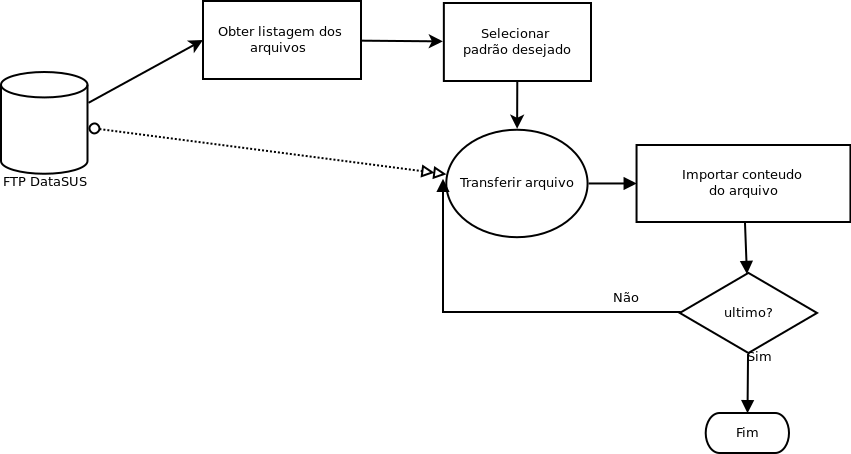
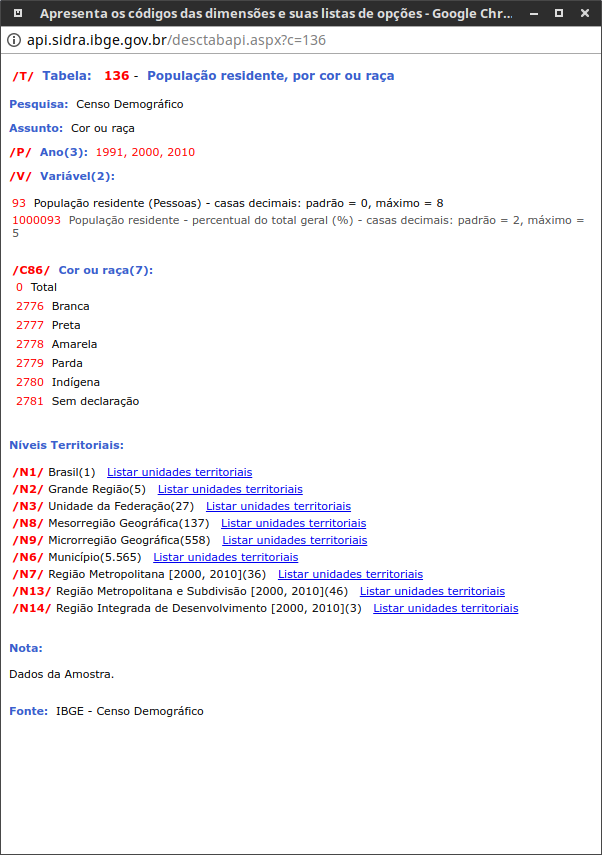

## Importando dados

A atividade de obtenção de dados é uma das mais importantes e necessitarias para se trabalhar em data science.  

Podemos ver no diagrama abaixo  (adaptado de Wickham & Grolemund, 2017), as principais etapas que veremos nesse curso e como tudo começa com a Importação  dos dados.


#### Existem diversas maneiras de importar o dados em R

as principais maneiras são:

* Imortando de arquivos locais
* Importação via WEB
* Aceso a banco de Dados

vamos olhar cada uma delas

#### 1 Importando de arquivos locais

Essa é a maneira que todos estão mais acostumados , em geral se importa um arquivo texto do tipo **CSV** ou ainda **TXT** com algum tipo de delimitador, que pode ser espaço, ou qualquer outro.

em geral se utiliza a função **read.table** ou alguma de suas variantes como **read.csv** ou **read.csv2**

alguns exemplos:


```R
dados <- read.csv2("planilha.csv")  
```

```R
dados2  <- read.table ("arquivo.txt",header=F,sep=";")
```

​
Também algumas vezes podemos importar algum formato oriundo de outro software, como o SPSS,STATA,SAS, ou até mesmo o extinto formato DBF.  no **R** é necessário chamar a library **foreign**


```R
library(foreign)
dados <- read.spss("dados.sav")
dados2 <- read.dbf("datasus.dbf")
```

Além desses formatos mais usuais existem vários outros formatos que podem ser lidos, entre eles destacam-se o **XML** ,  **JSON** e o **NetCDF**  

Clique [AQUI](xml_e_json.md) para aprender mais sobre **XML** e **JSON**


#### 2 Importando via WEB

Uma das facilidades do **R** que é pouco explorada é a possibilidade de ler arquivo atravez da internet. Algumas das funções podem ser acessadas diretamente e referenciar um link remoto (**URL**).

Veja o exemplo abaixo:


```R
indicadores <- read.csv2("http://www.campinas.sp.gov.br/arquivos/financas/ra_indicadores_2015.csv")
```

o **R** simplesmente vai acessar e importar o dado atravez da **URL**

Veja o exemplo abaixo, repare que apesar da AVISA dizer que é
um arquivo do tipo **CSV**, na verdade , trata-se de um arquivo **TEXTO** delimitado pelo caractere **|**


```R
 anvisa <- read.table("https://dados.anvisa.gov.br/dados/TA_PRECOS_MEDICAMENTOS.csv",sep = '|',header=T)
```

Podemo também pedir ao **R** que faça o download de um arquivo por exemplo

```R
download.file("ftp://ftp.datasus.gov.br/territorio/tabelas/base_territorial.zip","base_terr.zip")
```

Vamos agora "abrir" o arquivo **ZIP**  em primeiro lugar vamos descobrir qual local o sistema operacional esta usando como temporário.
​
```R
loc <- tempdir()
loc
```

Em seguida vamos mandar extrair o conteúdo do **ZIP** nesse diretório temporário e usar o dir desse local para verificar se o conteúdo foi expandido.


```R
unzip("base_terr.zip",exdir=loc)
dir(loc)
```

a partir dai você poderia importar um ou mais dos arquivos que foram expandidos.


```R
arq <- paste0(loc,"/","tb_uf.csv")
tb_uf <- read.csv2(arq)
```

#### 2.1 Importando o SINASC diretamente do DATASUS

até aqui você já viu todos os elementos necessários para fazer a importação de dados direto do FTP do DATASUS, o que precisamos é um workflow, ou seja, um plano, para fazer a importação.

<br>



em primeiro lugar vamos usar o pacote RCurl que permite acesso a paginas http , https, ftp etc...


```R
library(RCurl)
url <- 'ftp://ftp.datasus.gov.br/dissemin/publicos/SINASC/NOV/DNRES/'
lista <- getURL(url)
```


vamos inspecionar o objeto *lista*. como vocês podem observar esse arquivo precisa ainda ser transformado para ser usado.

```R
lista <- strsplit(lista,'\n')
```

após pedirmos ao **R** para inserir uma quebra apos o caractere '**\n**' agora fica mais fácil de entender a listagem que obtivemos!

vamos selecionar como **UF** o Acre pois o tamanho dos arquivos é pequeno e a rede da ENSP em geral não é rápida.

Aqui vamos fazer um parêntesis para falar de um recurso extremamente poderoso, as [**expressões regulares**](regex.md) conhecidas por  [**REGEX**](regex.md)

Agora que vocês já aprenderam um pouco sobre as REGEX vamos selecionar as linhas que possuem as DN do ACRE

```R
	l2 <- grep ('DNAC',lista[[1]],value = T) ## DN do ACRE
```
de uma maneira simples selecionamos todas que possuem o padrão DNAC no nome. Veja a variável "l2" , ainda existem varias colunas, e só queremos o nome do arquivo!


Uma abordagem simples seria simplesmente:

```R
	l3 <- substr(l2,40,52)
```

mas suponhas que a posição não fosse sempre a mesma, seria possível fazer com REGEX? Veja só:

```R
	l3 <- gsub('.*(DNAC[1-2][0-9]{3})','\\1',lista[[1]][grepl("DNAC",lista[[1]])])
```

Verifique o objeto l3 para se certificar que tenhamos somente um vetor de caracteres com o nome dos arquivos!
​
Aqui temos 20 nomes de arquivos , em virtude da falta de velocidade da internet na ENSP vamos trazer somente os 3 primeiros anos!

Como fazer isso?

Vamos precisar de um pacote chamado [**read.dbc**](https://github.com/danicat/read.dbc) recentemente colocado no CRAN. Foi desenvolvido por uma engenheira de software da globo.com chamada  Daniela Petruzalek.

```R
	install.packages('read.dbc')
```

Agora vamos precisar criar um local para armazenar os arquivos. O mais simples nesse caso é criar uma **lista**. Vamos chamá-la a lista de  sinasc!

```R
	sinasc <- list()
```

em seguida precisamos fazes um **loop** (laço)  no **R** para fazer o download e ler cada um dos arquivos , armazenando os resultados e em seguida removendo o arquivo temporário!

```R
for (i in 1:3) {
	loc <- paste0(url,l3[i])
	download.file(loc,"temp.dbc",mode="wb")
	sinasc[[i]] <- read.dbc("temp.dbc",as.is=T)
	file.remove("temp.dbc")
}
```


Se tudo correr bem você vera os arquivos sendo baixados!

vamos inspecionar o primeiro data.frame (repare o tipo de cada variável)

```R
	str(sinasc[[1]])
```


Vamos pegar o ano para nomear nossa lista!

```R
	anos <- substr(l3,5,8)
	## OU
	anos <- gsub('.*([0-9]{4})\\.[A-Z,a-z]{3}','\\1',l3)

	names(sinasc) <- anos[1:3]
```

Agora que demos um nome a nossa lista vamos ver o comportamento do PESO usando um **summary** para cada ano.


```R
	lapply(sinan, function(x) {summary(as.numeric(x$PESO))})
```


Convertendo para um unico DF

```R
	todos <- do.call(rbind,sinasc)
	todos$ANO <- substr(todos$DTNASC,5,8)
```

Vamos verificar o número de nascidos por ano!

```R
	table(todos$ANO)R
```

Baixe [AQUI](le_sinasc.r) o arquivo final em **R**
<br>

**OBS** : a partir de  1999 a estrutura de dados muda, seria necessário compatibilizar para poder unir os arquivos.

#### 2.2 Acessando o feed de notícias RSS do Ministério da Saúde

Vamos acessar o RSS que é o serviço de notícias do MS. O formato dos dados está em XML.

```R
library(XML)
ms <- "http://portalsaude.saude.gov.br/index.php/cidadao/principal/agencia-saude?format=feed&type=rss"
```

```R
doc <- xmlTreeParse(ms)
xmlRoot(doc)

src <- xpathApply(xmlRoot(doc), "//item")
src
```


Podemos obter dados de uma única notícia
​
```R
	um <- xmlSApply(src[[1]], xmlValue)
	um[[1]]
	um[[6]]
```
ou de um conjunto de notícias

```R
tit <- xpathApply(xmlRoot(doc), "//title")
```

e finalmente podemos como no exemplo anterior fazer um **LOOP** e transformar todas as notícias  em um único data.frame


	    NOTICIA <- NULL
	    for (i in 1:length(src)) {
	        foo <- xmlSApply(src[[i]], xmlValue)
	        tmp <- data.frame(t(foo), stringsAsFactors=FALSE)
	        NOTICIA <-rbind(NOTICIA, tmp)
	    }


e vamos verificar o conteudo  final do dataframe

		NOTICIA


#### 2.3 Extraindo conteúdo de uma tabela em HTML publicada na Internet

Vamos extrair uma tabela que está dentro de uma pagina no MS , a pagina contem dados sobre [casos de microcefalia em abril de 2016](http://www.brasil.gov.br/saude/2016/04/brasil-tem-1-168-casos-de-microcefalia-confirmados)

Supondo que você necessita desses dados é possível extrair os dados por estado dessa página?


	library(XML)

	url <- 'http://www.brasil.gov.br/saude/2016/04/brasil-tem-1-168-casos-de-microcefalia-confirmados'

	micro <-  readHTMLTable(url)  # Le a tabela, a função retorna uma lista!

	micro <- micro[[1]][-c(1,2),]  # remove as linhas adicionais no Início

	names(micro) <- c('Local','Investgados','Confirmados','Descartados','Total') # da nomes as colunas importadas


Inspecionando agora nosso DF *micro* vemos que exitem ainda linhas para as regiões do país e um total geral. Como estamos apenas interessados na informação por UF precisamos remover essas linhas.

	micro.uf <- micro[!grepl('Região|Brasil',micro$Local),]

Agora nosso objeto tem apenas as linhas relativas as UFs, no  entanto use a função **str** em nosso objeto. Todas as linhas são do tipo *character* , vamos precisar transformá-las. no entanto não será uma tafera simples,  repare que varias colunas têm o **'.'** indicando mil e que *São Paulo* tem um caractere especial **'ª'**. para acertar usaremos uma vez mais as **REGEX**  para remove tudo que não forem números das colunas que queremos transformar.

	m1 <- apply(micro.uf[,2:5], 2, function(x) {gsub('[^0-9]','',x)})

agora o objeto **m1** está pronto para ser convertido em tipo *numerico*.

	m2 <- as.data.frame(apply(m1, 2, as.numeric))

agora temos o objeto **m2** todo numerico, no entanto falta o o nome das UF

aqui podemos fazer diferentes escolhas.

1. colocar as UFs nome como nome da linha usando  **rowname**

		rownames(m2) <- micro.uf$Local

2. concatenar o nome das UFs como primeira coluna

		m3 <- cbind(micro.uf$Local,m2)

3. criar um nova coluna e ordenar

		m2$Local <- micro.uf$Local
		m2 <- m2[,c(5,1:4)]

Como se pode ver acima foi bem "fácil" ler a tabela usando **readHTMLTable** no entanto colocar o dado pronto para ser trabalhado exige vários passos adicionais.


#### 2.4 Usando uma API para acessar Dados


O que é um API?

Application programming interface (API) é um Conjunto de sub-rotinas , protocolos e ferramentas para desenvolver aplicação (software). Em termos gerais é um conjunto de métodos de comunicação entre diversos software e ate mesmo do software com o hardware. Tem sido usado extensivamente no desenvolvimento de software.

O que abordaremos aqui neste curso é o uso de **APIs** via Web ,  conhecidos por *Web Services* ou *Web API*.  Como podemos notar no gráfico abaixo, seu uso tem crescido enormemente com a ideia de repositórios de dados, e a importância dado por governos e instituições a política de dados abertos.


#### 2.4.1 a API do SIDRA/IBGE

O Sistema IBGE de Recuperação Automática - [SIDRA](https://sidra.ibge.gov.br/)  , está com seu conteúdo disponível via **API**.

a **API** do Sidra pode ser acessada em http://api.sidra.gov.br .


cada **API** tem um conjunto de formatos e regras para acessar os dados. No caso do SIDRA cada tabela possui um conjunto de atributos que podem ser acessados. Vamos por exemplo ver a tabela **136**




Como podemos ver essa tabela está disponível para os censos de 1991,200 e 2010 , temos o total de população residente e o percentual e diversos níveis territoriais para escolher.

Como faríamos para buscar a população por todas as raças/cores para o censo de 2010 por microrregiões?

Nossa linha seria:

		/t/136/p/2010/v/93/c86/all/n9/all

Para obter no  **R** esses dados vamos adicionar a linha acima a URL de chamada da **API Sidra**


		library(RCurl)
		library(jsonlite)

		q <- "http://api.sidra.ibge.gov.br/values/t/136/p/2010/v/93/c86/all/n9/all"
		resp <- fromJSON(q,simplifyDataFrame = TRUE)


Como pode ser visto o resultado foi um arquivo no formato **JSON**  , como no exemplo das tabelas em HTML o dado veio com uma linha extra onde existe uma descrissão do campo. vomos remover essa linha.

		dic <- resp[1,]      #dicionario da tabela
		resp2 <- resp[-1,]   #removendo a linha um duplicada!!!
		head(resp2)


  como podemos ver a tabela agora parece correta, vamos ver a frequência da variável raça/cor

		table(resp2$D3N)

 se quisermos criar uma variável com o código UF, podemos extrair da variável com o nome da Microrregião.

		resp2$uf <- gsub('.*([A-Z]{2})$','\\1',resp2$D4N)

uma ultima questão permanece é que todos os campos são caracteres, mas você só vai precisar do Valor V em numérico.

		str(resp2)


#### 3 Acesso a Base de Dados

Para acessar um **SGBD** no **R**  é necessário instalar alguns pacote que permita a interação entre o BD pretendido e o **R**.

Existem também maneira de usar o próprio Sistema Operacional, através do **ODBC** (acrônimo para Open Database Connectivity) é um padrão para acesso a sistemas gerenciadores de bancos de dados (SGBD). Este padrão define um conjunto de interfaces que permitem o uso de linguagens de programação, no caso o **R**, mas também necessita a instalação de "drivers".

Vamos usar aqui o pacote **RSQLite** para demonstrar as funcionalidades da conexão via  **SQL** .

```R
	install.packages("RSQLite")
```

Após a instalação, vamos chamar e conectar a uma base SQLite chamada meuBD.sqlite ,caso ela não exista será criada!

		library(RSQLite)

```R
	canal <- dbConnect(RSQLite::SQLite(), "meuBD.sqlite")
```

 O comando a seguir lista todas as tabelas existentes no BD

		dbListTables(canal)

Como o BD foi criado agora, não existem tabelas. Vamos escrever nele nossa tabela do SINAN que baixamos do DataSUS

```R
	dbWriteTable(canal,"SINASC",todos)
```

Agora vamos novamente verificar as tabelas existentes!

```R
	dbListTables(canal)
```

Em seguida vamos fazer um query na tabela

```R
	dbGetQuery(canal, "SELECT ANO,COUNT(*) AS TOTAL FROM SINASC GROUP BY ANO")
```

Que tal agora um query mais complexo!

```R
q <- "SELECT ANO,
		SUM(CASE WHEN SEXO = 1 THEN 1 END) as MASCULINO,
		SUM(CASE WHEN SEXO = 2 THEN 1 END) as FEMININO,
		SUM(CASE WHEN SEXO = 1 THEN 1.0 END) / SUM(CASE 	WHEN SEXO = 2 THEN 1.0 END) as RAZAO
        FROM SINASC
        GROUP BY ANO"
dbGetQuery(canal,q)
```


vamos criar uma serie temporal.

```R
	q2 <- "select ano, substr(DTNASC,3,2) as mes ,count(*) as casos
	from sinasc
	group by ano,mes
	order by ano,mes"

serie <- dbGetQuery(canal,q2)
boxplot(serie$casos ~ serie$mes)
nasc.ts <- ts(serie$casos,start=c(1996,1),freq=12)
plot(nasc.ts)
```


e por fim, vamos desconectar da base!

```
	dbDisconnect(canal)
```
​
#### 4 Armazenado os dados

Como vimos nessa aula o processo de importar pode ser trabalhoso e para evitar a necessidade de se executar repetidamente todo o processo se faz necessário armazenarmos os resultados obtidos em algum formato que seja fácil de recuperar e seguro.

 Algumas opções são:

* Armazenar no próprio **R**

* Armazenar em algum SGDB (SQL ou NoSQL)

* Exportar para formatos texto tais como CSV, TXT


Vamos discutir as vantagens e desvantagens de cada um dos métodos e como melhor utilizar essas estratégias. Começaremos pela pior opção, que e a escolha mais comum de grande parte dos alunos , isso quando, não executam repetidamente o mesmo script de importação!

Você fez a transferência de um conjunto de arquivos , vamos supor do DATASUS, fez uma serie de procedimentos para transformar esse dado e por fim “Exporta” para um formato TEXTO ? Precisamos entender que formatos texto ainda que bons como formato para a  “transferência” de dados são uma péssima escolha para armazenar de forma eficiente e segura nossos dados.

Já vi algumas vezes alunos que ao final do dia de trabalho “exportavam” novamente de onde tinham trazido o dados, por exemplo do SPSS ou do STATA. O que os faz supor que estão mais seguros nesse formato? É uma boa ideia ficar importado/exportando o dados?

Assim recomendo fortemente que ou você armazene seu dados no formato nativo do **R** ou gere um Banco de Dados e passe a consumir os dados a partir dele.

Quanto a com manter os dados em **R** vejo que existe uma dificuldade no entendimento de como o **R** armazena e carrega seus dados. Vamos tentar esclarecer aqui esses conceitos de maneira que todos possam entender e usar melhor esses recursos.

Como todos sabe, o **R**  trabalha com os objetos em memoria, e quando saimos do **R** ou do **Rstudio** ele pergunta se desejamos salvar os dados, ou seja, todos os objetos em memoria. 
na verdade o seguinte função é executada.

      save.image()

todos os objetos são salvos com o nome **".RData"**  apesar desses nome  ser perfeitamente legal no Linux e  MAC o Windows tem certos problemas em lidar com ele.  Nos sistemas derivados do *UNIX* arquivos começados em ponto são invisíveis.

		save.image(file='trabalho_16_out_2017')

Nos comandos acima todo o conteúdo de nosso espaço de trabalho serão salvos. Na forma *.RData* ou com o nome atribuído. 

E se quisermos salvar apenas um objeto? em geral quando trabalhamos no **R** produzimos varios arquivos intermediários que em geral não são necessários.  Lembando que a função *ls* ou a menos conhecida *objects* listam todos os objetos no seu espaço de trabalho.


		save(dados,'backup.Rdata')
		
O comando acima salva somente o objeto de nome *dados* e seu conteúdo ficara armazenado no arquivo de nome '*backup.Rdata*' .

Caso queira salvar mais de um arquivo basta separa o nome deles com vírgulas

		save(obj1,obj2,obj3,file='backup.Rdata')

Para carregar novamente os dados, por exemplo, no dia seguinte use a função **load**

		load('backup.Rdata')
		
As vantagens do formato nativo do **R** são:

 * o arquivo é pequeno pois o **.RData** é compactado 
 * a carga do objeto é muito rápida quando se comparada a importação 
 * não ha necessidade de se passar por todo o processo de importar o dado.
 * ajuda a torna o processo de análise reprodutível 
 
 
  Para dados pequenos ou médios não há grandes problemas , mas quando trabalhamos com bases maiores pode ser vantajoso  armazenar no **sgdb**. Imagine que você tem um banco que ocupa 2Gbytes de RAM ao ser carregado no **R** e onde vários procedimentos de gerenciamento do dado serão realizados , muito desses procedimentos necessitam muitas vezes alocar a mesma quantidade de memória que o banco ocupa. Assim, nesse exemplo digamos que você possui uma máquina com 8 Gbytes de RAM, parece muito, mas  ao usar um objeto de 2 Gb, limpando, criando subsets você rapidamente verá que sua máquina fica lenta, pois não se esqueça que além do **R** o sistema operacional, e demais softwares abertos também consumem muita memória (especialmente se você usa windows) 
  
  vamos supor que você tem um banco grande, que está no **R** e foi importado e já está pronto para ser analisado. no entanto você opta por armazenar no *SQLITE*  como já foi visto no item 3. seu objeto se chama *bigbanco*  e você quer criar a tabela *big* na base de dados *base*
  
		library(RSQLite)
		conecta <- dbConnect(RSQLite::SQLite(), "base.sqlite")
		dbWriteTable(conecta,"big",bigbanco)
		dbListTables(canecta)
  
  
  no dia seguinte basta ler o banco, e quem sabe fazer um subset para escolher as "causas"
  
  

		library(RSQLite)
		con <- dbConnect(RSQLite::SQLite(), "base.sqlite")
		dados <- dbGetQuery(con,"SELECT * FROM big WHERE dt_evento BETWEEN "2008-01-01" AND "2016-12-31";
		
		
#### Exercícios propostos


1. a URL abaixo possui dados de todas as UBS em funcionamento. baixe os dados que sa um CSV separados por ';' e conte o numero de UBS por UF

		'http://sage.saude.gov.br/paineis/ubsFuncionamento/lista.php?output=csv&'
		
2. Transforme os campos lat e long em numerico

3.  Salve em formato *.Rdata* 

4. Mude o final da URL de output=csv&  para output=json& e leia novamente o dado, notou alguma diferença? 


		

	
