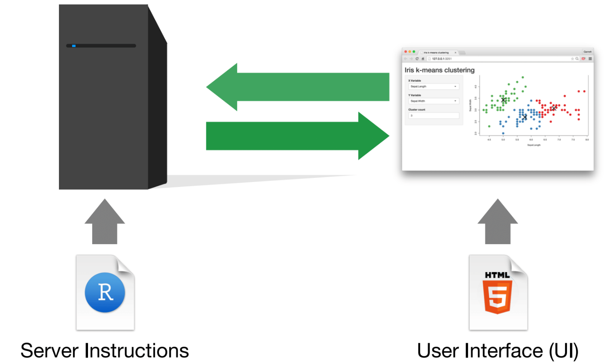
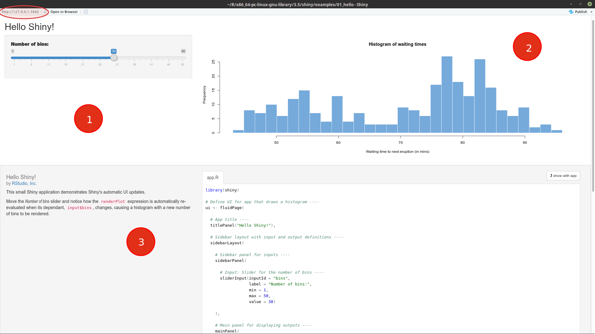
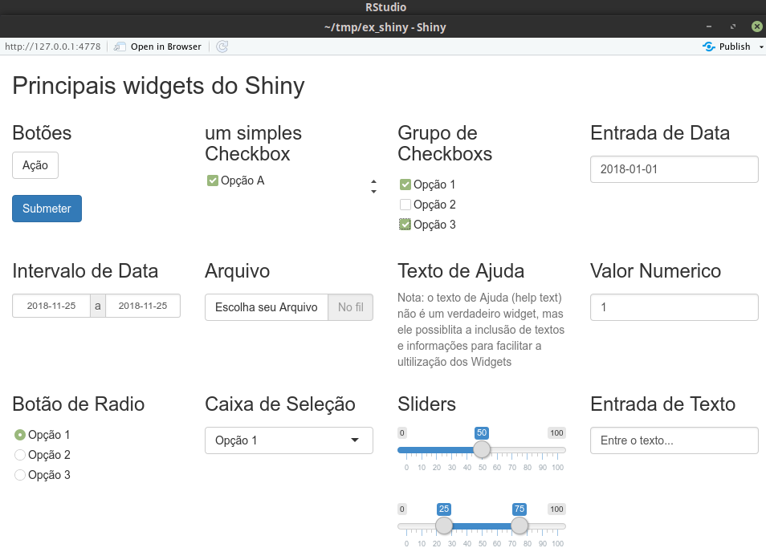
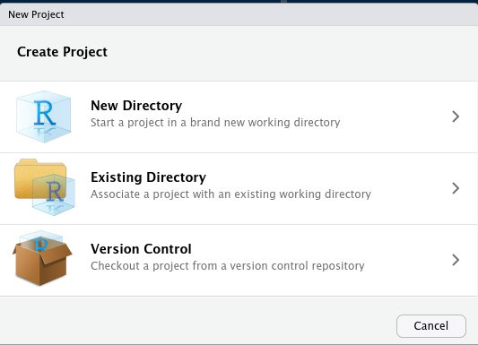
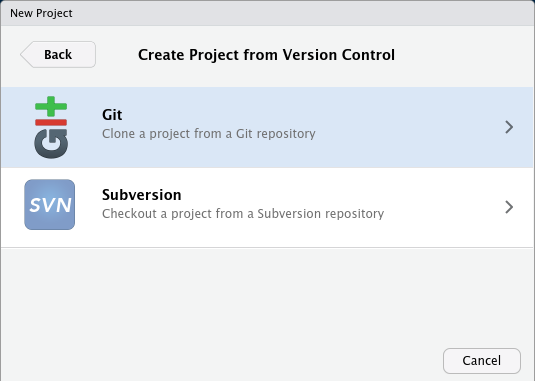
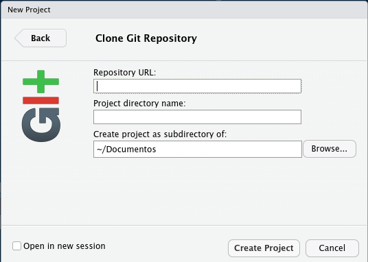
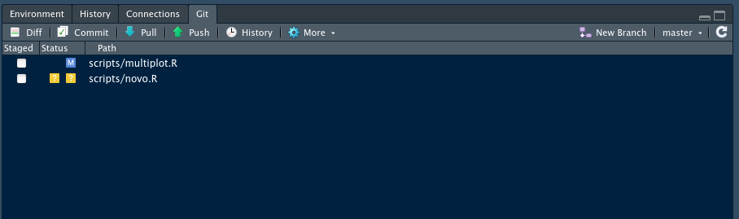
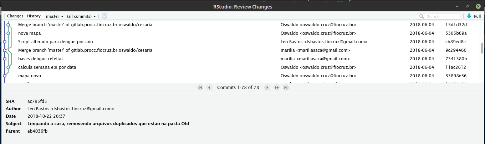

## 1. Shiny 

[TOC]


### 1.1 Introdução e  Exemplos


Shiny* é um pacote do **R** que permite a construção de aplicações web para analise de dados usando comandos em **R** sem precisar de conhecimentos de *HTML*, *CSS* e nem *JavaScript*.

dentre suas principais vantagens destacamos:

1. as aplicações desenvolvidas em *Shiny* pode ser executadas localmente usando o *Rstudio* ou hospedadas em um site para serem acessadas via web. 
2. o *Shiny* pode ser iniciado em qualquer plataforma e não é necessário o uso do *Rstudio* , apesar deste facilitar o  desenvolvimento
3. tudo pode ser programado diretamente em **R** incluindo uma simples interface gráfica com o usuário (UI) que pode ser programada em poucas linhas até UIs mais complexas.
4. varias recursos gráficos podem ser empregados para exibir imagens, tabelas e listagens de objetos **R**
5. o servidor responde rapidamente aos comandos via browser


como foi dito no item 5 uma parte do código é executada no servidor e outra no seu browser (Chrome, firefox, etc...)  assim quando modificamos um parâmetro na UI de nosso cliente (browser) esbida. sa informação e enviada ao *server* que a processa e envia novamente os resultados ao nosso cliente para ser exibida. 





Para instalar o *Shiny* no seu computador

```R

install.packages("shiny")

```

Vamos agora demonstrar rodando um dos exemplos que acompanha o pacote

```R
library(shiny)
runExample("01_hello")
```

 Após rodarmos o exemplo teremos uma tela com 3 áreas distintas mas antes de falarmos nelas repare que você esta em uma pagina web (elipse no alto a esquerda) que esta pagina está sendo exibida pelo Rstudio no endereço http://127.0.0.1:3842 ou seja, na sua maquina local na porta 3842. o Shiny iniciou um *server* na sua maquina 





1. Painel  de entrada de parâmetros , chamada de *sidebarPanel*  
2. Painel principal chamado de *mainPanel* onde são exibidos os resultados das funções 
3. Painel do exemplo onde são exibidas informações do exemplo e o código fonte do aplicativo (só vai aparecer nos exemplos)

Em uma aplicação típica  o item 1 e o 2 são definidos na  *UI*  (user interface) , e o resultado exibido no item 2 é o  que retornam de fa função *Server* 


Para se criar um *App*  é necessário definir no mínimo duas funções **ui** e **server**   vamos dar uma olhada no código fonte como comentários extras para explicar melhor como um *App* funciona. 


```R
# o App inicia chamando a biblioteca shiny
library(shiny)

# o trecho a seguir define a UI, interface com o usuario
# que neste exemplo e um controle deslizante que permite 
# o parametro bin seja modificado!
 
# função fluidPage define varios componetes da UI

# Define UI for app that draws a histogram ----
ui <- fluidPage(

  # App title ----
  titlePanel("Hello Shiny!"),

  # Sidebar layout with input and output definitions ----
  sidebarLayout(

    # Sidebar panel for inputs ----
    sidebarPanel(

      # Input: Slider for the number of bins ----
      sliderInput(inputId = "bins",
                  label = "Number of bins:",
                  min = 1,
                  max = 50,
                  value = 30)

    ),
    ## Nesta parte da UI é definida a tela de "Resultados"
    ## Neste exemplo um histograma  
      
    # Main panel for displaying outputs ----
    mainPanel(

      # Output: Histogram ----
      plotOutput(outputId = "distPlot")

    )
  )
)

# A seguir temos a segunda parte do codigo que é a definição da função
# Server que vai execurar o codigo R usando os parametros definidos na funcão UI
# neste caso o histograma

# Define server logic required to draw a histogram ----
server <- function(input, output) {

  # Histogram of the Old Faithful Geyser Data ----
  # with requested number of bins
  # This expression that generates a histogram is wrapped in a call
  # to renderPlot to indicate that:
  #
  # 1. It is "reactive" and therefore should be automatically
  #    re-executed when inputs (input$bins) change
  # 2. Its output type is a plot
  output$distPlot <- renderPlot({

    x    <- faithful$waiting
    bins <- seq(min(x), max(x), length.out = input$bins + 1)

    hist(x, breaks = bins, col = "#75AADB", border = "white",
         xlab = "Waiting time to next eruption (in mins)",
         main = "Histogram of waiting times")

    })

}

# por fim uma parametro que faz a execução do aplicativo
# essa função rececbe o nome das funçoes UI e Server

# Create Shiny app ----
shinyApp(ui = ui, server = server)
```


Teste algum dos exemplos disponíveis com o pacote *Shiny* .os  exemplos são : 

use a função **runExample()** para executar um deles.

```
runExample("01_hello")      # um histograma
runExample("02_text")       # tabelas e  data frames
runExample("03_reactivity") # mudando o DF utilizado 
runExample("04_mpg")        # boxplots de diferentes variaveis 
runExample("05_sliders")    # diversos slider bars
runExample("06_tabsets")    # multiplas abas
runExample("07_widgets")    # texto e botão de update
runExample("08_html")       # UI em formato HTML
runExample("09_upload")     # upload de arquivo csv
runExample("10_download")   # download de um DF para arquivo
runExample("11_timer")      # exibe um timer 
```


Veja o potencial das aplicações  na [Galeria Shiny](https://shiny.rstudio.com/gallery/), mas saiba que construir uma aplicação mais complexa e trabalhoso e exige conhecimentos de programação que vão alem do **R** básico.

Repare que aqui você vai estar usando servidores remotos para executar as aplicações.  O Shiny disponibiliza um serviço http://www.shinyapps.io/  que permite que você hospede gratuitamente até 5 aplicações, lembrando que neste modo todos seus códigos e dados  estão visíveis a todas as pessoas. 

### 1.2 Criando um App

Para criar um é necessário ter uma boa ideia do que se deseja atingir com ele, bem como pensar bem como se dará a interação como o usuários e quais as respostas esperadas.  e estar preparado para testar inúmeras vezes.

### 1.3 UI e Widgets 

Como podemos ver no exemplo *07_widgets*  nossa interação com a UI se da através de botões,  opções de checkbox, datas, etc... que chamamos de *widgets*.  Eles  são definidos através de funções especificas para cada tipo com seus parâmetros, opções diferentes. Abaixo podemos ver os principais deles.   




Alem dos *widgets* é necessário, na parte final do *UI* especificar o tipo de saída (*output*)  onde o resultado é comunicado ao usuário através de tabelas, gráficos, imagens , textos. Os textos podem ter resultados de funções ou ate mesmo códigos HTML embutidos 

### 1.4 Server

A principal função executada pelo *server*  e reagir as especificações e modificações nos parâmetros de entrada, que são acessados através dos widgets. Em resumo a função server vai rodar seu código usando como *input* os parâmetros dos *widgets*.  Essa característica é que vai tornar o *App* verdadeiramente interativo, reagindo a cada mudança .

A preocupação e  que nessa sessão os tipo de entrada correspondam as que foram especificas na UI bem como o tipo de *output* que foi declarado.  Assim, se declaramos na *UI* que o output seria um tipo de *plot* o resultado não pode ser uma tabela. 

 

### 1.5 Um exemplo de App bem simples

Como dissemos anteriormente a primeira coisa a fazer é planejar bem o que deseja.  Vamos imaginar um *App* que permita escolher uma das variáveis  de um dos exemplos do **R**, digamos, o *iris* e fazer uma estatística sumaria da variável selecionada. 


Primeiramente vamos então pensar na interface 

* definimos um titulo 
* um painel lateral com um *widget* de seleção do nome da variável
* um painel principal com o texto do tipo verbatimText e como o nome  *sumario* 

```R
# Define  o UI 
ui <- fluidPage(
   
   # titulo do painel lateral
   titlePanel("Sumario"),
   
   # barra lateral com lista de input
   sidebarLayout(
      sidebarPanel(
            selectInput("VAR", 
                  "Seleção da Variavel", 
                  choices = names(iris), selected = 1)
      ),
      # Define o painel principal como sendo texto (verbatin)
      mainPanel(
         verbatimTextOutput("sumario")
      )
   )
)

```


Em seguida definimos a função *server* 

observe que fazemos apenas um **cat()** com o texto e o resultado da função **summary()** , a seleção da variável e feita  a partir do resultado de **SelectInput()** no UI, que define o nome da variável como *VAR*  ,e vamos usar seu nome dentro da função *server* como *input$VAR* . Por fim observe que o nome do objeto retornado pela função **renderPrint()** é *output$sumario* 

```R
# Define  server e a funçao de output do tipo Print
# resultado de um summary
server <- function(input, output) {
   
   output$sumario <- renderPrint({
     cat("Resultado da variável = ",input$VAR,"\n\n")
     summary(iris[,input$VAR])
        })
}

```


colocando tudo junto em um único arquivo de nome *App.R* 

```R
# Chama  o shiny
library(shiny)

# Define  o UI

ui <- fluidPage(# titulo do painel lateral
  titlePanel("Sumario"),
  
  # barra lateral com lista de input
  sidebarLayout(sidebarPanel(
    selectInput(
      "VAR",
      "Seleção da Variavel",
      choices = names(iris),
      selected = 1
    )
  ),
  # Define o painel principal como sendo texto (verbatin)
  mainPanel(verbatimTextOutput("sumario"))))


# Define  server e a funçao de output do tipo Print
# resultado de um summary

server <- function(input, output) {
  output$sumario <- renderPrint({
    cat("Resultado Var = ", input$VAR, "\n\n")
    summary(iris[, input$VAR])
  })
}

# Inicia o app usando as funçoes ui e server
shinyApp(ui = ui, server = server)

```


Execute o *App*  e verifique se tudo está funcionando. 

Pense em implementar um que alem da estatística sumaria também fizesse um *boxplot* das variáveis! O que você deveria adicionar ao código?  Bastaria fazer uma chamada a função *boxplot* em *server* ? Ou seria necessários outros passos adicionais?  Que erros potenciais você enxergaria com essa aplicação ? 

Essa foi uma brevíssima introdução ao potencial do *Shiny*  aprenda mais em

* https://shiny.rstudio.com/tutorial/  (assista as lições em Vídeo )
* https://shiny.rstudio.com/tutorial/written-tutorial/lesson1/ (lições em HTML)


##   2. Controle de versão com Git 


### 2.1 O que é git?

Git é um sistema de controle de versões, usado principalmente no desenvolvimento de software, mas pode ser usado para registar o histórico de edições de qualquer tipo de arquivo. O *Git* foi inicialmente projetado e desenvolvido por Linus Torvalds (criador do Linux)  pois ele não estava satisfeito com nenhum dos softwares existentes para controle de versão e ele tinha uma enorme tarefa  o desenvolvimento do kernel Linux,   depois disso o *Git*  foi adotado por muitos outros projetos nas mais  diversas áreas.  

Cada projeto no  *Git* é um repositório e possui um histórico completo de todas as modificações em cada um dos arquivos encontrados nesse projeto. Isso permite o total  acompanhamento de todas das modificações, não dependente de acesso a uma rede ou a um servidor central para isso. O Git também facilita a reprodutibilidade científica em uma ampla gama de disciplinas pois podemos desenvolver projetos na qual diversas pessoas podem contribuir simultaneamente no mesmo, editando e criando novos arquivos e permitindo que os mesmos possam existir sem o risco de suas alterações serem sobrescritas.

Se não houver um sistema de versão, imagine o confusão que pode ser gerada  entre duas pessoas alterando o mesmo arquivo ao mesmo tempo. Uma das aplicações do *Git* é justamente essa, permitir que um arquivo possa ser editado ao mesmo tempo por pessoas diferentes. Por mais complexo que isso seja, ele tenta manter tudo em ordem para evitar problemas.  Alem de manter um registo de todas as modificações podemos voltar a qualquer versão de um determinado arquivo em qualquer etapa de sua existencia. 


para [saber mais sobre o *git*](https://git-scm.com/book/pt-br/v1/Primeiros-passos-No%C3%A7%C3%B5es-B%C3%A1sicas-de-Git)  leia esse tutorial. 

a instalação do *Git* no Windows é  um pouco  trabalhosa ,  você pode saber mais acessando [Aqui](https://gitforwindows.org/)  ou [Aqui](https://gitforwindows.org/ ) um tutorial em português que pode ajudar esta em [Tutorial para instalação do Git](https://woliveiras.com.br/posts/instalando-o-git-windows/)

### 2.2  O que é github?

 O [Github](https://github.com/) é um serviço web que oferece um servidor *git* na nuvem alem de funcionalidades extras aplicadas ao git.  Você poderá se cadastrar e usar gratuitamente o github para hospedar seus projetos pessoais. Além disso, quase todos os projetos de  desenvolvimento open source , incluindo vários pacotes do **R** estão no github, e você pode acompanhá-los através de novas versões, contribuir informando bugs ou até mesmo enviando código e correções. 

Não se deve pensar nele como um *dropbox* mas sim como um repositório de desenvolvimento de projetos onde alem de seus códigos em **R** você pode deixar seus dados lá também, mas lembre-se que na versão gratuita do *github* todo o conteúdo que está lá pode ser visualizado e acessado por qualquer pessoa. 

Motivos para usar Github nos seus projetos de R
1.  Deixa seu código atualizado e acessível de qualquer computador.

Desktop de Casa -> Trabalho -> Notebook ->  Trabalho -> Desktop Casa

2.  Colaboradores conseguirão contribuir sempre a partir da versão mais atualizada.

Seu colega/colaboradores  não  precisam te pedir aquele script_xptol_20180315.R por email. Ele pode acessar diretamente  o seu repositório quando quiser, até mesmo alterar seu  código e enviar uma versão atualizada que você pode aceitar facilmente . 

3.  Volte a uma versão anterior em caso de problemas

4.  Seu projeto no online 


O github não possui instalação, ele é um serviço, e caso você não tenha uma conta, pode criá-la, [neste link](https://github.com/). Após criar a conta, você verá um botão verde `+New Repository` na qual poderá criar um novo repositório para seu projeto.

Alem  do github outros projetos semelhantes existem, o Sourceforge é um dos mais antigos e possui outros protocolos alem do *git* . o *gitlab* possui um projeto open source que permite que se instale um servidor completo localmente. No **PROCC** temos um servidor **gitlab** que usamos em nossos projetos. 

 

* [Gitlab](https://about.gitlab.com/)
* [Bitbucket](https://bitbucket.org/)
* [Sourceforge](https://sourceforge.net/)
* [Gitkraken](https://www.gitkraken.com/)


### 2.3 Integração Rstudio / Git


O *Rstudio*  permite o controle de projetos diretamente via *git* , veja como  [configurar](https://support.rstudio.com/hc/en-us/articles/200532077-Version-Control-with-Git-and-SVN)  o *git* para integrar com a interface do *Rstudio* 


Uma vez configurada você pode gerenciar projetos diretamente do *Rstudio* , ao criar o projeto no menu principal 





em seguida escolher *Version Control* 





Selecionar *git* 





Uma vez configurado o *git* e o projeto sendo apontado no *Rstudio* uma nova aba vai se abrir 





Neste exemplo o a aba está sinalizando que temos um arquivo modificado e outro novo, e ambas as mudanças ainda não foram submetidas ao servidor!


podemos por exemplo ver o histórico deste projeto 




E fazer o chamado *commit* dos dados, de depois um *push* para submeter as mudanças ao servidor.  Para receber as mudanças que estão registadas no servidor deve-se fazer um *pull*. alias este deve ser o primeiro comando para começar a trabalhar com as ultimas alterações feitas por você ou seus colegas no repositório. 

Essa foi apenas uma breve introdução a utilização do uso de controle de versão e gerenciamento de projetos a partir do *Rstudio* 


